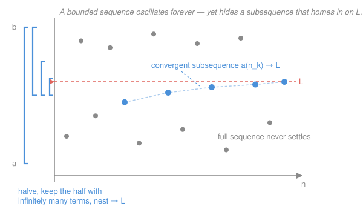

# Real Analysis · Lesson 2.3: Subsequences and Bolzano–Weierstrass

> ⏱ ~15 min · Module 2: Sequences · Builds on: [2.2 Limit laws and the squeeze](02-02-limit-laws-and-squeeze.md), [1.3 Consequences of completeness](01-03-consequences-of-completeness.md) · Unlocks: [2.4 Cauchy sequences](02-04-cauchy-sequences.md)

## Why this matters

A sequence like $(-1)^n$ never converges — it just flips between $-1$ and $1$ forever. But it isn't *chaotic*: read only its even terms and you get a dead-constant $1$. The lesson's headline theorem, Bolzano–Weierstrass, says this is universal: **any bounded sequence, however jittery, contains a thread that converges.** That guarantee is the engine behind the Extreme Value Theorem, sequential compactness, and half the existence proofs in analysis — whenever you need "there is a point where…", B–W is usually what hands it to you. It's also where the completeness you built in Module 1 finally cashes out.

## The idea

Picture a bounded sequence as a swarm of dots trapped between two horizontal lines. They can bounce around all they like, but they're confined to a finite strip — so they can't spread out to escape. Infinitely many dots crammed into a finite height must **pile up** somewhere; some altitude gets visited arbitrarily closely, infinitely often. Aim a subsequence at that altitude and you have convergence.

The way to *find* the pile-up point is a hunt-and-halve: split the strip in two, keep whichever half still holds infinitely many dots, split again, keep again. The intervals shrink to a single point $L$ — the completeness of $\mathbb{R}$ guarantees they close onto something — and the terms you collected along the way march right into it.

By contrast, a subsequence is not "any old subset." You must read the terms **in their original order**, skipping is allowed but backtracking is not, and you must keep going forever. And the whole promise needs boundedness: let the dots escape upward, like $a_n = n$, and there's nothing to pile onto.

## The formal version

**Subsequence.** Given a sequence $(a_n)$, choose indices $n_1 < n_2 < n_3 < \cdots$ (strictly increasing natural numbers). The sequence $(a_{n_k})_{k\ge 1}$ is a **subsequence** of $(a_n)$.
*In words:* pick out some of the terms, keep their order, never stop — e.g. from $(a_n)$ the even-indexed terms $a_2, a_4, a_6,\dots$

A number $L$ is a **subsequential limit** of $(a_n)$ if some subsequence converges to $L$.

**Lemma (limits are inherited).** If $a_n \to L$, then *every* subsequence also $\to L$.
*In words:* if the whole sequence settles, so does every thread you pull from it.

> *Proof.* Fix $\varepsilon>0$. Since $a_n\to L$, there is $N$ with $|a_n-L|<\varepsilon$ for all $n\ge N$. Because the indices strictly increase, $n_k \ge k$ (an easy induction: $n_1\ge 1$, and $n_{k}>n_{k-1}\ge k-1$ forces $n_k\ge k$). So for every $k\ge N$ we have $n_k\ge k\ge N$, hence $|a_{n_k}-L|<\varepsilon$. Thus $a_{n_k}\to L$. $\blacksquare$

This lemma is a **divergence weapon**: to prove $(a_n)$ diverges, exhibit two subsequences with different limits — they can't both be inherited from one $L$. For $(-1)^n$: the even terms $\to 1$, the odd terms $\to -1$, $1\ne -1$, so $(-1)^n$ diverges. One line, no $\varepsilon$.

**Bolzano–Weierstrass.** Every bounded sequence of real numbers has a convergent subsequence.
*In words:* trapped in a finite strip, infinitely many terms must funnel into some limit.

> *Proof (bisection).* Say every term lies in $I_0=[a,b]$. Cut $I_0$ at its midpoint into two closed halves. Infinitely many terms sit in $I_0$; they split between the two halves, so at least one half contains $a_n$ for **infinitely many** indices $n$ — call that half $I_1$. Repeat forever: given $I_k$ holding infinitely many terms, bisect it and let $I_{k+1}$ be a half still holding infinitely many. This builds nested closed intervals
> $$I_0 \supseteq I_1 \supseteq I_2 \supseteq \cdots, \qquad \operatorname{length}(I_k)=\frac{b-a}{2^{k}}\to 0.$$
> By the **Nested Interval Theorem** from [1.3](01-03-consequences-of-completeness.md) — the completeness payoff — the intersection $\bigcap_k I_k$ is nonempty, and since the lengths shrink to $0$ it is a single point $L$.
> Now assemble the subsequence. Pick any $n_1$ with $a_{n_1}\in I_1$. Having chosen $n_1<\cdots<n_{k-1}$, use the fact that $I_k$ contains infinitely many terms to pick an index $n_k > n_{k-1}$ with $a_{n_k}\in I_k$ (there's always a fresh one past $n_{k-1}$). Both $a_{n_k}$ and $L$ lie in $I_k$, so
> $$|a_{n_k}-L|\le \operatorname{length}(I_k)=\frac{b-a}{2^{k}}\to 0.$$
> Hence $a_{n_k}\to L$. $\blacksquare$

**$\limsup$ and $\liminf$.** For a bounded sequence, let $s_N=\sup_{n\ge N}a_n$. Each $s_N$ is finite, and $s_N$ is non-increasing in $N$ (a sup over a smaller set can only drop), so by the Monotone Convergence Theorem from [2.2](02-02-limit-laws-and-squeeze.md) it converges. Define
$$\limsup_{n\to\infty} a_n=\lim_{N\to\infty}\,\sup_{n\ge N}a_n=\inf_N\sup_{n\ge N}a_n,\qquad \liminf_{n\to\infty} a_n=\lim_{N\to\infty}\,\inf_{n\ge N}a_n=\sup_N\inf_{n\ge N}a_n.$$
*In words:* $\limsup$ is the sequence's **eventual ceiling** — the smallest bar the tail eventually stays under (to any slack) — and $\liminf$ is the **eventual floor**. Equivalently, $\limsup a_n$ is the *largest* subsequential limit and $\liminf a_n$ the *smallest*; every subsequential limit lands between them.

**Convergence criterion.** For a bounded sequence, $a_n\to L \iff \limsup a_n=\liminf a_n=L$.
*In words:* a sequence converges exactly when its ceiling and floor pinch together — one number squeezed from above and below.

## Picture

## Worked examples

**Example 1 (mechanical — extract, diagnose, read off the ceiling/floor).** Let $a_n=(-1)^n\dfrac{n}{n+1}$.
Split by parity. Even $n=2k$: $a_{2k}=\dfrac{2k}{2k+1}\to 1$. Odd $n=2k-1$: $a_{2k-1}=-\dfrac{2k-1}{2k}\to -1$. Two subsequences, two different limits $\Rightarrow$ by the lemma $(a_n)$ **diverges**. The subsequential limits are exactly $\{-1,1\}$, so $\limsup a_n=1$ and $\liminf a_n=-1$. The gap between ceiling and floor is precisely the "amount of non-convergence."

**Example 2 (why you'd care — the seed of sequential compactness).** *Claim:* every sequence $(a_n)$ with all terms in a closed bounded interval $[a,b]$ has a subsequence converging to a point **of $[a,b]$**.
The sequence is bounded, so Bolzano–Weierstrass gives a convergent subsequence $a_{n_k}\to L$. Each $a_{n_k}\in[a,b]$, and limits respect non-strict inequalities (a fact from [2.2](02-02-limit-laws-and-squeeze.md)): $a\le a_{n_k}\le b$ for all $k$ forces $a\le L\le b$. So $L\in[a,b]$. This is exactly the property — "every sequence has a subsequence converging inside the set" — that Module 4 will name *sequential compactness* and Module 5 will use to prove the Extreme Value Theorem. B–W is where that machine gets its fuel.

## Watch out

- You might think any infinite sub-collection of terms is a subsequence. It isn't — the indices must be **strictly increasing**. Reordering $a_2,a_1,a_4,a_3,\dots$ is a rearrangement, not a subsequence, and it can converge when the original doesn't (order carries information).
- You might think a subsequence can quit early or stall. No — $(n_k)$ runs off to infinity, so $n_k\ge k$; a subsequence is an *infinite* thread reaching arbitrarily far out. This is exactly what makes the inheritance lemma work.
- You might think B–W holds for any sequence. It needs **boundedness**: $a_n=n$ has no convergent subsequence, because every subsequence $n_k\to\infty$ too. Drop the strip and the pile-up point can escape to infinity.
- You might read $\limsup a_n=1$ as "$a_n$ gets close to $1$ once." It means $a_n$ gets close to $1$ **infinitely often** (it's the largest *repeatable* value) while eventually staying below $1+\varepsilon$. Ceiling, not a single spike.

## One-liner

> Any bounded sequence, no matter how restless, hides a convergent thread — halve the interval keeping the crowded half, and completeness closes the trap on the limit.

## Problems

**P1 (🟢)** Let $a_n=(-1)^n+\dfrac{1}{n}$. Prove $(a_n)$ diverges by exhibiting two subsequences with different limits, and state $\limsup a_n$ and $\liminf a_n$.

**P2 (🟡)** Suppose $(a_n)$ is bounded and *every* convergent subsequence of it converges to the same value $L$. Prove that $a_n\to L$. (Hint: if not, find a subsequence staying $\varepsilon$-far from $L$, then apply B–W to *it*.)

**P3 (🔴, optional)** Let $(a_n)$ be an enumeration of all rationals in $[0,1]$ (list them in some order, no repeats). Prove that **every** point of $[0,1]$ is a subsequential limit of $(a_n)$, and deduce $\limsup a_n=1$, $\liminf a_n=0$.

Solutions

**P1** Even $n=2k$: $a_{2k}=1+\frac{1}{2k}\to 1$. Odd $n=2k-1$: $a_{2k-1}=-1+\frac{1}{2k-1}\to -1$. Two subsequences with limits $1\ne -1$, so by the inheritance lemma no single limit exists — $(a_n)$ diverges. Every subsequential limit is $1$ or $-1$ (the $\frac1n$ term vanishes and the sign is eventually locked along any thread), so $\limsup a_n=1$ and $\liminf a_n=-1$.

**P2** Suppose, for contradiction, $a_n\not\to L$. Negating the definition: there is $\varepsilon>0$ such that for every $N$ some index $n\ge N$ has $|a_n-L|\ge\varepsilon$. Using this repeatedly, build a subsequence $(a_{n_k})$ with strictly increasing indices and $|a_{n_k}-L|\ge\varepsilon$ for all $k$. This subsequence is bounded (it lives inside the bounded $(a_n)$), so by **Bolzano–Weierstrass** it has a further convergent sub-subsequence $a_{n_{k_j}}\to M$. A subsequence of a subsequence is a subsequence of $(a_n)$, so $M$ is a convergent-subsequence limit of the original; by hypothesis $M=L$. But $|a_{n_{k_j}}-L|\ge\varepsilon$ for all $j$, and letting $j\to\infty$ gives $|M-L|\ge\varepsilon>0$ — contradicting $M=L$. Hence $a_n\to L$. $\blacksquare$

(Moral: for a bounded sequence, "unique subsequential limit" already forces convergence — equivalently $\limsup=\liminf$.)

**P3** Fix any $x\in[0,1]$. By density of $\mathbb{Q}$ (from [1.3](01-03-consequences-of-completeness.md)), every interval $(x-\varepsilon,x+\varepsilon)$ contains infinitely many rationals of $[0,1]$ — if only finitely many rationals lay within $\frac1m$ of $x$ for some $m$, density inside $(x-\frac1m,x+\frac1m)\cap[0,1]$ would be violated. So we can choose indices: pick $n_1$ with $|a_{n_1}-x|<1$; having chosen $n_1<\cdots<n_{k-1}$, since infinitely many terms lie within $\frac1k$ of $x$, pick $n_k>n_{k-1}$ with $|a_{n_k}-x|<\frac1k$. Then $a_{n_k}\to x$, so $x$ is a subsequential limit. As $x\in[0,1]$ was arbitrary, every point of $[0,1]$ is one.
Since $\limsup$ is the largest subsequential limit and $\liminf$ the smallest, and the subsequential limits are all of $[0,1]$, we get $\limsup a_n=1$ and $\liminf a_n=0$. (No term or limit escapes $[0,1]$, since every $a_n\in[0,1]$.) $\blacksquare$

## Flashback

**From Lesson 2.2 (Limit laws and the squeeze):** Define $x_1=\sqrt{2}$ and $x_{n+1}=\sqrt{2+x_n}$. Prove $(x_n)$ converges and find its limit.

Solution

**Bounded above by $2$** (induction). Base: $x_1=\sqrt2<2$. Step: if $x_n<2$ then $x_{n+1}=\sqrt{2+x_n}<\sqrt{2+2}=2$. So $x_n<2$ for all $n$.

**Increasing.** Since all terms are positive, compare squares:
$$x_{n+1}^2-x_n^2=(2+x_n)-x_n^2=-(x_n^2-x_n-2)=-(x_n-2)(x_n+1).$$
With $0<x_n<2$: $(x_n-2)<0$ and $(x_n+1)>0$, so the product is negative and $-(\,\cdot\,)>0$. Thus $x_{n+1}^2>x_n^2$, hence $x_{n+1}>x_n$. The sequence is strictly increasing.

**Converges.** Increasing and bounded above $\Rightarrow$ by the **Monotone Convergence Theorem** it converges to some $L\le 2$.

**Find $L$.** Take limits in $x_{n+1}=\sqrt{2+x_n}$ (the subsequence $x_{n+1}$ shares the limit $L$ by the inheritance lemma, and $\sqrt{\cdot}$ is continuous): $L=\sqrt{2+L}$, so $L^2=2+L$, i.e. $L^2-L-2=(L-2)(L+1)=0$. Since $L\ge x_1>0$, $L=2$. $\blacksquare$

## Connections

- **Backward:** the whole proof stands on the Nested Interval Theorem of [1.3](01-03-consequences-of-completeness.md) — bisection manufactures the nested intervals, completeness closes them onto $L$. The $\limsup$/$\liminf$ definitions run on the Monotone Convergence Theorem of [2.2](02-02-limit-laws-and-squeeze.md).
- **Forward:** [2.4](02-04-cauchy-sequences.md) uses B–W to prove the Cauchy criterion — a Cauchy sequence is bounded, so it has a convergent subsequence, and Cauchy-ness drags the whole sequence to that subsequence's limit. Module 4 abstracts today's "convergent subsequence inside the set" into *sequential compactness* and Heine–Borel; Module 5 turns it into the Extreme Value Theorem.
- **Sideways:** the bisection hunt is the same algorithm as the bisection root-finder that returns in Module 5's Intermediate Value Theorem, and the "trapped in a finite region forces accumulation" idea is exactly the pigeonhole spirit behind compactness arguments throughout later analysis and `topology`.
