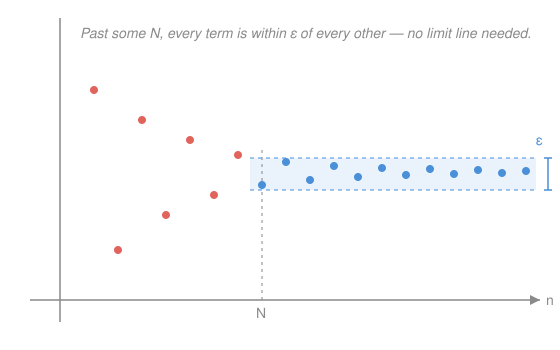

# Real Analysis · Lesson 2.4: Cauchy sequences

> ⏱ ~15 min · Module 2: Sequences · Builds on: [2.3 Subsequences and Bolzano–Weierstrass](02-03-subsequences-bolzano-weierstrass.md) · Unlocks: Module 3 (series), [3.1 Series and the Cauchy criterion](03-01-series-and-cauchy-criterion.md)

## Why this matters

Every convergence proof so far has a catch: the ε–N definition makes you name the limit $L$ before you can prove you reach it. That's fine for $1/n \to 0$. It's useless the moment the limit is *the thing you're trying to discover* — an unknown real number, or a sum $\sum 1/k^2$ you can't evaluate in closed form. Cauchy's idea rewrites convergence so you never mention $L$ at all: a sequence converges exactly when its own terms crowd together. That single reframing is what lets analysis prove things *exist* — it's the sequence-level face of the completeness of $\mathbb{R}$, and the tool Module 3 uses to test series.

## The idea

Watch a convergent sequence settle. Once the terms are all snuggled up near their limit, they're also snuggled up near *each other* — a limit is a meeting point, and things meeting at one point are close to one another on the way in. That second description never names the meeting point. It only says: **eventually, any two terms you pick are within a hair of each other.**

Cauchy's bet is that this is not just a *symptom* of convergence but *equivalent* to it — that mutual bunching is enough to force a limit into existence, even when you can't say what it is. On the real line that bet pays off. The terms tell you they're converging by their own behavior; you extract the limit afterward.

## The formal version

Throughout, $(a_n)$ is a sequence of real numbers and $\varepsilon > 0$ is an arbitrary error tolerance; $N$ is a threshold index we get to choose in response to $\varepsilon$.

**Definition (Cauchy sequence).** $(a_n)$ is **Cauchy** iff
$$\forall\,\varepsilon>0\ \ \exists\, N\ \ \forall\, m,n>N:\quad |a_m-a_n|<\varepsilon.$$

In words: however small a tolerance $\varepsilon$ you demand, past some point $N$ *every* pair of terms is within $\varepsilon$ of each other. Compare the ε–N definition of convergence from [2.1](02-01-convergence-epsilon-n.md): there the inequality was $|a_n - L| < \varepsilon$, a term measured against the **limit**; here it's $|a_m - a_n| < \varepsilon$, terms measured against **each other**. The limit has vanished from the statement — that's the entire point.

**Theorem (Cauchy Criterion).** A sequence of real numbers converges **if and only if** it is Cauchy.

In words: on $\mathbb{R}$, "bunches up internally" and "has a limit" are the same condition — so you may prove convergence without ever producing the limit.

*Proof.*

**(⟹) Convergent ⟹ Cauchy.** Suppose $a_n \to L$. Let $\varepsilon>0$. Convergence (applied with tolerance $\varepsilon/2$) gives an $N$ with $|a_n - L| < \varepsilon/2$ for all $n>N$. Then for any $m,n>N$, the triangle inequality routes both terms through $L$:
$$|a_m - a_n| = |(a_m - L) + (L - a_n)| \le |a_m - L| + |a_n - L| < \tfrac{\varepsilon}{2} + \tfrac{\varepsilon}{2} = \varepsilon.$$
So $(a_n)$ is Cauchy. (The $\varepsilon/2$ trick: split your budget in two, spend half on each term.)

**(⟸) Cauchy ⟹ convergent.** This is the direction that needs $\mathbb{R}$, and it's where [2.3](02-03-subsequences-bolzano-weierstrass.md) pays off. Three steps.

1. *A Cauchy sequence is bounded.* Apply the definition with $\varepsilon = 1$: there is an $N_0$ with $|a_m - a_{N_0+1}| < 1$ for all $m > N_0$. So every term past $N_0$ lies within distance $1$ of the fixed number $a_{N_0+1}$. The finitely many earlier terms $a_1,\dots,a_{N_0}$ are automatically bounded, so the whole sequence is bounded (same argument as boundedness of convergent sequences in 2.1, but we never needed a limit).

2. *Extract a convergent subsequence.* Bounded, so **Bolzano–Weierstrass** ([2.3](02-03-subsequences-bolzano-weierstrass.md)) hands us a subsequence $a_{n_k} \to L$ for some real $L$. This is the only place the limit enters — and it enters as a gift from completeness, not from a formula.

3. *The whole sequence chases the subsequence to $L$.* Let $\varepsilon>0$. Cauchy gives $N$ with $|a_m - a_n| < \varepsilon/2$ for all $m,n>N$. Convergence of the subsequence gives an index $n_k > N$ with $|a_{n_k} - L| < \varepsilon/2$. Now for any $n > N$, split through $a_{n_k}$:
$$|a_n - L| \le |a_n - a_{n_k}| + |a_{n_k} - L| < \tfrac{\varepsilon}{2} + \tfrac{\varepsilon}{2} = \varepsilon.$$
So $a_n \to L$. $\ \blacksquare$

Notice the labor split: the *subsequence* supplies a candidate limit, and the *Cauchy* condition drags the stragglers in behind it.

**Completeness, restated.** "$\mathbb{R}$ is **complete**" means exactly: *every Cauchy sequence of reals converges.* This is the same completeness as the least upper bound axiom of [1.2](01-02-suprema-infima-completeness.md) — indeed the (⟸) proof leaned on Bolzano–Weierstrass, which leaned on that axiom. The rationals $\mathbb{Q}$ fail it: take $a_n$ = the decimal $1.41421\ldots$ truncated to $n$ digits. Each $a_n$ is rational, the terms bunch up ($|a_m - a_n| < 10^{-\min(m,n)+1}$, so it *is* Cauchy), but the only number they close in on is $\sqrt2 \notin \mathbb{Q}$. Inside $\mathbb{Q}$ this sequence is Cauchy with **no limit** — it converges to a hole. It's the very gap from [1.1](01-01-gap-in-the-rationals.md), now visible one term at a time. This "every Cauchy sequence converges" is the definition of completeness that generalizes verbatim to metric spaces in `topology`, where least-upper-bounds no longer make sense but distances still do.

## Picture

The terms oscillate wildly at first (red), then past $N$ every one of them (blue) fits inside a band of height $\varepsilon$. Crucially, **there is no horizontal limit line** — we never drew one, because the Cauchy condition is about the terms' distance from *each other*, not from any center. Shrink $\varepsilon$ and $N$ slides right; the band always closes.

## Worked examples

**Example 1 (Cauchy without knowing the limit).** Let $a_n = \sum_{k=1}^n \frac{1}{k^2} = 1 + \frac14 + \frac19 + \cdots + \frac{1}{n^2}$. We'll prove $(a_n)$ converges *without evaluating the sum*. Take $m > n$. The difference is a tail:
$$|a_m - a_n| = \sum_{k=n+1}^{m}\frac{1}{k^2}.$$
Bound each term by a telescoping one, using $\frac{1}{k^2} < \frac{1}{k(k-1)} = \frac{1}{k-1} - \frac1k$:
$$\sum_{k=n+1}^{m}\frac{1}{k^2} < \sum_{k=n+1}^{m}\left(\frac{1}{k-1} - \frac1k\right) = \frac1n - \frac1m < \frac1n.$$
So $|a_m - a_n| < \frac1n$. Given $\varepsilon>0$, choose any $N > \frac1\varepsilon$; then for all $m>n>N$ we get $|a_m - a_n| < \frac1n < \frac1N < \varepsilon$. The sequence is Cauchy, hence (by the criterion) **convergent**. We proved a limit exists having no idea it equals $\frac{\pi^2}{6}$ — which is the whole power of the tool. Module 3 will call this exact move the *Cauchy criterion for series*.

**Example 2 (the criterion as a detector of divergence).** For the harmonic partial sums $H_n = \sum_{k=1}^n \frac1k$, the terms $\frac1k \to 0$, so consecutive sums barely move. Yet look at a *far-apart* pair, $n$ and $2n$:
$$H_{2n} - H_n = \sum_{k=n+1}^{2n}\frac1k \ge n \cdot \frac{1}{2n} = \frac12,$$
since each of the $n$ terms is at least $\frac{1}{2n}$. No matter how large $N$ is, we can find $m=2n > n > N$ with $|H_m - H_n| \ge \frac12$. So $(H_n)$ is **not Cauchy**, and the criterion certifies it **diverges** — even though the gaps between neighbors vanish. Contrast Example 1: same shape of object (a growing sum), opposite verdict, decided entirely by whether the tails can be made uniformly small.

## Watch out

- You might think "consecutive terms get close, $|a_{n+1} - a_n| \to 0$, so the sequence is Cauchy." **No** — $H_n$ is the standing counterexample: neighbors close in, yet the sequence diverges. Cauchy demands *all* pairs $m,n>N$ close simultaneously, and a slow leak across many small steps (here, doubling the index adds $\ge \frac12$) defeats that. Neighbor-closeness is necessary, never sufficient.
- You might think being Cauchy is a property of the sequence *and its home*. Careful: the terms of Example 1 and the $\sqrt2$-truncations are Cauchy no matter where you view them — but whether they **converge** depends on whether the limit lives in your number system. Cauchy is intrinsic; "converges" needs completeness. That gap *is* the difference between $\mathbb{Q}$ and $\mathbb{R}$.
- You might think you still have to find $L$ eventually. For *existence* you don't — that's the point. The criterion certifies a limit exists; pinning its value is a separate (often harder, sometimes impossible-in-closed-form) job.

## One-liner

> A sequence converges exactly when its own terms bunch together — Cauchy lets you prove a limit exists without ever naming it, and "every Cauchy sequence converges" *is* the completeness of $\mathbb{R}$.

## Problems

**P1 (🟢)** Prove directly from the definition that $a_n = \dfrac{(-1)^n}{n}$ is Cauchy. (Don't use that it converges to $0$ — work with $|a_m - a_n|$.)

**P2 (🟡)** Show that $b_n = \sum_{k=1}^{n} \dfrac{1}{\sqrt{k}}$ is **not** Cauchy, hence diverges. (Mimic Example 2: compare $b_{2n}$ and $b_n$, bounding each of the $n$ new terms below.)

**P3 (🔴, optional)** *Contractive sequences — the engine behind Newton's iteration.* Suppose $(a_n)$ satisfies $|a_{n+1} - a_n| \le r\,|a_n - a_{n-1}|$ for all $n \ge 2$, with a fixed constant $0 \le r < 1$. Prove $(a_n)$ is Cauchy, hence converges. (Hint: first show $|a_{n+1}-a_n| \le r^{\,n-1}|a_2 - a_1|$, then bound $|a_m - a_n|$ for $m>n$ by a geometric tail.)

Solutions

**P1** For any $m,n$, the triangle inequality gives
$$|a_m - a_n| = \left|\frac{(-1)^m}{m} - \frac{(-1)^n}{n}\right| \le \frac{1}{m} + \frac{1}{n}.$$
Let $\varepsilon>0$ and choose $N > \frac{2}{\varepsilon}$. Then for all $m,n>N$ we have $\frac1m < \frac{1}{N} < \frac{\varepsilon}{2}$ and likewise $\frac1n < \frac{\varepsilon}{2}$, so $|a_m - a_n| < \frac{\varepsilon}{2} + \frac{\varepsilon}{2} = \varepsilon$. Hence $(a_n)$ is Cauchy. (We never mentioned the limit $0$.)

**P2** Take the far-apart pair $n$ and $2n$:
$$b_{2n} - b_n = \sum_{k=n+1}^{2n}\frac{1}{\sqrt{k}} \ge n \cdot \frac{1}{\sqrt{2n}} = \frac{n}{\sqrt{2n}} = \sqrt{\frac{n}{2}} \xrightarrow[n\to\infty]{} \infty,$$
because each of the $n$ terms has $k \le 2n$, so $\frac{1}{\sqrt k} \ge \frac{1}{\sqrt{2n}}$. Fix $\varepsilon = 1$. For *any* threshold $N$, pick $n > N$ large enough that $\sqrt{n/2} \ge 1$ (any $n \ge 2$ works); then $m = 2n > n > N$ but $|b_m - b_n| \ge 1 = \varepsilon$. So the Cauchy condition fails, and $(b_n)$ diverges. (This is the $p=\tfrac12 \le 1$ case of the series $\sum k^{-p}$ — the same $p$-threshold you met for improper integrals in `calc-refresher`, now proved for sums.)

**P3** *Step 1.* Iterating the contraction hypothesis $n-1$ times:
$$|a_{n+1}-a_n| \le r|a_n - a_{n-1}| \le r^2|a_{n-1}-a_{n-2}| \le \cdots \le r^{\,n-1}|a_2 - a_1|.$$
Write $D = |a_2 - a_1|$ for the initial gap.

*Step 2.* For $m > n$, telescope through consecutive differences and apply Step 1 to each:
$$|a_m - a_n| \le \sum_{k=n}^{m-1}|a_{k+1} - a_k| \le \sum_{k=n}^{m-1} r^{\,k-1} D = D\, r^{\,n-1}\sum_{j=0}^{m-n-1} r^{\,j} \le D\,r^{\,n-1}\sum_{j=0}^{\infty} r^{\,j} = \frac{D\,r^{\,n-1}}{1-r},$$
where the geometric series converges because $0 \le r < 1$.

*Step 3.* Since $r^{\,n-1} \to 0$, the bound $\frac{D\,r^{n-1}}{1-r} \to 0$. Given $\varepsilon>0$, choose $N$ large enough that $\frac{D\,r^{\,N-1}}{1-r} < \varepsilon$ (possible since the bound is decreasing to $0$; if $D=0$ the sequence is constant and trivially Cauchy). Then for all $m > n > N$, $|a_m - a_n| \le \frac{D\,r^{\,n-1}}{1-r} < \varepsilon$. So $(a_n)$ is Cauchy, hence converges. 

This is exactly why Newton's iteration for $\sqrt2$ (Boss problem 2, see [../syllabus.md](../syllabus.md)) converges *before* you know the answer is $\sqrt2$: show the map contracts, and the Cauchy criterion delivers a limit — the argument to trust when you can't guess the value.

## Flashback

**From Lesson 2.3 (Subsequences and Bolzano–Weierstrass):** Consider $c_n = (-1)^n \dfrac{n}{n+1}$. Show $(c_n)$ is bounded, then exhibit two subsequences converging to two *different* limits — and conclude $(c_n)$ has no limit.

Solution

Boundedness: $\frac{n}{n+1} \in (0,1)$ for all $n\ge1$, so $|c_n| = \frac{n}{n+1} < 1$; the sequence lives in $(-1,1)$.

Two subsequences:
- Even indices $n = 2k$: $c_{2k} = \dfrac{2k}{2k+1} \to 1$ (numerator and denominator differ by $1$, ratio $\to 1$).
- Odd indices $n = 2k+1$: $c_{2k+1} = -\dfrac{2k+1}{2k+2} \to -1$.

The subsequential limits $1$ and $-1$ are different. By the uniqueness half of the subsequence theorem from 2.3 — every subsequence of a convergent sequence must share the parent's limit — a sequence with two distinct subsequential limits cannot converge. So $(c_n)$ diverges. (Sanity check with today's lesson: it isn't Cauchy either — $|c_{2k} - c_{2k+1}| \to 2$, so far-apart terms never bunch.)

## Connections

- **Backward:** the hard direction *is* [2.3](02-03-subsequences-bolzano-weierstrass.md)'s Bolzano–Weierstrass wearing a limit-free disguise, and completeness here is the [1.2](01-02-suprema-infima-completeness.md) least-upper-bound axiom re-expressed for sequences — the same hole in $\mathbb{Q}$ first seen in [1.1](01-01-gap-in-the-rationals.md).
- **Forward:** Module 3 opens with the **Cauchy criterion for series** in [3.1](03-01-series-and-cauchy-criterion.md) — Example 1's tail-bounding move, applied to partial sums, becomes the master convergence test that doesn't require summing.
- **Sideways (`topology`):** "every Cauchy sequence converges" is the definition of completeness that survives when suprema don't — it's how you complete a metric space (and how the reals are *built* from $\mathbb{Q}$ in one standard construction). The contractive-sequence result of P3 is the seed of the Banach fixed-point theorem.
