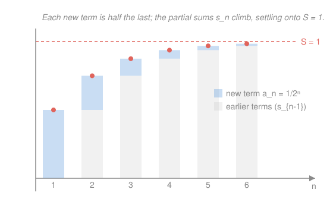

# Real Analysis · Lesson 3.1: Series and the Cauchy criterion

> ⏱ ~15 min · Module 3: Series · Builds on: [2.4 Cauchy sequences](02-04-cauchy-sequences.md) · Unlocks: [3.2 Convergence tests](03-02-convergence-tests.md)

## Why this matters

A series is how you add up infinitely many things — the present value of a payment stream, the Taylor expansion that *defines* $e^x$, the probability that a random walk ever returns home. All of them are sums with no last term, and "keep adding" is not, by itself, a number. This lesson does one liberating thing: it declares that a series is nothing new. It's a **sequence** — the sequence of running totals — so the entire machinery of Module 2 (limits, Cauchy, completeness) transfers wholesale. The only genuinely new phenomena, absolute vs. conditional convergence and rearrangement, wait in Lesson 3.3; everything else you already own.

## The idea

You never actually add infinitely many numbers. What you do is add the first one, then the first two, then the first three — producing a *sequence* of honest, finite totals $s_1, s_2, s_3, \dots$ — and then ask the Module 2 question: does that sequence have a limit? If the running totals settle onto a number $S$, you *name* that number "the sum." If they don't, the series has no sum and we say it diverges. The infinite sum is a limit of finite sums, nothing more mysterious than that.

So a series is a sequence wearing a disguise. Peel off the word "sum" and you are back on familiar ground: to understand $\sum a_k$, watch the sequence $(s_n)$ of its partial sums and apply everything you know about sequences. In particular, [2.4](02-04-cauchy-sequences.md)'s Cauchy criterion — "converges iff the terms bunch together" — becomes a convergence test for series that never asks you to find the sum.

## The formal version

Let $(a_k)_{k\ge 1}$ be a sequence of real numbers — the **terms**. The **$n$th partial sum** is the finite total
$$s_n = \sum_{k=1}^{n} a_k = a_1 + a_2 + \cdots + a_n.$$

**Definition (convergence of a series).** The series $\sum_{k=1}^{\infty} a_k$ **converges** iff the sequence of partial sums $(s_n)$ converges; in that case its **value** (or **sum**) is
$$\sum_{k=1}^{\infty} a_k = \lim_{n\to\infty} s_n = S.$$
If $(s_n)$ diverges, the series **diverges** and has no value.

> In words: the sum of a series *is* the limit of its running totals — no limit, no sum. A series is a sequence $(s_n)$ with a bookkeeping story attached.

**Theorem (geometric series).** For a fixed ratio $r\in\mathbb{R}$,
$$\sum_{k=0}^{\infty} r^k = \frac{1}{1-r} \quad\text{if } |r|<1, \qquad\text{and it diverges if } |r|\ge 1.$$

> In words: a sum whose terms shrink by a constant factor $r$ has a clean closed value — provided the shrinkage is genuine ($|r|<1$).

*Proof.* Take the partial sum $s_n = 1 + r + r^2 + \cdots + r^n$ and multiply by $r$: $\,r\,s_n = r + r^2 + \cdots + r^{n+1}$. Subtract to collapse the middle:
$$(1-r)s_n = 1 - r^{n+1}\quad\Longrightarrow\quad s_n = \frac{1 - r^{n+1}}{1-r}\quad(r\ne 1).$$
If $|r|<1$ then $r^{n+1}\to 0$ (the factor $|r|^{n+1}$ decays geometrically), so $s_n \to \frac{1}{1-r}$. If $|r|\ge 1$ the terms $r^k$ have $|r^k|\ge 1$ for all $k$, so they cannot tend to $0$ — and by the next theorem that alone forces divergence (for $r=1$, $s_n = n+1\to\infty$ directly). $\ \blacksquare$

**Theorem ($n$th-term test / divergence test).** If $\sum_{k=1}^\infty a_k$ converges, then $a_k \to 0$.

> In words: for a series to have any hope of summing, its terms must die out — so if they *don't* vanish, stop, the series diverges.

*Proof.* Suppose the series converges to $S$, i.e. $s_n \to S$. Since also $s_{n-1}\to S$ (a shifted copy of the same convergent sequence), and $a_n = s_n - s_{n-1}$,
$$a_n = s_n - s_{n-1} \longrightarrow S - S = 0. \qquad\blacksquare$$

The contrapositive is the useful form: **if $a_k \not\to 0$, then $\sum a_k$ diverges.** That is the whole test — one glance at the terms. But read the arrow carefully: it runs *one way only*. Terms going to zero is **necessary, not sufficient** (the harmonic series below is the eternal warning).

**Theorem (Cauchy criterion for series).** $\sum_{k=1}^\infty a_k$ converges **iff** for every $\varepsilon>0$ there is an $N$ such that for all $n>m>N$,
$$\left|\sum_{k=m+1}^{n} a_k\right| < \varepsilon.$$

> In words: a series converges exactly when every *sufficiently late block of terms* has arbitrarily small total — you can prove it converges without ever knowing the sum.

*Proof.* This is [2.4](02-04-cauchy-sequences.md) applied to the sequence $(s_n)$, no new work. The block sum telescopes: $\sum_{k=m+1}^{n} a_k = s_n - s_m$. So the displayed condition says exactly "$|s_n - s_m|<\varepsilon$ for all $n>m>N$" — that $(s_n)$ is a Cauchy sequence. By the Cauchy criterion for sequences, $(s_n)$ converges iff it is Cauchy; and $(s_n)$ converging *is* the series converging. $\ \blacksquare$

## Picture

The series $\sum_{k=1}^\infty \frac{1}{2^k}$ (a geometric series with first term $\frac12$ and ratio $\frac12$). Each bar is a partial sum $s_n$; the highlighted top slice is the *new* term $a_n = \frac{1}{2^n}$, and it is exactly half the slice before it. The running totals never reach $S=1$ — no finite sum does — yet they close every gap, so the **limit** is $1$. That gap-closing is the Cauchy criterion made visible: shrink $\varepsilon$, and past some $N$ the remaining stack of slices totals less than $\varepsilon$.

## Worked examples

**Example 1 (a telescoping sum — the partial sum collapses).** Evaluate $\sum_{k=1}^{\infty} \dfrac{1}{k(k+1)}$. The trick is that each term is a *difference*: partial fractions give $\frac{1}{k(k+1)} = \frac{1}{k} - \frac{1}{k+1}$. Now the partial sum telescopes — adjacent pieces cancel in a chain:
$$s_n = \sum_{k=1}^{n}\left(\frac1k - \frac{1}{k+1}\right) = \left(1-\tfrac12\right)+\left(\tfrac12-\tfrac13\right)+\cdots+\left(\tfrac1n-\tfrac1{n+1}\right) = 1 - \frac{1}{n+1}.$$
Everything in the interior dies; only the first and last survivors remain. Then $s_n = 1 - \frac{1}{n+1} \to 1$, so the series converges and
$$\sum_{k=1}^\infty \frac{1}{k(k+1)} = 1.$$
This is the ideal case: we didn't *estimate* the sum, we found $(s_n)$ in closed form and took a limit — the definition executed literally.

**Example 2 (the standing warning — the harmonic series diverges).** The terms of $\sum_{k=1}^\infty \frac1k$ satisfy $\frac1k \to 0$, so the $n$th-term test is silent — it gives no verdict. Yet the series **diverges**, and here is Oresme's classic grouping proof. Bracket the terms in blocks whose lengths double, and bound each block *below* by replacing its terms with the smallest one:
$$H_n = 1 + \underbrace{\tfrac12}_{\ge\,1/2} + \underbrace{\left(\tfrac13+\tfrac14\right)}_{\ge\,2\cdot\frac14 = 1/2} + \underbrace{\left(\tfrac15+\cdots+\tfrac18\right)}_{\ge\,4\cdot\frac18 = 1/2} + \underbrace{\left(\tfrac19+\cdots+\tfrac1{16}\right)}_{\ge\,8\cdot\frac1{16}=1/2}+\cdots$$
The block ending at $\frac{1}{2^j}$ has $2^{j-1}$ terms, each $\ge \frac{1}{2^j}$, so it totals $\ge \frac12$. Collecting $m$ such blocks,
$$H_{2^m} \ge 1 + \frac{m}{2} \xrightarrow[m\to\infty]{} \infty.$$
The partial sums are unbounded, so they diverge — the sum is infinite. Vanishing terms bought nothing: the harmonic series is the counterexample that keeps the $n$th-term test honest. (In [2.4](02-04-cauchy-sequences.md) you saw the same divergence a second way — the block $H_{2n}-H_n \ge \frac12$ shows $(H_n)$ isn't Cauchy. Two proofs, one moral.)

## Watch out

- You might think "$a_k \to 0$, therefore $\sum a_k$ converges." **The harmonic series says no.** Term-decay is *necessary* for convergence, never *sufficient* — the $n$th-term test can only ever prove **divergence** (when terms *don't* vanish), never convergence. Using it in the wrong direction is the single most common series error.
- You might think a series and its sequence of terms are the same object. They are two different sequences living in one problem: the **terms** $(a_k)$ and the **partial sums** $(s_n)$. "$a_k \to 0$" is a statement about the first; "the series converges" ($s_n \to S$) is a statement about the second — and Example 2 shows the first can hold while the second fails. Never let $a_k \to 0$ stand in for $s_n \to S$.
- You might think geometric series always sum to $\frac{1}{1-r}$. Only for $|r|<1$. At $r=1$ you get $1+1+1+\cdots=\infty$; at $r=-1$ the partial sums flip between $1$ and $0$ and never settle; for $|r|>1$ the terms blow up. Plugging $r=2$ into $\frac{1}{1-r}$ to "get" $-1$ is meaningless — the formula is a *limit*, valid only where the limit exists.

## One-liner

> A series is the sequence of its partial sums in disguise — it sums to $S$ exactly when $s_n \to S$, so $a_k\to 0$ is the toll to enter, never the ticket to convergence.

## Problems

**P1 (🟢)** Evaluate $\displaystyle\sum_{k=0}^{\infty} \left(-\tfrac13\right)^{k}$, and separately determine whether $\displaystyle\sum_{k=1}^{\infty} \frac{k}{2k+1}$ converges. State which theorem decides each.

**P2 (🟡)** Show that $\displaystyle\sum_{k=1}^{\infty} \frac{1}{k(k+2)}$ converges and find its value. (Hint: partial fractions give a *gap-2* telescope — write out $s_n$ and see which four terms survive.)

**P3 (🔴, optional)** Consider $\displaystyle\sum_{k=1}^{\infty} \ln\!\left(1 + \frac1k\right)$. Its terms tend to $0$, so the $n$th-term test is inconclusive. Decide whether it converges by computing $s_n$ in closed form. (Hint: rewrite $\ln(1+\frac1k)$ as a difference of two logs — it telescopes.)

Solutions

**P1** *First sum:* geometric with $r=-\frac13$, and $|r|=\frac13<1$, so it converges (geometric series theorem) to
$$\sum_{k=0}^{\infty}\left(-\tfrac13\right)^k = \frac{1}{1-(-\frac13)} = \frac{1}{\frac43} = \frac34.$$
*Second sum:* look at the terms — $\dfrac{k}{2k+1} = \dfrac{1}{2 + 1/k} \to \dfrac12 \ne 0$. The terms don't vanish, so by the $n$th-term (divergence) test the series **diverges**. No summing required; the terms alone settle it.

**P2** Partial fractions: $\dfrac{1}{k(k+2)} = \dfrac12\!\left(\dfrac1k - \dfrac1{k+2}\right)$. Because the gap is $2$, cancellation skips a step and *two* terms survive at each end:
$$s_n = \frac12\sum_{k=1}^{n}\left(\frac1k - \frac1{k+2}\right) = \frac12\left(1 + \frac12 - \frac{1}{n+1} - \frac{1}{n+2}\right).$$
(Writing out a few terms: $\frac1k$ contributes $1,\frac12,\frac13,\dots$ while $-\frac{1}{k+2}$ subtracts $\frac13,\frac14,\dots$ — everything from $\frac13$ on cancels, leaving the head $1+\frac12$ and the two unmatched tail terms.) As $n\to\infty$ the tail terms vanish, so
$$\sum_{k=1}^\infty \frac{1}{k(k+2)} = \frac12\left(1+\frac12\right) = \frac34.$$

**P3** Rewrite each term as a difference of logs: $\ln\!\left(1+\frac1k\right) = \ln\!\dfrac{k+1}{k} = \ln(k+1) - \ln(k)$. The partial sum telescopes cleanly:
$$s_n = \sum_{k=1}^{n}\big(\ln(k+1)-\ln(k)\big) = \ln(n+1) - \ln(1) = \ln(n+1).$$
Since $\ln(n+1)\to\infty$, the partial sums are unbounded and the series **diverges** — even though its terms $\ln(1+\frac1k)\to 0$. It's a second cousin of the harmonic series (indeed $\ln(1+\frac1k)\approx \frac1k$ for large $k$), and a clean reminder that a telescoping series is not automatically a convergent one: the collapse can still leave an unbounded survivor.

## Flashback

**From Lesson 2.4 (Cauchy sequences):** Let $a_n = \sqrt{n}$. Show that consecutive terms satisfy $|a_{n+1}-a_n|\to 0$, yet $(a_n)$ is **not** Cauchy (hence diverges). Why doesn't shrinking gaps between neighbors force the Cauchy condition?

Solution

Rationalize the neighbor gap:
$$a_{n+1}-a_n = \sqrt{n+1}-\sqrt{n} = \frac{(\sqrt{n+1}-\sqrt n)(\sqrt{n+1}+\sqrt n)}{\sqrt{n+1}+\sqrt n} = \frac{1}{\sqrt{n+1}+\sqrt{n}} \longrightarrow 0.$$
So adjacent terms do crowd together. But the Cauchy condition demands *all* pairs $m,n>N$ be close, and far-apart terms are not: for the pair $n$ and $4n$,
$$a_{4n}-a_n = \sqrt{4n}-\sqrt{n} = 2\sqrt n - \sqrt n = \sqrt{n} \xrightarrow[n\to\infty]{} \infty.$$
Fix $\varepsilon = 1$: for any threshold $N$, choose $n>N$ with $\sqrt n \ge 1$; then $m=4n>n>N$ but $|a_m - a_n|\ge 1$. So $(\sqrt n)$ is **not Cauchy** and diverges (to $+\infty$). The lesson: neighbor-closeness is *necessary* for Cauchy but never *sufficient* — a slow leak accumulated over many tiny steps can still separate distant terms without bound. This is precisely the trap the harmonic series springs, now on a bare sequence. $\ \blacksquare$

## Connections

- **Backward:** the Cauchy criterion for series is [2.4](02-04-cauchy-sequences.md)'s Cauchy criterion applied verbatim to $(s_n)$ — indeed Example 1 of that lesson, bounding the tail of $\sum \frac1{k^2}$, was secretly this test — and the whole "series = sequence of partial sums" move rests on the $\varepsilon$–$N$ limit from [2.1](02-01-convergence-epsilon-n.md).
- **Forward:** the $n$th-term test only ever proves *divergence*. To prove *convergence* you need the tests of [3.2](03-02-convergence-tests.md) — comparison, ratio, root, integral — each of which is, underneath, a way of showing the partial sums are Cauchy or bounded. Absolute vs. conditional convergence and the shock of rearrangement arrive in Lesson 3.3.
- **Sideways:** the harmonic series' divergence is the discrete twin of $\int_1^\infty \frac{dx}{x} = \infty$ from `calc-refresher`'s improper-integrals lesson — the same $p=1$ borderline, and the integral test of [3.2](03-02-convergence-tests.md) will make the twinning exact. Geometric series are the backbone of discounting in `micro-refresher` (a perpetuity is $\sum c\,r^k$) and of the generating functions used throughout `probability-theory`.
