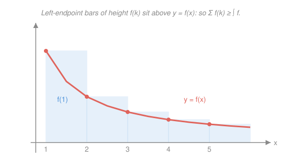

# Real Analysis · Lesson 3.2: Convergence tests

> ⏱ ~15 min · Module 3: Series · Builds on: [3.1 Series and the Cauchy criterion](03-01-series-and-cauchy-criterion.md) · Unlocks: [3.3 Absolute vs. conditional convergence](03-03-absolute-vs-conditional.md)

## Why this matters

In `calc-refresher` you learned to *run* these tests; here you learn *why they're true* — and one clean idea proves almost all of them at once. For a series of non-negative terms, the partial sums only go up, so convergence is nothing more than **boundedness**, and the completeness of $\mathbb{R}$ (via the monotone convergence theorem of [2.2](02-02-limit-laws-and-squeeze.md)) does the rest. Every test in this lesson is a way of certifying that bound without summing the series. That's the working analyst's toolkit — and the discipline of picking the right tool on the first glance, which the boss problem, power series in Module 8, and every generating function in probability will demand of you.

## The idea

Fix a series $\sum_{k=1}^\infty a_k$ with **every $a_k \ge 0$**. Its partial sums $s_n = a_1 + a_2 + \cdots + a_n$ can only climb: $s_{n+1} = s_n + a_{n+1} \ge s_n$. A monotone increasing sequence has exactly two fates — it settles to a finite limit, or it runs to $+\infty$ — and *which* one is decided by a single yes/no question: **are the $s_n$ bounded above?** If yes, converge; if no, diverge. There is no third option and no oscillation to worry about. This is the engine of the whole module.

So every test below is secretly the same test: **find a ceiling for the partial sums, or prove none exists.** Comparison borrows a ceiling from a series you already understand. The ratio and root tests manufacture a geometric ceiling out of the terms' own shape. The integral test trades the staircase of partial sums for the area under a curve. Learn to see the ceiling and the tests stop being a list to memorize.

## The formal version

Throughout, $a_k, b_k \ge 0$ and $s_n = \sum_{k=1}^n a_k$.

**Boundedness criterion (the engine).** $\sum a_k$ converges $\iff$ the partial sums $\{s_n\}$ are bounded above.

> In words: for non-negative terms, "converges" and "the running total never exceeds some fixed number" are the *same statement*.

*Proof.* $\{s_n\}$ is increasing. If bounded above, the monotone convergence theorem gives $s_n \to \sup_n s_n < \infty$. If unbounded, $s_n \to +\infty$, so it has no finite limit. $\blacksquare$

**Comparison test.** If $0 \le a_k \le b_k$ for all $k$ and $\sum b_k$ converges, then $\sum a_k$ converges. Contrapositive: if $\sum a_k$ diverges, so does $\sum b_k$.

> In words: trapped underneath a convergent series you're finite; propping up a divergent one you're infinite.

*Proof.* Let $t_n = \sum_{k=1}^n b_k$ and $B = \sum_{k=1}^\infty b_k$. Since $a_k \le b_k$, $s_n = \sum_{k=1}^n a_k \le \sum_{k=1}^n b_k = t_n \le B$ (the last step because $t_n$ increases to $B$). So the $s_n$ are bounded above by $B$; by the boundedness criterion $\sum a_k$ converges. $\blacksquare$

**Limit comparison test.** If $a_k, b_k > 0$ and $\displaystyle\lim_{k\to\infty}\frac{a_k}{b_k} = L$ with $0 < L < \infty$, then $\sum a_k$ and $\sum b_k$ converge or diverge *together*.

> In words: if two series' terms are eventually proportional, they share one fate — a messy term inherits the verdict of the benchmark it *behaves like*.

*Why.* From $a_k/b_k \to L$, there is an $N$ with $\tfrac{L}{2} < a_k/b_k < 2L$ for all $k \ge N$, i.e. $\tfrac{L}{2} b_k < a_k < 2L\, b_k$. The right inequality plus comparison: $\sum b_k$ converges $\Rightarrow \sum a_k$ converges. The left inequality: $\sum a_k$ converges $\Rightarrow \sum b_k$ converges. Both directions, so same fate.

**$p$-series.** $\displaystyle\sum_{k=1}^\infty \frac{1}{k^p}$ converges $\iff p > 1$.

> In words: the benchmark family. You need decay strictly faster than the harmonic $1/k$.

This is exactly `calc-refresher`'s improper-integral $p$-test $\big(\int_1^\infty x^{-p}\,dx$ converges iff $p>1\big)$ carried across by the next theorem.

**Integral test.** Let $f:[1,\infty)\to[0,\infty)$ be positive, decreasing, and continuous with $a_k = f(k)$. Then $\sum_{k=1}^\infty a_k$ converges $\iff \int_1^\infty f(x)\,dx$ converges.

> In words: the sum is a staircase, the integral is the ramp beneath it; each traps the other, so they live or die together.

*Why.* Because $f$ decreases, on each strip $[k, k+1]$ we have $f(k) \ge f(x) \ge f(k+1)$, so integrating over that unit strip gives $f(k) \ge \int_k^{k+1} f \ge f(k+1)$. Summing $k = 1$ to $n$:

$$\int_1^{n+1} f(x)\,dx \;\le\; \sum_{k=1}^{n} f(k) \;\le\; f(1) + \int_1^{n} f(x)\,dx.$$

If the integral converges the right bound caps the partial sums (bounded $\Rightarrow$ converges); if it diverges the left bound forces them to $+\infty$. The picture below is this inequality.

**Ratio test.** Suppose $a_k > 0$ and $\displaystyle\lim_{k\to\infty}\frac{a_{k+1}}{a_k} = L$. Then $\sum a_k$ **converges if $L < 1$**, **diverges if $L > 1$**, and is **inconclusive if $L = 1$**.

> In words: if each term is eventually a fixed fraction $L$ of the last, the series is essentially geometric with ratio $L$ — so $L < 1$ wins, $L > 1$ loses.

*Proof of the $L<1$ case.* Pick any $r$ with $L < r < 1$. Since $a_{k+1}/a_k \to L < r$, there is an $N$ with $a_{k+1}/a_k < r$, i.e. $a_{k+1} < r\,a_k$, for all $k \ge N$. Iterating, $a_{N+j} < r^{\,j} a_N$. Hence the tail is dominated by a geometric series:

$$\sum_{j=0}^\infty a_{N+j} \;\le\; a_N \sum_{j=0}^\infty r^{\,j} \;=\; \frac{a_N}{1-r} < \infty.$$

A convergent tail means a convergent series (the first $N-1$ terms are a finite number). This is comparison to a geometric series — the ratio test is nothing more. (For $L>1$, the terms eventually grow, so $a_k \not\to 0$ and the $n$th-term test of [3.1](03-01-series-and-cauchy-criterion.md) kills it.) $\blacksquare$

**Root test.** Suppose $a_k \ge 0$ and $\displaystyle\lim_{k\to\infty}\sqrt[k]{a_k} = L$. Then $\sum a_k$ **converges if $L<1$**, **diverges if $L>1$**, **inconclusive if $L=1$**. Same trichotomy, same proof idea: $\sqrt[k]{a_k} \to L < r < 1$ gives $a_k < r^k$ eventually, a geometric ceiling.

**Which test to reach for.**

- **Factorials or fixed powers ($k!$, $c^k$)** → **ratio test.** The factorial/exponential structure makes the ratio collapse.
- **The whole term is a $k$th power ($(\cdots)^k$)** → **root test.** The $k$th root cancels the $k$th power.
- **Rational in $k$ (ratios of polynomials, roots of polynomials)** → **limit comparison** to the $p$-series $1/k^{\,p}$ where $p = (\deg \text{denominator}) - (\deg \text{numerator})$.
- **Term is $f(k)$ for an $f$ you can integrate** → **integral test** (especially anything with $\ln k$).

## Picture

Each blue bar is one term $f(k)$, drawn on the strip $[k, k+1]$; the red curve is $y = f(x)$. Because $f$ decreases, every bar's left edge touches the curve at its highest point on that strip, so the bar sits **above** the curve — the staircase caps the ramp. Total bar area $\sum_{k\ge1} f(k)$ therefore exceeds $\int_1^\infty f$; a matching right-endpoint picture bounds it the other way. Trapped between two copies of the integral, the sum shares its fate. This is `calc-refresher`'s improper-integral $p$-test and this course's $p$-series law drawn as *one* diagram at two resolutions.

## Worked examples

**Example 1 (mechanical — read the shape, pick the test).**

- $\displaystyle\sum \frac{1}{k^2 + 5}$: rational in $k$. Direct comparison $\frac{1}{k^2+5} \le \frac{1}{k^2}$, a convergent $p=2$ series → **converges.**
- $\displaystyle\sum \frac{2k+1}{k^3 - k + 4}$: rational in $k$, degree gap $3 - 1 = 2$. Limit-compare to $b_k = 1/k^2$: $\frac{a_k}{b_k} = \frac{(2k+1)k^2}{k^3-k+4} \to 2 \in (0,\infty)$, and $\sum 1/k^2$ converges → **converges.**
- $\displaystyle\sum \frac{5^k}{k!}$: a $c^k$ and a factorial → **ratio test.** $\frac{a_{k+1}}{a_k} = \frac{5^{k+1}/(k+1)!}{5^k/k!} = \frac{5}{k+1} \to 0 < 1$ → **converges.**
- $\displaystyle\sum \left(\frac{3k}{4k+1}\right)^{k}$: a $k$th power → **root test.** $\sqrt[k]{a_k} = \frac{3k}{4k+1} \to \frac34 < 1$ → **converges.**

**Example 2 (why you'd care — when only the integral test will talk).** Does $\displaystyle\sum_{k=2}^\infty \frac{1}{k \ln k}$ converge? The terms $\to 0$, so the $n$th-term test is silent. The ratio test gives $\frac{a_{k+1}}{a_k} = \frac{k \ln k}{(k+1)\ln(k+1)} \to 1$ — inconclusive. The root test also gives $1$. Comparison is delicate because $\frac{1}{k\ln k}$ sits *between* $1/k$ and $1/k^{1+\varepsilon}$. But $f(x) = \frac{1}{x\ln x}$ is positive, decreasing, and integrable in closed form with $u = \ln x$:

$$\int_2^\infty \frac{dx}{x \ln x} = \lim_{b\to\infty}\Big[\ln(\ln x)\Big]_2^b = \lim_{b\to\infty}\big(\ln(\ln b) - \ln\ln 2\big) = \infty.$$

The integral diverges, so the series **diverges** — barely, at the pace of $\ln\ln k$. This is the test of last resort, and here the only one that speaks.

## Watch out

- You might think $L = 1$ in the ratio or root test is a "close call" — it is a **verdict of nothing.** Both $\sum 1/k$ (diverges) and $\sum 1/k^2$ (converges) give $L = 1$ in *both* tests. Any power of $k$ washes out under a ratio or a $k$th root; that's comparison/integral-test territory, never ratio/root.
- You might apply comparison to terms of mixed sign. Every test in this lesson **requires $a_k \ge 0$** — the boundedness engine needs increasing partial sums. Signs break monotonicity; that's Lesson [3.3](03-03-absolute-vs-conditional.md)'s whole subject.
- You might reach for the integral test on a term that isn't eventually decreasing. The test needs $f$ **positive and decreasing** (at least past some point) — that's what makes $f(k) \ge \int_k^{k+1} f \ge f(k+1)$ hold. Without monotonicity the staircase no longer caps the ramp and the comparison collapses.

## One-liner

> For non-negative terms convergence *is* bounded partial sums — every test just certifies the ceiling: borrow one (comparison), build a geometric one (ratio/root), or trade the staircase for the area beneath it (integral).

## Problems

**P1 (🟢)** Decide whether $\displaystyle\sum_{k=1}^\infty \frac{1}{2k^2 + 3k + 1}$ converges, and name the test.

**P2 (🟡)** Use the root test to decide whether $\displaystyle\sum_{k=1}^\infty \frac{k^2}{2^{\,k}}$ converges. (You'll need $\sqrt[k]{k}\to 1$; take it as known.)

**P3 (🔴, optional)** Show that $\displaystyle\sum_{k=2}^\infty \frac{1}{k(\ln k)^2}$ converges — and explain in one line why the ratio and root tests can't do this job. Contrast with Example 2.

Solutions

**P1** Rational in $k$ with denominator degree $2$, numerator degree $0$, so it should behave like $1/k^2$. **Limit comparison** with $b_k = 1/k^2$:

$$\lim_{k\to\infty}\frac{a_k}{b_k} = \lim_{k\to\infty}\frac{k^2}{2k^2 + 3k + 1} = \frac{1}{2} \in (0,\infty).$$

Since $\sum 1/k^2$ is a convergent $p=2$ series, $\sum a_k$ **converges** too. (Direct comparison also works: $2k^2 + 3k + 1 > 2k^2$, so $a_k < \frac{1}{2k^2}$, capped by a convergent series.)

**P2** Root test on $a_k = k^2/2^k$:

$$\sqrt[k]{a_k} = \frac{(\sqrt[k]{k})^2}{2} \longrightarrow \frac{1^2}{2} = \frac{1}{2} < 1,$$

using $\sqrt[k]{k}\to1$. Since $L = \tfrac12 < 1$, the series **converges.** (The ratio test agrees: $\frac{a_{k+1}}{a_k} = \frac{(k+1)^2}{k^2}\cdot\frac12 \to \frac12$ — the halving $2^k$ crushes the polynomial $k^2$, as expected of exponential-beats-power.)

**P3** Integral test with $f(x) = \frac{1}{x(\ln x)^2}$, positive and decreasing for $x \ge 2$. Substitute $u = \ln x$, $du = dx/x$:

$$\int_2^\infty \frac{dx}{x(\ln x)^2} = \int_{\ln 2}^\infty \frac{du}{u^2} = \lim_{b\to\infty}\left[-\frac{1}{u}\right]_{\ln 2}^{b} = \frac{1}{\ln 2} < \infty.$$

The integral converges (it's a $p = 2$ integral in $u$), so the series **converges.** Why not ratio/root: $\frac{a_{k+1}}{a_k}\to 1$ and $\sqrt[k]{a_k}\to1$ — both blind at $L=1$, since the term is a power/log of $k$ with no geometric or factorial structure. The contrast with Example 2 is the whole lesson in miniature: raising the log's power from $1$ to $2$ flips divergence to convergence, and *only* the integral test is sharp enough to see the boundary. (This is $\int du/u^{\,p}$ with $p=1$ vs. $p=2$ — the $p$-test, one level up.)

## Flashback

**From Lesson 3.1 (Series and the Cauchy criterion — telescoping series):** Evaluate $\displaystyle\sum_{k=1}^\infty \frac{2}{k(k+2)}$, or show it diverges.

Solution

Partial fractions: $\frac{2}{k(k+2)} = \frac{A}{k} + \frac{B}{k+2}$ gives $2 = A(k+2) + Bk$; at $k=0$, $A = 1$; at $k=-2$, $B = -1$. So $\frac{2}{k(k+2)} = \frac{1}{k} - \frac{1}{k+2}$. The partial sum telescopes with a gap of two — each $-\frac{1}{k+2}$ cancels the $\frac{1}{k}$ two rows down, leaving the first two positive heads and the last two negative tails:

$$s_n = \sum_{k=1}^n\left(\frac1k - \frac1{k+2}\right) = \left(1 + \frac12\right) - \left(\frac{1}{n+1} + \frac{1}{n+2}\right) \xrightarrow[n\to\infty]{} \frac32.$$

So the series **converges** to $\tfrac32$. (The tails $\frac{1}{n+1}, \frac{1}{n+2} \to 0$ by the Archimedean property — the same fact that made the geometric and $p$-series limits exist.) $\blacksquare$

## Connections

- **Backward:** the boundedness criterion is the monotone convergence theorem of [2.2](02-02-limit-laws-and-squeeze.md) applied to partial sums, which are the sequence-with-a-limit of [3.1](03-01-series-and-cauchy-criterion.md); the ratio/root proofs lean on the geometric series summed there. Every test in this lesson is completeness of $\mathbb{R}$ wearing a disguise.
- **Forward:** [3.3](03-03-absolute-vs-conditional.md) drops the sign restriction — these tests then apply to $\sum |a_k|$, and *absolute* convergence is defined as exactly that. The root and ratio tests reappear in Module 8 with $x$ carried along, where $L < 1$ becomes the **radius of convergence** of a power series.
- **Sideways (`calc-refresher` → probability):** the integral test literally *is* the improper-integral $p$-test transferred by the staircase-ramp picture, so `calc-refresher`'s 2.3 and this lesson prove one theorem twice. And a discrete distribution is legal only if its probabilities form a *convergent* series summing to $1$ — the geometric (waiting-time) and Poisson ($\sum \lambda^k/k!$, a ratio-test win) laws are convergence tests in statistics uniforms.
