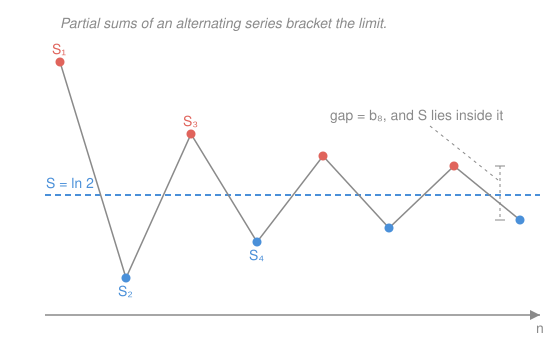

# Real Analysis · Lesson 3.3: Absolute vs. conditional convergence

> ⏱ ~15 min · Module 3: Series · Builds on: [3.2 Convergence tests](03-02-convergence-tests.md) · Unlocks: Module 4 — [4.1 Open sets, closed sets, limit points](04-01-open-closed-limit-points.md)

## Why this matters

Every test in [3.2](03-02-convergence-tests.md) — comparison, ratio, root, integral — quietly assumed the terms were **positive**. Drop that assumption and something new appears: cancellation. A series whose terms flip sign can converge even when the same series with all-positive terms diverges. The alternating harmonic series $1-\tfrac12+\tfrac13-\tfrac14+\cdots$ is the famous case: it sums to $\ln 2$, yet $1+\tfrac12+\tfrac13+\cdots$ blows up. But this rescue-by-cancellation is fragile in a way that should genuinely unsettle you: **reorder the terms and the sum changes** — you can make it come out to anything at all. This lesson draws the line between the robust kind of convergence and the fragile kind, and names the exact property that separates them.

## The idea

There are two ways a series of mixed-sign terms can converge.

The **robust** way: the terms shrink so fast that the sizes $|a_k|$ already add up to something finite. The signs are then just decoration — the total is finite no matter how you slice it. This is **absolute convergence**, and it behaves like a finite sum: you can reorder, regroup, and rearrange with impunity.

The **fragile** way: the sizes $|a_k|$ add up to $\infty$, and convergence survives *only* because positive and negative terms keep cancelling in a delicate, order-dependent dance. This is **conditional convergence**. The sum exists, but it is a property of the *sequence of terms in that order* — shuffle them and you break the choreography. The alternating harmonic series is the prototype: $\sum \tfrac1k = \infty$, so nothing about its size makes it converge; it converges purely because the minus signs arrive on schedule.

The one-line test to tell them apart: **look at $\sum |a_k|$.** If that converges, you're in the robust world. If $\sum a_k$ converges but $\sum|a_k|$ doesn't, you're in the fragile one — and you must respect the order.

## The formal version

**Absolute convergence.** A series $\sum_{k=1}^{\infty} a_k$ **converges absolutely** if $\sum_{k=1}^{\infty} |a_k|$ converges.

> In words: not just the signed total but the total *distance travelled* is finite.

**Theorem (absolute convergence $\Rightarrow$ convergence).** If $\sum |a_k|$ converges, then $\sum a_k$ converges.

> In words: controlling the sizes is more than enough to control the signed sum — the harder condition implies the easier one.

*Proof.* We use the **Cauchy criterion for series** from [3.1](03-01-series-and-cauchy-criterion.md): $\sum a_k$ converges $\iff$ for every $\varepsilon>0$ there is an $N$ such that for all $n>m\ge N$,
$$\left|\sum_{k=m+1}^{n} a_k\right| < \varepsilon.$$
Fix $\varepsilon>0$. Since $\sum|a_k|$ converges, *it* satisfies the Cauchy criterion, so there is an $N$ with $\sum_{k=m+1}^{n}|a_k| < \varepsilon$ for all $n>m\ge N$. Now the triangle inequality does all the work:
$$\left|\sum_{k=m+1}^{n} a_k\right| \;\le\; \sum_{k=m+1}^{n} |a_k| \;<\; \varepsilon.$$
So $\sum a_k$ meets the Cauchy criterion too, hence converges. $\blacksquare$

The converse is false, and the failure is the whole point of this lesson: $\sum(-1)^{k+1}/k$ converges while $\sum 1/k$ does not.

**Alternating Series Test (Leibniz).** Let $b_k \ge 0$ with $b_k$ **decreasing** ($b_{k+1}\le b_k$) and $b_k \to 0$. Then
$$\sum_{k=1}^{\infty} (-1)^{k+1} b_k = b_1 - b_2 + b_3 - b_4 + \cdots$$
converges. Moreover, if $S$ is its sum and $S_N=\sum_{k=1}^{N}(-1)^{k+1}b_k$ is the $N$th partial sum, the **truncation error** is bounded by the first omitted term:
$$|S - S_N| \le b_{N+1}.$$

> In words: alternate, shrink monotonically, and fade to zero, and you converge — and you can stop any time, knowing your error is no bigger than the next term you dropped.

*Proof.* Look at the even partial sums. Grouping in pairs,
$$S_{2n} = (b_1-b_2)+(b_3-b_4)+\cdots+(b_{2n-1}-b_{2n}),$$
and every parenthesis is $\ge 0$ since $b_k$ decreases — so $S_{2n}$ is **increasing** in $n$. Regroup the other way,
$$S_{2n} = b_1 - (b_2-b_3) - (b_4-b_5) - \cdots - b_{2n},$$
and every removed parenthesis is $\ge 0$, so $S_{2n}\le b_1$ — the even sums are **bounded above**. An increasing sequence bounded above converges (monotone convergence, [2.2](02-02-limit-laws-and-squeeze.md)); call the limit $S$. The odd sums satisfy $S_{2n+1}=S_{2n}+b_{2n+1}$, and $b_{2n+1}\to 0$, so $S_{2n+1}\to S$ as well. Both the even and odd subsequences converge to the same $S$, so $S_N\to S$: the series converges. The even sums climb to $S$ from below and the odd sums descend to it from above, so $S$ is trapped between any two consecutive partial sums; hence $|S-S_N|$ is at most the length of that bracketing step, which is exactly $b_{N+1}$. $\blacksquare$

**Conditional convergence.** $\sum a_k$ **converges conditionally** if it converges but $\sum |a_k|$ diverges.

> In words: it converges only thanks to cancellation — the sizes alone would blow up.

**Riemann Rearrangement Theorem.** If $\sum a_k$ converges *conditionally*, then for any target $L\in\mathbb{R}$ (or $L=\pm\infty$) there is a rearrangement — a bijection $\sigma:\mathbb{N}\to\mathbb{N}$ reusing every term exactly once — with $\sum a_{\sigma(k)} = L$. By contrast, if $\sum a_k$ converges *absolutely*, **every** rearrangement converges to the same sum.

> In words: a conditional sum is not really a number attached to the set of terms — it's an artifact of their order, and reshuffling can produce *any* answer you like; an absolute sum is order-proof.

## Picture

The odd partial sums (red) sit above $S$, the even ones (blue) sit below, and the two envelopes squeeze together — a nested-intervals feel. Whatever the last step was, $S$ is caught inside it, so the error never exceeds the next term $b_{N+1}$.

## Worked examples

**Example 1 (mechanical — the alternating harmonic series).** Consider $\sum_{k=1}^{\infty} \dfrac{(-1)^{k+1}}{k} = 1 - \tfrac12 + \tfrac13 - \tfrac14 + \cdots$. Set $b_k = \tfrac1k$. Then $b_k\ge 0$; it decreases ($\tfrac1{k+1}<\tfrac1k$); and $b_k\to 0$. All three Leibniz hypotheses hold, so the series **converges** (its value is $\ln 2$, though the test doesn't tell us that). But the absolute version is $\sum \tfrac1k$, the harmonic series, which **diverges** ([3.2](03-02-convergence-tests.md), integral test). So this series converges **conditionally**. Error control comes free: to approximate $\ln 2$ within $0.01$, take terms until $b_{N+1}=\tfrac1{N+1}\le 0.01$, i.e. $N\ge 99$. Slow — but honest, and you know the error without knowing the answer.

**Example 2 (why you'd care — signs vs. sizes).** Consider $\sum_{k=1}^{\infty} \dfrac{(-1)^{k+1}}{k^2} = 1 - \tfrac14 + \tfrac19 - \cdots$. Leibniz applies ($b_k=\tfrac1{k^2}$ decreases to $0$), so it converges. But now check the *absolute* series: $\sum \tfrac1{k^2}$ is a $p=2>1$ series, which **converges**. So this one converges **absolutely** — the cancellation was a bonus, not a necessity. The practical payoff: because it's absolute, you may reorder or regroup the terms freely (say, to pair them for a numerical estimate) without changing the sum. Same alternating shape as Example 1, completely different license — and the only thing that changed was how fast $b_k$ shrinks. Speed of decay decides which world you're in, exactly as it did for improper integrals in `calc-refresher`.

**Why rearrangement works (the mechanism behind Riemann's theorem).** Split a conditionally convergent $\sum a_k$ into its positive part $P=\sum a_k^+$ (the positive terms) and negative part $N=\sum a_k^-$ (magnitudes of the negative terms). If *both* were finite, $\sum|a_k|=P+N$ would converge — but it doesn't, so at least one is infinite; and since $\sum a_k=P-N$ converges (finite), they can't be one-finite-one-infinite either. Hence **both $P$ and $N$ are infinite**, while the individual terms $\to 0$. That's the lever. To hit a target $L$: pour in positive terms until you first overshoot $L$ (possible — the positives alone sum to $\infty$), then add negative terms until you first undershoot (possible — negatives sum to $\infty$), then positives to overshoot again, and so on. Each switch overshoots by at most the last term used, and those terms $\to 0$, so the running sum is squeezed onto $L$. Any $L$ at all. Absolute convergence forbids this precisely because there $P$ and $N$ are *both finite*, so there's no infinite reservoir to overshoot with — every rearrangement lands on the same $P-N$.

## Watch out

- You might think "it converges, so I can reorder the terms however I like" — but that's only safe for **absolute** convergence. For a conditional series, reordering can change the sum to *any* value (Riemann). Convergence alone does not license rearrangement.
- You might think the Alternating Series Test just needs $b_k\to 0$. It needs $b_k$ to **decrease monotonically** to $0$ as well. Drop monotonicity and it can fail: interleave a divergent positive part with a convergent negative one, $1 - 1 + \tfrac12 - \tfrac1{4} + \tfrac13 - \tfrac19 + \tfrac14 - \tfrac1{16} + \cdots$ (positives $\tfrac1n$, negatives $\tfrac1{n^2}$) — the terms alternate and tend to $0$, but $\sum\tfrac1n=\infty$ swamps $\sum\tfrac1{n^2}$, so it diverges to $+\infty$. Always check that $b_{k+1}\le b_k$.
- You might think the error bound $|S-S_N|\le b_{N+1}$ holds for any convergent alternating-looking series. It's a consequence of the *monotone* Leibniz hypotheses — no monotonicity, no bracketing, no guaranteed bound.
- You might think "$\sum|a_k|$ diverges" means "$\sum a_k$ diverges." No — that's exactly the conditional case. Divergence of the absolute series tells you *nothing* on its own about the signed series; you still have to test $\sum a_k$ directly.

## One-liner

> Absolute convergence (the sizes add up) is order-proof like a finite sum; conditional convergence survives on cancellation alone, and Riemann's theorem shows a reshuffle can make it total anything.

## Problems

**P1 (🟢)** Classify each as absolutely convergent, conditionally convergent, or divergent, with a one-line reason.
(a) $\displaystyle\sum_{k=1}^{\infty} \frac{(-1)^{k+1}}{\sqrt{k}}$  (b) $\displaystyle\sum_{k=1}^{\infty} \frac{(-1)^{k+1}}{k^3}$  (c) $\displaystyle\sum_{k=1}^{\infty} (-1)^{k+1}\,\frac{k}{k+1}$

**P2 (🟡)** For $\displaystyle\sum_{k=1}^{\infty} \frac{(-1)^{k+1}}{k^2}$ (which sums to $\pi^2/12$), how many terms $N$ guarantee the partial sum $S_N$ is within $10^{-3}$ of the true value? Justify using the Leibniz error bound, and name why you're *allowed* to use that bound here.

**P3 (🔴, optional)** Prove that if $\sum a_k$ converges absolutely, then any series obtained by deleting all the *negative* terms (keeping the positives in order) converges. Then explain in one sentence why the same claim fails for the alternating harmonic series — and connect that to the mechanism behind the Riemann theorem.

Solutions

**P1**
(a) **Conditional.** Leibniz applies with $b_k=1/\sqrt{k}$ (decreasing to $0$), so it converges; but $\sum 1/\sqrt k$ is a $p=\tfrac12\le 1$ series, so the absolute version diverges. Converges but not absolutely $\Rightarrow$ conditional.
(b) **Absolute.** $\sum \left|\tfrac{(-1)^{k+1}}{k^3}\right| = \sum \tfrac1{k^3}$ is a $p=3>1$ series, which converges. Absolute convergence, done (no need to test the signed series separately — the theorem hands you convergence).
(c) **Divergent.** The terms are $(-1)^{k+1}\tfrac{k}{k+1}$, and $\tfrac{k}{k+1}\to 1\neq 0$, so $|a_k|\not\to 0$. By the $n$th-term test ([3.1](03-01-series-and-cauchy-criterion.md)) the series diverges — Leibniz never even gets to apply, since its terms must $\to 0$.

**P2** The series is alternating with $b_k=1/k^2$ **decreasing to $0$**, so the Leibniz hypotheses hold — *that* is what licenses the error bound $|S-S_N|\le b_{N+1}$. We need
$$b_{N+1}=\frac{1}{(N+1)^2}\le 10^{-3} \iff (N+1)^2 \ge 1000 \iff N+1 \ge \sqrt{1000}\approx 31.6.$$
So $N+1\ge 32$, i.e. $N\ge 31$. Taking $N=31$ terms guarantees $|S_{31}-\pi^2/12|\le 1/32^2 = 1/1024 < 10^{-3}$. (Contrast Example 1: the alternating harmonic needed $N\ge 99$ for a *coarser* $10^{-2}$ — faster decay of $b_k$ buys dramatically faster accuracy.)

**P3** Let $a_k^+ = \max(a_k,0)$ be the positive terms (with negatives replaced by $0$). Since $0\le a_k^+ \le |a_k|$ for every $k$, and $\sum|a_k|$ converges by hypothesis, the comparison test ([3.2](03-02-convergence-tests.md)) gives that $\sum a_k^+$ converges; deleting the zero entries (the former negative slots) doesn't change a convergent series of nonnegative terms, so the positives-only series converges.
For the alternating harmonic series this fails: its positive terms are $1+\tfrac13+\tfrac15+\cdots=\sum \tfrac1{2k-1}$, which diverges (compare to $\tfrac12\sum\tfrac1k$). That divergence of the positive part is *exactly* the infinite reservoir the Riemann mechanism draws on to overshoot any target — absolute convergence is precisely the condition that keeps that reservoir finite, and so keeps the sum order-proof.

## Flashback

**From Lesson 3.2 (Convergence tests):** Determine whether $\displaystyle\sum_{k=1}^{\infty} \frac{k^2}{2^k}$ converges. Name which test you'd reach for first and why, then carry it out.

Solution

The terms mix a **power** ($k^2$) against an **exponential** ($2^k$) — the ratio test is built for exactly this, since the exponential produces a clean constant ratio while the power's ratio tends to $1$. With $a_k = k^2/2^k$:
$$\frac{a_{k+1}}{a_k} = \frac{(k+1)^2}{2^{k+1}}\cdot\frac{2^k}{k^2} = \frac{1}{2}\left(\frac{k+1}{k}\right)^2 \longrightarrow \frac12\cdot 1 = \frac12.$$
The limit $\tfrac12 < 1$, so by the ratio test the series **converges** (indeed absolutely — the terms are already positive). The exponential beats every polynomial in the tail, which is the intuition the ratio just confirmed. $\blacksquare$

## Connections

- **Backward:** the proof of absolute $\Rightarrow$ convergence runs entirely on the **Cauchy criterion for series** from [3.1](03-01-series-and-cauchy-criterion.md) plus the triangle inequality — a clean example of the criterion earning its keep when you can't get at the limit directly. The tests you apply to $\sum|a_k|$ are all of [3.2](03-02-convergence-tests.md), now legally reused on mixed-sign series via the absolute detour.
- **Forward:** Module 4 leaves series behind for the topology of $\mathbb{R}$ — [4.1](04-01-open-closed-limit-points.md) — but absolute convergence returns as the safe regime for **power series** in Module 8 (see the [syllabus](../syllabus.md)), where a series that converges absolutely inside its radius can be differentiated and integrated term by term. Conditional convergence is exactly the boundary behavior that makes the endpoints of a power series delicate.
- **Sideways:** the "finite total no matter the order" property of absolute convergence is the discrete shadow of **absolute integrability** — a function is Lebesgue integrable when $\int|f|<\infty$, the same size-controls-signs idea that `probability-theory` builds its integral on. And the fragility of conditional sums is why order-of-summation matters in `quantum-mechanics`'s perturbation series and any physics computation that reshuffles an infinite sum.
