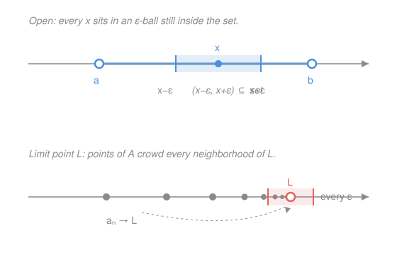

# Real Analysis · Lesson 4.1: Open sets, closed sets, limit points

> ⏱ ~15 min · Module 4: Topology of the real line · Builds on: [2.3 Subsequences and Bolzano–Weierstrass](02-03-subsequences-bolzano-weierstrass.md), [1.3 Consequences of completeness](01-03-consequences-of-completeness.md) · Unlocks: [4.2 Compactness and Heine–Borel](04-02-compactness-heine-borel.md)

## Why this matters

Every big theorem left in this course — the Extreme Value Theorem, the Intermediate Value Theorem, uniform continuity — is a sentence about *shapes* of sets: "a continuous function on a **closed and bounded** set attains its max," "the image of a **connected** set is connected." Before you can prove those, you need the nouns. This lesson installs the two words the whole subject turns on: **open** (every point has room to wiggle) and **closed** (the set already contains everything its members sneak up on). Strip away the real line's specifics and these two words are literally the definition of a `topology` — you're building the vocabulary of an entire field.

## The idea

Picture a point standing in a set and ask: *does it have elbow room?* If you can draw a little interval around it that stays entirely inside the set, the point is comfortably **interior** — nothing on the boundary is nearby. A set is **open** when *every* one of its points is like that: no member is pressed against an edge. The interval $(0,1)$ is open — pick any point, there's always a sliver of room on both sides before you hit $0$ or $1$.

**Closed** is a different question, not the opposite one. A set is closed when it contains all the points its members *approach*. Take $(0,1)$ again and watch the sequence $\tfrac1n \to 0$: every term lives in the set, but the destination $0$ does not. The set "leaks" — a sequence inside it escapes to a limit outside. Plug that hole (include $0$ and $1$) and you get $[0,1]$, which catches every limit: closed.

So the two ideas are about two different things — *room around each point* (open) versus *catching every limit* (closed) — which is exactly why a set can be both, or neither. Those words are what make continuity and compactness *sayable*, and the rest of the module is their payoff.

## The formal version

Throughout, an **$\varepsilon$-neighborhood** of a point $x\in\mathbb{R}$ is the open interval
$$V_\varepsilon(x) = (x-\varepsilon,\, x+\varepsilon) = \{\,y\in\mathbb{R} : |y-x|<\varepsilon\,\},\qquad \varepsilon>0.$$
> In words: all points within distance $\varepsilon$ of $x$ — the "wiggle room" of radius $\varepsilon$.

**Open set.** A point $x$ is an **interior point** of $A\subseteq\mathbb{R}$ if some $V_\varepsilon(x)\subseteq A$. The set $A$ is **open** if every point of $A$ is interior: for each $x\in A$ there exists $\varepsilon>0$ with $(x-\varepsilon,x+\varepsilon)\subseteq A$.
> In words: open means nobody is on the edge — around every member you can fit a whole little interval that never leaves the set.

**Closed set.** $A$ is **closed** if its complement $A^c=\mathbb{R}\setminus A$ is open.
> In words: closed is *defined* as "complement is open" — we'll immediately re-cast it in the far more usable language of limits.

**Limit (accumulation) point.** A point $x$ is a **limit point** of $A$ if *every* neighborhood of $x$ contains a point of $A$ other than $x$: for all $\varepsilon>0$, $\big(V_\varepsilon(x)\setminus\{x\}\big)\cap A\neq\varnothing$. A point of $A$ that is *not* a limit point is an **isolated point** (some neighborhood catches only itself).
> In words: $x$ is a limit point if points of $A$ crowd arbitrarily close to it — you can't quarantine $x$ with any interval, no matter how tiny. Note $x$ itself need not belong to $A$.

**Closure.** The **closure** of $A$ is $\overline{A}=A\cup L$, where $L$ is the set of all limit points of $A$.
> In words: $\overline{A}$ is $A$ with all its escape-destinations filled in — the smallest closed set containing $A$.

### The bridge to sequences

Everything about limit points is secretly about the convergent sequences of [2.1](02-01-convergence-epsilon-n.md).

**Theorem 1 (sequential characterization of limit points).** $x$ is a limit point of $A$ **iff** there is a sequence $(a_n)$ with $a_n\in A$, $a_n\neq x$ for all $n$, and $a_n\to x$.
> In words: "$x$ is snuck up on by $A$" means exactly "some sequence of *distinct-from-$x$* points of $A$ converges to $x$."

*Proof.* ($\Leftarrow$) Given such a sequence, fix $\varepsilon>0$. Since $a_n\to x$, there is $N$ with $|a_N-x|<\varepsilon$; and $a_N\in A$, $a_N\neq x$. So $V_\varepsilon(x)$ contains a point of $A$ other than $x$. As $\varepsilon$ was arbitrary, $x$ is a limit point.

($\Rightarrow$) Suppose $x$ is a limit point. For each $n\in\mathbb{N}$, apply the definition with $\varepsilon=\tfrac1n$: there is a point $a_n\in A$ with $a_n\neq x$ and $|a_n-x|<\tfrac1n$. Given any $\varepsilon>0$, the Archimedean property from [1.3](01-03-consequences-of-completeness.md) gives $N$ with $\tfrac1N<\varepsilon$; then for $n\ge N$, $|a_n-x|<\tfrac1n\le\tfrac1N<\varepsilon$. Hence $a_n\to x$, a sequence in $A\setminus\{x\}$. $\blacksquare$

**Theorem 2 (three faces of "closed").** For $A\subseteq\mathbb{R}$, the following are equivalent:
1. $A$ is closed ($A^c$ is open);
2. $A$ contains all of its limit points;
3. whenever $(a_n)$ is a sequence in $A$ with $a_n\to x$, the limit $x$ belongs to $A$.
> In words: "complement is open," "catches its accumulation points," and "closed under taking limits of its own sequences" all say the same thing. Face 3 is the one you'll reach for 90% of the time.

*Proof.* **(1$\Rightarrow$2)** Let $x$ be a limit point of $A$ and suppose $x\notin A$, so $x\in A^c$. Since $A^c$ is open, some $V_\varepsilon(x)\subseteq A^c$, i.e. $V_\varepsilon(x)$ contains no point of $A$ at all — contradicting that $x$ is a limit point. So $x\in A$.

**(2$\Rightarrow$1)** Show $A^c$ is open. Let $x\in A^c$. By (2), $x$ is not a limit point of $A$ (a limit point would lie in $A$), so some $V_\varepsilon(x)$ contains no point of $A$ other than $x$ — and since $x\notin A$, no point of $A$ whatsoever. Thus $V_\varepsilon(x)\subseteq A^c$, so $A^c$ is open.

**(2$\Rightarrow$3)** Let $a_n\in A$ with $a_n\to x$. If $x\notin A$, then $a_n\neq x$ for all $n$ (each $a_n\in A$), so $(a_n)$ is a sequence in $A\setminus\{x\}$ converging to $x$; by Theorem 1, $x$ is a limit point of $A$, hence $x\in A$ by (2) — contradiction. So $x\in A$.

**(3$\Rightarrow$2)** Let $x$ be a limit point of $A$. By Theorem 1 there is a sequence $(a_n)$ in $A\setminus\{x\}\subseteq A$ with $a_n\to x$; by (3), $x\in A$. So $A$ contains its limit points. $\blacksquare$

### How open and closed sets combine

**Theorem 3 (the set algebra).**
- **(a)** An *arbitrary* union of open sets is open; a *finite* intersection of open sets is open.
- **(b)** (Dual, by De Morgan) An *arbitrary* intersection of closed sets is closed; a *finite* union of closed sets is closed.

> In words: "open" survives unlimited unions but only finite intersections; "closed" is the mirror image. The word *finite* is not decoration — it's the whole content.

*Proof of (a).* **Union:** Let $\{U_i\}_{i\in I}$ be open and $U=\bigcup_i U_i$. If $x\in U$ then $x\in U_j$ for some $j$; openness gives $\varepsilon>0$ with $V_\varepsilon(x)\subseteq U_j\subseteq U$. So $U$ is open — the index set $I$ can be as large as you like.

**Intersection:** Let $U_1,\dots,U_n$ be open and $V=\bigcap_{k=1}^n U_k$. If $x\in V$, then $x\in U_k$ for each $k$, giving $\varepsilon_k>0$ with $V_{\varepsilon_k}(x)\subseteq U_k$. Set $\varepsilon=\min(\varepsilon_1,\dots,\varepsilon_n)$. A minimum of *finitely many* positive numbers is positive, so $\varepsilon>0$, and $V_\varepsilon(x)\subseteq U_k$ for every $k$, hence $V_\varepsilon(x)\subseteq V$. So $V$ is open. Part (b) follows by taking complements. $\blacksquare$

**Why "finite" is load-bearing.** Consider the infinite intersection
$$\bigcap_{n=1}^{\infty}\left(-\tfrac1n,\ \tfrac1n\right)=\{0\}.$$
Each $(-\tfrac1n,\tfrac1n)$ is open, but $\{0\}$ is **not** open — any $V_\varepsilon(0)=(-\varepsilon,\varepsilon)$ contains nonzero points, which aren't in $\{0\}$. What broke: the radii $\varepsilon_n=\tfrac1n$ have infimum $0$, so "$\min$" is no longer positive. (That $\{0\}$ *is* closed, being a finite set, only underlines that open and closed are separate questions.)

## Picture

## Worked examples

**Example 1 (mechanical — the two benchmark intervals).**

*Claim: $(a,b)$ is open.* Let $x\in(a,b)$, so $a<x<b$. The two gaps $x-a$ and $b-x$ are positive; set $\varepsilon=\min(x-a,\,b-x)>0$. Then any $y$ with $|y-x|<\varepsilon$ satisfies $y>x-\varepsilon\ge a$ and $y<x+\varepsilon\le b$, so $y\in(a,b)$. Thus $V_\varepsilon(x)\subseteq(a,b)$; every point is interior; $(a,b)$ is open. $\checkmark$

*Claim: $[a,b]$ is closed.* By Theorem 2, check it catches its limits. Let $x_n\in[a,b]$ with $x_n\to x$. From $a\le x_n\le b$ for all $n$, the order limit laws of [2.2](02-02-limit-laws-and-squeeze.md) give $a\le x\le b$, so $x\in[a,b]$. Face 3 satisfied; $[a,b]$ is closed. (Equivalently, $[a,b]^c=(-\infty,a)\cup(b,\infty)$ is a union of two open sets, hence open.) $\checkmark$

**Example 2 (why you'd care — a set and the one point it approaches).** Let $A=\left\{\tfrac1n : n\in\mathbb{N}\right\}=\{1,\tfrac12,\tfrac13,\dots\}$.

*Every point of $A$ is isolated.* Take $\tfrac1n\in A$; its nearest neighbor in $A$ is $\tfrac1{n+1}$, at distance $\tfrac1n-\tfrac1{n+1}>0$. A neighborhood smaller than that gap catches only $\tfrac1n$ — so no point of $A$ is a limit point of $A$.

*But $0$ is a limit point of $A$* — even though $0\notin A$. The sequence $a_n=\tfrac1n$ lives in $A$, is never $0$, and $a_n\to 0$; Theorem 1 seals it. So $A$ is **not closed** (it leaks its limit), and its closure is $\overline{A}=A\cup\{0\}$, which *is* closed. This is the entire "closed = no leaks" story in one picture: a set of isolated points can still sneak up on an outside point, and closing it means adding exactly that point.

**A quick tour of the zoo** (each a one-line application of the definitions):

- $[0,1)$ is **neither**: not open ($0$ has no room — every $V_\varepsilon(0)$ spills to negatives outside the set), not closed ($1$ is a limit point via $1-\tfrac1n\to1$, but $1\notin[0,1)$).
- $\mathbb{Q}$ is **neither**: not open (every interval contains irrationals, so no rational is interior to $\mathbb{Q}$), not closed (every real is a limit point of $\mathbb{Q}$ — rationals crowd every point, as [1.4](01-04-countable-and-uncountable.md)'s density showed — so e.g. $\sqrt2$ is a limit point outside $\mathbb{Q}$). In fact $\overline{\mathbb{Q}}=\mathbb{R}$.
- Any **finite** set is **closed**: it has no limit points at all (isolated points only), so it vacuously contains them (Theorem 2, face 2).
- $\mathbb{R}$ and $\varnothing$ are **both open and closed**: $\mathbb{R}$ is open (any $\varepsilon$ works for any point) and $\varnothing$ is open (no point to check, vacuously), and each is the other's complement — so each is closed too. On $\mathbb{R}$ these are the *only* two "clopen" sets, a fact that is really the connectedness of the line (Module 5).

## Watch out

- You might think "closed" means "not open," but they answer different questions and are **not** opposites: $[0,1)$ is neither, while $\mathbb{R}$ and $\varnothing$ are both. Never infer one from the negation of the other — always check the actual definition.
- You might think a limit point of $A$ has to *belong* to $A$, but it need not: $0$ is a limit point of $\{1/n\}$ and of $(0,1)$, living in neither. "Limit point of $A$" is about being approached *by* $A$, not membership *in* $A$ — that gap is precisely what closure fills.
- You might think one neighborhood witnessing a nearby point of $A$ makes $x$ a limit point, but the definition demands **every** $\varepsilon$ works, arbitrarily small. A single close neighbor is nothing (that would make every point of $A$ with a neighbor a "limit point"); the content is that $A$-points keep appearing as you shrink $\varepsilon$ to $0$.

## One-liner

> Open = every point has an $\varepsilon$ of elbow room inside; closed = catches the limit of every sequence it contains — two different questions, which is why a set can be both or neither.

## Problems

**P1 (🟢)** For each set, decide whether it is open, closed, both, or neither, and give a one-line reason: (a) $(0,1]$; (b) $\mathbb{Z}$; (c) $\left\{\tfrac1n : n\in\mathbb{N}\right\}\cup\{0\}$.

**P2 (🟡)** Prove directly from the definition that any finite set $F=\{p_1,\dots,p_m\}\subseteq\mathbb{R}$ is closed, by showing $F^c$ is open. (Small idea: what's the safe radius around a point not in $F$?)

**P3 (🔴, optional)** Prove that the closure $\overline{A}=A\cup L$ (where $L$ is the set of limit points of $A$) is itself closed — i.e. every limit point of $\overline{A}$ already lies in $\overline{A}$. This is what earns closure the title "the smallest closed set containing $A$."

Solutions

**P1**
- **(a) $(0,1]$ — neither.** Not open: $1\in(0,1]$ but every $V_\varepsilon(1)$ contains points $>1$ outside the set, so $1$ isn't interior. Not closed: $\tfrac1n\to0$ with $\tfrac1n\in(0,1]$, but $0\notin(0,1]$ (a leaked limit, Theorem 2 face 3).
- **(b) $\mathbb{Z}$ — closed, not open.** Not open: $V_\varepsilon(0)$ always contains non-integers, so $0$ isn't interior. Closed: every integer is isolated (the gap to its neighbors is $1$), so $\mathbb{Z}$ has no limit points and vacuously contains them; equivalently $\mathbb{Z}^c=\bigcup_{n\in\mathbb{Z}}(n,n+1)$ is a union of open intervals, hence open.
- **(c) $\{1/n\}\cup\{0\}$ — closed, not open.** This is the closure from Example 2. Its only limit point is $0$, which is now *in* the set, so it catches all limit points (closed). Not open: $0$ has no interval inside the set (any $V_\varepsilon(0)$ contains points that are neither $0$ nor any $\tfrac1n$), and each $\tfrac1n$ is isolated.

**P2** Let $x\in F^c$, so $x\neq p_k$ for every $k$. Each distance $|x-p_k|$ is therefore positive; set
$$\varepsilon=\min_{1\le k\le m}|x-p_k|>0$$
(a minimum of finitely many positive numbers is positive — the same finiteness that powered Theorem 3). If $|y-x|<\varepsilon$ then $y$ cannot equal any $p_k$: we'd need $|y-x|=|p_k-x|\ge\varepsilon$, contradicting $|y-x|<\varepsilon$. So $y\in F^c$, giving $V_\varepsilon(x)\subseteq F^c$. Every point of $F^c$ is interior, so $F^c$ is open and $F$ is closed. $\blacksquare$

**P3** Let $x$ be a limit point of $\overline{A}$; we must show $x\in\overline{A}$, and it suffices to show $x$ is a limit point of $A$ (then $x\in L\subseteq\overline{A}$). Fix $\varepsilon>0$; we produce a point of $A$ in $V_\varepsilon(x)$ other than $x$.

Since $x$ is a limit point of $\overline{A}$, the open interval $V_\varepsilon(x)$ contains some $y\in\overline{A}$ with $y\neq x$. Because $V_\varepsilon(x)$ is open, choose $\delta>0$ small enough that
$$V_\delta(y)\subseteq V_\varepsilon(x)\qquad\text{and}\qquad x\notin V_\delta(y)$$
(possible since $y\neq x$: take $\delta\le\min\big(\varepsilon-|y-x|,\ |y-x|\big)$). Now $y\in\overline{A}=A\cup L$, so either:
- $y\in A$: then $y$ itself is a point of $A$ in $V_\delta(y)\subseteq V_\varepsilon(x)$, and $y\neq x$; or
- $y\in L$ ($y$ a limit point of $A$): then $V_\delta(y)$ contains a point $a\in A$ with $a\neq y$.

Either way we get a point of $A$ inside $V_\delta(y)\subseteq V_\varepsilon(x)$, and it is $\neq x$ because $x\notin V_\delta(y)$. So every neighborhood of $x$ meets $A$ away from $x$: $x$ is a limit point of $A$, hence $x\in\overline{A}$. Therefore $\overline{A}$ contains all its limit points and is closed. $\blacksquare$

*(Smallest containing closed set: any closed $C\supseteq A$ contains all limit points of $A$ too — a limit point of $A$ is a limit point of $C$, and $C$ catches those — so $C\supseteq A\cup L=\overline{A}$. Thus $\overline{A}$ is the least closed set over $A$.)*

## Flashback

**From Lesson 2.3 (Subsequences and Bolzano–Weierstrass):** Consider the bounded sequence
$$a_n=(-1)^n\left(1+\tfrac1n\right).$$
Find every subsequential limit, exhibit a convergent subsequence for each, and state $\limsup a_n$ and $\liminf a_n$. Then say, in one line, how these values relate to the *limit points of the set of terms* $\{a_n\}$.

Solution

Split by parity. For even $n$, $a_n=1+\tfrac1n\to1$; the subsequence $(a_{2k})=\big(1+\tfrac1{2k}\big)\to 1$. For odd $n$, $a_n=-\big(1+\tfrac1n\big)\to-1$; the subsequence $(a_{2k+1})\to-1$. Any convergent subsequence must eventually pick from one parity (its terms cluster near $+2$-ish or $-2$-ish values that themselves settle to $\pm1$), so the **subsequential limits are exactly $\{1,\,-1\}$**. Hence
$$\limsup a_n=1,\qquad \liminf a_n=-1.$$
The sequence is bounded ($|a_n|\le 2$), so Bolzano–Weierstrass *guarantees* a convergent subsequence — here we found two explicitly. Tie to this lesson: the subsequential limits $\{1,-1\}$ are precisely the **limit points of the term set** $\{a_n\}$ — every neighborhood of $1$ (or $-1$) contains infinitely many terms, while every other real can be isolated from the terms. Subsequential limits *are* accumulation points wearing sequence clothing. $\blacksquare$

## Connections

- **Backward:** Theorem 1 is a repackaging of the ε–N convergence of [2.1](02-01-convergence-epsilon-n.md), and the ⇒ direction runs on the Archimedean property from [1.3](01-03-consequences-of-completeness.md) — the same "shrink $\varepsilon$ to $\tfrac1n$" move that has driven every existence proof since Module 1. The order-limit step in Example 1 is [2.2](02-02-limit-laws-and-squeeze.md).
- **Forward:** [4.2](04-02-compactness-heine-borel.md) marries *closed* to *bounded* to define **compactness**, and Heine–Borel proves the combination is exactly what makes $[a,b]$ special. Module 5 then states continuity itself in this language ("preimages of open sets are open") and cashes in the EVT and IVT.
- **Sideways (`topology`):** abstract these definitions — declare a family of "open sets" closed under arbitrary unions and finite intersections (Theorem 3 is the blueprint) — and you have the axioms of a topological space, with no notion of distance left. Everything here is the $\mathbb{R}$-flavored instance of that general theory; limit points, closure, and closed sets all survive the abstraction verbatim.
