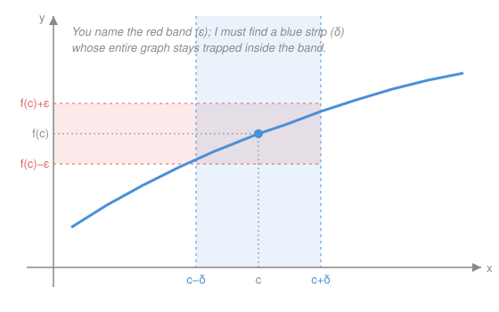

# Real Analysis · Lesson 5.1: Limits of functions and continuity

> ⏱ ~15 min · Module 5: Continuity · Builds on: [2.1 Convergence: the ε–N definition](02-01-convergence-epsilon-n.md), [4.1 Open sets, closed sets, limit points](04-01-open-closed-limit-points.md) · Unlocks: [5.2 Continuity on compact sets](05-02-continuity-on-compact-sets.md)

## Why this matters

Continuity is the hypothesis under almost every theorem you actually want: the Intermediate Value Theorem, the Extreme Value Theorem, the guarantee that a root-finder converges, that a supply curve crosses a demand curve, that a physical trajectory has no teleport. But "you can draw it without lifting your pen" is a slogan, not a proof — and it's *wrong* about functions no pen can draw. This lesson replaces the slogan with a definition you can compute against, then hands you a second, sequence-flavored version of the same idea that turns every convergence theorem from Module 2 into a tool for continuity. Both are needed constantly, and knowing which to reach for is half the skill.

## The idea

Continuity means **no surprises**: a small enough change in the input can't force a jump in the output. Push the input a hair and the output moves a hair — never a cliff.

The honest way to say "never a cliff" is a game, and it's the ε–N game of [2.1](02-01-convergence-epsilon-n.md) moved from the index axis onto the input axis. There, a skeptic named a tolerance $\varepsilon$ around the limit and you had to produce a cutoff $N$ past which the sequence stayed within $\varepsilon$. Here the skeptic names a tolerance $\varepsilon$ around the output $f(c)$ — "keep $f(x)$ this close to $f(c)$" — and you must produce a tolerance $\delta$ around the input $c$ such that *every* $x$ within $\delta$ of $c$ lands within $\varepsilon$ of $f(c)$. If you can always answer, no matter how mean the $\varepsilon$, the function is continuous at $c$. A jump is exactly a place where some $\varepsilon$ has no answer: no input-tolerance is small enough, because points just across the gap always overshoot.

The whole content is the *order of quantifiers*: the enemy moves first (picks $\varepsilon$), you respond (pick $\delta$). Your $\delta$ is allowed to depend on the $\varepsilon$ — and, crucially, on the point $c$.

## The formal version

**Functional limit.** Let $f$ be defined on a domain $D\subseteq\mathbb{R}$ and let $c$ be a *limit point* of $D$ (from [4.1](04-01-open-closed-limit-points.md): every neighborhood of $c$ meets $D$ at some point other than $c$, so $x$ can approach $c$ through the domain). We say
$$\lim_{x\to c} f(x) = L \quad\text{means}\quad \forall\,\varepsilon>0\ \ \exists\,\delta>0 \ \text{ s.t. }\ 0<|x-c|<\delta \ \Rightarrow\ |f(x)-L|<\varepsilon.$$

> In words: for every output tolerance $\varepsilon$ the skeptic names, there is an input tolerance $\delta$ so that every $x$ strictly within $\delta$ of $c$ has $f(x)$ within $\varepsilon$ of $L$. The "$0<|x-c|$" excludes $x=c$ itself — the limit is about the approach, not the value at $c$.

**Continuity at a point.** $f$ is **continuous at** $c\in D$ if
$$\forall\,\varepsilon>0\ \ \exists\,\delta>0 \ \text{ s.t. }\ |x-c|<\delta \ \Rightarrow\ |f(x)-f(c)|<\varepsilon.$$
When $c$ is a limit point of $D$, this is exactly $\lim_{x\to c} f(x) = f(c)$.

> In words: the limit not only exists, it equals the value the function actually takes. Two things must agree — where the function is *heading* as $x\to c$, and where it *is* at $c$. Note the "$0<$" is gone: we now allow $x=c$, which is harmless since $|f(c)-f(c)|=0<\varepsilon$ automatically.

$f$ is **continuous on a set** $A\subseteq D$ if it is continuous at every point of $A$.

**Sequential criterion for continuity.** $f$ is continuous at $c$ **if and only if** for *every* sequence $(x_n)$ in $D$ with $x_n\to c$, we have $f(x_n)\to f(c)$.

> In words: $f$ is continuous at $c$ exactly when it commutes with limits — you may pull $f$ inside any convergent sequence, $\lim f(x_n)=f(\lim x_n)$. This is the bridge back to Module 2: it recasts continuity entirely in the language of sequence convergence you already own.

**Proof (both directions).**

*($\Rightarrow$) Continuity forces sequences to cooperate.* Assume $f$ is continuous at $c$, and let $x_n\to c$. Fix $\varepsilon>0$. By continuity there is a $\delta>0$ with $|x-c|<\delta \Rightarrow |f(x)-f(c)|<\varepsilon$. Since $x_n\to c$, there is an $N$ with $|x_n-c|<\delta$ for all $n\ge N$ (the ε–N definition, [2.1](02-01-convergence-epsilon-n.md), applied with tolerance $\delta$). Then for all $n\ge N$, $|f(x_n)-f(c)|<\varepsilon$. That is exactly $f(x_n)\to f(c)$. $\;\blacksquare$

*($\Leftarrow$) Sequences cooperating forces continuity.* We prove the contrapositive: if $f$ is **not** continuous at $c$, some sequence betrays it. Negating the definition, there is a *bad* $\varepsilon_0>0$ for which **no** $\delta$ works — meaning for every $\delta>0$ there exists a point within $\delta$ of $c$ whose image is at least $\varepsilon_0$ away from $f(c)$. Apply this with $\delta=\tfrac1n$ for each $n\in\mathbb{N}$: pick $x_n\in D$ with
$$|x_n-c|<\tfrac1n \qquad\text{but}\qquad |f(x_n)-f(c)|\ge\varepsilon_0.$$
Then $x_n\to c$ (since $|x_n-c|<\tfrac1n\to 0$), yet $f(x_n)\not\to f(c)$ (it stays $\ge\varepsilon_0$ away forever). So the sequence condition fails. Contrapositively, if every sequence cooperates, $f$ is continuous. $\;\blacksquare$

The power of ($\Leftarrow$)'s proof idea: to prove **dis**continuity you need only exhibit *one* bad sequence $x_n\to c$ with $f(x_n)\not\to f(c)$. One counterexample sequence kills continuity; that's the workhorse below.

## Picture

The skeptic paints the red horizontal band $\big(f(c)-\varepsilon,\,f(c)+\varepsilon\big)$. Your job is to find a blue vertical strip $(c-\delta,\,c+\delta)$ narrow enough that the piece of the curve above it never escapes the band. At a jump, some band is so thin that no strip works — points just across the gap always poke out the top.

## Worked examples

**Example 1 (mechanical — $f(x)=x^2$ is continuous at every $c$, straight from ε–δ).** Fix $c\in\mathbb{R}$ and $\varepsilon>0$; we hunt for $\delta$. The gap we must control factors:
$$|x^2-c^2| = |x-c|\,|x+c|.$$
The troublesome factor is $|x+c|$ — it depends on $x$, so we first *cage it* by agreeing to look only nearby. **Provisionally require $\delta\le 1$**, so $|x-c|<1$. Then $|x|<|c|+1$ by the triangle inequality, hence
$$|x+c| \le |x|+|c| < (|c|+1)+|c| = 2|c|+1.$$
So whenever $|x-c|<\delta\le 1$,
$$|x^2-c^2| = |x-c|\,|x+c| < \delta\,(2|c|+1).$$
To force this below $\varepsilon$, we need $\delta \le \dfrac{\varepsilon}{2|c|+1}$. Both constraints are met by the single choice
$$\delta = \min\!\left\{1,\ \frac{\varepsilon}{2|c|+1}\right\}.$$
Then $|x-c|<\delta \Rightarrow |x^2-c^2| < \delta(2|c|+1) \le \varepsilon$. Done: $x^2$ is continuous at every $c$. Notice $\delta$ shrinks as $|c|$ grows — the parabola steepens, so the same $\varepsilon$ demands a tighter input tolerance. **$\delta$ depends on both $\varepsilon$ and $c$;** that dependence on $c$ is the seam Lesson [5.2](05-02-continuity-on-compact-sets.md) attacks with uniform continuity.

**Example 2 (why you'd care — the Dirichlet function is continuous nowhere).** Define the *Dirichlet function*
$$D(x)=\begin{cases}1,& x\in\mathbb{Q},\\[2pt] 0,& x\notin\mathbb{Q}.\end{cases}$$
No pen draws this — it slams between $0$ and $1$ on every interval — so the slogan is useless and the sequential criterion is the only clean way in. Fix any $c\in\mathbb{R}$; we produce a bad sequence.

- **If $c\in\mathbb{Q}$**, so $D(c)=1$: density of the *irrationals* (Module 1 — the irrationals are dense because $\mathbb{Q}$ is countable while $\mathbb{R}$ isn't, [1.4](01-04-countable-and-uncountable.md), and translating a fixed irrational by rationals lands one in every interval) gives irrationals $x_n\to c$ with $x_n\notin\mathbb{Q}$. Then $D(x_n)=0$ for all $n$, so $D(x_n)\to 0\neq 1=D(c)$.
- **If $c\notin\mathbb{Q}$**, so $D(c)=0$: density of $\mathbb{Q}$ ([1.3](01-03-consequences-of-completeness.md), recalled in [1.4](01-04-countable-and-uncountable.md)'s flashback) gives rationals $x_n\to c$. Then $D(x_n)=1$ for all $n$, so $D(x_n)\to 1\neq 0=D(c)$.

Either way there is a sequence $x_n\to c$ with $D(x_n)\not\to D(c)$, so $D$ is discontinuous at $c$. Since $c$ was arbitrary, $D$ is continuous at **no** point of $\mathbb{R}$. One bad sequence per point, and the whole function falls — that is the criterion earning its keep.

## Algebra of continuous functions

Continuity survives every basic combination. If $f,g$ are continuous at $c$, then so are $f+g$, $f-g$, $fg$, and — provided $g(c)\neq 0$ — the quotient $f/g$. And **compositions** of continuous functions are continuous: if $g$ is continuous at $c$ and $f$ is continuous at $g(c)$, then $f\circ g$ is continuous at $c$.

> In words: sums, products, quotients (away from zero denominators), and chains of continuous functions are again continuous — which is why every polynomial, every rational function, and every sensible formula you write down is automatically continuous on its domain, no ε–δ hunt required.

**Proof via the sequential criterion (the composition, cleanly).** Let $x_n\to c$. Because $g$ is continuous at $c$, the sequential criterion gives $g(x_n)\to g(c)$. Set $y_n := g(x_n)$; then $y_n\to g(c)$. Because $f$ is continuous at $g(c)$, the criterion applies again to the sequence $(y_n)$: $f(y_n)\to f(g(c))$. But $f(y_n)=f(g(x_n))=(f\circ g)(x_n)$, so
$$(f\circ g)(x_n)\to f(g(c))=(f\circ g)(c).$$
Every sequence $x_n\to c$ cooperates, so $f\circ g$ is continuous at $c$. $\;\blacksquare$

This is the sequential criterion's real selling point: it reduces a statement about functions to the algebra of limits of sequences from [2.2 Limit laws and the squeeze](02-02-limit-laws-and-squeeze.md), which you already proved. Sums/products/quotients go the same way — apply the sequence limit laws to $f(x_n)$ and $g(x_n)$.

## Watch out

- You might think the limit existing settles continuity, but $\lim_{x\to c}f$ can exist while $f(c)$ is undefined or simply different — that's a **removable discontinuity**. Take $f(x)=\frac{\sin x}{x}$: the limit at $0$ is $1$, but $f(0)$ is undefined, so $f$ isn't continuous at $0$ until you *define* $f(0)=1$. Continuity demands the limit and the value **match**, not merely that the limit exist.
- You might think one well-behaved sequence proves continuity, but it doesn't — the criterion quantifies over *every* sequence $x_n\to c$. Finding rationals $x_n\to c$ with $D(x_n)\to$ the "right" value proves nothing; continuity fails because *some other* sequence misbehaves. One good sequence is worthless; **one bad sequence is decisive** against continuity.
- You might think a single $\delta$ can serve a whole interval, but $\delta$ generally depends on the point $c$ as well as on $\varepsilon$ (Example 1: $\delta\sim \varepsilon/(2|c|+1)$ shrank as $c$ grew). A $\delta$ that works uniformly across all $c$ at once is a stronger property — *uniform* continuity — and it is exactly what [5.2](05-02-continuity-on-compact-sets.md) shows compactness buys you.

## One-liner

> Continuous at $c$ means the function commutes with limits there — $\lim f(x_n)=f(\lim x_n)$ for every $x_n\to c$ — so one rogue sequence is all it takes to prove a jump.

## Problems

**P1 (🟢)** Using the sequential criterion, prove the sign function
$$s(x)=\begin{cases}1,& x>0,\\ 0,& x=0,\\ -1,& x<0\end{cases}$$
is discontinuous at $0$. (Exhibit one bad sequence — you don't need ε–δ.)

**P2 (🟡)** Prove directly from the ε–δ definition that $f(x)=\dfrac{1}{x}$ is continuous at $c=2$. (Cage the denominator: first insist $\delta\le 1$ to keep $x$ bounded away from $0$, then finish.)

**P3 (🔴, optional)** Define $f(x)=x$ if $x\in\mathbb{Q}$ and $f(x)=0$ if $x\notin\mathbb{Q}$. Prove $f$ is continuous at $c=0$ but at **no** other point. (Two sequences per bad point, as with Dirichlet; at $0$, bound $|f(x)|\le|x|$.)

Solutions

**P1** Take $x_n=-\tfrac1n$. Then $x_n\to 0$, and $x_n<0$ for all $n$, so $s(x_n)=-1$ for all $n$, giving $s(x_n)\to -1$. But $s(0)=0$. Since $-1\neq 0$, we have a sequence $x_n\to 0$ with $s(x_n)\not\to s(0)$, so by the sequential criterion $s$ is discontinuous at $0$. $\;\blacksquare$ (The sequence $x_n=\tfrac1n$ would give $s(x_n)\to 1\neq 0$ — also fine; either one bad sequence suffices.)

**P2** Fix $\varepsilon>0$. We control
$$\left|\frac1x-\frac12\right| = \left|\frac{2-x}{2x}\right| = \frac{|x-2|}{2|x|}.$$
The loose factor is $\frac{1}{|x|}$; cage it. **Require $\delta\le 1$**, so $|x-2|<1\Rightarrow 1<x<3$, hence $|x|>1$ and $\frac{1}{|x|}<1$. Then
$$\left|\frac1x-\frac12\right| = \frac{|x-2|}{2|x|} < \frac{|x-2|}{2}\cdot 1 < \frac{\delta}{2}.$$
So choosing
$$\delta=\min\{1,\ 2\varepsilon\}$$
gives $|x-2|<\delta \Rightarrow \left|\frac1x-\frac12\right| < \frac{\delta}{2}\le\varepsilon$. Hence $\frac1x$ is continuous at $2$. $\;\blacksquare$ (Caging is essential: without $\delta\le1$, $x$ could approach $0$ and $\frac{1}{2|x|}$ blow up.)

**P3** *Continuous at $0$.* Here $f(0)=0$. For any $x$, $|f(x)|$ is either $|x|$ (if $x\in\mathbb{Q}$) or $0$ (if not), so in all cases $|f(x)-f(0)|=|f(x)|\le|x|$. Given $\varepsilon>0$, take $\delta=\varepsilon$: then $|x-0|<\delta \Rightarrow |f(x)-0|\le|x|<\varepsilon$. So $f$ is continuous at $0$.

*Discontinuous at every $c\neq 0$.* Fix $c\neq 0$.
- If $c\in\mathbb{Q}$ (so $f(c)=c\neq 0$): pick irrationals $x_n\to c$ (density of irrationals). Then $f(x_n)=0$ for all $n$, so $f(x_n)\to 0\neq c=f(c)$.
- If $c\notin\mathbb{Q}$ (so $f(c)=0$): pick rationals $x_n\to c$ (density of $\mathbb{Q}$). Then $f(x_n)=x_n\to c\neq 0=f(c)$.

Either way a sequence $x_n\to c$ has $f(x_n)\not\to f(c)$, so $f$ is discontinuous at $c$. Continuity survives only at the one point where the two competing values ($x$ and $0$) collide — namely $x=0$. $\;\blacksquare$

## Flashback

**From Lesson 2.1 (Convergence: the ε–N definition):** Prove directly from the ε–N definition that $\displaystyle\lim_{n\to\infty}\frac{3n+2}{n+4}=3$.

Solution

Fix $\varepsilon>0$; we produce an $N$. Compute the gap and simplify:
$$\left|\frac{3n+2}{n+4}-3\right| = \left|\frac{(3n+2)-3(n+4)}{n+4}\right| = \left|\frac{-10}{n+4}\right| = \frac{10}{n+4} < \frac{10}{n}.$$
To force $\frac{10}{n}<\varepsilon$ we need $n>\frac{10}{\varepsilon}$. By the Archimedean property choose $N\in\mathbb{N}$ with $N>\frac{10}{\varepsilon}$. Then for all $n\ge N$,
$$\left|\frac{3n+2}{n+4}-3\right| < \frac{10}{n}\le\frac{10}{N} < \varepsilon.$$
So the definition is satisfied and the limit is $3$. $\;\blacksquare$ (Bounding $\frac{10}{n+4}<\frac{10}{n}$ before solving for $N$ is the standard move — trade the exact expression for a simpler upper bound you can invert.)

## Connections

- **Backward:** the ε–δ definition is [2.1](02-01-convergence-epsilon-n.md)'s ε–N game replayed on the input axis, and the sequential criterion's proof runs entirely on Module 2 machinery — ε–N convergence and the limit laws of [2.2](02-02-limit-laws-and-squeeze.md). The Dirichlet argument cashes in the density facts of Module 1 ([1.4](01-04-countable-and-uncountable.md)).
- **Forward:** [5.2](05-02-continuity-on-compact-sets.md) asks whether $\delta$ can be chosen *independently of $c$* (uniform continuity) and shows compactness — the Heine–Borel machinery of [4.2](04-02-compactness-heine-borel.md) — forces a yes on $[a,b]$; [5.3](05-03-intermediate-value-theorem.md) uses continuity plus connectedness for the IVT. The sequential criterion returns in Module 8 as the reason a *uniform* limit of continuous functions is continuous.
- **Sideways:** "$f$ commutes with limits" is the property physics silently assumes whenever it passes a limit through a field or a response function, and economics assumes whenever it claims a continuous demand curve must cross a continuous supply curve (an IVT argument that needs exactly this lesson's hypothesis). The composition rule is why `topology` will *redefine* continuity as "preimages of open sets are open" — the same idea, quantifiers repackaged.
