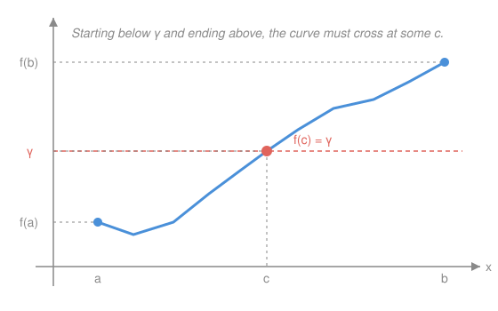

# Real Analysis · Lesson 5.3: The Intermediate Value Theorem

> ⏱ ~15 min · Module 5: Continuity · Builds on: [5.1 Limits of functions and continuity](05-01-limits-and-continuity.md) · Unlocks: Module 6 — [6.1 The derivative, rigorously](06-01-the-derivative-rigorously.md)

## Why this matters

Every time you say "the temperature was $-3°$ at dawn and $12°$ at noon, so it hit $0°$ sometime in between," you are using the Intermediate Value Theorem. It is the theorem that turns *continuity* into an *existence machine*: it doesn't compute anything, but it guarantees a solution is there to be found. That guarantee is what lets you prove every odd-degree polynomial has a real root, that a continuous map of an interval into itself pins down a fixed point, and that the bisection method your calculator uses to solve $f(x)=0$ actually converges. It is also the analytic voice of a topological fact — that an interval is *connected*, one unbroken piece — and it is the first place completeness pays off for continuous functions.

## The idea

Draw the graph of a continuous function from a pen that never leaves the paper. Start your pen at height $f(a)$ and end it at height $f(b)$. Pick any height $\gamma$ strictly between those two. To get from below $\gamma$ to above $\gamma$, the pen has to *cross* the horizontal line at height $\gamma$ at least once — there is no way to jump over it without lifting the pen, and continuity is precisely the promise that you never lift the pen. That crossing point is a solution of $f(x)=\gamma$.

That's the whole content. The only thing that can defeat it is a *gap* — a place where the graph tears and skips over $\gamma$. A light switch is exactly that failure: it is "off" ($0$) and then "on" ($1$) with no value in between ever taken. The switch's state function is discontinuous, and it skips levels with impunity. IVT says: rule out the tear, and skipping becomes impossible. Behind the picture is completeness — the reals have no holes, so when we hunt for the crossing point by taking a supremum, the point we need is actually *there*.

## The formal version

**Intermediate Value Theorem.** Let $f:[a,b]\to\mathbb{R}$ be continuous, and let $\gamma$ be any number strictly between $f(a)$ and $f(b)$ (i.e. $f(a)<\gamma<f(b)$ or $f(b)<\gamma<f(a)$). Then there exists $c\in(a,b)$ with $f(c)=\gamma$.

> In words: a continuous function on an interval takes every value between the two it takes at the endpoints — it cannot skip a level.

Here $[a,b]=\{x:a\le x\le b\}$ is the closed interval, and "continuous" means continuous at every point of $[a,b]$ in the ε–δ sense of [5.1](05-01-limits-and-continuity.md). Note what IVT does *not* promise: not a formula for $c$, not uniqueness, not that $c$ is the only crossing — only that at least one exists.

### Proof (via completeness)

Assume $f(a)<\gamma<f(b)$; the other case follows by applying this one to $-f$ and $-\gamma$. Consider the set of inputs where $f$ is still below the target,

$$S=\{x\in[a,b]:f(x)<\gamma\}.$$

$S$ is nonempty ($a\in S$, since $f(a)<\gamma$) and bounded above (by $b$). By the **completeness axiom** — every nonempty set bounded above has a least upper bound — $c=\sup S$ exists, and $c\in[a,b]$. We claim $f(c)=\gamma$, and we prove it by killing both alternatives. Both use the **sign-preservation** consequence of continuity from [5.1](05-01-limits-and-continuity.md): *if $f$ is continuous at $c$ and $f(c)\neq\gamma$, then $f$ stays on the same side of $\gamma$ throughout a small interval around $c$* (take $\varepsilon=|f(c)-\gamma|>0$ in the definition of continuity; the corresponding $\delta$-neighborhood keeps $f$ within $\varepsilon$ of $f(c)$, hence strictly on $c$'s side of $\gamma$).

**Rule out $f(c)<\gamma$.** Then $c\neq b$ (since $f(b)>\gamma$), so $c<b$. By sign-preservation there is a $\delta>0$ with $f(x)<\gamma$ for all $x\in(c-\delta,c+\delta)\cap[a,b]$. But then points *just to the right* of $c$ — say $c+\tfrac{\delta}{2}$, still $\le b$ — lie in $S$, contradicting that $c$ is an upper bound of $S$. So $f(c)<\gamma$ is impossible.

**Rule out $f(c)>\gamma$.** Then $c\neq a$ (since $f(a)<\gamma$), so $c>a$. By sign-preservation there is a $\delta>0$ with $f(x)>\gamma$ for all $x\in(c-\delta,c+\delta)\cap[a,b]$. So no point of $(c-\delta,c]$ belongs to $S$, which means $c-\delta$ is *also* an upper bound of $S$ — a smaller one than $c$, contradicting $c=\sup S$ being the *least* upper bound. So $f(c)>\gamma$ is impossible.

The only survivor is $f(c)=\gamma$. And $c\in(a,b)$ (not an endpoint) because $f(a)<\gamma<f(b)$ forces $c\neq a,b$. $\blacksquare$

> The engine is completeness: $\sup S$ is the exact last moment the function is still below $\gamma$, and continuity forbids it from being anything but *equal* to $\gamma$ there.

**The constructive twin — bisection.** There's a second proof that also *finds* $c$. With $f(a)<\gamma<f(b)$, look at the midpoint $m=\tfrac{a+b}{2}$: if $f(m)<\gamma$ recurse on $[m,b]$, if $f(m)>\gamma$ recurse on $[a,m]$ (if $f(m)=\gamma$ you're done). Each step halves an interval that still straddles $\gamma$; the nested interval theorem from [1.3](01-03-consequences-of-completeness.md) pins down a single point $c$ in the intersection, and continuity forces $f(c)=\gamma$. Same completeness, wearing overalls: this is the algorithm a root-finder actually runs.

### Connectedness: the topological face

Call a set $I\subseteq\mathbb{R}$ an **interval** if it has no gaps: whenever $x,y\in I$ and $x<z<y$, then $z\in I$ too. (This captures exactly $[a,b]$, $(a,b)$, rays, and $\mathbb{R}$ itself.) The one-line topological statement of this lesson is:

> **The continuous image of an interval is an interval.** If $f:I\to\mathbb{R}$ is continuous and $I$ is an interval, then $f(I)$ is an interval.

In words: continuity cannot break one connected piece into two — it maps unbroken things to unbroken things. IVT is the *surjectivity half* of this: saying $f(I)$ has no gap between $f(a)$ and $f(b)$ is exactly saying every intermediate $\gamma$ is hit. (Combine it with the Extreme Value Theorem from [5.2](05-02-continuity-on-compact-sets.md) and you get more: the continuous image of a *closed bounded* interval $[a,b]$ is again a *closed bounded* interval $[\min f,\max f]$.)

## Picture

## Worked examples

**Example 1 (mechanical — locating a root).** Show $f(x)=x^3-x-1$ has a root in $(1,2)$, and trap it in an interval of length $\tfrac14$.

$f$ is a polynomial, hence continuous everywhere. Check the endpoints: $f(1)=1-1-1=-1<0$ and $f(2)=8-2-1=5>0$. Since $\gamma=0$ lies strictly between $f(1)=-1$ and $f(2)=5$, IVT gives a $c\in(1,2)$ with $f(c)=0$. To narrow it, bisect: $f(1.5)=3.375-1.5-1=0.875>0$, so the root is in $(1,1.5)$; then $f(1.25)=1.953-1.25-1=-0.297<0$, so it's in $(1.25,1.5)$ — an interval of length $0.25$. (Two more halvings would get you two decimals; that's the whole bisection method.)

**Example 2 (why you'd care — a fixed point).** Prove that every continuous $f:[0,1]\to[0,1]$ has a **fixed point**: some $x$ with $f(x)=x$.

The trick is to move the target to zero. Define $g(x)=f(x)-x$, continuous on $[0,1]$ as a difference of continuous functions. Evaluate at the endpoints, using that $f$ *lands in* $[0,1]$:

$$g(0)=f(0)-0=f(0)\ge 0,\qquad g(1)=f(1)-1\le 0,$$

since $0\le f(0)$ and $f(1)\le 1$. If either endpoint gives equality we already have a fixed point ($f(0)=0$ or $f(1)=1$). Otherwise $g(1)<0<g(0)$, so $\gamma=0$ is strictly between the endpoint values, and IVT hands us a $c\in(0,1)$ with $g(c)=0$, i.e. $f(c)=c$. Any continuous self-map of an interval is pinned. This is the one-dimensional seed of Brouwer's fixed-point theorem, which underwrites the existence of Nash equilibria in `game-theory` and general-equilibrium prices in `micro-refresher` — economists reach for exactly this shape of argument.

## Watch out

- You might think IVT works for any function that "goes from below to above," but it needs **continuity** — that hypothesis is the whole theorem. The step function $f(x)=0$ for $x\le 0$ and $f(x)=1$ for $x>0$ runs from $0$ up to $1$ on $[-1,1]$ yet never takes the value $\tfrac12$: it *skips* because it tears at $0$. No continuity, no guarantee.
- You might think IVT tells you *which* $c$, or that there's only one. It does neither — it is pure existence. A continuous function can cross the level $\gamma$ many times (think of $\sin x$ hitting $0$ over and over), and IVT never names a value or promises uniqueness. To actually locate $c$ you run bisection or Newton's method; to know $c$ is unique you need extra input like monotonicity.
- You might think the converse holds — "$f$ takes every intermediate value, so $f$ is continuous." False. The function $f(x)=\sin(1/x)$ for $x\neq 0$, $f(0)=0$, has the intermediate-value property on any interval around $0$ (it sweeps through every value in $[-1,1]$ infinitely often near $0$) yet is discontinuous at $0$. The intermediate-value property is *necessary* for continuity, not *sufficient*.

## One-liner

> A continuous function on an interval hits every value between its endpoint values — because you can't get from one side of a level to the other without crossing it, and completeness guarantees the crossing point is really there.

## Problems

**P1 (🟢)** Show that the equation $x=\cos x$ has a solution in $\left(0,\tfrac{\pi}{2}\right)$. (Set it up as a root problem and name the value of $\gamma$ you're crossing.)

**P2 (🟡)** Prove that every polynomial of *odd* degree with real coefficients has at least one real root. (Hint: for $p(x)=x^n+a_{n-1}x^{n-1}+\dots+a_0$ with $n$ odd, think about the signs of $p(x)$ for $x$ very large positive and very large negative.)

**P3 (🔴, optional)** Two hikers, one starting at the trailhead and one at the summit at 6 a.m., walk toward each other along the same trail, each arriving at the other end by 6 p.m. Prove that at some instant they are at the *same point* on the trail. (Model each hiker's position as a continuous function of time and apply IVT to a difference — the same move as Example 2.)

Solutions

**P1** Let $f(x)=x-\cos x$, continuous on $\left[0,\tfrac{\pi}{2}\right]$ (difference of continuous functions). Endpoints: $f(0)=0-\cos 0=-1<0$ and $f\!\left(\tfrac{\pi}{2}\right)=\tfrac{\pi}{2}-\cos\tfrac{\pi}{2}=\tfrac{\pi}{2}-0=\tfrac{\pi}{2}>0$. The target level is $\gamma=0$, strictly between $-1$ and $\tfrac{\pi}{2}$, so IVT gives $c\in\left(0,\tfrac{\pi}{2}\right)$ with $f(c)=0$, i.e. $c=\cos c$. (Numerically $c\approx 0.739$, the "Dottie number," but IVT only owes us existence.)

**P2** Write $p(x)=x^n+a_{n-1}x^{n-1}+\dots+a_0$ with $n$ odd (leading coefficient $1$ WLOG, dividing through if needed — it doesn't change the roots). Factor out the top power for large $|x|$:

$$p(x)=x^n\left(1+\frac{a_{n-1}}{x}+\dots+\frac{a_0}{x^n}\right).$$

As $|x|\to\infty$ the bracket $\to 1>0$, so for all large enough $|x|$ the bracket is positive and $p(x)$ has the same sign as $x^n$. Since $n$ is odd, $x^n<0$ for large negative $x$ and $x^n>0$ for large positive $x$. So we can pick a large $M$ with $p(-M)<0$ and $p(M)>0$. The polynomial $p$ is continuous on $[-M,M]$, and $\gamma=0$ lies strictly between $p(-M)<0$ and $p(M)>0$, so IVT delivers a $c\in(-M,M)$ with $p(c)=0$. (Odd degree is essential: $x^2+1$ has no real root, because an even power has the *same* sign at both ends.)

**P3** Let $u(t)$ be the trailhead-starter's position (distance from the trailhead) at time $t$, and $v(t)$ the summit-starter's position, for $t$ from $6$ a.m. ($t=0$) to $6$ p.m. ($t=T$). Normalize the trail to run from $0$ (trailhead) to $L$ (summit). Then $u(0)=0$, $u(T)=L$, $v(0)=L$, $v(T)=0$, and both are continuous (a hiker's position moves without teleporting). Define the gap $h(t)=u(t)-v(t)$, continuous on $[0,T]$. At the ends,

$$h(0)=u(0)-v(0)=0-L=-L<0,\qquad h(T)=u(T)-v(T)=L-0=L>0.$$

So $\gamma=0$ is strictly between $h(0)$ and $h(T)$, and IVT gives a time $c\in(0,T)$ with $h(c)=0$, i.e. $u(c)=v(c)$: at that instant the two hikers occupy the same point. (Notice we needed nothing about *speed* — only continuity and the swapped endpoints. It's Example 2's difference trick wearing a backpack.)

## Flashback

**From Lesson 5.1 (Limits of functions and continuity — the sequential criterion):** Use the sequential criterion for continuity to prove that

$$f(x)=\begin{cases} 1, & x\in\mathbb{Q},\\ 0, & x\notin\mathbb{Q}, \end{cases}$$

(the Dirichlet function) is discontinuous at **every** point $p\in\mathbb{R}$.

Solution

The sequential criterion says $f$ is continuous at $p$ iff for *every* sequence $x_n\to p$ we have $f(x_n)\to f(p)$. To show discontinuity at $p$, exhibit one sequence converging to $p$ whose images do *not* converge to $f(p)$.

Fix any $p\in\mathbb{R}$. By density of the rationals and of the irrationals (each dense in $\mathbb{R}$, from [1.3](01-03-consequences-of-completeness.md)), we can choose:

- a sequence of **rationals** $r_n\to p$ (as built in the [1.4](01-04-countable-and-uncountable.md) flashback, take $r_n\in\left(p-\tfrac1n,p+\tfrac1n\right)\cap\mathbb{Q}$), and
- a sequence of **irrationals** $s_n\to p$ (same construction, picking an irrational in each shrinking interval).

Then $f(r_n)=1$ for all $n$, so $f(r_n)\to 1$; while $f(s_n)=0$ for all $n$, so $f(s_n)\to 0$. Whatever $f(p)$ is, it cannot equal both $1$ and $0$, so at least one of these sequences has images failing to converge to $f(p)$. By the sequential criterion, $f$ is discontinuous at $p$. Since $p$ was arbitrary, $f$ is discontinuous everywhere. $\blacksquare$

(Two sequences racing to the same point with different limiting images is the cleanest way the sequential criterion detects a break — and it's exactly why the Dirichlet function will fail to be Riemann integrable in Module 7.)

## Connections

- **Backward:** the proof runs entirely on the completeness axiom via $\sup S$ — the same $\sup$/nested-interval machinery from [1.3](01-03-consequences-of-completeness.md) — and on the sign-preservation consequence of ε–δ continuity from [5.1](05-01-limits-and-continuity.md). IVT is where those two threads finally meet.
- **Forward:** IVT is the *connectedness* payoff of continuity, the sibling of [5.2](05-02-continuity-on-compact-sets.md)'s *compactness* payoff (EVT). Together they say the continuous image of $[a,b]$ is exactly $[\min f,\max f]$. In Module 6, IVT applied to the *derivative* gives Darboux's theorem (derivatives have the intermediate-value property even when they aren't continuous), and it underlies the Mean Value Theorem's setup in [6.1](06-01-the-derivative-rigorously.md).
- **Sideways (econ / game theory):** Example 2's fixed point is the one-dimensional Brouwer theorem; `game-theory` uses its higher-dimensional version to prove Nash equilibria exist, and `micro-refresher`'s general equilibrium rests on the same existence-by-fixed-point idea. Existence proofs in economics almost always trace back to this shape.
