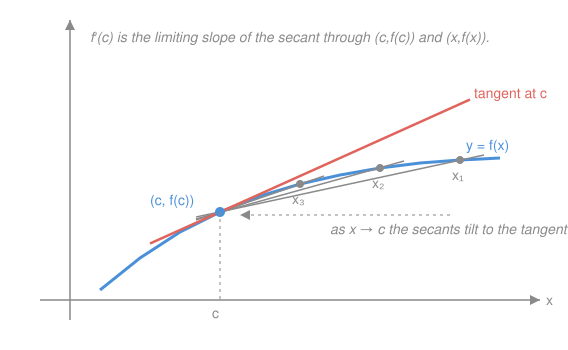

# Real Analysis · Lesson 6.1: The derivative, rigorously

> ⏱ ~15 min · Module 6: Differentiation · Builds on: [5.1 Limits of functions and continuity](05-01-limits-and-continuity.md) · Unlocks: [6.2 The Mean Value Theorem](06-02-mean-value-theorem.md)

## Why this matters

In `calc-refresher` the derivative was a machine: feed in $x^3$, crank the power rule, get $3x^2$. Every function you met had a derivative because every function you met was built from pieces you had rules for. Analysis flips the question. The derivative is a **limit**, and a limit is a promise that can be broken — corners, cusps, and functions that wiggle infinitely fast all fail to have one. The same symbol $f'(c)$ now carries a definition you can *argue with*: it's what lets you prove the Mean Value Theorem next lesson, and the MVT is the engine behind "$f'>0 \Rightarrow f$ increasing," Taylor's theorem, and every error bound downstream. First we make the object honest.

## The idea

Zoom in on a graph at a point. If, as you magnify, the curve looks more and more like a single straight line, that line's slope is the derivative — the curve is *locally linear* there. The way you catch that slope is with **secant lines**: pin one end at $(c, f(c))$, put the other at a nearby $(x, f(x))$, and slide $x$ toward $c$. Each secant has slope $\frac{f(x)-f(c)}{x-c}$, and if those slopes home in on a single number as $x\to c$, that number is $f'(c)$.

The catch is the word *if*. At a corner like $|x|$ at $0$, the secants coming from the left settle on slope $-1$ and the ones from the right settle on $+1$ — two answers, so no limit, so no derivative, even though nothing about the graph is broken or jumps. Differentiability is a strictly stronger demand than continuity: it asks not just "no gap" but "one well-defined slope." That gap between the two is where this whole module lives.

## The formal version

**Definition (the derivative).** Let $f$ be defined on an open interval containing $c$. We say $f$ is **differentiable at $c$** if the limit

$$f'(c) \;=\; \lim_{x\to c}\frac{f(x)-f(c)}{x-c}$$

exists (as a finite number). Substituting $x = c+h$ gives the equivalent form $f'(c)=\lim_{h\to 0}\frac{f(c+h)-f(c)}{h}$.

> In words: $f'(c)$ is the limiting slope of the secant lines through $(c,f(c))$ — one number the nearby slopes agree on, or nothing at all.

Because it's an ordinary functional limit, everything from [5.1](05-01-limits-and-continuity.md) applies: the limit is two-sided (the left and right difference quotients must exist *and agree*), and you can test it with sequences.

**Theorem (differentiable $\Rightarrow$ continuous).** If $f$ is differentiable at $c$, then $f$ is continuous at $c$.

> In words: having a slope forces having no gap — smoothness is a *stronger* condition than continuity, never a weaker one.

*Proof.* For $x\neq c$, split off the difference quotient as a factor:

$$f(x)-f(c) \;=\; \frac{f(x)-f(c)}{x-c}\cdot(x-c).$$

As $x\to c$, the first factor $\to f'(c)$ (a finite number, by hypothesis) and the second $\to 0$. By the algebra of limits, the product $\to f'(c)\cdot 0 = 0$. Hence $\lim_{x\to c} f(x) = f(c)$, which is exactly continuity at $c$. $\blacksquare$

**The converse fails**, and that failure is the point of the lesson: $|x|$ is continuous at $0$ but not differentiable there (worked below). Continuity buys you no slope.

**Carathéodory's formulation.** $f$ is differentiable at $c$ **if and only if** there is a function $\varphi$, defined near $c$ and *continuous at $c$*, with

$$f(x)-f(c) = \varphi(x)\,(x-c)\quad\text{for all }x\text{ near }c,\qquad\text{and}\qquad \varphi(c)=f'(c).$$

> In words: instead of dividing to form $\frac{f(x)-f(c)}{x-c}$ (which is undefined at $x=c$), package the slope as a *factor* $\varphi$ that plugs the hole continuously — $\varphi(c)$ is the derivative.

*Why it's the same statement.* If $f'(c)$ exists, set $\varphi(x)=\frac{f(x)-f(c)}{x-c}$ for $x\neq c$ and $\varphi(c)=f'(c)$; the limit definition says exactly that this $\varphi$ is continuous at $c$, and the identity $f(x)-f(c)=\varphi(x)(x-c)$ holds (both sides are $0$ at $x=c$). Conversely, given such a $\varphi$, for $x\neq c$ we have $\frac{f(x)-f(c)}{x-c}=\varphi(x)\to\varphi(c)$ as $x\to c$ by continuity, so the derivative exists and equals $\varphi(c)$. The value of this repackaging: no division by zero anywhere, which makes the chain rule fall out in one line.

## Picture

## Worked examples

**Example 1 (the rules are theorems now — product rule).** Suppose $f,g$ are differentiable at $c$. Then $fg$ is, with $(fg)'(c)=f(c)g'(c)+f'(c)g(c)$. The trick is add-and-subtract:

$$\frac{f(x)g(x)-f(c)g(c)}{x-c} = \underbrace{f(x)\cdot\frac{g(x)-g(c)}{x-c}}_{\text{add }-f(x)g(c)+f(x)g(c)} + g(c)\cdot\frac{f(x)-f(c)}{x-c}.$$

Explicitly, we inserted $-f(x)g(c)+f(x)g(c)$ in the numerator and regrouped. Now let $x\to c$: since $f$ is differentiable it is continuous, so $f(x)\to f(c)$; the two difference quotients $\to g'(c)$ and $\to f'(c)$. The limit is $f(c)g'(c)+g(c)f'(c)$. The power rule you cranked mechanically is this plus induction — now with a proof underneath it.

**Example 2 (why Carathéodory earns its keep — the chain rule).** Let $g$ be differentiable at $c$ and $f$ differentiable at $d=g(c)$. Claim: $f\circ g$ is differentiable at $c$ with $(f\circ g)'(c)=f'(g(c))\,g'(c)$.

The naive proof multiplies $\frac{f(g(x))-f(g(c))}{g(x)-g(c)}\cdot\frac{g(x)-g(c)}{x-c}$ — and dies whenever $g(x)=g(c)$ for $x$ near $c$, because you divided by $0$. Carathéodory sidesteps this entirely. Factor each map:

$$g(x)-g(c)=\gamma(x)\,(x-c),\quad \gamma\text{ cont.\ at }c,\ \gamma(c)=g'(c);\qquad f(y)-f(d)=\varphi(y)\,(y-d),\quad \varphi\text{ cont.\ at }d,\ \varphi(d)=f'(d).$$

Set $y=g(x)$ (so $y-d=g(x)-g(c)$) and substitute:

$$f(g(x))-f(g(c)) = \varphi(g(x))\,\big(g(x)-g(c)\big) = \underbrace{\varphi(g(x))\,\gamma(x)}_{=:\,\psi(x)}\;(x-c).$$

No denominators appeared. And $\psi$ is continuous at $c$: $\gamma$ is; $g$ is continuous at $c$ and $\varphi$ is continuous at $d=g(c)$, so $\varphi\circ g$ is continuous at $c$; a product of continuous functions is continuous. By Carathéodory, $(f\circ g)'(c)=\psi(c)=\varphi(g(c))\,\gamma(c)=f'(g(c))\,g'(c)$. $\blacksquare$

**The corner — $|x|$ is not differentiable at $0$.** Take $f(x)=|x|$ and $c=0$. The difference quotient is

$$\frac{f(x)-f(0)}{x-0}=\frac{|x|}{x}=\begin{cases}+1,& x>0,\\ -1,& x<0.\end{cases}$$

The right-hand limit ($x\to 0^+$) is $+1$; the left-hand limit ($x\to 0^-$) is $-1$. A two-sided limit needs both to agree — they don't, so $f'(0)$ does not exist. Yet $|x|$ is continuous at $0$ (indeed everywhere). Continuity delivered a graph with no gap; it did **not** deliver a slope. This is the converse-fails theorem made concrete, and it is the whole reason differentiability deserves its own definition.

## Watch out

- You might think continuity is "almost" differentiability, but the gap is enormous. $|x|$ fails at one point; worse, there exist functions (Weierstrass's $\sum a^n\cos(b^n\pi x)$) that are **continuous everywhere and differentiable nowhere** — an unbroken graph that has a slope at no single point. Continuity is genuinely the weaker property.
- You might reach for a one-sided slope, but $f'(c)$ requires a **two-sided** limit. The left and right difference quotients must both exist *and be equal*; a corner is precisely two unequal one-sided slopes. (One-sided derivatives are a real, separate notion — just not this one.)
- You might read "$f'(c)$ exists" as "$f'$ is continuous," but these are different claims. A function can be differentiable at every point while $f'$ is discontinuous somewhere (see P2): $x^2\sin(1/x)$ has a derivative everywhere, yet $f'$ jumps around near $0$. "Differentiable" and "continuously differentiable ($C^1$)" are separate tiers.

## One-liner

> The derivative is the *limit* of secant slopes — a two-sided limit that either exists or doesn't; it forces continuity but continuity never forces it, and Carathéodory's "slope as a continuous factor" turns that limit into a lever.

## Problems

**P1 (🟢)** Use Carathéodory's factoring (no limit laws by hand) to find $f'(c)$ for $f(x)=x^3$ at an arbitrary $c$: exhibit a $\varphi$ continuous at $c$ with $x^3-c^3=\varphi(x)(x-c)$, and read off $\varphi(c)$.

**P2 (🟡)** Let $f(x)=x^2\sin(1/x)$ for $x\neq 0$ and $f(0)=0$. (a) Prove $f$ is differentiable at $0$ and find $f'(0)$ directly from the definition. (b) Compute $f'(x)$ for $x\neq 0$ and show $\lim_{x\to 0}f'(x)$ does not exist — so $f'$ is not continuous at $0$ even though $f'(0)$ exists.

**P3 (🔴, optional)** Define $f(x)=x^2$ if $x\in\mathbb{Q}$ and $f(x)=0$ if $x\notin\mathbb{Q}$. Prove $f$ is differentiable at $0$ (find $f'(0)$), yet $f$ is differentiable at *no other* point. (Hint: for $c\neq 0$, use the differentiable $\Rightarrow$ continuous theorem in contrapositive.)

Solutions

**P1** Factor the difference of cubes: $x^3-c^3=(x-c)(x^2+xc+c^2)$. So take $\varphi(x)=x^2+xc+c^2$, a polynomial, hence continuous everywhere and in particular at $c$. The identity $x^3-c^3=\varphi(x)(x-c)$ holds for all $x$, so by Carathéodory $f$ is differentiable at $c$ with

$$f'(c)=\varphi(c)=c^2+c\cdot c+c^2=3c^2.$$

The power rule, delivered without ever dividing by $x-c$.

**P2** **(a)** By definition,

$$f'(0)=\lim_{x\to 0}\frac{f(x)-f(0)}{x-0}=\lim_{x\to 0}\frac{x^2\sin(1/x)}{x}=\lim_{x\to 0}x\sin(1/x).$$

Since $|x\sin(1/x)|\le|x|\to 0$, the squeeze theorem (Module 2) gives the limit $0$. So $f$ is differentiable at $0$ with $f'(0)=0$.

**(b)** For $x\neq 0$, the product and chain rules give

$$f'(x)=2x\sin(1/x)+x^2\cos(1/x)\cdot\left(-\frac{1}{x^2}\right)=2x\sin(1/x)-\cos(1/x).$$

As $x\to 0$, the first term $\to 0$ (same squeeze), but $\cos(1/x)$ oscillates through every value in $[-1,1]$: e.g. along $x_n=\frac{1}{2\pi n}\to 0$ it equals $\cos(2\pi n)=1$, while along $x_n'=\frac{1}{(2n+1)\pi}\to 0$ it equals $\cos((2n+1)\pi)=-1$. Two subsequences, two different limits, so $\lim_{x\to 0}f'(x)$ does not exist. Thus $f'$ is defined everywhere but is **not continuous** at $0$ — "$f'(0)$ exists" and "$f'$ continuous at $0$" are different statements, exactly as warned.

**P3** **Differentiable at $0$:** the difference quotient is

$$\frac{f(x)-f(0)}{x-0}=\frac{f(x)}{x}=\begin{cases}x,& x\in\mathbb{Q},\\ 0,& x\notin\mathbb{Q}.\end{cases}$$

In either case $\left|\frac{f(x)}{x}\right|\le|x|\to 0$, so by the squeeze the limit is $0$ and $f'(0)=0$.

**Nowhere else:** fix $c\neq 0$. We show $f$ is *discontinuous* at $c$; then by the contrapositive of "differentiable $\Rightarrow$ continuous," $f$ is not differentiable at $c$. Pick a sequence of rationals $q_n\to c$ and a sequence of irrationals $t_n\to c$ (both exist by density of $\mathbb{Q}$ and of the irrationals, from Module 1). Then $f(q_n)=q_n^2\to c^2$, whereas $f(t_n)=0\to 0$. Since $c\neq 0$ means $c^2\neq 0$, the two sequences force different limits for $f$ along sequences both converging to $c$ — so by the sequential criterion ([5.1](05-01-limits-and-continuity.md)) $f$ has no limit at $c$ and is discontinuous there. Not continuous $\Rightarrow$ not differentiable. Hence $f$ is differentiable at exactly one point, $c=0$.

## Flashback

**From Lesson 5.1 (Limits of functions and continuity — the sequential criterion):** Let $g(x)=\sin(1/x)$ for $x\neq 0$ and $g(0)=0$. Prove $g$ is **discontinuous** at $0$ by exhibiting a single sequence $x_n\to 0$ with $g(x_n)\not\to g(0)$.

Solution

The sequential criterion says $g$ is continuous at $0$ iff $g(x_n)\to g(0)=0$ for *every* sequence $x_n\to 0$. To break it, we need just one bad sequence. Choose

$$x_n=\frac{1}{\frac{\pi}{2}+2\pi n}\qquad(n=1,2,3,\dots),$$

so $x_n>0$ and $x_n\to 0$. Then $\frac{1}{x_n}=\frac{\pi}{2}+2\pi n$, and

$$g(x_n)=\sin\!\left(\frac{\pi}{2}+2\pi n\right)=1\quad\text{for every }n.$$

So $g(x_n)\to 1\neq 0=g(0)$. A sequence marching to $0$ whose $g$-values stay pinned at $1$ — the sequential criterion is violated, so $g$ is discontinuous at $0$. (This is the same pathology powering P2: infinitely fast oscillation is exactly what a limit cannot survive.) $\blacksquare$

## Connections

- **Backward:** the derivative is nothing but a functional limit from [5.1](05-01-limits-and-continuity.md) applied to the difference quotient — two-sidedness, the sequential criterion, and the algebra of limits all carry straight over, and the "$\Rightarrow$ continuous" proof is one line of that algebra.
- **Forward:** [6.2](06-02-mean-value-theorem.md) needs differentiability on an interval to prove Rolle and the Mean Value Theorem — the tools that finally let you read a function's behavior off its derivative ($f'>0\Rightarrow$ increasing, $f'=0\Rightarrow$ constant). Carathéodory's factoring returns in Lesson 6.3 as the clean way to organize Taylor's theorem.
- **Sideways:** in `calc-refresher` the chain rule justified $u$-substitution and the product rule justified integration by parts; here those rules stopped being recipes and became theorems. In physics, "$x^2\sin(1/x)$-type" non-$C^1$ behavior is why one distinguishes velocity existing from acceleration existing — differentiability is a ladder, not a switch.
