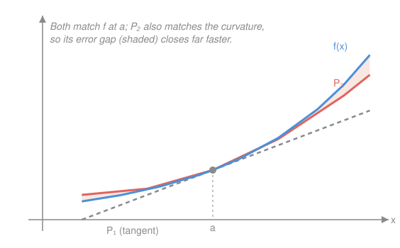

# Real Analysis · Lesson 6.3: Taylor's theorem with remainder

> ⏱ ~15 min · Module 6: Differentiation · Builds on: [6.2 The Mean Value Theorem](06-02-mean-value-theorem.md) · Unlocks: Module 7 — [7.1 Darboux sums and integrability](07-01-darboux-sums-integrability.md)

## Why this matters

In `calc-refresher` you built Taylor polynomials as the "best local fit" — match a function and its first $n$ derivatives at a point, and near that point the polynomial hugs the curve. That's the *approximation*. It leaves the only question an engineer or a physicist actually needs answered: **how wrong is it?** If you replace $\sin x$ by $x-\tfrac{x^3}{6}$ in a calculation, is the error $10^{-2}$ or $10^{-9}$? Taylor's theorem is the machine that turns "approximately" into a number. It's the Mean Value Theorem from [6.2](06-02-mean-value-theorem.md), pushed to higher order — and it hands you an exact formula for the leftover.

## The idea

The tangent line at $a$ is the degree-1 Taylor polynomial: it matches $f(a)$ and the slope $f'(a)$. Add the $f''(a)$ term and you match the curvature too, so the parabola peels away from $f$ more slowly. Keep going and each new term kills off one more order of error.

Here's the whole insight in one sentence. The MVT says $f(x)-f(a)=f'(\xi)(x-a)$ — the error of the *constant* approximation $f(a)$ is captured **exactly** by one derivative term, evaluated at some unknown interior point $\xi$. Taylor's theorem says the same thing at every order: the error of the degree-$n$ polynomial is captured exactly by the *next* term, $\frac{f^{(n+1)}(\xi)}{(n+1)!}(x-a)^{n+1}$, with the derivative evaluated at some unknown $\xi$ between $a$ and $x$. You never learn $\xi$ — but you don't need to. Bound $f^{(n+1)}$ over the interval and you've bounded the error, rigorously.

## The formal version

**The Taylor polynomial.** For $f$ that is $n$ times differentiable at $a$, define

$$P_n(x)=\sum_{k=0}^n \frac{f^{(k)}(a)}{k!}\,(x-a)^k = f(a)+f'(a)(x-a)+\frac{f''(a)}{2}(x-a)^2+\cdots+\frac{f^{(n)}(a)}{n!}(x-a)^n.$$

> In words: $P_n$ is the unique degree-$n$ polynomial whose value and first $n$ derivatives at $a$ agree with those of $f$. (Here $f^{(k)}$ is the $k$th derivative, $f^{(0)}=f$, and $k!$ is the factorial.)

**Taylor's theorem (Lagrange form of the remainder).** Let $f$ be $n+1$ times differentiable on an open interval $I$ containing $a$, and let $x\in I$ with $x\neq a$. Then there exists a point $\xi$ **strictly between** $a$ and $x$ such that

$$f(x)=P_n(x)+R_n(x),\qquad R_n(x)=\frac{f^{(n+1)}(\xi)}{(n+1)!}\,(x-a)^{n+1}.$$

> In words: the error of the degree-$n$ approximation is *exactly one more Taylor term* — the $(n+1)$th — except the derivative is read off at a mystery interior point $\xi$ instead of at $a$.

**Proof (iterated Rolle on an auxiliary function).** Fix $x$. Choose the number $M$ so that the remainder formula holds by *definition* of $M$:

$$M=\frac{f(x)-P_n(x)}{(x-a)^{n+1}}\quad\Longleftrightarrow\quad f(x)=P_n(x)+M(x-a)^{n+1}.$$

Our whole job is to show $M=\dfrac{f^{(n+1)}(\xi)}{(n+1)!}$ for some interior $\xi$. Define, as a function of the *new* variable $t\in I$,

$$g(t)=f(t)-P_n(t)-M(t-a)^{n+1}.$$

Two facts about $g$. First, because $P_n$ matches $f$ through the $n$th derivative at $a$, and each derivative of $(t-a)^{n+1}$ up to order $n$ still carries a factor $(t-a)$ that vanishes at $t=a$,

$$g(a)=g'(a)=g''(a)=\cdots=g^{(n)}(a)=0.$$

Second, by our choice of $M$, $g(x)=f(x)-P_n(x)-M(x-a)^{n+1}=0$.

Now iterate **Rolle's theorem** from [6.2](06-02-mean-value-theorem.md). Since $g(a)=g(x)=0$, Rolle gives $\xi_1$ strictly between $a$ and $x$ with $g'(\xi_1)=0$. But also $g'(a)=0$, so applying Rolle to $g'$ on the interval between $a$ and $\xi_1$ yields $\xi_2$ with $g''(\xi_2)=0$. Repeat: at each stage we have $g^{(k)}(a)=0$ and $g^{(k)}(\xi_k)=0$, so Rolle produces $\xi_{k+1}$ with $g^{(k+1)}(\xi_{k+1})=0$. After $n+1$ steps we reach a point $\xi:=\xi_{n+1}$, strictly between $a$ and $x$, with

$$g^{(n+1)}(\xi)=0.$$

Finally compute $g^{(n+1)}$. Since $P_n$ has degree $n$, its $(n+1)$th derivative is $0$; and $\dfrac{d^{n+1}}{dt^{n+1}}(t-a)^{n+1}=(n+1)!$. So

$$g^{(n+1)}(t)=f^{(n+1)}(t)-M\,(n+1)!.$$

Set $t=\xi$: $\;0=f^{(n+1)}(\xi)-M(n+1)!$, hence $M=\dfrac{f^{(n+1)}(\xi)}{(n+1)!}$, which is exactly the Lagrange remainder. $\blacksquare$

**The $n=0$ case is the MVT.** Take $n=0$: $P_0(x)=f(a)$ and the theorem reads $f(x)=f(a)+f'(\xi)(x-a)$ — that is *precisely* the Mean Value Theorem. Taylor's theorem is the MVT with the same proof idea (Rolle) run at higher order.

**Error bound.** If $\lvert f^{(n+1)}(t)\rvert\le M$ for all $t$ between $a$ and $x$, then

$$\lvert R_n(x)\rvert\le \frac{M}{(n+1)!}\,\lvert x-a\rvert^{\,n+1}.$$

> In words: you don't need $\xi$ — a ceiling on the $(n+1)$th derivative over the interval gives a computable, honest error bar.

## Picture

## Worked examples

**Example 1 (mechanical — degree-2 Taylor of $\sqrt{1+x}$, with a real error bar).** Let $f(x)=\sqrt{1+x}=(1+x)^{1/2}$, expand at $a=0$. Differentiate:

$$f'(x)=\tfrac12(1+x)^{-1/2},\quad f''(x)=-\tfrac14(1+x)^{-3/2},\quad f'''(x)=\tfrac38(1+x)^{-5/2}.$$

So $f(0)=1,\ f'(0)=\tfrac12,\ f''(0)=-\tfrac14$, giving

$$P_2(x)=1+\frac{x}{2}-\frac{x^2}{8}.$$

Now bound the error at $x=0.1$ using the Lagrange remainder with $n=2$:

$$R_2(0.1)=\frac{f'''(\xi)}{3!}(0.1)^3=\frac{1}{6}\cdot\frac{3}{8}(1+\xi)^{-5/2}(0.1)^3=\frac{(0.1)^3}{16}\,(1+\xi)^{-5/2},\qquad \xi\in(0,0.1).$$

We don't know $\xi$, but we don't have to: for $\xi>0$ we have $(1+\xi)^{-5/2}\le 1$, so

$$\lvert R_2(0.1)\rvert\le \frac{(0.1)^3}{16}=6.25\times10^{-5}.$$

Check it against reality. $P_2(0.1)=1+0.05-0.00125=1.04875$, while $\sqrt{1.1}=1.0488088\ldots$, so the **true** error is $5.88\times10^{-5}$. Our rigorous bound $6.25\times10^{-5}$ sits just above it — tight, and guaranteed without ever computing the square root.

**Example 2 (why you'd care — when the Taylor *series* is the function).** Let the degree grow. The infinite Taylor series $\sum_{k=0}^\infty \frac{f^{(k)}(a)}{k!}(x-a)^k$ equals $f(x)$ **exactly when $R_n(x)\to 0$** as $n\to\infty$ — the series *is* $\lim_n P_n$, and $f-P_n=R_n$. Convergence of the series to $f$ is nothing but the remainder dying.

Take $f(x)=e^x$ at $a=0$; every derivative is $e^x$. For any fixed $x$, on the interval between $0$ and $x$ we have $\lvert f^{(n+1)}\rvert\le e^{\lvert x\rvert}$, so

$$\lvert R_n(x)\rvert\le \frac{e^{\lvert x\rvert}}{(n+1)!}\,\lvert x\rvert^{\,n+1}\xrightarrow[n\to\infty]{}0,$$

because the factorial in the denominator eventually overwhelms any fixed power in the numerator. So $e^x=\sum_{k\ge0}\frac{x^k}{k!}$ for **every** real $x$ — the remainder bound is the entire proof.

**The cautionary tale — a smooth function that is *not* its Taylor series.** Define

$$g(x)=\begin{cases}e^{-1/x^2},& x\neq 0,\\ 0,& x=0.\end{cases}$$

This $g$ is infinitely differentiable everywhere, and a computation shows $g^{(k)}(0)=0$ for **every** $k$ (the exponential crushes every power blowing up near $0$). So its Taylor series at $0$ is $0+0\cdot x+0\cdot x^2+\cdots\equiv 0$. Yet $g(x)>0$ for all $x\neq0$. The series converges — to the wrong thing. Here $R_n(x)=g(x)\not\to0$; the remainder never vanishes even as $n\to\infty$. **"Has a Taylor series" is not "equals its Taylor series."** A function where the two agree on a neighborhood is called *real-analytic*, and this $g$ is the standard example of smooth-but-not-analytic. Closing this gap — showing that for the right class of functions the remainder *must* vanish — is exactly what `complex-analysis` delivers: a complex-differentiable (holomorphic) function always equals its Taylor series.

## Watch out

- You might think $\xi$ is some fixed number you could solve for. It is **existential** — the theorem only promises it *exists*, and it changes with both $x$ and $n$. You never pin it down; you bound $f^{(n+1)}$ over the whole interval and let $\xi$ hide inside the bound.
- You might think "more derivatives ⟹ better approximation ⟹ convergence." Not so: $g(x)=e^{-1/x^2}$ has infinitely many derivatives and its Taylor series still misses it entirely. Smoothness guarantees the *polynomials* exist, not that their limit is $f$ — only $R_n\to0$ guarantees that.
- You might think the remainder is the last term you kept. It's the **first term you dropped**: for $P_n$, the error is the order-$(n+1)$ term (with $\xi$ in place of $a$). Miscount this and your error bar is off by a whole factor of $(x-a)$.

## One-liner

> Taylor's theorem is the MVT at every order: the error of the degree-$n$ polynomial is exactly the next term with its derivative dragged to an unknown interior point — bound that derivative and you've bounded the error for good.

## Problems

**P1 (🟢)** Let $f(x)=\ln(1+x)$. Find the degree-2 Taylor polynomial $P_2$ at $a=0$, then use the Lagrange remainder to give a rigorous upper bound on $\lvert f(0.5)-P_2(0.5)\rvert$. Compare your bound to the true error.

**P2 (🟡)** Prove that the Taylor series of $\sin x$ at $0$ converges to $\sin x$ for **every** real $x$, by bounding the Lagrange remainder. (Hint: what is the biggest $\lvert(\sin)^{(n+1)}\rvert$ can ever be?)

**P3 (🔴, optional)** Suppose $f$ is twice differentiable on $\mathbb{R}$ with $f(0)=0$, $f'(0)=0$, and $\lvert f''(t)\rvert\le M$ for all $t$. Prove that $\lvert f(x)\rvert\le \tfrac{M}{2}x^2$ for all $x$. (This is the error-bound idea used as a *theorem*: two vanishing conditions plus a bounded second derivative pin the whole function inside a parabola.)

Solutions

**P1** Differentiate $f(x)=\ln(1+x)$: $f'(x)=\frac{1}{1+x}$, $f''(x)=-\frac{1}{(1+x)^2}$, $f'''(x)=\frac{2}{(1+x)^3}$. At $a=0$: $f(0)=0,\ f'(0)=1,\ f''(0)=-1$, so

$$P_2(x)=x-\frac{x^2}{2}.$$

Lagrange remainder with $n=2$: for some $\xi\in(0,0.5)$,

$$R_2(0.5)=\frac{f'''(\xi)}{3!}(0.5)^3=\frac{1}{6}\cdot\frac{2}{(1+\xi)^3}(0.5)^3=\frac{(0.5)^3}{3(1+\xi)^3}.$$

For $\xi>0$, $(1+\xi)^3>1$, so

$$\lvert R_2(0.5)\rvert\le\frac{(0.5)^3}{3}=\frac{0.125}{3}\approx 0.0417.$$

True error: $P_2(0.5)=0.5-0.125=0.375$ and $\ln(1.5)=0.405465\ldots$, so the actual error is $0.03047$ — comfortably under the bound $0.0417$, as it must be.

**P2** Let $f=\sin$. Every derivative of $\sin$ is $\pm\sin$ or $\pm\cos$, so $\lvert f^{(n+1)}(t)\rvert\le 1$ for all $t$ and all $n$. The Lagrange remainder at $a=0$ therefore satisfies, for each fixed $x$,

$$\lvert R_n(x)\rvert=\left\lvert\frac{f^{(n+1)}(\xi)}{(n+1)!}x^{\,n+1}\right\rvert\le \frac{\lvert x\rvert^{\,n+1}}{(n+1)!}.$$

For fixed $x$, $\frac{\lvert x\rvert^{n+1}}{(n+1)!}\to0$ as $n\to\infty$ (factorial beats any fixed power — e.g. once $n+1>2\lvert x\rvert$ each new factor at most halves the term). Hence $R_n(x)\to0$, so $P_n(x)\to\sin x$, i.e. $\sin x=\sum_{k\ge0}\frac{(-1)^k}{(2k+1)!}x^{2k+1}$ for every real $x$. $\blacksquare$

**P3** Apply Taylor's theorem with $n=1$ at $a=0$: for any $x\neq0$ there is $\xi$ strictly between $0$ and $x$ with

$$f(x)=f(0)+f'(0)\,x+\frac{f''(\xi)}{2!}x^2=0+0+\frac{f''(\xi)}{2}x^2.$$

Taking absolute values and using $\lvert f''(\xi)\rvert\le M$,

$$\lvert f(x)\rvert=\frac{\lvert f''(\xi)\rvert}{2}\,x^2\le\frac{M}{2}\,x^2.$$

At $x=0$ both sides are $0$, so the bound holds for all $x$. (Notice the two conditions $f(0)=f'(0)=0$ are what erased the degree-0 and degree-1 terms, leaving the pure quadratic remainder — this is why they were given.) $\blacksquare$

## Flashback

**From Lesson 6.2 (The Mean Value Theorem):** Let $f$ be differentiable on all of $\mathbb{R}$ with $\lvert f'(t)\rvert\le L$ for every $t$. Prove that $f$ is **Lipschitz** with constant $L$: $\lvert f(x)-f(y)\rvert\le L\lvert x-y\rvert$ for all $x,y$.

Solution

If $x=y$ both sides are $0$. If $x\neq y$, apply the MVT to $f$ on the closed interval with endpoints $x$ and $y$: there is a point $c$ strictly between them with

$$f(x)-f(y)=f'(c)\,(x-y).$$

Take absolute values and use the derivative bound:

$$\lvert f(x)-f(y)\rvert=\lvert f'(c)\rvert\,\lvert x-y\rvert\le L\,\lvert x-y\rvert.$$

So a uniform ceiling on the derivative forces a uniform Lipschitz bound — the derivative is literally the local stretch rate, and its cap caps every secant slope. (With $L=1$ and $f=\sin$, this is the boss-problem inequality $\lvert\sin x-\sin y\rvert\le\lvert x-y\rvert$.) $\blacksquare$

## Connections

- **Backward:** the theorem *is* [6.2](06-02-mean-value-theorem.md)'s MVT run at higher order — the $n=0$ case is the MVT verbatim, and the proof is just Rolle iterated $n+1$ times. The Taylor polynomial itself is the linearization of `calc-refresher` promoted from "good fit" to "fit with a certified error term."
- **Forward:** term-by-term integration and differentiation of power series in Module 8 ([8.3](08-03-power-series.md)) needs exactly this remainder control; the caution example $e^{-1/x^2}$ is the standing warning that motivates *uniform* convergence there. And bounding a function by its Taylor remainder is a routine tool once you start estimating integrals in Module 7.
- **Sideways (`complex-analysis`):** the gap exposed here — smooth but not equal to its Taylor series — is closed for holomorphic functions, where differentiability *once* (in the complex sense) forces the Taylor series to converge back to the function. That's the payoff `complex-analysis` is built to deliver, and this lesson is where you first feel why it's remarkable.
