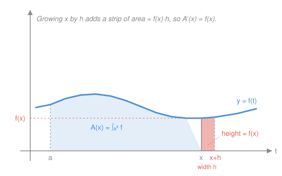

# Real Analysis · Lesson 7.3: The Fundamental Theorem of Calculus

> ⏱ ~15 min · Module 7: The Riemann integral · Builds on: [7.1 Darboux sums and integrability](07-01-darboux-sums-integrability.md), [6.2 The Mean Value Theorem](06-02-mean-value-theorem.md) · Unlocks: Module 8 — [8.1 Pointwise vs. uniform convergence](08-01-pointwise-vs-uniform.md)

## Why this matters

Differentiation and integration were invented to answer unrelated questions: one finds the slope of a curve, the other the area beneath it. There is no reason on the face of it that a machine for slopes should undo a machine for areas. The Fundamental Theorem of Calculus says they do — and that single fact is why you can compute an integral by *guessing an antiderivative* instead of summing infinitely many rectangles. In calc you used it a thousand times. Now you prove it, and — the part calc never told you — you see *exactly* which hypothesis each of its two halves needs, and why the halves are not simply converses of each other.

## The idea

Watch area accumulate. Let $f$ be a positive function and let $A(x)$ be the area under its graph from a fixed left wall $a$ out to a moving right wall $x$. Nudge the wall rightward by a hair $h$: you tack on a thin vertical strip, almost a rectangle, of width $h$ and height $\approx f(x)$. So the *extra* area is about $f(x)\,h$, which means

$$\frac{A(x+h)-A(x)}{h}\approx f(x).$$

Let the hair shrink and the approximation becomes exact: **the rate at which area accumulates is the height of the curve**, $A'(x)=f(x)$. That is the whole theorem in one picture. Integration builds up area; differentiation reads off the instantaneous rate of that build-up; each undoes the other.

The second half is the flip side. If $F$ is *any* function whose derivative is $f$, then $F$ tracks accumulated area up to a constant, so the total area from $a$ to $b$ is just how much $F$ climbed: $F(b)-F(a)$. That is the version you actually compute with.

## The formal version

**FTC Part I (differentiate the integral).** Let $f$ be integrable on $[a,b]$ and define the accumulation function
$$F(x)=\int_a^x f(t)\,dt,\qquad x\in[a,b].$$
Then $F$ is continuous on $[a,b]$. Moreover, at any point $x_0$ where $f$ is **continuous**, $F$ is differentiable and
$$F'(x_0)=f(x_0).$$
In particular, if $f$ is continuous on all of $[a,b]$, then $F'=f$ everywhere — so **every continuous function has an antiderivative**, namely $F$.

> In words: sliding the right endpoint of an integral and asking how fast the total grows just hands you back the integrand — wherever the integrand is continuous.

**FTC Part II (evaluate the integral).** Let $f$ be integrable on $[a,b]$, and suppose $F$ is *any* antiderivative of $f$ on $[a,b]$ — that is, $F$ is continuous on $[a,b]$, differentiable on $(a,b)$, and $F'(x)=f(x)$ for all $x\in(a,b)$. Then
$$\int_a^b f(x)\,dx = F(b)-F(a).$$

> In words: if you can find *any* function whose slope is $f$, the integral is just its net change across the interval — no rectangles required.

Notice the asymmetry already: Part I *manufactures* an antiderivative (out of continuity); Part II *consumes* one you must supply.

## Picture

## Worked examples

**Example 1 (mechanical — proving Part I).** We prove $F'(x_0)=f(x_0)$ at a point of continuity. Fix $x_0\in[a,b]$ and $h\neq 0$ small enough to stay in $[a,b]$. By the additivity of the integral over adjacent intervals,
$$F(x_0+h)-F(x_0)=\int_a^{x_0+h} f-\int_a^{x_0} f=\int_{x_0}^{x_0+h} f(t)\,dt.$$
Divide by $h$:
$$\frac{F(x_0+h)-F(x_0)}{h}=\frac{1}{h}\int_{x_0}^{x_0+h} f(t)\,dt.$$
The right side is the **average value** of $f$ over the little interval between $x_0$ and $x_0+h$. Now use continuity of $f$ at $x_0$: given $\varepsilon>0$, there is $\delta>0$ so that $|f(t)-f(x_0)|<\varepsilon$ whenever $|t-x_0|<\delta$. For $0<|h|<\delta$ every $t$ between $x_0$ and $x_0+h$ satisfies $|t-x_0|<\delta$, so
$$f(x_0)-\varepsilon\le f(t)\le f(x_0)+\varepsilon \quad\text{on that interval.}$$
Integrating this sandwich over a length-$|h|$ interval and dividing by $h$ (the sign of $h$ works out either way) gives
$$\left|\frac{1}{h}\int_{x_0}^{x_0+h} f(t)\,dt-f(x_0)\right|\le \varepsilon.$$
Since $\varepsilon$ was arbitrary, the difference quotient converges to $f(x_0)$ as $h\to 0$. That is exactly $F'(x_0)=f(x_0)$. $\blacksquare$

(Continuity of $F$ — even where $f$ is *not* continuous — is easier: if $|f|\le M$ then $|F(x+h)-F(x)|=\left|\int_x^{x+h} f\right|\le M|h|\to 0$. So $F$ is not just continuous but Lipschitz. Hold onto this; it is the crux of "Watch out.")

**Example 2 (why you'd care — differentiating a nameless integral).** The function
$$F(x)=\int_0^x \frac{\sin t}{t}\,dt$$
(the *sine integral*, with the integrand assigned the value $1$ at $t=0$ to fill its removable hole, making it continuous everywhere) has **no elementary antiderivative** — you cannot write $F$ in closed form with powers, exponentials, and trig functions. And yet Part I differentiates it for free: since the integrand is continuous, Part I applies at every $x$ and
$$F'(x)=\frac{\sin x}{x}\qquad(F'(0)=1).$$
This is the payoff of Part I as an *existence* theorem. It does not compute $F$; it guarantees $F$ is a genuine, differentiable antiderivative of $\frac{\sin x}{x}$ even though no formula for $F$ exists. Antiderivatives are far more plentiful than the ones you can name.

## The two calculus workhorses, now justified

Part II turns the differentiation rules into integration rules — mechanically.

**Integration by parts.** If $u,v$ are differentiable on $[a,b]$ with $u',v'$ integrable, then
$$\int_a^b u\,v'\,dx = \big[u\,v\big]_a^b-\int_a^b u'\,v\,dx.$$
*Proof.* The product rule gives $(uv)'=u'v+uv'$. The left side is a derivative, and $u'v+uv'$ is integrable, so $uv$ is an antiderivative of $u'v+uv'$. Apply Part II:
$$\int_a^b (u'v+uv')\,dx=\big[uv\big]_a^b.$$
Split the left integral and move one piece over. $\blacksquare$

**Substitution (change of variables).** If $g$ is continuously differentiable on $[a,b]$ and $f$ is continuous on $g([a,b])$, then
$$\int_a^b f\big(g(x)\big)\,g'(x)\,dx=\int_{g(a)}^{g(b)} f(u)\,du.$$
This one is the chain rule read backwards: let $F$ be an antiderivative of $f$ (which exists by **Part I**, since $f$ is continuous). Then by the chain rule $\frac{d}{dx}F(g(x))=f(g(x))g'(x)$, so $F\circ g$ is an antiderivative of the left integrand; Part II collapses both sides to $F(g(b))-F(g(a))$.

Every substitution and every integration-by-parts you ever did was a disguised application of these two identities — and both rest on the FTC.

## Watch out

- **You might think Part II works for any integrable $f$**, but it needs an antiderivative $F$ with $F'=f$ *everywhere* on the interval. If $f$ has a jump — say $f=0$ on $[0,1)$ and $f=1$ at $\{1\}$-ish, or the step $f=-1$ then $+1$ — no differentiable $F$ can have $F'=f$ across the jump (a derivative satisfies the intermediate value property, by Darboux's theorem, so it *cannot* jump). The integral $\int_a^b f$ still exists; the "$F(b)-F(a)$" story simply does not apply. **A function can be integrable without having any antiderivative.**
- **You might think Part I makes $F$ differentiable everywhere**, but only where $f$ is *continuous*. If $f$ has a jump at $x_0$, then $F(x)=\int_a^x f$ is still continuous there (Example 1's Lipschitz bound), and even has one-sided derivatives equal to the one-sided limits of $f$ — but $F'(x_0)$ does not exist. Continuity of $f$ is exactly the hypothesis that welds the two one-sided rates together.
- **The two halves are not converses.** There exist differentiable $F$ whose derivative $F'$ is bounded but *not Riemann integrable* (Volterra's function is the classic example) — so $F$ is an antiderivative of $f=F'$, yet $\int_a^b f$ makes no Riemann sense and Part II's equation is unwritable. Symmetrically, Part I's $F$ is an antiderivative even when $f$ jumps at isolated points and $\int f$ is perfectly fine. "Has an antiderivative" and "is integrable" are *different* properties; the FTC connects them only where both hold.
- **You might think every integrable function has an elementary antiderivative.** Example 2 kills this: $\frac{\sin x}{x}$, $e^{-x^2}$, and $\frac{1}{\ln x}$ are continuous (hence integrable, hence *have* antiderivatives by Part I) but none of those antiderivatives is expressible in closed form.

## One-liner

> Integration accumulates and differentiation reads off the rate — the FTC proves they undo each other, Part I needing continuity to *build* an antiderivative and Part II needing one to *exist* so it can evaluate.

## Problems

**P1 (🟢)** Let $G(x)=\displaystyle\int_1^{x^2}\frac{1}{1+t^3}\,dt$. Compute $G'(x)$. (You'll need Part I *and* the chain rule — the upper limit isn't just $x$.)

**P2 (🟡)** Prove the following version of Part II directly from [6.2](06-02-mean-value-theorem.md) (the Mean Value Theorem), *not* from Part I. Let $f$ be integrable on $[a,b]$ and let $F$ satisfy $F'=f$ on $[a,b]$. Show $\int_a^b f=F(b)-F(a)$ by: taking any partition $a=x_0<x_1<\dots<x_n=b$, applying the MVT to $F$ on each $[x_{i-1},x_i]$, and squeezing the resulting sum between the lower and upper Darboux sums $L(f,P)$ and $U(f,P)$.

**P3 (🔴, optional)** Give an explicit integrable $f$ on $[-1,1]$ that has **no** antiderivative on $[-1,1]$, and prove it has none. (Hint: a single jump, plus the intermediate-value property of derivatives — Darboux's theorem — from the "Watch out" box.)

Solutions

**P1** Write $H(u)=\int_1^u \frac{dt}{1+t^3}$; since the integrand is continuous, Part I gives $H'(u)=\frac{1}{1+u^3}$. Now $G(x)=H(x^2)$, so by the chain rule
$$G'(x)=H'(x^2)\cdot\frac{d}{dx}(x^2)=\frac{1}{1+(x^2)^3}\cdot 2x=\frac{2x}{1+x^6}.$$

**P2** Fix any partition $P:\ a=x_0<x_1<\dots<x_n=b$, and set $\Delta x_i=x_i-x_{i-1}$. On each subinterval $[x_{i-1},x_i]$, $F$ is continuous and differentiable (since $F'=f$ there), so the **Mean Value Theorem** ([6.2](06-02-mean-value-theorem.md)) gives a point $t_i\in(x_{i-1},x_i)$ with
$$F(x_i)-F(x_{i-1})=F'(t_i)\,\Delta x_i=f(t_i)\,\Delta x_i.$$
Sum over $i$; the left side **telescopes**:
$$\sum_{i=1}^n\big(F(x_i)-F(x_{i-1})\big)=F(b)-F(a),\qquad\text{so}\qquad F(b)-F(a)=\sum_{i=1}^n f(t_i)\,\Delta x_i.$$
The right side is a Riemann sum of $f$ for $P$ with tags $t_i$. Since $m_i:=\inf_{[x_{i-1},x_i]}f\le f(t_i)\le \sup_{[x_{i-1},x_i]}f=:M_i$, that sum is trapped between the Darboux sums:
$$L(f,P)=\sum m_i\,\Delta x_i\ \le\ F(b)-F(a)\ \le\ \sum M_i\,\Delta x_i=U(f,P).$$
This holds for **every** partition $P$. But $f$ is integrable, so $\sup_P L(f,P)=\inf_P U(f,P)=\int_a^b f$. The constant $F(b)-F(a)$ lies in $[L(f,P),U(f,P)]$ for all $P$, hence lies between the sup of the lower sums and the inf of the upper sums — which coincide at $\int_a^b f$. Therefore $F(b)-F(a)=\int_a^b f$. $\blacksquare$ (This is precisely where [6.2](06-02-mean-value-theorem.md) pays off: the MVT is the bridge from the *net change* of $F$ to a *sampled sum* of $f$.)

**P3** Take
$$f(x)=\begin{cases} 0,& -1\le x<0,\\ 1,& 0\le x\le 1.\end{cases}$$
It is integrable: it is bounded and monotone (or: has one discontinuity, a set of measure zero — [7.2](07-02-which-functions-integrable.md)), with $\int_{-1}^1 f=1$. Suppose, for contradiction, some $F$ had $F'=f$ on all of $[-1,1]$. Then $f$ would be a derivative, so by **Darboux's theorem** (derivatives have the intermediate-value property) $f$ would take every value between $f(-\tfrac12)=0$ and $f(\tfrac12)=1$ on $[-\tfrac12,\tfrac12]$ — in particular the value $\tfrac12$. But $f$ only ever equals $0$ or $1$; it never hits $\tfrac12$. Contradiction. So no antiderivative exists, even though $f$ is integrable. $\blacksquare$

## Flashback

**From Lesson 6.2 (The Mean Value Theorem):** Use the MVT to prove that if $g$ is differentiable on $\mathbb{R}$ with $g'(x)\ge 1$ for all $x$, then $g(x)\ge g(0)+x$ for every $x\ge 0$. (A monotonicity/inequality argument — a fresh variant of reading a function off its derivative.)

Solution

Fix any $x>0$. Apply the **Mean Value Theorem** to $g$ on $[0,x]$: since $g$ is differentiable (hence continuous) there, there is a $c\in(0,x)$ with
$$\frac{g(x)-g(0)}{x-0}=g'(c).$$
By hypothesis $g'(c)\ge 1$, so $\frac{g(x)-g(0)}{x}\ge 1$, and multiplying by $x>0$ preserves the inequality:
$$g(x)-g(0)\ge x,\qquad\text{i.e.}\qquad g(x)\ge g(0)+x.$$
For $x=0$ it holds with equality. So $g(x)\ge g(0)+x$ for all $x\ge 0$. $\blacksquare$ (The MVT converts a *pointwise* bound on the slope into a *global* bound on the function — the same conversion that makes P2 above work.)

## Connections

- **Backward:** Part I is [7.1](07-01-darboux-sums-integrability.md)'s accumulation function watched under a microscope — its instantaneous growth rate is the integrand. Part II is [6.2](06-02-mean-value-theorem.md)'s Mean Value Theorem cashed out over a partition: the MVT samples the derivative, the partition telescopes, and integrability squeezes the two ends together. This is the lesson where Module 6 and Module 7 finally shake hands.
- **Forward:** In [8.1](08-01-pointwise-vs-uniform.md) and Module 8 you'll ask when a *limit* of functions can be integrated or differentiated term by term — and the FTC is the tool that transfers a statement about $\int f_n$ into one about the antiderivatives, so the whole "swap limit and integral" question runs through this theorem. Term-by-term integration of a power series is Part II applied inside its interval of convergence.
- **Sideways (physics):** "position is the integral of velocity, velocity is the derivative of position" is FTC Part I and II wearing kinematic clothes; the work integral $\int F\,dx=$ (change in potential) is Part II. In `calc-refresher` you used "FTC + one limit" to price a perpetuity — Example 2 there is this theorem doing the evaluating.
