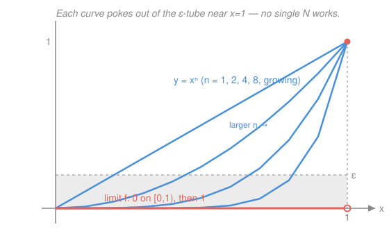

# Real Analysis · Lesson 8.1: Pointwise vs. uniform convergence

> ⏱ ~15 min · Module 8: Sequences and series of functions · Builds on: [2.1 Convergence: the ε–N definition](02-01-convergence-epsilon-n.md), [5.1 Limits of functions and continuity](05-01-limits-and-continuity.md) · Unlocks: [8.2 What uniform convergence preserves](08-02-what-uniform-convergence-preserves.md)

## Why this matters

Calc happily wrote "$\sum_{n=0}^\infty x^n/n! = e^x$, so differentiate term by term" and never asked whether that was legal. Sometimes it is; sometimes swapping a limit past a derivative or an integral gives a flatly wrong answer. The fault line runs between two ways a sequence of functions can converge — one safe, one treacherous — and telling them apart is the entire content of Module 8. Get this distinction and the theorems of the next two lessons (continuity, integration, and differentiation all pass to the limit) fall out; miss it and you'll "prove" that a limit of continuous functions is continuous, which is false.

## The idea

A sequence of *numbers* converges or it doesn't. A sequence of *functions* $f_1, f_2, f_3, \dots$ has a subtler question to answer, because "close" now has to hold across a whole domain of $x$'s at once.

The cheap notion is to check convergence **one point at a time**: freeze an $x$, watch the numbers $f_1(x), f_2(x), \dots$, and ask if they settle down. Do this at every $x$ separately and you get the *pointwise* limit. The trap is that each $x$ is allowed to converge at its own pace — some points may need $f_{10}$ to be close, stubborn points near a bad spot may not settle until $f_{10000}$. There's no shared deadline.

The honest notion demands a **shared deadline**: one cutoff $N$ past which *every* point is simultaneously within $\varepsilon$ of the limit. Picture an $\varepsilon$-thick tube drawn around the limit function; uniform convergence says the entire graph of $f_n$ eventually slips inside that tube and stays. This "all points in lockstep" mode is the one that transmits good behavior — continuity, area, slope — from the $f_n$ to their limit. The gap between the two modes is exactly where calculus's hand-waving hid real bugs.

## The formal version

Throughout, $D\subseteq\mathbb{R}$ is the common domain and $f_n:D\to\mathbb{R}$.

**Pointwise convergence.** $f_n\to f$ **pointwise** on $D$ if for each fixed $x\in D$, the numbers $f_n(x)\to f(x)$ — i.e. $\forall x\in D\ \forall\varepsilon>0\ \exists N\ \forall n>N:\ |f_n(x)-f(x)|<\varepsilon$.

> In words: fix a point first, and only then hunt for the cutoff. $N$ is allowed to depend on **both** $\varepsilon$ **and** $x$.

**Uniform convergence.** $f_n\to f$ **uniformly** on $D$ if
$$\forall\varepsilon>0\ \exists N\ \forall n>N\ \forall x\in D:\ |f_n(x)-f(x)|<\varepsilon.$$

> In words: one cutoff $N$ must work for *all* $x$ at once. Past $N$, the whole graph of $f_n$ lies inside the $\varepsilon$-tube $\{(x,y):|y-f(x)|<\varepsilon\}$ around $f$.

The only difference is the order of the quantifiers: pointwise puts $\forall x$ *outside* the $\exists N$ (so $N$ may adapt to $x$); uniform puts $\forall x$ *inside* (so $N$ is chosen before $x$ and must survive every $x$). That swap is the whole lesson. Uniform $\Rightarrow$ pointwise always (a single $N$ that beats all $x$ certainly beats each fixed one); the converse fails, as we'll see.

**The sup-norm test.** Define the **sup norm** of a bounded function $g$ on $D$ by $\|g\|_\infty := \sup_{x\in D}|g(x)|$ — the largest gap between $g$ and the zero function. Then:
$$f_n\to f \text{ uniformly on } D \iff \|f_n-f\|_\infty = \sup_{x\in D}|f_n(x)-f(x)| \longrightarrow 0.$$

> In words: uniform convergence is just ordinary convergence of one number — the *worst-case* error over the whole domain — down to $0$. This is the clean computational test: find the biggest deviation, see if it vanishes.

Why the equivalence holds: $\|f_n-f\|_\infty<\varepsilon$ means every $x$ satisfies $|f_n(x)-f(x)|\le\|f_n-f\|_\infty<\varepsilon$ at once — which is exactly the uniform condition. (One subtlety: the sup could exceed $\varepsilon$ while every individual value stays under it, if the sup isn't attained; but then it's under *some* value arbitrarily close, so "$\|f_n-f\|_\infty\to 0$" and the $\varepsilon$-for-all-$x$ statement still match up. Working with $\le\varepsilon$ vs $<\varepsilon$ never changes a limit.)

**Cauchy criterion for uniform convergence.** A sequence $(f_n)$ converges uniformly on $D$ to *some* limit iff it is **uniformly Cauchy**:
$$\forall\varepsilon>0\ \exists N\ \forall m,n>N\ \forall x\in D:\ |f_n(x)-f_m(x)|<\varepsilon.$$

> In words: the functions bunch together uniformly — one $N$ makes all late terms within $\varepsilon$ of each other everywhere — and that alone forces a uniform limit, no need to know it in advance.

This is the function-space echo of the numerical Cauchy criterion from [2.4](02-04-cauchy-sequences.md). *Proof sketch:* if uniformly Cauchy, then for each fixed $x$ the numbers $(f_n(x))$ are Cauchy in $\mathbb{R}$, hence converge (completeness of $\mathbb{R}$) to some value — call it $f(x)$. That defines the pointwise limit. Now hold $n>N$ and $x$ fixed in $|f_n(x)-f_m(x)|<\varepsilon$ and let $m\to\infty$: the inequality passes to the limit as $|f_n(x)-f(x)|\le\varepsilon$, for **all** $x$ simultaneously. That's uniform convergence. $\blacksquare$

## Picture

## Worked examples

**Example 1 (mechanical — the sup-norm test passing).** Let $f_n(x)=\dfrac{x}{n}$ on $D=[0,1]$. Pointwise, for each fixed $x$, $x/n\to 0$, so $f\equiv 0$. Is it uniform? Compute the worst-case error:
$$\|f_n-0\|_\infty=\sup_{x\in[0,1]}\left|\frac{x}{n}\right|=\frac{1}{n}\xrightarrow[n\to\infty]{}0.$$
The sup goes to $0$, so convergence is uniform. Concretely: given $\varepsilon>0$, pick $N>1/\varepsilon$; then for all $n>N$ and *all* $x\in[0,1]$, $|x/n|\le 1/n<\varepsilon$ — one $N$, every $x$. (Note the domain matters: on all of $\mathbb{R}$ the sup of $|x/n|$ is $\infty$ for every $n$, so it's only pointwise there. Uniformity is a statement about a *domain*, not a formula.)

**Example 2 (why you'd care — the canonical failure, $x^n$).** Let $f_n(x)=x^n$ on $D=[0,1]$. Fix $x$ and take the pointwise limit:
$$f(x)=\lim_{n\to\infty}x^n=\begin{cases}0,& 0\le x<1,\\[2pt] 1,& x=1.\end{cases}$$
For $0\le x<1$, powers of a number below $1$ decay to $0$; at $x=1$, $1^n=1$ forever. So the pointwise limit **exists** — but it is *discontinuous* at $x=1$, even though every $f_n$ is a continuous (indeed polynomial) function. A limit of continuous functions need not be continuous. That already tells us the convergence *can't* be uniform (the next lesson proves a uniform limit of continuous functions is continuous), but let's see it fail by hand.

Compute the worst-case error on $[0,1)$, where $f=0$:
$$\|f_n-f\|_\infty=\sup_{x\in[0,1]}|x^n-f(x)|\ \ge\ \sup_{x\in[0,1)}|x^n-0|=\sup_{x\in[0,1)}x^n=1$$
for every $n$, since $x^n\to 1$ as $x\to 1^-$. The sup sits stubbornly at $1$ and never drops — so $\|f_n-f\|_\infty\not\to 0$, and convergence is **not uniform**.

A sharper way to see the same thing, exhibiting the "no shared deadline": for each $n$ pick the moving point $x_n=(1/2)^{1/n}\in[0,1)$. Then $f_n(x_n)=x_n^n=\tfrac12$, so $|f_n(x_n)-f(x_n)|=\tfrac12$ no matter how large $n$ is. There is always a point — creeping toward $1$ — where $f_n$ is a full $\tfrac12$ away from the limit. No $N$ can herd every $x$ inside an $\varepsilon=\tfrac12$ tube, because the trouble just slides closer to $1$ and waits for you. **The trouble is entirely near $x=1$:** on any smaller interval $[0,a]$ with $a<1$, $\sup_{[0,a]}x^n=a^n\to 0$ and the convergence *is* uniform. It's the approach to the jump that breaks it.

## Watch out

- You might think a pointwise limit of continuous functions is continuous — after all, each $f_n$ is nice. But $x^n$ is the standing counterexample: continuous polynomials converging pointwise to a function with a jump. Continuity survives *uniform* limits, not pointwise ones (that's [8.2](08-02-what-uniform-convergence-preserves.md)).
- You might treat "pointwise" and "uniform" as two flavors of the same strength. They're not: uniform is **strictly stronger**. Uniform $\Rightarrow$ pointwise (same $N$ works), but pointwise $\not\Rightarrow$ uniform ($x^n$). When someone says "$f_n\to f$" with no adverb, pin them down — the two modes license completely different moves.
- You might declare convergence uniform because $f_n(x)\to f(x)$ "fast" at the points you checked. The verdict is decided by the *single worst point*: $\|f_n-f\|_\infty\to 0$ or bust. One stubborn point, or a bump of fixed height that slides across the domain (like $x_n$ above, or a traveling spike), keeps the sup off $0$ and kills uniformity — no matter how well every *fixed* point behaves.

## One-liner

> Pointwise lets each point converge on its own schedule; uniform demands one deadline for all of them — and only the shared deadline, measured by $\|f_n-f\|_\infty\to 0$, is safe to pass limits through.

## Problems

**P1 (🟢)** Let $f_n(x)=\dfrac{\sin(nx)}{n}$ on $D=\mathbb{R}$. Find the pointwise limit $f$, then use the sup norm to decide whether $f_n\to f$ uniformly on all of $\mathbb{R}$.

**P2 (🟡)** Let $f_n(x)=x^n(1-x)$ on $[0,1]$. Show $f_n\to 0$ pointwise, then compute $\|f_n\|_\infty$ exactly (maximize over $[0,1]$) and decide whether the convergence is uniform.

**P3 (🔴, optional)** Define the "traveling tent" $f_n$ on $[0,1]$: $f_n(x)=n x$ for $0\le x\le \tfrac1n$, $f_n(x)=2-nx$ for $\tfrac1n\le x\le\tfrac2n$, and $f_n(x)=0$ for $x\ge\tfrac2n$ (a spike of height $1$ and shrinking width). Show $f_n\to 0$ pointwise on $[0,1]$ but not uniformly. Then note what this says about $\int_0^1 f_n$ versus $\int_0^1 (\lim f_n)$ — a preview of why swapping limit and integral needs a hypothesis.

Solutions

**P1** For each fixed $x$, $\left|\frac{\sin(nx)}{n}\right|\le\frac1n\to 0$, so the pointwise limit is $f\equiv 0$. Now the worst case: $\sin$ ranges over all of $[-1,1]$ for every $n$ (e.g. $nx=\pi/2$ is solvable), so
$$\|f_n-0\|_\infty=\sup_{x\in\mathbb{R}}\left|\frac{\sin(nx)}{n}\right|=\frac{1}{n}\xrightarrow[n\to\infty]{}0.$$
The sup $\to 0$, so convergence is **uniform** on all of $\mathbb{R}$. (The bound was uniform in $x$ from the start — the amplitude $1/n$ controls every point at once — which is the signature of uniform convergence.)

**P2** Fix $x\in[0,1]$: if $x=1$, $f_n(1)=0$ for all $n$; if $0\le x<1$, $x^n\to 0$ and $(1-x)$ is a fixed factor, so $f_n(x)\to 0$. Hence $f\equiv 0$ pointwise. Maximize $f_n(x)=x^n-x^{n+1}$ on $[0,1]$: $f_n'(x)=nx^{n-1}-(n+1)x^n=x^{n-1}\big(n-(n+1)x\big)=0$ gives the interior critical point $x^\*=\frac{n}{n+1}$. Then
$$\|f_n\|_\infty=f_n(x^\*)=\left(\frac{n}{n+1}\right)^n\left(1-\frac{n}{n+1}\right)=\left(\frac{n}{n+1}\right)^n\cdot\frac{1}{n+1}.$$
Now $\left(\frac{n}{n+1}\right)^n=\left(1+\frac1n\right)^{-n}\to e^{-1}$, so $\|f_n\|_\infty\approx \frac{e^{-1}}{n+1}\to 0$. The sup $\to 0$, so convergence **is uniform**. (Contrast with bare $x^n$: multiplying by the $(1-x)$ factor drags the value back down to $0$ right at the danger point $x=1$, taming the sup.)

**P3** *Pointwise:* fix $x\in[0,1]$. If $x=0$, $f_n(0)=0$ for all $n$. If $x>0$, then for all $n>2/x$ we have $x>\tfrac2n$, so $f_n(x)=0$; hence $f_n(x)\to 0$. So $f_n\to 0$ pointwise. *Not uniform:* each tent has peak value $1$ (at $x=\tfrac1n$), so $\|f_n-0\|_\infty=1$ for every $n$, which does not $\to 0$. The spike never shrinks in height — it just narrows and slides toward $0$ — so no $\varepsilon$-tube of radius $<1$ ever contains the whole graph. *The integral punchline:* the tent is a triangle of base $\tfrac2n$ and height $1$, so $\int_0^1 f_n=\tfrac12\cdot\tfrac2n\cdot 1=\tfrac1n\to 0$ — here the areas *do* vanish, matching $\int_0^1 0=0$. But raise the height to $n$ instead of $1$ (peak $n$, same base $2/n$) and you'd get $\int_0^1 f_n=1$ for all $n$ while still $f_n\to 0$ pointwise — so $\lim\int f_n=1\ne 0=\int\lim f_n$. Pointwise convergence gives you *no right* to swap the limit past the integral; uniform convergence (next lesson) is exactly the hypothesis that buys it back.

## Flashback

**From Lesson 5.1 (Limits of functions and continuity):** Prove that the function
$$g(x)=\begin{cases}x,& x\in\mathbb{Q},\\ 0,& x\notin\mathbb{Q}\end{cases}$$
is continuous at $x=0$ but at no other point. (Use the ε–δ definition at $0$, and the sequential criterion to break continuity elsewhere.)

Solution

*Continuous at $0$:* here $g(0)=0$. Given $\varepsilon>0$, take $\delta=\varepsilon$. For any $x$ with $|x-0|<\delta$, either $g(x)=x$ (rational $x$) or $g(x)=0$ (irrational $x$); in both cases $|g(x)-g(0)|=|g(x)|\le|x|<\delta=\varepsilon$. So $g$ is continuous at $0$.

*Discontinuous at every $a\ne 0$:* use the sequential criterion from [5.1](05-01-limits-and-continuity.md) — $g$ is continuous at $a$ iff $g(x_n)\to g(a)$ for *every* sequence $x_n\to a$. Fix $a\ne 0$.
- If $a\in\mathbb{Q}$, so $g(a)=a\ne 0$: by density of the irrationals (from [1.4](01-04-countable-and-uncountable.md)) pick irrationals $x_n\to a$. Then $g(x_n)=0\to 0\ne a=g(a)$. Continuity fails.
- If $a\notin\mathbb{Q}$, so $g(a)=0$: by density of $\mathbb{Q}$ pick rationals $x_n\to a$. Then $g(x_n)=x_n\to a\ne 0=g(a)$. Continuity fails.

Either way a single well-chosen sequence breaks the limit, so $g$ is continuous only at $0$. The point $0$ is special because there the two "branches" ($x$ and $0$) are forced to agree in the limit — the values pinch together as $x\to0$. $\blacksquare$

## Connections

- **Backward:** uniform convergence is just the ε–N convergence of [2.1](02-01-convergence-epsilon-n.md) applied to the *single number* $\|f_n-f\|_\infty$, and its Cauchy criterion is the function-space version of [2.4](02-04-cauchy-sequences.md), leaning again on completeness of $\mathbb{R}$. The failure in Example 2 is diagnosed with the sequential/continuity language of [5.1](05-01-limits-and-continuity.md).
- **Forward:** [8.2](08-02-what-uniform-convergence-preserves.md) cashes uniform convergence in — it's the hypothesis that lets continuity, the integral, and (with an extra condition) the derivative pass to the limit, and the Weierstrass M-test packages it for series. [8.3](08-03-power-series.md) then applies all of it to power series, which converge uniformly on compact subsets inside their radius.
- **Sideways:** the sup norm $\|\cdot\|_\infty$ makes the space of bounded functions a *normed space* where "$f_n\to f$" means genuine distance $\to 0$ — the first glimpse of the function spaces that `functional-analysis` is built on, and the metric-space convergence `topology` generalizes. Uniform convergence is exactly convergence *in that metric*.
