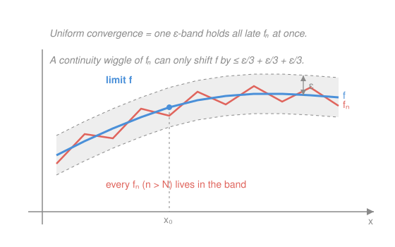

# Real Analysis · Lesson 8.2: What uniform convergence preserves

> ⏱ ~15 min · Module 8: Sequences and series of functions · Builds on: [8.1 Pointwise vs. uniform convergence](08-01-pointwise-vs-uniform.md), [7.3 The Fundamental Theorem of Calculus](07-03-fundamental-theorem-calculus.md) · Unlocks: [8.3 Power series](08-03-power-series.md)

## Why this matters

In [8.1](08-01-pointwise-vs-uniform.md) we watched $f_n(x)=x^n$ converge pointwise on $[0,1]$ to a *discontinuous* limit — every $f_n$ smooth, the limit broken. Pointwise convergence is too weak to carry anything across: continuity, the value of an integral, and derivatives can all be destroyed in the limit. Uniform convergence is the repair. This lesson is the payoff for defining it: **uniform convergence is exactly the license to move a limit inside the three operations of calculus** — evaluate ($\lim$ commutes with continuity), integrate, and (with one extra hypothesis) differentiate. That license is what makes the whole theory of power series in [8.3](08-03-power-series.md) legal.

## The idea

Think of the sup norm $\|f_n-f\|_\infty=\sup_x|f_n(x)-f(x)|$ from [8.1](08-01-pointwise-vs-uniform.md) as a *single number* measuring how far apart two whole functions are. Uniform convergence means that number goes to $0$: past some $N$, the graph of $f_n$ lives inside a band of half-width $\varepsilon$ hugging the graph of $f$, **everywhere at once** — no point gets to lag behind. Pointwise convergence only promises each *individual* point eventually gets close, and the "eventually" can race off to infinity as you move across the domain (that's the moving bump we'll meet below).

Once every late $f_n$ is uniformly close to $f$, good behavior can't leak out. If each $f_n$ is continuous, $f$ can't suddenly jump — a jump would need room bigger than the band allows. If each $f_n$ has a certain area, $f$'s area can differ by at most (band width) $\times$ (interval length), which vanishes. Differentiation is the one exception, and for a sharp reason: a tiny function can have a violent *slope*. That's why the derivative theorem asks the *derivatives* to converge uniformly, not the functions.

## The formal version

Throughout, $f_n\to f$ **uniformly** on a set $S$ means $\|f_n-f\|_\infty=\sup_{x\in S}|f_n(x)-f(x)|\to 0$.

**Theorem 1 (continuity passes to the limit).** If each $f_n$ is continuous on $S$ and $f_n\to f$ uniformly on $S$, then $f$ is continuous on $S$.

> In words: a uniform limit of continuous functions is continuous — the failure of $x^n$ is precisely that its convergence wasn't uniform.

*Proof (the $\varepsilon/3$ argument).* Fix $x_0\in S$ and $\varepsilon>0$. By uniform convergence pick $N$ with $\|f_N-f\|_\infty<\varepsilon/3$, so $|f_N(x)-f(x)|<\varepsilon/3$ for **all** $x$. Since $f_N$ is continuous at $x_0$, pick $\delta>0$ so that $|x-x_0|<\delta\Rightarrow|f_N(x)-f_N(x_0)|<\varepsilon/3$. Then for $|x-x_0|<\delta$,
$$|f(x)-f(x_0)|\le\underbrace{|f(x)-f_N(x)|}_{<\varepsilon/3}+\underbrace{|f_N(x)-f_N(x_0)|}_{<\varepsilon/3}+\underbrace{|f_N(x_0)-f(x_0)|}_{<\varepsilon/3}<\varepsilon.$$
The two outer terms are killed by *uniform* convergence (same $N$ works at both $x$ and $x_0$); the middle by continuity of $f_N$. So $f$ is continuous at $x_0$. $\blacksquare$

**Theorem 2 (limit and integral swap).** If each $f_n$ is (Riemann) integrable on $[a,b]$ and $f_n\to f$ uniformly on $[a,b]$, then $f$ is integrable and
$$\int_a^b f_n\;\longrightarrow\;\int_a^b f,\qquad\text{i.e.}\quad \lim_{n\to\infty}\int_a^b f_n=\int_a^b\Big(\lim_{n\to\infty}f_n\Big).$$

> In words: uniform convergence lets you pull the limit through the integral sign.

*Proof.* Integrability of $f$ follows because uniform closeness makes the Darboux upper/lower sums of $f$ and $f_N$ differ by at most $\|f_N-f\|_\infty(b-a)$, which is arbitrarily small (so $f$ meets the ε-criterion of integrability from Lesson 7.1). Granting that, estimate directly:
$$\left|\int_a^b f_n-\int_a^b f\right|=\left|\int_a^b(f_n-f)\right|\le\int_a^b|f_n-f|\le\int_a^b\|f_n-f\|_\infty\,dx=\|f_n-f\|_\infty\,(b-a)\to 0.\ \blacksquare$$

**Theorem 3 (term-by-term differentiation — handle with care).** Let each $f_n$ be differentiable on $[a,b]$. Suppose (i) $f_n(x_0)$ converges for some single point $x_0\in[a,b]$, and (ii) the derivatives $f_n'\to g$ **uniformly** on $[a,b]$. Then $f_n$ converges uniformly to some $f$, $f$ is differentiable, and
$$f'(x)=g(x)=\lim_{n\to\infty}f_n'(x).$$

> In words: to differentiate a limit term by term you need the *derivatives* to converge uniformly — uniform convergence of the $f_n$ themselves is neither here nor there.

## Picture

The blue spine is $f$; the grey band is $f\pm\varepsilon$. Once $n>N$, the red $f_n$ never leaves the band. To test continuity of $f$ at $x_0$ you jump from $f$ up to $f_n$ (costs $<\varepsilon/3$), slide along the *continuous* $f_n$ to a nearby point (costs $<\varepsilon/3$), then drop back down to $f$ (costs $<\varepsilon/3$) — the wiggle of $f_n$ transfers to $f$ with only $\varepsilon$ of slack.

## Worked examples

**Example 1 (continuity destroyed without uniformity — the standing warning).** Two pointwise-only failures, one per theorem.

- *Continuity:* $f_n(x)=x^n$ on $[0,1]$ converges pointwise to $f(x)=0$ for $x<1$ and $f(1)=1$ — discontinuous. Consistent with Theorem 1 only because convergence is **not** uniform: $\|f_n-f\|_\infty=\sup_{x<1}x^n=1\not\to0$. The band never closes near $x=1$.
- *Integral:* the **moving spike** $f_n(x)=n$ on $(0,1/n)$ and $0$ elsewhere. For each fixed $x>0$, once $1/n<x$ we have $f_n(x)=0$, and $f_n(0)=0$, so $f_n\to 0$ pointwise: $\int_0^1 f\,=0$. But $\int_0^1 f_n=n\cdot\frac1n=1$ for every $n$. So $\int f_n=1\not\to0=\int f$ — the area "escapes to infinity" through an ever-thinner, ever-taller spike. No contradiction with Theorem 2 because $\|f_n\|_\infty=n\to\infty$: wildly non-uniform.

**Example 2 (a function series made continuous by the M-test).** Consider
$$S(x)=\sum_{k=1}^{\infty}\frac{x^k}{k^2}\qquad\text{on }[-1,1].$$
For every $x\in[-1,1]$ and every $k$, $\left|\dfrac{x^k}{k^2}\right|\le\dfrac{1}{k^2}=:M_k$, and $\sum_{k\ge1}\frac1{k^2}=\pi^2/6<\infty$ (a $p=2>1$ series — convergent by the $p$-test / integral test of [3.2](03-02-convergence-tests.md)). The Weierstrass M-test (below) then makes the series converge **uniformly** on $[-1,1]$. Each partial sum $S_N(x)=\sum_{k=1}^N x^k/k^2$ is a polynomial, hence continuous; a uniform limit of continuous functions is continuous by Theorem 1. Therefore **$S$ is continuous on all of $[-1,1]$, endpoints included** — no case-checking at $x=\pm1$ required. This is the everyday way you certify that a series-defined function is well behaved.

**The Weierstrass M-test.** *If $|g_k(x)|\le M_k$ for all $x\in S$ and all $k$, and $\sum_{k}M_k$ converges, then $\sum_k g_k$ converges uniformly on $S$.*

> In words: dominate each term by a constant, and if the constants form a convergent numeric series, the whole function series converges uniformly — you've traded a hard functional question for the easy numeric tests of [3.2](03-02-convergence-tests.md).

*Proof (uniformly Cauchy via the tail).* Let $S_N=\sum_{k=1}^N g_k$. For $N>M$ and every $x\in S$,
$$|S_N(x)-S_M(x)|=\Bigg|\sum_{k=M+1}^{N}g_k(x)\Bigg|\le\sum_{k=M+1}^{N}|g_k(x)|\le\sum_{k=M+1}^{N}M_k\le\sum_{k=M+1}^{\infty}M_k.$$
The right side is independent of $x$. Since $\sum M_k$ converges, its tail $\sum_{k>M}M_k\to0$, so given $\varepsilon>0$ there is $M$ with $\sum_{k>M}M_k<\varepsilon$; then $\|S_N-S_M\|_\infty<\varepsilon$ for all $N>M$. So $(S_N)$ is **uniformly Cauchy**, and by the Cauchy criterion for uniform convergence ([8.1](08-01-pointwise-vs-uniform.md)) it converges uniformly. $\blacksquare$

## Watch out

- **You might think uniform convergence is *required* to swap limits — it's only *sufficient*.** Plenty of non-uniform sequences still allow the swap; the sharp tool for the integral swap is the dominated convergence theorem (relaxes uniformity to a domination bound), which you'll meet in `probability-theory`. Uniform convergence is the clean *sufficient* hypothesis, not a necessary one.
- **You might think uniform convergence of $f_n$ lets you differentiate term by term — it doesn't.** Counterexample: $f_n(x)=\dfrac{\sin(nx)}{\sqrt n}$. Then $\|f_n\|_\infty=\dfrac1{\sqrt n}\to0$, so $f_n\to0$ *uniformly*. But $f_n'(x)=\sqrt n\cos(nx)$, and $f_n'(0)=\sqrt n\to\infty$ — the derivatives blow up. It is the **derivatives** that Theorem 3 requires to converge uniformly, never the functions.
- **A pointwise limit can quietly change continuity or the integral.** The $x^n$ jump and the moving spike are your two permanent alarms: "$f_n\to f$ at every point" settles nothing about $f$'s continuity, its integral, or its derivative until you upgrade to uniform (and, for derivatives, upgrade the *derivatives*).

## One-liner

> Uniform convergence is the passport that lets a limit cross the border into continuity and the integral for free — and into the derivative only if the derivatives carry the passport too.

## Problems

**P1 (🟢)** Prove that $\displaystyle S(x)=\sum_{k=1}^{\infty}\frac{\cos(kx)}{k^2}$ converges uniformly on all of $\mathbb{R}$, and conclude that $S$ is continuous on $\mathbb{R}$.

**P2 (🟡)** Let $f_n(x)=n\,x\,(1-x^2)^n$ on $[0,1]$. Show that $f_n\to0$ pointwise but $\int_0^1 f_n\,dx\not\to\int_0^1 0\,dx$. What does this prove about the *mode* of convergence — without computing any sup norm?

**P3 (🔴, optional)** Let $f_n(x)=\dfrac{\sin(nx)}{n}$.
(a) Prove $f_n\to0$ uniformly on $\mathbb{R}$.
(b) Show $f_n'(0)\to1$ while $f'(0)=0$, so $\lim f_n'(0)\ne f'(0)$. Which hypothesis of Theorem 3 fails, and where does it fail?

Solutions

**P1** Set $g_k(x)=\cos(kx)/k^2$. For every $x\in\mathbb{R}$, $|\cos(kx)|\le1$, so
$$|g_k(x)|\le\frac{1}{k^2}=:M_k,\qquad\sum_{k=1}^\infty M_k=\sum_{k=1}^\infty\frac1{k^2}=\frac{\pi^2}{6}<\infty$$
(convergent $p=2$ series, [3.2](03-02-convergence-tests.md)). By the Weierstrass M-test, $\sum g_k$ converges uniformly on $\mathbb{R}$. Each partial sum $S_N(x)=\sum_{k=1}^N\cos(kx)/k^2$ is a finite sum of continuous functions, hence continuous; a uniform limit of continuous functions is continuous (Theorem 1). So $S$ is continuous on all of $\mathbb{R}$. $\blacksquare$

**P2** *Pointwise limit.* At $x=0$ and $x=1$, $f_n=0$ for all $n$. For fixed $x\in(0,1)$, let $r=1-x^2\in(0,1)$; then $f_n(x)=nx\,r^n\to0$ because geometric decay $r^n$ beats the linear factor $n$ (e.g. by the ratio test, or $n r^n\to0$). Hence $f_n\to0$ pointwise, and $\int_0^1 0\,dx=0$.

*The integrals.* Substitute $u=1-x^2$, $du=-2x\,dx$, so $x\,dx=-\tfrac12\,du$; as $x:0\to1$, $u:1\to0$:
$$\int_0^1 n\,x\,(1-x^2)^n\,dx=n\int_{1}^{0}u^n\left(-\tfrac12\right)du=\frac{n}{2}\int_0^1 u^n\,du=\frac{n}{2}\cdot\frac{1}{n+1}=\frac{n}{2(n+1)}\to\frac12.$$
So $\int_0^1 f_n\to\tfrac12\ne0=\int_0^1(\lim f_n)$.

*Conclusion.* By Theorem 2, **uniform** convergence would force $\int f_n\to\int f$. It didn't, so the convergence is **not uniform** on $[0,1]$ — the contrapositive of the theorem delivers this instantly, no sup-norm computation needed. (The bump $f_n$ concentrates near $x=0$, carrying a fixed slug of area that never flattens out — the moving-spike phenomenon in disguise.)

**P3** (a) $\|f_n-0\|_\infty=\sup_{x}\left|\dfrac{\sin(nx)}{n}\right|=\dfrac1n\to0$ since $|\sin|\le1$. So $f_n\to0$ uniformly on $\mathbb{R}$.

(b) $f_n'(x)=\cos(nx)$, so $f_n'(0)=\cos0=1$ for every $n$, giving $f_n'(0)\to1$. But the limit function is $f\equiv0$, so $f'(0)=0$. Thus $\lim_n f_n'(0)=1\ne0=f'(0)$: you may **not** move the limit inside the derivative here. The hypothesis that fails is Theorem 3's condition (ii) — uniform convergence of the *derivatives*. In fact $f_n'(x)=\cos(nx)$ doesn't even converge pointwise for most $x$ (e.g. at $x=\pi$, $\cos(n\pi)=(-1)^n$ oscillates), so there is no $g=\lim f_n'$ at all. Uniform convergence of the $f_n$ (part (a)) is genuinely irrelevant to differentiation — the derivatives are what must behave. $\blacksquare$

## Flashback

**From Lesson 7.3 (The Fundamental Theorem of Calculus — Part I):** Let $F(x)=\displaystyle\int_1^{x^2}\frac{1}{t}\,dt$ for $x>0$. Compute $F'(x)$ using FTC Part I (plus the chain rule), then check your answer by evaluating the integral first.

Solution

*Via FTC Part I.* Write $F(x)=G(x^2)$ where $G(u)=\int_1^u \tfrac1t\,dt$. FTC Part I says $G'(u)=\tfrac1u$ (the integrand $1/t$ is continuous on $t>0$). By the chain rule, with $u=x^2$ and $u'=2x$,
$$F'(x)=G'(x^2)\cdot\frac{d}{dx}(x^2)=\frac{1}{x^2}\cdot 2x=\frac{2}{x}.$$

*Check by evaluating first.* $F(x)=\big[\ln t\big]_1^{x^2}=\ln(x^2)-\ln 1=2\ln x$ (for $x>0$), so $F'(x)=2\cdot\tfrac1x=\tfrac2x$. ✓ The two routes agree — FTC Part I lets you differentiate an integral-defined function *without* first finding the antiderivative, which is the whole point when no elementary antiderivative exists. $\blacksquare$

## Connections

- **Backward:** the sup norm $\|\cdot\|_\infty$ and the Cauchy criterion for uniform convergence from [8.1](08-01-pointwise-vs-uniform.md) are the engine of every proof here; the integral swap (Theorem 2) leans on the Darboux ε-criterion of integrability (Lesson 7.1), and the M-test converts a functional question into the numeric convergence tests of [3.2](03-02-convergence-tests.md).
- **Forward:** [8.3](08-03-power-series.md) is these three theorems applied to $\sum a_k x^k$: the M-test gives uniform convergence on compact subsets of the disk, so power series are continuous, integrable, and differentiable term by term — that last fact is how you prove $\exp'=\exp$ and hand `complex-analysis` its starting point.
- **Sideways (probability):** uniform convergence is a *sufficient* condition for the limit–integral swap; `probability-theory` relaxes it to the dominated and monotone convergence theorems of the Lebesgue integral, which swap limits under a domination bound instead of a uniform one — the same question, answered with a bigger toolkit.
