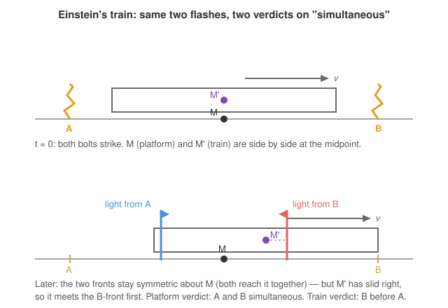

# Relativity (SR + GR) · Lesson 1.1: The postulates and the relativity of simultaneity

> ⏱ ~15 min · Module 1: Special relativity from the postulates · Builds on: [em-refresher 4.2 (Electromagnetic waves)](#/lesson/em-refresher/04-02-electromagnetic-waves.md), classical mechanics (inertial frames, Galilean relativity) · Unlocks: [1.2 Lorentz transformations](#/lesson/relativity/01-02-lorentz-transformations.md)

## Why this matters

Every worldview before 1905 rested on a silent assumption: there is a universal "now," a cosmic clock that every observer reads the same. Newton wrote it into the first sentence of the *Principia* — "absolute, true time flows equably." This lesson dismantles that sentence. From just **two** deceptively mild postulates, a single consequence falls out that breaks absolute time: two events that happen *at the same instant* for you can happen *at different instants* for someone moving past you. Everything else in special relativity — time dilation, length contraction, $E=mc^2$ — is bookkeeping once you accept this. Get simultaneity right and the rest is downhill; get it wrong and every "paradox" will trap you.

## The idea

Galileo already knew one deep thing: if you're below deck on a smoothly sailing ship, no experiment tells you whether you're moving. Balls fall straight down, water pours normally. Uniform motion is undetectable from inside — physics looks identical in every **inertial frame** (a frame in which a free particle moves in a straight line at constant speed; no acceleration, no rotation). That's the **principle of relativity**, and it survives untouched into Einstein's theory.

The trouble came from light. When Maxwell unified electricity and magnetism, his equations *predicted* electromagnetic waves traveling at one specific speed, $c \approx 3\times 10^8$ m/s — set by two lab constants, $c = 1/\sqrt{\varepsilon_0 \mu_0}$ (see [em-refresher 4.2](#/lesson/em-refresher/04-02-electromagnetic-waves.md)). But *speed relative to what?* Every other wave — sound, water — has a medium, and its speed is fixed relative to that medium, so you can catch up to it and see it slow. Physicists posited a medium for light too (the "ether") and expected Earth's motion through it to make $c$ come out different in different directions. Experiment (Michelson–Morley) found nothing: light's speed was stubbornly the same no matter how you chased it.

Einstein took the experiment at face value and promoted it to a law: **the speed of light in vacuum is the same $c$ in every inertial frame, regardless of how the source or the observer moves.** This is quietly outrageous. Fire a photon and sprint after it at half its speed — in ordinary life you'd see it recede at $\frac{1}{2}c$. Einstein says you still measure it fleeing at the full $c$. Velocities do **not** simply add.

Something has to give, and the casualty is simultaneity. Here's why, in one breath: to say two distant events happen "at the same time," you need a way to *compare* clocks at different places — and the only signal guaranteed to travel the same for everyone is light. But if everyone measures the *same* light speed while moving differently, they will disagree about when the signals "arrive together." **Simultaneity is not built into the universe; it is a judgment each observer makes with light signals, and moving observers make it differently.**

## The formal version

**Postulate 1 (Principle of relativity).** The laws of physics take the same form in every inertial frame. In words: no experiment done *inside* a uniformly moving lab can reveal its velocity — there is no preferred, "truly at rest" frame.

**Postulate 2 (Constancy of $c$).** Light propagates in vacuum with the same speed $c$ in every inertial frame, independent of the motion of its source. In words: $c$ is a property of spacetime, not a relative velocity you can add to or subtract from.

These two are in open conflict with **Galilean velocity addition**, $u' = u - v$ (a speed $u$ measured in one frame becomes $u-v$ in a frame moving at $v$). Apply it to light and you'd get $c - v \neq c$, contradicting Postulate 2. One of them must be wrong — and it is Galilean addition, which we'll replace next lesson.

**Operational simultaneity (Einstein synchronization).** Two clocks at rest at points $P$ and $Q$ in a frame are **synchronized** if a light flash emitted from the exact midpoint reaches $P$ and $Q$ at the same reading. Equivalently, two events are **simultaneous in a frame** if light signals from them reach the midpoint of their locations *at the same instant* in that frame. In words: "same time" is *defined* by light meeting in the middle — there is no other honest way to compare clocks that are far apart.

**The relativity of simultaneity (the headline).** Two events simultaneous in one inertial frame are, in general, **not** simultaneous in another frame moving relative to the first. Concretely (this is derived in [1.2](#/lesson/relativity/01-02-lorentz-transformations.md), previewed here): if two events are simultaneous in frame $S$ and separated by distance $L$ along the direction of relative motion, then in a frame $S'$ moving at speed $v$ they are separated in time by

$$\Delta t' = \frac{\gamma\, v L}{c^2}, \qquad \gamma = \frac{1}{\sqrt{1 - v^2/c^2}} \geq 1.$$

In words: displace two simultaneous events along the motion and the moving observer sees them tick apart, by an amount that grows with their separation $L$ and the relative speed $v$. For everyday $v \ll c$ the factor $vL/c^2$ is minuscule (that $c^2$ in the denominator is why nobody noticed for 250 years), but it is never exactly zero. Absolute time is gone.

## Picture

Two lightning bolts strike the ends of a moving train, $A$ at the rear and $B$ at the front (top panel). The platform observer $M$ stands at the midpoint of the strike marks; the train observer $M'$ rides the midpoint of the train. At the instant of the strikes they are side by side. A moment later (bottom panel) the two light fronts have travelled equal distances and remain symmetric about $M$ — so they reach $M$ **together**, and $M$ rightly declares the strikes simultaneous. But $M'$ has moved toward $B$: the front from $B$ has less ground to cover to reach $M'$, so $M'$ receives $B$ **before** $A$. Both use the same light at the same speed $c$; both reason correctly; they simply disagree about "at the same time."

## Worked examples

**Example 1 (mechanical — why the constancy of $c$ *forces* disagreement).** Suppose, for contradiction, that simultaneity were absolute — that $M$ and $M'$ must agree. In the platform frame, $M$ sees the two fronts arrive together (they travel equal distances at equal speed $c$). Now look through $M'$'s eyes. If light still moved at $c$ for $M'$ (Postulate 2), then since $M'$ physically intercepted the $B$-front earlier in the platform frame, and light-arrival at a point is a single physical event everyone agrees happened, $M'$ *must* judge $B$ to have flashed first. The only way to rescue "they agree" would be to let light travel at different speeds toward $M'$ (so the fronts could still reach $M'$ together) — but that is exactly what Postulate 2 forbids. Constancy of $c$ and absolute simultaneity cannot both hold; the experiment picks $c$.

**Example 2 (why you'd care — GPS and the meaning of "now").** A GPS receiver fixes your position by comparing the arrival times of signals from several satellites — it is doing Einstein synchronization on a planetary scale. The satellites move at ~4 km/s relative to the ground, so their onboard clocks and the ground's notion of "simultaneous" drift apart continually; ignoring relativity, positions would wander off by kilometers within a day. More conceptually: the relativity of simultaneity means the question "what is happening *right now* on a planet in another galaxy?" has **no observer-independent answer**. Tilt your velocity by walking across the room and your personal "now-slice" through that distant place sweeps back and forth across *years* of its history. There is no universal present tense — only each observer's own slicing of spacetime into "now." This is the first crack through which the whole classical worldview drains out, and Module 4 will rebuild spacetime as a single geometric object with no God-given time axis.

## Watch out

- You might think the disagreement is about *when the light reaches the observers* (a mere signal-delay illusion, correctable by "subtracting travel time"). It is not. Both observers **do** correct for light travel time, using $c$, and *still* disagree — because they use the *same* $c$ over *different* distances. Simultaneity is frame-dependent even after every honest correction. The relativity of simultaneity is real physics, not perception lag.
- You might think one observer is simply "right" and the other deceived by motion. Postulate 1 forbids this: neither frame is preferred. $M$ and $M'$ are equally correct; "simultaneous" is only meaningful *relative to a frame*, like "to the left of" is only meaningful relative to a facing direction.
- You might think simultaneity fails for events separated *perpendicular* to the motion too. It does not — the $\Delta t' = \gamma v L/c^2$ effect uses the separation *along* the direction of relative motion. Two events at the same $x$ but different $y$, simultaneous in $S$, stay simultaneous in a boost along $x$. Only the along-the-boost separation tips.

## One-liner

> "At the same time" is not a fact about the universe but a judgment each observer makes with light signals — and because everyone measures the same $c$, observers in relative motion make that judgment differently, so absolute time does not exist.

## Problems

**P1 (🟢)** A lamp at the exact midpoint of a train flashes once. In the **train frame**, the light reaches the front and rear walls simultaneously (equal distances, speed $c$). The train moves to the right at speed $v$ past a platform. Working entirely in the **platform frame**, show the flash does *not* reach the two ends at the same time, and determine which end the light reaches first. (Let the platform-measured train length be $L$; put the lamp at the origin at the moment it flashes.)

**P2 (🟡)** Two firecrackers explode simultaneously in frame $S$, a distance $L$ apart along the $x$-axis; call them $A$ (at $x=0$) and $B$ (at $x=L$). A frame $S'$ moves at speed $v$ in the $+x$ direction. Using $\Delta t' = \gamma v L/c^2$ (with the sign from the Lorentz rule $t' = \gamma(t - vx/c^2)$, coming in 1.2), determine which explosion happens *first* in $S'$, and by how much. State the general rule in words.

**P3 (🔴, optional)** Two clocks sit at rest in frame $S$, a distance $L$ apart along $x$, and are **synchronized in $S$** (they read $0$ at the same $S$-instant). An observer in $S'$, moving at $v$ in the $+x$ direction, insists the clocks are **not** synchronized. (a) Which clock does $S'$ say is *ahead*, and by how much? (b) Explain why this is not a contradiction — how can two people disagree about whether two physical clocks match?

Solutions

**P1** Work in the platform frame. At $t=0$ the lamp flashes at the origin; the rear wall is then at $x=-L/2$ and the front wall at $x=+L/2$, and both walls move right at $v$.

*Rightward light* meets the front wall when $ct = \tfrac{L}{2} + vt$, i.e.
$$t_{\text{front}} = \frac{L/2}{\,c - v\,}.$$
*Leftward light* meets the rear wall when $-ct = -\tfrac{L}{2} + vt$, i.e. $\tfrac{L}{2} = (c+v)t$, so
$$t_{\text{rear}} = \frac{L/2}{\,c + v\,}.$$
Since $c+v > c-v$, we have $t_{\text{rear}} < t_{\text{front}}$: **the light reaches the rear wall first.** Physically, the rear wall rushes *toward* the oncoming leftward front while the front wall *runs away* from the rightward front. The two arrivals are simultaneous in the train frame and non-simultaneous in the platform frame — the relativity of simultaneity, derived with nothing but "light moves at $c$ in this frame." (Note $c \pm v$ here are *closing speeds* of light-and-wall in the platform frame, not the speed of light itself, which is $c$ throughout.)

**P2** With $\Delta t = 0$ and $\Delta x = x_B - x_A = L$, the rule $t' = \gamma(t - vx/c^2)$ gives
$$t'_A = \gamma\big(0 - v\cdot 0/c^2\big) = 0, \qquad t'_B = \gamma\big(0 - vL/c^2\big) = -\frac{\gamma v L}{c^2}.$$
So $t'_B < t'_A$: **explosion $B$ (the one lying in the direction of $S'$'s motion) happens first in $S'$**, earlier than $A$ by
$$|\Delta t'| = \frac{\gamma v L}{c^2}.$$
General rule: *of two events simultaneous in $S$, the one farther along the direction of the boost occurs earlier in the moving frame* — "the leading event goes first." The gap grows with both the separation $L$ and the speed $v$, and vanishes only for $L=0$ or $v=0$.

**P3** Model each clock's reading as an event. In $S$, "clock 1 (at $x=0$) reads $0$" and "clock 2 (at $x=L$) reads $0$" are the events $(t,x) = (0,0)$ and $(0,L)$ — simultaneous in $S$.

(a) By the same transformation as P2, in $S'$ these readings occur at $t'_1 = 0$ and $t'_2 = -\gamma vL/c^2 < 0$. So the "reads $0$" event of the **front** clock (clock 2) happens *earlier* in $S'$; by the time $S'$'s own clocks reach $t'_1=0$, the front clock has already advanced past $0$... let's be careful about direction. At a single instant of $S'$-time, compare the readings: because the front clock's zero-event lies in the $S'$-past, and the rear clock's zero-event is happening "now" in $S'$, the front clock is *behind*. Equivalently, **the rear clock (clock 1, at smaller $x$) reads ahead**, by
$$\Delta \tau = \frac{vL}{c^2}$$
(to leading order; this is the standard "leading clocks lag" — the clock in front, in the direction of motion, shows the *earlier* time). So $S'$ sees the rear clock ahead of the front clock by $vL/c^2$.

(b) There is no contradiction because **"the two clocks are synchronized" is itself a statement about simultaneity** — it asserts that the two clock-readings happen *at the same time*. But "at the same time" is frame-dependent (the whole lesson). $S$ compares the readings along its own now-slice and finds them equal; $S'$ compares them along a *different* now-slice through spacetime and finds them offset. Both are describing the same clocks honestly; they just slice "now" differently. No experiment can crown one slicing correct — that is exactly the content of Postulate 1. The "paradox" only *feels* like one if you smuggle in absolute time, which no longer exists.

## Connections

- **Backward (mechanics & EM):** Postulate 1 is Galileo's relativity of the ship's hold, kept intact; the tension comes entirely from Maxwell's fixed $c = 1/\sqrt{\varepsilon_0\mu_0}$ ([em-refresher 4.2](#/lesson/em-refresher/04-02-electromagnetic-waves.md)), which has no rest frame to be measured against. Special relativity is what you get when you refuse to break either.
- **Forward:** [1.2 Lorentz transformations](#/lesson/relativity/01-02-lorentz-transformations.md) turns the light-signal reasoning here into the exact coordinate map (and the $\gamma$ and $\Delta t' = \gamma vL/c^2$ we previewed); [1.3](#/lesson/relativity/01-03-dilation-contraction-paradoxes.md) shows time dilation and length contraction are the same effect seen from other angles; and [1.4](#/lesson/relativity/01-04-spacetime-interval-causality.md) rebuilds "now" as a *tilting slice* of a single Minkowski spacetime, where the relativity of simultaneity becomes a geometric picture.
- **Sideways (analytical mechanics / geometry):** the death of a preferred time axis is the seed of the whole geometric program — by Module 4, "no God-given way to split spacetime into space + time" becomes the demand that physics be written in coordinate-free tensor form. The classical action principle you know from [analytical mechanics](#/course/analytical-mechanics) will be recast on this frame-independent stage in Module 3.
