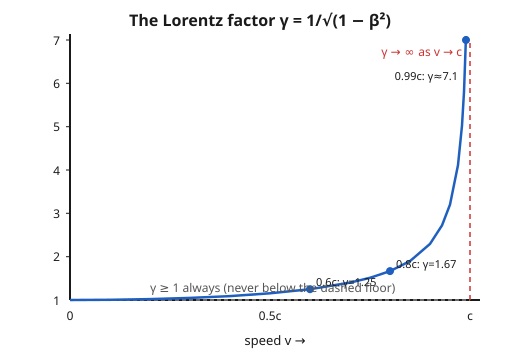

# Relativity (SR + GR) · Lesson 1.2: Lorentz transformations

> ⏱ ~15 min · Module 1: Special relativity from the postulates · Builds on: [1.1 The postulates and the relativity of simultaneity](#/lesson/relativity/01-01-postulates-simultaneity.md) · Unlocks: time dilation, length contraction, and the paradoxes (1.3)

## Why this matters

Lesson 1.1 forced a shocking conclusion: if the speed of light $c$ is the same for everyone, then simultaneity is not absolute — two observers moving relative to each other disagree about what "now" means far away. That's a qualitative earthquake. This lesson turns it into an equation. The **Lorentz transformation** is the exact dictionary that converts one observer's spacetime coordinates $(t,x)$ into another's $(t',x')$. Every result in special relativity — time dilation, length contraction, $E=mc^2$, the twin paradox — is just this dictionary applied to a specific question. Get the transformation and you own the subject; the rest is bookkeeping.

## The idea

Galileo's dictionary was obvious: if your train moves at speed $v$ past me, then a point at position $x$ in my frame sits at $x' = x - vt$ in yours, and we share a universal clock, $t' = t$. Simple, and **wrong** — because it makes light's speed add and subtract like a thrown ball ($c \pm v$), contradicting the postulate that everyone measures the same $c$.

So we keep the one honest feature of Galileo — the transformation must be **linear** (uniform motion stays uniform, no frame is special, so no $x^2$ or $t^2$ terms) — and we sacrifice the sacred cow: the universal clock. We allow time itself to transform. The new dictionary must do exactly one job that Galileo's couldn't: a pulse of light leaving the shared origin must trace $x = ct$ for me **and** $x' = ct'$ for you, simultaneously, using the *same* number $c$. That single demand is enough to pin down the entire transformation, stretch factor and all.

## The formal version

Take frame $S$ with coordinates $(t,x)$ and frame $S'$ moving at constant velocity $v$ along the $x$-axis, with origins coinciding at $t=t'=0$. Motion is along $x$ only; $y'=y$, $z'=z$ throughout.

**Step 1 — linearity.** Linearity plus "the $S'$ origin ($x'=0$) moves as $x=vt$ in $S$" forces the form

$$x' = \gamma\,(x - vt),$$

for some constant $\gamma$ that can depend only on the *speed* $|v|$ (space is isotropic, so the sign of $v$ can't matter to $\gamma$). *In words: $x'$ is the Galilean guess $x-vt$, but allowed an overall stretch $\gamma$ we don't yet know.* By the principle of relativity, $S$ sees $S'$ moving at $-v$, so the inverse has the identical form with $v\to -v$ and the same $\gamma$:

$$x = \gamma\,(x' + vt').$$

**Step 2 — invariance of $c$.** Fire a light pulse from the common origin at $t=t'=0$. In $S$ it obeys $x=ct$; in $S'$ it must obey $x'=ct'$ — same $c$. Substitute both into the two boxed equations:

$$ct' = \gamma(ct - vt) = \gamma t\,(c-v), \qquad ct = \gamma(ct' + vt') = \gamma t'\,(c+v).$$

Multiply them: $c^2 t t' = \gamma^2 t t'\,(c-v)(c+v) = \gamma^2 t t'\,(c^2 - v^2)$. Cancel $tt'$ and solve:

$$\boxed{\;\gamma = \frac{1}{\sqrt{1 - v^2/c^2}} = \frac{1}{\sqrt{1-\beta^2}}, \qquad \beta \equiv \frac{v}{c}.\;}$$

$\gamma$ is the **Lorentz factor**; $\beta$ is the speed as a fraction of $c$. *In words: the mysterious stretch is fixed entirely by the demand that light keep the same speed.*

**Step 3 — recover $t'$.** Put $x'=\gamma(x-vt)$ back into $x=\gamma(x'+vt')$ and solve for $t'$ (using $1-\gamma^2 = -\beta^2\gamma^2$). The full **Lorentz transformation** is

$$\boxed{\;x' = \gamma\,(x - vt), \qquad t' = \gamma\!\left(t - \frac{vx}{c^2}\right).\;}$$

*In words: not only does position mix with time (as in Galileo), but time mixes with position — the $-vx/c^2$ term is the relativity of simultaneity made quantitative.* The **inverse** is what symmetry already promised — swap primes and send $v\to -v$:

$$x = \gamma\,(x' + vt'), \qquad t = \gamma\!\left(t' + \frac{vx'}{c^2}\right).$$

**Correspondence (the Galilean limit).** For everyday speeds $v \ll c$, we have $\beta \approx 0$, so $\gamma \approx 1$ and the $vx/c^2$ term is negligible:

$$x' \approx x - vt, \qquad t' \approx t.$$

*In words: Newton isn't wrong, he's the $v/c \to 0$ corner of a bigger truth.* This is a hard requirement on any relativistic law, and it's how we know we haven't broken known physics.

**Velocity addition.** How do velocities combine? If an object has velocity $u = dx/dt$ in $S$, its velocity in $S'$ is $u' = dx'/dt'$. Take differentials of the transformation, $dx' = \gamma(dx - v\,dt)$ and $dt' = \gamma(dt - v\,dx/c^2)$, and divide:

$$\boxed{\;u' = \frac{u - v}{1 - uv/c^2}.\;}$$

*In words: velocities don't just subtract — the denominator is the relativistic correction, and it's what stops anything from crossing $c$.* Two checks make this formula's whole personality clear:

- **$c$ is invariant.** Set $u=c$: $u' = \dfrac{c-v}{1 - cv/c^2} = \dfrac{c-v}{1 - v/c} = \dfrac{c-v}{(c-v)/c} = c.$ Light combined with *any* boost is still light. This is the postulate reappearing as a fixed point of the formula.
- **$c$ is a ceiling.** Combine any two sub-light speeds and the result stays below $c$ (Problem 2). You cannot reach $c$ by stacking boosts.

**One property to memorize:** since $0 \le \beta < 1$ for any real motion, $1-\beta^2 \le 1$, so $\gamma \ge 1$ **always** — the transformation only ever stretches, never shrinks. And as $v \to c$, $\beta \to 1$, the square root $\to 0$, and $\gamma \to \infty$. That divergence is the mathematical wall at the speed of light.

## Picture

The curve hugs $\gamma = 1$ for a long time — this is *why* relativity stayed hidden until we could move things near light speed. At $0.6c$ the correction is only 25%; the blow-up is all crammed into the last sliver before $c$, where the curve rockets toward its vertical asymptote.

## Worked examples

**Example 1 (mechanical — transform an event).** Frame $S'$ moves at $v = 0.6c$, so $\beta = 0.6$ and $\gamma = 1/\sqrt{1-0.36} = 1/\sqrt{0.64} = 1/0.8 = 1.25$. In $S$, a firecracker goes off at position $x = 5.0$ light-seconds and time $t = 4.0$ s. (One light-second is the distance light travels in a second, so $x = 5.0\,c\cdot\text{s}$.) Find $(t', x')$.

$$x' = \gamma(x - vt) = 1.25\,(5.0 - 0.6 \times 4.0)\ \text{ls} = 1.25\,(5.0 - 2.4) = 1.25 \times 2.6 = 3.25\ \text{ls}.$$

For time, $\dfrac{vx}{c^2} = \dfrac{(0.6c)(5.0\,c\cdot\text{s})}{c^2} = 0.6 \times 5.0\ \text{s} = 3.0$ s, so

$$t' = \gamma\!\left(t - \frac{vx}{c^2}\right) = 1.25\,(4.0 - 3.0)\ \text{s} = 1.25\ \text{s}.$$

The moving observer assigns this same event the coordinates $(t',x') = (1.25\ \text{s},\ 3.25\ \text{ls})$ — different time, different place, same physical spark.

**Example 2 (why you'd care — throwing forward doesn't beat light).** You cruise past me at $v = 0.5c$ and throw a ball forward at $0.5c$ relative to *your* ship. Galileo says the ball moves at $1.0c$ in my frame — faster than light. Relativity says otherwise. Use the inverse velocity addition (solve the boxed formula for $u$, or just send $v \to -v$): $u = \dfrac{u' + v}{1 + u'v/c^2}$, with $u' = 0.5c$ (ball in your frame) and $v = 0.5c$:

$$u = \frac{0.5c + 0.5c}{1 + (0.5)(0.5)} = \frac{1.0c}{1.25} = 0.8c.$$

Fast — but comfortably under $c$. The denominator $1.25$ ate exactly the excess. Throw the ball at $c$ instead and you'd get $\frac{1.5c}{1.5} = c$: you cannot out-throw light no matter how fast your ship goes.

## Watch out

- **You might think velocities just add, $u_{\text{tot}} = u + v$.** They don't — the denominator $1 - uv/c^2$ is doing essential work. It only *looks* like simple addition in daily life because $uv/c^2$ is microscopic there (for two cars, it's about $10^{-16}$). Drop it and you'd predict faster-than-light balls.
- **You might think $\gamma$ could be less than 1 for some slow motion** (a "compression"). Impossible: $\gamma \ge 1$ for every $v$, always $\ge$ the dashed floor in the figure. And for $v > c$ the quantity $1-\beta^2$ goes negative and $\gamma$ becomes imaginary — the math itself refuses super-luminal frames.
- **You might scramble which frame is primed.** The rule: the *forward* transform ($S \to S'$) uses $x - vt$ with a **minus**; the inverse ($S' \to S$) uses $x' + vt'$ with a **plus** and the *same* $\gamma$. If your answer doesn't collapse to the Galilean $x - vt$, $t'=t$ when you let $c \to \infty$, you have a sign or a $\gamma$ in the wrong place.

## One-liner

> The Lorentz transformation is the unique linear coordinate change that keeps light's speed at $c$ — it stretches by $\gamma = 1/\sqrt{1-\beta^2} \ge 1$, mixes time into space, and walls off $c$ as an unreachable ceiling.

## Problems

**P1 (🟢)** (a) Compute $\gamma$ for $v = 0.6c$, $0.8c$, and $0.99c$. (b) A spaceship flies at $v = 0.8c$ along $x$. In the lab frame $S$, a beacon flashes at $x = 4.0$ light-seconds, $t = 5.0$ s. Find the event's coordinates $(t', x')$ in the ship frame $S'$.

**P2 (🟡)** A ship moves at $0.8c$ past the lab and fires a probe straight ahead at $0.8c$ *relative to the ship*. Find the probe's speed in the lab frame. Show it is **not** $1.6c$, and that it is less than $c$.

**P3 (🔴, optional)** (a) Show that the velocity-addition formula returns exactly $c$ whenever the object already moves at $u = c$, for *any* frame speed $v$. (b) Starting from $u' = \dfrac{u-v}{1-uv/c^2}$, derive the Galilean limit and state precisely what "small speeds" must be small compared to.

Solutions

**P1** (a) $\gamma = 1/\sqrt{1-\beta^2}$:
- $v=0.6c$: $\gamma = 1/\sqrt{1-0.36} = 1/\sqrt{0.64} = 1/0.8 = 1.25$.
- $v=0.8c$: $\gamma = 1/\sqrt{1-0.64} = 1/\sqrt{0.36} = 1/0.6 = \tfrac{5}{3} \approx 1.667$.
- $v=0.99c$: $\gamma = 1/\sqrt{1-0.9801} = 1/\sqrt{0.0199} = 1/0.14107 \approx 7.09$.

(b) $\beta = 0.8$, $\gamma = 5/3$. Position: $vt = 0.8 \times 5.0 = 4.0$ ls, so

$$x' = \gamma(x - vt) = \tfrac{5}{3}(4.0 - 4.0)\ \text{ls} = 0.$$

The ship is right at the beacon when it flashes. Time: $\dfrac{vx}{c^2} = 0.8 \times 4.0 = 3.2$ s, so

$$t' = \gamma\!\left(t - \frac{vx}{c^2}\right) = \tfrac{5}{3}(5.0 - 3.2) = \tfrac{5}{3}(1.8) = 3.0\ \text{s}.$$

So $(t', x') = (3.0\ \text{s},\ 0)$.

**P2** Work in the ship frame $S'$ (moving at $v = 0.8c$ relative to the lab). The probe's speed there is $u' = 0.8c$. Transform to the lab with the inverse formula $u = \dfrac{u' + v}{1 + u'v/c^2}$:

$$u = \frac{0.8c + 0.8c}{1 + (0.8)(0.8)} = \frac{1.6c}{1 + 0.64} = \frac{1.6c}{1.64} \approx 0.976c.$$

The naive $1.6c$ is what you'd get by ignoring the denominator $1.64$; the relativistic correction pulls it down to $0.976c < c$. Stacking two large boosts still leaves you short of light speed.

**P3** (a) Set $u = c$ in $u' = \dfrac{u-v}{1-uv/c^2}$:

$$u' = \frac{c - v}{1 - cv/c^2} = \frac{c-v}{1 - v/c} = \frac{c-v}{(c-v)/c} = c.$$

The factor $(c-v)$ cancels top and bottom (valid for any $v \ne c$), leaving exactly $c$ regardless of $v$. Light stays light in every frame — the second postulate, recovered from the algebra.

(b) The exact formula is $u' = \dfrac{u-v}{1 - uv/c^2}$. The correction lives entirely in the denominator's term $uv/c^2$. When both speeds are small compared to $c$ — precisely, when $uv/c^2 \ll 1$ — the denominator $\to 1$ and

$$u' \approx u - v,$$

the Galilean velocity subtraction. The thing that must be small is the *product* $uv$ measured against $c^2$: it's not enough for the speeds to feel "fast" or "slow" in isolation; what matters is $uv/c^2$. (Equivalently, taking $c \to \infty$ kills the term outright, which is the formal statement of the correspondence principle.)

## Connections

- **Backward:** this is [1.1](#/lesson/relativity/01-01-postulates-simultaneity.md)'s relativity of simultaneity made exact — the $-vx/c^2$ inside $t'$ *is* the observer-dependence of "now," now carrying a number. Linearity here is the same "no preferred point" logic that made inertial frames equivalent.
- **Forward:** [1.3](#/lesson/relativity/01-03-dilation-contraction-paradoxes.md) reads time dilation and length contraction straight off these two equations; [1.4](#/lesson/relativity/01-04-spacetime-interval-causality.md) shows the combination $c^2t^2 - x^2$ is left *unchanged* by the transformation — the invariant interval — which is the deeper reason $c$ is protected. In [2.2](#/lesson/relativity/02-02-vectors-covectors-transformations.md) this transformation becomes a matrix $\Lambda^\mu{}_\nu$ acting on four-vectors, and the whole of SR gets rewritten so that every law is manifestly frame-independent.
- **Sideways (electromagnetism):** Lorentz found these equations *before* Einstein, as the symmetry that leaves [Maxwell's equations](#/lesson/em-refresher/04-01-maxwells-equations.md) invariant — light's constant $c$ is baked into electromagnetism, and the Lorentz transformation is exactly the change of frame that respects it. What was a strange property of one force turned out to be the shape of spacetime.
