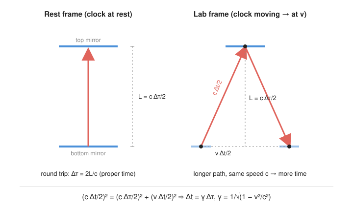

# Relativity (SR + GR) · Lesson 1.3: Time dilation, length contraction, and the paradoxes

> ⏱ ~15 min · Module 1: Special relativity from the postulates · Builds on: [1.1 Postulates and simultaneity](#/lesson/relativity/01-01-postulates-simultaneity.md), [1.2 Lorentz transformations](#/lesson/relativity/01-02-lorentz-transformations.md) · Unlocks: [1.4 The invariant interval and causal structure](#/lesson/relativity/01-04-spacetime-interval-causality.md)

## Why this matters

The Lorentz transformation of 1.2 is a coordinate rule; this lesson is what it *feels* like. Moving clocks run slow, moving rulers shrink — and both effects are real enough that particle detectors, GPS satellites, and cosmic-ray muons would all give wrong answers without them. The muon is the cleanest proof: a particle that lives 2.2 microseconds should never survive the trip from the upper atmosphere to the ground, yet they rain down on us by the thousands. The two "paradoxes" — the twin and the ladder-in-the-barn — are the standard traps, and clearing them is how you check that you actually understand what simultaneity being relative *does*.

## The idea

A clock is anything that ticks at a steady rate. The cleanest imaginable one is a **light clock**: a photon bouncing straight up and down between two mirrors, one tick per round trip. Its rate is fixed by the mirror spacing and the speed of light — nothing else.

Now watch someone else's light clock fly past you sideways. From your seat the photon can't just go up and down: while it climbs, the whole clock slides forward, so *you* see it travel a longer, diagonal, zig-zag path. But light moves at the same $c$ for you as for them (postulate 2, from 1.1). Same speed, longer path, so **more of your time passes per tick**. Their clock, to you, runs slow. That is time dilation, and it's forced by nothing more than "$c$ is the same for everyone."

Length contraction is the tightly-linked partner. If you and I disagree about how long a second lasts, we must also disagree about how long a meter is — otherwise we'd disagree about our *relative speed*, and we can't (speed is just one distance over one time, and we both must get the same $v$ for each other). So a slow-clock frame is also a short-ruler frame, along the direction of motion.

The mind-bender: this is **reciprocal**. You see my clocks slow and my rulers short; I see *yours* slow and short, by the identical factor. Both are right. It only sounds like a contradiction if you forget the third effect from 1.1 — **simultaneity is relative**. "Your clock reads less than mine *right now*" secretly depends on whose "right now" you mean, and we don't share one.

## The formal version

Throughout, $c$ is the speed of light and

$$\gamma = \frac{1}{\sqrt{1 - v^2/c^2}} \ge 1$$

is the Lorentz factor from 1.2 ($v$ is the relative speed of the two frames). We use the metric signature $(-,+,+,+)$ where signs matter later; here everything is elementary kinematics.

**Proper time.** The **proper time** $\Delta\tau$ between two events is the time measured by a single clock that is *present at both events* — i.e. in the frame where the two events happen at the **same place**.

**Time dilation.**

$$\boxed{\;\Delta t = \gamma\,\Delta\tau\;}$$

In words: the time between two events is *shortest* in the frame where they happen at the same place (that shortest value is the proper time $\Delta\tau$); every other frame, which sees the clock move between the events, reads a *longer* time $\gamma\,\Delta\tau$. Moving clocks run slow.

**Proper length.** The **proper length** $L_0$ of an object is its length measured in its own rest frame (where it isn't moving).

**Length contraction.**

$$\boxed{\;L = \frac{L_0}{\gamma}\;}$$

In words: an object is *longest* in its own rest frame; any frame that sees it move measures it shorter, by $1/\gamma$, **along the direction of motion only** (transverse lengths are unchanged). Moving rulers shrink.

**Reciprocity.** Both boxed relations hold *symmetrically*: each observer applies them to the *other's* clocks and rulers. There is no preferred "really moving" frame. The apparent paradox is dissolved by the **relativity of simultaneity** (1.1): the measurements each observer calls "simultaneous" are different events, so the two shortenings never have to agree.

## Picture

The derivation lives entirely in that right triangle. In the clock's rest frame the photon covers $2L$ per round trip, so the proper tick is $\Delta\tau = 2L/c$, i.e. $L = c\,\Delta\tau/2$. In the lab frame, during one tick $\Delta t$ the clock slides forward by $v\,\Delta t$, so each half of the photon's path is the hypotenuse of a triangle with legs $L$ (vertical) and $v\,\Delta t/2$ (horizontal). Light still moves at $c$, so that hypotenuse has length $c\,\Delta t/2$. Pythagoras:

$$\left(\frac{c\,\Delta t}{2}\right)^2 = \left(\frac{c\,\Delta\tau}{2}\right)^2 + \left(\frac{v\,\Delta t}{2}\right)^2 \;\Longrightarrow\; c^2\Delta t^2 = c^2\Delta\tau^2 + v^2\Delta t^2 \;\Longrightarrow\; \Delta t = \frac{\Delta\tau}{\sqrt{1-v^2/c^2}} = \gamma\,\Delta\tau.$$

Time dilation from one triangle and the constancy of $c$ — no Lorentz-transformation algebra required.

## Worked examples

**Example 1 (mechanical — a fast clock's slow tick).** A clock flies past at $v = 0.6c$. Between two of its ticks it reads $\Delta\tau = 1$ s. How much lab time elapses?

$\gamma = 1/\sqrt{1-0.36} = 1/\sqrt{0.64} = 1/0.8 = 1.25$. The two ticks happen at the same place *on the clock*, so $\Delta\tau = 1$ s is the proper time, and the lab reads

$$\Delta t = \gamma\,\Delta\tau = 1.25\ \text{s}.$$

The moving clock's one second stretches to $1.25$ lab seconds — it runs slow. Its own rest length, if it's a $1$ m rod along the motion, is measured in the lab as $L = 1/1.25 = 0.8$ m.

**Example 2 (why you'd care — cosmic-ray muons).** Muons are created about $15$ km up when cosmic rays hit the atmosphere, moving at roughly $0.998c$, with a proper lifetime $\tau = 2.2\ \mu\text{s}$. Naively they travel only $v\tau \approx (3\times10^8)(2.2\times10^{-6}) \approx 660$ m before decaying — they should never reach the ground. But that uses the muon's *proper* lifetime as if it were the ground-frame lifetime. In the ground frame the clock is the muon, moving, so its lifetime is dilated: with $\gamma = 1/\sqrt{1-0.998^2}\approx 15.8$,

$$\Delta t = \gamma\tau \approx 15.8 \times 2.2\ \mu\text{s} \approx 35\ \mu\text{s}, \qquad \text{distance} \approx v\,\Delta t \approx (3\times10^8)(35\times10^{-6}) \approx 10\ \text{km}.$$

Now they cover kilometers, and plenty survive to sea level. **From the muon's own frame** the story is length contraction instead: the muon lives only $2.2\ \mu$s, but the $15$ km atmosphere is rushing at it contracted to $15/15.8 \approx 0.95$ km — short enough to cross in time. Same physics, two descriptions; the muons hitting the detector are the referee, and they say relativity wins.

## Watch out

- You might think time dilation is asymmetric — that one clock is "really" slow. It isn't: in *unaccelerated* motion each observer sees the *other's* clock slow, by the same $\gamma$. What breaks the symmetry in the twin paradox is not motion but **acceleration** (a change of inertial frame), which only one twin undergoes.
- You might think you contract in *all* directions when you move. Only the direction *along* $v$ shrinks; perpendicular lengths are untouched (that's why the light clock's vertical spacing $L$ is the same in both frames — used silently in the derivation above).
- You might apply $\Delta t = \gamma\,\Delta\tau$ with $\Delta\tau$ set to whatever time is handy. $\Delta\tau$ is specifically the proper time — the reading of *one* clock present at *both* events. Feed it a time measured by two different clocks and you'll invert the factor and conclude clocks run *fast*. Always ask: which single clock is at both events?

## One-liner

> A moving clock ticks slow and a moving ruler runs short, each by $\gamma$ — and because "now" is itself frame-dependent, both observers can say it of each other without contradiction.

## Problems

**P1 (🟢)** Cosmic-ray muons have proper lifetime $\tau = 2.2\ \mu$s and travel at $v = 0.99c$. (a) Find $\gamma$ and the muon's lifetime in the ground frame. (b) How far does it travel in the ground frame during that time? Compare to the naive $v\tau$, and comment on whether it reaches the ground.

**P2 (🟡)** A spaceship has proper length $L_0 = 100$ m and flies past a planet at $v = 0.8c$. (a) What is its length in the planet frame? (b) A beacon sits at rest on the planet. Find the time for the whole ship to pass the beacon, computed *in each frame*, and check that they differ by exactly $\gamma$ — identifying which of the two is the proper time.

**P3 (🔴, optional)** A twin travels to a star $4$ light-years away (distance measured in the Earth frame) at $v = 0.8c$ and immediately returns at $0.8c$. (a) Compute the elapsed time on Earth for the round trip. (b) Compute the traveling twin's proper time, two ways — via time dilation, and via the contracted distance the traveler measures. (c) State precisely where the asymmetry enters, so that the traveler really is the younger one.

Solutions

**P1** (a) $\gamma = 1/\sqrt{1-0.99^2} = 1/\sqrt{1-0.9801} = 1/\sqrt{0.0199} \approx 1/0.1411 \approx 7.09$. The muon is the single clock present at "birth" and "decay," so $\tau=2.2\ \mu$s is proper time and the ground frame reads

$$\Delta t = \gamma\tau \approx 7.09 \times 2.2\ \mu\text{s} \approx 15.6\ \mu\text{s}.$$

(b) Ground-frame distance:

$$d = v\,\Delta t \approx (0.99)(3\times10^8)(15.6\times10^{-6}) \approx (2.97\times10^8)(15.6\times10^{-6}) \approx 4.6\ \text{km}.$$

The naive estimate $v\tau \approx (2.97\times10^8)(2.2\times10^{-6}) \approx 0.65$ km would have the muon decay far up in the atmosphere. Dilation multiplies its reach by $\gamma\approx7$, to $\sim4.6$ km — enough for muons born a few kilometers up to reach the ground, exactly as observed.

**P2** (a) $\gamma = 1/\sqrt{1-0.8^2} = 1/\sqrt{1-0.64} = 1/\sqrt{0.36} = 1/0.6 = 5/3 \approx 1.667$. Planet-frame length:

$$L = L_0/\gamma = 100/(5/3) = 60\ \text{m}.$$

(b) *Planet frame:* the $60$ m ship sweeps past the beacon at $0.8c$, so

$$\Delta t_{\text{planet}} = \frac{L}{v} = \frac{60}{(0.8)(3\times10^8)} = \frac{60}{2.4\times10^8} = 2.5\times10^{-7}\ \text{s}.$$

*Ship frame:* the ship is its full proper $100$ m; the beacon rushes along it at $0.8c$, so

$$\Delta t_{\text{ship}} = \frac{L_0}{v} = \frac{100}{2.4\times10^8} \approx 4.17\times10^{-7}\ \text{s}.$$

Ratio $4.17/2.5 = 1.667 = \gamma$. ✓ *Which is proper?* The two events are "beacon at nose" and "beacon at tail." The beacon never moves in the planet frame, so both events occur at the **same place** there — the planet-frame time $2.5\times10^{-7}$ s is the proper time $\Delta\tau$, and the ship frame reads the dilated $\gamma\,\Delta\tau$. (In the ship frame the two events happen at different places — nose, then tail — so no single ship clock is at both, and the longer time is expected. Note the ship's own view uses its uncontracted $100$ m and the beacon's motion, the reciprocal picture.)

**P3** $\gamma = 5/3 \approx 1.667$ as in P2.

(a) *Earth frame:* each leg is $4$ ly at $0.8c$, taking $4/0.8 = 5$ yr, so the round trip is

$$\Delta t_{\text{Earth}} = 2\times 5 = 10\ \text{yr}.$$

(b) *Traveler's proper time.* The outbound and inbound legs are each traced by the traveler's single clock, so his aging on each leg is the proper time $\Delta\tau = \Delta t/\gamma$:

$$\Delta\tau = \frac{10\ \text{yr}}{5/3} = 10\times\frac{3}{5} = 6\ \text{yr}.$$

*Cross-check via contracted distance:* in the traveler's frame the Earth–star distance is contracted to $4/\gamma = 4\times 3/5 = 2.4$ ly. At $0.8c$ each leg takes $2.4/0.8 = 3$ yr, and $2\times 3 = 6$ yr — same answer. The traveler ages $6$ yr while Earth ages $10$ yr; he returns $4$ yr younger.

(c) *Where the asymmetry enters.* During the two straight legs the situation is symmetric — each twin, being inertial, sees the other's clock slow. But the traveler must **turn around at the star**, and turning around means accelerating: he switches from an outbound inertial frame to an inbound one. The Earth twin never changes frames. That single non-inertial event breaks the symmetry, so the naive "each sees the other as younger" cannot be applied through the turnaround. Concretely, at the turnaround the traveler's notion of "now on Earth" jumps forward (relativity of simultaneity, 1.1), and those skipped Earth-years are exactly the missing $10-6 = 4$ yr. The traveler is unambiguously the younger one because he — and only he — felt the acceleration.

## Flashback

**From Lesson 1.2 (Lorentz transformations):** A spaceship passes Earth at $v = 0.6c$. (a) Compute the Lorentz factor $\gamma$. (b) At what speed $v$ (as a fraction of $c$) would $\gamma = 2$?

Solution

(a) $\gamma = 1/\sqrt{1 - (0.6)^2} = 1/\sqrt{1 - 0.36} = 1/\sqrt{0.64} = 1/0.8 = 1.25$.

(b) Set $\gamma = 2$: $\;1/\sqrt{1 - v^2/c^2} = 2 \Rightarrow 1 - v^2/c^2 = 1/4 \Rightarrow v^2/c^2 = 3/4 \Rightarrow v = \tfrac{\sqrt3}{2}\,c \approx 0.866\,c.$

(So $\gamma$ stays near $1$ until you get close to $c$: even $0.6c$ only gives $1.25$, but $\gamma$ then climbs steeply — this steep climb is why the muon's $0.998c$ buys a factor of $\sim16$.)

## Connections

- **Backward:** these are 1.2's Lorentz transformation read for specific event pairs — time dilation is the $t$-equation applied to two events at the same place; length contraction is the $x$-equation applied to two ends measured at the same time. The reciprocity and the paradox resolutions are the relativity of simultaneity from [1.1](#/lesson/relativity/01-01-postulates-simultaneity.md) cashed out.
- **Forward:** [1.4](#/lesson/relativity/01-04-spacetime-interval-causality.md) unifies dilation and contraction into one frame-independent quantity, the spacetime interval — the proper time $\Delta\tau$ here is exactly the interval along a clock's worldline, and the twin paradox becomes a statement that the straight worldline is the *longest* in proper time. Proper time returns as the fundamental parameter for [four-velocity in 1.5](#/lesson/relativity/01-05-four-vectors-momentum.md) and, curved, as the thing geodesics extremize in [4.3](#/lesson/relativity/04-03-metric-proper-time.md).
- **Sideways (astrophysics/experiment):** muon survival, GPS clock corrections, and particle-accelerator lifetimes are all this lesson in the lab; gravitational time dilation later ([5.5](#/lesson/relativity/05-05-newtonian-limit-redshift.md)) adds a second, independent slowing that GPS must also correct for.
