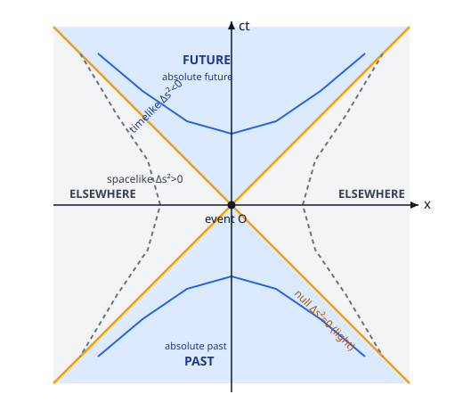

# Relativity (SR + GR) · Lesson 1.4: Spacetime, the invariant interval, and causal structure

> ⏱ ~15 min · Module 1: Special relativity from the postulates · Builds on: [1.1 Postulates & simultaneity](#/lesson/relativity/01-01-postulates-simultaneity.md), [1.2 Lorentz transformations](#/lesson/relativity/01-02-lorentz-transformations.md), [1.3 Dilation, contraction & paradoxes](#/lesson/relativity/01-03-dilation-contraction-paradoxes.md) · Unlocks: four-vectors (1.5) and the Minkowski metric $\eta_{\mu\nu}$ of Module 2

## Why this matters

The last three lessons dismantled everything absolute: lengths shrink, clocks slow, and two observers can't even agree which of two events came first. That's disorienting — if *nothing* is shared, physics has no footing. This lesson finds the footing. There is exactly one geometric quantity every inertial observer computes and gets the *same number* for: the **spacetime interval**. It plays the role that ordinary distance plays in Euclidean geometry, and it hands us a rigid causal skeleton — a clean split between events you can influence, events that influenced you, and events you can never touch. This is the moment special relativity stops being a list of weird effects and becomes *geometry*. Everything in Modules 2–6 (the metric, four-vectors, curved spacetime) is built on top of the interval.

## The idea

In ordinary space, if you and I use rotated coordinate axes, we disagree about the $x$ and $y$ components of a stick — but we agree on its **length** $\sqrt{\Delta x^2 + \Delta y^2}$. Rotations scramble the components while preserving the length; length is the *invariant*, and geometry is really the study of what rotations leave alone.

Minkowski's insight (1908) was that a **Lorentz boost is a kind of rotation** — a rotation that mixes space and *time* instead of two space directions. So we should expect an invariant "length" for the four-dimensional object connecting two events. It exists, but with one shocking twist: the time part enters with a **minus sign**. The quantity

$$\Delta s^2 = -c^2\Delta t^2 + \Delta x^2 + \Delta y^2 + \Delta z^2$$

is what all inertial observers agree on, even though they each disagree about $\Delta t$ and $\Delta x$ separately. Time and space are no longer two separate arenas; they are components of one thing — **spacetime** — and the boost just re-slices it, the way a rotation re-slices the plane.

That single minus sign is the entire physics. It means "spacetime distance" can be negative, zero, or positive, and *which one* tells you whether two events can be cause and effect. A positive Euclidean length is boring; a signed interval carries causality inside it.

## The formal version

**Setup and convention.** An **event** is a point in spacetime: a where *and* a when, $(t, x, y, z)$. Given two events, let $\Delta t, \Delta x, \Delta y, \Delta z$ be their coordinate differences in some inertial frame. Define the **invariant interval**

$$\Delta s^2 = -c^2\,\Delta t^2 + \Delta x^2 + \Delta y^2 + \Delta z^2 .$$

The overall sign is a convention. I use the **$(-,+,+,+)$ signature** throughout this course (time gets the minus): so $\Delta s^2 < 0$ means "more time than space." (Particle physicists often use $(+,-,-,-)$, which flips every sign below — harmless, but you must pick one and never mix. We pick $(-,+,+,+)$.) The notation "$\Delta s^2$" is a single symbol for the quantity, *not* the square of some real $\Delta s$ — it is routinely negative.

**In words:** the interval is the spacetime analog of squared distance, but time contributes with the opposite sign to space.

**Invariance.** Under a Lorentz boost (from [1.2](#/lesson/relativity/01-02-lorentz-transformations.md)) — say along $x$ with speed $v$, $\gamma = 1/\sqrt{1-v^2/c^2}$:

$$t' = \gamma\!\left(t - \tfrac{v}{c^2}x\right), \qquad x' = \gamma\,(x - vt), \qquad y'=y,\ z'=z,$$

one finds $\Delta s'^2 = \Delta s^2$ (verified in Example 1 and Problem 2). **In words:** boost the coordinates any way you like — this combination doesn't move. It is to Lorentz boosts what $\Delta x^2+\Delta y^2$ is to rotations.

**Classification.** Because the sign is frame-independent, it invariantly sorts every pair of events into three types:

| Type | Sign | Meaning |
|---|---|---|
| **Timelike** | $\Delta s^2 < 0$ | Causally connectable. A massive particle can be present at both events (it travels slower than $c$). |
| **Null / lightlike** | $\Delta s^2 = 0$ | Connected only by a light signal. $\lvert\Delta \mathbf x\rvert = c\,\lvert\Delta t\rvert$ exactly. |
| **Spacelike** | $\Delta s^2 > 0$ | *No* causal connection possible — reaching one from the other needs speed $> c$. |

**Proper time.** For a **timelike** interval, define the **proper time**

$$\Delta\tau^2 = -\frac{\Delta s^2}{c^2} \;>\;0, \qquad \Delta\tau = \frac{1}{c}\sqrt{-\Delta s^2}.$$

**In words:** $\Delta\tau$ is the time actually elapsed on a clock that is *present at both events* — carried along the straight worldline joining them. It's positive precisely when the interval is timelike, and being an interval, it's the same in every frame: proper time is the frame-invariant "aging" between two events. (This is the invariant behind the time dilation of [1.3](#/lesson/relativity/01-03-dilation-contraction-paradoxes.md): in the clock's own rest frame $\Delta x=0$, so $\Delta\tau = \Delta t_{\text{rest}}$, and every other frame measures a larger coordinate $\Delta t$.)

For a **spacelike** interval the mirror quantity is the **proper distance** $\Delta\sigma = \sqrt{\Delta s^2}$ — the length measured in the frame where the two events are simultaneous (one always exists; see Watch out).

## Picture

Plot $ct$ vertically and $x$ horizontally (so light travels at $45^\circ$). The two null lines through the event $O$ form the **light cone**. Their interior wedges are the future/past cones — the **absolute future** and **absolute past**, timelike-separated from $O$, the events $O$ can causally affect or be affected by. The left/right wedges are **"elsewhere"**: spacelike-separated, causally disconnected. The curves are **hyperbolae of constant interval** — all events at a fixed $\Delta s^2$. They are the "circles" of Minkowski geometry: a Euclidean rotation slides points around a circle $x^2+y^2=\text{const}$, and a Lorentz boost slides events along a hyperbola $-c^2t^2+x^2=\text{const}$. The hyperbolae hug the light cone as asymptotes and never cross it — no boost can move an event from one causal region to another.

## Worked examples

**Example 1 (mechanical — verify invariance under a boost).** Take two events with separations $(\Delta t, \Delta x)$ in frame $S$ and no $y,z$ separation. Compute $\Delta s'^2$ in the boosted frame $S'$ directly:

$$
\Delta s'^2 = -c^2\Delta t'^2 + \Delta x'^2
= -c^2\gamma^2\!\left(\Delta t - \tfrac{v}{c^2}\Delta x\right)^2 + \gamma^2\left(\Delta x - v\,\Delta t\right)^2 .
$$

Expand both squares inside $\gamma^2$:

$$
\gamma^2\Big[\,{-c^2\Delta t^2 + 2v\,\Delta t\,\Delta x - \tfrac{v^2}{c^2}\Delta x^2} \;+\; \Delta x^2 - 2v\,\Delta x\,\Delta t + v^2\Delta t^2\,\Big].
$$

The two cross terms $\pm 2v\,\Delta t\,\Delta x$ cancel. Group the survivors:

$$
=\gamma^2\Big[-c^2\Delta t^2\big(1-\tfrac{v^2}{c^2}\big) + \Delta x^2\big(1-\tfrac{v^2}{c^2}\big)\Big]
= \gamma^2\big(1-\tfrac{v^2}{c^2}\big)\big(-c^2\Delta t^2 + \Delta x^2\big).
$$

Since $\gamma^2\big(1-\tfrac{v^2}{c^2}\big) = 1$ by definition, $\Delta s'^2 = -c^2\Delta t^2 + \Delta x^2 = \Delta s^2$. The minus sign is exactly what makes the cross terms cancel — with a plus sign (ordinary distance) they wouldn't, and a boost would *not* preserve it. Invariance and the causal structure are the *same* fact.

**Example 2 (why you'd care — a decaying muon).** A muon is created in the upper atmosphere and decays $2.2\,\mu\text{s}$ later *in its own rest frame*. Those two events — birth and death — happen at the same place *for the muon*, so in its rest frame $\Delta x = 0$ and $\Delta t = 2.2\,\mu\text{s}$. The interval is

$$\Delta s^2 = -c^2(2.2\,\mu\text{s})^2 + 0 = -c^2(2.2\,\mu\text{s})^2 \;<\;0 \ (\text{timelike, as any particle's history must be}),$$

and the proper time is $\Delta\tau = \tfrac1c\sqrt{-\Delta s^2} = 2.2\,\mu\text{s}$ — the muon's actual lifespan. Now go to the ground frame, where the muon screams down at $v = 0.99c$. We *don't* recompute the physics; we just use invariance: $\Delta\tau$ is the same, but the ground frame splits the interval into a large $\Delta x$ (the muon covers kilometers) and a correspondingly larger $\Delta t = \gamma\,\Delta\tau \approx 7\times 2.2\,\mu\text{s} \approx 15\,\mu\text{s}$. That extra ground-frame time is why atmospheric muons reach sea level at all — and it's bookkept automatically by the one invariant $\Delta s^2$, no paradox required. The proper time *is* the muon's lifetime; the frame-dependent $\Delta t$ is just how a given observer slices that fixed interval.

## Watch out

- **You might think $\Delta s^2$ is a square and so $\geq 0$.** It isn't — it's a single signed symbol, and for timelike separations it's *negative*. The name is historical baggage; read "$\Delta s^2$" as one quantity. (In $(+,-,-,-)$ signature the signs flip and timelike becomes positive — one more reason to state your convention out loud, as we did: $(-,+,+,+)$.)
- **You might think "elsewhere" events have a definite time order.** They don't. For a spacelike pair, $\Delta t$ can be made positive, zero, or negative by choosing a frame — there's always some frame where they're **simultaneous** (that's the frame realizing the proper distance). Only timelike/null pairs have a frame-independent order, which is exactly why only they can be cause and effect. Simultaneity is relative *precisely for the events you can't causally link* — the relativity of simultaneity from [1.1](#/lesson/relativity/01-01-postulates-simultaneity.md) is the spacelike region talking.
- **You might think faster-than-light travel just gets you there quicker.** It's worse: it connects spacelike-separated events, whose order is frame-dependent — so in some frame your signal *arrives before it was sent*. Superluminal signaling is time travel, and that's the physical content of "$c$ is the speed limit" (Problem 3).

## One-liner

> The interval $\Delta s^2 = -c^2\Delta t^2 + \lvert\Delta\mathbf{x}\rvert^2$ is the one number all observers share; its sign — timelike, null, spacelike — is the frame-independent skeleton of cause and effect.

## Problems

Throughout, measure time in seconds and distance in **light-seconds** (1 ls = distance light travels in 1 s), so that $c = 1$ light-second per second and numerically $\Delta s^2 = -\Delta t^2 + \Delta x^2$ (in units of ls²). This just spares us factors of $c$; put them back by dimension whenever you like.

**P1 (🟢)** Event $A$ is at $(t,x)=(0,0)$. For each partner event, classify the pair (timelike / null / spacelike) and give $\Delta s^2$; for the timelike one, also find the proper time $\Delta\tau$.
(a) $B=(5\ \text{s},\ 3\ \text{ls})$  (b) $C=(2\ \text{s},\ 6\ \text{ls})$  (c) $D=(4\ \text{s},\ 4\ \text{ls})$.

**P2 (🟡)** Take events separated by $(\Delta t,\Delta x)=(3\ \text{s},\,5\ \text{ls})$ in frame $S$. Boost to $S'$ moving at $v=0.6c$ along $x$ using the transformation from [1.2](#/lesson/relativity/01-02-lorentz-transformations.md). Compute $\Delta t'$ and $\Delta x'$ explicitly, then verify $\Delta s'^2 = \Delta s^2$ by direct substitution. (This is Example 1 made numerical.)

**P3 (🔴, optional)** Two events are **spacelike**-separated: $\Delta x > c\,\Delta t > 0$ in frame $S$ (so a signal linking them would need speed $\Delta x/\Delta t > c$). Suppose such a superluminal signal is sent from the first event (cause) to the second (effect).
(a) Using $\Delta t' = \gamma\big(\Delta t - \tfrac{v}{c^2}\Delta x\big)$, find the condition on the boost speed $v$ that makes $\Delta t' < 0$ — i.e., the effect precedes the cause in $S'$.
(b) Show that this required $v$ is always $< c$, so such a frame genuinely exists. Conclude why $c$ must be a universal speed limit.

Solutions

**P1** Use $\Delta s^2 = -\Delta t^2 + \Delta x^2$ (ls²).
(a) $-5^2 + 3^2 = -25+9 = -16 < 0$: **timelike**. Proper time $\Delta\tau = \sqrt{-\Delta s^2}/c = \sqrt{16}\ \text{s} = 4\ \text{s}$ (with $c=1$ ls/s, $\sqrt{16\ \text{ls}^2}/(1\ \text{ls/s}) = 4$ s). A clock riding the straight worldline from $A$ to $B$ ages 4 s.
(b) $-2^2 + 6^2 = -4+36 = 32 > 0$: **spacelike** ($\Delta s^2 = 32\ \text{ls}^2$). No causal link; some frame makes $A$ and $C$ simultaneous. (Reaching $C$ from $A$ would need $6\ \text{ls}/2\ \text{s}=3c$.)
(c) $-4^2 + 4^2 = 0$: **null** ($\Delta s^2 = 0$). Connected exactly by a light ray: $\Delta x = c\,\Delta t$ ($4\ \text{ls}$ in $4\ \text{s}$).

**P2** With $v=0.6c$: $\gamma = 1/\sqrt{1-0.36} = 1/\sqrt{0.64} = 1/0.8 = 1.25$. Working in the ls/s units ($c=1$, so $v=0.6$ ls/s):

$$\Delta t' = \gamma\big(\Delta t - v\,\Delta x\big) = 1.25\,(3 - 0.6\cdot 5) = 1.25\,(3-3) = 0\ \text{s},$$
$$\Delta x' = \gamma\big(\Delta x - v\,\Delta t\big) = 1.25\,(5 - 0.6\cdot 3) = 1.25\,(5-1.8) = 1.25\cdot 3.2 = 4\ \text{ls}.$$

(Neatly, this is the frame where the two events are simultaneous — as promised for a spacelike pair.) Now check the interval:

- In $S$: $\Delta s^2 = -3^2 + 5^2 = -9+25 = 16\ \text{ls}^2$ (spacelike).
- In $S'$: $\Delta s'^2 = -0^2 + 4^2 = 16\ \text{ls}^2.$ ✓

Equal. The algebra of Example 1 guaranteed it; here we watched $\Delta t$ and $\Delta x$ change dramatically (a $3$-second gap became $0$) while their signed combination held fixed.

**P3** (a) The events are ordered $\Delta t > 0$ in $S$ (cause first). We want $S'$ with $\Delta t' < 0$:

$$\Delta t' = \gamma\Big(\Delta t - \frac{v}{c^2}\Delta x\Big) < 0 \iff \Delta t < \frac{v}{c^2}\Delta x \iff v > \frac{c^2\,\Delta t}{\Delta x}.$$

Any boost faster than $v_0 \equiv c^2\Delta t/\Delta x$ (in the $+x$ direction) reverses the order: the effect happens before the cause.

(b) Is $v_0$ a legal speed, i.e. $v_0 < c$? By the spacelike hypothesis $\Delta x > c\,\Delta t$, so

$$v_0 = \frac{c^2\,\Delta t}{\Delta x} = c\cdot\frac{c\,\Delta t}{\Delta x} < c\cdot 1 = c.$$

So the interval $(v_0, c)$ of order-reversing boost speeds is nonempty and contains only sub-light speeds — **a physically allowed inertial frame that sees the effect precede its cause genuinely exists.** That is a logical catastrophe: cause and effect swap, and one could in principle arrange the "effect" to prevent the "cause." The only way to forbid it is to forbid the superluminal signal in the first place. Hence *no* signal, particle, or influence may exceed $c$: causality — a definite, frame-independent order for cause-and-effect pairs — is possible **only** for timelike/null separations, exactly the events reachable at speed $\leq c$. The light cone isn't a speed *suggestion*; it's the boundary of "can influence," and stepping outside it breaks time order. (Notice this argument never mentioned energy or mass — it's pure causal geometry. The dynamical reason massive particles can't reach $c$, $E=\gamma mc^2\to\infty$, comes in [1.5](#/lesson/relativity/01-05-four-vectors-momentum.md).)

## Flashback

**From Lesson 1.2 (Lorentz transformations — velocity addition):** A space station sees a rocket recede at $0.6c$. The rocket fires a probe forward at $0.5c$ *relative to the rocket*. How fast does the station measure the probe moving — and confirm the answer stays below $c$.

Solution

Relativistic velocity addition (not Galilean $0.6c+0.5c=1.1c$, which would exceed $c$):

$$u = \frac{u' + v}{1 + u'v/c^2} = \frac{0.5c + 0.6c}{1 + (0.5)(0.6)} = \frac{1.1c}{1.30} \approx 0.846c.$$

Below $c$, as it must be — the denominator $1+u'v/c^2$ is exactly the correction that keeps composed velocities inside the light cone. Chain any number of sub-light boosts and you never reach $c$; this is the velocity-space shadow of the same causal wall Problem 3 built from the interval.

## Connections

- **Backward:** the interval is *the thing the [Lorentz transformation](#/lesson/relativity/01-02-lorentz-transformations.md) was built to preserve* — Example 1 shows boosts are exactly the linear maps holding $\Delta s^2$ fixed, just as rotations hold $\Delta x^2+\Delta y^2$ fixed. Time dilation ([1.3](#/lesson/relativity/01-03-dilation-contraction-paradoxes.md)) is now a one-liner: proper time is the interval of a clock's own worldline, and every other frame slices it larger.
- **Forward:** in [1.5](#/lesson/relativity/01-05-four-vectors-momentum.md) the interval becomes the (squared) *magnitude of the displacement four-vector*, and the same minus-sign norm applied to four-momentum gives the invariant mass $-p_\mu p^\mu = m^2c^2$ and $E=mc^2$. In **Module 2** the interval is repackaged as $\Delta s^2 = \eta_{\mu\nu}\,\Delta x^\mu \Delta x^\nu$ with the **Minkowski metric** $\eta_{\mu\nu}=\mathrm{diag}(-1,+1,+1,+1)$ — this lesson *is* the metric, written before the index notation. In **Module 4** the constant $\eta_{\mu\nu}$ becomes a position-dependent $g_{\mu\nu}(x)$ and the interval becomes the line element $ds^2 = g_{\mu\nu}\,dx^\mu dx^\nu$ of curved spacetime; proper time along a worldline is what free particles extremize (the geodesic principle, [4.5](#/lesson/relativity/04-05-geodesics.md)).
- **Sideways (linear algebra):** $\Delta s^2$ is an **indefinite inner product** — a symmetric bilinear form of signature $(-,+,+,+)$, i.e. a non-positive-definite quadratic form. The machinery of [inner products & orthogonality](#/lesson/linalg-refresher/04-01-inner-products-orthogonality.md) and [quadratic forms](#/lesson/linalg-refresher/05-01-spectral-theorem-quadratic-forms.md) applies verbatim; Lorentz boosts are the "orthogonal group" of this indefinite form.
- **Sideways (electromagnetism):** the constancy of $c$ that forces this whole structure is a *prediction of Maxwell's equations* — $c=1/\sqrt{\mu_0\varepsilon_0}$ from [electromagnetic waves](#/lesson/em-refresher/04-02-electromagnetic-waves.md). Spacetime geometry is Maxwell's speed made into kinematics.
