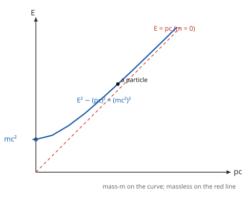

# Relativity (SR + GR) · Lesson 1.5: Four-vectors and four-momentum

> ⏱ ~15 min · Module 1: Special relativity from the postulates · Builds on: [1.2 Lorentz transformations](#/lesson/relativity/01-02-lorentz-transformations.md), [1.4 Spacetime, the invariant interval, and causal structure](#/lesson/relativity/01-04-spacetime-interval-causality.md) · Unlocks: 1.6 Relativistic dynamics and optics (collisions, thresholds, Doppler)

## Why this matters

Newton kept space, time, momentum, and energy as separate bookkeeping. Relativity says that was an accident of moving slowly: they are shadows of single four-dimensional objects, and once you package them correctly, every conservation law you know becomes *one* law — conservation of **four-momentum** — that holds in every frame simultaneously. Out of that packaging falls the most famous equation in physics, $E = mc^2$, not as a slogan but as a corollary: mass is just the rest-frame energy of a thing. This lesson is where "spacetime" stops being a diagram and starts being a calculational engine you'll ride all the way to the Einstein equations.

## The idea

You already learned the golden rule of Module 1: the physics lives in what *all observers agree on*. Different frames disagree about times and distances, but they agree about the spacetime interval. The move now is to make that a habit for *everything*.

Take four numbers that observers each measure, and check whether — when you change frames using the Lorentz transformation — they shuffle among themselves *exactly the way $(ct, x, y, z)$ does*. If they do, they're a **four-vector**, and they carry an invariant magnitude that every frame computes to the same value. Space-and-time is the first four-vector. The prize of this lesson is the second: energy-and-momentum, glued into one four-vector whose invariant magnitude *is the mass*.

The pattern to internalize: **a four-vector's components are frame-dependent (they mix under a boost), but its "length" — computed with the spacetime dot product — is a frame-independent invariant.** Physics is the invariants.

## The formal version

**Signature convention.** Throughout, use the metric $(-,+,+,+)$: the spacetime dot product of $a^\mu=(a^0,\mathbf a)$ and $b^\mu=(b^0,\mathbf b)$ is
$$a\cdot b = -a^0 b^0 + \mathbf a\cdot\mathbf b.$$
The Greek index $\mu$ runs over $0,1,2,3$, with $0$ the time slot. (Some books use $(+,-,-,-)$; only signs of invariants flip. Pick one and never mix — we use $(-,+,+,+)$.)

**The position four-vector.**
$$x^\mu = (ct,\ x,\ y,\ z).$$
In words: bundle time (scaled by $c$ so every slot has units of length) with the three spatial coordinates. Under a boost of speed $v$ along $x$, its components transform by the Lorentz transformation from [1.2](#/lesson/relativity/01-02-lorentz-transformations.md),
$$ct' = \gamma(ct - \beta x),\qquad x' = \gamma(x - \beta\, ct),\qquad \beta=\frac vc,\quad \gamma=\frac{1}{\sqrt{1-\beta^2}},$$
with $y,z$ unchanged. Any set of four numbers transforming by *this same rule* is a four-vector. (Module 2 rewrites this as $x'^\mu = \Lambda^\mu{}_\nu x^\nu$ — the matrix $\Lambda$ is the star of the tensor formalism; here we just use its components.)

**Proper time — the invariant clock.** A particle traces a worldline through spacetime. Its **proper time** $\tau$ is the time read by a clock carried *along* that worldline, defined from the interval $ds^2 = -c^2 dt^2 + dx^2+dy^2+dz^2$ by
$$c^2\,d\tau^2 = -ds^2 = c^2dt^2 - d\mathbf x^2 \quad\Longrightarrow\quad d\tau = \frac{dt}{\gamma}.$$
In words: proper time is the arc length along the worldline (in time units), and because it's built from the invariant interval, *every frame agrees on it*. That last equality $d\tau = dt/\gamma$ just says the moving clock runs slow by $\gamma$ — time dilation from [1.3](#/lesson/relativity/01-03-dilation-contraction-paradoxes.md), now reborn as "$\tau$ is the invariant, $t$ is the frame-dependent shadow."

**The four-velocity.** Differentiate position by the *invariant* parameter $\tau$ (never by frame-dependent $t$ — that's the key move):
$$u^\mu = \frac{dx^\mu}{d\tau} = \frac{dx^\mu}{dt}\frac{dt}{d\tau} = \gamma\,(c,\ \mathbf v).$$
In words: the four-velocity is the ordinary velocity, blown up by $\gamma$ and given a time-component $\gamma c$. Because $\tau$ is invariant and $x^\mu$ is a four-vector, $u^\mu$ is automatically a four-vector. Its magnitude is a fixed invariant:
$$u\cdot u = -\gamma^2 c^2 + \gamma^2 v^2 = -\gamma^2 c^2\Big(1-\tfrac{v^2}{c^2}\Big) = -c^2.$$
Every particle, at every speed, has a four-velocity of the *same* invariant length $\sqrt{c^2}$ — you're always moving through spacetime at "speed $c$," just splitting it between time and space differently.

**The four-momentum.** Multiply by the (invariant, frame-independent) rest mass $m$:
$$p^\mu = m\,u^\mu = \big(\gamma m c,\ \gamma m \mathbf v\big) = \Big(\tfrac Ec,\ \mathbf p\Big),$$
where we *define* the relativistic momentum and energy by matching slots:
$$\boxed{\ \mathbf p = \gamma m \mathbf v,\qquad E = \gamma m c^2.\ }$$
In words: momentum is the old $m\mathbf v$ with a $\gamma$ correction; energy is $\gamma mc^2$. The time-component of four-momentum is $E/c$ — energy and momentum are the *same object* seen along time versus space.

**The energy–momentum relation.** The invariant magnitude of $p^\mu$ is
$$p\cdot p = m^2\,(u\cdot u) = -m^2c^2 \quad\Longrightarrow\quad -\frac{E^2}{c^2} + |\mathbf p|^2 = -m^2c^2,$$
i.e.
$$\boxed{\ E^2 = (pc)^2 + (mc^2)^2.\ }$$
In words: mass is the invariant length of the energy–momentum four-vector — the one number about a particle's motion that every observer computes identically. Three corollaries fall out:

- **Rest energy** ($\mathbf p = 0$): $E = mc^2$. A mass sitting still still has energy. Mass *is* energy.
- **Low speed** ($v\ll c$): expand $E=\gamma mc^2 = mc^2\big(1-\beta^2\big)^{-1/2}\approx mc^2\big(1+\tfrac12\beta^2\big) = mc^2 + \tfrac12 mv^2$. The old kinetic energy $\tfrac12 mv^2$ is the first correction *on top of* rest energy.
- **Massless particles** ($m=0$): $E = pc$. Photons carry energy and momentum but no mass, and $E=\gamma mc^2$ only stays finite as $m\to0$ if $\gamma\to\infty$ — i.e. $v = c$. Massless things are *forced* to move at $c$.

**Conservation of four-momentum.** In any interaction, the total $p^\mu$ before equals the total $p^\mu$ after — *all four components*. That single statement is conservation of energy ($p^0$) **and** conservation of momentum ($\mathbf p$), unified, and it holds in every frame at once.

## Picture

Every possible state of a mass-$m$ particle sits on the blue hyperbola $E^2 - (pc)^2 = (mc^2)^2$. At rest it sits at the intercept $E=mc^2$; speed it up and it slides out along the curve, energy and momentum both growing. As $v\to c$ the curve hugs the red line $E=pc$ — the massless limit. A photon lives *on* that red line, mass zero, never on the hyperbola.

## Worked examples

**Example 1 (mechanical — a fast proton).** A proton ($mc^2 = 938$ MeV) moves at $v = 0.8c$. Find $\gamma$, $E$, and $pc$.

$$\gamma = \frac{1}{\sqrt{1-0.8^2}} = \frac{1}{\sqrt{0.36}} = \frac{1}{0.6} = 1.667.$$
$$E = \gamma mc^2 = 1.667\times 938 = 1563\ \text{MeV}.$$
$$pc = \gamma m v c = E\cdot\beta = 1563\times 0.8 = 1250\ \text{MeV}.$$
Check the invariant: $E^2-(pc)^2 = 1563^2 - 1250^2 = (2.443-1.563)\times10^6 = 0.880\times10^6 \approx 938^2$ MeV². ✓ The mass is recovered no matter the frame.

**Example 2 (why you'd care — pair production geometry).** Why can't an isolated electron simply emit a photon and recoil, with nothing else around? Work in the electron's initial rest frame: before, $p^\mu = (mc, \mathbf 0)$ — energy $mc^2$, zero momentum. After, you'd have a recoiling electron plus a photon, both carrying nonzero momentum in *some* directions. Momentum conservation demands their spatial momenta cancel, so they fly apart back-to-back with equal $|\mathbf p|$. But then the total energy is $\sqrt{(pc)^2+(mc^2)^2} + pc > mc^2$ for any $p>0$ — more energy out than in. The only consistent solution is $p=0$, i.e. nothing happens. **Free electrons can't radiate**; you need a third body (a nucleus) to absorb momentum. This is a pure four-momentum-conservation argument, and it's exactly the machinery Lesson 1.6 turns loose on collisions and production thresholds.

## Watch out

- You might think $E=\gamma mc^2$ means "mass increases with speed." Modern usage keeps **mass $m$ invariant** (it's the fixed invariant length of $p^\mu$); what grows with speed is the *energy*. Avoid "relativistic mass" — say energy, and the bookkeeping stays clean.
- You might differentiate $x^\mu$ by ordinary time $t$ to get a four-velocity. That fails: $t$ is frame-dependent, so $dx^\mu/dt$ is *not* a four-vector. You must divide by the invariant $\tau$. The stray $\gamma$'s in $u^\mu = \gamma(c,\mathbf v)$ are precisely the $dt/d\tau$ factor doing that repair.
- You might drop factors of $c$. Keep the units honest: $x^\mu=(ct,\mathbf x)$ and $p^\mu=(E/c,\mathbf p)$ both have uniform units (length, momentum) *because* of the $c$'s. In $E^2=(pc)^2+(mc^2)^2$ every term is an energy-squared — a fast sanity check.
- You might expect $u\cdot u$ or $p\cdot p$ to be positive. With $(-,+,+,+)$ they're **negative** ($-c^2$ and $-m^2c^2$): four-velocity and four-momentum are *timelike*, as any massive worldline must be (cf. [1.4](#/lesson/relativity/01-04-spacetime-interval-causality.md)). The sign is the signature talking, not an error.

## One-liner

> Energy and momentum are one four-vector whose invariant length is the mass — so $E^2=(pc)^2+(mc^2)^2$, and $E=mc^2$ is just its rest-frame reading.

## Problems

**P1 (🟢)** An electron ($mc^2 = 0.511$ MeV) moves at $v = 0.99c$. Find $\gamma$, its total energy $E$, and its momentum $pc$ (both in MeV). Verify $E^2-(pc)^2 = (mc^2)^2$.

**P2 (🟡)** Starting from the definitions $E=\gamma mc^2$ and $\mathbf p = \gamma m\mathbf v$, verify algebraically that $E^2 = (pc)^2 + (mc^2)^2$. Then, by expanding $\gamma$ for $v\ll c$, show $E \approx mc^2 + \tfrac12 mv^2$ and identify each term.

**P3 (🔴, optional)** A particle of mass $M$ sits at rest and decays into two photons.
(a) Using conservation of four-momentum, find each photon's energy and show the photons fly off back-to-back.
(b) Show that a single photon *cannot* decay into one massive particle (mass $m>0$), using the invariant $p\cdot p$. (Hint: what is $p\cdot p$ for a photon versus for a massive particle, and is it conserved?)

Solutions

**P1** $\displaystyle\gamma = \frac{1}{\sqrt{1-0.99^2}} = \frac{1}{\sqrt{1-0.9801}} = \frac{1}{\sqrt{0.0199}} = \frac{1}{0.14107} = 7.089.$

Energy: $E = \gamma mc^2 = 7.089 \times 0.511 = 3.622$ MeV.

Momentum: $pc = \gamma m v c = E\beta = 3.622 \times 0.99 = 3.586$ MeV.

Check: $E^2 - (pc)^2 = 3.622^2 - 3.586^2 = 13.119 - 12.859 = 0.260 \approx 0.511^2 = 0.261$ MeV² ✓ (rounding). The invariant returns the mass, as it must.

**P2** Compute the invariant directly:
$$E^2 - (pc)^2 = (\gamma mc^2)^2 - (\gamma mvc)^2 = \gamma^2 m^2 c^4 - \gamma^2 m^2 v^2 c^2 = \gamma^2 m^2 c^4\Big(1 - \tfrac{v^2}{c^2}\Big).$$
Since $\gamma^2 = \dfrac{1}{1-v^2/c^2}$, the factor $\gamma^2(1-v^2/c^2) = 1$, leaving
$$E^2 - (pc)^2 = m^2 c^4 = (mc^2)^2 \quad\Longrightarrow\quad E^2 = (pc)^2 + (mc^2)^2.\ \checkmark$$
Low-speed expansion: with $\beta = v/c$,
$$E = \gamma mc^2 = mc^2(1-\beta^2)^{-1/2} = mc^2\Big(1 + \tfrac12\beta^2 + \tfrac38\beta^4 + \cdots\Big) \approx mc^2 + \tfrac12 mc^2\,\tfrac{v^2}{c^2} = mc^2 + \tfrac12 mv^2.$$
First term: the **rest energy** $mc^2$ (present even at $v=0$). Second term: the Newtonian **kinetic energy** $\tfrac12 mv^2$. Relativity doesn't overturn Newton's kinetic energy — it demotes it to the leading correction on top of a huge rest-energy floor.

**P3** (a) Work in the rest frame of $M$. Initial four-momentum: $p^\mu_{\text{tot}} = (Mc,\ \mathbf 0)$ — total energy $Mc^2$, total momentum zero.

Conservation of the spatial part: $\mathbf p_1 + \mathbf p_2 = \mathbf 0$, so $\mathbf p_2 = -\mathbf p_1$ — the photons are **back-to-back** with equal momentum magnitude $p$. For photons $E_i = |\mathbf p_i|c = pc$, so both have equal energy. Conservation of the time part (energy): $E_1 + E_2 = Mc^2$, hence
$$E_1 = E_2 = \frac{Mc^2}{2},\qquad |\mathbf p_1| = |\mathbf p_2| = \frac{Mc}{2}\ \text{(opposite directions)}.$$

(b) Suppose a single photon (four-momentum $q^\mu$) turned into a single massive particle (four-momentum $p^\mu$, mass $m>0$). Four-momentum conservation would require $q^\mu = p^\mu$, hence their invariants must match: $q\cdot q = p\cdot p$. But
$$q\cdot q = 0 \quad(\text{photon, } m=0), \qquad p\cdot p = -m^2c^2 \neq 0 \quad(\text{massive}).$$
So $0 = -m^2c^2$, forcing $m=0$ — a contradiction with $m>0$. The invariant length can't change, and a photon's is stuck at zero. (Physical restatement: in the massive particle's rest frame it has zero momentum but positive energy $mc^2$; a photon can never be brought to rest, so no frame reconciles the two. This is *why decays go to two or more products* — you need enough freedom to conserve both invariant mass and momentum.)

## Flashback

**From Lesson 1.4 (Spacetime, the invariant interval, and causal structure):** Two events are separated by a time difference $\Delta t = 5$ s and a spatial separation $\Delta x = 3$ light-seconds (measure lengths in light-seconds so $c=1$ light-second per second). Compute the invariant interval, classify it as timelike/spacelike/null, and — if a single clock can be present at both events — find the proper time it reads between them.

Solution

With $(-,+,+,+)$, the squared interval (in light-second² units, where $c\Delta t = 5$ light-seconds) is
$$s^2 = -(c\Delta t)^2 + \Delta x^2 = -(5)^2 + (3)^2 = -25 + 9 = -16\ \text{(light-sec)}^2.$$
Negative $s^2$ (timelike): the events are close enough in space and far enough in time that something slower than light can be present at both — a clock *can* travel between them. The proper time is
$$c\tau = \sqrt{-s^2} = \sqrt{16} = 4\ \text{light-seconds} \quad\Longrightarrow\quad \tau = 4\ \text{s}.$$
The clock carried along the connecting worldline reads **4 seconds** — less than the 5 s of coordinate time, exactly the time dilation of [1.3](#/lesson/relativity/01-03-dilation-contraction-paradoxes.md), and precisely the proper time $\tau$ this lesson used to build the four-velocity.

## Connections

- **Backward:** the whole lesson is [1.4](#/lesson/relativity/01-04-spacetime-interval-causality.md)'s "physics = invariants" applied twice — proper time is the invariant interval along a worldline, and mass is the invariant length of $p^\mu$. The transformation rule for $x^\mu$ is [1.2](#/lesson/relativity/01-02-lorentz-transformations.md)'s Lorentz boost, now the *definition* of what makes something a four-vector.
- **Forward:** [1.6](#/lesson/relativity/01-06-relativistic-dynamics-optics.md) runs four-momentum conservation through real collisions, production thresholds (the module's boss problem — antiproton production via invariants), and the relativistic Doppler effect. Module 2 promotes the ad-hoc index $\mu$ to the full [tensor formalism](#/lesson/relativity/02-01-index-notation-minkowski-metric.md): $\Lambda^\mu{}_\nu$, the metric $\eta_{\mu\nu}$, and raising/lowering indices make "is it a four-vector?" automatic.
- **Sideways (analytical mechanics):** that energy and momentum are conserved together is no coincidence — [Noether's theorem](#/lesson/analytical-mechanics/02-02-noethers-theorem.md) ties energy conservation to time-translation symmetry and momentum conservation to space-translation symmetry. In spacetime those symmetries merge, and so do their conserved quantities: one four-momentum. This exact bridge is developed for fields in relativity Module 3 (the stress–energy tensor).
- **Sideways (electromagnetism):** the massless case $E=pc$ is the photon — the quantum of the [electromagnetic wave](#/lesson/em-refresher/04-02-electromagnetic-waves.md), which indeed carries momentum $|\mathbf p| = E/c$ (radiation pressure). The four-current $J^\mu=(\rho c,\mathbf J)$ you'll meet in Module 2 is another four-vector built by this same packaging instinct.
