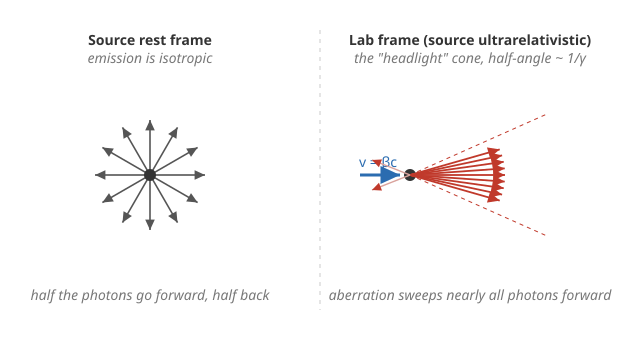

# Relativity (SR + GR) · Lesson 1.6: Relativistic dynamics and optics

> ⏱ ~15 min · Module 1: Special relativity from the postulates · Builds on: [1.2 Lorentz transformations](#/lesson/relativity/01-02-lorentz-transformations.md), [1.4 Spacetime interval & causality](#/lesson/relativity/01-04-spacetime-interval-causality.md), [1.5 Four-vectors & four-momentum](#/lesson/relativity/01-05-four-vectors-momentum.md) · Unlocks: Boss Problem 1 (particle-production threshold), then Module 2 (the tensor language)

*Signature convention for this lesson: $(-,+,+,+)$, so a four-vector $p^\mu=(E/c,\,\vec p)$ has invariant square $p^\mu p_\mu=-m^2c^2$, i.e. $E^2=(pc)^2+(mc^2)^2$. Factors of $c$ are kept explicit.*

## Why this matters

Four-momentum (from [1.5](#/lesson/relativity/01-05-four-vectors-momentum.md)) is a beautiful bookkeeping device, but this lesson is where it earns its keep on real problems. Every particle collision at the LHC, every threshold for creating new matter, every redshifted spectral line from a receding galaxy, and every blazing jet of an active galactic nucleus is a relativistic-dynamics-or-optics calculation. The unifying trick — the one professionals reach for first — is the **invariant**: build a scalar out of four-momenta that every observer agrees on, then evaluate it in whichever frame makes the arithmetic trivial. Master that and collision problems that look like a nightmare of simultaneous equations collapse to one line. This lesson is the direct on-ramp to **Boss Problem 1**.

## The idea

Two ideas carry the whole lesson.

**Collisions conserve the *total four-momentum*.** Newton taught you to conserve energy and 3-momentum separately. Relativity fuses them: the sum of the four-momenta of everything going in equals the sum going out,
$$\sum_{\text{in}} p^\mu = \sum_{\text{out}} p^\mu,$$
which is **four** conservation laws at once — energy (the time slot) and all three momentum components (the space slots) — automatically consistent across frames because a four-vector equation holds in every frame if it holds in one.

**Invariants let you pick the easy frame.** From any collection of particles, form the total four-momentum $P^\mu=\sum_i p_i^\mu$. Its square,
$$s \equiv -c^2\,P^\mu P_\mu = \Big(\sum_i E_i\Big)^2 - c^2\Big|\textstyle\sum_i \vec p_i\Big|^2,$$
is a Lorentz scalar — **the same number in every frame.** (The minus sign and factor $c^2$ just make $s$ come out positive with the units of energy-squared in our signature.) In the **center-of-momentum (CM) frame**, where the total 3-momentum is zero by definition, the second term vanishes and $s=E_{\rm CM}^2$. So $\sqrt{s}$ is the total energy available in the CM frame — the energy you actually have on hand to make new particles. Because $s$ is invariant, you compute it in the messy lab frame and *read off* the CM energy without ever transforming velocities. That is the pro move: **compute the invariant in the easy frame, use it in the hard one.**

This is the same "trade frame-dependent pieces for an invariant" spirit as the spacetime interval in [1.4](#/lesson/relativity/01-04-spacetime-interval-causality.md) — there it was $-c^2\Delta t^2+\Delta x^2$; here it is the four-momentum norm.

## The formal version

**Invariant mass of a system.** For any set of particles the quantity
$$M^2c^4 = \Big(\sum_i E_i\Big)^2 - c^2\Big|\textstyle\sum_i \vec p_i\Big|^2 = s$$
defines the system's **invariant mass** $M$. *In words:* the "mass" of a collection is not the sum of the individual masses — it is the length of the *summed* four-momentum, and it counts kinetic energy too. Two photons ($m=0$ each) flying apart have a nonzero invariant mass; a system's rest energy is $Mc^2=\sqrt{s}$.

**Production threshold.** To create a final state of total rest mass $M_{\rm f}$, energy conservation in the CM frame demands
$$\sqrt{s}\ \ge\ M_{\rm f}c^2,$$
with equality at **threshold** — the minimum-energy case, in which *all products sit at rest in the CM frame* (any leftover energy would go into their kinetic energy, which threshold forbids). *In words:* you need at least enough CM energy to account for the products just sitting there. Since $s$ is invariant, impose this in the CM frame but evaluate $s$ in the lab.

**Relativistic Doppler effect (longitudinal).** A source emitting proper frequency $f_{\rm src}$ and moving with speed $\beta c$ **directly away** along the line of sight is seen at
$$f_{\rm obs}=f_{\rm src}\sqrt{\frac{1-\beta}{1+\beta}}\qquad(\text{recession, redshift}),$$
and **directly toward** you at $f_{\rm obs}=f_{\rm src}\sqrt{\tfrac{1+\beta}{1-\beta}}$ (approach, blueshift). *In words:* motion away stretches waves (lower frequency, redder); motion toward compresses them (bluer). Unlike sound, this mixes the classical path-length effect with time dilation, giving the symmetric $\sqrt{(1\mp\beta)/(1\pm\beta)}$ factor.

**General Doppler formula (any angle).** With $\theta$ the angle between the source's velocity and the photon's direction of travel toward the observer, *measured in the observer's frame*,
$$f_{\rm obs}=\frac{f_{\rm src}}{\gamma\,(1-\beta\cos\theta)},\qquad \gamma=\frac{1}{\sqrt{1-\beta^2}}.$$
Setting $\theta=0$ recovers the blueshift, $\theta=\pi$ the redshift, and $\theta=\pi/2$ the **transverse Doppler effect** $f_{\rm obs}=f_{\rm src}/\gamma$ — a pure redshift from time dilation alone, with **no classical analog** (a nonrelativistic wave shows zero shift when moving purely sideways).

**Relativistic aberration (headlight effect).** If a photon makes angle $\theta$ with the boost direction in the lab and $\theta'$ in a frame moving at $\beta$,
$$\cos\theta'=\frac{\cos\theta-\beta}{1-\beta\cos\theta}.$$
*In words:* changing frames swings light-ray directions forward. A source moving fast has its isotropic emission swept into a narrow forward cone — the **beaming** or headlight effect — with half-angle $\sim 1/\gamma$ for $\gamma\gg1$.

## Picture

Aberration takes the left picture (equal photons in all directions) to the right one (nearly all photons crammed into a forward cone of half-angle $\sim1/\gamma$). This is why the approaching jet of a distant black hole outshines the receding one by orders of magnitude.

## Worked examples

**Example 1 (mechanical — the invariant for a fixed-target collision).** A projectile of mass $m$ and total energy $E$ (momentum $p$, with $E^2=(pc)^2+(mc^2)^2$) strikes an identical particle *at rest* (energy $mc^2$, zero momentum). Compute the invariant $s$.

Total energy $=E+mc^2$; total momentum $=p$. So
$$s=(E+mc^2)^2-(pc)^2=E^2+2Emc^2+m^2c^4-p^2c^2.$$
Now use $E^2-p^2c^2=m^2c^4$ to kill two terms:
$$\boxed{\,s=2m^2c^4+2Emc^2=2mc^2\,(mc^2+E)\,.}$$
One line, no velocity transformations. In the CM frame this same $s$ equals $E_{\rm CM}^2$, so the energy available to make new particles is $\sqrt{s}=\sqrt{2mc^2(mc^2+E)}$ — notice it grows only as $\sqrt{E}$ for large $E$. That square root is the seed of Problem 2 and of why colliders were built.

**Example 2 (application — reading a galaxy's speed off a spectral line).** A hydrogen line emitted at rest wavelength $\lambda_{\rm src}=656.3$ nm is observed from a galaxy at $\lambda_{\rm obs}=670.0$ nm. Since wavelength $\propto 1/f$, recession gives $\lambda_{\rm obs}/\lambda_{\rm src}=\sqrt{(1+\beta)/(1-\beta)}$. The ratio is $670.0/656.3=1.0209$, so
$$\frac{1+\beta}{1-\beta}=1.0209^2=1.0423\ \Rightarrow\ \beta=\frac{1.0423-1}{1.0423+1}\approx0.0207,$$
about $6.2\times10^3$ km/s of recession. This is the everyday tool of observational astronomy. The **cosmological** redshift of very distant galaxies is a close cousin but *not* the same mechanism — there the light is stretched by the expansion of space itself, $1+z=a(t_0)/a(t_e)$, rather than by motion through space (see astrophysics [6.1 The expanding universe & Friedmann equations](#/lesson/astrophysics/06-01-expanding-universe-friedmann.md)); at small distances the two agree and both read $z\approx\beta$.

## Watch out

- **You might think** invariant mass adds: $M=\sum m_i$. **Actually** $M^2c^4=(\sum E_i)^2-c^2|\sum\vec p_i|^2$ — kinetic energy contributes, and only for a single particle at rest does it reduce to $mc^2$. Two back-to-back photons have $M>0$; a hot box of gas weighs more than the same atoms cold.
- **You might think** "redshift $z=\beta$." **Actually** that is only the low-speed limit. The exact recession redshift is $1+z=\sqrt{(1+\beta)/(1-\beta)}$, which runs away to $\infty$ as $\beta\to1$ — a line can be shifted by far more than a factor of two.
- **You might think** the transverse Doppler shift is zero, as it is for sound. **Actually** it is a genuine relativistic redshift $f_{\rm obs}=f_{\rm src}/\gamma$ from time dilation — but be careful *which frame's* $\theta=90^\circ$ you mean. The clean $1/\gamma$ result holds when the photon arrives at $90^\circ$ **in the observer's frame**; the source-frame right angle gives a small *blue*shift instead.
- **Threshold ≠ products individually at rest in the lab.** They are at rest in the **CM frame**; in the lab they all stream forward together (they must, to carry the incoming momentum).

## One-liner

> Conserve the total four-momentum, then square it: the invariant $s$ is the same in every frame, so evaluate it where the algebra is easy — and everything from production thresholds to Doppler shifts falls out.

## Problems

**P1 (🟢)** Relativistic Doppler, both directions.
(a) A galaxy recedes at $\beta=0.1$. Find the fractional redshift $z=\Delta\lambda/\lambda$ of a spectral line, and compare to the naive "$z=\beta$."
(b) A source approaches at $\beta=0.5$. By what factor is the observed frequency blueshifted?

**P2 (🟡)** Antiproton production threshold (Boss Problem 1 in miniature). A proton of total energy $E$ hits a proton at rest; the reaction $p+p\to p+p+p+\bar p$ creates a proton–antiproton pair (each of mass $m_p$; the final state is four particles of mass $m_p$). Using the invariant $s$ from Example 1 evaluated at threshold in the CM frame, find the minimum **kinetic** energy of the incident proton. Then find the required kinetic energy per beam if instead two protons collide head-on, and explain the "$\sqrt s$ scaling" that makes colliders win.

**P3 (🔴, optional)** Transverse Doppler and beaming.
(a) From the general Doppler formula, show the transverse case ($\theta=90^\circ$ in the observer frame) is pure time dilation, $f_{\rm obs}=f_{\rm src}/\gamma$, and give a one-line "moving clock runs slow" reading of it.
(b) A source moving at speed $\beta c$ ($\gamma\gg1$) emits isotropically in its rest frame. Show that the photons filling the *forward hemisphere* in the rest frame ($\theta'\le90^\circ$) are compressed into a lab-frame cone of half-angle $\theta\approx1/\gamma$. (This forward "headlight" beaming is why AGN jets pointed at us appear as blazars; the astrophysical detail lives in astrophysics [4.3 Black holes](#/lesson/astrophysics/04-03-black-holes-astrophysics.md).)

Solutions

**P1** (a) Recession redshift: $1+z=\lambda_{\rm obs}/\lambda_{\rm src}=\sqrt{\tfrac{1+\beta}{1-\beta}}=\sqrt{\tfrac{1.1}{0.9}}=\sqrt{1.2222}=1.1055$. So
$$z\approx0.106\ (10.6\%),$$
slightly larger than the naive $z=\beta=0.10$ — the relativistic factor already differs at the 6% level even at a tenth of light speed. (For small $\beta$, $\sqrt{\tfrac{1+\beta}{1-\beta}}\approx1+\beta+\tfrac12\beta^2$, so the excess is the $\tfrac12\beta^2$ term.)

(b) Approach blueshift: $f_{\rm obs}/f_{\rm src}=\sqrt{\tfrac{1+\beta}{1-\beta}}=\sqrt{\tfrac{1.5}{0.5}}=\sqrt3\approx1.73$. The frequency is boosted by a factor $\sqrt3$ (about $+73\%$); equivalently the wavelength drops by $1/\sqrt3\approx0.577$.

**P2** *Fixed target.* From Example 1, $s=2m_pc^2(m_pc^2+E)$. At threshold the four final protons/antiproton are all at rest in the CM frame, so $\sqrt s=4m_pc^2$, i.e. $s=16\,m_p^2c^4$. Set equal:
$$2m_pc^2(m_pc^2+E)=16\,m_p^2c^4\ \Rightarrow\ m_pc^2+E=8m_pc^2\ \Rightarrow\ E=7m_pc^2.$$
Kinetic energy $T=E-m_pc^2=\boxed{6\,m_pc^2}$ (about $5.6$ GeV, since $m_pc^2\approx938$ MeV). You spend six proton-masses of kinetic energy to make one extra proton–antiproton pair (two masses) — the rest is wasted carrying the mandatory forward momentum.

*Collider.* Two protons of total energy $E$ each, head-on, have zero total momentum, so $s=(2E)^2=4E^2$. Threshold $s=16\,m_p^2c^4$ gives $E=2m_pc^2$, i.e. kinetic $T=E-m_pc^2=m_pc^2$ **per beam** — a factor of six less total, and it *makes* the antiproton with nothing wasted.

*Why colliders win — $\sqrt s$ scaling.* In a fixed-target collision $s=2m_pc^2E\propto E$, so the useful energy grows only as $\sqrt s\propto\sqrt E$: to double the CM energy you must quadruple the beam. In a collider $\sqrt s=2E\propto E$ grows *linearly*. At high energy the fixed-target machine drowns almost all its energy in the CM's bulk motion; the collider puts it all on the table. This is exactly why every energy-frontier machine is a collider.

**P3** (a) General formula at $\theta=90^\circ$ ($\cos\theta=0$): $f_{\rm obs}=\dfrac{f_{\rm src}}{\gamma(1-\beta\cdot0)}=\dfrac{f_{\rm src}}{\gamma}$. Reading: the source is a clock ticking at proper frequency $f_{\rm src}$; a clock moving past runs slow by $\gamma$ (time dilation, [1.3](#/lesson/relativity/01-03-dilation-contraction-paradoxes.md)), so at the moment of closest approach — where the line-of-sight distance is momentarily unchanging and the classical Doppler contribution vanishes — the only surviving effect is that slowdown: $f_{\rm obs}=f_{\rm src}/\gamma$. Pure time dilation, no classical analog.

(b) Use aberration with the source at rest in the primed frame emitting isotropically; the boundary of the forward hemisphere is $\theta'=90^\circ$, $\cos\theta'=0$. Invert the aberration relation (or use $\cos\theta'=\tfrac{\cos\theta-\beta}{1-\beta\cos\theta}$ set to $0$):
$$0=\frac{\cos\theta-\beta}{1-\beta\cos\theta}\ \Rightarrow\ \cos\theta=\beta.$$
So every photon in the rest-frame forward hemisphere lands within lab-frame angle $\theta_{\rm max}=\arccos\beta$ of the motion. For $\gamma\gg1$, $\beta=\sqrt{1-1/\gamma^2}\approx1-\tfrac{1}{2\gamma^2}$, and for small $\theta$, $\cos\theta\approx1-\tfrac{\theta^2}{2}$. Matching,
$$1-\frac{\theta_{\rm max}^2}{2}\approx1-\frac{1}{2\gamma^2}\ \Rightarrow\ \boxed{\theta_{\rm max}\approx\frac1\gamma}.$$
Half of all emitted photons are squeezed into a cone of half-angle $\sim1/\gamma$ about the direction of motion — the headlight/beaming effect. Combined with Doppler blueshift, this makes an approaching relativistic jet appear enormously brighter than a receding one (the basis of blazars and superluminal-motion illusions).

## Flashback

**From Lesson 1.4 (Spacetime interval & causality):** Two events, in some inertial frame, are separated by $\Delta t=3\ \mu\mathrm{s}$ and $\Delta x=1.2\ \mathrm{km}$ (along one spatial axis, no other separation). Compute the invariant interval $\Delta s^2=-c^2\Delta t^2+\Delta x^2$, classify the separation (timelike / spacelike / null), and state whether one event could have caused the other.

Solution

$c\,\Delta t=(3\times10^8\,\mathrm{m/s})(3\times10^{-6}\,\mathrm s)=900$ m, while $\Delta x=1200$ m. Then
$$\Delta s^2=-(900)^2+(1200)^2=-8.1\times10^5+1.44\times10^6=+6.3\times10^5\ \mathrm{m}^2>0.$$
Positive interval (in $(-,+,+,+)$) ⇒ **spacelike**. The spatial gap ($1200$ m) exceeds the light-travel distance in the elapsed time ($900$ m), so no signal at or below $c$ can link them: **neither event could have caused the other.** There even exists a frame in which they are simultaneous. (Had $\Delta x$ been under $900$ m the interval would be timelike and a causal — even subluminal — connection would be possible.)

## Connections

- **Backward:** this is [1.5](#/lesson/relativity/01-05-four-vectors-momentum.md)'s four-momentum put to work — conservation of $p^\mu$ plus its invariant norm is the entire computational engine here. The invariant-square trick is the [1.4](#/lesson/relativity/01-04-spacetime-interval-causality.md) interval idea applied in momentum space.
- **Forward:** **Boss Problem 1** is exactly Problem 2's method on a general final state. Module 2 ([2.1](#/lesson/relativity/02-01-index-notation-minkowski-metric.md) onward) recasts "form a scalar from four-vectors" as the systematic machinery of index contraction with the metric $\eta_{\mu\nu}$ — the invariant $s=-\eta_{\mu\nu}P^\mu P^\nu c^2$ in disguise.
- **Sideways (astronomy):** the Doppler formula is how galaxy recession velocities are measured; its cousin, cosmological redshift, opens astrophysics Module 6 ([6.1](#/lesson/astrophysics/06-01-expanding-universe-friedmann.md)). Relativistic beaming explains the one-sided jets and apparent superluminal motion of active galactic nuclei and black-hole systems (astrophysics [4.3](#/lesson/astrophysics/04-03-black-holes-astrophysics.md)).
- **Sideways (electromagnetism):** the same aberration and Doppler transformations act on the frequency and direction of any electromagnetic wave — the four-wavevector $k^\mu=(\omega/c,\vec k)$ transforms exactly like $p^\mu$, which is no accident given a photon's $p^\mu=\hbar k^\mu$ (em-refresher [4.2 Electromagnetic waves](#/lesson/em-refresher/04-02-electromagnetic-waves.md)).
