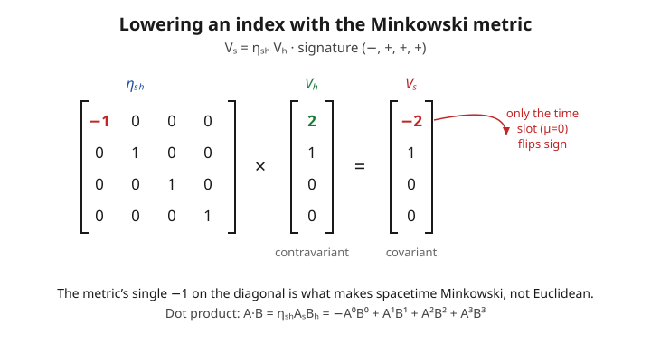

# Relativity (SR + GR) · Lesson 2.1: Index notation and the Minkowski metric

> ⏱ ~15 min · Module 2: The tensor language of Minkowski spacetime · Builds on: [1.4 Spacetime, the invariant interval, and causality](#/lesson/relativity/01-04-spacetime-interval-causality.md), [1.5 Four-vectors and four-momentum](#/lesson/relativity/01-05-four-vectors-momentum.md) · Unlocks: vectors, covectors, and how objects transform (2.2)

## Why this matters

In Module 1 you checked invariance by brute force: write out the Lorentz transformation as an explicit $4\times4$ mixing of $t,x,y,z$, plug it into $-c^2t^2+x^2+y^2+z^2$, and watch the cross-terms cancel. That works once. It does not scale — and it hides the reason the interval was invariant in the first place. This lesson installs the notation that makes frame-independence *automatic*: write an equation so its indices balance, and it holds in **every** inertial frame without a single line of algebra to prove it. That is the whole game of relativity's mathematics, and the machinery you build here transfers verbatim to curved spacetime in Module 4 — you will literally just swap one symbol ($\eta \to g$) and every formula survives.

## The idea

A four-vector is a list of four numbers — one time slot, three space slots — carried by a single symbol with an index: $V^\mu$, where the label $\mu$ runs over $0,1,2,3$ (0 is time). The superscript is not a power; it is a *slot number*.

Two conventions do the heavy lifting. First, **summation**: whenever the same index appears once "up" and once "down" in a term, you sum it over $0,1,2,3$ — no $\sum$ sign written. Second, the **metric** $\eta_{\mu\nu}$: spacetime's ruler, the object that says how to take a "dot product." The one thing that makes it *space*time rather than four-dimensional Euclidean space is a single minus sign: the time slot contributes to lengths with the opposite sign from the space slots. Everything strange about relativity — that a fast clock runs slow, that a light ray has zero length — is that one minus sign, followed everywhere with disciplined bookkeeping.

The bookkeeping even self-checks: in a correct equation the *free* (unsummed) indices match on both sides, in the same up/down positions. If they don't, you made an error before you ever computed a number.

## The formal version

**Components.** A four-vector has contravariant components $V^\mu$, $\mu\in\{0,1,2,3\}$. For an event, $x^\mu=(x^0,x^1,x^2,x^3)=(ct,\,x,\,y,\,z)$ — note the $c$ so the time slot carries units of length.

*In words:* one symbol, four numbers; the upper index names which slot.

**Einstein summation convention.** A repeated index appearing once up and once down is silently summed:

$$A^\mu B_\mu \;\equiv\; \sum_{\mu=0}^{3} A^\mu B_\mu = A^0 B_0 + A^1 B_1 + A^2 B_2 + A^3 B_3.$$

*In words:* an up–down repeat means "add over all four values." A **dummy** index is one that is summed — it never survives, so you may rename it freely ($A^\mu B_\mu = A^\alpha B_\alpha$). A **free** index appears exactly once per term and must match, position and all, across every term of an equation.

**The Minkowski metric.** In an inertial frame,

$$\eta_{\mu\nu} = \operatorname{diag}(-1,+1,+1,+1) = \begin{pmatrix} -1 & 0 & 0 & 0\\ 0 & 1 & 0 & 0\\ 0 & 0 & 1 & 0\\ 0 & 0 & 0 & 1\end{pmatrix},$$

the **signature $(-,+,+,+)$** convention (used throughout this course). It is symmetric, $\eta_{\mu\nu}=\eta_{\nu\mu}$.

*In words:* the metric is a lookup table for dot products; its lone $-1$ in the time–time slot is the source of all of special relativity.

**Spacetime dot product.** For any two four-vectors,

$$A\cdot B \;=\; \eta_{\mu\nu}\,A^\mu B^\nu \;=\; -A^0B^0 + A^1B^1 + A^2B^2 + A^3B^3.$$

*In words:* multiply component by component and sum, but the time–time product enters with a minus.

**Raising and lowering indices.** The metric converts an upper index to a lower one:

$$V_\mu = \eta_{\mu\nu}\,V^\nu \quad\Longrightarrow\quad V_0=-V^0,\;\; V_1=V^1,\;\; V_2=V^2,\;\; V_3=V^3.$$

*In words:* lowering an index reproduces the same physical object in "covariant" form; numerically only the time slot changes — it flips sign. The **inverse metric** $\eta^{\mu\nu}$ is defined by $\eta^{\mu\nu}\eta_{\nu\lambda}=\delta^\mu{}_\lambda$ (the Kronecker delta, $1$ if the indices match, else $0$). For flat spacetime $\eta^{\mu\nu}=\operatorname{diag}(-1,+1,+1,+1)$ too — it is its own inverse — and it raises indices: $V^\mu=\eta^{\mu\nu}V_\nu$. With one index up and one down, the dot product is just a contraction: $A\cdot B = A^\mu B_\mu = A_\mu B^\mu$.

**The invariant interval and norms, compactly.** The line element and any four-vector's squared norm are single contractions:

$$ds^2 = \eta_{\mu\nu}\,dx^\mu dx^\nu = -c^2dt^2 + dx^2 + dy^2 + dz^2, \qquad p\cdot p = \eta_{\mu\nu}\,p^\mu p^\nu = p^\mu p_\mu = -m^2c^2.$$

*In words:* the whole content of Module 1 — the invariant that every observer agrees on — is now "contract the object with itself using $\eta$." Because $\eta_{\mu\nu}$ is a frame-independent set of numbers and the sum ties every up-index to a down-index, the result is automatically a scalar: the same in every frame.

## Picture

## Worked examples

**Example 1 (mechanical — a dot product two ways).** Take $A^\mu=(3,2,0,0)$ and $B^\mu=(5,1,0,0)$.

*Route 1 — straight from the metric.* Contract with $\eta_{\mu\nu}$; only the diagonal survives:

$$A\cdot B = \eta_{\mu\nu}A^\mu B^\nu = -A^0B^0 + A^1B^1 = -(3)(5) + (2)(1) = -15 + 2 = -13.$$

*Route 2 — lower one index first, then contract.* Lowering $A$ flips only its time slot: $A_\mu = \eta_{\mu\nu}A^\nu = (-3,\,2,\,0,\,0)$. Now the contraction is an ordinary sum of products (the minus is already baked into $A_0$):

$$A\cdot B = A_\mu B^\mu = (-3)(5) + (2)(1) + 0 + 0 = -13. \;\checkmark$$

Same number — as it must be. The metric-in-the-middle and the lower-then-sum pictures are one operation. The $-13$ is negative, which flags $A$ and $B$ as pointing "mostly timelike."

**Example 2 (why you'd care — the energy–momentum relation is one line).** The four-momentum from [1.5](#/lesson/relativity/01-05-four-vectors-momentum.md) is $p^\mu=\big(E/c,\;\mathbf p\big)$, packaging energy (time slot) and three-momentum (space slots) into one object. Lower the index — flip the time slot — $p_\mu=\big(-E/c,\;\mathbf p\big)$, and contract:

$$p^\mu p_\mu = p^0 p_0 + \mathbf p\cdot\mathbf p = \left(\frac{E}{c}\right)\!\left(-\frac{E}{c}\right) + |\mathbf p|^2 = -\frac{E^2}{c^2} + |\mathbf p|^2.$$

The left side is a scalar, so evaluate it in whichever frame is easiest — the particle's **rest frame**, where $\mathbf p=0$ and $E=mc^2$, giving $p^\mu p_\mu = -(mc^2/c)^2 = -m^2c^2$. Equate the two expressions for the same invariant:

$$-\frac{E^2}{c^2} + |\mathbf p|^2 = -m^2c^2 \quad\Longrightarrow\quad \boxed{E^2 = |\mathbf p|^2 c^2 + m^2 c^4.}$$

The entire energy–momentum relation dropped out of "the norm of $p^\mu$ is frame-independent, so compute it in the easy frame." No Lorentz transformation, no algebra with $\gamma$ — that is the payoff of the notation.

## Watch out

- **Signature is a convention — pick one and never mix.** Many texts (Landau, most particle-physics books) use $(+,-,-,-)$, so $\eta=\operatorname{diag}(+1,-1,-1,-1)$ and then $p^\mu p_\mu=+m^2c^2$. Neither is "right"; the physics ($E^2=|\mathbf p|^2c^2+m^2c^4$) is identical, only intermediate signs differ. This course is $(-,+,+,+)$ everywhere. Mixing the two mid-calculation is the single most common sign error in relativity.
- **Indices must balance — that is your error check.** Every term in an equation must carry the *same free indices in the same up/down slots*. So $A^\mu = B_\mu$ is nonsense ($\mu$ up on the left, down on the right); $A^\mu=B^\mu$ or $A^\mu=\eta^{\mu\nu}B_\nu$ are fine. And a summed index must be **one up, one down**: $A^\mu B^\mu$ (both up) is illegal — lower one of them first, $A^\mu B_\mu$, or the "sum" isn't a scalar at all.
- **Lowering doesn't change the vector, only its clothes.** $V^\mu$ and $V_\mu$ are two component-lists for the *same* geometric object (contravariant vs. covariant form). In flat space the only numerical change is the time slot's sign. *Why* there are genuinely two kinds of index — how each transforms — is the whole subject of [2.2](#/lesson/relativity/02-02-vectors-covectors-transformations.md); here it is pure bookkeeping.
- **Don't reuse a live index name.** If $\mu$ is already a free index in a term, don't also use $\mu$ as the dummy you're summing — you'll "contract" things that shouldn't be contracted. Rename the dummy ($\nu,\lambda,\dots$).

## One-liner

> Put indices up and down so they balance, sum every repeated up–down pair, and let the metric's one minus sign carry all of special relativity — the notation *guarantees* covariance, and swapping $\eta$ for $g$ carries it straight into curved spacetime.

## Problems

**P1 (🟢)** Given $V^\mu=(2,1,0,0)$, compute the covariant components $V_\mu$ and the norm $V^\mu V_\mu$. Is the vector timelike, spacelike, or null (in the $(-,+,+,+)$ convention, timelike $\Leftrightarrow$ negative norm)?

**P2 (🟡)** Show that $\eta_{\mu\nu}\eta^{\nu\lambda}=\delta_\mu{}^\lambda$ (metric times inverse metric is the identity). Then use it to prove the general statement that raising an index you just lowered returns the original: starting from any $V^\mu$, form $V_\mu=\eta_{\mu\nu}V^\nu$, then $\eta^{\lambda\mu}V_\mu$, and show you get $V^\lambda$ back.

**P3 (🔴, optional)** From [1.5](#/lesson/relativity/01-05-four-vectors-momentum.md), the four-velocity is $u^\mu=\gamma(c,\mathbf v)$ with $\gamma=1/\sqrt{1-|\mathbf v|^2/c^2}$, and four-momentum $p^\mu=m\,u^\mu$. (a) Rewrite the four-velocity normalization and the energy–momentum relation in index notation. (b) Verify by direct component computation that $u^\mu u_\mu = -c^2$, and use $p^\mu=mu^\mu$ to recover $p^\mu p_\mu=-m^2c^2$.

Solutions

**P1** Lower with $\eta$: only the time slot flips, so $V_\mu = \eta_{\mu\nu}V^\nu = (-2,\,1,\,0,\,0)$. The norm is the contraction:

$$V^\mu V_\mu = (2)(-2) + (1)(1) + 0 + 0 = -4 + 1 = -3.$$

(Equivalently $\eta_{\mu\nu}V^\mu V^\nu = -(2)^2+(1)^2=-3$.) The norm is negative, so $V^\mu$ is **timelike** — consistent with its dominant time component.

**P2** The inverse metric is *defined* by $\eta^{\mu\nu}\eta_{\nu\lambda}=\delta^\mu{}_\lambda$; the problem is the same statement with the free indices written $\mu,\lambda$ down/up on $\eta_{\mu\nu}\eta^{\nu\lambda}$. Verify it by components. Both matrices are diagonal, $\eta=\eta^{-1}=\operatorname{diag}(-1,1,1,1)$, so in the sum over $\nu$ only the term $\nu=\mu$ can be nonzero, and it further needs $\lambda=\mu$:

$$\eta_{\mu\nu}\eta^{\nu\lambda} = \sum_\nu \eta_{\mu\nu}\eta^{\nu\lambda} = \eta_{\mu\mu}\,\eta^{\mu\lambda}\;(\text{no sum on }\mu).$$

For $\mu=\lambda=0$: $(-1)(-1)=1$. For $\mu=\lambda=i$ (spatial): $(1)(1)=1$. For $\mu\neq\lambda$: one factor is $0$. So the result is $1$ on the diagonal, $0$ off it — exactly $\delta_\mu{}^\lambda$. ✓

Now the round trip. Lower then raise:

$$\eta^{\lambda\mu}V_\mu = \eta^{\lambda\mu}\big(\eta_{\mu\nu}V^\nu\big) = \big(\eta^{\lambda\mu}\eta_{\mu\nu}\big)V^\nu = \delta^\lambda{}_\nu\,V^\nu = V^\lambda,$$

using the identity just proved (with indices relabeled) and the defining property of the Kronecker delta ($\delta^\lambda{}_\nu V^\nu$ picks out the $\nu=\lambda$ term). Raising undoes lowering — the metric and its inverse are genuine inverse operations, so $V^\mu$ and $V_\mu$ hold identical information.

**P3** (a) In index notation the two Module-1 facts read

$$u^\mu u_\mu = \eta_{\mu\nu}u^\mu u^\nu = -c^2, \qquad p^\mu p_\mu = \eta_{\mu\nu}p^\mu p^\nu = -m^2c^2 \;\Longleftrightarrow\; E^2=|\mathbf p|^2c^2+m^2c^4.$$

The first says the four-velocity has fixed length $c$ (every worldline moves through spacetime at "speed $c$"); the second is the mass-shell condition.

(b) Compute $u^\mu u_\mu$ directly. With $u^0=\gamma c$ and $u^i=\gamma v^i$, contract with $\eta$ (time slot minus, space slots plus):

$$u^\mu u_\mu = \eta_{\mu\nu}u^\mu u^\nu = -(u^0)^2 + |\mathbf u|^2 = -\gamma^2 c^2 + \gamma^2|\mathbf v|^2 = \gamma^2\big(|\mathbf v|^2 - c^2\big).$$

Factor out $-c^2$: $\;u^\mu u_\mu = -\gamma^2 c^2\big(1-|\mathbf v|^2/c^2\big)$. But $\gamma^2 = 1/(1-|\mathbf v|^2/c^2)$, so the bracket cancels $\gamma^2$ exactly:

$$u^\mu u_\mu = -c^2\cdot\gamma^2\big(1-|\mathbf v|^2/c^2\big) = -c^2\cdot 1 = -c^2. \;\checkmark$$

Then since $p^\mu=mu^\mu$ and $m$ is a scalar that pulls straight through the contraction,

$$p^\mu p_\mu = m^2\,u^\mu u_\mu = m^2(-c^2) = -m^2c^2,$$

which, expanding $p^\mu=(E/c,\mathbf p)$ as in Example 2, is precisely $E^2=|\mathbf p|^2c^2+m^2c^4$. Both invariants confirmed from the components. ✓

## Flashback

**From Lesson 1.5 (Four-vectors and four-momentum):** A particle is measured to have total energy $E=5\ \text{GeV}$ and momentum magnitude $|\mathbf p|c = 4\ \text{GeV}$. Find its rest mass (in $\text{GeV}/c^2$), and state whether its four-momentum $p^\mu$ is timelike, spacelike, or null.

Solution

The invariant mass comes from the energy–momentum relation $E^2=|\mathbf p|^2c^2+(mc^2)^2$, i.e. $(mc^2)^2=E^2-(|\mathbf p|c)^2$:

$$(mc^2)^2 = (5)^2 - (4)^2 = 25-16 = 9\ \text{GeV}^2 \;\Longrightarrow\; mc^2 = 3\ \text{GeV},\quad m = 3\ \text{GeV}/c^2.$$

Its four-momentum norm is $p^\mu p_\mu = -m^2c^2 = -9\ \text{GeV}^2/c^2 < 0$, a negative (in this signature) norm, so $p^\mu$ is **timelike** — as it must be for any particle with nonzero rest mass. (A massless particle, e.g. a photon, would have $E=|\mathbf p|c$, mass $0$, and a null four-momentum.)

## Connections

- **Backward:** this is the compact form of everything in [1.4](#/lesson/relativity/01-04-spacetime-interval-causality.md) and [1.5](#/lesson/relativity/01-05-four-vectors-momentum.md) — the invariant interval is $\eta_{\mu\nu}dx^\mu dx^\nu$ and the four-momentum invariant is $p^\mu p_\mu$; both are now a single contraction with the metric instead of a hand-checked cancellation.
- **Forward:** [2.2](#/lesson/relativity/02-02-vectors-covectors-transformations.md) explains *why* upper and lower indices are genuinely different objects (they transform oppositely), [2.3](#/lesson/relativity/02-03-tensors-algebra.md) builds higher-rank tensors from these atoms, and in [4.3](#/lesson/relativity/04-03-metric-proper-time.md) the flat $\eta_{\mu\nu}$ becomes a position-dependent $g_{\mu\nu}$ — every raise/lower and contraction rule in this lesson carries over unchanged. That is the whole reason to learn it this way.
- **Sideways (linear algebra):** the metric is a symmetric bilinear form, the indefinite cousin of the inner product from [linalg 4.1](#/lesson/linalg-refresher/04-01-inner-products-orthogonality.md). Diagonalizing it is a real quadratic form ([linalg 5.1](#/lesson/linalg-refresher/05-01-spectral-theorem-quadratic-forms.md)) — but with signature $(-,+,+,+)$ rather than positive-definite, which is exactly what "one time dimension, three space dimensions" means algebraically.
