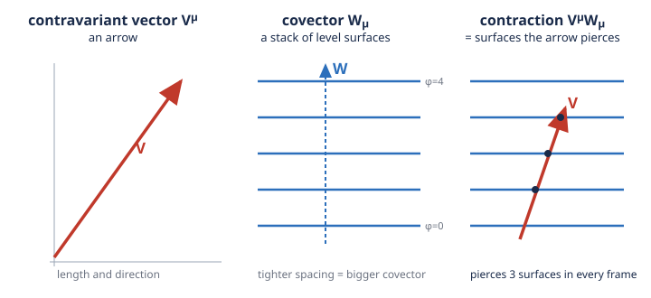

# Relativity (SR + GR) · Lesson 2.2: Vectors, covectors, and the transformation laws

> ⏱ ~15 min · Module 2: The tensor language of Minkowski spacetime · Builds on: [2.1 Index notation and the Minkowski metric](#/lesson/relativity/02-01-index-notation-minkowski-metric.md), [1.5 Four-vectors and four-momentum](#/lesson/relativity/01-05-four-vectors-momentum.md) · Unlocks: 2.3 (tensors and tensor algebra)

*Signature convention for this lesson: $(-,+,+,+)$, with coordinates $x^\mu=(x^0,x^1,x^2,x^3)=(ct,x,y,z)$ and metric $\eta_{\mu\nu}=\mathrm{diag}(-1,+1,+1,+1)$.*

## Why this matters

The entire tensor formalism — the language in which the rest of this course is written — rests on a single distinction most people meet as an annoying bookkeeping rule: some indices go up, some go down. It is not bookkeeping. Upstairs and downstairs label two genuinely different kinds of object, and the reason the machinery works at all is that they transform *oppositely* under a Lorentz boost. That opposition is exactly what makes a contraction like $V^\mu W_\mu$ a Lorentz **invariant** — one number every observer agrees on. Once you see why, "a tensor is defined by how it transforms" stops being a slogan and becomes the design principle behind $F_{\mu\nu}$, $T^{\mu\nu}$, and eventually $G_{\mu\nu}=\tfrac{8\pi G}{c^4}T_{\mu\nu}$.

## The idea

You already own the archetype of each kind of object.

A **contravariant vector** is anything that transforms like a coordinate displacement $dx^\mu$ — an arrow between two nearby events. Boost to a new frame and its components change by the Lorentz matrix $\Lambda$: if the coordinates get scrambled one way, the arrow's components get scrambled the same way. Upper index.

A **covariant vector** — a **covector**, or **one-form** — is anything that transforms like a gradient $\partial_\mu\phi$. Its archetype is the slope of a scalar field: a stack of level surfaces (where $\phi=0,1,2,\dots$). Boost, and its components change by the *inverse* matrix $\Lambda^{-1}$. Lower index.

Why must they be opposites? Because you want them to combine into something no observer can argue with. Picture the covector as a stack of parallel surfaces and the vector as an arrow: the natural coordinate-free quantity is **how many surfaces the arrow pierces**. That count is a physical fact, independent of any grid you draw. If the arrow's components scale up under a boost, the surfaces must scale down by exactly the reciprocal so the piercing count is unchanged. "Transform by $\Lambda$" and "transform by $\Lambda^{-1}$" are the two halves of that reciprocal — and their product is the identity. This is the same dual-space pairing you met abstractly in [`linalg-refresher` 4.1](#/lesson/linalg-refresher/04-01-inner-products-orthogonality.md): covectors are the *linear functionals* on the space of vectors, and the metric is the gadget that lets you convert between the two.

## The formal version

Let $\Lambda^\mu{}_\nu$ be the Lorentz transformation relating a frame $S$ to a boosted frame $S'$, so coordinate displacements transform as
$$dx'^\mu=\Lambda^\mu{}_\nu\,dx^\nu.$$
(Sum over the repeated $\nu$ — Einstein summation from 2.1. The upper index labels rows, the lower labels columns.)

**Contravariant vector.** A four-vector $V^\mu$ is any object whose components transform *like* $dx^\mu$:
$$\boxed{\,V'^\mu=\Lambda^\mu{}_\nu\,V^\nu\,}$$
In words: to get the components in the new frame, hit the old components with $\Lambda$.

**Covariant vector (covector).** A covector $W_\mu$ is any object whose components transform *like* $\partial_\mu\phi$, using the **inverse** matrix $(\Lambda^{-1})^\nu{}_\mu$:
$$\boxed{\,W'_\mu=(\Lambda^{-1})^\nu{}_\mu\,W_\nu\,}$$
In words: covector components transform by the inverse of the vector rule. The two matrices are inverses by definition, $\Lambda^\mu{}_\nu\,(\Lambda^{-1})^\nu{}_\rho=\delta^\mu{}_\rho$, where $\delta^\mu{}_\rho$ is the Kronecker delta (1 if $\mu=\rho$, else 0).

**Why the gradient goes downstairs.** For a scalar field $\phi$, the chain rule gives the new-frame derivative in terms of the old:
$$\partial'_\mu\phi=\frac{\partial\phi}{\partial x'^\mu}=\frac{\partial x^\nu}{\partial x'^\mu}\frac{\partial\phi}{\partial x^\nu}=(\Lambda^{-1})^\nu{}_\mu\,\partial_\nu\phi,$$
because $\partial x^\nu/\partial x'^\mu$ is exactly the inverse of $\partial x'^\mu/\partial x^\nu=\Lambda^\mu{}_\nu$. So $\partial_\mu\equiv\partial/\partial x^\mu$ **is** the archetypal covector — the index it carries is naturally *down*, even though $x^\mu$ carries its index up. That flip is the notorious sign/index subtlety: differentiating with respect to an upstairs coordinate produces a downstairs object.

**The invariant pairing.** Contract a vector with a covector — one up, one down — and the transformation matrices annihilate:
$$V'^\mu W'_\mu=\Lambda^\mu{}_\nu V^\nu\,(\Lambda^{-1})^\rho{}_\mu W_\rho=(\Lambda^{-1})^\rho{}_\mu\Lambda^\mu{}_\nu\,V^\nu W_\rho=\delta^\rho{}_\nu\,V^\nu W_\rho=V^\nu W_\nu.$$
In words: $\Lambda$ and $\Lambda^{-1}$ cancel, so $V^\mu W_\mu$ is the **same number in every frame** — a Lorentz scalar. This is the whole payoff of the up/down distinction.

**The metric is the isomorphism.** In flat spacetime with a metric, you never need a *separate* covector — the metric $\eta_{\mu\nu}$ turns any vector into its covector partner, and $\eta^{\mu\nu}$ (its inverse) turns it back, exactly the **raising and lowering** of 2.1:
$$V_\mu=\eta_{\mu\nu}V^\nu,\qquad V^\mu=\eta^{\mu\nu}V_\nu.$$
In words: lowering the index of $V^\mu$ *builds* the covector that pairs with it, and $V^\mu V_\mu=\eta_{\mu\nu}V^\mu V^\nu$ is precisely the invariant norm from 2.1. Contravariant and covariant components are two coordinate expressions of one geometric object — related by the metric, the way a vector and its "dual" are related once you fix an inner product ([`linalg-refresher` 4.1](#/lesson/linalg-refresher/04-01-inner-products-orthogonality.md)).

## Picture

Reading it: the vector (red, left) is an **arrow** — a length and a direction. The covector (blue, middle) is a **stack of surfaces**, the level sets of some scalar; a *bigger* covector packs its surfaces *tighter*. The contraction $V^\mu W_\mu$ (right) is the **number of surfaces the arrow pierces** — here 3. Boost to another frame and both the arrow and the stack get redrawn, but the arrow still crosses the same three surfaces: the piercing count is geometry, not coordinates. That invariance is $\Lambda$ and $\Lambda^{-1}$ cancelling, drawn.

## Worked examples

Take the boost along $x$ with speed parameter $\beta=v/c=\tfrac35$, so $\gamma=1/\sqrt{1-\beta^2}=1/\sqrt{1-9/25}=\tfrac54$. Acting on the $(x^0,x^1)$ block,
$$\Lambda^\mu{}_\nu=\begin{pmatrix}\gamma & -\gamma\beta \\ -\gamma\beta & \gamma\end{pmatrix}=\begin{pmatrix}1.25 & -0.75 \\ -0.75 & 1.25\end{pmatrix},\qquad (\Lambda^{-1})^\mu{}_\nu=\begin{pmatrix}1.25 & 0.75 \\ 0.75 & 1.25\end{pmatrix}$$
(the inverse is the boost with $\beta\to-\beta$; the $y,z$ components are untouched).

**Example 1 (mechanical — a vector and its invariant norm).** Let $V^\mu=(5,3,0,0)$. Transform it:
$$V'^0=\gamma(V^0-\beta V^1)=1.25(5-0.6\cdot3)=1.25(3.2)=4,\qquad V'^1=\gamma(V^1-\beta V^0)=1.25(3-0.6\cdot5)=1.25(0)=0.$$
So $V'^\mu=(4,0,0,0)$. Check the norm ($V^\mu V_\mu=\eta_{\mu\nu}V^\mu V^\nu=-(V^0)^2+(V^1)^2$):
$$\text{old: }-(5)^2+(3)^2=-16,\qquad\text{new: }-(4)^2+(0)^2=-16.\ \checkmark$$
Same number — the boost is a "rotation" that preserves the Minkowski norm, exactly as a spatial rotation preserves ordinary length.

**Example 2 (why you'd care — vector meets covector).** Keep $V^\mu=(5,3,0,0)$ and take a covector $W_\mu=(2,4,0,0)$ (lower index — it transforms with $\Lambda^{-1}$). The contraction in $S$:
$$V^\mu W_\mu=V^0W_0+V^1W_1=5\cdot2+3\cdot4=22.$$
Now transform $W$ by the *inverse* rule, $W'_\mu=(\Lambda^{-1})^\nu{}_\mu W_\nu$:
$$W'_0=\gamma W_0+\gamma\beta W_1=1.25(2)+0.75(4)=2.5+3=5.5,\qquad W'_1=\gamma\beta W_0+\gamma W_1=0.75(2)+1.25(4)=1.5+5=6.5.$$
So $W'_\mu=(5.5,6.5,0,0)$. The contraction in $S'$, using $V'^\mu=(4,0,0,0)$ from Example 1:
$$V'^\mu W'_\mu=4\cdot5.5+0\cdot6.5=22.\ \checkmark$$
Identical to the value in $S$. Had $W$ transformed with $\Lambda$ (like a vector) instead of $\Lambda^{-1}$, the two factors would have *compounded* rather than cancelled, and the "invariant" would have been frame-dependent junk. The opposite laws are not a convention — they are what makes the number mean anything.

## Watch out

- You might think upper and lower indices are just cosmetic — two ways to write the same list of numbers. They are not: in $(-,+,+,+)$, lowering flips the sign of the time component, so $V^\mu=(5,3,0,0)$ has $V_\mu=(-5,3,0,0)$. Up and down differ by a metric, and in Minkowski that costs you a sign on $V^0$.
- You might think $\partial_\mu$ carries a lower index by arbitrary convention. It's forced: the chain rule makes $\partial/\partial x^\mu$ transform by $\Lambda^{-1}$, so it is genuinely a covector. Differentiating "uses up" an upper coordinate index and hands back a lower one. (Consequently $\partial_\mu x^\nu=\delta_\mu{}^\nu$, not something with two ups.)
- You might think "a four-vector is any four numbers." No — it's four numbers *with a transformation law*. $(E,\mathbf p)$ is a four-vector because it transforms by $\Lambda$; four numbers you staple together by hand are not, and contracting them proves nothing. **A tensor is defined by how it transforms**, full stop.
- You might contract two upper indices directly, $V^\mu W^\mu$, and call it invariant. It isn't — you must lower one first ($V^\mu W_\mu$, or equivalently $\eta_{\mu\nu}V^\mu W^\nu$). A legal contraction always pairs one up with one down.

## One-liner

> Vectors ride $\Lambda$ and covectors ride $\Lambda^{-1}$ precisely so that one-up-one-down contractions come out the same for everyone — a tensor is nothing but its transformation law.

## Problems

**P1 (🟢)** For the boost along $x$ with $\beta=\tfrac45$ (so $\gamma=\tfrac53$), transform the four-vector $V^\mu=(5,4,0,0)$ into the primed frame, and confirm its Minkowski norm $V^\mu V_\mu=-(V^0)^2+(V^1)^2$ is unchanged.

**P2 (🟡)** Using only the chain rule, show that the gradient $\partial_\mu\phi$ of a scalar field transforms as a covector while the displacement $dx^\mu$ transforms as a vector, and conclude that the directional derivative $V^\mu\partial_\mu\phi$ is a Lorentz invariant. Identify which pairs with which.

**P3 (🔴, optional)** Prove in full generality that for *any* vector $V^\mu$ and *any* covector $W_\mu$, the contraction $V^\mu W_\mu$ is Lorentz-invariant — showing explicitly where the defining relation $(\Lambda^{-1})^\rho{}_\mu\,\Lambda^\mu{}_\nu=\delta^\rho{}_\nu$ does the work. Then explain, in one sentence, why the *same* proof would fail for $V^\mu W^\mu$ (both indices up).

Solutions

**P1** With $\gamma=\tfrac53$, $\beta=\tfrac45$, so $\gamma\beta=\tfrac53\cdot\tfrac45=\tfrac{4}{3}$:
$$V'^0=\gamma(V^0-\beta V^1)=\tfrac53\big(5-\tfrac45\cdot4\big)=\tfrac53\big(5-\tfrac{16}{5}\big)=\tfrac53\cdot\tfrac95=3,$$
$$V'^1=\gamma(V^1-\beta V^0)=\tfrac53\big(4-\tfrac45\cdot5\big)=\tfrac53(4-4)=0.$$
So $V'^\mu=(3,0,0,0)$. Norms:
$$\text{old: }-(5)^2+(4)^2=-25+16=-9,\qquad\text{new: }-(3)^2+(0)^2=-9.\ \checkmark$$
Unchanged — the boost preserves the interval, as it must.

**P2** Coordinates in the two frames are related by $x'^\mu=\Lambda^\mu{}_\nu x^\nu$, so the displacement transforms as
$$dx'^\mu=\frac{\partial x'^\mu}{\partial x^\nu}\,dx^\nu=\Lambda^\mu{}_\nu\,dx^\nu,$$
which is the **vector** law (upper index, matrix $\Lambda$). The gradient transforms by the chain rule:
$$\partial'_\mu\phi=\frac{\partial\phi}{\partial x'^\mu}=\frac{\partial x^\nu}{\partial x'^\mu}\,\frac{\partial\phi}{\partial x^\nu}=(\Lambda^{-1})^\nu{}_\mu\,\partial_\nu\phi,$$
using $\partial x^\nu/\partial x'^\mu=(\Lambda^{-1})^\nu{}_\mu$ (the Jacobian of the inverse coordinate map). That is the **covector** law (lower index, matrix $\Lambda^{-1}$). Now pair them:
$$V'^\mu\partial'_\mu\phi=\Lambda^\mu{}_\nu V^\nu\,(\Lambda^{-1})^\rho{}_\mu\,\partial_\rho\phi=(\Lambda^{-1})^\rho{}_\mu\Lambda^\mu{}_\nu\,V^\nu\partial_\rho\phi=\delta^\rho{}_\nu\,V^\nu\partial_\rho\phi=V^\nu\partial_\nu\phi.$$
Invariant. The upper index of $V^\mu$ pairs with the lower index of $\partial_\mu\phi$; geometrically, $V^\mu\partial_\mu\phi$ is the rate of change of $\phi$ along $V$, a fact no observer can dispute.

**P3** Let $V^\mu$ be a vector and $W_\mu$ a covector, so by definition $V'^\mu=\Lambda^\mu{}_\nu V^\nu$ and $W'_\mu=(\Lambda^{-1})^\rho{}_\mu W_\rho$. Then
$$V'^\mu W'_\mu=\big(\Lambda^\mu{}_\nu V^\nu\big)\big((\Lambda^{-1})^\rho{}_\mu W_\rho\big)=\underbrace{(\Lambda^{-1})^\rho{}_\mu\,\Lambda^\mu{}_\nu}_{=\ \delta^\rho{}_\nu}\,V^\nu W_\rho=\delta^\rho{}_\nu\,V^\nu W_\rho=V^\nu W_\nu.$$
The summed-over index $\mu$ is what lets the two transformation matrices meet and collapse to the Kronecker delta via $(\Lambda^{-1})^\rho{}_\mu\Lambda^\mu{}_\nu=\delta^\rho{}_\nu$; the delta then renames $\rho\to\nu$, leaving the original contraction. Hence $V^\mu W_\mu$ takes the same value in every frame.

Why $V^\mu W^\mu$ fails: if $W^\mu$ is also a vector it transforms by $\Lambda$, so the product would contain $\Lambda^\mu{}_\nu\,\Lambda^\mu{}_\rho$ — two $\Lambda$'s that do **not** form $\Lambda^{-1}\Lambda$ and so do not cancel (they'd give $\eta$-dependent junk, not $\delta$). Cancellation requires exactly one $\Lambda$ and one $\Lambda^{-1}$, i.e. one index up and one down. (To legally contract two vectors you must first lower one with the metric: $\eta_{\mu\nu}V^\mu W^\nu=V^\mu W_\mu$.)

## Flashback

**From Lesson 1.5 (Four-vectors and four-momentum):** A particle has four-momentum $p^\mu=(E/c,\,p_x,\,0,\,0)$ with $E=5\ \mathrm{GeV}$ and $p_x=3\ \mathrm{GeV}/c$. Using the invariant $p^\mu p_\mu=-(mc)^2$ (a contraction, hence frame-independent — the very thing this lesson explains), find the particle's rest mass $mc^2$.

Solution

The norm of the four-momentum is a Lorentz scalar:
$$p^\mu p_\mu=\eta_{\mu\nu}p^\mu p^\nu=-\left(\frac{E}{c}\right)^2+p_x^2=-(mc)^2.$$
Multiply through by $-c^2$ to get the energy–momentum relation $E^2=(p_xc)^2+(mc^2)^2$, so
$$(mc^2)^2=E^2-(p_xc)^2=(5)^2-(3)^2=25-9=16\ \mathrm{GeV}^2\ \Rightarrow\ mc^2=4\ \mathrm{GeV}.$$
Because $p^\mu p_\mu$ is an invariant contraction, this rest mass is the one number every observer computes, whatever their frame — which is exactly why "invariant mass" is well-defined.

## Connections

- **Backward:** this makes precise the raising/lowering of [2.1](#/lesson/relativity/02-01-index-notation-minkowski-metric.md) — the metric isn't a formatting rule, it's the isomorphism that turns a vector into the covector it pairs with. The invariant norm of [1.5](#/lesson/relativity/01-05-four-vectors-momentum.md) is the special case $V^\mu V_\mu$, and the dual-space idea is the flat-spacetime face of the functionals in [`linalg-refresher` 4.1](#/lesson/linalg-refresher/04-01-inner-products-orthogonality.md).
- **Forward:** [2.3](#/lesson/relativity/02-03-tensors-algebra.md) stacks these laws — a rank-$(p,q)$ tensor gets one $\Lambda$ per upper index and one $\Lambda^{-1}$ per lower index, and "invariant" always means "all indices contracted away." Every object in the course ($F_{\mu\nu}$, $T^{\mu\nu}$, $g_{\mu\nu}$, $R^\rho{}_{\sigma\mu\nu}$) is declared by its transformation law.
- **Sideways (fields):** the four-gradient $\partial_\mu$ as a covector is the seed of covariant field equations — $\partial_\mu J^\mu=0$ (charge conservation) and $\partial_\mu F^{\mu\nu}=\mu_0 J^\nu$ (Maxwell) in Module 3 are one-up-one-down contractions, hence manifestly the same in every frame. On a curved manifold ([4.4](#/lesson/relativity/04-04-covariant-derivative-christoffel.md)) the plain $\partial_\mu$ stops producing a tensor and must be upgraded to $\nabla_\mu$ — but the up/down transformation logic set here is exactly what that upgrade preserves.
