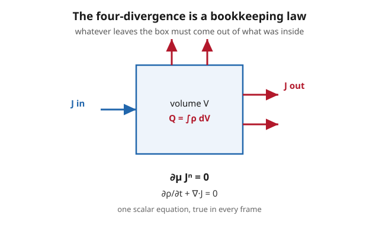

# Relativity (SR + GR) · Lesson 2.4: Invariants, the Levi-Civita tensor, and volume

> ⏱ ~15 min · Module 2: The tensor language of Minkowski spacetime · Builds on: [2.3 Tensors and tensor algebra](#/lesson/relativity/02-03-tensors-algebra.md), [2.2 Vectors, covectors, and transformation laws](#/lesson/relativity/02-02-vectors-covectors-transformations.md) · Unlocks: Module 3 (classical field theory) — and Boss Problem 2, the covariant Maxwell equations

## Why this matters

Everything in Module 2 has been building toward one payoff: writing physics so that the *equations themselves* don't change when you change frames. This lesson delivers the two tools that make that automatic. First, **fully contracting indices produces a scalar** — a single number every observer agrees on — and those scalars are the frame-independent physical quantities (a particle's mass, the field strength $F_{\mu\nu}F^{\mu\nu}$, the interval). Second, the four-gradient $\partial_\mu$ turns "a quantity is conserved" into the one-line tensor equation $\partial_\mu J^\mu = 0$. Add the Levi-Civita symbol (which handles orientation, determinants, and duals) and the invariant volume element $d^4x$, and you have exactly the kit needed to write Maxwell's equations in two lines and to integrate a Lagrangian over spacetime in Module 3. This is the lesson where the machinery starts paying rent.

**Signature convention (fixed for this lesson):** $\eta_{\mu\nu}=\mathrm{diag}(-1,+1,+1,+1)$, coordinates $x^\mu=(x^0,x^1,x^2,x^3)=(ct,x,y,z)$, Greek indices run $0$–$3$, and repeated indices are summed (Einstein convention). $c$ and $G$ are kept explicit.

## The idea

A **scalar** is the one kind of object that survives frame changes untouched. A vector's components get shuffled by a Lorentz boost; a tensor's components get shuffled twice over. But if you contract *every* upper index against a lower one, the transformation matrices meet their inverses and cancel in pairs, leaving a bare number. That's why the recipe "keep contracting until no free indices remain" is how you extract a physical prediction from a tensor equation — the leftover number is what the apparatus reads, and it reads the same on the ground and on the train.

Two more ideas ride along. The derivative operator $\partial_\mu = \partial/\partial x^\mu$ is itself a covector (it carries a *lower* index), so contracting it with a vector, $\partial_\mu V^\mu$, gives a scalar — the **four-divergence**. Setting it to zero, $\partial_\mu V^\mu = 0$, is the universal grammar of a conservation law: *what accumulates here equals what flows in from around it*. And the totally antisymmetric **Levi-Civita symbol** $\epsilon_{\mu\nu\rho\sigma}$ is the four-dimensional generalization of the cross product and the determinant — it measures oriented 4-volume, builds "dual" tensors, and is the reason the spacetime volume element $d^4x$ is the same in every frame.

## The formal version

### A. Scalar invariants by full contraction

If $T^{\mu}{}_{\nu}$ is a $(1,1)$ tensor, its **trace** $T^{\mu}{}_{\mu}$ (contract the two indices) is a scalar. More generally, contract a tensor down to zero free indices and the result is Lorentz-invariant.

*In words:* pair off every up-index with a down-index; the number left over is one all observers share.

The reason, in one line: under $x'^\mu = \Lambda^\mu{}_\nu\,x^\nu$, an upper index brings a factor $\Lambda^{\mu}{}_{\alpha}$ and a lower index brings the inverse $(\Lambda^{-1})^{\beta}{}_{\nu}$; contracting an upper against a lower multiplies $\Lambda(\Lambda^{-1})=\mathbb 1$, so the pair transforms away. Familiar examples:

$$p_\mu p^\mu = -m^2c^2,\qquad \Delta x_\mu\,\Delta x^\mu = -c^2\Delta\tau^2,\qquad F_{\mu\nu}F^{\mu\nu}=2\!\left(B^2-\tfrac{E^2}{c^2}\right).$$

The first is the mass, the second the invariant interval, the third the electromagnetic field strength — each a single frame-independent number built by full contraction.

### B. The four-gradient and the four-divergence

Define the **four-gradient**

$$\partial_\mu \equiv \frac{\partial}{\partial x^\mu}=\left(\frac1c\frac{\partial}{\partial t},\,\nabla\right),\qquad \partial^\mu=\eta^{\mu\nu}\partial_\nu=\left(-\frac1c\frac{\partial}{\partial t},\,\nabla\right).$$

*In words:* differentiating with respect to a contravariant coordinate $x^\mu$ produces an object with a naturally *lower* index — the derivative is a covector. (The reason $\partial_\mu$ is covariant is exactly the chain rule; you proved this in [2.2](#/lesson/relativity/02-02-vectors-covectors-transformations.md).)

Contracting it with a four-vector $V^\mu=(V^0,\mathbf V)$ gives the **four-divergence**, a scalar:

$$\partial_\mu V^\mu = \frac1c\frac{\partial V^0}{\partial t}+\nabla\cdot\mathbf V.$$

And contracting $\partial_\mu$ with itself gives the invariant **d'Alembertian** (wave operator):

$$\Box \equiv \partial_\mu\partial^\mu = -\frac1{c^2}\frac{\partial^2}{\partial t^2}+\nabla^2.$$

**Conservation laws.** A four-vector current whose divergence vanishes,

$$\boxed{\ \partial_\mu J^\mu = 0\ }$$

*In words:* the charge piling up in any region is exactly balanced by the current flowing across its boundary — nothing is created or destroyed. This single covariant equation is the **continuity equation**; for the electric four-current $J^\mu=(c\rho,\mathbf J)$ it unpacks to $\partial\rho/\partial t+\nabla\cdot\mathbf J=0$, the charge conservation you met in [em-refresher 4.1](#/lesson/em-refresher/04-01-maxwells-equations.md) as the consistency condition forced by the displacement current. The pattern $\partial_\mu(\text{current})=0$ recurs for every conserved quantity — energy, momentum, probability — and is the endpoint of Noether's theorem ([analytical-mechanics 2.2](#/lesson/analytical-mechanics/02-02-noethers-theorem.md)), which Module 3 lifts to fields.

### C. The Levi-Civita symbol and dual tensors

Define $\epsilon_{\mu\nu\rho\sigma}$ to be **totally antisymmetric** (it flips sign under any swap of two indices, and vanishes if any index repeats), fixed by

$$\epsilon_{0123}=+1.$$

Raising all four indices in this signature costs one minus sign (from $\eta^{00}=-1$): $\epsilon^{0123}=\eta^{0\alpha}\eta^{1\beta}\eta^{2\gamma}\eta^{3\delta}\epsilon_{\alpha\beta\gamma\delta}=-1$. It does three jobs:

- **Determinants / oriented 4-volume.** For any matrix $M^\mu{}_\nu$, $\ \det M = \epsilon_{\mu\nu\rho\sigma}\,M^\mu{}_0 M^\nu{}_1 M^\rho{}_2 M^\sigma{}_3$. This is the source of the volume result in part D.
- **A four-dimensional "cross product."** Just as $\epsilon_{ijk}$ builds $\mathbf a\times\mathbf b$ in 3D, $\epsilon_{\mu\nu\rho\sigma}$ combines lower-rank objects into the antisymmetric leftovers.
- **Dual tensors.** For an antisymmetric $(0,2)$ tensor $F_{\rho\sigma}$, its **dual** is

$$\tilde F^{\mu\nu}\equiv \tfrac12\,\epsilon^{\mu\nu\rho\sigma}F_{\rho\sigma}.$$

*In words:* the dual of an antisymmetric two-index object is the antisymmetric object built from the *complementary* pair of directions (the "01" component of $\tilde F$ is read off the "23" component of $F$, and so on). For the electromagnetic field tensor this swaps $\mathbf E\leftrightarrow c\mathbf B$, and $\partial_\mu\tilde F^{\mu\nu}=0$ is precisely the *homogeneous* Maxwell pair (Faraday + no monopoles). One symbol, and the other half of electromagnetism falls out.

### D. The invariant volume element

Under a Lorentz transformation $x'^\mu=\Lambda^\mu{}_\nu x^\nu$, the 4D integration measure transforms by the Jacobian:

$$d^4x' = \left|\det\!\frac{\partial x'^\mu}{\partial x^\nu}\right|d^4x=|\det\Lambda|\;d^4x.$$

The defining relation of a Lorentz transformation, $\Lambda^T\eta\,\Lambda=\eta$, forces $(\det\Lambda)^2=1$, so $\det\Lambda=\pm1$; **proper** transformations (rotations and boosts, continuously connected to the identity) have $\det\Lambda=+1$. Therefore

$$\boxed{\ d^4x'=d^4x\ }$$

*In words:* boosting doesn't change the four-dimensional volume of a spacetime region — the length-contraction of space is exactly compensated by the time-dilation of time, and the two cancel in the product. This is why an action $S=\int \mathcal L\,d^4x$ is Lorentz-invariant whenever $\mathcal L$ is a scalar — the foundation of Module 3. In curved space $d^4x$ alone is no longer invariant; it gets corrected to $\sqrt{-g}\,d^4x$ (with $g=\det g_{\mu\nu}$), which you'll meet in Modules 4–5.

## Picture

## Worked examples

**Example 1 (mechanical — compute an invariant from components).** The electromagnetic field tensor has components (this signature and convention)

$$F^{0i}=-\frac{E_i}{c},\quad F^{ij}=-\epsilon_{ijk}B_k,\quad\text{i.e.}\quad F^{\mu\nu}=\begin{pmatrix}0&-E_x/c&-E_y/c&-E_z/c\\ E_x/c&0&-B_z&B_y\\ E_y/c&B_z&0&-B_x\\ E_z/c&-B_y&B_x&0\end{pmatrix}.$$

Compute the scalar $F_{\mu\nu}F^{\mu\nu}$. First lower both indices with $\eta$: the time–space components flip sign, $F_{0i}=\eta_{00}\eta_{ii}F^{0i}=+E_i/c$, while the purely spatial ones are unchanged, $F_{ij}=F^{ij}=-\epsilon_{ijk}B_k$. Now contract, splitting the sum into time–space and space–space pieces:

$$F_{\mu\nu}F^{\mu\nu}=\underbrace{2\,F_{0i}F^{0i}}_{\text{time–space}}+\underbrace{F_{ij}F^{ij}}_{\text{space–space}}=2\Big(\tfrac{E_i}{c}\Big)\Big(-\tfrac{E_i}{c}\Big)+(\epsilon_{ijk}B_k)(\epsilon_{ijl}B_l).$$

The factor $2$ in the first term counts both orderings ($0i$ and $i0$, equal by the double antisymmetry). Using $\epsilon_{ijk}\epsilon_{ijl}=2\delta_{kl}$ in the second:

$$F_{\mu\nu}F^{\mu\nu}=-\frac{2E^2}{c^2}+2B^2=2\!\left(B^2-\frac{E^2}{c^2}\right).$$

This one number is the same in every frame: if $B^2>E^2/c^2$ in your frame, it exceeds it in *all* frames — no boost can transform away a predominantly magnetic field. (Up to the factor $-\tfrac14$, this scalar *is* the electromagnetic Lagrangian density of Module 3.)

**Example 2 (why you'd care — unpacking covariant Maxwell).** Boss Problem 2 claims that a single tensor equation, $\partial_\mu F^{\mu\nu}=\mu_0 J^\nu$, contains two of Maxwell's equations. Read off the time component, $\nu=0$. Since $F^{00}=0$, only the spatial derivatives survive:

$$\partial_\mu F^{\mu 0}=\partial_i F^{i0}=\partial_i\!\left(\frac{E_i}{c}\right)=\frac1c\nabla\cdot\mathbf E.$$

Set this equal to $\mu_0 J^0=\mu_0 c\rho$ and use $c^2=1/(\mu_0\varepsilon_0)$:

$$\frac1c\nabla\cdot\mathbf E=\mu_0 c\rho\quad\Longrightarrow\quad \nabla\cdot\mathbf E=\mu_0c^2\rho=\frac{\rho}{\varepsilon_0}.$$

That is **Gauss's law**. Taking $\nu=j$ (a spatial component) the same way delivers the **Ampère–Maxwell law** $\nabla\times\mathbf B=\mu_0\mathbf J+\mu_0\varepsilon_0\,\partial\mathbf E/\partial t$ — displacement current and all. Four vector-calculus equations from [em-refresher 4.1](#/lesson/em-refresher/04-01-maxwells-equations.md) collapse into $\partial_\mu F^{\mu\nu}=\mu_0J^\nu$ (the two with sources) and $\partial_\mu\tilde F^{\mu\nu}=0$ (the two without). And here is the gem the antisymmetry hands you for free: take one more divergence,

$$\partial_\nu\partial_\mu F^{\mu\nu}=\mu_0\,\partial_\nu J^\nu.$$

The left side is a **symmetric** operator $\partial_\nu\partial_\mu$ contracted with the **antisymmetric** $F^{\mu\nu}$, so it vanishes identically (Problem 3 proves this). Hence $\partial_\nu J^\nu=0$: *charge conservation is not an extra assumption — it is forced by the antisymmetry of $F$.* This is the covariant echo of the displacement-current argument in em-refresher 4.1.

## Watch out

- **You might think $\partial_\mu$ has an upper index because $x^\mu$ has one.** It's the opposite: $\partial/\partial x^\mu$ transforms *inversely* to $x^\mu$ (chain rule), so it is a covector with a *lower* index. The four-divergence $\partial_\mu V^\mu$ is a legitimate contraction precisely because the derivative sits downstairs.
- **You might think $\epsilon^{0123}=+1$ like $\epsilon_{0123}$.** In signature $(-,+,+,+)$, raising the four indices flips the sign once (the single $\eta^{00}=-1$): $\epsilon^{0123}=-1$. Dropping that minus silently corrupts every dual and determinant identity.
- **You might think $\epsilon_{\mu\nu\rho\sigma}$ is a tensor in the ordinary sense.** Strictly it's a *density*: under a general coordinate change it picks up a factor of the Jacobian determinant. For **proper Lorentz** transformations that factor is $\det\Lambda=1$, so it behaves as an invariant tensor here — but that grace disappears under parity/time-reversal ($\det\Lambda=-1$) and in curved space, where you need $\sqrt{-g}\,\epsilon_{\mu\nu\rho\sigma}$.
- **You might expect a full contraction to still carry frame dependence.** No free indices means no leftover transformation matrices — the value is a pure scalar. If your "invariant" still has a dangling index, you haven't finished contracting.

## One-liner

> Contract every index and you get a number all frames agree on; the four-divergence $\partial_\mu J^\mu=0$ is how conservation looks in that language, and the Levi-Civita symbol supplies orientation, duals, and the boost-invariant volume $d^4x$.

## Problems

**P1 (🟢)** Given the electric four-current $J^\mu=(c\rho,\,\mathbf J)$ with $\mathbf J=(J_x,J_y,J_z)$, write out $\partial_\mu J^\mu=0$ component by component and identify the resulting equation. State in one sentence what it says physically.

**P2 (🟡)** Show that the spacetime volume element $d^4x=c\,dt\,dx\,dy\,dz$ is invariant under a proper Lorentz boost. Use the transformation-of-measure rule $d^4x'=|\det\Lambda|\,d^4x$ and the defining relation $\Lambda^T\eta\,\Lambda=\eta$ to pin down $\det\Lambda$. (Optional check: verify $\det\Lambda=1$ directly for a boost in the $x$-direction, $\Lambda=\begin{pmatrix}\gamma&-\beta\gamma\\ -\beta\gamma&\gamma\end{pmatrix}$ in the $(ct,x)$ block, identity elsewhere.)

**P3 (🔴, optional)** (a) Let $S^{\mu\nu}=S^{\nu\mu}$ be symmetric. Prove that $\epsilon_{\mu\nu\rho\sigma}S^{\mu\nu}=0$ (this is the identity that makes charge conservation automatic in Example 2). (b) For an antisymmetric $F_{\rho\sigma}$, construct the dual $\tilde F^{\mu\nu}=\tfrac12\epsilon^{\mu\nu\rho\sigma}F_{\rho\sigma}$ and show explicitly that $\tilde F^{01}=-F_{23}$; explain in one line why the dual always pairs a component with its *complementary* index pair.

Solutions

**P1** The four-divergence needs no metric — just contract the lower $\partial_\mu$ with the upper $J^\mu$:

$$\partial_\mu J^\mu=\partial_0 J^0+\partial_i J^i=\frac1c\frac{\partial(c\rho)}{\partial t}+\left(\frac{\partial J_x}{\partial x}+\frac{\partial J_y}{\partial y}+\frac{\partial J_z}{\partial z}\right)=\frac{\partial\rho}{\partial t}+\nabla\cdot\mathbf J.$$

Setting it to zero gives the **continuity equation**

$$\frac{\partial\rho}{\partial t}+\nabla\cdot\mathbf J=0.$$

Physically: the rate at which charge density builds up at a point equals minus the net current diverging away from it — charge is locally conserved (it can only leave a region by flowing across the boundary, never by vanishing). Note the factor $c$ in $J^0=c\rho$ is exactly what's needed for the two terms to share units and combine.

**P2** The measure transforms by the absolute Jacobian of $x'^\mu=\Lambda^\mu{}_\nu x^\nu$, and since $\Lambda$ is constant the Jacobian matrix *is* $\Lambda$:

$$d^4x'=|\det\Lambda|\,d^4x.$$

Take the determinant of the defining relation $\Lambda^T\eta\,\Lambda=\eta$:

$$\det(\Lambda^T)\det(\eta)\det(\Lambda)=\det(\eta)\ \Longrightarrow\ (\det\Lambda)^2\det\eta=\det\eta.$$

Since $\det\eta=-1\neq0$, cancel it: $(\det\Lambda)^2=1$, so $\det\Lambda=\pm1$. Proper transformations (boosts and rotations, continuously reachable from the identity, which has $\det=+1$) take the $+$ root, so $\det\Lambda=1$ and

$$d^4x'=d^4x.$$

*Direct check for an $x$-boost:* the only nontrivial block is $\begin{pmatrix}\gamma&-\beta\gamma\\ -\beta\gamma&\gamma\end{pmatrix}$ with determinant $\gamma^2-\beta^2\gamma^2=\gamma^2(1-\beta^2)=1$ (using $\gamma^2=1/(1-\beta^2)$); the $y,z$ rows contribute a factor $1$ each. So $\det\Lambda=1$. The spatial length contracts by $1/\gamma$ and the time interval dilates by $\gamma$; in the 4-volume these cancel exactly.

**P3** (a) Rename the two summed (dummy) indices $\mu\leftrightarrow\nu$ — legal, since they are summed over:

$$\epsilon_{\mu\nu\rho\sigma}S^{\mu\nu}=\epsilon_{\nu\mu\rho\sigma}S^{\nu\mu}.$$

Now use the two symmetries: $\epsilon_{\nu\mu\rho\sigma}=-\epsilon_{\mu\nu\rho\sigma}$ (antisymmetric) and $S^{\nu\mu}=S^{\mu\nu}$ (symmetric). Substituting,

$$\epsilon_{\mu\nu\rho\sigma}S^{\mu\nu}=-\epsilon_{\mu\nu\rho\sigma}S^{\mu\nu}.$$

A quantity equal to its own negative is zero. (The same move kills *any* full contraction of a symmetric pair against an antisymmetric pair — the engine behind $\partial_\nu\partial_\mu F^{\mu\nu}=0$ and hence charge conservation.)

(b) By definition, holding $\mu\nu=01$ fixed and summing $\rho\sigma$ over the two values not already used ($2$ and $3$):

$$\tilde F^{01}=\tfrac12\epsilon^{01\rho\sigma}F_{\rho\sigma}=\tfrac12\big(\epsilon^{0123}F_{23}+\epsilon^{0132}F_{32}\big).$$

Now $\epsilon^{0132}=-\epsilon^{0123}$ (one swap) and $F_{32}=-F_{23}$ (antisymmetry), so the second term equals the first: both are $\epsilon^{0123}F_{23}$. Hence

$$\tilde F^{01}=\epsilon^{0123}F_{23}=(-1)F_{23}=-F_{23},$$

using $\epsilon^{0123}=-1$ in this signature. The dual pairs "$01$" with "$23$" because $\epsilon^{\mu\nu\rho\sigma}$ is nonzero only when all four indices are distinct: fixing $\mu\nu$ leaves exactly the two complementary directions for $\rho\sigma$. For the electromagnetic field this is exactly the swap that turns $\mathbf E$ into $c\mathbf B$ and $c\mathbf B$ into $-\mathbf E$, converting the sourced Maxwell pair into the source-free pair.

## Flashback

**From Lesson 1.5 (Four-vectors and four-momentum):** A particle has four-momentum $p^\mu=(E/c,\,\mathbf p)$. Lower the index with $\eta_{\mu\nu}$, form the fully contracted invariant $p_\mu p^\mu$, and — knowing that this scalar has the same value in the particle's rest frame (where $\mathbf p=\mathbf 0$ and $E=mc^2$) — read off the energy–momentum relation.

Solution

Lower the index: $p_\mu=\eta_{\mu\nu}p^\nu=(-E/c,\,\mathbf p)$ (the time component flips sign, the spatial ones don't). Contract:

$$p_\mu p^\mu=\left(-\frac Ec\right)\!\left(\frac Ec\right)+\mathbf p\cdot\mathbf p=-\frac{E^2}{c^2}+p^2.$$

Because this is a full contraction it is a Lorentz invariant — the same number in every frame. Evaluate it in the rest frame, where $\mathbf p=\mathbf 0$ and $E=mc^2$: there $p_\mu p^\mu=-(mc^2)^2/c^2=-m^2c^2$. Equating the two,

$$-\frac{E^2}{c^2}+p^2=-m^2c^2\quad\Longrightarrow\quad E^2=(pc)^2+(mc^2)^2.$$

The invariant square of the four-momentum *is* the mass (up to constants), and equating a scalar across frames is exactly the "compute-in-the-easy-frame" trick that Boss Problem 1 exploits.

## Connections

- **Backward:** this is [2.3](#/lesson/relativity/02-03-tensors-algebra.md)'s contraction taken to completion (zero free indices → scalar) and [2.2](#/lesson/relativity/02-02-vectors-covectors-transformations.md)'s raising/lowering, now applied to the derivative operator $\partial_\mu$. The invariant interval from [1.4](#/lesson/relativity/01-04-spacetime-interval-causality.md) and the mass from [1.5](#/lesson/relativity/01-05-four-vectors-momentum.md) are the archetypal invariants.
- **Forward:** Module 3 builds field theory on the invariant action $S=\int\mathcal L\,d^4x$ (invariant *because* $d^4x$ is, this lesson) with $\mathcal L=-\tfrac14 F_{\mu\nu}F^{\mu\nu}$ (the scalar of Example 1); [3.5](#/lesson/relativity/03-05-em-field-theory.md)–[3.6](#/lesson/relativity/03-06-em-lagrangian-stress-energy.md) complete the covariant Maxwell story sketched in Example 2, and $\partial_\mu T^{\mu\nu}=0$ ([3.3](#/lesson/relativity/03-03-stress-energy-tensor.md)) is the four-divergence conservation law for energy–momentum. In curved space $d^4x\to\sqrt{-g}\,d^4x$ ([4.3](#/lesson/relativity/04-03-metric-proper-time.md), [5.4](#/lesson/relativity/05-04-einstein-hilbert-action.md)).
- **Sideways (E&M):** $\partial_\mu J^\mu=0$ is the charge conservation of [em-refresher 4.1](#/lesson/em-refresher/04-01-maxwells-equations.md), and the fact that antisymmetry of $F^{\mu\nu}$ *forces* it is the covariant version of that lesson's displacement-current consistency argument.
- **Sideways (symmetry → conservation):** $\partial_\mu J^\mu=0$ is the conserved-current half of Noether's theorem ([analytical-mechanics 2.2](#/lesson/analytical-mechanics/02-02-noethers-theorem.md)); Module 3 promotes the theorem from particle mechanics to fields.
