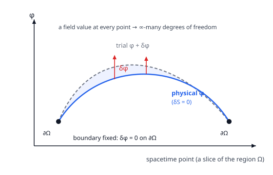

# Relativity (SR + GR) · Lesson 3.1: The action for fields and the Euler–Lagrange equations

> ⏱ ~15 min · Module 3: Classical field theory · Builds on: [2.4 Invariants, the Levi-Civita tensor, and volume](#/lesson/relativity/02-04-invariants-levi-civita.md), [analytical-mechanics 1.2 (least action)](#/lesson/analytical-mechanics/01-02-least-action-lagrange.md), [analytical-mechanics 4.5 (classical fields)](#/lesson/analytical-mechanics/04-05-classical-fields.md) · Unlocks: Noether's theorem for fields (3.2), the stress–energy tensor (3.3), and eventually the Einstein–Hilbert action (5.4)

*Signature convention for this lesson: $(-,+,+,+)$, with coordinates $x^\mu=(ct,x,y,z)$, so $\eta_{\mu\nu}=\mathrm{diag}(-1,+1,+1,+1)$. The d'Alembertian is $\Box \equiv \partial_\mu\partial^\mu = -\tfrac{1}{c^2}\partial_t^2 + \nabla^2$. Factors of $c$ and $G$ are kept explicit.*

## Why this matters

Everything ahead in this course — electromagnetism written covariantly (3.5), the stress–energy tensor that *sources* gravity (3.3), and the Einstein field equations themselves, which drop out of an action (the Einstein–Hilbert action, 5.4) — runs on one engine: **you write down a single scalar, the action, and demand it be stationary.** For a *particle* you learned this in [analytical-mechanics 1.2](#/lesson/analytical-mechanics/01-02-least-action-lagrange.md): one number per trajectory, and nature picks the flat spot. The leap now is from a particle (finitely many coordinates $q_i(t)$) to a **field** $\phi(x)=\phi(t,\mathbf x)$ — a dynamical variable with a value at *every point of spacetime*, hence infinitely many degrees of freedom. The same variational recipe survives the crossing, and it produces the **field Euler–Lagrange equations**. Master this one derivation and you own the machinery that quantum field theory later quantizes.

## The idea

Recall the particle story. A trajectory $q(t)$ gets a number
$$S[q]=\int L(q,\dot q)\,dt,$$
and Hamilton's principle — $\delta S=0$ with the endpoints pinned — hands back Lagrange's equation $\frac{d}{dt}\frac{\partial L}{\partial\dot q}-\frac{\partial L}{\partial q}=0$. The coordinate $q$ carries one label: *time*. A finite set $q_1,\dots,q_n$ carries a discrete index too.

A field is what you get when that discrete index becomes **continuous**. Instead of "where is bead number $n$ at time $t$," you ask "what is the field's value *at the spacetime point $x$*." The bead label has fused into the coordinates $x^\mu$; the dynamical thing is the number $\phi$ sitting at each point. You saw the 1+1 version of exactly this in [analytical-mechanics 4.5](#/lesson/analytical-mechanics/04-05-classical-fields.md): a chain of oscillators, spacing shrunk to zero, became a field $\phi(x,t)$, and $L=\sum_n(\dots)$ became $\int\mathcal L\,dx$.

Two changes follow, and that's the whole lesson. First, the Lagrangian becomes a **Lagrangian density** $\mathcal L$: energy-of-motion *per unit volume*, built from the field $\phi$ and its spacetime slopes $\partial_\mu\phi$. The action is $\mathcal L$ summed over *all* of spacetime, $S=\int\mathcal L\,d^4x$. Second — and this is the relativistic demand that wasn't there in the mechanics course — $\mathcal L$ must be a **Lorentz scalar**, assembled by contracting indices away (from [2.4](#/lesson/relativity/02-04-invariants-levi-civita.md)), so that the *same* action is computed in every frame. Same action ⟹ same stationary field ⟹ same physics for everyone. That is how covariance gets baked in at the ground floor.

## The formal version

**The field, the density, the action.** Let $\phi(x)$ be a scalar field on spacetime. Its dynamics come from a **Lagrangian density** $\mathcal L\big(\phi,\partial_\mu\phi\big)$ — a function of the field value and its four gradients $\partial_\mu\phi=(\tfrac1c\partial_t\phi,\,\nabla\phi)$. The **action** is the density integrated over a spacetime region $\Omega$:

$$\boxed{\;S[\phi]=\int_\Omega \mathcal L\big(\phi,\partial_\mu\phi\big)\,d^4x,\qquad d^4x=c\,dt\,dx\,dy\,dz.\;}$$

In words: $S$ is one number attached to an entire field configuration — the field-theory analogue of "one number per trajectory."

*Why $d^4x$ and not just $dt$:* a particle action integrates over time alone; a field lives at every point, so we integrate over all four spacetime coordinates. The four-volume element $d^4x$ is **Lorentz invariant** — a Lorentz transformation has $\det\Lambda=1$, so its Jacobian is $1$ and $d^4x'=d^4x$ (this is the invariant volume element of [2.4](#/lesson/relativity/02-04-invariants-levi-civita.md)). Therefore *if $\mathcal L$ is a scalar, $S$ is a scalar*: every observer computes the same $S$.

**The variational principle.** Among all field configurations agreeing with a fixed configuration on the boundary $\partial\Omega$, the physical field is the one for which

$$\delta S=0$$

to first order under an arbitrary variation $\phi\to\phi+\delta\phi$ with $\delta\phi\big|_{\partial\Omega}=0$. In words: pin the field down on the boundary of the spacetime box, wiggle it anywhere inside, and demand the action not change to first order.

**Deriving the field Euler–Lagrange equation.** Vary $\phi\to\phi+\delta\phi$. Since $\mathcal L$ depends on $\phi$ and on $\partial_\mu\phi$, and $\delta(\partial_\mu\phi)=\partial_\mu(\delta\phi)$ (varying and differentiating commute),

$$\delta S=\int_\Omega\left[\frac{\partial\mathcal L}{\partial\phi}\,\delta\phi+\frac{\partial\mathcal L}{\partial(\partial_\mu\phi)}\,\partial_\mu(\delta\phi)\right]d^4x.$$

The second term hides a $\partial_\mu(\delta\phi)$ we want to move off of $\delta\phi$. Use the product rule for the divergence,

$$\frac{\partial\mathcal L}{\partial(\partial_\mu\phi)}\,\partial_\mu(\delta\phi)=\partial_\mu\!\left[\frac{\partial\mathcal L}{\partial(\partial_\mu\phi)}\,\delta\phi\right]-\partial_\mu\!\left[\frac{\partial\mathcal L}{\partial(\partial_\mu\phi)}\right]\delta\phi.$$

The first piece is a total four-divergence; by the (Gauss) divergence theorem its integral over $\Omega$ becomes a boundary integral over $\partial\Omega$,

$$\int_\Omega \partial_\mu\!\left[\frac{\partial\mathcal L}{\partial(\partial_\mu\phi)}\,\delta\phi\right]d^4x=\oint_{\partial\Omega}\frac{\partial\mathcal L}{\partial(\partial_\mu\phi)}\,\delta\phi\;dS_\mu=0,$$

which **vanishes** because $\delta\phi=0$ on $\partial\Omega$. This is the integration-by-parts step, and pinning the boundary is *exactly* what kills the surface term — the field-theory version of pinning the endpoints in the particle problem. What survives:

$$\delta S=\int_\Omega\left[\frac{\partial\mathcal L}{\partial\phi}-\partial_\mu\!\left(\frac{\partial\mathcal L}{\partial(\partial_\mu\phi)}\right)\right]\delta\phi\;d^4x.$$

For this to vanish for *every* admissible $\delta\phi$, the bracket must vanish pointwise (the fundamental lemma of the calculus of variations). Hence the **field Euler–Lagrange equation**:

$$\boxed{\;\partial_\mu\!\left(\frac{\partial\mathcal L}{\partial(\partial_\mu\phi)}\right)-\frac{\partial\mathcal L}{\partial\phi}=0.\;}$$

In words: differentiate $\mathcal L$ with respect to each gradient, take the divergence of the result, and subtract $\mathcal L$ differentiated by the field itself — zero along the physical field. Compare the particle law $\frac{d}{dt}\frac{\partial L}{\partial\dot q}-\frac{\partial L}{\partial q}=0$: the single time-derivative $\frac{d}{dt}$ has grown into a spacetime divergence $\partial_\mu(\cdots)$ summed over all four directions. Time and space enter on the same footing — the equation is *manifestly Lorentz covariant* when $\mathcal L$ is a scalar.

**Why $\mathcal L$ must be a Lorentz scalar.** $\phi$ transforms as a scalar and $\partial_\mu\phi$ as a covector, so the only way to build a frame-independent $\mathcal L$ is to **contract every index away** — e.g. $(\partial_\mu\phi)(\partial^\mu\phi)=\eta^{\mu\nu}\partial_\mu\phi\,\partial_\nu\phi$, a scalar, plus any scalar function $V(\phi)$. Then $S$ is invariant, $\delta S=0$ is a statement all observers agree on, and the resulting field equation holds with the same form in every inertial frame. That is the entire payoff of Module 2's index machinery: it guarantees the physics we derive is the same in all frames.

## Picture

The solid curve is the physical field $\phi$; the dashed curve is a trial $\phi+\delta\phi$. They are **clamped together on the boundary** $\partial\Omega$ (the black dots, $\delta\phi=0$) and are free to differ only in the interior. Hamilton's principle says the physical $\phi$ is the configuration where *every* such interior wiggle leaves $S$ unchanged to first order — and it is precisely the boundary clamp that makes the integration-by-parts surface term drop, leaving the Euler–Lagrange equation. (Drawn as a 1-D slice; the real object is a value at *every* spacetime point — infinitely many degrees of freedom.)

## Worked examples

**Example 1 (mechanical — read the field equation off a density).** Take the workhorse scalar Lagrangian
$$\mathcal L=\tfrac12(\partial_\mu\phi)(\partial^\mu\phi)-V(\phi),\qquad (\partial_\mu\phi)(\partial^\mu\phi)=\eta^{\mu\nu}\partial_\mu\phi\,\partial_\nu\phi.$$
Compute the two ingredients. For the gradient slot, differentiate the contracted kinetic term (both factors carry the derivative, and the symmetric metric merges them):

$$\frac{\partial\mathcal L}{\partial(\partial_\mu\phi)}=\tfrac12\,\eta^{\alpha\beta}\big(\delta^\mu_\alpha\,\partial_\beta\phi+\partial_\alpha\phi\,\delta^\mu_\beta\big)=\eta^{\mu\beta}\partial_\beta\phi=\partial^\mu\phi.$$

For the field slot, $\dfrac{\partial\mathcal L}{\partial\phi}=-V'(\phi)$. Assemble the Euler–Lagrange equation:

$$\partial_\mu\big(\partial^\mu\phi\big)-\big(-V'(\phi)\big)=0\quad\Longrightarrow\quad \boxed{\;\partial_\mu\partial^\mu\phi+V'(\phi)=0\;}\ \ \text{i.e.}\ \ \Box\phi+V'(\phi)=0.$$

Written out with $\Box=-\tfrac{1}{c^2}\partial_t^2+\nabla^2$: $\ -\tfrac{1}{c^2}\partial_t^2\phi+\nabla^2\phi+V'(\phi)=0$. Choosing $V(\phi)=\tfrac12\mu^2\phi^2$ gives $V'=\mu^2\phi$ and the **Klein–Gordon equation** $\Box\phi+\mu^2\phi=0$ — the relativistic wave equation for a free scalar particle, and the very same equation the loaded string gave in [analytical-mechanics 4.5](#/lesson/analytical-mechanics/04-05-classical-fields.md), now derived covariantly.

**Example 2 (why you'd care — the same engine builds electromagnetism and gravity).** The field need not be a single scalar. For electromagnetism the dynamical field is the four-potential $A_\mu$, and the action

$$S=\int\left(-\tfrac14 F_{\mu\nu}F^{\mu\nu}-\mu_0 A_\mu J^\mu\right)d^4x,\qquad F_{\mu\nu}=\partial_\mu A_\nu-\partial_\nu A_\mu,$$

is again a Lorentz scalar (every index contracted). Feed it through the field Euler–Lagrange equation — with $A_\nu$ now playing the role of $\phi$ — and out come the inhomogeneous Maxwell equations $\partial_\mu F^{\mu\nu}=\mu_0 J^\nu$ (you build this in [3.5](#/lesson/relativity/03-05-em-field-theory.md)–[3.6](#/lesson/relativity/03-06-em-lagrangian-stress-energy.md)). Push the same idea one level up and let the *metric* $g_{\mu\nu}$ itself be the field: the Einstein–Hilbert action $S=\frac{c^4}{16\pi G}\int R\sqrt{-g}\,d^4x$ (its scalar is the Ricci curvature $R$), varied against $g_{\mu\nu}$, yields the **Einstein field equations** ([5.4](#/lesson/relativity/05-04-einstein-hilbert-action.md)). Scalar fields, the electromagnetic field, and gravity are three instances of *one* variational principle — which is exactly why this lesson is the gateway to the second half of the course.

## Watch out

- **The overall sign and signature of $\mathcal L$ are convention-dependent; the field equation is not.** Multiplying $\mathcal L$ by an overall constant scales both terms of the Euler–Lagrange bracket equally and changes nothing. Likewise, in the opposite signature $(+,-,-,-)$ the "physically correct" free-scalar kinetic term flips sign. What is invariant is the *structure*: contract gradients into a scalar, and $\partial_\mu\partial^\mu\phi+V'(\phi)=0$ results either way. Don't memorize a sign — re-derive it from your stated signature.
- **You might think $x$ is a coordinate like $\phi$, so it should be "varied" too.** No — in a field theory $x^\mu$ is a **label**, the continuous stand-in for the bead index. The dynamical variable is $\phi$; $t$ and $\mathbf x$ are independent parameters it depends on, which is precisely why they can sit symmetrically inside a Lorentz-scalar $\mathcal L$.
- **You might read $\partial_\mu\big(\partial\mathcal L/\partial(\partial_\mu\phi)\big)$ as one derivative.** It is a **sum over $\mu=0,1,2,3$** — a spacetime divergence. Each gradient slot $\partial_\mu\phi$ gets its own partial derivative of $\mathcal L$; you then take $\partial_\mu$ of that object and sum. Drop the spatial terms and you delete the wave.
- **The boundary term only vanishes because you clamped $\delta\phi$ on $\partial\Omega$.** If the boundary is free, that surface integral survives and imposes *extra* (natural boundary) conditions — it is not part of the equation of motion. Pinning the boundary is what isolates the bulk Euler–Lagrange equation.

## One-liner

> A field is a coordinate at every spacetime point; demand a Lorentz-scalar action $S=\int\mathcal L\,d^4x$ be stationary with the boundary pinned, integrate by parts once, and out falls $\partial_\mu\big(\partial\mathcal L/\partial(\partial_\mu\phi)\big)-\partial\mathcal L/\partial\phi=0$ — Lagrange's equation with the time-derivative promoted to a spacetime divergence.

## Problems

**P1 (🟢)** For the scalar Lagrangian density $\mathcal L=\tfrac12(\partial_\mu\phi)(\partial^\mu\phi)-V(\phi)$, apply the field Euler–Lagrange equation to derive the field equation $\partial_\mu\partial^\mu\phi+V'(\phi)=0$. Then specialize to $V(\phi)=\tfrac12\mu^2\phi^2$ and write the equation out in terms of $\partial_t$ and $\nabla^2$ (using $\Box=-\tfrac1{c^2}\partial_t^2+\nabla^2$).

**P2 (🟡)** *Carry out the variation from scratch.* Starting from $S[\phi]=\int_\Omega\mathcal L(\phi,\partial_\mu\phi)\,d^4x$, vary $\phi\to\phi+\delta\phi$ with $\delta\phi=0$ on $\partial\Omega$, and show every step: expand $\delta S$ to first order, integrate the gradient term by parts, argue precisely why the boundary term vanishes, and conclude the Euler–Lagrange equation. State exactly where the fixed-boundary condition is used.

**P3 (🔴, optional)** *Total-divergence freedom.* Show that replacing $\mathcal L\to\mathcal L'=\mathcal L+\partial_\mu K^\mu(\phi)$, where $K^\mu(\phi)$ depends on the field but not its derivatives, leaves the field Euler–Lagrange equations unchanged. (This is the field-theory version of "the Lagrangian is defined only up to a total time derivative," which you proved for a particle in [analytical-mechanics 1.2](#/lesson/analytical-mechanics/01-02-least-action-lagrange.md), P3.) Then give the one-line action-level argument for why *any* $K^\mu$ — even one depending on $\partial\phi$ — cannot change the equations of motion.

Solutions

**P1** Write the kinetic term as $\tfrac12\eta^{\alpha\beta}\partial_\alpha\phi\,\partial_\beta\phi$. Differentiate with respect to the gradient $\partial_\mu\phi$ (product rule; both factors respond, and $\eta$ is symmetric):

$$\frac{\partial\mathcal L}{\partial(\partial_\mu\phi)}=\tfrac12\eta^{\alpha\beta}\big(\delta^\mu_\alpha\,\partial_\beta\phi+\partial_\alpha\phi\,\delta^\mu_\beta\big)=\tfrac12\big(\eta^{\mu\beta}\partial_\beta\phi+\eta^{\alpha\mu}\partial_\alpha\phi\big)=\eta^{\mu\beta}\partial_\beta\phi=\partial^\mu\phi.$$

Also $\dfrac{\partial\mathcal L}{\partial\phi}=-V'(\phi)$. The Euler–Lagrange equation $\partial_\mu\big(\partial\mathcal L/\partial(\partial_\mu\phi)\big)-\partial\mathcal L/\partial\phi=0$ becomes

$$\partial_\mu(\partial^\mu\phi)-\big(-V'(\phi)\big)=0\ \Longrightarrow\ \partial_\mu\partial^\mu\phi+V'(\phi)=0.$$

For $V=\tfrac12\mu^2\phi^2$, $V'=\mu^2\phi$, so $\Box\phi+\mu^2\phi=0$, i.e.

$$-\frac{1}{c^2}\partial_t^2\phi+\nabla^2\phi+\mu^2\phi=0\quad\Longleftrightarrow\quad \frac{1}{c^2}\partial_t^2\phi-\nabla^2\phi+\mu^2\phi=0$$

(the two forms differ by an overall sign) — the Klein–Gordon equation. *Check:* setting $\mu=0$ gives $\Box\phi=0$, the massless wave equation, as it must. ✓

**P2** Vary $\phi\to\phi+\delta\phi$. Because $\mathcal L=\mathcal L(\phi,\partial_\mu\phi)$, the chain rule gives, to first order,

$$\delta S=\int_\Omega\left[\frac{\partial\mathcal L}{\partial\phi}\,\delta\phi+\frac{\partial\mathcal L}{\partial(\partial_\mu\phi)}\,\delta(\partial_\mu\phi)\right]d^4x.$$

Variation commutes with the partial derivative, $\delta(\partial_\mu\phi)=\partial_\mu(\delta\phi)$ (both are just "the change in the slope"). Rewrite the second term with the divergence product rule:

$$\frac{\partial\mathcal L}{\partial(\partial_\mu\phi)}\,\partial_\mu(\delta\phi)=\partial_\mu\!\left[\frac{\partial\mathcal L}{\partial(\partial_\mu\phi)}\,\delta\phi\right]-\left[\partial_\mu\frac{\partial\mathcal L}{\partial(\partial_\mu\phi)}\right]\delta\phi.$$

Insert and split the integral:

$$\delta S=\int_\Omega\left[\frac{\partial\mathcal L}{\partial\phi}-\partial_\mu\frac{\partial\mathcal L}{\partial(\partial_\mu\phi)}\right]\delta\phi\,d^4x\;+\;\int_\Omega\partial_\mu\!\left[\frac{\partial\mathcal L}{\partial(\partial_\mu\phi)}\,\delta\phi\right]d^4x.$$

The last integral is the four-dimensional divergence theorem: it equals the flux of $\frac{\partial\mathcal L}{\partial(\partial_\mu\phi)}\delta\phi$ through the boundary $\partial\Omega$,

$$\oint_{\partial\Omega}\frac{\partial\mathcal L}{\partial(\partial_\mu\phi)}\,\delta\phi\,dS_\mu.$$

**Here is where the fixed boundary is used:** the admissible variations satisfy $\delta\phi=0$ on $\partial\Omega$, so the integrand vanishes on the entire boundary and the surface integral is zero. (Without the clamp, this term stays and imposes a boundary condition instead.) Left with

$$\delta S=\int_\Omega\left[\frac{\partial\mathcal L}{\partial\phi}-\partial_\mu\frac{\partial\mathcal L}{\partial(\partial_\mu\phi)}\right]\delta\phi\,d^4x.$$

Stationarity $\delta S=0$ must hold for *arbitrary* interior $\delta\phi$. If the bracket were nonzero at some point, choose a $\delta\phi$ bumped up there (same sign) and $\delta S\neq0$ — contradiction. So the bracket vanishes everywhere:

$$\partial_\mu\!\left(\frac{\partial\mathcal L}{\partial(\partial_\mu\phi)}\right)-\frac{\partial\mathcal L}{\partial\phi}=0.\qquad\checkmark$$

**P3** *Direct computation.* Let $G\equiv\partial_\nu K^\nu(\phi)$. By the chain rule, since $K^\nu$ depends on spacetime only through $\phi$,

$$G=\partial_\nu K^\nu=\frac{dK^\nu}{d\phi}\,\partial_\nu\phi.$$

Apply the Euler–Lagrange operator to $G$. First the gradient slot: $G$ is linear in the gradients with coefficient $dK^\mu/d\phi$, so

$$\frac{\partial G}{\partial(\partial_\mu\phi)}=\frac{dK^\mu}{d\phi},\qquad \partial_\mu\frac{\partial G}{\partial(\partial_\mu\phi)}=\partial_\mu\!\left(\frac{dK^\mu}{d\phi}\right)=\frac{d^2K^\mu}{d\phi^2}\,\partial_\mu\phi.$$

Now the field slot (treating $\partial_\nu\phi$ as independent of $\phi$, differentiate only the coefficient):

$$\frac{\partial G}{\partial\phi}=\frac{d}{d\phi}\!\left(\frac{dK^\nu}{d\phi}\right)\partial_\nu\phi=\frac{d^2K^\nu}{d\phi^2}\,\partial_\nu\phi.$$

Subtract — the two are the same sum (dummy indices $\mu,\nu$):

$$\partial_\mu\frac{\partial G}{\partial(\partial_\mu\phi)}-\frac{\partial G}{\partial\phi}=\frac{d^2K^\mu}{d\phi^2}\partial_\mu\phi-\frac{d^2K^\nu}{d\phi^2}\partial_\nu\phi=0.$$

So $\partial_\mu K^\mu$ contributes nothing to the Euler–Lagrange equation; $\mathcal L$ and $\mathcal L'=\mathcal L+\partial_\mu K^\mu$ give identical field equations. ✓

*Action-level argument (covers any $K^\mu$).* The added piece integrates to a pure boundary term,

$$\int_\Omega\partial_\mu K^\mu\,d^4x=\oint_{\partial\Omega}K^\mu\,dS_\mu,$$

which depends only on the field data *on the boundary* $\partial\Omega$. Under a variation with the boundary clamped ($\delta\phi=0$, and correspondingly its boundary derivatives held), this surface term does not change, so $\delta\big(\int\partial_\mu K^\mu\,d^4x\big)=0$ and hence $\delta S'=\delta S$. Same stationary configurations, same equations of motion. This is precisely the field analogue of the particle result $L'=L+\frac{dF}{dt}$ leaving Lagrange's equations untouched. ✓

## Flashback

**From Lesson 1.5 (Four-vectors and four-momentum):** The four-momentum is $p^\mu=(E/c,\,\mathbf p)$, and its contraction $p_\mu p^\mu=\eta_{\mu\nu}p^\mu p^\nu$ is a Lorentz scalar — the same number in every frame. (a) In signature $(-,+,+,+)$, show $p_\mu p^\mu=-m^2c^2$, i.e. recover the energy–momentum relation $E^2=(pc)^2+(mc^2)^2$. (b) A particle of mass $m$ is measured in the lab to have total energy $E=3mc^2$. Find the magnitude of its momentum $p$.

Solution

(a) With $p^\mu=(E/c,\mathbf p)$ and $\eta_{\mu\nu}=\mathrm{diag}(-1,+1,+1,+1)$,

$$p_\mu p^\mu=\eta_{\mu\nu}p^\mu p^\nu=-(p^0)^2+|\mathbf p|^2=-\frac{E^2}{c^2}+p^2,$$

where $p\equiv|\mathbf p|$. This contraction is a scalar, so it takes the same value in every frame; evaluate it in the particle's **rest frame**, where $\mathbf p=0$ and $E=mc^2$:

$$p_\mu p^\mu=-\frac{(mc^2)^2}{c^2}=-m^2c^2.$$

Equating the two expressions: $-\dfrac{E^2}{c^2}+p^2=-m^2c^2$, i.e. $\dfrac{E^2}{c^2}=p^2+m^2c^2$, so

$$E^2=(pc)^2+(mc^2)^2.\qquad\checkmark$$

(This "compute a scalar in the convenient frame" move is the same logic that makes a scalar $\mathcal L$ so powerful: the answer is frame-independent, so pick the easy frame.)

(b) Set $E=3mc^2$:

$$(pc)^2=E^2-(mc^2)^2=9m^2c^4-m^2c^4=8m^2c^4\ \Longrightarrow\ pc=2\sqrt2\,mc^2\ \Longrightarrow\ p=2\sqrt2\,mc\approx2.83\,mc.$$

*Check:* since $E=\gamma mc^2=3mc^2$, $\gamma=3$, so $\beta=\sqrt{1-1/9}=\sqrt{8}/3=2\sqrt2/3$, and $p=\gamma m\beta c=3\cdot m\cdot\tfrac{2\sqrt2}{3}c=2\sqrt2\,mc$. ✓ Consistent.

## Connections

- **Backward:** this is [analytical-mechanics 1.2](#/lesson/analytical-mechanics/01-02-least-action-lagrange.md)'s least-action principle with a continuous index — one time-derivative $\frac{d}{dt}$ grown into a spacetime divergence $\partial_\mu$ — and the continuum-limit picture is exactly [analytical-mechanics 4.5](#/lesson/analytical-mechanics/04-05-classical-fields.md)'s chain of oscillators. The insistence that $\mathcal L$ be a scalar is Module 2's contraction machinery ([2.3](#/lesson/relativity/02-03-tensors-algebra.md), [2.4](#/lesson/relativity/02-04-invariants-levi-civita.md)) cashing out: invariants built by killing every index.
- **Forward:** [3.2](#/lesson/relativity/03-02-noether-fields.md) feeds *symmetries* of this action into Noether's theorem to get conserved currents; [3.3](#/lesson/relativity/03-03-stress-energy-tensor.md) applies it to spacetime-translation symmetry to build the stress–energy tensor $T^{\mu\nu}$ — the object that will source gravity. [3.4](#/lesson/relativity/03-04-scalar-field.md) works Example 1's scalar end to end, and [3.5](#/lesson/relativity/03-05-em-field-theory.md)–[3.6](#/lesson/relativity/03-06-em-lagrangian-stress-energy.md) do it for electromagnetism. The metric-as-field version is the Einstein–Hilbert action in [5.4](#/lesson/relativity/05-04-einstein-hilbert-action.md).
- **Sideways (quantum field theory):** every field theory in physics — the Standard Model included — is specified by exactly this data, a Lagrangian density plus the action principle. Quantizing the classical fields built here is the subject QFT begins with; the $\Box\phi+\mu^2\phi=0$ of Example 1 becomes the equation for a spin-0 particle of mass $\propto\mu$.
