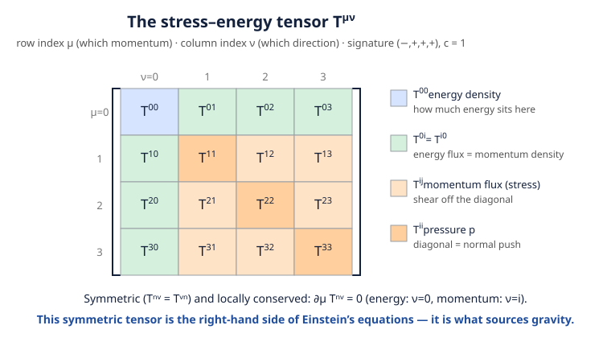

# Relativity (SR + GR) · Lesson 3.3: The stress–energy tensor

> ⏱ ~15 min · Module 3: Classical field theory · Builds on: [3.1 The field action and Euler–Lagrange](#/lesson/relativity/03-01-field-action-euler-lagrange.md), [3.2 Noether's theorem for fields](#/lesson/relativity/03-02-noether-fields.md), [1.5 Four-vectors and four-momentum](#/lesson/relativity/01-05-four-vectors-momentum.md) · Unlocks: 3.4 The relativistic scalar field, and — crucially — the right-hand side of Einstein's equations (Module 5)

## Why this matters

Every physics course so far kept energy and momentum as *bookkeeping totals*. Field theory demands more: energy and momentum are spread through space, they *flow*, and they push. The object that tracks all of that — how much energy sits here, which way it's flowing, and the pressure it exerts — is the **stress–energy tensor** $T^{\mu\nu}$. It is the single most important object in this course after the metric, because Einstein's equation is literally

$$G_{\mu\nu} = \frac{8\pi G}{c^4}\,T_{\mu\nu}:$$

curvature on the left, $T_{\mu\nu}$ on the right. **Matter tells spacetime how to curve through $T^{\mu\nu}$.** So before we can write down gravity, we have to build the thing that sources it — and it falls straight out of [3.2](#/lesson/relativity/03-02-noether-fields.md)'s Noether machinery applied to the symmetry every theory has: spacetime translation.

## The idea

You already know one conserved-current story. Charge has a *density* $\rho$ and a *current* $\mathbf J$, packaged into the four-current $J^\mu=(\rho c,\mathbf J)$, and conservation is $\partial_\mu J^\mu=0$ — "charge doesn't vanish, it flows." (Boss problem 2, back in Module 2.)

Now play the same game for **energy and momentum**. But there's a twist: energy-momentum is *itself* a four-vector $P^\nu$, not a single scalar like charge. So each of its four components needs its own density *and* its own current. Density + a 3-current, for each of 4 conserved quantities → a $4\times 4$ object. That object is $T^{\mu\nu}$:

$$T^{\mu\nu} = \text{the flux of the } \nu\text{-th component of four-momentum across a surface of constant } x^\mu.$$

In words: **$T^{\mu\nu}$ is the current of four-momentum.** Reading the first index as "which slice of spacetime" and the second as "which momentum component," the pieces sort themselves into a picture you already have physical names for — energy density, energy flux, pressure — and the conservation law $\partial_\mu T^{\mu\nu}=0$ is just "energy and momentum don't vanish, they flow." Where Noether gave us *one* conserved current per symmetry, spacetime-translation symmetry has *four* directions to translate in, so it hands us four currents at once — stacked into $T^{\mu\nu}$.

Throughout this lesson I set $c=1$ (I restore it at the end for the fluid and for Einstein's equation), and use the signature $(-,+,+,+)$ from Module 1.

## The formal version

**The physical (symmetric) stress–energy tensor and its components.** $T^{\mu\nu}$ is a symmetric rank-2 tensor, $T^{\mu\nu}=T^{\nu\mu}$. Split the indices into time ($0$) and space ($i=1,2,3$):

- $T^{00}$ = **energy density** (energy per unit volume sitting at a point).
- $T^{0i}$ = **energy flux** in direction $i$ (energy crossing a unit area per unit time). By symmetry $T^{0i}=T^{i0}$ = **momentum density** (density of the $i$-component of momentum). *These being equal is the statement that a flow of energy carries momentum* — the same fact as radiation pressure.
- $T^{ij}$ = **momentum flux**: the flow of $i$-momentum in direction $j$. This is exactly a **stress**. Its diagonal entries $T^{ii}$ are **pressures** (a normal push, $i$-momentum flowing in the $i$-direction); off-diagonal entries are shear stresses.

In words: one symmetric matrix holds energy, momentum, and every way they can move.

**Local conservation.** The defining law is

$$\boxed{\ \partial_\mu T^{\mu\nu}=0\ }\qquad(\text{four equations, one for each }\nu).$$

In words: take the four-divergence and you get zero — energy-momentum is locally conserved. Unpacking the $\nu=0$ equation, $\partial_0 T^{00}+\partial_i T^{i0}=0$, is a continuity equation $\partial_t(\text{energy density})+\nabla\cdot(\text{energy flux})=0$: **energy conservation**. The three $\nu=i$ equations, $\partial_0 T^{0i}+\partial_j T^{ji}=0$, say the momentum in a region changes only by the stress pushing across its boundary: **momentum conservation** (Newton's second law for a continuum).

**Where it comes from: the canonical (Noether) tensor.** [3.2](#/lesson/relativity/03-02-noether-fields.md) gave the Noether current for a continuous symmetry. Invariance under a *spacetime translation* $x^\mu\to x^\mu+a^\mu$ (the Lagrangian density $\mathcal L$ has no explicit dependence on position) is a four-parameter symmetry, and its four Noether currents are the rows of the **canonical stress–energy tensor**:

$$T^{\mu}{}_{\nu} = \frac{\partial\mathcal L}{\partial(\partial_\mu\phi)}\,\partial_\nu\phi \;-\; \delta^{\mu}{}_{\nu}\,\mathcal L .$$

In words: the conserved "charge" attached to translating in the $\nu$-direction is a component of four-momentum, and its current is $T^\mu{}_\nu$. Conservation reads $\partial_\mu T^\mu{}_\nu=0$, and the conserved charges are the total four-momentum $P_\nu=\int T^{0}{}_{\nu}\,d^3x$. The $\nu=0$ charge $P_0=\int T^{0}{}_{0}\,d^3x$ is the total energy, so **the energy density is $T^{0}{}_{0}$** — and this equals the Hamiltonian density $\mathcal H=\dfrac{\partial\mathcal L}{\partial\dot\phi}\dot\phi-\mathcal L$ you'd write from the Legendre transform. (Compare [analytical mechanics 2.3](#/lesson/analytical-mechanics/02-03-energy-and-hamiltonian.md): energy as the Noether charge of *time*-translation, now one slot of a bigger object.)

**Why it must be symmetrized.** The canonical $T^\mu{}_\nu$ is conserved, but for fields with spin (like electromagnetism) it comes out **not symmetric**, and it isn't even unique — you can add an identically-conserved "improvement" term without spoiling $\partial_\mu T^\mu{}_\nu=0$ or the total charges. The physically correct choice is the **symmetric** one (the **Belinfante–Rosenfeld** improvement), because that's the object that (i) couples to the symmetric metric $g_{\mu\nu}$ in Einstein's equations and (ii) serves as a consistent source of angular momentum. Written with both indices up, we fix its overall sign by demanding $T^{00}>0$ (positive energy density) — the same object you'd get from varying the matter action with respect to the metric, $T^{\mu\nu}=\dfrac{2}{\sqrt{-g}}\dfrac{\delta S_{\text{matter}}}{\delta g_{\mu\nu}}$ (Module 5). For a spinless **scalar field** there's nothing to fix: the canonical tensor is already symmetric.

**The perfect fluid — the workhorse.** A **perfect fluid** is matter with no shear stress and no heat conduction: in its own rest frame the stress is isotropic pressure, $T^{\mu\nu}=\mathrm{diag}(\rho,\,p,\,p,\,p)$, where $\rho$ is the energy density and $p$ the pressure. Boosting to a frame where the fluid moves with four-velocity $u^\mu$ (normalized $u^\mu u_\mu=-1$) gives the covariant form:

$$\boxed{\ T^{\mu\nu}=(\rho+p)\,u^{\mu}u^{\nu}+p\,\eta^{\mu\nu}\ }$$

In words: an energy-density piece carried along the flow ($u^\mu u^\nu$) plus an isotropic pressure piece ($\eta^{\mu\nu}$). This one tensor describes stars, gases, radiation, and the entire contents of the universe — it is the source term for cosmology ([astrophysics 6.1](#/lesson/astrophysics/06-01-expanding-universe-friedmann.md)) and for stellar structure. The **dust** limit $p=0$ (a cloud of non-interacting particles, no pressure) collapses it to

$$T^{\mu\nu}=\rho\,u^{\mu}u^{\nu},$$

the simplest matter there is — just energy density streaming along worldlines.

## Picture

The single symmetric matrix packages everything: the corner is energy density, the top row / left column is energy flux (= momentum density), and the inner $3\times3$ block is the stress, with pressure on its diagonal. Local conservation $\partial_\mu T^{\mu\nu}=0$ ties the rows together, and this whole object is what sits on the right of Einstein's equations.

## Worked examples

**Example 1 (mechanical — boosted dust exposes the components).** Take pressureless dust of rest-frame energy density $\rho_0$, so $T^{\mu\nu}=\rho_0\,u^\mu u^\nu$. Now view it from a frame where it streams along $x$ with speed $v$, so $u^\mu=\gamma(1,v,0,0)$ with $\gamma=(1-v^2)^{-1/2}$. Then:

$$T^{00}=\rho_0\,(u^0)^2=\gamma^2\rho_0,\qquad T^{0x}=\rho_0\,u^0u^x=\gamma^2\rho_0 v,\qquad T^{xx}=\rho_0\,(u^x)^2=\gamma^2\rho_0 v^2.$$

Read them off: $T^{00}=\gamma^2\rho_0$ — the energy density is boosted by *two* powers of $\gamma$ (one because each particle's energy grows by $\gamma$, one because length contraction packs them $\gamma$ times denser). $T^{0x}=\gamma^2\rho_0 v$ is the momentum density streaming past. $T^{xx}=\gamma^2\rho_0 v^2$ is a genuine **ram pressure** — moving dust pushes on a surface it slams into, even though it had zero pressure at rest. The components you "see" depend on the frame; the tensor is one object.

**Example 2 (why you'd care — the trace fixes the equation of state).** The **trace** $T\equiv T^{\mu}{}_{\mu}=\eta_{\mu\nu}T^{\mu\nu}$ is a Lorentz scalar (same in every frame). For the perfect fluid,

$$T=\eta_{\mu\nu}\big[(\rho+p)u^\mu u^\nu+p\,\eta^{\mu\nu}\big]=(\rho+p)\underbrace{(u^\mu u_\mu)}_{-1}+p\underbrace{\eta_{\mu\nu}\eta^{\mu\nu}}_{4}=-(\rho+p)+4p=3p-\rho.$$

This single number classifies matter:
- **Dust** ($p=0$): $T=-\rho$.
- **Radiation / a photon gas** ($p=\tfrac13\rho$): $T=0$ — **traceless**. This isn't a coincidence: the electromagnetic stress–energy tensor is traceless because Maxwell's theory has no length scale (photons are massless), which is exactly why radiation obeys $p=\rho/3$. You'll build that EM tensor in [3.6](#/lesson/relativity/03-06-em-lagrangian-stress-energy.md).
- **Vacuum energy / a cosmological constant** ($p=-\rho$): $T=-4\rho$ — negative pressure, the engine of accelerated expansion ([astrophysics 6.5](#/lesson/astrophysics/06-05-dark-energy-acceleration.md)).

One tensor, one scalar squeezed out of it, and you've sorted the matter content of the cosmos into eras. That is the leverage $T^{\mu\nu}$ buys.

## Watch out

- **You might think $T^{0i}$ (energy flux) and $T^{i0}$ (momentum density) are different quantities.** They're forced equal by the tensor's symmetry — a deep statement, not a triviality: *any* flow of energy is a density of momentum. It's why light hitting a surface exerts pressure. If your computed $T^{\mu\nu}$ isn't symmetric, you haven't finished (you still owe the Belinfante symmetrization).
- **You might blindly raise an index and expect signs to be obvious.** In $(-,+,+,+)$, index placement carries minus signs: the *canonical* tensor's energy density is the mixed component $T^{0}{}_{0}$, while the *symmetric physical* tensor's energy density is the all-upper $T^{00}$ — both equal the positive Hamiltonian density $\mathcal H$, but you should read each object off in its natural index placement rather than mechanically converting one into the other. When in doubt, the anchor is: **energy density is positive.**
- **You might think $\partial_\mu T^{\mu\nu}=0$ means energy is globally conserved, period.** It's a *local* law in flat spacetime. On a curved manifold it becomes $\nabla_\mu T^{\mu\nu}=0$ ([5.2](#/lesson/relativity/05-02-matter-curved-spacetime.md)), and the extra Christoffel terms mean energy can be exchanged with the gravitational field — in an expanding universe, radiation energy is *not* globally conserved. Local, always; global, only sometimes.

## One-liner

> The stress–energy tensor is the current of four-momentum: $T^{00}$ is energy density, $T^{0i}$ its flux (= momentum density), $T^{ij}$ the stress — one symmetric, locally conserved object ($\partial_\mu T^{\mu\nu}=0$) that is the entire right-hand side of Einstein's equations.

## Problems

**P1 (🟢)** A perfect fluid is at rest, with four-velocity $u^\mu=(1,0,0,0)$ (i.e. $c=1$). Starting from $T^{\mu\nu}=(\rho+p)u^\mu u^\nu+p\,\eta^{\mu\nu}$ with $\eta^{\mu\nu}=\mathrm{diag}(-1,1,1,1)$, write out all sixteen components explicitly and confirm $T^{00}=\rho$ (energy density) and $T^{11}=T^{22}=T^{33}=p$ (pressure), with everything else zero.

**P2 (🟡)** For the free real scalar field with Lagrangian density
$$\mathcal L=-\tfrac12\,\eta^{\mu\nu}\partial_\mu\phi\,\partial_\nu\phi-\tfrac12 m^2\phi^2\qquad(\text{signature }-\!+\!+\!+,\ c=1),$$
compute $\dfrac{\partial\mathcal L}{\partial(\partial_\mu\phi)}$, write down the canonical tensor $T^\mu{}_\nu$, and evaluate the energy density $T^{0}{}_{0}$. Show it equals $\tfrac12\dot\phi^2+\tfrac12|\nabla\phi|^2+\tfrac12 m^2\phi^2$ and say in words what the three terms are.

**P3 (🔴, optional)** The symmetric stress–energy tensor of that scalar field is $T^{\mu\nu}=\partial^\mu\phi\,\partial^\nu\phi+\eta^{\mu\nu}\mathcal L$. Using the field equation $\Box\phi=m^2\phi$ (where $\Box\equiv\partial_\mu\partial^\mu$), show directly that $\partial_\mu T^{\mu\nu}=0$. Then interpret the $\nu=0$ equation as a statement of energy conservation.

Solutions

**P1** At rest only $u^0=1$ is nonzero, so $u^\mu u^\nu$ has a single nonzero entry, $u^0u^0=1$ (the $00$ slot). Thus $(\rho+p)u^\mu u^\nu=(\rho+p)$ in the $00$ slot, zero elsewhere. Add $p\,\eta^{\mu\nu}=\mathrm{diag}(-p,p,p,p)$:

$$T^{00}=(\rho+p)+p(-1)=\rho,\qquad T^{11}=T^{22}=T^{33}=0+p\cdot(+1)=p,$$

and every off-diagonal entry, and every $T^{0i}$, is zero (no momentum, no flux for a fluid at rest). Explicitly

$$T^{\mu\nu}=\begin{pmatrix}\rho&0&0&0\\0&p&0&0\\0&0&p&0\\0&0&0&p\end{pmatrix}.$$

So $T^{00}=\rho$ is the energy density and the spatial diagonal is the isotropic pressure $p$, exactly as claimed. ✓

**P2** Differentiate $\mathcal L=-\tfrac12\eta^{\alpha\beta}\partial_\alpha\phi\,\partial_\beta\phi-\tfrac12 m^2\phi^2$ with respect to $\partial_\mu\phi$. Both factors in the kinetic term contribute, giving

$$\frac{\partial\mathcal L}{\partial(\partial_\mu\phi)}=-\tfrac12\eta^{\alpha\beta}\big(\delta^\mu{}_\alpha\partial_\beta\phi+\partial_\alpha\phi\,\delta^\mu{}_\beta\big)=-\eta^{\mu\beta}\partial_\beta\phi=-\partial^\mu\phi.$$

Hence the canonical tensor is

$$T^\mu{}_\nu=\frac{\partial\mathcal L}{\partial(\partial_\mu\phi)}\partial_\nu\phi-\delta^\mu{}_\nu\mathcal L=-\partial^\mu\phi\,\partial_\nu\phi-\delta^\mu{}_\nu\mathcal L.$$

The energy density is the $T^{0}{}_{0}$ component. Note $\partial^0\phi=\eta^{00}\partial_0\phi=-\partial_0\phi=-\dot\phi$, so $-\partial^0\phi\,\partial_0\phi=-(-\dot\phi)(\dot\phi)=+\dot\phi^2$:

$$T^{0}{}_{0}=-\partial^0\phi\,\partial_0\phi-\mathcal L=\dot\phi^2-\mathcal L.$$

Now expand $\mathcal L$ in components. Since $\eta^{\mu\nu}\partial_\mu\phi\,\partial_\nu\phi=-\dot\phi^2+|\nabla\phi|^2$,

$$\mathcal L=-\tfrac12(-\dot\phi^2+|\nabla\phi|^2)-\tfrac12 m^2\phi^2=\tfrac12\dot\phi^2-\tfrac12|\nabla\phi|^2-\tfrac12 m^2\phi^2.$$

Therefore

$$T^{0}{}_{0}=\dot\phi^2-\Big(\tfrac12\dot\phi^2-\tfrac12|\nabla\phi|^2-\tfrac12 m^2\phi^2\Big)=\tfrac12\dot\phi^2+\tfrac12|\nabla\phi|^2+\tfrac12 m^2\phi^2.\ \checkmark$$

The three terms are: $\tfrac12\dot\phi^2$ the **kinetic** energy density (the field changing in time), $\tfrac12|\nabla\phi|^2$ the **gradient** (spatial "tension") energy density, and $\tfrac12 m^2\phi^2$ the **potential/mass** energy density. It is positive, as an energy density must be. (This is the Hamiltonian density $\mathcal H$; the same $\mathcal H$ appears as $T^{00}$ of the symmetric tensor in P3.)

**P3** Compute the divergence of $T^{\mu\nu}=\partial^\mu\phi\,\partial^\nu\phi+\eta^{\mu\nu}\mathcal L$ term by term. First the product:

$$\partial_\mu\big(\partial^\mu\phi\,\partial^\nu\phi\big)=(\partial_\mu\partial^\mu\phi)\,\partial^\nu\phi+\partial^\mu\phi\,\partial_\mu\partial^\nu\phi=(\Box\phi)\,\partial^\nu\phi+\partial^\mu\phi\,\partial_\mu\partial^\nu\phi.$$

Next the $\mathcal L$ term. Since $\partial_\mu(\eta^{\mu\nu}\mathcal L)=\partial^\nu\mathcal L$, use the chain rule on $\mathcal L(\phi,\partial_\alpha\phi)$:

$$\partial^\nu\mathcal L=\frac{\partial\mathcal L}{\partial\phi}\partial^\nu\phi+\frac{\partial\mathcal L}{\partial(\partial_\alpha\phi)}\partial^\nu\partial_\alpha\phi=(-m^2\phi)\,\partial^\nu\phi+(-\partial^\alpha\phi)\,\partial^\nu\partial_\alpha\phi,$$

using $\partial\mathcal L/\partial\phi=-m^2\phi$ and $\partial\mathcal L/\partial(\partial_\alpha\phi)=-\partial^\alpha\phi$ from P2. The two derivative-of-derivative terms cancel: $\partial^\mu\phi\,\partial_\mu\partial^\nu\phi$ and $-\partial^\alpha\phi\,\partial^\nu\partial_\alpha\phi$ are the same sum with opposite sign (rename $\alpha\to\mu$ and use $\partial_\mu\partial^\nu=\partial^\nu\partial_\mu$). What survives:

$$\partial_\mu T^{\mu\nu}=(\Box\phi)\,\partial^\nu\phi-m^2\phi\,\partial^\nu\phi=(\Box\phi-m^2\phi)\,\partial^\nu\phi=0,$$

which vanishes **by the field equation** $\Box\phi=m^2\phi$. So conservation of $T^{\mu\nu}$ is not an extra assumption — it is a *consequence* of the equation of motion (which is Noether's theorem doing its job).

The $\nu=0$ component, written out, is $\partial_0 T^{00}+\partial_i T^{i0}=0$, i.e.

$$\frac{\partial}{\partial t}\underbrace{\Big(\tfrac12\dot\phi^2+\tfrac12|\nabla\phi|^2+\tfrac12 m^2\phi^2\Big)}_{\text{energy density }T^{00}}+\nabla\cdot\underbrace{(\text{energy flux }T^{i0})}_{\;}=0.$$

This is a continuity equation: the energy in any region changes only by energy flowing across its boundary. **Energy is locally conserved** — it can move, but it cannot appear or disappear.

## Flashback

**From Lesson 1.5 (Four-vectors and four-momentum):** The four-velocity has fixed magnitude $u^\mu u_\mu=-c^2$ (it's the normalization we used to build the perfect-fluid tensor). By differentiating this constraint with respect to proper time $\tau$, show that the four-acceleration $a^\mu\equiv du^\mu/d\tau$ is always **orthogonal** to the four-velocity: $a^\mu u_\mu=0$.

Solution

The magnitude $u^\mu u_\mu$ is a constant ($-c^2$), so its proper-time derivative is zero. Differentiate, using the product rule and the fact that $\eta_{\mu\nu}$ is constant:

$$0=\frac{d}{d\tau}\big(u^\mu u_\mu\big)=\frac{d}{d\tau}\big(\eta_{\mu\nu}u^\mu u^\nu\big)=\eta_{\mu\nu}\Big(\frac{du^\mu}{d\tau}u^\nu+u^\mu\frac{du^\nu}{d\tau}\Big)=2\,\eta_{\mu\nu}\,a^\mu u^\nu=2\,a^\mu u_\mu.$$

Hence $a^\mu u_\mu=0$: **four-acceleration is always orthogonal (in the Minkowski sense) to four-velocity.** Physically, a force can change the *direction* of a particle's four-velocity in spacetime but never its magnitude — consistent with $u^\mu u_\mu=-c^2$ holding at all times. (The same trick — differentiate a constant-magnitude constraint — reappears for parallel transport and geodesics in Module 4.)

## Connections

- **Backward:** this is [3.2](#/lesson/relativity/03-02-noether-fields.md)'s Noether current applied to spacetime-translation symmetry — four symmetries, four conserved currents, stacked into $T^{\mu\nu}$. The energy component $T^{0}{}_{0}$ is the field version of the Hamiltonian/energy that [analytical mechanics 2.3](#/lesson/analytical-mechanics/02-03-energy-and-hamiltonian.md) got from *time*-translation alone; here time- and space-translation merge just as energy and momentum did into $p^\mu$ in [1.5](#/lesson/relativity/01-05-four-vectors-momentum.md).
- **Forward:** [3.4](#/lesson/relativity/03-04-scalar-field.md) works the scalar field end to end (its $T^{\mu\nu}$ is P2–P3 here); [3.6](#/lesson/relativity/03-06-em-lagrangian-stress-energy.md) builds the electromagnetic $T^{\mu\nu}$ — traceless, with $T^{00}$ the field energy density and $T^{0i}$ the Poynting vector. Then [5.2](#/lesson/relativity/05-02-matter-curved-spacetime.md) promotes $\partial_\mu T^{\mu\nu}=0$ to $\nabla_\mu T^{\mu\nu}=0$ on a curved background, and [5.3](#/lesson/relativity/05-03-einstein-field-equations.md) sets $T^{\mu\nu}$ as the source in $G_{\mu\nu}=\tfrac{8\pi G}{c^4}T_{\mu\nu}$.
- **Sideways (astrophysics/cosmology):** the perfect fluid $T^{\mu\nu}=(\rho+p)u^\mu u^\nu+p\,\eta^{\mu\nu}$ is *the* input to the Friedmann equations of the expanding universe ([astrophysics 6.1](#/lesson/astrophysics/06-01-expanding-universe-friedmann.md)) and to stellar-structure equations; the trace-based equation-of-state sorting (Example 2) is how the dust / radiation / dark-energy eras are defined.
- **Sideways (electromagnetism):** the energy-density-and-flux structure here is the tensor generalization of the [Poynting energy balance](#/lesson/em-refresher/04-03-energy-poynting.md) — $u=\tfrac12(\varepsilon_0E^2+B^2/\mu_0)$ and $\mathbf S=\mathbf E\times\mathbf B/\mu_0$ are precisely $T^{00}$ and $T^{0i}$ of the EM field, unified and made manifestly covariant.
