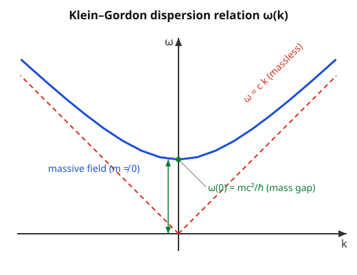

# Relativity (SR + GR) · Lesson 3.4: The relativistic scalar field

> ⏱ ~15 min · Module 3: Classical field theory · Builds on: [3.1 The action for fields and the Euler–Lagrange equations](#/lesson/relativity/03-01-field-action-euler-lagrange.md), [3.3 The stress–energy tensor](#/lesson/relativity/03-03-stress-energy-tensor.md), [1.5 Four-vectors and four-momentum](#/lesson/relativity/01-05-four-vectors-momentum.md) · Unlocks: 3.5 Electromagnetism as a field theory

## Why this matters

You now own the whole machine — a Lagrangian density, the field Euler–Lagrange equations ([3.1](#/lesson/relativity/03-01-field-action-euler-lagrange.md)), and the stress–energy tensor ([3.3](#/lesson/relativity/03-03-stress-energy-tensor.md)). This lesson runs the **simplest possible field** through it, end to end, so the recipe stands out cleanly before electromagnetism (a *vector* field, 3.5–3.6) and gravity (the *metric* field, Module 5) complicate the bookkeeping. The payoff is startling: extremize one Lorentz-invariant expression, and the field's ripples obey exactly the relativistic energy–momentum relation $E^2=(pc)^2+(mc^2)^2$ you built in [1.5](#/lesson/relativity/01-05-four-vectors-momentum.md). The waves of this field, in other words, *are* relativistic particles of mass $m$ — the single sentence on which all of quantum field theory is built. Everything here is the blueprint; the rest of physics just fills in more indices.

## The idea

Picture a mattress: an infinite grid of little masses, each tied to its neighbors by springs, and each *also* tied to its own rest position by a second spring. Pluck it and waves run across it. Three things store energy in any patch: how fast the patch is moving (time-variation), how much it's stretched relative to its neighbors (space-variation), and how far it's pulled from its rest position by that second spring (the amplitude itself).

A **relativistic scalar field** $\phi(t,\mathbf x)$ is that mattress, made Lorentz-invariant. "Scalar" means a single number at each spacetime point that every observer agrees on — the humblest field there is, no direction, no components. The neighbor-springs give the ordinary wave behavior; the second, self-anchoring spring is the **mass term**, and its stiffness is set by the particle mass $m$. Turn that spring off ($m=0$) and you get ordinary waves travelling at $c$. Turn it on and the waves acquire a **minimum frequency** — a field that can't ripple slower than a certain rate. That floor is the rest energy $mc^2$ in disguise.

The whole lesson is one move: **write a Lorentz-scalar Lagrangian density, extremize it, and read off the covariant wave equation.** Do that here, and you've done it for every field theory.

## The formal version

**Conventions.** Signature $(-,+,+,+)$ throughout, matching [1.5](#/lesson/relativity/01-05-four-vectors-momentum.md): $\eta_{\mu\nu}=\eta^{\mu\nu}=\mathrm{diag}(-1,+1,+1,+1)$, Greek indices run $0,1,2,3$ with $0$ the time slot, $\partial_\mu=\partial/\partial x^\mu$ so $\partial_0=\tfrac1c\partial_t$. I keep $c$ and $\hbar$ explicit (particle physicists set $\hbar=c=1$; I flag that below where it simplifies). Define the constant
$$\mu \equiv \frac{mc}{\hbar},$$
which has units of **inverse length** — it is $1/\bar\lambda_C$, the reciprocal of the (reduced) Compton wavelength $\bar\lambda_C=\hbar/mc$. That is the one length scale a mass injects into a field.

**The Klein–Gordon Lagrangian density.** For a real scalar field $\phi$,
$$\boxed{\ \mathcal L = -\tfrac12\,\eta^{\mu\nu}(\partial_\mu\phi)(\partial_\nu\phi) \;-\; \tfrac12\,\mu^2\phi^2\ } \qquad \mu=\frac{mc}{\hbar}.$$
In words: kinetic energy of the field's variation minus a potential quadratic in its amplitude. Unpacking the first term in $(-,+,+,+)$, $\eta^{\mu\nu}\partial_\mu\phi\,\partial_\nu\phi=-\tfrac1{c^2}(\partial_t\phi)^2+|\nabla\phi|^2$, so
$$\mathcal L=\underbrace{\tfrac1{2c^2}(\partial_t\phi)^2}_{\text{time-variation}}-\underbrace{\tfrac12|\nabla\phi|^2}_{\text{space-variation}}-\underbrace{\tfrac12\mu^2\phi^2}_{\text{mass}}.$$
This is exactly $T-V$ for the mattress: the leading sign is chosen so the *kinetic* (time-derivative) term is positive, which — we'll see — makes the energy positive. (Books using $(+,-,-,-)$ write the same physics as $\mathcal L=+\tfrac12\eta^{\mu\nu}\partial_\mu\phi\,\partial_\nu\phi-\tfrac12\mu^2\phi^2$; the overall sign of the kinetic term flips with the signature, the physics does not.)

**The field equation, from Euler–Lagrange.** The field Euler–Lagrange equation from [3.1](#/lesson/relativity/03-01-field-action-euler-lagrange.md) is
$$\partial_\mu\!\left(\frac{\partial\mathcal L}{\partial(\partial_\mu\phi)}\right)-\frac{\partial\mathcal L}{\partial\phi}=0.$$
Here $\dfrac{\partial\mathcal L}{\partial(\partial_\mu\phi)}=-\partial^\mu\phi$ and $\dfrac{\partial\mathcal L}{\partial\phi}=-\mu^2\phi$ (worked in full in P3), so the equation collapses to
$$\boxed{\ (\Box-\mu^2)\phi=0\ } \qquad \Box\equiv\partial_\mu\partial^\mu=\eta^{\mu\nu}\partial_\mu\partial_\nu=-\frac1{c^2}\partial_t^2+\nabla^2.$$
This is the **Klein–Gordon equation**, and $\Box$ (the *d'Alembertian*) is the Lorentz-invariant wave operator — the flat-spacetime version of the Laplacian, with the one crucial minus sign on the time part. In words: *the mass term is the only thing standing between this and the ordinary wave equation.* (A $(+,-,-,-)$ book writes this same equation as $(\Box+\mu^2)\phi=0$, because there $\Box=+\tfrac1{c^2}\partial_t^2-\nabla^2$ carries the opposite overall sign. Read the sign of $\Box$ before trusting the sign of the mass term — the dispersion relation below is the convention-free referee.)

**Plane waves and the dispersion relation.** Try $\phi\propto e^{i(\mathbf k\cdot\mathbf x-\omega t)}$. Then $\partial_t^2\to-\omega^2$ and $\nabla^2\to-|\mathbf k|^2$, so $\Box\phi=(\tfrac{\omega^2}{c^2}-k^2)\phi$ (writing $k=|\mathbf k|$), and the Klein–Gordon equation demands $\tfrac{\omega^2}{c^2}-k^2-\mu^2=0$, i.e.
$$\boxed{\ \omega^2=c^2k^2+\left(\frac{mc^2}{\hbar}\right)^2\ }$$
using $c^2\mu^2=(mc^2/\hbar)^2$. In words: a plane wave solves Klein–Gordon **only** if its frequency and wavevector lie on this hyperbola. At $k=0$ the field still oscillates, at the floor frequency $\omega_0=\mu c=mc^2/\hbar$ — the **mass gap**.

**The bridge to Module 1.** Multiply the dispersion relation by $\hbar^2$ and use the quantum relations $E=\hbar\omega$, $\mathbf p=\hbar\mathbf k$:
$$\hbar^2\omega^2=c^2\hbar^2k^2+(mc^2)^2\;\Longrightarrow\;\boxed{\,E^2=(pc)^2+(mc^2)^2\,}.$$
This is *exactly* the energy–momentum relation of [1.5](#/lesson/relativity/01-05-four-vectors-momentum.md). The quanta of this classical field are relativistic particles of mass $m$: the mass gap $\hbar\omega_0=mc^2$ is their rest energy. This identification — *field ripples are particles* — is the doorway to quantum field theory, which this course builds the classical scaffolding for but does not enter.

**The massless case.** Set $m=0$ (so $\mu=0$): the equation becomes $\Box\phi=0$, the ordinary wave equation $\tfrac1{c^2}\partial_t^2\phi=\nabla^2\phi$, with dispersion $\omega=ck$. No gap, no scale: massless field, waves at exactly $c$, every wavelength travelling at the same speed. This is the equation the electromagnetic potential will obey in 3.5 — the photon is massless for exactly this reason.

**Its energy.** The stress–energy tensor $T^{\mu\nu}$ of [3.3](#/lesson/relativity/03-03-stress-energy-tensor.md), evaluated for this Lagrangian, has energy density (its time–time component, equivalently the Hamiltonian density $\pi\dot\phi-\mathcal L$ with $\pi=\partial\mathcal L/\partial\dot\phi=\dot\phi/c^2$)
$$\mathcal E=T^{00}=\tfrac1{2c^2}(\partial_t\phi)^2+\tfrac12|\nabla\phi|^2+\tfrac12\left(\frac{mc}{\hbar}\right)^2\phi^2.$$
In words: energy density is the sum of the three mattress springs — motion, stretch, and amplitude — each manifestly non-negative. That positivity is *why* we chose the leading sign of $\mathcal L$: flip it and the energy would be unbounded below, and no stable field theory could stand on it.

## Picture

Every allowed plane-wave mode of the massive field lives on the blue hyperbola. It never dips below the **mass gap** $\omega_0=mc^2/\hbar$ at $k=0$ — the field cannot ripple slower than that, and that floor is the rest energy. For large $k$ the hyperbola hugs the red **light-line** $\omega=ck$: at high momentum the mass becomes negligible and the quanta move ultra-relativistically, just as $E\approx pc$ when $pc\gg mc^2$. A massless field *is* the red line — no gap, waves at $c$ for every wavelength.

## Worked examples

**Example 1 (mechanical — read the dispersion off a wave).** Does the real field $\phi(t,x)=A\cos(kx-\omega t)$ (one spatial dimension) solve the Klein–Gordon equation, and under what condition?

Compute the two derivatives:
$$\partial_t^2\phi=-\omega^2\,A\cos(kx-\omega t)=-\omega^2\phi,\qquad \partial_x^2\phi=-k^2\,A\cos(kx-\omega t)=-k^2\phi.$$
Substitute into $(\Box-\mu^2)\phi=\big(-\tfrac1{c^2}\partial_t^2+\partial_x^2-\mu^2\big)\phi$:
$$\left(\frac{\omega^2}{c^2}-k^2-\mu^2\right)\phi=0.$$
Since $\phi$ is not identically zero, the bracket must vanish: $\omega^2=c^2k^2+c^2\mu^2=c^2k^2+(mc^2/\hbar)^2$. So the cosine is a solution **iff** its $(\omega,k)$ sits on the hyperbola. The mass term is the lone constant $\mu^2$ that lifts the whole curve off the origin.

**Example 2 (why you'd care — mass is short range).** What does the mass term *do* physically? Look for a static ($\partial_t\phi=0$), spherically symmetric field around a point source. The equation reduces to $(\nabla^2-\mu^2)\phi=0$ away from the origin, and in spherical coordinates the decaying solution is
$$\phi(r)\propto\frac{e^{-\mu r}}{r}=\frac{e^{-r/\bar\lambda_C}}{r},\qquad \bar\lambda_C=\frac{\hbar}{mc}.$$
This is the **Yukawa potential**: the field of a massive scalar dies off exponentially, with range set by the Compton wavelength $\hbar/mc$. Heavier quantum → shorter range. Set $m=0$ and the exponential becomes $1$, leaving the familiar $1/r$ — the massless, *infinite*-range Coulomb/Newton law. This is not a toy: Yukawa predicted the pion from the ~1.4 fm range of the nuclear force, reading off $mc^2=\hbar c/\bar\lambda_C\approx(197\ \text{MeV·fm})/(1.4\ \text{fm})\approx140$ MeV — the pion's mass, confirmed years later. The mass term you added to a Lagrangian is measurable as the *reach* of a force.

## Watch out

- **The sign of the mass term is a signature artifact, not physics.** In our $(-,+,+,+)$ convention the equation is $(\Box-\mu^2)\phi=0$ with $\Box=-\tfrac1{c^2}\partial_t^2+\nabla^2$; most QFT texts use $(+,-,-,-)$ and write $(\Box+\mu^2)\phi=0$ with the opposite-signed $\Box$. These are the *same equation*. Don't memorize the $\pm$ — reconstruct it by demanding the dispersion relation come out $\omega^2=c^2k^2+(mc^2/\hbar)^2$, which is convention-free.
- **$\mu=mc/\hbar$ is an inverse length, not the mass.** The coefficient in the Lagrangian is $\mu^2=(mc/\hbar)^2$, with units $1/\text{length}^2$; the particle mass is $m$, recovered only after restoring $\hbar$ and $c$ (or reading it off the mass gap $\hbar\omega_0=mc^2$). Setting $\hbar=c=1$ collapses $\mu\to m$ and hides this — convenient, but keep the units straight when you translate back.
- **A massive field's phase velocity exceeds $c$ — and that's fine.** From the hyperbola, $v_{\text{phase}}=\omega/k=c\sqrt{1+(\mu/k)^2}>c$. No signal rides it; the physical, energy-carrying speed is the *group* velocity $v_g=d\omega/dk=c^2k/\omega<c$, which (via $E=\hbar\omega$, $p=\hbar k$) equals $pc^2/E$ — precisely the particle's velocity from [1.5](#/lesson/relativity/01-05-four-vectors-momentum.md). Superluminal phase, subluminal signal: no paradox.

## One-liner

> Write a Lorentz-scalar Lagrangian, extremize it, and out falls a covariant wave equation whose plane waves obey $E^2=(pc)^2+(mc^2)^2$ — the field's ripples *are* relativistic particles of mass $m$.

## Problems

**P1 (🟢)** Show that the complex plane wave $\phi=A\,e^{i(kx-\omega t)}$ (one spatial dimension, constant amplitude $A$) satisfies the Klein–Gordon equation $(\Box-\mu^2)\phi=0$ **if and only if** $\omega^2=c^2k^2+(mc^2/\hbar)^2$, where $\mu=mc/\hbar$.

**P2 (🟡)** Take the massless limit $m\to0$.
(a) Show the Klein–Gordon equation becomes $\Box\phi=0$, i.e. $\tfrac1{c^2}\partial_t^2\phi=\partial_x^2\phi$ in one spatial dimension.
(b) Show that *any* twice-differentiable profile $\phi(t,x)=f(x-ct)$ solves it, and explain why this means the disturbance travels rigidly at exactly speed $c$. What does the dispersion relation say about the speed of every wavelength?

**P3 (🔴, optional)** Derive the Klein–Gordon equation from the Lagrangian, then bridge to Module 1.
(a) Starting from $\mathcal L=-\tfrac12\eta^{\mu\nu}(\partial_\mu\phi)(\partial_\nu\phi)-\tfrac12\mu^2\phi^2$, compute $\dfrac{\partial\mathcal L}{\partial\phi}$ and $\dfrac{\partial\mathcal L}{\partial(\partial_\mu\phi)}$, and assemble the field Euler–Lagrange equation to obtain $(\Box-\mu^2)\phi=0$.
(b) Using $E=\hbar\omega$ and $\mathbf p=\hbar\mathbf k$, turn the dispersion relation into $E^2=(pc)^2+(mc^2)^2$, and confirm it matches [1.5](#/lesson/relativity/01-05-four-vectors-momentum.md).

Solutions

**P1** With $\phi=A\,e^{i(kx-\omega t)}$, differentiation just pulls down factors: $\partial_t\phi=-i\omega\,\phi$, so $\partial_t^2\phi=(-i\omega)^2\phi=-\omega^2\phi$; likewise $\partial_x\phi=ik\,\phi$, so $\partial_x^2\phi=-k^2\phi$. Then
$$(\Box-\mu^2)\phi=\left(-\frac1{c^2}\partial_t^2+\partial_x^2-\mu^2\right)\phi=\left(\frac{\omega^2}{c^2}-k^2-\mu^2\right)\phi.$$
Because $A\,e^{i(kx-\omega t)}$ never vanishes, the left side is zero **iff** the bracket is zero: $\dfrac{\omega^2}{c^2}=k^2+\mu^2$. Multiply by $c^2$ and use $c^2\mu^2=(mc^2/\hbar)^2$:
$$\omega^2=c^2k^2+\left(\frac{mc^2}{\hbar}\right)^2.\qquad\checkmark$$
The "if and only if" is exact: solutions are precisely the modes on the hyperbola.

**P2** (a) Set $m=0\Rightarrow\mu=0$, so $(\Box-\mu^2)\phi=\Box\phi=0$. In one spatial dimension $\Box=-\tfrac1{c^2}\partial_t^2+\partial_x^2$, giving $-\tfrac1{c^2}\partial_t^2\phi+\partial_x^2\phi=0$, i.e. $\tfrac1{c^2}\partial_t^2\phi=\partial_x^2\phi$ — the classical wave equation.

(b) Let $u=x-ct$ and $\phi=f(u)$. By the chain rule $\partial_x\phi=f'(u)$ and $\partial_x^2\phi=f''(u)$; while $\partial_t\phi=-c\,f'(u)$ and $\partial_t^2\phi=c^2 f''(u)$. Substitute:
$$\frac1{c^2}\partial_t^2\phi=\frac1{c^2}\,c^2 f''(u)=f''(u)=\partial_x^2\phi.\qquad\checkmark$$
So any profile $f$ solves it. Since $\phi$ depends on $x$ and $t$ only through $u=x-ct$, the graph at time $t$ is the graph at $t=0$ shifted right by $ct$: the shape is rigid and its position advances at speed $c$, whatever the shape. The dispersion relation $\omega=ck$ says the same thing spectrally: phase velocity $\omega/k=c$ and group velocity $d\omega/dk=c$ for *every* $k$ — massless waves are non-dispersive, all wavelengths at exactly $c$.

**P3** (a) The mass term depends on $\phi$, the kinetic term on $\partial_\mu\phi$; treat these as independent slots.
$$\frac{\partial\mathcal L}{\partial\phi}=\frac{\partial}{\partial\phi}\!\left(-\tfrac12\mu^2\phi^2\right)=-\mu^2\phi.$$
For the derivative slot, differentiate the kinetic term, remembering it contains two factors of the derivative field:
$$\frac{\partial\mathcal L}{\partial(\partial_\alpha\phi)}=-\tfrac12\,\eta^{\mu\nu}\frac{\partial}{\partial(\partial_\alpha\phi)}\big[(\partial_\mu\phi)(\partial_\nu\phi)\big]=-\tfrac12\,\eta^{\mu\nu}\big(\delta^\alpha_\mu\,\partial_\nu\phi+\partial_\mu\phi\,\delta^\alpha_\nu\big)=-\tfrac12\big(\eta^{\alpha\nu}\partial_\nu\phi+\eta^{\mu\alpha}\partial_\mu\phi\big)=-\eta^{\alpha\nu}\partial_\nu\phi=-\partial^\alpha\phi,$$
the two terms being equal by symmetry of $\eta$. Assemble the field Euler–Lagrange equation $\partial_\alpha\!\big(\partial\mathcal L/\partial(\partial_\alpha\phi)\big)-\partial\mathcal L/\partial\phi=0$:
$$\partial_\alpha(-\partial^\alpha\phi)-(-\mu^2\phi)=0\;\Longrightarrow\;-\partial_\alpha\partial^\alpha\phi+\mu^2\phi=0\;\Longrightarrow\;\partial_\alpha\partial^\alpha\phi-\mu^2\phi=0.$$
Since $\Box=\partial_\alpha\partial^\alpha$, this is $(\Box-\mu^2)\phi=0$. $\checkmark$ Notice the recipe never used anything special about $\phi$: *write a scalar $\mathcal L$, apply the field Euler–Lagrange equation, get a covariant wave equation.* That is the whole blueprint.

(b) A plane-wave mode has $\omega^2=c^2k^2+(mc^2/\hbar)^2$. Multiply through by $\hbar^2$:
$$\hbar^2\omega^2=c^2\hbar^2k^2+(mc^2)^2.$$
Substitute $E=\hbar\omega$ and $p=\hbar k$ (so $\hbar^2\omega^2=E^2$, $\hbar^2k^2=p^2$):
$$E^2=(pc)^2+(mc^2)^2.$$
This is identical to the energy–momentum relation derived in [1.5](#/lesson/relativity/01-05-four-vectors-momentum.md) as the invariant length of the four-momentum, $p\cdot p=-m^2c^2$. The classical field's dispersion relation and the relativistic particle's mass-shell condition are the same equation — which is the precise sense in which the field's quanta are mass-$m$ particles.

## Flashback

**From Lesson 1.5 (Four-vectors and four-momentum):** A particle's total energy equals twice its rest energy, $E=2mc^2$. Using the energy–momentum relation $E^2=(pc)^2+(mc^2)^2$ that this lesson just re-derived from a field, find its momentum $pc$ (in units of $mc^2$) and its speed $\beta=v/c$.

Solution

From $E^2=(pc)^2+(mc^2)^2$ with $E=2mc^2$:
$$(2mc^2)^2=(pc)^2+(mc^2)^2\;\Longrightarrow\;(pc)^2=4(mc^2)^2-(mc^2)^2=3(mc^2)^2\;\Longrightarrow\;pc=\sqrt3\,mc^2.$$
For speed, use $\beta=pc/E$ (since $E=\gamma mc^2$ and $pc=\gamma\beta mc^2$, their ratio is $\beta$):
$$\beta=\frac{pc}{E}=\frac{\sqrt3\,mc^2}{2mc^2}=\frac{\sqrt3}{2}\approx0.866.$$
Cross-check via $\gamma$: $E=2mc^2$ means $\gamma=2$, so $\beta=\sqrt{1-1/\gamma^2}=\sqrt{1-\tfrac14}=\tfrac{\sqrt3}{2}$. $\checkmark$ The field's mass gap ($\hbar\omega_0=mc^2$) is exactly this particle's rest energy — the floor it can never go below.

## Connections

- **Backward:** this is [3.1](#/lesson/relativity/03-01-field-action-euler-lagrange.md)'s field Euler–Lagrange machine and [3.3](#/lesson/relativity/03-03-stress-energy-tensor.md)'s stress–energy tensor run on the smallest possible example, and its dispersion relation is [1.5](#/lesson/relativity/01-05-four-vectors-momentum.md)'s $E^2=(pc)^2+(mc^2)^2$ resurfacing as a wave condition. The d'Alembertian $\Box$ is the Minkowski metric $\eta^{\mu\nu}$ from Module 2 contracted onto two derivatives.
- **Forward:** [3.5](#/lesson/relativity/03-05-em-field-theory.md)–[3.6](#/lesson/relativity/03-06-em-lagrangian-stress-energy.md) repeat this exact recipe for the electromagnetic *vector* field $A^\mu$ (its massless wave equation is $\Box\phi=0$ with extra indices), and the Einstein–Hilbert action of [5.4](#/lesson/relativity/05-04-einstein-hilbert-action.md) runs it once more on the *metric* field to get gravity. The particle interpretation of the field's quanta is the first step of quantum field theory (built on, not entered, in this course).
- **Sideways (analytical mechanics):** the field action and its Euler–Lagrange equation are the continuum limit of [Lagrangian mechanics for fields](#/lesson/analytical-mechanics/04-05-classical-fields.md) — the mattress made literal, particle coordinates $q_i(t)$ replaced by a field value $\phi(t,\mathbf x)$ at every point.
- **Sideways (quantum mechanics):** Klein–Gordon was the first *relativistic* wave equation, an attempt to fix the non-relativistic Schrödinger equation of [why quantum](#/lesson/quantum-mechanics/01-01-why-quantum.md); the substitutions $E\to i\hbar\partial_t$, $\mathbf p\to-i\hbar\nabla$ turn $E^2=(pc)^2+(mc^2)^2$ directly into $(\Box-\mu^2)\phi=0$. Its negative-frequency solutions ($\omega=-\sqrt{\dots}$) are what forced physicists toward antiparticles and, ultimately, field quantization.
