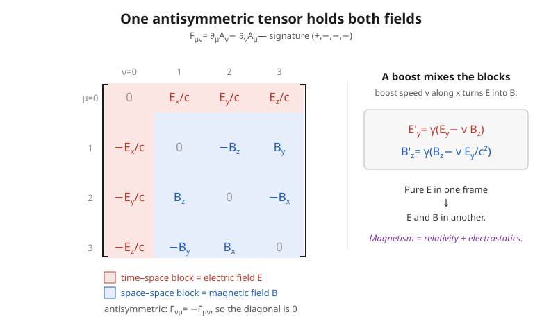

# Relativity (SR + GR) · Lesson 3.5: Electromagnetism as a field theory

> ⏱ ~15 min · Module 3: Classical field theory · Builds on: [3.4 The relativistic scalar field](#/lesson/relativity/03-04-scalar-field.md), [2.3 Tensors and tensor algebra](#/lesson/relativity/02-03-tensors-algebra.md), [em-refresher 4.1 Maxwell's equations](#/lesson/em-refresher/04-01-maxwells-equations.md) · Unlocks: 3.6 (the EM Lagrangian $-\tfrac14 F_{\mu\nu}F^{\mu\nu}$ and the electromagnetic stress–energy tensor that sources gravity)

## Why this matters

You already know Maxwell's four equations ([em-refresher 4.1](#/lesson/em-refresher/04-01-maxwells-equations.md)). Written with $\mathbf E$, $\mathbf B$, $\nabla\cdot$, and $\nabla\times$, they look like four separate facts about two separate fields — and their form is tangled up with a choice of frame. This lesson does something startling: it collapses all four into **two** equations, reveals that $\mathbf E$ and $\mathbf B$ are not two fields but **two faces of one object** (a boost turns one into the other), and shows that two of Maxwell's laws hold *automatically*, for free, as an identity. The payoff is not just elegance. Electromagnetism written this way is **the** model classical field theory: its structure — a potential, a field strength, gauge invariance, a conserved current — is the exact template on which the entire Standard Model (the strong and electroweak forces) is built. Master this one example and you have the grammar of modern physics.

## The idea

Here is the whole story in one breath. Maxwell's equations already *told* you $\mathbf E$ and $\mathbf B$ are entangled: a changing $\mathbf B$ makes a curling $\mathbf E$, and a changing $\mathbf E$ makes a curling $\mathbf B$. Special relativity finishes the thought. Since different observers disagree about what's "changing in time" versus "varying in space," they must also disagree about how much of a field is "electric" versus "magnetic." A charge sitting still in your frame makes a pure electric field. Run past it and that same charge is now a *current* — and currents make magnetic fields. So whether there's a $\mathbf B$ field at all depends on who's looking. **$\mathbf E$ and $\mathbf B$ can't be separate physical things; they must be components of one spacetime object that reshuffles its parts under a boost.**

That object is the **field-strength tensor** $F_{\mu\nu}$ — an antisymmetric $4\times4$ array. Its time–space entries are the electric field; its space–space entries are the magnetic field. A Lorentz boost rotates the array, spilling electric components into magnetic ones and back. And $F$ is itself built from a still more basic thing, the **four-potential** $A^\mu$, which packages the scalar potential $\phi$ and the vector potential $\mathbf A$ into a single four-vector. Everything — the fields, all four Maxwell equations, charge conservation — flows from that one potential.

## The formal version

**Signature.** This lesson uses the course-standard "mostly-plus" metric $\eta_{\mu\nu}=\mathrm{diag}(-1,+1,+1,+1)$ (the same convention as the geometry of Modules 4–6, and as sibling lessons [2.4](#/lesson/relativity/02-04-invariants-levi-civita.md) and [3.6](#/lesson/relativity/03-06-em-lagrangian-stress-energy.md)). Greek indices run $0,1,2,3$; Latin $i,j,k$ run over space $1,2,3$; repeated indices are summed. Coordinates $x^\mu=(ct,x,y,z)$, so $\partial_\mu \equiv \partial/\partial x^\mu = (\tfrac1c\partial_t,\ \nabla)$. As is standard, we fix the sign convention of the field-strength components (below) so that the covariant Maxwell equations come out with textbook signs — many field-theory books instead use the "mostly-minus" metric $\mathrm{diag}(+1,-1,-1,-1)$, which moves signs of bookkeeping quantities but leaves every physical result identical.

**The four-potential.** Recall from em-refresher that $\mathbf E=-\nabla\phi-\partial_t\mathbf A$ and $\mathbf B=\nabla\times\mathbf A$, where $\phi$ is the scalar and $\mathbf A$ the vector potential. Package them:

$$A^\mu = \left(\frac{\phi}{c},\ \mathbf A\right), \qquad A_\mu = \eta_{\mu\nu}A^\nu = \left(-\frac{\phi}{c},\ \mathbf A\right).$$

In words: the two potentials of electromagnetism are the time and space parts of a single four-vector.

**The field-strength tensor.** Define

$$\boxed{F_{\mu\nu} = \partial_\mu A_\nu - \partial_\nu A_\mu.}$$

In words: $F$ is the four-dimensional "curl" of the four-potential. It is manifestly **antisymmetric** — swapping the two indices flips the sign, $F_{\nu\mu}=-F_{\mu\nu}$ — so its diagonal is zero and it has only $6$ independent components. Those six are exactly the three components of $\mathbf E$ and the three of $\mathbf B$. Working out the entries from the potentials (Worked example 1):

$$F_{0i} = \frac{E_i}{c}, \qquad F_{ij} = -\epsilon_{ijk}B_k,$$

where $\epsilon_{ijk}$ is the totally antisymmetric Levi-Civita symbol from [2.4](#/lesson/relativity/02-04-invariants-levi-civita.md). Written as a matrix ($\mu$ labels rows, $\nu$ columns):

$$F_{\mu\nu} = \begin{pmatrix} 0 & E_x/c & E_y/c & E_z/c \\ -E_x/c & 0 & -B_z & B_y \\ -E_y/c & B_z & 0 & -B_x \\ -E_z/c & -B_y & B_x & 0 \end{pmatrix}.$$

In words: **the electric field lives in the time–space edge of the tensor, the magnetic field in the space–space core.** Raising an index with $\eta$ costs a minus sign for each time index and none for spatial indices (mostly-plus: $\eta^{00}=-1$, $\eta^{ii}=+1$), so $F^{0i}=-E_i/c$, $F^{i0}=+E_i/c$, and $F^{ij}=-\epsilon_{ijk}B_k$.

**The four-current.** Package charge density $\rho$ and current density $\mathbf J$:

$$J^\mu = (c\rho,\ \mathbf J).$$

In words: charge and its flow are the time and space parts of one four-vector (as you showed in Boss problem 2 of Module 2).

**Maxwell's equations, covariant form.** All four laws become two tensor equations.

*Inhomogeneous pair* (the ones with sources — Gauss + Ampère–Maxwell):

$$\boxed{\partial_\mu F^{\mu\nu} = \mu_0 J^\nu.}$$

In words: the divergence of the field tensor equals the current (times $\mu_0$). Setting $\nu=0$ gives Gauss's law; $\nu=i$ gives the Ampère–Maxwell law (Worked example 2, Problem 2).

*Homogeneous pair* (no sources — Faraday + no monopoles), the **Bianchi identity**:

$$\boxed{\partial_\lambda F_{\mu\nu} + \partial_\mu F_{\nu\lambda} + \partial_\nu F_{\lambda\mu} = 0,}$$

often abbreviated $\partial_{[\lambda}F_{\mu\nu]}=0$ (square brackets = total antisymmetrization). In words: the cyclic sum of derivatives of $F$ vanishes. The remarkable part: **this holds automatically**, as an identity, whenever $F=dA$. Substituting $F_{\mu\nu}=\partial_\mu A_\nu-\partial_\nu A_\mu$, the six terms cancel in pairs because partial derivatives commute. So Faraday's law and "no magnetic monopoles" are not extra physics — they are the price of admitting a potential $A^\mu$ exists at all. (The all-spatial choice $\lambda\mu\nu=123$ gives $\nabla\cdot\mathbf B=0$; any choice with one time index gives a component of $\nabla\times\mathbf E=-\partial_t\mathbf B$.)

**Gauge invariance.** The potential is not unique. Shift it by the gradient of any scalar field $\chi(x)$:

$$A_\mu \ \to\ A_\mu + \partial_\mu\chi.$$

Then $F_{\mu\nu}\to F_{\mu\nu}+(\partial_\mu\partial_\nu-\partial_\nu\partial_\mu)\chi = F_{\mu\nu}$ — **unchanged**, because mixed partials commute. In words: many different four-potentials give the identical fields and identical physics; the freedom to choose among them is called **gauge invariance**. This looks like a bookkeeping redundancy, but it is the deepest idea here: *demanding* invariance under a (local, position-dependent) symmetry like this is precisely what generates the forces of the Standard Model. Electromagnetism is the prototype **gauge theory**.

**Charge conservation for free.** Because $F^{\mu\nu}$ is antisymmetric and $\partial_\mu\partial_\nu$ is symmetric, contracting them gives zero: $\partial_\nu\partial_\mu F^{\mu\nu}=0$. Apply $\partial_\nu$ to the inhomogeneous equation and this forces $\mu_0\,\partial_\nu J^\nu=0$, i.e.

$$\partial_\mu J^\mu = \partial_t\rho + \nabla\cdot\mathbf J = 0.$$

In words: **conservation of charge is not an assumption — it is a mathematical consequence of the antisymmetry of $F$** (Problem 3). This is exactly the continuity equation you met as Boss problem 2 in Module 2.

## Picture

## Worked examples

**Example 1 (mechanical — the components ARE the fields).** Extract the space–space entry $F_{12}$ from the potentials, and see how $\mathbf E$ and $\mathbf B$ are read off the tensor.

Space–space entry, with the mostly-plus lowering $A_i=A_x$ (spatial index unchanged):
$$F_{12} = \partial_1 A_2 - \partial_2 A_1 = \partial_x A_y - \partial_y A_x = (\nabla\times\mathbf A)_z = B_z.$$
This is the $z$-component of the magnetic field: the space–space block of $F$ **is** $\mathbf B$. (The matrix convention $F_{ij}=-\epsilon_{ijk}B_k$ records this component with an overall sign chosen so the source equation below carries textbook signs — here $-\epsilon_{123}B_3=-B_z$; the physical field is the same, only its bookkeeping label carries the sign.)

The electric field is likewise the time–space block: the identification $E_i = c\,F^{i0}$ (equivalently the top row/column of the matrix) reproduces $\mathbf E = -\nabla\phi - \partial_t\mathbf A$, and this is the sign choice that makes $\partial_\mu F^{\mu\nu}=\mu_0 J^\nu$ come out as Gauss + Ampère below (Problem 2). The electric and magnetic fields are not *related to* the tensor's components — they **are** its components; a boost simply reshuffles which block is which.

**Example 2 (why you'd care — magnetism is relativity in disguise).** A single point charge sits at rest. In its rest frame the field is pure Coulomb: some $\mathbf E$, and $\mathbf B=\mathbf 0$. Now view it from a frame gliding past at speed $v$ along $x$. The fields in the new frame follow from boosting the tensor $F$; component-by-component this reads (for the transverse pieces):

$$B_z' = \gamma\!\left(B_z - \frac{v}{c^2}E_y\right) = -\gamma\,\frac{v}{c^2}E_y \neq 0.$$

A magnetic field has **appeared** out of a purely electric one. Physically: in the moving frame the charge is in motion, i.e. it is a current, and currents make magnetic fields. This is the whole content of magnetism — **the magnetic field of a moving charge is just its electric field, seen by an observer for whom the charge is moving.** $\mathbf E$ and $\mathbf B$ trade places under a boost precisely because they are two blocks of one tensor. (The wire-and-charge "relativistic origin of magnetism" argument is this statement made concrete.)

## Watch out

- **You might think $\mathbf E$ and $\mathbf B$ are independent fields that happen to interact.** They are components of a *single* tensor $F_{\mu\nu}$. "How much E, how much B" is frame-dependent, like "how much of this vector points along my chosen $x$-axis." The boost is a rotation in spacetime that reshuffles the components.
- **You might think the two homogeneous Maxwell equations are separate empirical laws.** Once you accept that a potential $A^\mu$ exists (that $F=dA$), Faraday's law and $\nabla\cdot\mathbf B=0$ are *automatic identities* — they carry no new physical information. Only the inhomogeneous pair $\partial_\mu F^{\mu\nu}=\mu_0 J^\nu$ contains dynamics.
- **You might think the gauge freedom $A_\mu\to A_\mu+\partial_\mu\chi$ is a nuisance to be eliminated.** It is the central feature, not a bug. "Physics is unchanged under a local symmetry" is the design principle that *builds* the fundamental forces — electromagnetism is the simplest instance (the gauge group $U(1)$).
- **Signature sign-traps.** The exact signs in the $F_{\mu\nu}$ matrix (e.g. whether $F_{0i}$ is $+E_i/c$ or $-E_i/c$) depend on the metric signature and on whether you write $A^\mu=(\phi/c,\mathbf A)$ or with a lowered index. Different books differ. What is convention-independent: $\mathbf E$ sits in the time–space block, $\mathbf B$ in the space–space block, $F$ is antisymmetric, and the physical fields agree. Always state your signature (this lesson, and the whole course: mostly-plus $(-,+,+,+)$; many particle-physics texts use mostly-minus instead) and stay consistent.

## One-liner

> Electromagnetism is one antisymmetric tensor $F_{\mu\nu}=\partial_\mu A_\nu-\partial_\nu A_\mu$ built from one potential: $\mathbf E$ and $\mathbf B$ are its time–space and space–space blocks that mix under a boost, two Maxwell equations are the identity $F=dA$, the other two are $\partial_\mu F^{\mu\nu}=\mu_0 J^\nu$, and charge conservation falls out free from antisymmetry.

## Problems

**P1 (🟢)** Write out the full $4\times4$ matrix $F_{\mu\nu}$ in terms of the components of $\mathbf E$ and $\mathbf B$ (mostly-plus signature, with the convention $F_{0i}=E_i/c$, $F_{ij}=-\epsilon_{ijk}B_k$). State how many independent components a general antisymmetric $4\times4$ tensor has, and check your count matches "three $E$'s plus three $B$'s."

**P2 (🟡)** Show that the single equation $\partial_\mu F^{\mu\nu}=\mu_0 J^\nu$ contains two of Maxwell's equations: take $\nu=0$ and recover **Gauss's law** $\nabla\cdot\mathbf E=\rho/\varepsilon_0$; take $\nu=i$ (a spatial index) and recover the **Ampère–Maxwell law** $\nabla\times\mathbf B=\mu_0\mathbf J+\mu_0\varepsilon_0\,\partial_t\mathbf E$. Use $F^{0i}=-E_i/c$, $F^{ij}=-\epsilon_{ijk}B_k$, $J^\mu=(c\rho,\mathbf J)$, and $\mu_0\varepsilon_0=1/c^2$.

**P3 (🔴)** Two "for free" facts.
(a) Show that $\partial_\nu\partial_\mu F^{\mu\nu}=0$ *identically* — using only that $\partial_\mu\partial_\nu$ is symmetric in $(\mu,\nu)$ while $F^{\mu\nu}$ is antisymmetric — and hence that $\partial_\mu F^{\mu\nu}=\mu_0 J^\nu$ forces charge conservation $\partial_\mu J^\mu=0$.
(b) Show that the gauge transformation $A_\mu\to A_\mu+\partial_\mu\chi$ (any scalar $\chi$) leaves $F_{\mu\nu}$ unchanged.

Solutions

**P1** Antisymmetry fixes the diagonal to $0$ and makes the lower triangle the negative of the upper. With $F_{0i}=E_i/c$ (top row) and $F_{ij}=-\epsilon_{ijk}B_k$ for the spatial block — $F_{12}=-\epsilon_{123}B_3=-B_z$, $F_{13}=-\epsilon_{132}B_2=+B_y$, $F_{23}=-\epsilon_{231}B_1=-B_x$ — and filling the rest by $F_{\nu\mu}=-F_{\mu\nu}$:

$$F_{\mu\nu} = \begin{pmatrix} 0 & E_x/c & E_y/c & E_z/c \\ -E_x/c & 0 & -B_z & B_y \\ -E_y/c & B_z & 0 & -B_x \\ -E_z/c & -B_y & B_x & 0 \end{pmatrix}.$$

**Count:** a $4\times4$ antisymmetric matrix has independent entries only strictly above the diagonal: $\binom{4}{2}=6$. That is exactly $3$ (for $\mathbf E$) $+\,3$ (for $\mathbf B$). ✓ Antisymmetry is what makes the electromagnetic field carry precisely two three-vectors' worth of data.

**P2** *Case $\nu=0$ (Gauss).* Since $F^{00}=0$,
$$\partial_\mu F^{\mu 0} = \partial_i F^{i0} = \partial_i\!\left(\frac{E_i}{c}\right) = \frac1c\,\nabla\cdot\mathbf E,$$
using $F^{i0}=-F^{0i}=-(-E_i/c)=+E_i/c$. Setting this equal to $\mu_0 J^0=\mu_0 c\rho$:
$$\frac1c\,\nabla\cdot\mathbf E = \mu_0 c\rho \ \Longrightarrow\ \nabla\cdot\mathbf E = \mu_0 c^2\rho = \frac{\rho}{\varepsilon_0},$$
since $\mu_0 c^2 = 1/\varepsilon_0$. **Gauss's law.** ✓

*Case $\nu=j$ (Ampère–Maxwell).* Split off the time derivative:
$$\partial_\mu F^{\mu j} = \partial_0 F^{0j} + \partial_i F^{ij} = \frac1c\partial_t\!\left(-\frac{E_j}{c}\right) + \partial_i(-\epsilon_{ijk}B_k) = -\frac{1}{c^2}\partial_t E_j - \epsilon_{ijk}\partial_i B_k.$$
The spatial term is a curl: $-\epsilon_{ijk}\partial_i B_k = +\epsilon_{jik}\partial_i B_k = (\nabla\times\mathbf B)_j$ (swapping the first two indices of $\epsilon$ flips its sign). So
$$\partial_\mu F^{\mu j} = (\nabla\times\mathbf B)_j - \frac{1}{c^2}\partial_t E_j.$$
Setting this equal to $\mu_0 J^j$ and rearranging:
$$(\nabla\times\mathbf B)_j = \mu_0 J_j + \frac{1}{c^2}\partial_t E_j \ \Longrightarrow\ \nabla\times\mathbf B = \mu_0\mathbf J + \mu_0\varepsilon_0\,\partial_t\mathbf E,$$
using $1/c^2=\mu_0\varepsilon_0$. **Ampère–Maxwell law**, displacement current and all. ✓ One tensor equation, both source laws.

**P3** (a) Contract the symmetric $\partial_\nu\partial_\mu = \partial_\mu\partial_\nu$ (mixed partials commute) with the antisymmetric $F^{\mu\nu}$. Rename the dummy indices $\mu\leftrightarrow\nu$ in the sum, then use each symmetry once:
$$\partial_\nu\partial_\mu F^{\mu\nu} \;\overset{\mu\leftrightarrow\nu}{=}\; \partial_\mu\partial_\nu F^{\nu\mu} \;=\; \partial_\nu\partial_\mu\,(-F^{\mu\nu}) \;=\; -\,\partial_\nu\partial_\mu F^{\mu\nu}.$$
(First step: relabel summed indices — the value is unchanged. Second: $\partial_\mu\partial_\nu=\partial_\nu\partial_\mu$ and $F^{\nu\mu}=-F^{\mu\nu}$.) A quantity equal to its own negative is zero: $\partial_\nu\partial_\mu F^{\mu\nu}=0$. Now apply $\partial_\nu$ to the field equation $\partial_\mu F^{\mu\nu}=\mu_0 J^\nu$:
$$0 = \partial_\nu\partial_\mu F^{\mu\nu} = \mu_0\,\partial_\nu J^\nu \ \Longrightarrow\ \partial_\nu J^\nu = 0.$$
Unpacked with $J^\mu=(c\rho,\mathbf J)$ and $\partial_\mu=(\tfrac1c\partial_t,\nabla)$: $\partial_\mu J^\mu = \tfrac1c\partial_t(c\rho)+\nabla\cdot\mathbf J = \partial_t\rho+\nabla\cdot\mathbf J=0$, the **continuity equation**. Charge conservation is guaranteed by the antisymmetry of $F$ — nothing more. ✓

(b) Substitute $A_\mu\to A_\mu+\partial_\mu\chi$ into the definition:
$$F_{\mu\nu} \to \partial_\mu(A_\nu+\partial_\nu\chi) - \partial_\nu(A_\mu+\partial_\mu\chi) = \big(\partial_\mu A_\nu-\partial_\nu A_\mu\big) + \big(\partial_\mu\partial_\nu\chi - \partial_\nu\partial_\mu\chi\big).$$
The first bracket is $F_{\mu\nu}$; the second vanishes because $\partial_\mu\partial_\nu\chi=\partial_\nu\partial_\mu\chi$. So $F_{\mu\nu}\to F_{\mu\nu}$: the fields, and all physics, are untouched. ✓ The same "symmetric $\partial\partial$ meets antisymmetric structure" fact powers both results.

## Flashback

**From Lesson 1.2 (Lorentz transformations):** A boost along $x$ with speed $v$ (with $\beta=v/c$, $\gamma=1/\sqrt{1-\beta^2}$) acts on any four-vector $V^\mu$ by
$$V'^0=\gamma(V^0-\beta V^1),\quad V'^1=\gamma(V^1-\beta V^0),\quad V'^2=V^2,\quad V'^3=V^3.$$
Apply it to the four-current $J^\mu=(c\rho,\ J_x,0,0)$ of a charge distribution. Find the charge density $\rho'$ and current $J_x'$ measured in the boosted frame, and say in one sentence what this has in common with what a boost does to $\mathbf E$ and $\mathbf B$.

Solution

With $V^0=c\rho$ and $V^1=J_x$:
$$c\rho' = \gamma(c\rho - \beta J_x) \ \Longrightarrow\ \rho' = \gamma\!\left(\rho - \frac{v J_x}{c^2}\right), \qquad J_x' = \gamma(J_x - \beta c\rho) = \gamma\big(J_x - v\rho\big).$$
Charge density and current **mix** under the boost: a pure charge density ($J_x=0$) picks up a current $J_x'=-\gamma v\rho$ in the new frame — a static charge becomes a moving charge, i.e. a current. This is the *same phenomenon* as $\mathbf E$ and $\mathbf B$ mixing under a boost: both $(\rho,\mathbf J)$ and $(\mathbf E,\mathbf B)$ are single spacetime objects (a four-vector and an antisymmetric tensor, respectively) whose "time" and "space" parts get reshuffled by a Lorentz transformation. That $J^\mu$ transforms as a four-vector is exactly what makes $\partial_\mu J^\mu=0$ (charge conservation) a frame-independent statement.

## Connections

- **Backward:** this repackages [em-refresher 4.1](#/lesson/em-refresher/04-01-maxwells-equations.md)'s four equations into two tensor equations, using the antisymmetric-tensor machinery of [2.3](#/lesson/relativity/02-03-tensors-algebra.md), the Levi-Civita symbol of [2.4](#/lesson/relativity/02-04-invariants-levi-civita.md), and the four-current from Module 2's Boss problem. The charge-conservation argument is Module 2's continuity equation, now shown to be *automatic*.
- **Forward:** [3.6](#/lesson/relativity/03-06-em-lagrangian-stress-energy.md) writes the action $\mathcal L=-\tfrac14 F_{\mu\nu}F^{\mu\nu}-J^\mu A_\mu$ and derives $\partial_\mu F^{\mu\nu}=\mu_0 J^\nu$ from the field Euler–Lagrange equations, then builds the electromagnetic stress–energy tensor $T^{\mu\nu}$ — which becomes the **source of gravity** in [5.2](#/lesson/relativity/05-02-matter-curved-spacetime.md) and [5.3](#/lesson/relativity/05-03-einstein-field-equations.md). The Bianchi identity $\partial_{[\lambda}F_{\mu\nu]}=0$ foreshadows the geometric Bianchi identity that forces the Einstein tensor in [4.7](#/lesson/relativity/04-07-ricci-einstein-tensor.md).
- **Sideways (field theory → the Standard Model):** gauge invariance $A_\mu\to A_\mu+\partial_\mu\chi$ is the seed of *every* fundamental force — promoting this local $U(1)$ symmetry to non-abelian groups gives the weak and strong interactions. The same $F=dA$ / action structure you just met, generalized, is classical Yang–Mills theory. This lesson's field-theory template is also the classical fields of [analytical-mechanics 4.5](#/lesson/analytical-mechanics/04-05-classical-fields.md).
