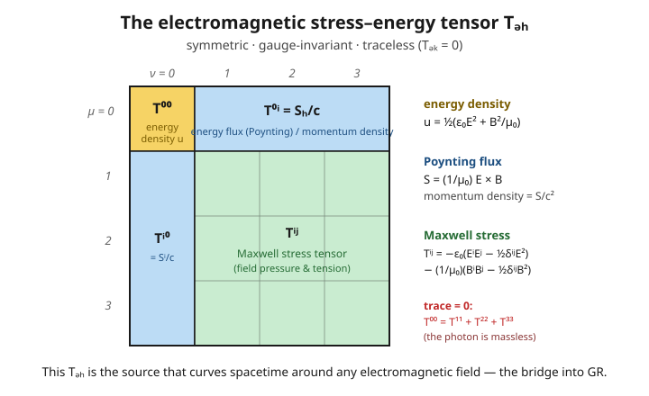

# Relativity (SR + GR) · Lesson 3.6: The EM Lagrangian and stress–energy tensor

> ⏱ ~15 min · Module 3: Classical field theory · Builds on: [3.1 The action for fields and the Euler–Lagrange equations](#/lesson/relativity/03-01-field-action-euler-lagrange.md), [3.3 The stress–energy tensor](#/lesson/relativity/03-03-stress-energy-tensor.md), [3.5 Electromagnetism as a field theory](#/lesson/relativity/03-05-em-field-theory.md) · Unlocks: Module 4 (curved-spacetime geometry) and Module 5, where this $T^{\mu\nu}$ becomes the *source* of gravity

## Why this matters

You already know Maxwell's equations. What you don't yet know is that you never had to *postulate* them — they are the unique consequence of one short line, an **action**, plus the demand that it respect Lorentz and gauge symmetry. That is a staggering economy: four vector equations compressed into $\mathcal L = -\tfrac{1}{4\mu_0}F_{\mu\nu}F^{\mu\nu} - J^\mu A_\mu$. But the deeper payoff is the object we build at the end. Every field carries energy and momentum, packaged in a stress–energy tensor $T^{\mu\nu}$, and the electromagnetic $T^{\mu\nu}$ is not a curiosity — it is *exactly the thing that sits on the right-hand side of Einstein's equations and curves spacetime*. Light bends starlight, and a light beam has weight, because this tensor is nonzero. This lesson is the hinge of the whole course: it closes classical field theory and hands you the source term for gravity.

## The idea

Two moves, both of which you've seen for other systems and now apply to the electromagnetic field.

**Move 1 — get the laws from an action.** In [3.1](#/lesson/relativity/03-01-field-action-euler-lagrange.md) you learned that a field theory is defined by a *Lagrangian density* $\mathcal L$, and the field equations fall out of "make the action stationary" via the field Euler–Lagrange equations. For electromagnetism the field is the four-potential $A_\mu$ from [3.5](#/lesson/relativity/03-05-em-field-theory.md), and there is essentially *only one* $\mathcal L$ you're allowed to write: a Lorentz scalar, gauge-invariant, and quadratic in the field strength $F_{\mu\nu}$. Feed it to Euler–Lagrange and the inhomogeneous Maxwell equations $\partial_\mu F^{\mu\nu} = \mu_0 J^\nu$ pop out. The *other* two Maxwell equations come for free — they're baked into the very definition $F = dA$ and need no action at all.

**Move 2 — get the energy and momentum from the same $\mathcal L$.** In [3.3](#/lesson/relativity/03-03-stress-energy-tensor.md) you saw that spacetime-translation symmetry of any Lagrangian hands you a conserved stress–energy tensor $T^{\mu\nu}$. Do this for the electromagnetic $\mathcal L$ (and symmetrize it, as [3.3](#/lesson/relativity/03-03-stress-energy-tensor.md) taught), and the components are old friends: the $T^{00}$ slot is the familiar EM energy density, the $T^{0i}$ slots are the Poynting flux from [em-refresher 4.3](#/lesson/em-refresher/04-03-energy-poynting.md). The field's energy budget, written covariantly.

Signature throughout: $(-,+,+,+)$, and we keep $c$, $\mu_0$, $\varepsilon_0$ explicit (SI). The field strength is $F_{\mu\nu} = \partial_\mu A_\nu - \partial_\nu A_\mu$, antisymmetric, with components fixed so that $F^{i0} = E_i/c$ and $F^{ij} = -\epsilon_{ijk}B_k$ (this sign choice makes the Maxwell equations come out with textbook signs — see the derivation below).

## The formal version

**The electromagnetic action.** The full Lagrangian density is a field piece plus an interaction piece:

$$\mathcal L = \underbrace{-\frac{1}{4\mu_0}\,F_{\mu\nu}F^{\mu\nu}}_{\text{free field}} \;-\; \underbrace{J^\mu A_\mu}_{\text{coupling to charges}}, \qquad F_{\mu\nu} = \partial_\mu A_\nu - \partial_\nu A_\mu.$$

In words: the first term is the field's own energy content; the second couples the field $A_\mu$ to the four-current $J^\mu = (\rho c, \mathbf J)$ of the charges. (The $1/\mu_0$ is pure SI bookkeeping — set $\mu_0 = 1$, as natural units do, and this is the textbook $-\tfrac14 F_{\mu\nu}F^{\mu\nu} - J^\mu A_\mu$ of the boss problem.)

*Why this term and no other.* Demand a Lagrangian that is (i) a Lorentz scalar, (ii) gauge-invariant, (iii) built from $A_\mu$ with at most first derivatives, (iv) quadratic in the fields. Gauge invariance ($A_\mu \to A_\mu + \partial_\mu\chi$ changes nothing physical) forces $A_\mu$ to appear only through the invariant combination $F_{\mu\nu}$. The only scalar quadratic in $F$ is $F_{\mu\nu}F^{\mu\nu}$. (The one alternative, $F_{\mu\nu}\tilde F^{\mu\nu} \propto \mathbf E\cdot\mathbf B$, is a total derivative — it never affects the equations of motion — and is parity-odd.) So $-\tfrac{1}{4\mu_0}F_{\mu\nu}F^{\mu\nu}$ is essentially *forced*; the $-\tfrac14$ is just the normalization that makes the units work. And gauge invariance of the interaction term requires $\partial_\mu J^\mu = 0$ — **charge conservation is the price of a gauge-invariant coupling**.

**The invariant.** Summing $F_{\mu\nu}F^{\mu\nu}$ over all components (Problem 1) gives the first field invariant:

$$-\frac14 F_{\mu\nu}F^{\mu\nu} = \frac12\left(\frac{E^2}{c^2} - B^2\right), \qquad\text{so}\qquad \mathcal L_{\text{field}} = \frac{1}{2}\left(\varepsilon_0 E^2 - \frac{B^2}{\mu_0}\right).$$

In words: the field Lagrangian is (electric energy density) minus (magnetic energy density) — the same "kinetic minus potential" pattern as any Lagrangian, with $\mathbf E$ playing kinetic and $\mathbf B$ playing potential. This scalar $F_{\mu\nu}F^{\mu\nu}$ is *frame-independent*: all observers agree on $E^2/c^2 - B^2$, even though they disagree on $\mathbf E$ and $\mathbf B$ separately.

**Maxwell from Euler–Lagrange.** Treat each component $A_\nu$ as an independent field and apply the field Euler–Lagrange equation from [3.1](#/lesson/relativity/03-01-field-action-euler-lagrange.md),

$$\partial_\mu\frac{\partial\mathcal L}{\partial(\partial_\mu A_\nu)} - \frac{\partial\mathcal L}{\partial A_\nu} = 0.$$

Working it out (Problem 2) yields

$$\boxed{\ \partial_\mu F^{\mu\nu} = \mu_0 J^\nu.\ }$$

In words: this single covariant equation is Gauss's law ($\nu=0$: $\nabla\cdot\mathbf E = \rho/\varepsilon_0$) and the Ampère–Maxwell law ($\nu=i$: $\nabla\times\mathbf B = \mu_0\mathbf J + \mu_0\varepsilon_0\,\partial_t\mathbf E$) at once — the two *sourced* Maxwell equations, straight from the action. The other two ($\nabla\cdot\mathbf B = 0$ and Faraday's law) are the identity $\partial_{[\lambda}F_{\mu\nu]} = 0$, which holds automatically because $F = dA$ (a curl of a gradient). No action needed for those — they are geometry, not dynamics. This is Boss Problem 3's first half, and Boss Problem 2's $\partial_\mu F^{\mu\nu}=\mu_0 J^\nu$ re-derived from a *deeper* principle.

**The electromagnetic stress–energy tensor.** The symmetric, gauge-invariant form is

$$\boxed{\ T^{\mu\nu} = \frac{1}{\mu_0}\left[F^{\mu\alpha}F^{\nu}{}_{\alpha} - \frac14\,\eta^{\mu\nu}F_{\alpha\beta}F^{\alpha\beta}\right].\ }$$

In words: quadratic in the field (energy scales as field-squared), symmetric ($T^{\mu\nu} = T^{\nu\mu}$, so angular momentum is conserved too), and built only from $F$ (hence gauge-invariant). Its components are exactly the electromagnetic energy bookkeeping you already know from [em-refresher 4.3](#/lesson/em-refresher/04-03-energy-poynting.md):

- **Energy density** (Problem 3): $\displaystyle T^{00} = \frac{1}{2}\left(\varepsilon_0 E^2 + \frac{B^2}{\mu_0}\right)$ — electric tank plus magnetic tank.
- **Energy flux / momentum density**: $\displaystyle T^{0i} = \frac{1}{c}\,\frac{(\mathbf E\times\mathbf B)_i}{\mu_0} = \frac{S_i}{c}$, where $\mathbf S = \tfrac{1}{\mu_0}\mathbf E\times\mathbf B$ is the Poynting vector. (The lone $1/c$ is the $x^0 = ct$ convention: $c\,T^{0i} = S_i$ is the energy flux, and $T^{0i}/c = S_i/c^2$ is the field's momentum density.)
- **Maxwell stress**: the spatial block $T^{ij}$ is the Maxwell stress tensor — the pressure and tension the field exerts, the thing that makes magnets pull and radiation push.

**Tracelessness.** Contract with $\eta_{\mu\nu}$:

$$T^{\mu}{}_{\mu} = \frac{1}{\mu_0}\left[F^{\mu\alpha}F_{\mu\alpha} - \frac14(4)\,F_{\alpha\beta}F^{\alpha\beta}\right] = \frac{1}{\mu_0}\left[F^2 - F^2\right] = 0.$$

In words: the trace vanishes because the $\tfrac14$ meets the $4$ of four-dimensional spacetime exactly. Physically, **a traceless stress–energy tensor is the signature of massless radiation** — the photon has no rest mass, so there is no rest frame and no invariant "energy at rest" to appear on the diagonal. (Contrast the scalar field of [3.4](#/lesson/relativity/03-04-scalar-field.md), whose $T^{\mu}{}_{\mu}$ is nonzero exactly when its mass is.)

**Conservation and the Lorentz force.** In vacuum, $\partial_\mu T^{\mu\nu} = 0$: the field alone conserves energy and momentum. With charges present, the standard identity is

$$\partial_\mu T^{\mu\nu} = -\,F^{\nu}{}_{\lambda}J^{\lambda}.$$

In words: the field's energy-momentum is *not* conserved by itself when it can push on charges — the deficit $F^{\nu}{}_{\lambda}J^{\lambda}$ is precisely the **Lorentz four-force density**. Its time part is Poynting's theorem (work done on charges, $\mathbf J\cdot\mathbf E$); its space part is the force density $\rho\mathbf E + \mathbf J\times\mathbf B$. So "field momentum lost = momentum handed to matter," and field-plus-matter together is conserved. This is the same accounting that, promoted to curved spacetime as $\nabla_\mu T^{\mu\nu} = 0$, becomes the law of motion for matter in general relativity (Module 5).

## Picture

The 4×4 grid *is* the physics: energy density in the corner, energy flow along the edges, field stresses in the middle, and a diagonal that sums to zero. Everything you can ask about "how much energy-momentum is here and where is it going" lives in these sixteen (ten independent, by symmetry) numbers.

## Worked examples

**Example 1 (mechanical — the energy density is a $T^{00}$).** Take a static, uniform electric field $\mathbf E = E\hat{\mathbf x}$ with $\mathbf B = 0$ (the field between capacitor plates). Then $F^{10} = E/c$ and all magnetic components vanish. Compute the energy density directly from the tensor:

$$T^{00} = \frac{1}{\mu_0}\left[F^{0\alpha}F^{0}{}_{\alpha} - \tfrac14\eta^{00}F_{\alpha\beta}F^{\alpha\beta}\right].$$

Here $F^{0\alpha}F^{0}{}_{\alpha} = (F^{01})^2 = (E/c)^2 = E^2/c^2$, and $F_{\alpha\beta}F^{\alpha\beta} = -2E^2/c^2$ (Problem 1 with $B=0$), with $\eta^{00} = -1$:

$$T^{00} = \frac{1}{\mu_0}\left[\frac{E^2}{c^2} - \tfrac14(-1)\left(-\frac{2E^2}{c^2}\right)\right] = \frac{1}{\mu_0}\left[\frac{E^2}{c^2} - \frac{E^2}{2c^2}\right] = \frac{E^2}{2\mu_0 c^2} = \tfrac12\varepsilon_0 E^2.$$

Exactly the capacitor energy density $\tfrac12\varepsilon_0 E^2$ — recovered from the tensor, no wave needed.

**Example 2 (why you'd care — a light beam has weight).** For a plane wave traveling along $\hat{\mathbf x}$, $|\mathbf E| = c|\mathbf B|$ and the electric and magnetic energies are equal (from [em-refresher 4.3](#/lesson/em-refresher/04-03-energy-poynting.md)), so $T^{00} = u = \varepsilon_0 E^2$ and $T^{0x} = S/c = u$ (the flux equals the density carried at $c$). The stress block has one nonzero entry, $T^{xx} = u$: the wave pushes forward with a pressure equal to its energy density. Now stack these into the tensor's momentum slots: the beam carries momentum density $u/c^2$. Feed *that* into Einstein's equations in Module 5 and you find a beam of light gravitates — it deflects a nearby test mass, and two parallel light beams attract. Because $T^{\mu\nu}\ne 0$, light is a source of gravity. This is the sentence to remember: **the same tensor that gave you Poynting's theorem is the thing that bends spacetime.**

## Watch out

- You might think the field Lagrangian could be any function of $\mathbf E$ and $\mathbf B$. It can't: Lorentz invariance means it depends only on the two scalars $F_{\mu\nu}F^{\mu\nu}\propto E^2/c^2 - B^2$ and $F_{\mu\nu}\tilde F^{\mu\nu}\propto \mathbf E\cdot\mathbf B$. Standard electromagnetism is *linear*, which pins it to the first one, quadratically. (Nonlinear theories like Euler–Heisenberg add higher powers — but only of these two invariants.)
- You might expect $T^{0i}$ to *be* the Poynting vector $S_i$. It's $S_i/c$ — the factor of $c$ is the $x^0 = ct$ convention, not an error. The honest statements are $c\,T^{0i} = S_i$ (energy flux) and $T^{0i}/c = S_i/c^2$ (momentum density). Both are the same tensor slot read in different units.
- You might think the homogeneous Maxwell equations ($\nabla\cdot\mathbf B = 0$, Faraday) also come from varying the action. They don't — they are the identity $\partial_{[\lambda}F_{\mu\nu]}=0$, true for *any* $A_\mu$ because $F=dA$. Only the *sourced* pair $\partial_\mu F^{\mu\nu}=\mu_0 J^\nu$ is dynamics.
- You might read tracelessness as a technicality. It's a physical fingerprint: $T^{\mu}{}_{\mu}=0 \iff$ the field's quanta are massless. The trace is where rest mass would show up, and the photon has none.

## One-liner

> All of electromagnetism is $\mathcal L = -\tfrac{1}{4\mu_0}F^2 - J\cdot A$: vary $A$ and Maxwell's sourced equations fall out; read off $T^{\mu\nu}=\tfrac{1}{\mu_0}[F^{\mu\alpha}F^{\nu}{}_{\alpha}-\tfrac14\eta^{\mu\nu}F^2]$ and you hold the energy, the momentum, and the thing that curves spacetime.

## Problems

**P1 (🟢)** Show by summing over all components that $-\tfrac14 F_{\mu\nu}F^{\mu\nu} = \tfrac12(E^2/c^2 - B^2)$. Use the components $F_{0i} = E_i/c$, $F_{i0} = -E_i/c$, and $F_{ij} = -\epsilon_{ijk}B_k$ (all indices down), and recall $\sum_{ij}\epsilon_{ijk}\epsilon_{ijl} = 2\delta_{kl}$.

**P2 (🟡)** Derive $\partial_\mu F^{\mu\nu} = \mu_0 J^\nu$ from $\mathcal L = -\tfrac{1}{4\mu_0}F_{\alpha\beta}F^{\alpha\beta} - J^\alpha A_\alpha$ by applying the field Euler–Lagrange equation for $A_\nu$. You will need $\dfrac{\partial(F_{\alpha\beta}F^{\alpha\beta})}{\partial(\partial_\mu A_\nu)} = 4F^{\mu\nu}$ — derive it, using the antisymmetry of $F$.

**P3 (🔴, optional)** For the tensor $T^{\mu\nu} = \tfrac{1}{\mu_0}[F^{\mu\alpha}F^{\nu}{}_{\alpha} - \tfrac14\eta^{\mu\nu}F_{\alpha\beta}F^{\alpha\beta}]$:
(a) Verify $T^{00} = \tfrac12(\varepsilon_0 E^2 + B^2/\mu_0)$, the standard EM energy density.
(b) Verify the tensor is traceless, $T^{\mu}{}_{\mu} = 0$, and say in one sentence why that reflects the photon being massless.

Solutions

**P1** The double sum $F_{\mu\nu}F^{\mu\nu}$ splits into time–space and space–space pieces. First raise indices with $\eta = \mathrm{diag}(-1,1,1,1)$: $F^{0i} = \eta^{00}\eta^{ii}F_{0i} = -F_{0i} = -E_i/c$, $F^{i0} = E_i/c$, and $F^{ij} = F_{ij} = -\epsilon_{ijk}B_k$.

- Time–space $\mu=0,\nu=i$: $\sum_i F_{0i}F^{0i} = \sum_i (E_i/c)(-E_i/c) = -E^2/c^2$.
- Time–space $\mu=i,\nu=0$: $\sum_i F_{i0}F^{i0} = \sum_i (-E_i/c)(E_i/c) = -E^2/c^2$.
- Space–space: $\sum_{ij}F_{ij}F^{ij} = \sum_{ij}(-\epsilon_{ijk}B_k)(-\epsilon_{ijl}B_l) = \sum_{kl}\Big(\sum_{ij}\epsilon_{ijk}\epsilon_{ijl}\Big)B_kB_l = \sum_{kl}2\delta_{kl}B_kB_l = 2B^2.$

Add them: $F_{\mu\nu}F^{\mu\nu} = -\dfrac{2E^2}{c^2} + 2B^2 = 2\left(B^2 - \dfrac{E^2}{c^2}\right).$ Therefore

$$-\tfrac14 F_{\mu\nu}F^{\mu\nu} = -\tfrac14\cdot 2\left(B^2 - \frac{E^2}{c^2}\right) = \frac12\left(\frac{E^2}{c^2} - B^2\right). \checkmark$$

The two $-E^2/c^2$ terms come from the two orderings of a time and a space index; the single $+2B^2$ from the purely spatial block. The relative minus sign is the Minkowski signature at work — in Euclidean space both would add.

**P2** The interaction term contributes to the undifferentiated-field slot: since $J^\alpha A_\alpha$ is linear in $A_\nu$,

$$\frac{\partial\mathcal L}{\partial A_\nu} = \frac{\partial}{\partial A_\nu}\big(-J^\alpha A_\alpha\big) = -J^\nu.$$

The field term contributes to the derivative slot. First the requested identity: $F_{\alpha\beta} = \partial_\alpha A_\beta - \partial_\beta A_\alpha$, so $\dfrac{\partial F_{\alpha\beta}}{\partial(\partial_\mu A_\nu)} = \delta^\mu_\alpha\delta^\nu_\beta - \delta^\mu_\beta\delta^\nu_\alpha.$ Then, using $\dfrac{\partial(F_{\alpha\beta}F^{\alpha\beta})}{\partial(\partial_\mu A_\nu)} = 2F^{\alpha\beta}\dfrac{\partial F_{\alpha\beta}}{\partial(\partial_\mu A_\nu)}$,

$$= 2F^{\alpha\beta}\big(\delta^\mu_\alpha\delta^\nu_\beta - \delta^\mu_\beta\delta^\nu_\alpha\big) = 2\big(F^{\mu\nu} - F^{\nu\mu}\big) = 4F^{\mu\nu},$$

the last step by antisymmetry $F^{\nu\mu} = -F^{\mu\nu}$. Hence

$$\frac{\partial\mathcal L}{\partial(\partial_\mu A_\nu)} = -\frac{1}{4\mu_0}\cdot 4F^{\mu\nu} = -\frac{1}{\mu_0}F^{\mu\nu}.$$

Assemble the Euler–Lagrange equation $\partial_\mu\dfrac{\partial\mathcal L}{\partial(\partial_\mu A_\nu)} - \dfrac{\partial\mathcal L}{\partial A_\nu} = 0$:

$$\partial_\mu\left(-\frac{1}{\mu_0}F^{\mu\nu}\right) - (-J^\nu) = 0 \;\Longrightarrow\; -\frac{1}{\mu_0}\partial_\mu F^{\mu\nu} + J^\nu = 0 \;\Longrightarrow\; \boxed{\partial_\mu F^{\mu\nu} = \mu_0 J^\nu.} \checkmark$$

Sanity check ($\nu=0$): $\partial_i F^{i0} = \partial_i(E_i/c) = \tfrac1c\nabla\cdot\mathbf E$, and $\mu_0 J^0 = \mu_0\rho c$, so $\nabla\cdot\mathbf E = \mu_0 c^2\rho = \rho/\varepsilon_0$ — Gauss's law with the right sign, confirming the component convention.

**P3** (a) Set $\mu=\nu=0$. The two pieces:

*First piece* $F^{0\alpha}F^{0}{}_{\alpha}$. Only spatial $\alpha$ contribute (since $F^{00}=0$), and $F^{0}{}_{\alpha} = \eta_{\alpha\beta}F^{0\beta}$ gives $F^{0}{}_{i} = F^{0i}$ (spatial lowering is $+1$):

$$F^{0\alpha}F^{0}{}_{\alpha} = \sum_i (F^{0i})^2 = \sum_i\left(\frac{E_i}{c}\right)^2 = \frac{E^2}{c^2}.$$

*Second piece*. With $\eta^{00} = -1$ and $F_{\alpha\beta}F^{\alpha\beta} = 2(B^2 - E^2/c^2)$ from P1:

$$-\tfrac14\eta^{00}F_{\alpha\beta}F^{\alpha\beta} = -\tfrac14(-1)\cdot 2\left(B^2 - \frac{E^2}{c^2}\right) = \frac12\left(B^2 - \frac{E^2}{c^2}\right).$$

Add and multiply by $1/\mu_0$:

$$T^{00} = \frac{1}{\mu_0}\left[\frac{E^2}{c^2} + \frac12 B^2 - \frac12\frac{E^2}{c^2}\right] = \frac{1}{\mu_0}\left[\frac12\frac{E^2}{c^2} + \frac12 B^2\right] = \frac{E^2}{2\mu_0 c^2} + \frac{B^2}{2\mu_0}.$$

Since $1/(\mu_0 c^2) = \varepsilon_0$, this is $T^{00} = \tfrac12\varepsilon_0 E^2 + \tfrac{B^2}{2\mu_0} = \tfrac12(\varepsilon_0 E^2 + B^2/\mu_0)$. $\checkmark$ — the energy density of [em-refresher 4.3](#/lesson/em-refresher/04-03-energy-poynting.md).

(b) Contract $\mu$ with $\nu$ using $\eta_{\mu\nu}$. The first piece: $\eta_{\mu\nu}F^{\mu\alpha}F^{\nu}{}_{\alpha} = F^{\nu\alpha}F_{\nu\alpha} = F_{\alpha\beta}F^{\alpha\beta}$ (lower the free $\nu$). The second piece: $\eta_{\mu\nu}\eta^{\mu\nu} = \delta^{\mu}_{\mu} = 4$, so $-\tfrac14\eta_{\mu\nu}\eta^{\mu\nu}F^2 = -\tfrac14(4)F^2 = -F^2$. Therefore

$$T^{\mu}{}_{\mu} = \frac{1}{\mu_0}\big[F_{\alpha\beta}F^{\alpha\beta} - F_{\alpha\beta}F^{\alpha\beta}\big] = 0. \checkmark$$

The cancellation is exact because the $\tfrac14$ in $T^{\mu\nu}$ is tuned against the $4$ dimensions of spacetime. Physically: the trace is the slot where a rest-frame energy (a mass) would appear, and the electromagnetic field's quanta — photons — are massless, so there is nothing to put there. (A massive field like the massive scalar of [3.4](#/lesson/relativity/03-04-scalar-field.md) has $T^{\mu}{}_{\mu}\propto m^2\phi^2 \ne 0$.)

## Flashback

**From Lesson 3.5 (Electromagnetism as a field theory):** A four-potential is $A^\mu = (0,\ 0,\ Bx,\ 0)$ — that is, $A_y = Bx$ with $\phi$ and the other components zero, and $B$ a constant. Compute the field strength $F_{\mu\nu} = \partial_\mu A_\nu - \partial_\nu A_\mu$, read off $\mathbf E$ and $\mathbf B$, and evaluate the invariant $F_{\mu\nu}F^{\mu\nu}$.

Solution

Since $\phi = 0$ and $\mathbf A$ is time-independent, every $F_{0\mu} = 0$: with $A_0 = 0$ and $\partial_t\mathbf A = 0$, the electric field $\mathbf E = -\nabla\phi - \partial_t\mathbf A = 0$. The only nonzero spatial derivative is $\partial_x A_y = B$, so

$$F_{xy} = \partial_x A_y - \partial_y A_x = \partial_x(Bx) - 0 = B, \qquad F_{yx} = -B,$$

and all other components vanish. Comparing to $F_{ij} = -\epsilon_{ijk}B_k$: $F_{xy} = -\epsilon_{xyz}B_z = -B_z = B$ gives $B_z = -B$. (Sign aside, this is a *uniform magnetic field of magnitude $B$ along $\hat{\mathbf z}$* — the Landau gauge, where a constant field is written with a linearly growing potential.)

The invariant, using P1's result $F_{\mu\nu}F^{\mu\nu} = 2(B^2 - E^2/c^2)$ with $\mathbf E = 0$:

$$F_{\mu\nu}F^{\mu\nu} = 2B^2 > 0.$$

A positive invariant means the configuration is *magnetically dominated* — and no boost can transform it into a pure electric field, precisely because $E^2/c^2 - B^2$ is frame-independent and here it is negative. This is the same $F=dA$ construction from [3.5](#/lesson/relativity/03-05-em-field-theory.md), now feeding directly into this lesson's invariant.

## Connections

- **Backward:** this is [3.1](#/lesson/relativity/03-01-field-action-euler-lagrange.md)'s field Euler–Lagrange machine and [3.3](#/lesson/relativity/03-03-stress-energy-tensor.md)'s stress–energy construction applied to the electromagnetic field of [3.5](#/lesson/relativity/03-05-em-field-theory.md). The invariant $E^2/c^2 - B^2$ is the scalar built from $F_{\mu\nu}$ in [2.4](#/lesson/relativity/02-04-invariants-levi-civita.md); the derivation of $\partial_\mu F^{\mu\nu}=\mu_0 J^\nu$ redoes Boss Problem 2 from an action rather than by hand.
- **Forward:** the tensor $T^{\mu\nu}$ is the *source* term in Einstein's equations $G_{\mu\nu} = \tfrac{8\pi G}{c^4}T_{\mu\nu}$ ([5.3](#/lesson/relativity/05-03-einstein-field-equations.md)). Module 5 puts fields on curved spacetime ([5.2](#/lesson/relativity/05-02-matter-curved-spacetime.md)) by promoting $\partial_\mu T^{\mu\nu}=0$ to $\nabla_\mu T^{\mu\nu}=0$, and derives the whole theory from an action ([5.4](#/lesson/relativity/05-04-einstein-hilbert-action.md)) exactly as this lesson derived Maxwell — the Einstein–Hilbert action is the gravitational analogue of $-\tfrac{1}{4\mu_0}F^2$.
- **Sideways (electromagnetism):** $T^{00}$ and $T^{0i}$ are the energy density and Poynting flux of [em-refresher 4.3](#/lesson/em-refresher/04-03-energy-poynting.md), and the sourced equation is [em-refresher 4.1](#/lesson/em-refresher/04-01-maxwells-equations.md)'s Maxwell equations — now shown to be *unavoidable* given the symmetries.
- **Sideways (analytical mechanics):** getting Maxwell from a stationary action is [least action for fields](#/lesson/analytical-mechanics/04-05-classical-fields.md); that gauge invariance forces charge conservation $\partial_\mu J^\mu = 0$ is [Noether's theorem](#/lesson/analytical-mechanics/02-02-noethers-theorem.md) for an internal symmetry — the field-theory sequel to the particle version you met in relativity [1.5](#/lesson/relativity/01-05-four-vectors-momentum.md).
