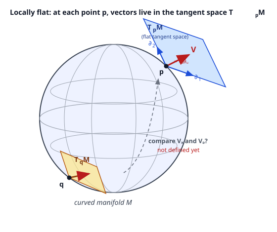

# Relativity (SR + GR) · Lesson 4.1: Manifolds, coordinates, and tangent spaces

> ⏱ ~15 min · Module 4: The geometry of curved spacetime · Builds on: [2.2 Vectors, covectors & transformations](#/lesson/relativity/02-02-vectors-covectors-transformations.md), [2.3 Tensors & tensor algebra](#/lesson/relativity/02-03-tensors-algebra.md), [1.4 The spacetime interval](#/lesson/relativity/01-04-spacetime-interval-causality.md) · Unlocks: tensor fields on manifolds (4.2), the metric $g_{\mu\nu}(x)$ (4.3), and the covariant derivative (4.4)

## Why this matters

Modules 1–3 lived in **Minkowski space** — flat, infinite, one global coordinate grid, and crucially a *vector space*: you could add the position of two events, slide a velocity arrow from here to there, and it all just worked. Gravity breaks that. Einstein's idea is that gravity **is** the curvature of spacetime, and a curved space is not a vector space — there is no origin, no way to "add points," and no god-given way to compare an arrow here with an arrow a mile away. Before we can write a single curvature symbol we need the right stage: a **manifold**, a space that is curved globally but looks like flat Minkowski space if you zoom in far enough. This lesson builds that stage and puts vectors back on it (in the **tangent space**), so the rest of Module 4 — metric, geodesics, curvature — has something rigorous to stand on. Every $g_{\mu\nu}$, $\Gamma^\lambda_{\mu\nu}$, and $R^\rho{}_{\sigma\mu\nu}$ you will ever write is defined here first.

## The idea

Look at the ground. It's flat — flat enough that Euclid's geometry works for a carpenter, a city planner, a game of pool. Now zoom out to the whole Earth: it's a sphere, and no flat map of it can avoid distortion (Greenland is not really the size of Africa). The surface is **locally flat but globally curved**. That is the entire concept of a manifold: a space that, in any small enough neighborhood, is indistinguishable from ordinary flat $\mathbb{R}^n$, even though its global shape is something else entirely.

The way we actually *work* on such a space is with maps — literally, an atlas. You never navigate the whole Earth with one sheet of paper; you use a book of overlapping local charts, each covering a patch, each stitching smoothly onto its neighbors where they overlap. A **coordinate system** on a manifold is exactly such a chart: a rule that assigns numbers $(x^1, \dots, x^n)$ to points in a patch. And here is the punchline that runs through all of general relativity: **the coordinates are just labels we painted on**. Latitude and longitude are not features of the Earth; they're bookkeeping. The physics — the distances, the curvature, the paths particles take — cannot depend on which labels we chose. That principle is called **general covariance**, and it is the reason GR is written in tensors.

Now, vectors. On flat space a "velocity" is an arrow you can carry anywhere. On a sphere you cannot: an arrow tangent to the surface at the north pole sticks out into empty space if you try to lay it flat at the equator. The fix is to attach, at *each* point $p$, its own private flat space of directions — the **tangent space** $T_pM$, the plane of all velocities a particle passing through $p$ could have. Vectors don't live *on* the manifold; they live in the tangent space *at a point*. Two points, two different tangent spaces — and that is exactly why comparing them will turn out to be the subtle problem that curvature answers.

## The formal version

**Signature convention.** Throughout Module 4 I keep the $(-,+,+,+)$ signature from [1.4](#/lesson/relativity/01-04-spacetime-interval-causality.md); $\mu,\nu,\dots$ run over $0,1,2,3$ with $x^0=ct$. Nothing below depends on the signature yet — it enters with the metric in [4.3](#/lesson/relativity/04-03-metric-proper-time.md).

**Manifold (physicist's version).** An $n$-dimensional **manifold** $M$ is a space that can be covered by **charts**. A chart is a pair $(U,\varphi)$: an open region $U\subseteq M$ (open in the topological sense of [topology 1.3](#/lesson/topology/01-03-topological-spaces-axioms.md)) and a continuous, invertible map
$$\varphi: U \to \mathbb{R}^n, \qquad p \mapsto \big(x^1(p),\dots,x^n(p)\big),$$
that labels each point of $U$ with $n$ coordinates. A collection of charts covering all of $M$ is an **atlas**. Where two charts $(U,\varphi)$ and $(V,\psi)$ overlap, the **transition map** $\psi\circ\varphi^{-1}$ (relabel via chart 1, then re-read in chart 2) must be **smooth** ($C^\infty$). If every transition map is smooth, $M$ is a *smooth manifold*.

*In words:* a manifold is anything you can cover with overlapping coordinate patches that agree smoothly where they meet — a space locally modeled on $\mathbb{R}^n$ and patched together without kinks. The "locally looks like $\mathbb{R}^n$" is the homeomorphism idea from [topology 2.1](#/lesson/topology/02-01-continuity-and-homeomorphisms.md); the "patched smoothly" is what upgrades it from topology to calculus. We take this on intuition and never prove a transition map smooth — that's the "physicist's-pragmatic" bargain of this module.

**No chart need be global.** Generically **no single chart covers all of $M$**. The 2-sphere is the standard example: latitude/longitude $(\theta,\phi)$ breaks down at the poles (where $\phi$ is undefined) and along the date line (where $\phi$ jumps by $2\pi$). You need at least two overlapping charts. *In words:* a coordinate breakdown is a failure of the **labels**, never of the **space** — the north pole is a perfectly ordinary point; only longitude is sick there.

**Tangent space.** Fix a point $p\in M$. The **tangent space** $T_pM$ is the $n$-dimensional real vector space of all "velocity vectors" of curves through $p$. Concretely, take any smooth curve $\gamma(\lambda)$ with $\gamma(0)=p$; its velocity is the operator that differentiates functions along it. This is the **vectors-as-derivations** view: a vector $V$ at $p$ **is** the directional-derivative operator
$$V(f) = \left.\frac{d}{d\lambda}\, f\big(\gamma(\lambda)\big)\right|_{\lambda=0},$$
acting on smooth functions $f$ near $p$. *In words:* a vector is a machine that, given a function, returns its rate of change in the vector's direction — "an arrow" and "a directional derivative" are the same object.

**Coordinate basis.** In a chart $\{x^\mu\}$, the natural basis for $T_pM$ is the set of partial-derivative operators
$$\partial_\mu \equiv \frac{\partial}{\partial x^\mu}, \qquad \mu = 0,\dots,n-1,$$
and every vector expands as
$$\boxed{\,V = V^\mu\,\partial_\mu\,}\qquad(\text{sum over }\mu),$$
where the numbers $V^\mu$ are the **components** and $\partial_\mu$ is the **coordinate basis**. *In words:* moving along $x^\mu$ at unit coordinate speed is a basis direction $\partial_\mu$; a general vector is a weighted combination of "move along $x^0$," "move along $x^1$," … . This is the modern coordinate-free definition made concrete: the abstract arrow $V$ is basis-independent; only the split into components $V^\mu$ knows about the chart.

**How components transform.** Change chart, $x^\mu \to x'^{\mu}(x)$. The *vector* $V$ is one geometric object and doesn't change, but its components do, by the chain rule ($\partial_\mu = \frac{\partial x'^{\nu}}{\partial x^\mu}\partial'_\nu$):
$$\boxed{\,V'^{\mu} = \frac{\partial x'^{\mu}}{\partial x^\nu}\,V^\nu\,}$$
*In words:* new components = (Jacobian of the coordinate change) times old components. This is the **contravariant** transformation law from [2.2](#/lesson/relativity/02-02-vectors-covectors-transformations.md) — but now the transformation matrix $\Lambda^\mu{}_\nu = \partial x'^{\mu}/\partial x^\nu$ can vary from point to point and be any smooth relabeling, not just a Lorentz boost. A Lorentz transformation is the special case where $\partial x'^{\mu}/\partial x^\nu$ is a constant boost matrix; general covariance is what you get when you allow *arbitrary* smooth changes of label.

**The catch that drives the rest of the module.** $T_pM$ and $T_qM$ at two different points are **different vector spaces**. There is no built-in way to add $V\in T_pM$ to $W\in T_qM$, or to ask whether they're equal — the operation "$V=W$" isn't defined for vectors at different points. On flat space we cheated: we silently slid arrows around, and it always worked. On a curved manifold that sliding (**parallel transport**) requires an extra rule and turns out to depend on the path — which is the whole content of the covariant derivative ([4.4](#/lesson/relativity/04-04-covariant-derivative-christoffel.md)) and curvature ([4.6](#/lesson/relativity/04-06-riemann-geodesic-deviation.md)).

## Picture

At the point $p$ the manifold is touched by its tangent plane $T_pM$ — genuinely flat, the "locally looks like $\mathbb{R}^n$" made visible. The vector $V=V^\mu\partial_\mu$ lives *in that plane*, built from the coordinate-basis arrows $\partial_1,\partial_2$. The second point $q$ carries its own plane $T_qM$, tilted differently against the sphere. The dashed link asks the question the rest of Module 4 exists to answer: how (if at all) do you compare $V$ at $p$ with a vector at $q$, when they live in different flat spaces glued to a curved surface? On the flat Minkowski space of Modules 1–3 all these planes were parallel copies of one space and the question was invisible. Curvature is precisely the failure of that.

## Worked examples

**Example 1 (mechanical — the coordinate basis on the plane, two ways).** Take the ordinary plane $\mathbb{R}^2$ — itself a (flat) manifold — with two charts: Cartesian $(x,y)$ and polar $(r,\theta)$, related by $x=r\cos\theta$, $y=r\sin\theta$. The coordinate bases are $\{\partial_x,\partial_y\}$ and $\{\partial_r,\partial_\theta\}$. How does the *same* arrow look in each? Use $\partial_r = \frac{\partial x}{\partial r}\partial_x + \frac{\partial y}{\partial r}\partial_y$ and likewise for $\partial_\theta$:
$$\partial_r = \cos\theta\,\partial_x + \sin\theta\,\partial_y, \qquad \partial_\theta = -r\sin\theta\,\partial_x + r\cos\theta\,\partial_y.$$
*In words:* "step outward in $r$" is a unit arrow pointing radially; "step in $\theta$" is an arrow of length $r$ pointing tangent to the circle — longer the farther out you are, because a radian of angle sweeps more distance at large radius. Already the coordinate basis is **not** unit-length or even constant across the plane, on a space that is perfectly flat — a warning that coordinate weirdness and genuine curvature are different things (a theme of [4.4](#/lesson/relativity/04-04-covariant-derivative-christoffel.md)).

**Example 2 (why you'd care — a velocity is chart-independent, its components are not).** A particle sits at the point with polar coordinates $(r,\theta)=(2,\tfrac{\pi}{2})$ — i.e. on the positive $y$-axis, two units up — moving with polar-component velocity $V^r=3,\ V^\theta=4$ (so $V = 3\,\partial_r + 4\,\partial_\theta$). What are its Cartesian components? Apply $V'^{\mu}=\frac{\partial x'^{\mu}}{\partial x^\nu}V^\nu$ with primed $=$ Cartesian, unprimed $=$ polar. The Jacobian entries at $\theta=\tfrac{\pi}{2}$ ($\cos\theta=0,\ \sin\theta=1$), $r=2$:
$$V^x=\frac{\partial x}{\partial r}V^r+\frac{\partial x}{\partial\theta}V^\theta=\cos\theta\,(3)-r\sin\theta\,(4)=0-2\cdot1\cdot4=-8,$$
$$V^y=\frac{\partial y}{\partial r}V^r+\frac{\partial y}{\partial\theta}V^\theta=\sin\theta\,(3)+r\cos\theta\,(4)=1\cdot3+0=3.$$
So $V=-8\,\partial_x+3\,\partial_y$. **Check geometrically:** at that point $\partial_r$ points $+y$ and $\partial_\theta$ points $-x$ with length $2$, so $V = 3(0,1)+4(-2,0)=(-8,3)$. ✓ The *arrow* never moved; only its coordinate description did — components are chart-dependent bookkeeping, exactly what the transformation law protects.

## Watch out

- **You might think a coordinate singularity is a real singularity.** It usually isn't. The poles of $(\theta,\phi)$ and the $r=0$ mess of polar coordinates are failures of the *labels*, curable by switching charts; the space is smooth there. A **true** singularity (curvature blowing up) survives every chart — distinguishing the two is a central skill for black holes ([6.3](#/lesson/relativity/06-03-black-holes-horizons.md)), where the Schwarzschild horizon is only a *coordinate* singularity.
- **You might think $\partial_\mu$ is a "unit vector."** It's not, in general — Example 1's $\partial_\theta$ has length $r$. The coordinate basis is defined by the chart, not by any notion of length; length needs the **metric** ([4.3](#/lesson/relativity/04-03-metric-proper-time.md)), which we haven't introduced. Never assume $|\partial_\mu|=1$.
- **You might think you can add vectors at different points.** $V\in T_pM$ and $W\in T_qM$ live in different vector spaces; $V+W$ and "$V=W$" are undefined until you supply a rule to transport one to the other — and on a curved manifold that rule is path-dependent. Treat every vector as **anchored** to its point.

## One-liner

> A manifold is a space that's flat up close but curved on the whole; at each point vectors live in their own flat tangent space $T_pM$ with basis $\partial_\mu$, and coordinates are labels the physics must never depend on.

## Problems

**P1 (🟢)** On the unit 2-sphere with coordinates $(\theta,\phi)$ (colatitude $\theta\in[0,\pi]$, longitude $\phi\in[0,2\pi)$), (a) name the two coordinate-basis vectors of $T_pM$ at a generic point, and describe the direction each one points; (b) explain why this single chart *cannot* cover the whole sphere — identify exactly where it fails and why, and state how many charts you'd expect to need.

**P2 (🟡)** In the plane, a vector has polar components $V^r=1,\ V^\theta=2$ at the point $(r,\theta)=(3,\tfrac{\pi}{4})$. Using $V'^{\mu}=\frac{\partial x'^{\mu}}{\partial x^\nu}V^\nu$ with $x=r\cos\theta,\ y=r\sin\theta$, find the Cartesian components $V^x,V^y$. Leave $\tfrac{1}{\sqrt2}$ in exact form.

**P3 (🔴, optional)** Using the tangent-space picture, explain why the statement *"the vector pointing east at the north pole equals the vector pointing east at a point on the equator"* is **not well-defined** on the sphere. In your answer, say what mathematical structure would be needed to even attempt the comparison, and why the answer would then depend on a choice. (This is the setup for parallel transport and the covariant derivative in [4.4](#/lesson/relativity/04-04-covariant-derivative-christoffel.md).)

Solutions

**P1** (a) The basis is $\{\partial_\theta,\partial_\phi\}$. $\partial_\theta = \partial/\partial\theta$ points along a **meridian** (a line of constant longitude), i.e. "due south" as $\theta$ increases from the north pole. $\partial_\phi=\partial/\partial\phi$ points along a **circle of latitude**, i.e. "due east." At a generic interior point these are two independent tangent directions, so they span the 2-dimensional tangent plane $T_pM$.

(b) The chart fails at the **poles** $\theta=0$ and $\theta=\pi$: there, longitude $\phi$ is undefined (every value of $\phi$ names the *same* point), so the labeling map is not invertible and $\partial_\phi$ degenerates — a whole circle of the $\phi$-basis collapses to a point. It also fails along the **date line**, where $\phi$ must jump discontinuously from just under $2\pi$ back to $0$; the map isn't continuous across that seam. So $(\theta,\phi)$ is a good chart only on an open patch missing the two poles and one meridian. You need at least **two** overlapping charts to cover the whole sphere (e.g. a second $(\theta',\phi')$ system rotated so its poles sit on the first chart's good equator) — no single chart can do it, which is a genuine feature of the sphere's global shape, not of the coordinates.

**P2** At $(r,\theta)=(3,\tfrac{\pi}{4})$: $\cos\theta=\sin\theta=\tfrac{1}{\sqrt2}$, $r=3$. Jacobian rows:
$$V^x=\cos\theta\,V^r-r\sin\theta\,V^\theta=\tfrac{1}{\sqrt2}(1)-3\cdot\tfrac{1}{\sqrt2}(2)=\tfrac{1}{\sqrt2}-\tfrac{6}{\sqrt2}=-\tfrac{5}{\sqrt2},$$
$$V^y=\sin\theta\,V^r+r\cos\theta\,V^\theta=\tfrac{1}{\sqrt2}(1)+3\cdot\tfrac{1}{\sqrt2}(2)=\tfrac{1}{\sqrt2}+\tfrac{6}{\sqrt2}=\tfrac{7}{\sqrt2}.$$
So $V^x=-\dfrac{5}{\sqrt2}=-\dfrac{5\sqrt2}{2}\approx-3.54$, $\ V^y=\dfrac{7}{\sqrt2}=\dfrac{7\sqrt2}{2}\approx4.95$.

**P3** Each point has its **own** tangent space: the "east" vector at the north pole lives in $T_NM$, the "east" vector at the equatorial point lives in $T_EM$, and these are two *different* 2-dimensional vector spaces. Equality (or addition, or subtraction) is an operation defined only *within a single* vector space; between elements of two different spaces "$=$" simply has no meaning — there is no canonical isomorphism $T_NM\to T_EM$ handed to us by the manifold. To even attempt the comparison you must supply extra structure: a rule for **transporting** a vector from one point to the other along a path — a **connection** / parallel-transport law (the Christoffel symbols of [4.4](#/lesson/relativity/04-04-covariant-derivative-christoffel.md)). But on a curved surface the transported vector depends on the **path** taken: carry "east at the north pole" down one meridian to the equator, versus down another meridian and along the equator, and the two arrivals point in different directions. So the comparison isn't merely undefined — even after you define it, it has no path-independent answer. That path-dependence *is* curvature, and quantifying it is the goal of the Riemann tensor ([4.6](#/lesson/relativity/04-06-riemann-geodesic-deviation.md)). On flat Minkowski space, by contrast, transport *is* path-independent, which is exactly why Modules 1–3 could slide vectors around freely and never notice the issue.

## Flashback

**From Lesson 1.5 (Four-vectors and four-momentum):** A particle of mass $m$ sits at rest, with four-momentum $p^\mu=(mc,0,0,0)$ in its rest frame $S$. Transform to a frame $S'$ in which the particle moves at speed $v$ along $+x$ (so $S'$ moves at $-v$ relative to $S$), find the components $p'^{\mu}$, and confirm the invariant $p_\mu p^\mu=-m^2c^2$ is unchanged. Then state how the boost matrix relates to this lesson's transformation rule.

Solution

The Lorentz boost giving the components in a frame where the particle moves at $+v$ is $p'^{\mu}=\Lambda^\mu{}_\nu\,p^\nu$ with $\beta=v/c$, $\gamma=1/\sqrt{1-\beta^2}$:
$$p'^{0}=\gamma\big(p^0+\beta p^1\big)=\gamma\,mc,\qquad p'^{1}=\gamma\big(p^1+\beta p^0\big)=\gamma\beta\,mc=\gamma m v,$$
and $p'^{2}=p'^{3}=0$. So $p'^{\mu}=(\gamma mc,\ \gamma m v,\ 0,\ 0)$ — the familiar relativistic energy $E=\gamma mc^2$ and momentum $\mathbf p=\gamma m\mathbf v$. Check the invariant (signature $(-,+,+,+)$):
$$p_\mu p^\mu=-(p'^{0})^2+(p'^{1})^2=-\gamma^2m^2c^2+\gamma^2m^2v^2=-\gamma^2m^2c^2\big(1-\tfrac{v^2}{c^2}\big)=-m^2c^2,$$
matching the rest-frame value $-(mc)^2$. ✓ **Connection to 4.1:** the Lorentz boost matrix is exactly $\Lambda^\mu{}_\nu=\partial x'^{\mu}/\partial x^\nu$ for the *linear* change of coordinates $x'^{\mu}=\Lambda^\mu{}_\nu x^\nu$ — a constant Jacobian, the same everywhere. This lesson's rule $V'^{\mu}=\frac{\partial x'^{\mu}}{\partial x^\nu}V^\nu$ is the generalization that lets the Jacobian vary from point to point and be *any* smooth relabeling; special relativity is the flat, constant-Jacobian corner of it.

## Connections

- **Backward:** the transformation law $V'^{\mu}=\frac{\partial x'^{\mu}}{\partial x^\nu}V^\nu$ is the contravariant law from [2.2](#/lesson/relativity/02-02-vectors-covectors-transformations.md) with the Lorentz matrix replaced by a general Jacobian; the interval of [1.4](#/lesson/relativity/01-04-spacetime-interval-causality.md) will re-appear as a *field* of inner products on the tangent spaces. The "locally $\mathbb{R}^n$, smoothly patched" definition rests on open sets and homeomorphisms from [topology 1.3](#/lesson/topology/01-03-topological-spaces-axioms.md) and [2.1](#/lesson/topology/02-01-continuity-and-homeomorphisms.md).
- **Forward:** [4.2](#/lesson/relativity/04-02-tensors-on-manifolds.md) upgrades single vectors to **tensor fields** (a tensor at every point), [4.3](#/lesson/relativity/04-03-metric-proper-time.md) puts the **metric** $g_{\mu\nu}(x)$ on the tangent spaces so that lengths and the coordinate basis's true sizes become meaningful, and [4.4](#/lesson/relativity/04-04-covariant-derivative-christoffel.md) answers this lesson's cliffhanger — how to differentiate and compare vectors at different points — with the covariant derivative.
- **Sideways (analytical mechanics):** the "vector = directional derivative $V^\mu\partial_\mu$" picture is the geometry underneath configuration space and phase space; a Hamiltonian vector field ([analytical mechanics 3.2](#/lesson/analytical-mechanics/03-02-phase-space-liouville.md)) is exactly a $V^\mu\partial_\mu$ generating flow on a manifold. The tangent space at a point is where generalized velocities $\dot q^\mu$ live.
- **Sideways (linear algebra):** $T_pM$ is a genuine finite-dimensional vector space with basis $\{\partial_\mu\}$; changing charts is a change of basis, and the Jacobian $\partial x'^{\mu}/\partial x^\nu$ is the change-of-basis matrix from [linear algebra 2.1](#/lesson/linalg-refresher/02-01-matrices-as-linear-maps.md). Everything in [1.2 linear independence & basis](#/lesson/linalg-refresher/01-02-linear-independence-basis-dimension.md) applies verbatim — pointwise.
