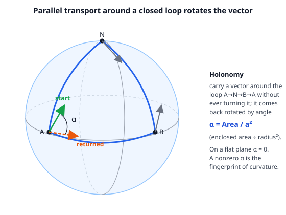

# Relativity (SR + GR) · Lesson 4.4: Covariant derivatives and Christoffel symbols

> ⏱ ~15 min · Module 4: The geometry of curved spacetime · Builds on: [4.2 Tensors on a manifold](#/lesson/relativity/04-02-tensors-on-manifolds.md), [4.3 The metric, proper time, and the line element](#/lesson/relativity/04-03-metric-proper-time.md) · Unlocks: the geodesic equation (4.5)

## Why this matters

In [4.2](#/lesson/relativity/04-02-tensors-on-manifolds.md) we hit a wall: the ordinary partial derivative $\partial_\mu V^\nu$ of a vector field is **not a tensor** on a curved manifold. That is fatal — every law of physics is a statement about how something changes (a gradient, a divergence, an equation of motion), and if "rate of change" isn't a tensor, we can't write a single covariant equation. This lesson builds the fix: the **covariant derivative** $\nabla_\mu$, which differentiates tensors and gives back tensors. Its machinery — the **Christoffel symbols** $\Gamma^\lambda_{\mu\nu}$ — is the last piece of geometry we need before we can write the geodesic equation, the curvature tensor, and eventually the Einstein equations. Everything downstream is $\nabla$ and $\Gamma$.

## The idea

Here is *why* $\partial_\mu V^\nu$ fails. A derivative compares a vector at one point to the vector at a neighboring point and takes the difference. But on a curved manifold — or even in flat space with curvy coordinates — **the basis vectors themselves change from point to point**. So when you compute $V^\nu(x+dx) - V^\nu(x)$, part of that change is the field genuinely changing, and part is just the ruler (the coordinate basis) twisting underneath you. The partial derivative blindly lumps the two together, and the second part is coordinate-artifact garbage that spoils the tensor transformation.

Think of stepping east along a line of latitude. Your "east" and "north" unit arrows rotate as you walk (that is what it means for the sphere to be curved, and also just what polar-type coordinates do). A vector whose components $V^\nu$ never change is still *turning in space*, because its basis is turning. To measure the **true** rate of change you must subtract off the part due to the twisting basis.

That correction term is exactly what the Christoffel symbols encode. $\Gamma^\lambda_{\mu\nu}$ answers: "when I step in direction $\mu$, how much of basis vector $\nu$ leaks into the direction $\lambda$?" Add the correction back and you get $\nabla_\mu$, the honest derivative — a tensor. The beautiful part: you don't have to know the $\Gamma$'s in advance. They are **computable from the metric alone**, because the metric already knows all the geometry.

## The formal version

*(Signature $(-,+,+,+)$ as always; the two-dimensional example metrics below are positive-definite so we can picture them, but every formula is identical in spacetime.)*

**The covariant derivative.** For a contravariant vector field,

$$\nabla_\mu V^\nu = \partial_\mu V^\nu + \Gamma^\nu_{\mu\lambda}\,V^\lambda.$$

*In words:* the naive change $\partial_\mu V^\nu$ **plus** a correction that undoes the basis twist. An **upper** index gets a $+\Gamma$ term. For a covector (lower index) the sign flips:

$$\nabla_\mu V_\nu = \partial_\mu V_\nu - \Gamma^\lambda_{\mu\nu}\,V_\lambda.$$

*In words:* a **lower** index gets a $-\Gamma$ term. The pattern generalizes: every index carries its own correction, $+\Gamma$ if up, $-\Gamma$ if down. For a mixed tensor,

$$\nabla_\mu T^{\nu}{}_{\rho} = \partial_\mu T^{\nu}{}_{\rho} + \Gamma^\nu_{\mu\lambda}T^{\lambda}{}_{\rho} - \Gamma^\lambda_{\mu\rho}T^{\nu}{}_{\lambda}.$$

The whole point of the added terms: while $\partial_\mu V^\nu$ transforms with a leftover inhomogeneous piece, $\Gamma$ transforms with an *equal and opposite* leftover, and the two cancel — so $\nabla_\mu V^\nu$ transforms as a genuine $(1,1)$ tensor. On a scalar there is no basis to twist, so $\nabla_\mu f = \partial_\mu f$.

**The Christoffel symbols from the metric.** Demand two natural conditions:

- **Metric compatibility:** $\nabla_\lambda g_{\mu\nu}=0$. In words: the covariant derivative leaves the ruler alone, so lengths and angles are preserved under transport, and $\nabla$ commutes with raising/lowering indices.
- **Torsion-free (symmetry):** $\Gamma^\lambda_{\mu\nu}=\Gamma^\lambda_{\nu\mu}$, symmetric in its two lower indices.

These two conditions pin the connection down **uniquely** (the **Levi-Civita connection**), and solving them gives the master formula:

$$\boxed{\;\Gamma^\lambda_{\mu\nu} = \tfrac{1}{2}\,g^{\lambda\sigma}\big(\partial_\mu g_{\nu\sigma} + \partial_\nu g_{\mu\sigma} - \partial_\sigma g_{\mu\nu}\big).\;}$$

*In words:* the connection is built entirely from first derivatives of the metric. Read the index bookkeeping as a recipe: the free upper index $\lambda$ is supplied by the inverse metric $g^{\lambda\sigma}$; inside the parentheses, the two lower indices $\mu,\nu$ each appear as a "$+$" derivative and there is one "$-$" derivative with $\partial_\sigma$ hitting $g_{\mu\nu}$. If the metric is constant (like flat $\eta_{\mu\nu}$ in Cartesian coordinates), every $\partial g=0$ and all $\Gamma=0$.

**Christoffels are not a tensor.** Despite the indices, $\Gamma^\lambda_{\mu\nu}$ does **not** transform as a tensor — its transformation law has an extra term built from *second* derivatives of the coordinate change. The concrete consequence: at any single point $p$ you can choose coordinates in which **all** $\Gamma^\lambda_{\mu\nu}(p)=0$ (a **local inertial frame** / Riemann normal coordinates). You cannot do that for a real tensor — if a tensor is zero in one frame it is zero in all. This "you can always transform gravity away at a point" is the mathematical face of the equivalence principle ([5.1](#/lesson/relativity/05-01-equivalence-principle.md)).

**Parallel transport.** To carry a vector along a curve $x^\mu(\lambda)$ "without turning it," demand its covariant derivative *along the curve* vanish:

$$\frac{dV^\mu}{d\lambda} + \Gamma^\mu_{\nu\rho}\,\frac{dx^\nu}{d\lambda}\,V^\rho = 0.$$

*In words:* the components $V^\mu$ are allowed to change only by exactly the amount needed to cancel the basis twist — anything more would be genuine turning. On a **curved** manifold, transporting a vector around a **closed loop** brings it back **rotated**. That rotation (the *holonomy*) is the unmistakable signature of curvature, and measuring it per unit area is precisely what the Riemann tensor does ([4.6](#/lesson/relativity/04-06-riemann-geodesic-deviation.md)).

## Picture

## Worked examples

**Example 1 (mechanical — Christoffels of flat space in polar coordinates).** The ordinary flat plane, written in polar coordinates $(r,\phi)$, has line element $ds^2=dr^2+r^2\,d\phi^2$, so $g_{rr}=1$, $g_{\phi\phi}=r^2$ (and $g^{rr}=1$, $g^{\phi\phi}=1/r^2$). The only nonconstant component is $g_{\phi\phi}$, with $\partial_r g_{\phi\phi}=2r$. Feed the formula:

$$\Gamma^r_{\phi\phi} = \tfrac12 g^{rr}\big(\partial_\phi g_{\phi r}+\partial_\phi g_{\phi r}-\partial_r g_{\phi\phi}\big) = \tfrac12(1)(0+0-2r) = -r,$$

$$\Gamma^\phi_{r\phi} = \Gamma^\phi_{\phi r} = \tfrac12 g^{\phi\phi}\big(\partial_r g_{\phi\phi}+\partial_\phi g_{r\phi}-\partial_\phi g_{r\phi}\big) = \tfrac12\cdot\frac{1}{r^2}\cdot 2r = \frac1r.$$

All others vanish. Note the punchline: **the space is flat, yet the Christoffels are nonzero.** They are not measuring curvature — they are measuring how the polar basis $(\hat r,\hat\phi)$ turns as you move. (Nonzero $\Gamma$'s are why "$\nabla^2$ in polar coordinates" grows those extra $\tfrac1r\partial_r$ and $\tfrac{1}{r^2}\partial_\phi^2$ terms you memorized in vector calculus — that is this machinery in disguise.)

**Example 2 (why you'd care — the divergence, done right).** In flat Cartesian space the divergence of a vector field is $\partial_\mu V^\mu$. On a manifold the covariant version is $\nabla_\mu V^\mu = \partial_\mu V^\mu + \Gamma^\mu_{\mu\lambda}V^\lambda$. There is a slick identity for the contracted Christoffel,

$$\Gamma^\mu_{\mu\lambda} = \partial_\lambda \ln\sqrt{|g|}\quad\Longrightarrow\quad \nabla_\mu V^\mu = \frac{1}{\sqrt{|g|}}\,\partial_\mu\!\big(\sqrt{|g|}\,V^\mu\big),$$

where $g=\det g_{\mu\nu}$. Check it in polar coordinates: $\sqrt{|g|}=\sqrt{1\cdot r^2}=r$, so $\nabla_\mu V^\mu = \tfrac1r\partial_r(r V^r)+\partial_\phi V^\phi$ — exactly the polar divergence from calculus, now derived rather than memorized. This is the form you use to write conservation laws ($\nabla_\mu T^{\mu\nu}=0$, [5.2](#/lesson/relativity/05-02-matter-curved-spacetime.md)) and Maxwell's equations on a curved background: **replace every $\partial$ by $\nabla$** (the "minimal coupling" rule), and physics carries over intact.

## Watch out

- **Christoffel symbols are not tensors — do not treat them as one.** You might think the up/down indices mean $\Gamma$ transforms like a $(1,2)$ tensor, but its transformation has an extra inhomogeneous term. That is *the whole reason* it can cancel the non-tensor part of $\partial_\mu V^\nu$ — a genuine tensor could never do that. And it is why $\Gamma=0$ at a point tells you nothing about curvature.
- **Nonzero $\Gamma$ does not mean curved space** (Example 1). Christoffels detect a twisting *coordinate basis*, which happens even on the flat plane. Curvature is what survives when you *can't* make $\Gamma$ vanish in a whole neighborhood — that invariant fact is the Riemann tensor ([4.6](#/lesson/relativity/04-06-riemann-geodesic-deviation.md)), built from derivatives of $\Gamma$, not $\Gamma$ itself.
- **Mind the sign and which index sits where.** Upper index $\to +\Gamma$, lower index $\to -\Gamma$. And $\Gamma^\lambda_{\mu\nu}$ is symmetric in $\mu\nu$ (torsion-free) but *never* assume symmetry involving the upper index. In the master formula the lone minus sign sits on the term where $\partial_\sigma$ (the index summed against the inverse metric) differentiates $g_{\mu\nu}$.

## One-liner

> The partial derivative isn't a tensor because the basis twists; add $\pm\Gamma$ (built from $\tfrac12 g^{\lambda\sigma}(\partial g+\partial g-\partial g)$) to cancel the twist, and $\nabla$ — plus the rotation it leaves after a closed loop — carries all of curved-space physics.

## Problems

**P1 (🟢)** For the 2-sphere of radius $a$ with metric $g_{\theta\theta}=a^2$, $g_{\phi\phi}=a^2\sin^2\theta$ (coordinates $(\theta,\phi)$, off-diagonal zero), compute **all** the nonzero Christoffel symbols from the master formula. (You should find exactly two independent ones.)

**P2 (🟡)** Verify $\Gamma^r_{\phi\phi}=-r$ for the flat plane in polar coordinates by writing out the master formula term by term (state which of the three derivative terms survive and why). Then, in one sentence, explain why this nonzero result does *not* contradict the plane being flat.

**P3 (🔴, optional)** Parallel-transport a vector once around the latitude circle $\theta=\theta_0$ (constant) on the unit-radius sphere ($a=1$), with $\phi$ running $0\to 2\pi$. Using the Christoffels from P1, (a) write the two parallel-transport equations for $V^\theta,V^\phi$; (b) convert to orthonormal components $A=V^\theta$, $B=\sin\theta_0\,V^\phi$ and show they rotate rigidly; (c) find the net rotation, and show the *geometric* holonomy equals the enclosed cap area divided by $a^2$.

Solutions

**P1** Inverse metric: $g^{\theta\theta}=1/a^2$, $g^{\phi\phi}=1/(a^2\sin^2\theta)$. The only nonconstant metric component is $g_{\phi\phi}=a^2\sin^2\theta$, with

$$\partial_\theta g_{\phi\phi}=2a^2\sin\theta\cos\theta,\qquad \text{(all other }\partial g=0).$$

*Compute $\Gamma^\theta_{\phi\phi}$* (so $\lambda=\theta$, and $g^{\theta\sigma}$ forces $\sigma=\theta$):

$$\Gamma^\theta_{\phi\phi}=\tfrac12 g^{\theta\theta}\big(\partial_\phi g_{\phi\theta}+\partial_\phi g_{\phi\theta}-\partial_\theta g_{\phi\phi}\big)=\tfrac12\cdot\frac{1}{a^2}\cdot\big(0+0-2a^2\sin\theta\cos\theta\big)=-\sin\theta\cos\theta.$$

*Compute $\Gamma^\phi_{\theta\phi}$* (so $\lambda=\phi$, $\sigma=\phi$; here $\mu=\theta,\nu=\phi$):

$$\Gamma^\phi_{\theta\phi}=\tfrac12 g^{\phi\phi}\big(\partial_\theta g_{\phi\phi}+\partial_\phi g_{\theta\phi}-\partial_\phi g_{\theta\phi}\big)=\tfrac12\cdot\frac{1}{a^2\sin^2\theta}\cdot 2a^2\sin\theta\cos\theta=\frac{\cos\theta}{\sin\theta}=\cot\theta.$$

By the $\mu\nu$ symmetry, $\Gamma^\phi_{\phi\theta}=\cot\theta$ too. Every other component vanishes (any Christoffel built only from $\partial g_{\theta\theta}$ is zero since $g_{\theta\theta}=a^2$ is constant; $\Gamma^\phi_{\phi\phi}\propto\partial_\phi g_{\phi\phi}=0$). So the complete list is

$$\Gamma^\theta_{\phi\phi}=-\sin\theta\cos\theta,\qquad \Gamma^\phi_{\theta\phi}=\Gamma^\phi_{\phi\theta}=\cot\theta.$$

(Note $\Gamma^\phi_{\theta\phi}$ blows up at the poles $\theta=0,\pi$ — a coordinate artifact of latitude/longitude, not a real singularity.)

**P2** With $g_{rr}=1$, $g_{\phi\phi}=r^2$, $g^{rr}=1$, and $\lambda=r$ (so $g^{r\sigma}$ forces $\sigma=r$), the master formula for $\mu=\nu=\phi$ is

$$\Gamma^r_{\phi\phi}=\tfrac12 g^{rr}\big(\underbrace{\partial_\phi g_{\phi r}}_{=0}+\underbrace{\partial_\phi g_{\phi r}}_{=0}-\underbrace{\partial_r g_{\phi\phi}}_{=2r}\big).$$

The first two terms vanish because $g_{\phi r}=0$ identically; only the $-\partial_r g_{\phi\phi}=-2r$ term survives, giving $\Gamma^r_{\phi\phi}=\tfrac12(1)(-2r)=-r$. This does not contradict flatness because Christoffel symbols measure the turning of the *coordinate basis* $(\hat r,\hat\phi)$, not curvature; the plane's curvature (the Riemann tensor, from derivatives of $\Gamma$) still comes out zero. Curvature is what you *cannot* remove by a coordinate choice — a single nonzero $\Gamma$ can always be killed at a point.

**P3** Set $a=1$, so from P1 $\Gamma^\theta_{\phi\phi}=-\sin\theta_0\cos\theta_0$ and $\Gamma^\phi_{\theta\phi}=\cot\theta_0$ along the curve. Parametrize by $\phi$; the tangent is $dx^\nu/d\phi=(0,1)$ in $(\theta,\phi)$, so the transport equation $\frac{dV^\mu}{d\phi}+\Gamma^\mu_{\phi\rho}V^\rho=0$ becomes:

(a) $\;\dfrac{dV^\theta}{d\phi}+\Gamma^\theta_{\phi\phi}V^\phi=0\;\Rightarrow\; \dfrac{dV^\theta}{d\phi}=\sin\theta_0\cos\theta_0\,V^\phi,$

$\quad\;\;\dfrac{dV^\phi}{d\phi}+\Gamma^\phi_{\phi\theta}V^\theta=0\;\Rightarrow\; \dfrac{dV^\phi}{d\phi}=-\cot\theta_0\,V^\theta.$

(b) The *orthonormal* (physical-length) components are $A=\sqrt{g_{\theta\theta}}\,V^\theta=V^\theta$ and $B=\sqrt{g_{\phi\phi}}\,V^\phi=\sin\theta_0\,V^\phi$ ($\theta_0$ constant, so the factors pass through the derivative):

$$A'=V^\theta{}'=\sin\theta_0\cos\theta_0\,V^\phi=\cos\theta_0\,(\sin\theta_0 V^\phi)=\cos\theta_0\,B,$$
$$B'=\sin\theta_0\,V^\phi{}'=-\sin\theta_0\cot\theta_0\,V^\theta=-\cos\theta_0\,V^\theta=-\cos\theta_0\,A.$$

So $(A,B)$ obey $A'=\cos\theta_0 B$, $B'=-\cos\theta_0 A$: a **rigid rotation** at constant angular rate $\cos\theta_0$. Indeed $A+iB=(A_0+iB_0)e^{-i\cos\theta_0\,\phi}$, so $\lvert V\rvert^2=A^2+B^2$ is conserved (metric compatibility in action).

(c) Over one circuit $\phi:0\to2\pi$, the vector rotates by $2\pi\cos\theta_0$ **relative to the local $(\hat\theta,\hat\phi)$ frame**. But that frame itself winds once ($2\pi$) around the pole as you go around the latitude, so relative to any non-winding reference the net *geometric* rotation is

$$\alpha=2\pi-2\pi\cos\theta_0=2\pi\big(1-\cos\theta_0\big).$$

The cap enclosed by the latitude circle has area $\text{Area}=\int_0^{\theta_0}\!\!\int_0^{2\pi} a^2\sin\theta\,d\phi\,d\theta=2\pi a^2(1-\cos\theta_0)$, so

$$\alpha=\frac{\text{Area}}{a^2}=(\text{enclosed solid angle}).$$

Checks: near the pole $\theta_0\to0$, area $\to0$ and $\alpha\to0$ (tiny loop, no rotation); a great circle at the equator $\theta_0=\tfrac\pi2$ gives $\alpha=2\pi\cdot 1=2\pi$ — a hemisphere's worth, i.e. area $2\pi a^2$ over $a^2$. The rotation is nonzero *only because the sphere is curved*: on a flat plane every closed loop returns the vector unchanged. This holonomy-per-area is exactly the Riemann curvature you build in [4.6](#/lesson/relativity/04-06-riemann-geodesic-deviation.md).

## Flashback

**From Lesson 4.3 (The metric, proper time, and the line element):** Using the same 2-sphere line element $ds^2=a^2\big(d\theta^2+\sin^2\theta\,d\phi^2\big)$, compute the *proper length* (circumference) of the latitude circle $\theta=\theta_0$, and of a full meridian ($\phi$ fixed, $\theta:0\to\pi$). Why is the latitude circle shorter than $2\pi a$?

Solution

Along the latitude circle $\theta=\theta_0$ is constant, so $d\theta=0$ and the line element collapses to $ds=a\sin\theta_0\,d\phi$. Integrate over the coordinate range:

$$L_{\text{lat}}=\int_0^{2\pi} a\sin\theta_0\,d\phi = 2\pi a\sin\theta_0.$$

Along a meridian $\phi$ is fixed, $d\phi=0$, so $ds=a\,d\theta$ and

$$L_{\text{mer}}=\int_0^{\pi} a\,d\theta=\pi a.$$

The latitude circle is shorter than $2\pi a$ (equaling it only at the equator, $\theta_0=\tfrac\pi2$) because although $\phi$ sweeps its full $2\pi$ range, the *metric distance per unit $\phi$* is $a\sin\theta_0<a$ off the equator — circles of latitude shrink toward the poles. This is the coordinate-vs-metric-distance distinction from 4.3: coordinate range alone tells you nothing; the metric supplies the conversion. (It is also the $a\sin\theta_0$ factor that showed up as the orthonormal weight on $V^\phi$ in P3.)

## Connections

- **Backward:** this repairs the defect flagged in [4.2](#/lesson/relativity/04-02-tensors-on-manifolds.md) (partials aren't tensors) using the metric from [4.3](#/lesson/relativity/04-03-metric-proper-time.md); the raising/lowering rules from [2.1](#/lesson/relativity/02-01-index-notation-minkowski-metric.md) now commute with $\nabla$ thanks to metric compatibility. In flat Cartesian coordinates all $\Gamma=0$ and $\nabla_\mu$ reduces to the $\partial_\mu$ of Modules 1–3.
- **Forward:** [4.5](#/lesson/relativity/04-05-geodesics.md) writes the geodesic equation $\frac{d^2x^\mu}{d\tau^2}+\Gamma^\mu_{\nu\rho}\frac{dx^\nu}{d\tau}\frac{dx^\rho}{d\tau}=0$ — literally "parallel-transport your own velocity"; [4.6](#/lesson/relativity/04-06-riemann-geodesic-deviation.md) builds the Riemann tensor from $\partial\Gamma$ to quantify the loop-rotation you just met; and the minimal-coupling rule $\partial\to\nabla$ carries every field equation onto curved spacetime ([5.2](#/lesson/relativity/05-02-matter-curved-spacetime.md)).
- **Sideways (vector calculus & analytical mechanics):** the polar-coordinate $\Gamma$'s of Example 1 are the hidden source of the extra terms in grad/div/curl and of the "fictitious" centrifugal/Coriolis terms in rotating-frame dynamics — the same "my basis is accelerating" bookkeeping that Christoffels systematize. The equivalence-principle statement "$\Gamma=0$ at a point" is the geometric version of choosing a freely-falling frame, developed in [5.1](#/lesson/relativity/05-01-equivalence-principle.md).
