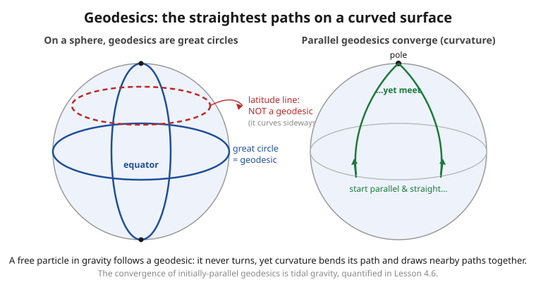

# Relativity (SR + GR) · Lesson 4.5: Geodesics

> ⏱ ~15 min · Module 4: The geometry of curved spacetime · Builds on: [4.3 The metric, proper time, and the line element](#/lesson/relativity/04-03-metric-proper-time.md), [4.4 Covariant derivatives and Christoffel symbols](#/lesson/relativity/04-04-covariant-derivative-christoffel.md) · Unlocks: the Riemann tensor and tidal forces (4.6), the Newtonian limit and gravitational redshift (5.5)

## Why this matters

There is a sentence that compresses all of general relativity: **matter tells spacetime how to curve; spacetime tells matter how to move.** Lesson 4.4 built the machinery for the first half — how to differentiate on a curved manifold. This lesson is the *second half*: given the curved geometry, how does a free particle actually move? The answer is startling in its economy. In GR there is **no gravitational force**. A planet orbiting the Sun, a ball you toss, a photon grazing a galaxy — none of them feel a force. They simply travel the straightest available path through a curved spacetime. That path is a **geodesic**, and the equation that governs it is the equation of motion for everything in free fall. Get this one equation and you can compute Mercury's orbit, the bending of starlight, and the fall of an apple — all as geometry, not force.

## The idea

On a flat plane, "straightest path" and "shortest path" both mean *straight line*, and a free particle with no force on it moves along one at constant speed — Newton's first law. Curve the surface and the two ideas need care, but the essence survives: a **geodesic** is the path that is *as straight as the surface allows*.

"As straight as possible" has a precise meaning you already met. In [4.4](#/lesson/relativity/04-04-covariant-derivative-christoffel.md) you learned to **parallel-transport** a vector — to carry it along a curve without turning it, relative to the geometry. A straight path is one that *carries its own direction*: at every step, the tangent vector points where parallel transport says "forward, unchanged." A geodesic is a curve that parallel-transports its own tangent. It never turns; it only goes wherever the curvature carries it.

There is a second, equivalent picture that is often easier to compute with. On a sphere, the great circles — the equator, the meridians — are the geodesics, and a great-circle arc is the *shortest* route between two points (why flights from New York to Tokyo bend over the Arctic). In spacetime the analogue has a twist of sign: a massive particle's worldline is the path of **longest proper time** between two events — the *most* aging, not the least. That is the twin paradox from [1.3](#/lesson/relativity/01-03-dilation-contraction-paradoxes.md) restated as geometry: the stay-at-home twin, who moves inertially, follows the geodesic and ages the most. Both pictures — "goes perfectly straight" and "extremizes proper time" — pick out the *same* curves, and they hand us the *same* equation.

## The formal version

Work in signature $(-,+,+,+)$, keep $c$ and $G$ explicit, and parametrize a worldline $x^\mu(\lambda)$ by a parameter $\lambda$ with tangent (velocity) vector $u^\mu = \dfrac{dx^\mu}{d\lambda}$.

**Definition 1 — the autoparallel (goes straight).** A curve is a geodesic if its tangent is parallel-transported along itself:

$$\nabla_u u = 0, \qquad\text{in components}\qquad u^\nu \nabla_\nu u^\mu = 0.$$

*In words:* the velocity never changes according to the covariant derivative — the curve never turns relative to the geometry.

**Unpacking it into the geodesic equation.** Recall from [4.4](#/lesson/relativity/04-04-covariant-derivative-christoffel.md) that $\nabla_\nu u^\mu = \partial_\nu u^\mu + \Gamma^\mu_{\nu\beta}u^\beta$, where $\Gamma^\mu_{\nu\beta}$ are the Christoffel symbols built from the metric. Contract with $u^\nu = dx^\nu/d\lambda$:

$$u^\nu\nabla_\nu u^\mu = \underbrace{\frac{dx^\nu}{d\lambda}\,\partial_\nu u^\mu}_{=\;du^\mu/d\lambda} + \Gamma^\mu_{\nu\beta}\,u^\nu u^\beta = \frac{d^2x^\mu}{d\lambda^2} + \Gamma^\mu_{\nu\beta}\frac{dx^\nu}{d\lambda}\frac{dx^\beta}{d\lambda}.$$

The first term collapsed by the chain rule: $\frac{dx^\nu}{d\lambda}\partial_\nu$ is just $\frac{d}{d\lambda}$ *along the curve*. Setting the whole thing to zero gives the **geodesic equation**:

$$\boxed{\;\frac{d^2x^\mu}{d\lambda^2} + \Gamma^\mu_{\alpha\beta}\,\frac{dx^\alpha}{d\lambda}\frac{dx^\beta}{d\lambda} = 0.\;}$$

*In words:* the acceleration you'd naively write down ($\ddot x^\mu$) is exactly cancelled by a term made of Christoffel symbols and velocities. That second term is the **entire content of "gravity."** In flat spacetime with Cartesian coordinates $\Gamma = 0$ and the equation reduces to $\ddot x^\mu = 0$ — a straight line, Newton's first law. Turn on curvature (or even just curvilinear coordinates) and $\Gamma$ is what bends the path.

**The Christoffel term is the "gravitational force" — but there is no force.** Compare with Newton, $m\ddot x^i = F^i$. The geodesic equation has the *same shape*, with $-m\,\Gamma^i_{\alpha\beta}\dot x^\alpha\dot x^\beta$ playing the role of force. The profound difference: $\Gamma$ is not a force acting *on* the particle — it is a property of the *geometry the particle lives in*, and it is independent of the particle's mass. That mass-independence is why all objects fall alike (Galileo's tower), and it is the equivalence principle ([5.1](#/lesson/relativity/05-01-equivalence-principle.md)) written as an equation.

**Affine parameter.** The clean boxed form only holds for special parametrizations called **affine**: those in which the tangent has constant "length" along the curve, so no extra term $\propto \dot x^\mu$ appears on the right. For a **massive** particle the natural affine parameter is its **proper time** $\tau$ (the metric time it actually experiences, from [4.3](#/lesson/relativity/04-03-metric-proper-time.md)); then $u^\mu = dx^\mu/d\tau$ is the four-velocity with $g_{\mu\nu}u^\mu u^\nu = -c^2$, a constant, as it must be. Any linear rescaling $\lambda = a\tau + b$ is also affine.

**Null geodesics (light).** A light ray has $ds^2 = 0$, so $d\tau = 0$ — proper time *stands still* along it and cannot parametrize the path. Instead use an affine parameter $\lambda$ (no physical clock, just a bookkeeping label). The same boxed equation governs the ray, and its tangent $k^\mu = dx^\mu/d\lambda$ is **null**: $g_{\mu\nu}k^\mu k^\nu = 0$ all along. Massive particles ride timelike geodesics; light rides null ones.

## Picture

## Worked examples

**Example 1 (mechanical — the Newtonian first law in disguise).** Take flat 2D space in polar coordinates $(r,\phi)$, metric $ds^2 = dr^2 + r^2 d\phi^2$. The only nonzero Christoffels are $\Gamma^r_{\phi\phi} = -r$ and $\Gamma^\phi_{r\phi}=\Gamma^\phi_{\phi r} = 1/r$. The geodesic equations are

$$\ddot r - r\,\dot\phi^2 = 0, \qquad \ddot\phi + \frac{2}{r}\,\dot r\,\dot\phi = 0.$$

The space is *flat* — geodesics are ordinary straight lines — yet the equations are nontrivial because polar coordinates are curvilinear. Check a straight line through the origin, $\phi = \text{const}$, $r = v\lambda$: then $\dot\phi = 0$, $\ddot\phi = 0$, $\ddot r = 0$, and both equations read $0 = 0$. ✓ The first term $\ddot r - r\dot\phi^2$ is exactly the radial acceleration $\ddot r - r\dot\phi^2$ from freshman mechanics — the "centrifugal" $-r\dot\phi^2$ is a Christoffel symbol in disguise. **Fictitious forces are Christoffel symbols.** This is the whole idea in miniature: what looks like a force can be pure geometry of the coordinates.

**Example 2 (why you'd care — geodesics feel no force).** Two people dispute whether an orbiting astronaut is "in free fall" or "held up by centrifugal force." Geometry settles it. The astronaut carries an accelerometer, which measures $a^\mu = u^\nu\nabla_\nu u^\mu$ — the *covariant* acceleration, the genuinely frame-independent one. If the astronaut is on a geodesic, this is **zero by definition**: the accelerometer reads nothing, the astronaut floats. Meanwhile *you*, standing on Earth's surface, are **not** on a geodesic — the ground pushes you off the free-fall path, and your accelerometer reads $9.8\ \text{m/s}^2$ upward. The counterintuitive verdict of GR: the person *falling* is unaccelerated; the person *standing still* is accelerating. "Weight" is the force the floor exerts to keep you off your geodesic. (This is the seed of [5.1](#/lesson/relativity/05-01-equivalence-principle.md), and why astronauts are weightless not because gravity is absent but because they are finally free to follow the geometry.)

## Watch out

- **A geodesic is not automatically the *shortest* path.** For spacelike separations it extremizes length (often a minimum, like the great circle). But for a **massive** particle's timelike worldline the geodesic is the path of *longest* proper time — the twin who travels inertially ages the *most*. The variational principle finds a stationary point ($\delta\int d\tau = 0$), and the sign of the metric flips "min" to "max." Say **extremal**, not "shortest," unless you've checked which.
- **You might think the $\Gamma$ term is a real force you could shield against.** It isn't — it's not even a tensor (it vanishes in a freely-falling frame at any chosen point). No experiment *at a point* can distinguish "free fall in gravity" from "floating in empty space." What curvature *does* leave behind, un-transformable-away, is the **relative** acceleration of nearby geodesics (the right panel of the figure) — that is genuine tidal gravity, and it's the subject of [4.6](#/lesson/relativity/04-06-riemann-geodesic-deviation.md).
- **Don't try to use proper time to parametrize a light ray.** Light has $d\tau = 0$; dividing by it is dividing by zero. Switch to an affine $\lambda$ and remember its tangent is null, $g_{\mu\nu}k^\mu k^\nu = 0$, not $-c^2$.

## One-liner

> A geodesic is the path that parallel-transports its own tangent — $\ddot x^\mu + \Gamma^\mu_{\alpha\beta}\dot x^\alpha \dot x^\beta = 0$ — and free particles follow it not because a force pushes them, but because it is the straightest road through curved spacetime.

## Problems

**P1 (🟢)** The 2-sphere of radius $a$ has metric $ds^2 = a^2(d\theta^2 + \sin^2\theta\,d\phi^2)$, with nonzero Christoffel symbols (from [4.4](#/lesson/relativity/04-04-covariant-derivative-christoffel.md)) $\Gamma^\theta_{\phi\phi} = -\sin\theta\cos\theta$ and $\Gamma^\phi_{\theta\phi} = \Gamma^\phi_{\phi\theta} = \cot\theta$. (a) Write out the two geodesic equations (for $\theta$ and $\phi$). (b) Verify that the **equator** — $\theta = \pi/2$ held constant, with $\phi = \omega\lambda$ traversed at constant rate — satisfies both, i.e. is a geodesic.

**P2 (🟡)** Derive the geodesic equation from the variational principle. Extremize the "energy" functional $S = \int L\,d\lambda$ with $L = g_{\mu\nu}(x)\,\dot x^\mu \dot x^\nu$ (dots are $d/d\lambda$) using the Euler–Lagrange equation from [analytical-mechanics 1.1](#/lesson/analytical-mechanics/01-01-calculus-of-variations.md), $\frac{d}{d\lambda}\frac{\partial L}{\partial \dot x^\sigma} - \frac{\partial L}{\partial x^\sigma} = 0$, and show the result is $\ddot x^\rho + \Gamma^\rho_{\alpha\beta}\dot x^\alpha\dot x^\beta = 0$.

**P3 (🔴, optional)** *The Newtonian limit — recovering $\mathbf a = -\nabla\Phi$.* Consider a slowly-moving particle ($|dx^i/d\tau| \ll c\,dt/d\tau$) in a weak, static field with metric $g_{\mu\nu} = \eta_{\mu\nu} + h_{\mu\nu}$, $|h_{\mu\nu}|\ll 1$, $\partial_t g_{\mu\nu} = 0$, and $g_{00} = -\big(1 + 2\Phi/c^2\big)$ for some function $\Phi(\mathbf x)$. Starting from the geodesic equation with $\lambda = \tau$, show that the spatial equations reduce to

$$\frac{d^2 x^i}{dt^2} = -\,\partial_i \Phi,$$

so $\Phi$ is exactly the Newtonian gravitational potential. (This is the calculation, previewed here, that [5.5](#/lesson/relativity/05-05-newtonian-limit-redshift.md) does in full.)

Solutions

**P1** (a) With coordinates $(x^1,x^2) = (\theta,\phi)$ and only $\Gamma^\theta_{\phi\phi}$, $\Gamma^\phi_{\theta\phi}=\Gamma^\phi_{\phi\theta}$ nonzero, the geodesic equation $\ddot x^\mu + \Gamma^\mu_{\alpha\beta}\dot x^\alpha\dot x^\beta = 0$ gives, for $\mu=\theta$ (only the $\alpha=\beta=\phi$ term survives):

$$\ddot\theta + \Gamma^\theta_{\phi\phi}\,\dot\phi^2 = \ddot\theta - \sin\theta\cos\theta\,\dot\phi^2 = 0,$$

and for $\mu=\phi$ (the two equal off-diagonal terms combine into a factor of 2):

$$\ddot\phi + 2\,\Gamma^\phi_{\theta\phi}\,\dot\theta\,\dot\phi = \ddot\phi + 2\cot\theta\,\dot\theta\,\dot\phi = 0.$$

(b) On the proposed path $\theta \equiv \pi/2$ (so $\dot\theta = \ddot\theta = 0$) and $\phi = \omega\lambda$ (so $\dot\phi = \omega$, $\ddot\phi = 0$). Substitute:

- $\theta$-equation: $\ddot\theta - \sin\theta\cos\theta\,\dot\phi^2 = 0 - \sin\tfrac{\pi}{2}\cos\tfrac{\pi}{2}\,\omega^2 = 0 - (1)(0)\,\omega^2 = 0.$ ✓
- $\phi$-equation: $\ddot\phi + 2\cot\theta\,\dot\theta\,\dot\phi = 0 + 2\cot\tfrac{\pi}{2}\,(0)\,\omega = 0.$ ✓

Both hold, so the equator at constant rate is a geodesic. The decisive fact is $\cos(\pi/2)=0$: it kills the term that would otherwise drive $\ddot\theta \neq 0$. Any *other* line of latitude ($\theta \neq \pi/2$) has $\sin\theta\cos\theta \neq 0$, so it would need $\ddot\theta = \sin\theta\cos\theta\,\omega^2 \neq 0$ — impossible while $\theta$ stays constant. That is the precise sense in which "latitudes are not geodesics" (the figure's dashed red circle), while the equator is. By the rotational symmetry of the sphere, *any* great circle can be rotated onto the equator, so all great circles — and only great circles — are geodesics.

**P2** With $L = g_{\mu\nu}(x)\,\dot x^\mu\dot x^\nu$, compute the two pieces of Euler–Lagrange.

*Momentum piece.* Only the two explicit $\dot x$ factors respond to $\partial/\partial \dot x^\sigma$; using $\partial \dot x^\mu/\partial \dot x^\sigma = \delta^\mu_\sigma$ and the symmetry $g_{\mu\nu}=g_{\nu\mu}$,

$$\frac{\partial L}{\partial \dot x^\sigma} = g_{\mu\nu}\big(\delta^\mu_\sigma \dot x^\nu + \dot x^\mu \delta^\nu_\sigma\big) = 2\,g_{\sigma\nu}\dot x^\nu.$$

Now $\frac{d}{d\lambda}$ of this. The metric depends on $\lambda$ only through $x(\lambda)$, so $\frac{d}{d\lambda}g_{\sigma\nu} = \partial_\alpha g_{\sigma\nu}\,\dot x^\alpha$:

$$\frac{d}{d\lambda}\frac{\partial L}{\partial \dot x^\sigma} = 2\,\partial_\alpha g_{\sigma\nu}\,\dot x^\alpha\dot x^\nu + 2\,g_{\sigma\nu}\ddot x^\nu.$$

*Potential piece.* Here the metric's explicit $x$-dependence is differentiated:

$$\frac{\partial L}{\partial x^\sigma} = \partial_\sigma g_{\mu\nu}\,\dot x^\mu\dot x^\nu.$$

*Assemble* Euler–Lagrange, $\frac{d}{d\lambda}\frac{\partial L}{\partial \dot x^\sigma} - \frac{\partial L}{\partial x^\sigma}=0$:

$$2\,g_{\sigma\nu}\ddot x^\nu + 2\,\partial_\alpha g_{\sigma\nu}\,\dot x^\alpha\dot x^\nu - \partial_\sigma g_{\mu\nu}\,\dot x^\mu\dot x^\nu = 0.$$

The middle term is contracted against the symmetric $\dot x^\alpha\dot x^\nu$, so replace it by its symmetric part in $(\alpha,\nu)$: $\;2\,\partial_\alpha g_{\sigma\nu} \to \partial_\alpha g_{\sigma\nu} + \partial_\nu g_{\sigma\alpha}$. Renaming the dummies $\mu,\nu\to\alpha,\nu$ in the last term too,

$$2\,g_{\sigma\nu}\ddot x^\nu + \big(\partial_\alpha g_{\sigma\nu} + \partial_\nu g_{\sigma\alpha} - \partial_\sigma g_{\alpha\nu}\big)\dot x^\alpha\dot x^\nu = 0.$$

Divide by 2 and contract with the inverse metric $g^{\rho\sigma}$ (using $g^{\rho\sigma}g_{\sigma\nu} = \delta^\rho_\nu$):

$$\ddot x^\rho + \tfrac12 g^{\rho\sigma}\big(\partial_\alpha g_{\sigma\nu} + \partial_\nu g_{\sigma\alpha} - \partial_\sigma g_{\alpha\nu}\big)\dot x^\alpha\dot x^\nu = 0.$$

The parenthetical factor is *exactly* the Christoffel symbol $\Gamma^\rho_{\alpha\nu} = \tfrac12 g^{\rho\sigma}(\partial_\alpha g_{\sigma\nu} + \partial_\nu g_{\sigma\alpha} - \partial_\sigma g_{\alpha\nu})$ from [4.4](#/lesson/relativity/04-04-covariant-derivative-christoffel.md). Hence $\ddot x^\rho + \Gamma^\rho_{\alpha\nu}\dot x^\alpha\dot x^\nu = 0$. ✓ (Using the quadratic $L$ rather than $\sqrt{L}$ is what makes $\lambda$ come out affine automatically — the square root would produce an extra $\propto \dot x^\rho$ term unless you rescale.)

**P3** Start from $\ddot x^\mu + \Gamma^\mu_{\alpha\beta}\dot x^\alpha\dot x^\beta = 0$ with $\lambda = \tau$ (dots now $d/d\tau$).

*Slow motion.* The four-velocity components are $\dot x^0 = c\,\dfrac{dt}{d\tau}$ and $\dot x^i = \dfrac{dx^i}{d\tau}$, and by assumption $|\dot x^i| \ll |\dot x^0|$. So in the sum $\Gamma^\mu_{\alpha\beta}\dot x^\alpha\dot x^\beta$, the dominant term is $\alpha=\beta=0$; keep only it:

$$\ddot x^\mu + \Gamma^\mu_{00}\,(\dot x^0)^2 \approx 0.$$

*The relevant Christoffel.* From the definition, $\Gamma^\mu_{00} = \tfrac12 g^{\mu\lambda}(\partial_0 g_{\lambda 0} + \partial_0 g_{0\lambda} - \partial_\lambda g_{00})$. The field is **static**, so $\partial_0 g_{\lambda 0} = \partial_0 g_{0\lambda} = 0$, leaving

$$\Gamma^\mu_{00} = -\tfrac12\, g^{\mu\lambda}\,\partial_\lambda g_{00}.$$

To leading order in the small $h_{\mu\nu}$, replace $g^{\mu\lambda}\to \eta^{\mu\lambda}$. Take the spatial components $\mu = i$: since $\eta^{i\lambda}$ is nonzero only for $\lambda = i$ (spatial) with value $\eta^{ij}=\delta^{ij}$,

$$\Gamma^i_{00} = -\tfrac12\,\eta^{ij}\,\partial_j g_{00} = -\tfrac12\,\partial_i g_{00}.$$

Now insert $g_{00} = -\big(1 + 2\Phi/c^2\big)$, so $\partial_i g_{00} = -\dfrac{2}{c^2}\partial_i\Phi$, giving

$$\Gamma^i_{00} = -\tfrac12\left(-\frac{2}{c^2}\partial_i\Phi\right) = \frac{1}{c^2}\,\partial_i\Phi.$$

*Assemble the spatial equation* ($\mu = i$), using $\dot x^0 = c\,dt/d\tau$:

$$\frac{d^2x^i}{d\tau^2} + \frac{1}{c^2}\,\partial_i\Phi\left(c\,\frac{dt}{d\tau}\right)^2 = 0 \quad\Longrightarrow\quad \frac{d^2x^i}{d\tau^2} = -\,\partial_i\Phi\left(\frac{dt}{d\tau}\right)^2.$$

*Convert $\tau \to t$.* The $\mu=0$ equation is $\ddot x^0 + \Gamma^0_{00}(\dot x^0)^2 = 0$ with $\Gamma^0_{00} = -\tfrac12\eta^{00}\partial_0 g_{00} = 0$ (static field, and $\eta^{0i}=0$), so $d^2x^0/d\tau^2 = 0$: $\,dt/d\tau$ is **constant** to this order (in fact $dt/d\tau \approx 1$, since $g_{\mu\nu}\dot x^\mu\dot x^\nu = -c^2$ with $v\ll c$, $\Phi/c^2\ll 1$). Then $\dfrac{d^2x^i}{d\tau^2} = \left(\dfrac{dt}{d\tau}\right)^2\dfrac{d^2x^i}{dt^2}$, and the two factors of $(dt/d\tau)^2$ cancel:

$$\frac{d^2 x^i}{dt^2} = -\,\partial_i\Phi, \qquad\text{i.e.}\qquad \ddot{\mathbf x} = -\nabla\Phi. \;\checkmark$$

Newton's law of gravitation, recovered as the slow-motion, weak-field shadow of the geodesic equation — and it pins down the physical meaning of the metric: the tiny deviation of $g_{00}$ from its flat value $-1$ *is* the Newtonian potential, $g_{00} = -(1+2\Phi/c^2)$. For Earth's surface $\Phi/c^2 \sim 10^{-9}$, a whisper of curvature that nonetheless holds you to the ground.

## Flashback

**From Lesson 1.4 (Spacetime, the invariant interval, and causality):** In an inertial frame, event $A$ occurs at the origin and event $B$ at $t = 5\ \text{s}$, $x = 3$ light-seconds (with $y=z=0$). (a) Is the separation timelike, spacelike, or null? (b) Compute the proper time a clock reads moving inertially (constant velocity) straight from $A$ to $B$. (c) In one sentence, connect the answer to this lesson: how does that number compare to the proper time on any *other* worldline between $A$ and $B$?

Solution

(a) The invariant interval (signature $(-,+,+,+)$) is $\Delta s^2 = -c^2\Delta t^2 + \Delta x^2$. With $c\,\Delta t = 5$ light-seconds and $\Delta x = 3$ light-seconds, $\Delta s^2 = -(5)^2 + (3)^2 = -25 + 9 = -16\ (\text{light-s})^2 < 0$ — **timelike**, so a massive clock can travel from $A$ to $B$.

(b) Proper time along the straight (constant-velocity) worldline is $c^2\Delta\tau^2 = -\Delta s^2 = c^2\Delta t^2 - \Delta x^2$, so

$$\Delta\tau = \sqrt{\Delta t^2 - \Delta x^2/c^2} = \sqrt{(5)^2 - (3)^2} = \sqrt{25 - 9} = \sqrt{16} = 4\ \text{s}.$$

(A clean $3$–$4$–$5$: the moving clock reads $4$ s while the coordinate time is $5$ s — time dilation, seen as pure geometry.)

(c) The straight worldline is the **timelike geodesic** of flat spacetime, and it records the **longest** proper time of any path between $A$ and $B$: any accelerated (bent) worldline connecting the same two events reads *less* than $4$ s. That "longest proper time" is exactly Definition 2 of a geodesic — and the twin paradox is this inequality wearing a story.

## Connections

- **Backward:** this is [4.4](#/lesson/relativity/04-04-covariant-derivative-christoffel.md)'s parallel transport applied to a curve's own tangent ($\nabla_u u = 0$), and its variational face is the action principle of [analytical-mechanics 1.1–1.2](#/lesson/analytical-mechanics/01-02-least-action-lagrange.md): a geodesic extremizes $\int d\tau$ the way a classical trajectory extremizes the action. The flat-space, straight-line case is Newton's first law from [1.4](#/lesson/relativity/01-04-spacetime-interval-causality.md).
- **Forward:** a single geodesic can be straightened away at a point (Example 2); what *cannot* be removed is how two neighboring geodesics drift — **geodesic deviation** and the Riemann tensor in [4.6](#/lesson/relativity/04-06-riemann-geodesic-deviation.md) (the figure's right panel). The Newtonian-limit calculation of P3 is completed, with gravitational redshift, in [5.5](#/lesson/relativity/05-05-newtonian-limit-redshift.md), and geodesics of the Schwarzschild metric give Mercury's precession and light bending in [6.2](#/lesson/relativity/06-02-orbits-precession-light-bending.md) — the astrophysical payoffs (black-hole orbits, lensing) live in [astrophysics 4.3](#/lesson/astrophysics/04-03-black-holes-astrophysics.md).
- **Sideways (analytical mechanics):** "free motion = extremal path" is the same variational logic as least action; the geodesic Lagrangian $g_{\mu\nu}\dot x^\mu\dot x^\nu$ is literally a kinetic-energy quadratic form, so GR's equation of motion *is* an Euler–Lagrange equation. The Christoffel "force" is the general-relativistic cousin of the centrifugal/Coriolis fictitious forces that appear in rotating frames of Newtonian mechanics.
