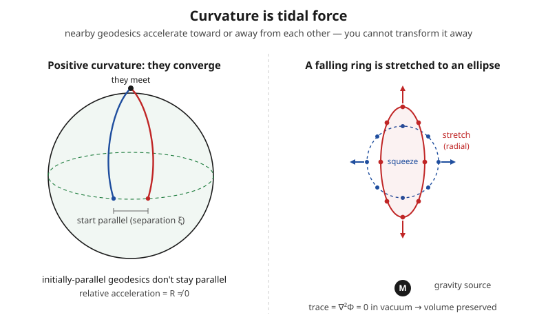

# Relativity (SR + GR) · Lesson 4.6: The Riemann curvature tensor and geodesic deviation

> ⏱ ~15 min · Module 4: The geometry of curved spacetime · Builds on: [4.4 Covariant derivatives & Christoffel symbols](#/lesson/relativity/04-04-covariant-derivative-christoffel.md), [4.5 Geodesics](#/lesson/relativity/04-05-geodesics.md), [4.3 The metric & proper time](#/lesson/relativity/04-03-metric-proper-time.md) · Unlocks: 4.7 (Ricci, scalar curvature & the Einstein tensor) — the contractions of Riemann the field equations actually use

## Why this matters

You already saw in [4.4](#/lesson/relativity/04-04-covariant-derivative-christoffel.md) that Christoffel symbols are **not** curvature: they're coordinate bookkeeping, and at any single point you can choose coordinates (a freely-falling frame) that make *all* of them vanish. So what is the honest, coordinate-proof fact that says spacetime is genuinely bent and not just badly labeled? That fact is the **Riemann curvature tensor** — and its physical face is something you can feel: **tidal force**. A person falling into a black hole feels weightless overall (the field is gauged away in their frame), yet is stretched head-to-toe because their head and feet fall along slightly *different* geodesics that pull apart. That stretching cannot be transformed away in any frame, and it is exactly the Riemann tensor at work. This is the mathematical hinge of GR: it is what distinguishes real gravity from mere acceleration (the equivalence principle, [5.1](#/lesson/relativity/05-01-equivalence-principle.md)), and one contraction of it ([4.7](#/lesson/relativity/04-07-ricci-einstein-tensor.md)) becomes the left-hand side of Einstein's equations.

Throughout, signature $(-,+,+,+)$; Greek indices run $0,1,2,3$. The purely spatial example surfaces (the sphere, the plane) are Riemannian (positive-definite), but the formulas are identical. We keep $c$ and $G$ explicit.

## The idea

Take a vector and **parallel-transport it around a tiny closed loop** — carry it "as straight as possible" (the [4.4](#/lesson/relativity/04-04-covariant-derivative-christoffel.md) prescription) out along one edge, across, back, and home. On a flat surface it returns unchanged. On a curved one — a sphere — it comes back **rotated**. That leftover rotation (the *holonomy* from 4.4) is the whole story: **curvature is how much a vector turns when parallel-transported around an infinitesimal loop, per unit area enclosed.** No rotation anywhere means flat; nonzero rotation means curved, and no relabeling of coordinates can hide it, because "did the vector come back pointing the same way?" is a yes/no question with no reference to any chart.

The Riemann tensor is just this loop-rotation packaged with indices: two indices ($\mu\nu$) say which little coordinate loop you went around, and the other two ($\rho{}_\sigma$) say "you fed in a vector pointing along $\sigma$ and it picked up a component along $\rho$."

The same object has a second, more visceral face. Two nearby particles in free fall each follow a geodesic. If spacetime is flat, geodesics that start parallel *stay* parallel — their separation drifts at most linearly. If it's curved, the separation **accelerates**: the geodesics bend toward each other (sphere) or apart. That relative acceleration of neighboring free-fallers is **tidal force**, and it is governed by the very same Riemann tensor. Loop-rotation and tidal acceleration are two readings of one measurement.

## The formal version

**Riemann via the commutator of covariant derivatives.** For an ordinary derivative, order doesn't matter: $\partial_\mu\partial_\nu = \partial_\nu\partial_\mu$. For the covariant derivative on a curved manifold, it does — and the failure is exactly the curvature:

$$[\nabla_\mu,\nabla_\nu]V^\rho = \nabla_\mu\nabla_\nu V^\rho - \nabla_\nu\nabla_\mu V^\rho = R^\rho{}_{\sigma\mu\nu}\,V^\sigma$$

(for a torsion-free, metric-compatible connection — the one 4.4 built). **In words:** the amount by which "differentiate in $\mu$ then $\nu$" disagrees with "$\nu$ then $\mu$" is a linear machine $R^\rho{}_{\sigma\mu\nu}$ acting on the vector — and that disagreement is precisely the net rotation from carrying $V$ around the little $\mu$–$\nu$ loop. Because the left side is manifestly a tensor (a commutator of tensor operations, with no surviving loose derivative of $V$), $R^\rho{}_{\sigma\mu\nu}$ **is a genuine tensor** — unlike the $\Gamma$'s it's built from.

**The formula in Christoffels.** Expanding the commutator gives Riemann entirely in terms of the connection (this lesson uses Carroll's sign convention):

$$R^\rho{}_{\sigma\mu\nu} = \partial_\mu\Gamma^\rho{}_{\nu\sigma} - \partial_\nu\Gamma^\rho{}_{\mu\sigma} + \Gamma^\rho{}_{\mu\lambda}\Gamma^\lambda{}_{\nu\sigma} - \Gamma^\rho{}_{\nu\lambda}\Gamma^\lambda{}_{\mu\sigma}.$$

**In words:** curvature is built from the Christoffels' *first derivatives* ($\partial\Gamma$) plus their *products* ($\Gamma\Gamma$) — and since $\Gamma$ is itself first derivatives of the metric, **Riemann is second derivatives of the metric.** This is why you can't kill it at a point by choosing coordinates: you can set $\Gamma = 0$ at a point (zero first derivatives), but not the *second* derivatives everywhere around it.

**The flatness theorem.** $R^\rho{}_{\sigma\mu\nu} = 0$ *everywhere* in a region $\iff$ that region is flat — i.e. coordinates exist making $g_{\mu\nu}$ constant ($\eta_{\mu\nu}$ in the Lorentzian case) throughout. **In words:** curvature is the complete, coordinate-independent test for flatness. A messy metric with a mess of Christoffels is still flat if its Riemann tensor vanishes — the mess was just bad coordinates (P2 is exactly this).

**Symmetries (with all indices lowered, $R_{\rho\sigma\mu\nu} = g_{\rho\lambda}R^\lambda{}_{\sigma\mu\nu}$).** Riemann has far fewer independent components than its $4^4 = 256$ slots suggest:

$$R_{\rho\sigma\mu\nu} = -R_{\sigma\rho\mu\nu} = -R_{\rho\sigma\nu\mu}, \qquad R_{\rho\sigma\mu\nu} = R_{\mu\nu\rho\sigma}, \qquad R_{\rho[\sigma\mu\nu]} = 0.$$

**In words:** antisymmetric in the first pair, antisymmetric in the last pair, symmetric under swapping the two pairs, and the totally-antisymmetric part on the last three indices vanishes (the **first Bianchi identity**, $R_{\rho\sigma\mu\nu}+R_{\rho\mu\nu\sigma}+R_{\rho\nu\sigma\mu}=0$). Together these cut the count to $\tfrac{1}{12}n^2(n^2-1)$ independent components in $n$ dimensions: **$20$ in 4D**, and just **$1$ in 2D** — which is why a surface's curvature is a single number (Gaussian curvature).

**Geodesic deviation — the physical face.** Let $\xi^\mu$ be the separation vector between two neighboring geodesics, each with four-velocity $u^\mu = dx^\mu/d\tau$. Then the separation's second covariant derivative along the worldline obeys

$$\frac{D^2\xi^\mu}{d\tau^2} = -R^\mu{}_{\nu\rho\sigma}\,u^\nu\,\xi^\rho\,u^\sigma.$$

**In words:** the *relative acceleration* of two nearby free-falling particles is Riemann contracted with their velocity and separation — **tidal acceleration is curvature.** If $R = 0$, nearby free-fallers have zero relative acceleration (uniform fields drift, never focus); if $R \neq 0$, they converge or diverge, and *that* is what a real gravitational field does and a uniformly accelerating rocket cannot fake ([5.1](#/lesson/relativity/05-01-equivalence-principle.md)).

**The Newtonian limit.** For weak, slow, static gravity with potential $\Phi$, the four-velocity is $u^\mu\approx(c,0,0,0)$ and $\tau\approx t$, so the spatial part of geodesic deviation reduces to $\ddot\xi^i = -R^i{}_{0j0}\,c^2\,\xi^j$. Matching the Newtonian tidal law $\ddot\xi^i = -\partial_i\partial_j\Phi\,\xi^j$ (P3) identifies

$$R^i{}_{0j0} \approx \frac{1}{c^2}\,\partial_i\partial_j\Phi.$$

**In words:** the object $\partial_i\partial_j\Phi$ — the Newtonian **tidal tensor** — is the weak-field shadow of Riemann. Newtonian gravity already had curvature hiding inside its tides; GR just named it.

## Picture

Two readings of one tensor. **Left:** two meridians leave the equator perfectly parallel yet meet at the pole — initially-parallel geodesics don't stay parallel, and the rate at which they focus *is* the curvature. **Right:** a ring of dust released in free fall near a mass is stretched along the radial direction and squeezed transversely — a real gravitational field, felt as tides. In vacuum the stretch and squeezes cancel in trace ($\nabla^2\Phi = 0$), so the ellipse has the same area (volume in 3D) as the circle: shape distorts, size is preserved.

## Worked examples

**Example 1 (mechanical — reading the symmetries, and why 2D curvature is one number).** Look straight at the Christoffel formula and swap $\mu\leftrightarrow\nu$:

$$R^\rho{}_{\sigma\nu\mu} = \partial_\nu\Gamma^\rho{}_{\mu\sigma} - \partial_\mu\Gamma^\rho{}_{\nu\sigma} + \Gamma^\rho{}_{\nu\lambda}\Gamma^\lambda{}_{\mu\sigma} - \Gamma^\rho{}_{\mu\lambda}\Gamma^\lambda{}_{\nu\sigma} = -R^\rho{}_{\sigma\mu\nu}.$$

Every term flipped sign: **antisymmetry in the last pair falls straight out of the definition.** Now count in 2D (indices $\in\{1,2\}$). Antisymmetry in the first pair *and* the last pair means each pair must be the ordered set $\{1,2\}$ — only $R_{1212}$ (and its sign-flips $R_{2112}, R_{1221}, R_{2121}$) can be nonzero. Pair-symmetry $R_{1212}=R_{1212}$ adds nothing new, and the Bianchi identity is automatically satisfied. So **a 2D surface has exactly one independent curvature component** — the single number that P1 computes for the sphere and P2 shows vanishes for the plane. The formula $\tfrac{1}{12}n^2(n^2-1)$ gives $\tfrac{1}{12}\cdot4\cdot3 = 1$. ✓

**Example 2 (why you'd care — the tidal ellipsoid of a point mass).** Take the Newtonian field of a point mass, $\Phi = -GM/r$, and build its tidal tensor $\partial_i\partial_j\Phi$. From $\partial_i\Phi = GM\,x_i/r^3$,

$$\partial_i\partial_j\Phi = GM\left(\frac{\delta_{ij}}{r^3} - \frac{3x_ix_j}{r^5}\right).$$

Evaluate in a frame with the radial direction along axis 1. Then $x_ix_j/r^2 = \mathrm{diag}(1,0,0)$, and

$$\partial_i\partial_j\Phi = \frac{GM}{r^3}\,\mathrm{diag}(1-3,\;1,\;1) = \frac{GM}{r^3}\,\mathrm{diag}(-2,\,+1,\,+1).$$

The relative acceleration is $-\partial_i\partial_j\Phi\,\xi^j$, so the eigenvalues of the *acceleration* tensor are $\tfrac{GM}{r^3}(+2,-1,-1)$: **radial stretch** $+\tfrac{2GM}{r^3}\xi_\parallel$ (outward, toward and away from the mass) and **transverse squeeze** $-\tfrac{GM}{r^3}\xi_\perp$ on each of the two perpendicular directions. That is the right panel of the Picture — the circle deforms into a prolate ellipse. And the trace is zero: $-2+1+1=0$, i.e. $\nabla^2\Phi = 0$ in vacuum, so the ellipsoid preserves volume. (Fill the region with mass and the trace becomes $-\nabla^2\Phi = -4\pi G\rho \neq 0$ — the volume of a dust ball starts to shrink, which is the Newtonian seed of the Einstein equation. The trace of the tidal tensor is the Ricci piece of [4.7](#/lesson/relativity/04-07-ricci-einstein-tensor.md).)

## Watch out

- **You might think nonzero Christoffels mean curved space.** They don't. Flat 2D space in *polar* coordinates has $\Gamma^r{}_{\phi\phi} = -r$ and $\Gamma^\phi{}_{r\phi} = 1/r$ — busy Christoffels — yet its Riemann tensor is identically zero (P2). Christoffels are coordinate artifacts; curvature is the coordinate-invariant residue built from their *derivatives*. Only $R = 0$ everywhere certifies flatness.
- **You might think the equivalence principle lets you transform gravity away entirely.** It only erases the field ($\Gamma$) at a *single point* — a free-faller feels weightless *there*. It cannot erase the field's *variation* across a finite body: the Riemann tensor. Head-vs-feet stretching survives every coordinate change. This is the honest boundary of "gravity = acceleration," and precisely what makes gravity geometry rather than a force ([5.1](#/lesson/relativity/05-01-equivalence-principle.md)).
- **You might think curvature conventions are universal.** They aren't — textbooks differ in the overall sign of $R^\rho{}_{\sigma\mu\nu}$ and in index ordering. We use Carroll's ($R^\rho{}_{\sigma\mu\nu} = \partial_\mu\Gamma^\rho{}_{\nu\sigma} - \dots$). Always check a source's convention before copying a formula, or a factor or sign will bite you in the Ricci contraction.

## One-liner

> Curvature is the rotation a vector suffers around a tiny loop, and its physical face is tidal force — the relative acceleration of nearby free-fallers, $D^2\xi^\mu/d\tau^2 = -R^\mu{}_{\nu\rho\sigma}u^\nu\xi^\rho u^\sigma$ — and no coordinate change can make it vanish.

## Problems

**P1 (🟢)** For the 2-sphere of radius $a$, metric $ds^2 = a^2(d\theta^2 + \sin^2\theta\,d\phi^2)$, the nonzero Christoffels are $\Gamma^\theta{}_{\phi\phi} = -\sin\theta\cos\theta$ and $\Gamma^\phi{}_{\theta\phi} = \Gamma^\phi{}_{\phi\theta} = \cot\theta$. Compute $R^\theta{}_{\phi\theta\phi}$ from the Christoffel formula. Then lower the first index and form the Gaussian curvature $K = R_{\theta\phi\theta\phi}/(g_{\theta\theta}g_{\phi\phi})$; confirm $K = 1/a^2$ (constant, positive, independent of where you are — a sphere is uniformly curved).

**P2 (🟡)** Take the *flat* plane in polar coordinates, $ds^2 = dr^2 + r^2\,d\phi^2$, whose nonzero Christoffels are $\Gamma^r{}_{\phi\phi} = -r$ and $\Gamma^\phi{}_{r\phi} = \Gamma^\phi{}_{\phi r} = 1/r$. Compute $R^r{}_{\phi r\phi}$ and show it vanishes — hence *all* Riemann components vanish (by the 2D one-component fact from Example 1). Moral: nonzero Christoffels, zero curvature. Coordinates $\neq$ curvature.

**P3 (🔴, optional)** *Newtonian tides from geodesic deviation.* Two test masses fall freely in a Newtonian potential $\Phi(\mathbf x)$, one at $x^i(t)$ and one at $x^i(t) + \xi^i(t)$ with $|\xi|$ small. Starting from Newton's law $\ddot x^i = -\partial_i\Phi$, Taylor-expand the force on the second mass and subtract to show the relative acceleration is $\ddot\xi^i = -\partial_i\partial_j\Phi\,\xi^j$. Then compare with the geodesic-deviation equation in the weak-field limit ($u^\mu\approx(c,0,0,0)$, $\tau\approx t$) to read off the Riemann component $R^i{}_{0j0}$, and identify $\partial_i\partial_j\Phi$ as the Newtonian limit of curvature.

Solutions

**P1** The Christoffel formula with $\rho=\theta,\ \sigma=\phi,\ \mu=\theta,\ \nu=\phi$:

$$R^\theta{}_{\phi\theta\phi} = \partial_\theta\Gamma^\theta{}_{\phi\phi} - \partial_\phi\Gamma^\theta{}_{\theta\phi} + \Gamma^\theta{}_{\theta\lambda}\Gamma^\lambda{}_{\phi\phi} - \Gamma^\theta{}_{\phi\lambda}\Gamma^\lambda{}_{\theta\phi}.$$

Term by term:
- $\partial_\theta\Gamma^\theta{}_{\phi\phi} = \partial_\theta(-\sin\theta\cos\theta) = -(\cos^2\theta - \sin^2\theta) = \sin^2\theta - \cos^2\theta.$
- $\partial_\phi\Gamma^\theta{}_{\theta\phi} = 0$ (there is no $\Gamma^\theta{}_{\theta\phi}$, and nothing depends on $\phi$).
- $\Gamma^\theta{}_{\theta\lambda}\Gamma^\lambda{}_{\phi\phi} = 0$: both $\Gamma^\theta{}_{\theta\theta}$ and $\Gamma^\theta{}_{\theta\phi}$ vanish.
- $\Gamma^\theta{}_{\phi\lambda}\Gamma^\lambda{}_{\theta\phi}$: only $\lambda=\phi$ survives, giving $\Gamma^\theta{}_{\phi\phi}\Gamma^\phi{}_{\theta\phi} = (-\sin\theta\cos\theta)(\cot\theta) = -\cos^2\theta$.

So $R^\theta{}_{\phi\theta\phi} = (\sin^2\theta - \cos^2\theta) - 0 + 0 - (-\cos^2\theta) = \sin^2\theta.$

Lower the first index with $g_{\theta\theta} = a^2$: $R_{\theta\phi\theta\phi} = a^2\sin^2\theta$. With $g_{\theta\theta}g_{\phi\phi} = a^2\cdot a^2\sin^2\theta = a^4\sin^2\theta$,

$$K = \frac{R_{\theta\phi\theta\phi}}{g_{\theta\theta}g_{\phi\phi}} = \frac{a^2\sin^2\theta}{a^4\sin^2\theta} = \frac{1}{a^2}. \checkmark$$

Constant and positive — every point of a sphere is equally curved, and a bigger sphere ($a\uparrow$) is flatter, as intuition demands.

**P2** Same structure, $\rho=r,\ \sigma=\phi,\ \mu=r,\ \nu=\phi$:

$$R^r{}_{\phi r\phi} = \partial_r\Gamma^r{}_{\phi\phi} - \partial_\phi\Gamma^r{}_{r\phi} + \Gamma^r{}_{r\lambda}\Gamma^\lambda{}_{\phi\phi} - \Gamma^r{}_{\phi\lambda}\Gamma^\lambda{}_{r\phi}.$$

- $\partial_r\Gamma^r{}_{\phi\phi} = \partial_r(-r) = -1.$
- $\partial_\phi\Gamma^r{}_{r\phi} = 0$ ($\Gamma^r{}_{r\phi} = 0$).
- $\Gamma^r{}_{r\lambda}\Gamma^\lambda{}_{\phi\phi} = 0$ ($\Gamma^r{}_{rr} = \Gamma^r{}_{r\phi} = 0$).
- $\Gamma^r{}_{\phi\lambda}\Gamma^\lambda{}_{r\phi}$: only $\lambda=\phi$ survives, $\Gamma^r{}_{\phi\phi}\Gamma^\phi{}_{r\phi} = (-r)(1/r) = -1.$

So $R^r{}_{\phi r\phi} = -1 - 0 + 0 - (-1) = 0.$ In 2D that single component controls everything (Example 1), so the entire Riemann tensor vanishes. The plane is flat — the polar Christoffels were pure coordinate curvature, cancelled between the $\partial\Gamma$ derivative term and the $\Gamma\Gamma$ product term. That cancellation is the whole point: curvature is what's *left over* after coordinate effects subtract off.

**P3** Newton's law for each mass (free fall, force per unit mass $= -\nabla\Phi$):

$$\ddot x^i = -\partial_i\Phi(\mathbf x), \qquad \ddot{(x^i + \xi^i)} = -\partial_i\Phi(\mathbf x + \boldsymbol\xi).$$

Taylor-expand the second force to first order in the small separation:

$$\partial_i\Phi(\mathbf x + \boldsymbol\xi) = \partial_i\Phi(\mathbf x) + \partial_j\partial_i\Phi(\mathbf x)\,\xi^j + O(\xi^2).$$

Subtract the first equation from the second:

$$\ddot\xi^i = -\big[\partial_i\Phi(\mathbf x + \boldsymbol\xi) - \partial_i\Phi(\mathbf x)\big] = -\,\partial_i\partial_j\Phi\,\xi^j. \checkmark$$

This is the Newtonian tidal law: nearby free-fallers accelerate apart at a rate set by the *second* derivatives of the potential (the first derivative — the field itself — cancels, which is why a free-faller feels no net gravity, only tides).

Now the GR side. In the weak, static, slow limit, proper time $\tau\approx t$ and $u^\mu\approx(c,0,0,0)$, so only $u^0\approx c$ contributes and $D^2/d\tau^2\to d^2/dt^2$. The geodesic-deviation equation $\dfrac{D^2\xi^\mu}{d\tau^2} = -R^\mu{}_{\nu\rho\sigma}u^\nu\xi^\rho u^\sigma$ for spatial $\mu=i$ collapses to

$$\ddot\xi^i = -R^i{}_{0j0}\,u^0 u^0\,\xi^j = -R^i{}_{0j0}\,c^2\,\xi^j.$$

Matching the two boxed relative-acceleration expressions term by term (they must agree for all $\xi^j$):

$$R^i{}_{0j0}\,c^2 = \partial_i\partial_j\Phi \quad\Longrightarrow\quad \boxed{R^i{}_{0j0} \approx \frac{1}{c^2}\,\partial_i\partial_j\Phi.}$$

The Newtonian tidal tensor $\partial_i\partial_j\Phi$ *is* the leading weak-field piece of the Riemann tensor. Its trace, $R^i{}_{0i0}c^2 = \nabla^2\Phi = 4\pi G\rho$ (Poisson), is a component of the Ricci tensor — the exact link that [5.5](#/lesson/relativity/05-05-newtonian-limit-redshift.md) uses to fix the constant in Einstein's equations and recover Newton.

## Flashback

**From Lesson 4.4 (Covariant derivatives & Christoffel symbols):** For the 2-sphere $ds^2 = a^2(d\theta^2 + \sin^2\theta\,d\phi^2)$, compute the nonzero Christoffel symbols from $\Gamma^\lambda{}_{\mu\nu} = \tfrac12 g^{\lambda\sigma}(\partial_\mu g_{\nu\sigma} + \partial_\nu g_{\mu\sigma} - \partial_\sigma g_{\mu\nu})$. (These are the symbols P1 then hands you — derive them yourself here.)

Solution

The metric is diagonal: $g_{\theta\theta} = a^2$, $g_{\phi\phi} = a^2\sin^2\theta$, so the inverse is $g^{\theta\theta} = 1/a^2$, $g^{\phi\phi} = 1/(a^2\sin^2\theta)$. The only nonconstant entry is $g_{\phi\phi}$, with $\partial_\theta g_{\phi\phi} = 2a^2\sin\theta\cos\theta$ (nothing depends on $\phi$). Feed the formula:

$$\Gamma^\theta{}_{\phi\phi} = \tfrac12 g^{\theta\theta}\big(\partial_\phi g_{\phi\theta} + \partial_\phi g_{\phi\theta} - \partial_\theta g_{\phi\phi}\big) = \tfrac12\cdot\tfrac{1}{a^2}\cdot\big(-2a^2\sin\theta\cos\theta\big) = -\sin\theta\cos\theta.$$

$$\Gamma^\phi{}_{\theta\phi} = \Gamma^\phi{}_{\phi\theta} = \tfrac12 g^{\phi\phi}\,\partial_\theta g_{\phi\phi} = \tfrac12\cdot\frac{1}{a^2\sin^2\theta}\cdot 2a^2\sin\theta\cos\theta = \frac{\cos\theta}{\sin\theta} = \cot\theta.$$

All others vanish (any symbol needs a $\theta$-derivative of a nonconstant metric component; only $g_{\phi\phi}$ qualifies). Notice the symbols are **independent of the radius $a$** — the size of the sphere lives in the metric, not the connection, and only reappears in the curvature ($K = 1/a^2$, P1). These are exactly the Christoffels P1 uses. ∎

## Connections

- **Backward:** this is the payoff of [4.4](#/lesson/relativity/04-04-covariant-derivative-christoffel.md) — the covariant derivative and parallel transport built there, now differentiated *twice* and asked whether order matters; the leftover is curvature. The loop-rotation picture is precisely 4.4's holonomy made quantitative. The independent-component count reuses the symmetric/antisymmetric index bookkeeping of [2.3](#/lesson/relativity/02-03-tensors-algebra.md).
- **Forward:** contracting Riemann gives the Ricci tensor $R_{\mu\nu} = R^\lambda{}_{\mu\lambda\nu}$ and scalar $R$, and the *second* Bianchi identity forces the divergence-free Einstein tensor $G_{\mu\nu}$ — all of [4.7](#/lesson/relativity/04-07-ricci-einstein-tensor.md), which then becomes the geometry side of the field equations [5.3](#/lesson/relativity/05-03-einstein-field-equations.md). The tidal-tensor identification $R^i{}_{0j0}\approx\partial_i\partial_j\Phi/c^2$ is the hinge of the Newtonian limit [5.5](#/lesson/relativity/05-05-newtonian-limit-redshift.md). The stretch-and-squeeze ellipse of the Picture returns literally as gravitational-wave polarizations [5.6](#/lesson/relativity/05-06-linearized-gravity-waves.md).
- **Sideways:** "you can zero the field at a point but not its tidal variation" is the mathematical core of the equivalence principle [5.1](#/lesson/relativity/05-01-equivalence-principle.md) — real gravity is curvature, uniform acceleration is not. The commutator $[\nabla_\mu,\nabla_\nu]$ measuring the failure of transport to commute is the same structure as the field strength $F_{\mu\nu}$ arising from the commutator of gauge-covariant derivatives in electromagnetism ([3.5](#/lesson/relativity/03-05-em-field-theory.md)) — curvature and field strength are cousins, both "holonomy per unit area."
