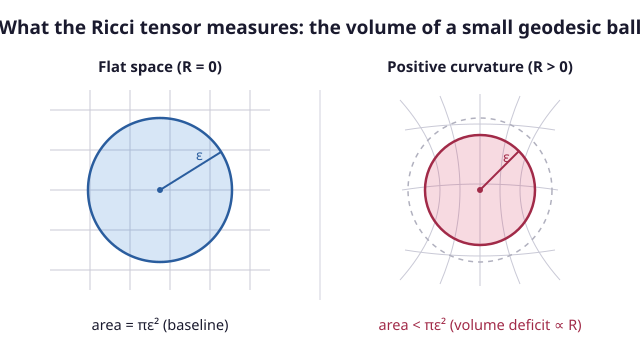

# Relativity (SR + GR) · Lesson 4.7: Ricci, scalar curvature, and the Einstein tensor

> ⏱ ~15 min · Module 4: The geometry of curved spacetime · Builds on: [4.6 The Riemann tensor & geodesic deviation](#/lesson/relativity/04-06-riemann-geodesic-deviation.md), [4.3 The metric & proper time](#/lesson/relativity/04-03-metric-proper-time.md), [3.3 The stress–energy tensor](#/lesson/relativity/03-03-stress-energy-tensor.md) · Unlocks: the Einstein field equations (5.3) — this lesson builds their entire left-hand side

## Why this matters

The Riemann tensor from [4.6](#/lesson/relativity/04-06-riemann-geodesic-deviation.md) has 20 independent components in 4D — far more than gravity needs. Einstein's equations relate curvature to matter, and matter is described by a *symmetric, rank-2* object, the stress–energy tensor $T_{\mu\nu}$ (10 components) from [3.3](#/lesson/relativity/03-03-stress-energy-tensor.md). So the left side of the field equations can't be the whole Riemann tensor — it has to be some rank-2 contraction of it. This lesson builds exactly that object. The punchline is not just "here's a smaller tensor": it's that **geometry, through one identity you get for free, hands GR the *unique* curvature object that is (i) second-order in the metric and (ii) automatically conserved** — precisely matching the two things $T_{\mu\nu}$ demands. When we finally write $G_{\mu\nu}=\frac{8\pi G}{c^4}T_{\mu\nu}$ in [5.3](#/lesson/relativity/05-03-einstein-field-equations.md), the left side will already be sitting here, fully assembled.

Signature is $(-,+,+,+)$ for spacetime; the worked sphere is a positive-definite (Riemannian) surface. We use Carroll's curvature conventions, matching [4.6](#/lesson/relativity/04-06-riemann-geodesic-deviation.md): $R^\rho{}_{\sigma\mu\nu}=\partial_\mu\Gamma^\rho_{\nu\sigma}-\partial_\nu\Gamma^\rho_{\mu\sigma}+\Gamma^\rho_{\mu\lambda}\Gamma^\lambda_{\nu\sigma}-\Gamma^\rho_{\nu\lambda}\Gamma^\lambda_{\mu\sigma}$.

## The idea

Riemann tells you *everything* about how a vector rotates when you parallel-transport it around a small loop — direction by direction, plane by plane. That's too much information to source with matter, and most of it isn't what matter responds to. So we **average**.

Two averages, in sequence:

- **Ricci tensor** $R_{\mu\nu}$: contract Riemann on one pair of indices. Physically, it isolates the piece of curvature that answers a *volume* question — take a tiny ball of freely-falling test particles and watch it move along geodesics; the Ricci tensor governs whether that ball's **volume** shrinks or grows. On the Sun's surface a ball of dust starts contracting because matter is there — that's Ricci. It is the "matter-facing" part of curvature.
- **Ricci scalar** $R$: contract *again*, all the way down to a single number at each point — the average curvature there. On a sphere of radius $a$ it's the constant $2/a^2$: bigger sphere, gentler curvature.

There's a leftover. The part of Riemann that Ricci *throws away* — the trace-free remainder — is the **Weyl tensor**: the tidal, volume-preserving distortion that survives even in vacuum, where no matter sits. It's the shape-shearing (not volume-changing) curvature, and it's what a gravitational wave is made of.

Finally, one combination of $R_{\mu\nu}$ and $R$ — the **Einstein tensor** $G_{\mu\nu}=R_{\mu\nu}-\tfrac12 g_{\mu\nu}R$ — has a magic property: its covariant divergence vanishes *identically*, for any metric whatsoever. Not as an equation to be imposed, but as an algebraic identity. That is the whole ballgame, because the stress–energy tensor's divergence also vanishes (energy–momentum is conserved). Two divergence-free objects can be set proportional consistently; a divergence-free object set equal to a non-conserved one cannot. Geometry pre-selected the correct left-hand side.

## The formal version

**The Ricci tensor.** Contract Riemann's first and third indices:

$$R_{\mu\nu}\;\equiv\;R^{\lambda}{}_{\mu\lambda\nu}\;=\;g^{\lambda\rho}R_{\rho\mu\lambda\nu}.$$

*In words:* sum Riemann over one upper and one lower slot to get a rank-2 tensor. It is **symmetric**, $R_{\mu\nu}=R_{\nu\mu}$ (this follows from Riemann's symmetries — see the Flashback), which is exactly what's needed to match the symmetric $T_{\mu\nu}$. Its geometric content: it measures the fractional rate at which the volume of a small geodesic ball departs from its flat-space value.

**The Ricci scalar (scalar curvature).** Contract once more with the inverse metric:

$$R\;\equiv\;g^{\mu\nu}R_{\mu\nu}.$$

*In words:* the fully contracted curvature — one number at each point, the average curvature there, a genuine scalar (same in every coordinate system).

**The Weyl tensor** $C_{\rho\sigma\mu\nu}$ is Riemann with all its Ricci traces subtracted off — the trace-free remainder. *In words:* it is the "free gravity" part of curvature, the tidal/shearing distortion that remains where matter is absent (in vacuum $R_{\mu\nu}=0$ but $C_{\rho\sigma\mu\nu}$ can be nonzero — that's a passing gravitational wave, or the field outside a star). It vanishes identically in fewer than 4 dimensions, which is one reason gravity is only dynamical in 4D (Problem 2).

**The contracted Bianchi identity.** The Riemann tensor obeys the *second* (differential) Bianchi identity, $\nabla_{[\lambda}R_{\rho\sigma]\mu\nu}=0$. Contracting it twice yields, with no assumptions on the metric,

$$\boxed{\;\nabla_\mu\!\left(R^{\mu\nu}-\tfrac12 g^{\mu\nu}R\right)=0.\;}$$

*In words:* this particular combination of curvatures is divergence-free automatically — a geometric identity, true for **every** metric, not a law we impose. (Equivalently $\nabla_\mu R^{\mu\nu}=\tfrac12\nabla^\nu R$: the Ricci tensor alone is *not* divergence-free; only this corrected combination is.)

**The Einstein tensor.** Name that combination:

$$G_{\mu\nu}\;\equiv\;R_{\mu\nu}-\tfrac12 g_{\mu\nu}R,\qquad\text{so}\qquad \nabla_\mu G^{\mu\nu}=0\ \ \text{identically}.$$

*In words:* the Einstein tensor is symmetric, built only from the metric and its first two derivatives (second-order), and **automatically conserved**. Compare with the local conservation law from [3.3](#/lesson/relativity/03-03-stress-energy-tensor.md), $\nabla_\mu T^{\mu\nu}=0$ (there $\partial_\mu T^{\mu\nu}=0$; on a curved background it becomes the covariant $\nabla_\mu T^{\mu\nu}=0$, [5.2](#/lesson/relativity/05-02-matter-curved-spacetime.md)). The two match slot for slot. That is *why* the field equations read $G_{\mu\nu}\propto T_{\mu\nu}$ and not $R_{\mu\nu}\propto T_{\mu\nu}$: setting the non-conserved $R_{\mu\nu}$ proportional to the conserved $T_{\mu\nu}$ would be an inconsistency (Problem 3). $G_{\mu\nu}$ is essentially the *unique* such object — geometry offers GR exactly one candidate.

## Picture

The Ricci/scalar curvature is a **volume** statement. Release a tiny ball of test particles at rest relative to each other and let each fall along a geodesic; positive curvature makes the ball's volume start to *shrink* (particles focus toward each other), negative curvature makes it grow. The scalar $R$ is the coordinate-free measure of that focusing: a geodesic ball of small radius $\epsilon$ has volume $V_{\text{geo}}=V_{\text{flat}}\big(1-\tfrac{R}{6(n+2)}\epsilon^2+\cdots\big)$ in $n$ dimensions — the deficit is $R$, directly. (Weyl, by contrast, is volume-preserving: it distorts the ball's *shape* into an ellipsoid without changing its volume — pure tidal shear, the [4.6](#/lesson/relativity/04-06-riemann-geodesic-deviation.md) geodesic-deviation effect with the trace removed.)

## Worked examples

**Example 1 (mechanical — Ricci and scalar curvature of the 2-sphere).** From [4.6](#/lesson/relativity/04-06-riemann-geodesic-deviation.md), the 2-sphere of radius $a$ with $ds^2=a^2(d\theta^2+\sin^2\theta\,d\phi^2)$ has the single independent Riemann component

$$R^\theta{}_{\phi\theta\phi}=\sin^2\theta \qquad\Longrightarrow\qquad R_{\theta\phi\theta\phi}=g_{\theta\theta}R^\theta{}_{\phi\theta\phi}=a^2\sin^2\theta.$$

Contract to Ricci, $R_{\mu\nu}=R^\lambda{}_{\mu\lambda\nu}$. The diagonal entries:

$$R_{\phi\phi}=R^\lambda{}_{\phi\lambda\phi}=R^\theta{}_{\phi\theta\phi}+\underbrace{R^\phi{}_{\phi\phi\phi}}_{=0}=\sin^2\theta,$$

$$R_{\theta\theta}=R^\lambda{}_{\theta\lambda\theta}=\underbrace{R^\theta{}_{\theta\theta\theta}}_{=0}+R^\phi{}_{\theta\phi\theta}.$$

For $R^\phi{}_{\theta\phi\theta}$ raise with $g^{\phi\phi}=1/(a^2\sin^2\theta)$ on the all-down component (using pair symmetry $R_{\phi\theta\phi\theta}=R_{\theta\phi\theta\phi}=a^2\sin^2\theta$):

$$R^\phi{}_{\theta\phi\theta}=g^{\phi\phi}R_{\phi\theta\phi\theta}=\frac{1}{a^2\sin^2\theta}\,(a^2\sin^2\theta)=1\ \Longrightarrow\ R_{\theta\theta}=1.$$

So $R_{\theta\theta}=1$, $R_{\phi\phi}=\sin^2\theta$, off-diagonal zero. Notice both equal $\tfrac{1}{a^2}g_{\mu\nu}$:

$$\boxed{R_{\mu\nu}=\frac{1}{a^2}\,g_{\mu\nu}}$$

— a **space of constant curvature** (Ricci proportional to the metric everywhere; every point and direction alike). Now the scalar:

$$R=g^{\mu\nu}R_{\mu\nu}=g^{\theta\theta}R_{\theta\theta}+g^{\phi\phi}R_{\phi\phi}=\frac{1}{a^2}(1)+\frac{1}{a^2\sin^2\theta}(\sin^2\theta)=\frac{2}{a^2}.$$

Positive (a sphere curves "toward itself" — geodesic balls shrink), constant, and dies as $a$ grows: a bigger sphere looks flatter, as it should. This is the $2/a^2$ promised in Boss Problem 4.

**Example 2 (why you'd care — forming $G_{\mu\nu}$, and a 2D curiosity).** Assemble the Einstein tensor for that same sphere:

$$G_{\mu\nu}=R_{\mu\nu}-\tfrac12 g_{\mu\nu}R=\frac{1}{a^2}g_{\mu\nu}-\tfrac12 g_{\mu\nu}\!\left(\frac{2}{a^2}\right)=\frac{1}{a^2}g_{\mu\nu}-\frac{1}{a^2}g_{\mu\nu}=0.$$

The Einstein tensor **vanishes identically** on the sphere — indeed on *any* 2D surface (Problem 2). That's a warning label, not a coincidence: in 2D the "curvature = matter" equation $G_{\mu\nu}\propto T_{\mu\nu}$ would force $T_{\mu\nu}=0$ always, so there is no room for gravity to couple to matter. Gravity as a dynamical field needs the extra room that only $\ge 4$ dimensions provide, where $G_{\mu\nu}$ carries real, independent content and the Weyl tensor lets curvature exist in empty space. The check itself, though, is the everyday GR move: you will compute $R_{\mu\nu}$, trace to $R$, and subtract to get $G_{\mu\nu}$ for the Schwarzschild and FLRW metrics later in the course, where the answer is emphatically *not* zero.

## Watch out

- **Ricci is a contraction of Riemann, not "smaller Riemann."** You cannot recover Riemann from Ricci in general — the Weyl part is genuinely lost. In vacuum ($R_{\mu\nu}=0$) spacetime is *not* flat; the Riemann tensor is all Weyl there. "Ricci-flat" ≠ "flat." (This is why gravitational waves and the field outside a star exist at all.)
- **$R_{\mu\nu}$ alone is not conserved.** It's tempting to write $R_{\mu\nu}=\kappa T_{\mu\nu}$ — Einstein tried it in 1915 before the Bianchi identity set him straight. But $\nabla_\mu R^{\mu\nu}=\tfrac12\nabla^\nu R\neq 0$ in general, so that equation clashes with $\nabla_\mu T^{\mu\nu}=0$. The $-\tfrac12 g_{\mu\nu}R$ term is not cosmetic; it is precisely the correction that makes the left side conserved.
- **Index placement in the contraction matters.** $R_{\mu\nu}=R^\lambda{}_{\mu\lambda\nu}$ contracts the **first and third** slots. Contracting the first two gives zero (Riemann is antisymmetric in them); contracting first and *last* gives $-R_{\mu\nu}$ (a sign convention trap). Different textbooks differ by an overall sign in Riemann — always state your convention (here, Carroll's), and the sphere's $R=+2/a^2$ is a good sanity anchor: a sphere must come out positively curved.

## One-liner

> Contract Riemann once for the Ricci tensor (the volume-changing, matter-facing curvature), again for the scalar $R$; then $G_{\mu\nu}=R_{\mu\nu}-\tfrac12 g_{\mu\nu}R$ is the *unique* second-order curvature object whose divergence vanishes by identity — so it, and not $R_{\mu\nu}$, is what matter's conserved $T_{\mu\nu}$ gets to equal.

## Problems

**P1 (🟢)** For the 2-sphere of radius $a$ you may take as given the single Riemann component $R^\theta{}_{\phi\theta\phi}=\sin^2\theta$. Reconstruct the Ricci tensor components $R_{\theta\theta}$ and $R_{\phi\phi}$ and the Ricci scalar $R$, and interpret the sign and the $a$-dependence of $R$ physically (what does a larger $a$ mean?).

**P2 (🟡)** In two dimensions the Riemann tensor has only one independent component, which forces $R_{\mu\nu}=\tfrac12 g_{\mu\nu}R$ at every point. (a) Use this to show the Einstein tensor $G_{\mu\nu}=R_{\mu\nu}-\tfrac12 g_{\mu\nu}R$ vanishes identically in 2D, for *any* 2D metric. (b) Explain why this means general relativity has no dynamical content in 2D, and, more broadly, why gravity needs at least 4 dimensions to propagate as a field (think about what the vacuum equation $R_{\mu\nu}=0$ forces on the full curvature when there is no Weyl tensor).

**P3 (🔴, optional)** Starting from the contracted Bianchi identity $\nabla_\mu\!\big(R^{\mu\nu}-\tfrac12 g^{\mu\nu}R\big)=0$ and the local conservation of energy–momentum $\nabla_\mu T^{\mu\nu}=0$ (from [3.3](#/lesson/relativity/03-03-stress-energy-tensor.md)/[5.2](#/lesson/relativity/05-02-matter-curved-spacetime.md)), argue that the field equations *must* take the form $G_{\mu\nu}=\kappa\,T_{\mu\nu}$ rather than $R_{\mu\nu}=\kappa\,T_{\mu\nu}$. Specifically: show that the naive proposal $R_{\mu\nu}=\kappa T_{\mu\nu}$ would force an unphysical constraint on the matter, and identify what that constraint is.

Solutions

**P1** Contract $R_{\mu\nu}=R^\lambda{}_{\mu\lambda\nu}$ over $\lambda\in\{\theta,\phi\}$.

$R_{\phi\phi}=R^\theta{}_{\phi\theta\phi}+R^\phi{}_{\phi\phi\phi}$. The second term vanishes (Riemann is antisymmetric in its last two indices, so any component with them equal is zero). Hence $R_{\phi\phi}=\sin^2\theta$.

$R_{\theta\theta}=R^\theta{}_{\theta\theta\theta}+R^\phi{}_{\theta\phi\theta}$; the first vanishes for the same reason. Lower/raise to get the second: from $R^\theta{}_{\phi\theta\phi}=\sin^2\theta$, lowering the first index with $g_{\theta\theta}=a^2$ gives $R_{\theta\phi\theta\phi}=a^2\sin^2\theta$. Pair symmetry $R_{\rho\sigma\mu\nu}=R_{\mu\nu\rho\sigma}$ gives $R_{\phi\theta\phi\theta}=a^2\sin^2\theta$, and raising the first index with $g^{\phi\phi}=1/(a^2\sin^2\theta)$ gives $R^\phi{}_{\theta\phi\theta}=1$. So $R_{\theta\theta}=1$.

Scalar: $R=g^{\theta\theta}R_{\theta\theta}+g^{\phi\phi}R_{\phi\phi}=\frac{1}{a^2}(1)+\frac{1}{a^2\sin^2\theta}(\sin^2\theta)=\frac{2}{a^2}.$

Interpretation: $R>0$ — positive curvature, the hallmark of a surface that curves *toward itself*, so a small geodesic ball (a spherical cap) has less area than a flat disk of the same geodesic radius; nearby geodesics converge (two meridians launched parallel at the equator meet at the pole). The magnitude $2/a^2$ falls with $a$: a larger sphere is more gently curved, and locally looks flatter — in the limit $a\to\infty$, $R\to 0$ and the surface is a plane. Curvature carries units of (length)$^{-2}$, as $2/a^2$ shows.

**P2** (a) Substitute the given 2D relation directly:
$$G_{\mu\nu}=R_{\mu\nu}-\tfrac12 g_{\mu\nu}R=\tfrac12 g_{\mu\nu}R-\tfrac12 g_{\mu\nu}R=0.$$
Identically, for every 2D metric — no computation of specific components needed. (Example 1's sphere is one instance: there $R_{\mu\nu}=\tfrac{1}{a^2}g_{\mu\nu}$ and $R=2/a^2$, and indeed $\tfrac12 g_{\mu\nu}(2/a^2)=\tfrac{1}{a^2}g_{\mu\nu}=R_{\mu\nu}$.)

(b) Because $G_{\mu\nu}\equiv 0$ in 2D, the proposed field equation $G_{\mu\nu}=\kappa T_{\mu\nu}$ collapses to $T_{\mu\nu}=0$: matter cannot source curvature at all, and the equation places *no* constraint on the metric. There is nothing to solve — GR is empty/non-dynamical in 2D.

More broadly: the full curvature (Riemann) splits into a Ricci part and a trace-free Weyl part, but Weyl vanishes identically in fewer than 4 dimensions. In 3D, Riemann is completely determined by Ricci, so the vacuum equation $R_{\mu\nu}=0$ forces the *entire* Riemann tensor to vanish — vacuum 3D spacetime is exactly flat, with no curvature able to exist away from matter and hence no propagating gravitational field. Only in $n\ge 4$ does the Weyl tensor have independent components, allowing curvature (tidal fields, gravitational waves, the field outside a star) to live in vacuum. Four is the minimum dimension in which gravity is a genuine dynamical field, not merely algebraically locked to its sources.

**P3** Take the covariant divergence ($\nabla_\mu$) of each candidate and demand consistency with $\nabla_\mu T^{\mu\nu}=0$.

For $G_{\mu\nu}=\kappa T_{\mu\nu}$: raise indices and apply $\nabla_\mu$. The left side gives $\nabla_\mu G^{\mu\nu}=0$ *automatically*, by the contracted Bianchi identity — a geometric fact true for any metric. The right side gives $\kappa\nabla_\mu T^{\mu\nu}=0$ by energy–momentum conservation. Both sides vanish identically: the equation is self-consistent and imposes no hidden constraint. Good.

For the naive $R_{\mu\nu}=\kappa T_{\mu\nu}$: apply $\nabla_\mu$ to the raised form. The right side is $\kappa\nabla_\mu T^{\mu\nu}=0$. But the left side is *not* automatically zero; the contracted Bianchi identity gives $\nabla_\mu R^{\mu\nu}=\tfrac12\nabla^\nu R$. Consistency therefore demands
$$\tfrac12\nabla^\nu R=0\quad\Longrightarrow\quad \nabla^\nu R=0\quad\Longrightarrow\quad R=\text{const}.$$
Now trace the proposed equation itself: $g^{\mu\nu}R_{\mu\nu}=R=\kappa\,g^{\mu\nu}T_{\mu\nu}=\kappa T$ (with $T\equiv T^\mu{}_\mu$). So $R=\text{const}$ forces $T=\text{const}$ — the trace of the stress–energy tensor would have to be the same number everywhere in the universe. That is an absurd, unphysical restriction on matter (it flatly fails, e.g., at the edge of any star, where $T$ drops to zero outside and is nonzero inside). The naive equation over-constrains the matter and is inconsistent.

The fix is exactly the $-\tfrac12 g_{\mu\nu}R$ term: it upgrades the non-conserved $R_{\mu\nu}$ into the identically-conserved $G_{\mu\nu}$, so that the geometric side matches the conserved matter side with *no* leftover constraint. The requirement "left side must be divergence-free to match conserved $T_{\mu\nu}$" thus *pins down* the field equations to $G_{\mu\nu}=\kappa T_{\mu\nu}$ — this is the argument [5.3](#/lesson/relativity/05-03-einstein-field-equations.md) makes to select the equations, with $\kappa=8\pi G/c^4$ fixed afterward by the Newtonian limit.

## Flashback

**From Lesson 4.6 (The Riemann tensor & geodesic deviation):** Use the symmetries of the Riemann tensor to prove that the Ricci tensor is symmetric, $R_{\mu\nu}=R_{\nu\mu}$. (You may use: $R_{\rho\sigma\mu\nu}=-R_{\sigma\rho\mu\nu}=-R_{\rho\sigma\nu\mu}$ and the pair-swap symmetry $R_{\rho\sigma\mu\nu}=R_{\mu\nu\rho\sigma}$.)

Solution

Write Ricci with the metric explicit: $R_{\mu\nu}=R^\lambda{}_{\mu\lambda\nu}=g^{\lambda\rho}R_{\rho\mu\lambda\nu}$. Apply the pair-swap symmetry to the all-down Riemann component:
$$R_{\rho\mu\lambda\nu}=R_{\lambda\nu\rho\mu}.$$
Substitute:
$$R_{\mu\nu}=g^{\lambda\rho}R_{\rho\mu\lambda\nu}=g^{\lambda\rho}R_{\lambda\nu\rho\mu}.$$
Now $g^{\lambda\rho}$ is symmetric, so the dummy labels $\lambda\leftrightarrow\rho$ may be swapped freely: $g^{\lambda\rho}R_{\lambda\nu\rho\mu}=g^{\rho\lambda}R_{\rho\nu\lambda\mu}=g^{\lambda\rho}R_{\rho\nu\lambda\mu}$. The last expression is exactly $R^\lambda{}_{\nu\lambda\mu}=R_{\nu\mu}$. Hence
$$R_{\mu\nu}=R_{\nu\mu}.\qquad\blacksquare$$
The symmetry is not an accident of the sphere — it holds for every metric, and it's precisely why $R_{\mu\nu}$ (and therefore $G_{\mu\nu}$) can be set equal to the symmetric stress–energy tensor with matching index structure.

## Connections

- **Backward:** every object here is a contraction of the Riemann tensor from [4.6](#/lesson/relativity/04-06-riemann-geodesic-deviation.md), using the contraction operation introduced all the way back in [2.3](#/lesson/relativity/02-03-tensors-algebra.md); the raising/lowering to reshuffle indices is the metric machinery of [4.3](#/lesson/relativity/04-03-metric-proper-time.md). The 2-sphere numbers feed directly into Boss Problem 4.
- **Forward:** $G_{\mu\nu}$ is the entire left-hand side of the Einstein field equations [5.3](#/lesson/relativity/05-03-einstein-field-equations.md); the contracted Bianchi identity is the argument that *selects* those equations. The Ricci scalar $R$ is the Lagrangian of the Einstein–Hilbert action [5.4](#/lesson/relativity/05-04-einstein-hilbert-action.md), whose variation reproduces $G_{\mu\nu}$. You'll compute $R_{\mu\nu}$, $R$, and $G_{\mu\nu}$ concretely for Schwarzschild [6.1](#/lesson/relativity/06-01-schwarzschild-solution.md) (where the vacuum equation $R_{\mu\nu}=0$ holds but Weyl doesn't) and for FLRW [6.6](#/lesson/relativity/06-06-flrw-metric.md) (where they give the Friedmann equations).
- **Sideways:** the Weyl-vs-Ricci split — shape-distorting vs volume-changing curvature — is the geometric echo of the traceless/trace decomposition of a symmetric matrix from `linalg-refresher`; and the "divergence-free left side must match a conserved source" logic is the same structural demand that makes $\partial_\mu J^\mu=0$ compatible with Maxwell's $\partial_\mu F^{\mu\nu}=\mu_0 J^\nu$ in [`em-refresher`](#/lesson/em-refresher/04-01-maxwells-equations.md) — a conserved current forces a divergence-free field object, exactly as a conserved $T_{\mu\nu}$ forces $G_{\mu\nu}$.
