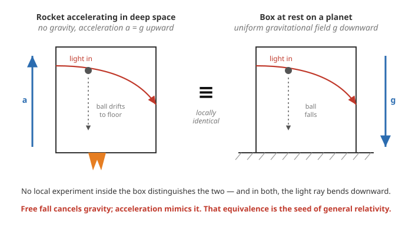

# Relativity (SR + GR) · Lesson 5.1: The equivalence principle and the physical basis of GR

> ⏱ ~15 min · Module 5: General relativity and the Einstein equations · Builds on: [4.5 Geodesics](#/lesson/relativity/04-05-geodesics.md), [4.6 Riemann & geodesic deviation](#/lesson/relativity/04-06-riemann-geodesic-deviation.md), [1.4 Interval & causality](#/lesson/relativity/01-04-spacetime-interval-causality.md) · Unlocks: matter in curved spacetime (5.2), the Einstein equations (5.3), redshift & the Newtonian limit (5.5)

## Why this matters

Module 4 built a magnificent machine — manifolds, metrics, Christoffels, curvature — but never said *why gravity should be geometry*. This lesson supplies the physics that forces the identification. It starts from one experimental fact so ordinary it's easy to miss: **everything falls the same way.** Einstein turned that fact into a demand — that free fall be *nothing at all*, locally — and from that single demand he could already predict light bending and gravitational redshift before writing a single field equation, and could see that "gravity" is not a force but the shape of spacetime. Everything downstream (matter curves spacetime in 5.3, curvature guides matter via geodesics in 4.5) is this lesson made quantitative.

## The idea

Drop a hammer and a feather in vacuum: they hit the floor together. Galileo argued it, the Apollo 15 astronaut filmed it on the Moon. Why is this strange? Newton's second law says force equals *inertial* mass times acceleration, $F = m_i a$ — how hard a thing is to shove. Newton's gravity says the pull is proportional to a *gravitational* mass, $F = m_g\, g$ — a thing's "gravitational charge." A priori these are different properties, like a particle's mass and its electric charge. But set them equal in free fall:

$$m_i\,a = m_g\,g \quad\Longrightarrow\quad a = \frac{m_g}{m_i}\,g.$$

The acceleration depends on the *ratio* $m_g/m_i$. The experimental miracle is that this ratio is the **same for every body** — lead, feathers, atoms, antimatter — so it can be set to $1$ once and for all, and then $a = g$ regardless of what's falling. Gravity is the one force that gives everything the same acceleration.

Einstein's leap (his "happiest thought," 1907): if *everything* accelerates identically, then an observer falling with them sees nothing accelerate at all. **Free fall cancels gravity.** Step into a falling elevator and, until you hit bottom, you float — indistinguishable from drifting in deep space. Turn it around: sit in a windowless rocket accelerating at $g$ in empty space, and you're pinned to the floor, dropped objects "fall," a thrown ball arcs — indistinguishable from sitting on a planet. *Acceleration and gravity are locally the same thing.* That is the equivalence principle, and it means gravity has no absolute reality: you can create it or destroy it just by changing your state of motion — exactly the property a **geometric**, coordinate-dependent effect would have.

## The formal version

I use the $(-,+,+,+)$ signature and keep $c, G$ explicit throughout.

**Weak equivalence principle (WEP) — universality of free fall.** Inertial and gravitational mass are equal, $m_i = m_g$, for all bodies. Equivalently: the worldline of a freely falling test body depends only on its initial position and velocity, never on its mass or composition.

*In words:* everything falls the same, so "how it falls" is a property of *spacetime*, not of the body. Tested to breathtaking precision — Eötvös torsion balances reached $|\Delta a/a| \lesssim 10^{-11}$, and the MICROSCOPE satellite (2017) pushed it to $\sim 10^{-15}$. No violation has ever been seen.

**Einstein equivalence principle (EEP).** In a freely falling laboratory, confined to a small enough region of spacetime, *all* the non-gravitational laws of physics take exactly their special-relativistic form — with no trace of gravity.

*In words:* free fall doesn't just cancel the *mechanics* of gravity; it restores the full physics of [special relativity](#/lesson/relativity/01-04-spacetime-interval-causality.md) locally — Maxwell, atomic clocks, everything. A freely falling frame is a **local inertial frame (LIF)**. (Strengthen "non-gravitational" to "all physics including gravitational binding energy" and you get the *strong* equivalence principle, which general relativity also satisfies; that distinction won't matter until you probe self-gravitating bodies.)

The word doing all the work is **local**. The equivalence holds at a point and in a small neighborhood, over times short enough that the field's *variation* across the lab is negligible. Why it must be local is the whole content of the Picture and Problem 3.

**Two consequences, derived with no field equations.** Because a freely falling frame *is* an inertial frame, and an inertial frame *is* a frame accelerating relative to one standing in a gravitational field, we can compute gravity's effects by doing special relativity in an accelerating box:

- **Light bends.** A light pulse crosses an upward-accelerating rocket in a straight line as seen from outside; but the far wall has moved up by the time it arrives, so *inside* the box the ray lands lower than it entered — it curves toward the floor. By equivalence, **light must bend in a gravitational field.** Heuristic magnitude for light grazing a mass $M$ at impact parameter $b$: deflection $\sim 2GM/(bc^2)$ (Problem 2). General relativity doubles this to $4GM/(bc^2)$ — the extra factor of 2 is *spatial* curvature, which the accelerating-box argument can't see; the full computation is [6.2](#/lesson/relativity/06-02-orbits-precession-light-bending.md).

- **Clocks run slow low in a potential (gravitational redshift).** A photon of energy $E = hf$ carries effective mass $E/c^2$. Climbing a height $h$ against gravity $g$, it does work $\frac{E}{c^2}gh$ and loses that energy, so its frequency drops: light climbing *out* of a gravitational well is **redshifted**. Writing the Newtonian potential $\Phi$ (energy per unit mass, increasing upward, $g = |\nabla\Phi|$), the fractional shift for a small climb $\Delta\Phi = g h$ is

$$\boxed{\;\frac{\Delta f}{f} = -\frac{\Delta\Phi}{c^2}\;}$$

*In words:* raise a light signal by potential $\Delta\Phi$ and its frequency falls by $\Delta\Phi/c^2$. Since a clock is just something that ticks at a fixed frequency, the same relation says **a clock deeper in a potential well runs slower** than one higher up: over the same span the higher clock accumulates more proper time, $\Delta\tau_{\text{high}}/\Delta\tau_{\text{low}} = 1 + \Delta\Phi/c^2$ (here $\Delta\Phi = \Phi_{\text{high}} - \Phi_{\text{low}} > 0$). This is heuristic — it uses energy conservation and $E=hf$, not the metric — but it is *exactly right* to first order, and the full metric derivation ($g_{00} = -(1+2\Phi/c^2)$) lands in [5.5](#/lesson/relativity/05-05-newtonian-limit-redshift.md). It's why GPS satellite clocks are pre-detuned and why the Pound–Rebka experiment (Problem 1) matters.

**The leap: gravity is geometry, not force.** Package the two ideas. (1) A freely falling body feels no force — so its worldline should be the "free" motion of the theory. In [4.5](#/lesson/relativity/04-05-geodesics.md) the force-free path is a **geodesic** of the metric, $\ddot x^\lambda + \Gamma^\lambda_{\mu\nu}\dot x^\mu \dot x^\nu = 0$. So freely falling bodies follow geodesics, and what Newton called the gravitational force is the Christoffel term $\Gamma^\lambda_{\mu\nu}\dot x^\mu\dot x^\nu$ — a coordinate quantity. (2) At any point you can choose a freely falling (local inertial) frame in which $g_{\mu\nu} = \eta_{\mu\nu}$ and *all the Christoffels vanish*, $\Gamma^\lambda_{\mu\nu} = 0$ — gravity locally erased, EEP realized. But the *derivatives* of the Christoffels — the **Riemann tensor** $R^\rho{}_{\sigma\mu\nu}$ of [4.6](#/lesson/relativity/04-06-riemann-geodesic-deviation.md) — **cannot** be transformed away (Problem 3). Riemann drives geodesic *deviation*: two nearby freely falling bodies drift together or apart — **tidal forces**. That residue, which no change of frame removes, is *real* gravity. So:

$$\textbf{Christoffels (locally removable)} \;=\; \text{"gravitational force"} \;\;\longleftrightarrow\;\; \textbf{Riemann (irremovable)} \;=\; \text{true tidal gravity.}$$

**General covariance.** Since gravity is encoded in a geometry that any observer may coordinatize as they like, the laws of physics must be written as **tensor equations** — the same form in every coordinate system, related by the tensor transformation laws of [Module 2](#/lesson/relativity/02-03-tensors-algebra.md). *In words:* no coordinate system is privileged; physics is what's left after you strip coordinates away. This is the design rule for the whole theory: build the field equations from tensors ([5.3](#/lesson/relativity/05-03-einstein-field-equations.md)) and they automatically respect equivalence.

## Picture

The two boxes host the *same* local physics. On the left, the rocket accelerates up at $a=g$ through gravity-free space; a light ray entering horizontally travels straight in the external inertial frame, but the floor rushes up to meet it, so inside the box it curves down. On the right, the box sits on a planet; equivalence demands the identical outcome — the ray bends down by gravity. The released ball does the same in both. The catch is *local*: make the boxes tall enough and the two stories separate. In the rocket the "gravity" is perfectly uniform (parallel, equal everywhere); on the planet it points toward the center, so two balls dropped at opposite ends drift slightly *toward each other* — a tidal signature (Riemann $\neq 0$) that the uniformly accelerating rocket can never reproduce. That failure at large scale is precisely why the equivalence principle is a statement about points and their neighborhoods, and why true gravity is curvature.

## Worked examples

**Example 1 (mechanical — gravitational time dilation on a tower).** Two identical clocks sit at the bottom and top of a tower of height $h = 100$ m on Earth ($g = 9.8\ \mathrm{m/s^2}$). By how much do their rates differ? The potential difference is $\Delta\Phi = gh$, so the fractional rate difference is

$$\frac{\Delta\tau_{\text{top}} - \Delta\tau_{\text{bot}}}{\Delta\tau} = \frac{\Delta\Phi}{c^2} = \frac{gh}{c^2} = \frac{9.8 \times 100}{(3.0\times 10^8)^2} = \frac{980}{9.0\times 10^{16}} \approx 1.1\times 10^{-14}.$$

The top clock runs *faster* by about one part in $10^{14}$ — roughly $0.3$ microseconds per year. Tiny, but atomic clocks resolve it easily; optical-lattice clocks now detect the shift over a *centimeter* of height. Higher potential, faster clock: this is not a defect of the clocks, it's the geometry of time.

**Example 2 (why you'd care — GPS would fail without this).** A GPS satellite orbits at altitude $\approx 2.0\times 10^7$ m, where the Newtonian potential is higher (less negative) than at the ground by $\Delta\Phi/c^2 \approx +5.3\times 10^{-10}$. So its clock runs *fast* by that fraction: over a day ($86{,}400$ s) it gains

$$\Delta t \approx (5.3\times 10^{-10})(86{,}400\ \text{s}) \approx 46\ \mu\text{s}.$$

(The satellite's orbital *speed* gives a competing special-relativistic slowing of about $-7\ \mu\text{s}/\text{day}$; the gravitational effect wins, net $\approx +38\ \mu\text{s}/\text{day}$.) Left uncorrected, $38\ \mu\text{s}$ of clock drift multiplies by $c$ into a positioning error of $c\cdot\Delta t \approx (3\times 10^8)(3.8\times 10^{-5}) \approx 11$ km **per day** — GPS would be useless within minutes. The equivalence principle is not a curiosity; it's compiled into the receiver in your pocket.

## Watch out

- **You might think free fall makes gravity truly disappear.** It only cancels the *uniform* part, over a small region. What survives is the *variation* of the field — tidal forces (geodesic deviation, Riemann). Astronauts float because their whole capsule falls together, but a large enough freely falling cloud of dust still gets stretched radially and squeezed sideways. "Weightlessness" is a local statement; tides are the global truth (Problem 3).
- **You might think a uniformly accelerating frame is genuinely a gravitational field.** Locally yes, globally no. Uniform acceleration produces a *flat* spacetime (Riemann $= 0$) written in funny coordinates — no tidal forces, ever. A real mass produces Riemann $\neq 0$. The equivalence is an approximation valid only where the field looks uniform; conflating the two globally is the classic trap.
- **You might think light bending means light "slows down and falls" like a ball.** The photon never changes speed — locally it always moves at $c$. Its *direction* changes because the spacetime it traverses is curved (and, in the accelerating box, because "straight" and "the box" disagree). Energy is lost or gained on a climb (redshift) not by slowing but by *reddening* — frequency, not speed, carries the energy.

## One-liner

> Because everything falls the same, free fall is locally *nothing* (special relativity restored) and acceleration locally *is* gravity — so gravity is the curvature of spacetime: the removable part (Christoffels) is coordinate force, the irremovable part (Riemann, tidal) is the real thing.

## Problems

**P1 (🟢)** The Pound–Rebka experiment (1959) sent gamma rays up a tower of height $h = 22.5$ m at Harvard and measured their gravitational redshift. (a) Compute the predicted fractional frequency shift $\Delta f/f = gh/c^2$ with $g = 9.8\ \mathrm{m/s^2}$. (b) Comment on its size — what does it take to measure something this small, and why is it a *shift to lower* frequency for light going up?

**P2 (🟡)** Use the accelerating-elevator idea to estimate the deflection of a light ray passing a mass $M$ at impact parameter $b$. Model the photon as moving at speed $c$ along a straight line $x = ct$ at perpendicular distance $b$ from $M$, feeling a Newtonian transverse acceleration, and integrate the sideways velocity it picks up. Show the deflection angle is $\alpha \approx 2GM/(bc^2)$, and state (without deriving) how general relativity modifies it. Optionally evaluate for light grazing the Sun ($M = 2.0\times 10^{30}$ kg, $b = R_\odot = 7.0\times 10^8$ m).

**P3 (🔴, optional)** Make precise what a freely falling frame can and cannot remove. (a) Argue by counting components that at any single point you can choose coordinates with $g_{\mu\nu} = \eta_{\mu\nu}$ and $\partial_\lambda g_{\mu\nu} = 0$ (hence $\Gamma^\lambda_{\mu\nu} = 0$) there, but that you *cannot* also kill all the second derivatives $\partial_\alpha\partial_\beta g_{\mu\nu}$. (b) Identify the leftover with the Riemann tensor, and explain why this means a uniformly accelerating frame is *not* globally equivalent to a gravitational field.

Solutions

**P1** (a) Plug in:

$$\frac{\Delta f}{f} = \frac{gh}{c^2} = \frac{9.8 \times 22.5}{(3.0\times 10^8)^2} = \frac{220.5}{9.0\times 10^{16}} \approx 2.45\times 10^{-15}.$$

(b) This is about **2 parts in a quadrillion** — one of the smallest shifts ever deliberately measured. Pound and Rebka beat it by exploiting the Mössbauer effect, in which nuclei in a crystal emit and absorb gamma rays with an extraordinarily sharp, recoil-free line; the resonance is so narrow that a $10^{-15}$ detuning noticeably kills absorption, and they scanned through it by moving the source at a few mm/s to Doppler-tune the frequency back. The shift is *toward lower* frequency (redshift) because the photon climbs *up*, out of the well, doing work against gravity and losing energy $E=hf$ — less energy means lower $f$. (A photon sent *down* would blueshift by the same amount.)

**P2** Put $M$ at the origin, photon at $(x,y) = (ct,\,b)$ so $x$ runs from $-\infty$ to $+\infty$ and the distance is $r = \sqrt{x^2 + b^2}$. The gravitational acceleration has magnitude $GM/r^2$ directed toward $M$; its component perpendicular to the photon's motion (the $y$-direction, toward the mass) is

$$a_\perp = \frac{GM}{r^2}\cdot\frac{b}{r} = \frac{GM\,b}{(x^2+b^2)^{3/2}}.$$

The transverse velocity picked up is $\Delta v_\perp = \int a_\perp\,dt = \frac{1}{c}\int_{-\infty}^{\infty} a_\perp\,dx$ (using $x=ct$, $dt = dx/c$):

$$\Delta v_\perp = \frac{GM b}{c}\int_{-\infty}^{\infty}\frac{dx}{(x^2+b^2)^{3/2}} = \frac{GM b}{c}\cdot\frac{2}{b^2} = \frac{2GM}{bc},$$

using the standard integral $\int_{-\infty}^{\infty}(x^2+b^2)^{-3/2}dx = 2/b^2$. The deflection angle is the transverse velocity gained divided by the forward speed:

$$\alpha \approx \frac{\Delta v_\perp}{c} = \frac{2GM}{bc^2}.$$

General relativity gives exactly **twice** this, $\alpha_{\text{GR}} = 4GM/(bc^2)$: the equivalence-principle argument captures only the time-curvature ($g_{00}$) half of the effect and misses an equal contribution from the curvature of *space* — the piece that needs the full metric ([6.2](#/lesson/relativity/06-02-orbits-precession-light-bending.md)). For the Sun:

$$\alpha_{\text{GR}} = \frac{4GM}{bc^2} = \frac{4(6.67\times 10^{-11})(2.0\times 10^{30})}{(7.0\times 10^8)(9.0\times 10^{16})} \approx 8.5\times 10^{-6}\ \text{rad} \approx 1.75''.$$

Eddington's 1919 eclipse measurement of this $1.75$-arcsecond deflection (and its factor-of-2 excess over the "Newtonian" $0.87''$) is what made Einstein famous overnight.

**P3** (a) Work at a chosen point $p$ and Taylor-expand the coordinate change $x^\mu \to x'^\mu$ about $p$; count how many free parameters each order of the expansion supplies against how many metric quantities it must fix.

- *Zeroth/first order (fix $g_{\mu\nu}$).* The Jacobian $\partial x'^\mu/\partial x^\nu$ at $p$ has $4\times 4 = 16$ free entries. The symmetric metric $g_{\mu\nu}(p)$ has $10$ independent components to be set to $\eta_{\mu\nu}$. That leaves $16 - 10 = 6$ unused — exactly the $6$ parameters of the Lorentz group (3 rotations + 3 boosts), which preserve $\eta$. So $g_{\mu\nu}(p) = \eta_{\mu\nu}$ is always achievable, with $6$ parameters to spare.
- *Second order (fix $\partial g$).* The second derivatives $\partial^2 x'^\mu/\partial x^\alpha\partial x^\beta$ at $p$ have $4\times 10 = 40$ free entries (symmetric in $\alpha\beta$). The first derivatives $\partial_\lambda g_{\mu\nu}$ number $4\times 10 = 40$. Match: $40 = 40$, so **all** first derivatives can be set to zero — hence $\Gamma^\lambda_{\mu\nu}(p) = 0$. This is the local inertial frame.
- *Third order (try to fix $\partial\partial g$).* The third derivatives $\partial^3 x'^\mu/\partial x^\alpha\partial x^\beta\partial x^\gamma$ have $4\times 20 = 80$ free entries. But the second derivatives $\partial_\alpha\partial_\beta g_{\mu\nu}$ number $10\times 10 = 100$. Now $100 - 80 = 20$ components **cannot** be removed by any coordinate choice.

(b) Those $20$ irreducible components are exactly the number of independent components of the **Riemann tensor** $R^\rho{}_{\sigma\mu\nu}$ in four dimensions — curvature is what's left after you've done everything coordinates can do. Physically it shows up as geodesic deviation ([4.6](#/lesson/relativity/04-06-riemann-geodesic-deviation.md)): nearby freely falling test bodies accelerate relative to each other, $\frac{D^2\xi^\rho}{d\tau^2} = -R^\rho{}_{\sigma\mu\nu}u^\sigma\xi^\mu u^\nu$ — tidal forces, frame-independent and real. A uniformly accelerating frame in flat spacetime has $g_{\mu\nu} = \eta_{\mu\nu}$ globally in *some* coordinates, so $R^\rho{}_{\sigma\mu\nu} = 0$ everywhere: no tidal forces, and one *global* change of coordinates (to the inertial frame) erases the "field" completely. A genuine gravitational field from a mass has $R \neq 0$; no coordinate change can erase it, and free fall cancels it only point-by-point. That is the precise sense in which acceleration equals gravity **locally but not globally**, and the precise sense in which curvature *is* gravity.

## Flashback

**From Lesson 4.5 (Geodesics):** For a free particle in *flat* spacetime written in ordinary inertial coordinates, the metric is constant ($g_{\mu\nu} = \eta_{\mu\nu}$). Write down the geodesic equation in these coordinates and read off the motion. Then explain, in one sentence, how the equivalence principle reinterprets this same equation the moment you switch to a freely falling frame in a *real* gravitational field.

Solution

In inertial coordinates $\eta_{\mu\nu}$ is constant, so all its derivatives vanish and every Christoffel symbol is zero: $\Gamma^\lambda_{\mu\nu} = \tfrac12\eta^{\lambda\rho}(\partial_\mu\eta_{\rho\nu} + \partial_\nu\eta_{\rho\mu} - \partial_\rho\eta_{\mu\nu}) = 0$. The geodesic equation

$$\frac{d^2 x^\lambda}{d\tau^2} + \Gamma^\lambda_{\mu\nu}\frac{dx^\mu}{d\tau}\frac{dx^\nu}{d\tau} = 0 \quad\Longrightarrow\quad \frac{d^2 x^\lambda}{d\tau^2} = 0,$$

i.e. $x^\lambda(\tau)$ is linear in $\tau$: **constant four-velocity, straight-line motion** — Newton's first law, exactly as it should be with no forces.

The equivalence principle says this is the *general* law of free fall: in a real gravitational field, go to a freely falling (local inertial) frame and, at that point, $\Gamma^\lambda_{\mu\nu} = 0$ again, so free particles obey $\ddot x^\lambda = 0$ — no gravity in sight — while in *any other* coordinates the same geodesic carries nonzero $\Gamma$ terms that reproduce exactly what Newton called the gravitational force.

## Connections

- **Backward:** this lesson cashes in all of Module 4 at once — geodesics ([4.5](#/lesson/relativity/04-05-geodesics.md)) become the law of free fall, the vanishing of the Christoffels ([4.4](#/lesson/relativity/04-04-covariant-derivative-christoffel.md)) at a point *is* the local inertial frame, and the Riemann tensor ([4.6](#/lesson/relativity/04-06-riemann-geodesic-deviation.md)) is the tidal residue equivalence can't erase. The restored local physics is the [special relativity](#/lesson/relativity/01-04-spacetime-interval-causality.md) of Module 1, promoted to hold in every freely falling frame.
- **Forward:** general covariance is the design rule for [5.2](#/lesson/relativity/05-02-matter-curved-spacetime.md) (put matter on a curved background by $\partial\to\nabla$) and the [Einstein field equations](#/lesson/relativity/05-03-einstein-field-equations.md); the redshift heuristic here becomes the exact metric result $g_{00} = -(1+2\Phi/c^2)$ in the [Newtonian limit](#/lesson/relativity/05-05-newtonian-limit-redshift.md); the light-bending estimate gets its missing factor of 2 in [Schwarzschild orbits](#/lesson/relativity/06-02-orbits-precession-light-bending.md).
- **Sideways (astrophysics):** the same tidal curvature that survives free fall is what spaghettifies an infalling observer near a [black hole](#/lesson/astrophysics/04-03-black-holes-astrophysics.md), and the redshift here is the mild cousin of the diverging redshift at a horizon.
- **Sideways (analytical mechanics):** "free particles extremize an action" is the through-line — the geodesic principle is the [least-action idea](#/lesson/analytical-mechanics/01-02-least-action-lagrange.md) with proper time as the action, so gravity enters mechanics not as a force term but by curving the arena the action is computed in.
