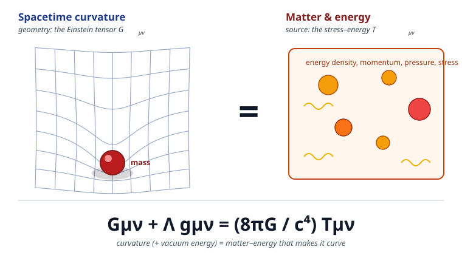

# Relativity (SR + GR) · Lesson 5.3: The Einstein field equations

> ⏱ ~15 min · Module 5: General relativity & the Einstein equations · Builds on: [5.2 Matter in curved spacetime & local conservation](#/lesson/relativity/05-02-matter-curved-spacetime.md), [4.7 Ricci, scalar curvature, and the Einstein tensor](#/lesson/relativity/04-07-ricci-einstein-tensor.md), [5.1 The equivalence principle](#/lesson/relativity/05-01-equivalence-principle.md) · Unlocks: 5.4 (the same equations from an action), 5.5 (the Newtonian limit that fixes the constant), and every solution in Module 6

## Why this matters

This is the summit. Everything in the last four modules — four-vectors, tensors, stress–energy, manifolds, Christoffels, Riemann, Ricci — was scaffolding for a single line:

$$\boxed{\,G_{\mu\nu} = \frac{8\pi G}{c^4}\,T_{\mu\nu}\,}$$

**In words: the curvature of spacetime (left) is set by the matter and energy in it (right).** This one tensor equation replaced Newton's law of gravity. From it fall black holes, gravitational waves, the bending of starlight, the precession of Mercury, gravitational time dilation (your phone's GPS corrects for it), and the expansion of the universe. Newton gave you a force; Einstein gave you a *geometry*, and told you exactly how mass sculpts it. The whole point of this lesson is not just to state the equation but to see why it *has* to be this equation — that the logic is nearly forced.

Throughout: signature $(-,+,+,+)$, Greek indices run $0,1,2,3$, and $c$ (speed of light) and $G$ (Newton's constant) are kept explicit.

## The idea

Start from what we already know must be true, and let it corner us into the answer.

**We know the source.** Gravity is sourced by mass–energy. The relativistic object that packages energy density, momentum density, pressure, and stress into one frame-independent tensor is the **stress–energy tensor** $T_{\mu\nu}$ (built in [3.3](#/lesson/relativity/03-03-stress-energy-tensor.md), put on curved backgrounds in [5.2](#/lesson/relativity/05-02-matter-curved-spacetime.md)). Crucially, it obeys **local conservation**: $\nabla_\mu T^{\mu\nu}=0$. That is not optional — it *is* energy–momentum conservation, and it must hold no matter what geometry $T$ sits in.

**So we know what the geometry side must look like.** If curvature $=$ (constant)$\times T_{\mu\nu}$, then whatever curvature tensor sits on the left must be:

1. **a tensor** (so the law holds in every frame — manifest covariance, the reason we built all this machinery);
2. **symmetric** and rank-2 with two lower indices (to match $T_{\mu\nu}$);
3. **built from the metric and its first two derivatives** (gravity is about how the metric curves — second derivatives of $g$ are where curvature lives, exactly like force is the second derivative of position);
4. **automatically divergence-free**: $\nabla_\mu(\text{left})^{\mu\nu}=0$, so that $\nabla_\mu T^{\mu\nu}=0$ is *guaranteed by the geometry*, not an extra assumption.

Requirement 4 is the killer. We need a symmetric, second-order-in-$g$ curvature tensor whose divergence vanishes *identically* — for **any** metric. And we already met exactly one such object.

**The Einstein tensor is the unique answer.** In [4.7](#/lesson/relativity/04-07-ricci-einstein-tensor.md) the contracted Bianchi identity handed us
$$G_{\mu\nu} \equiv R_{\mu\nu} - \tfrac12 g_{\mu\nu}R, \qquad \nabla_\mu G^{\mu\nu}=0 \ \text{ automatically.}$$
It is symmetric, built from the Ricci tensor $R_{\mu\nu}$ and scalar $R$ (both contractions of Riemann, i.e. second derivatives of $g$), and its divergence vanishes as an *identity* — a free consequence of the Bianchi identity, true for every spacetime. That is precisely the shopping list above. Set $G_{\mu\nu}$ proportional to $T_{\mu\nu}$ and conservation of energy–momentum comes out on the house. Nothing else with these properties exists (Lovelock's theorem makes "nothing else" a precise statement in 4D). The field equations were nearly inevitable.

## The formal version

**The Einstein field equations.**
$$G_{\mu\nu} = R_{\mu\nu} - \tfrac12 g_{\mu\nu}R = \frac{8\pi G}{c^4}\,T_{\mu\nu}.$$
In words: the Einstein tensor of the metric equals the stress–energy tensor, up to the coupling constant $\kappa \equiv 8\pi G/c^4$.

**Why $8\pi G/c^4$?** The constant is not free — it is fixed by demanding that in the weak-field, slow-motion regime the equations reproduce Newtonian gravity, i.e. that $g_{00}\approx -(1+2\Phi/c^2)$ with $\nabla^2\Phi = 4\pi G\rho$ (Poisson's equation). Carrying that limit through (the job of [5.5](#/lesson/relativity/05-05-newtonian-limit-redshift.md)) forces $\kappa = 8\pi G/c^4$. Its smallness — $c^4/G$ is enormous — is why spacetime is stiff: it takes a planet's worth of mass to bend it perceptibly.

**Wheeler's summary.** John Wheeler compressed the whole theory into one sentence:

> *Matter tells spacetime how to curve; spacetime tells matter how to move.*

The first half is the field equations above. The **second half is the geodesic equation** from [4.5](#/lesson/relativity/04-05-geodesics.md): free-falling matter follows geodesics of the curved metric. Together they close the loop — matter curves the geometry, the geometry steers the matter, which re-sources the geometry. (And it is genuinely coupled: because energy itself gravitates, you cannot solve one half without the other.)

**The cosmological constant.** There is exactly one more term you are *allowed* to add without spoiling any requirement above. Since $\nabla_\mu g^{\mu\nu}=0$ (metric compatibility, [4.4](#/lesson/relativity/04-04-covariant-derivative-christoffel.md)), the term $\Lambda g_{\mu\nu}$ is also symmetric, second-order-compatible, and divergence-free. So the most general admissible law is
$$G_{\mu\nu} + \Lambda g_{\mu\nu} = \frac{8\pi G}{c^4}\,T_{\mu\nu}.$$
In words: a constant $\Lambda$ (the **cosmological constant**) adds curvature even in empty space. Einstein introduced it to force a static universe, then called it his "biggest blunder" when Hubble found expansion. It has returned with a vengeance: moved to the right-hand side, $-\frac{c^4\Lambda}{8\pi G}g_{\mu\nu}$ is a stress–energy with negative pressure — **dark energy**, the driver of today's accelerating expansion (the astrophysical story lives in [astrophysics 6.5](#/lesson/astrophysics/06-05-dark-energy-acceleration.md)).

**What kind of equations these are.** Because $G_{\mu\nu}$ is symmetric, the field equations are **10 coupled equations** — one per independent component (Problem 1). They are equations *for the metric* $g_{\mu\nu}$: $G_{\mu\nu}$ is built from $g$, its first derivatives (Christoffels), and its second derivatives (Riemann). And they are **nonlinear**: $R_{\mu\nu}$ contains products of Christoffels, which are themselves ratios/products of $g$ and $\partial g$. Physically, the nonlinearity says **gravity gravitates** — curvature carries energy, that energy sources more curvature. You cannot superpose two solutions to get a third, which is exactly why the two-body problem has no closed form in GR and why exact solutions (Schwarzschild, [6.1](#/lesson/relativity/06-01-schwarzschild-solution.md); FLRW, [6.6](#/lesson/relativity/06-06-flrw-metric.md)) are rare and precious — each one is a landmark, obtained only by imposing enough symmetry to tame the nonlinearity. Finally, of the 10 equations, the four with a time derivative structure split off as **constraints** the initial data must satisfy (the $G^{0\nu}$ components carry no second time derivative), while the rest evolve the geometry forward — the initial-value formulation that makes GR a predictive dynamical theory.

## Picture

## Worked examples

**Example 1 (the logic made mechanical — checking $\nabla_\mu G^{\mu\nu}=0$ does the work).** Suppose someone proposes the "obvious" field equation $R_{\mu\nu} = \kappa T_{\mu\nu}$ (Ricci equals source). Take the covariant divergence of both sides. The right side gives $\kappa\nabla_\mu T^{\mu\nu}=0$ (conservation). So the left side must satisfy $\nabla_\mu R^{\mu\nu}=0$. But the contracted Bianchi identity ([4.7](#/lesson/relativity/04-07-ricci-einstein-tensor.md)) says $\nabla_\mu R^{\mu\nu} = \tfrac12\nabla^\nu R$, which is **not** generally zero. So $R_{\mu\nu}=\kappa T_{\mu\nu}$ would force $\nabla^\nu R=0$ — an illegitimate extra restriction on the matter. The fix is to subtract the piece that cancels the offending term: $G_{\mu\nu}=R_{\mu\nu}-\tfrac12 g_{\mu\nu}R$ has $\nabla_\mu G^{\mu\nu}=\nabla_\mu R^{\mu\nu}-\tfrac12\nabla^\nu R = 0$ identically. The $-\tfrac12 g_{\mu\nu}R$ is not decoration — it is the term that makes conservation automatic.

**Example 2 (reading the equation as physics — light and the trace).** The right-hand side is not "mass density." It is the full stress–energy: energy density $T_{00}$, momentum density $T_{0i}$, and stresses/pressures $T_{ij}$. **Pressure gravitates too.** For a static perfect fluid the effective gravitating density is $\rho + 3p/c^2$, not just $\rho$ — a consequence you can read off the trace-reversed equations (Problem 3). This is why a sufficiently pressurized star cannot hold itself up: adding pressure to resist collapse *also adds* to the source of gravity, and past a threshold there is no stable configuration — the road to neutron stars and black holes. And for pure radiation the stress–energy is *traceless* ($T=0$), a fact we will use repeatedly; it makes light bend twice as much as a naive Newtonian photon would (the [6.2](#/lesson/relativity/06-02-orbits-precession-light-bending.md) light-bending result that confirmed GR in 1919).

## Watch out

- **You might think the source is mass.** It is *energy–momentum–stress* — the whole tensor $T_{\mu\nu}$. Pressure, momentum flux, and field energy all curve spacetime. Setting the source to $\rho$ alone is the Newtonian shadow, valid only in the slow, weak limit.
- **You might think "vacuum ($T=0$) means flat."** No — it means $R_{\mu\nu}=0$ (Ricci-flat), which is far weaker than $R^\rho{}_{\sigma\mu\nu}=0$ (Riemann-flat). The Ricci tensor is only part of Riemann; the rest (the Weyl tensor) is free to be nonzero. Empty space *outside* a star, and a passing gravitational wave, are both curved vacuums (Problem 2).
- **You might think the $-\tfrac12 g_{\mu\nu}R$ term is a convention you could drop.** It is the entire reason energy–momentum is conserved. Drop it and you get $R_{\mu\nu}=\kappa T_{\mu\nu}$, which is inconsistent with $\nabla_\mu T^{\mu\nu}=0$ unless $R$ is constant (Example 1).
- **You might think $\Lambda$ is "extra physics you bolt on."** It is the *only* other term the symmetry/conservation requirements permit, so leaving it out is itself a choice — a choice to set a fundamental constant to zero. Observation says it isn't zero.

## One-liner

> Spacetime curvature equals its matter–energy content, $G_{\mu\nu}=\tfrac{8\pi G}{c^4}T_{\mu\nu}$ — and the Einstein tensor is *forced* on the left because it is the unique symmetric, second-order, automatically-conserved curvature that can match the conserved source.

## Problems

**P1 (🟢)** In 4 spacetime dimensions, how many independent components does the symmetric equation $G_{\mu\nu}=\tfrac{8\pi G}{c^4}T_{\mu\nu}$ contain? Then explain how the **four** contracted Bianchi identities ($\nabla_\mu G^{\mu\nu}=0$) together with the **four**-fold freedom to choose coordinates cut this down, and state the number of true dynamical degrees of freedom that remain.

**P2 (🟡)** Show that in vacuum ($T_{\mu\nu}=0$) the field equations reduce to $R_{\mu\nu}=0$. Then explain why this does **not** force the Riemann tensor to vanish — i.e. why vacuum spacetime can still be curved — and name two physical examples.

**P3 (🔴, optional)** Take the trace of the field equations $G_{\mu\nu}=\tfrac{8\pi G}{c^4}T_{\mu\nu}$ (contract with $g^{\mu\nu}$) to solve for $R$, substitute back, and derive the **trace-reversed** form
$$R_{\mu\nu}=\frac{8\pi G}{c^4}\left(T_{\mu\nu}-\tfrac12 g_{\mu\nu}T\right),\qquad T\equiv g^{\mu\nu}T_{\mu\nu}.$$
Explain why this form is convenient. (Use $g^{\mu\nu}g_{\mu\nu}=4$ in 4D.)

Solutions

**P1** A symmetric $4\times4$ tensor has $\frac{n(n+1)}{2}=\frac{4\cdot5}{2}=\mathbf{10}$ independent components, so the field equations are **10 coupled equations** for the 10 independent components of $g_{\mu\nu}$.

But they are not 10 *independent* evolution equations. The contracted Bianchi identity $\nabla_\mu G^{\mu\nu}=0$ holds *identically*, one relation for each free index $\nu=0,1,2,3$ — that's **4** differential identities linking the ten equations. Concretely, the four $\nu$-components of $\nabla_\mu G^{\mu\nu}=0$ mean the four equations $G^{0\nu}=\kappa T^{0\nu}$ contain no second time derivative of the metric: they are **constraints** on the initial data, not evolution equations. That leaves $10-4=6$ genuine evolution equations.

Separately, GR has full **coordinate freedom** (general covariance): you may apply any smooth change of the 4 coordinates $x^\mu\to x'^\mu(x)$, which is 4 arbitrary functions. This lets you fix 4 of the metric's 10 components by a gauge choice (e.g. harmonic coordinates). So of the 10 metric components, 4 are pure gauge.

Net physical, propagating degrees of freedom:
$$10 \ (\text{metric components}) \; - \; 4 \ (\text{coordinate/gauge}) \; - \; 4 \ (\text{Bianchi constraints}) \; = \; \mathbf{2}.$$
The **2** surviving degrees of freedom are the two polarizations of the gravitational field — the "plus" and "cross" states of a gravitational wave ([5.6](#/lesson/relativity/05-06-linearized-gravity-waves.md)), the graviton's two helicities. The 10 equations describe far fewer physical freedoms than their count suggests, precisely because gauge and constraints eat the difference.

**P2** Set $T_{\mu\nu}=0$ in $R_{\mu\nu}-\tfrac12 g_{\mu\nu}R=\tfrac{8\pi G}{c^4}T_{\mu\nu}=0$. Contract with $g^{\mu\nu}$, using $g^{\mu\nu}R_{\mu\nu}=R$ and $g^{\mu\nu}g_{\mu\nu}=4$:
$$g^{\mu\nu}\!\left(R_{\mu\nu}-\tfrac12 g_{\mu\nu}R\right)=R-\tfrac12(4)R=R-2R=-R=0\ \Rightarrow\ R=0.$$
Put $R=0$ back into $R_{\mu\nu}-\tfrac12 g_{\mu\nu}R=0$: the second term dies and $\boxed{R_{\mu\nu}=0}$. Vacuum spacetimes are **Ricci-flat**.

This is *not* the same as flat. In 4D the Riemann tensor $R^\rho{}_{\sigma\mu\nu}$ has 20 independent components; the Ricci tensor $R_{\mu\nu}$ (its trace over one pair of indices) accounts for only 10 of them. The other 10 live in the **Weyl tensor** $C^\rho{}_{\sigma\mu\nu}$ — the completely trace-free part of Riemann — which $R_{\mu\nu}=0$ leaves entirely unconstrained. So a vacuum can carry pure Weyl curvature: nonzero tidal/geodesic-deviation effects ([4.6](#/lesson/relativity/04-06-riemann-geodesic-deviation.md)) with zero Ricci. Two physical examples: (i) the region *outside* a spherical star or black hole — empty, hence $R_{\mu\nu}=0$, yet strongly curved (this is the Schwarzschild solution, [6.1](#/lesson/relativity/06-01-schwarzschild-solution.md)), which is why planets orbit at all; (ii) a **gravitational wave** propagating through empty space — curvature travelling through vacuum, pure Weyl, detected by LIGO.

**P3** Start from $R_{\mu\nu}-\tfrac12 g_{\mu\nu}R=\kappa T_{\mu\nu}$ with $\kappa\equiv\tfrac{8\pi G}{c^4}$. Contract both sides with $g^{\mu\nu}$:
$$g^{\mu\nu}R_{\mu\nu}-\tfrac12\big(g^{\mu\nu}g_{\mu\nu}\big)R = \kappa\, g^{\mu\nu}T_{\mu\nu} \ \Longrightarrow\ R-\tfrac12(4)R = \kappa T \ \Longrightarrow\ -R=\kappa T,$$
so $R=-\kappa T$. Substitute this back into the original equation to isolate $R_{\mu\nu}$:
$$R_{\mu\nu}=\kappa T_{\mu\nu}+\tfrac12 g_{\mu\nu}R=\kappa T_{\mu\nu}+\tfrac12 g_{\mu\nu}(-\kappa T)=\kappa\!\left(T_{\mu\nu}-\tfrac12 g_{\mu\nu}T\right).$$
That is the trace-reversed form,
$$\boxed{R_{\mu\nu}=\frac{8\pi G}{c^4}\left(T_{\mu\nu}-\tfrac12 g_{\mu\nu}T\right)}.$$
(The name: the source's trace flips sign, since the trace of the right side is $\kappa(T-\tfrac12\cdot4\cdot T)=-\kappa T$, matching $R=-\kappa T$.)

Why convenient: it puts the Ricci tensor **alone** on the left. (i) In **vacuum** $T_{\mu\nu}=0$ gives $R_{\mu\nu}=0$ instantly (Problem 2). (ii) For the **Newtonian limit** ([5.5](#/lesson/relativity/05-05-newtonian-limit-redshift.md)) you only need the single component $R_{00}$; with the trace-reversed form $R_{00}=\kappa(T_{00}-\tfrac12 g_{00}T)$ you plug in $T_{00}\approx\rho c^2$ directly, without first assembling the full $G_{\mu\nu}$. It converts "curvature $=$ source" into "Ricci curvature $=$ trace-reversed source," which is the shape most GR computations actually want.

## Flashback

**From Lesson 5.2 (Matter in curved spacetime):** For a **perfect fluid** with four-velocity $u^\mu$ (normalized $u^\mu u_\mu=-c^2$), mass density $\rho$, and pressure $p$, the stress–energy tensor is
$$T^{\mu\nu}=\Big(\rho+\frac{p}{c^2}\Big)u^\mu u^\nu + p\,g^{\mu\nu}.$$
Compute its trace $T\equiv g_{\mu\nu}T^{\mu\nu}$, and check what it gives for pressureless **dust** ($p=0$) and for **radiation** ($p=\rho c^2/3$).

Solution

Contract with $g_{\mu\nu}$, using $g_{\mu\nu}u^\mu u^\nu = u^\nu u_\nu = -c^2$ and $g_{\mu\nu}g^{\mu\nu}=4$:
$$T = g_{\mu\nu}T^{\mu\nu}=\Big(\rho+\frac{p}{c^2}\Big)(-c^2)+p\,(4) = -\rho c^2 - p + 4p = \boxed{-\rho c^2 + 3p}.$$

- **Dust** ($p=0$): $T=-\rho c^2$, just (minus) the rest-energy density — a nonrelativistic clump of matter.
- **Radiation** ($p=\rho c^2/3$): $T=-\rho c^2 + 3\cdot\tfrac{\rho c^2}{3}=0$ — **traceless**, exactly the property of the electromagnetic stress–energy tensor you built in [3.6](#/lesson/relativity/03-06-em-lagrangian-stress-energy.md). Light has no rest frame and no trace.

This trace is what feeds the trace-reversed field equations (Problem 3): the effective gravitating source $T_{00}-\tfrac12 g_{00}T$ works out to $\propto \rho c^2 + 3p$ — pressure gravitates, the fact behind Example 2's collapse threshold.

## Connections

- **Backward:** the left side is the Einstein tensor $G_{\mu\nu}=R_{\mu\nu}-\tfrac12 g_{\mu\nu}R$ from [4.7](#/lesson/relativity/04-07-ricci-einstein-tensor.md), whose divergence-free property (contracted Bianchi identity) is the whole reason it, and not $R_{\mu\nu}$, sits opposite the conserved source $T_{\mu\nu}$ ([5.2](#/lesson/relativity/05-02-matter-curved-spacetime.md), [3.3](#/lesson/relativity/03-03-stress-energy-tensor.md)). Wheeler's second clause — how matter moves — is the geodesic equation of [4.5](#/lesson/relativity/04-05-geodesics.md).
- **Forward:** [5.4](#/lesson/relativity/05-04-einstein-hilbert-action.md) rederives these very equations from a single action (Einstein–Hilbert), turning "guessed from symmetry" into "varied from a Lagrangian"; [5.5](#/lesson/relativity/05-05-newtonian-limit-redshift.md) takes the Newtonian limit that pins the constant to $8\pi G/c^4$; [5.6](#/lesson/relativity/05-06-linearized-gravity-waves.md) linearizes them into a wave equation. Module 6 solves them exactly — Schwarzschild ([6.1](#/lesson/relativity/06-01-schwarzschild-solution.md)) and FLRW ([6.6](#/lesson/relativity/06-06-flrw-metric.md)).
- **Sideways (astrophysics & cosmology):** the $\Lambda$ term is today's **dark energy**, driving cosmic acceleration ([astrophysics 6.5](#/lesson/astrophysics/06-05-dark-energy-acceleration.md)); the vacuum solutions predict **black holes** ([astrophysics 4.3](#/lesson/astrophysics/04-03-black-holes-astrophysics.md)) and the **gravitational waves** LIGO detects ([astrophysics 4.5](#/lesson/astrophysics/04-05-gravitational-waves-mergers.md)). One equation, three revolutions.
