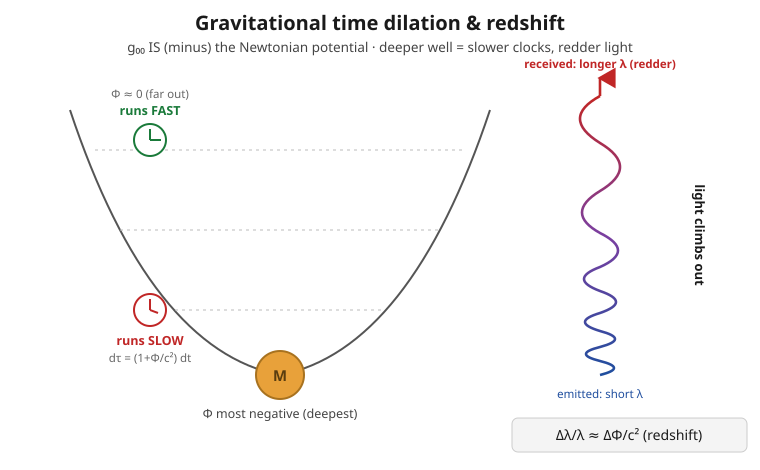

# Relativity (SR + GR) · Lesson 5.5: The Newtonian limit, redshift, and time dilation

> ⏱ ~15 min · Module 5: General relativity and the Einstein equations · Builds on: [5.3 The Einstein field equations](#/lesson/relativity/05-03-einstein-field-equations.md), [5.4 The Einstein–Hilbert action](#/lesson/relativity/05-04-einstein-hilbert-action.md), [4.5 Geodesics](#/lesson/relativity/04-05-geodesics.md), [5.1 The equivalence principle](#/lesson/relativity/05-01-equivalence-principle.md) · Unlocks: linearized gravity and gravitational waves (5.6), the Schwarzschild solution (6.1)

*Signature convention for this lesson: $(-,+,+,+)$, coordinates $x^\mu=(ct,x,y,z)$, so $\eta_{\mu\nu}=\mathrm{diag}(-1,+1,+1,+1)$. Latin indices $i,j$ run over space $1,2,3$; Greek over spacetime $0,1,2,3$. Factors of $c$ and $G$ are kept explicit throughout. $\Phi$ is the ordinary Newtonian gravitational potential (energy per unit mass, negative in a well); $\rho$ is mass density.*

## Why this matters

A new theory of gravity has to pass one non-negotiable exam before anyone believes it: **it must reproduce Newton where Newton works** — planets, apples, satellites, everyday weak fields. This lesson runs Einstein's equations through that exam and they pass, but not by reducing to Newton exactly. In the fine print, GR predicts things Newton never could: clocks lower in a gravitational well tick *slower*, and light climbing out of one gets *redder*. These are not exotic — they are measured daily. Your phone's GPS position is wrong by kilometers within a couple of hours unless the satellites' clocks are corrected for exactly the effect derived below. The punchline you'll carry away: **the Newtonian potential is not separate from the metric — it literally is the $g_{00}$ component.** Gravity, in the weak-field limit, is the sag of time.

## The idea

Take Einstein's spacetime and dial everything down toward the everyday: gravity **weak** (spacetime almost flat), matter **slow** ($v\ll c$), fields **static** (nothing changing in time). Three knobs, all turned low. In that corner, two questions have clean answers.

*How do particles move?* The geodesic equation — "free-fall is the straightest path" — collapses into $\ddot{\mathbf x}=-\nabla\Phi$, Newton's second law for gravity. The single metric component $g_{00}$ turns out to *be* the gravitational potential $\Phi$ in disguise.

*What makes the field?* The Einstein equations collapse into $\nabla^2\Phi = 4\pi G\rho$ — Poisson's equation, the field equation of Newtonian gravity. And here's the payoff for a puzzle from [5.3](#/lesson/relativity/05-03-einstein-field-equations.md): matching this to the known Newtonian answer is what *pins down* the mysterious coupling constant $8\pi G/c^4$ out front of the Einstein equations. It isn't chosen for elegance; it's forced by the demand that apples fall correctly.

Then the surplus. Because $g_{00}$ sets the rate at which a stationary clock's proper time accumulates, and because $g_{00}$ varies with $\Phi$, **clocks at different potentials run at different rates.** A clock deeper in a well (more negative $\Phi$) runs slow; light emitted there and received higher up arrives stretched — redshifted. Newton had no clocks in his equations, so he could never have seen this. It falls out of GR for free.

## The formal version

**The setup.** Write the metric as flat space plus a small bump:
$$g_{\mu\nu}=\eta_{\mu\nu}+h_{\mu\nu},\qquad |h_{\mu\nu}|\ll 1,$$
and impose **slow motion** ($dx^i/dt \ll c$, so $dx^i/d\tau \ll dx^0/d\tau$) and **static fields** ($\partial_0 h_{\mu\nu}=0$). We keep only first order in $h$. *In words: the geometry is Minkowski with a faint, unchanging dent.*

**Step 1 — the geodesic equation becomes Newton's law.** The geodesic equation from [4.5](#/lesson/relativity/04-05-geodesics.md) is
$$\frac{d^2 x^\mu}{d\tau^2}+\Gamma^\mu_{\alpha\beta}\frac{dx^\alpha}{d\tau}\frac{dx^\beta}{d\tau}=0.$$
Slow motion kills every term in the sum except $\alpha=\beta=0$ (the time component dominates the four-velocity), leaving $\ddot x^\mu = -\Gamma^\mu_{00}\,(\dot x^0)^2$. For a static, weak field the only surviving Christoffel piece is
$$\Gamma^i_{00}=\tfrac12 g^{i\lambda}\big(2\,\partial_0 g_{\lambda 0}-\partial_\lambda g_{00}\big)=-\tfrac12\,\partial_i h_{00},$$
using $\partial_0=0$ and $g^{i\lambda}\to\delta^{ij}$ to first order. With $\dot x^0=c\,\dot t\approx c$ and $\tau\approx t$, the spatial equation is
$$\boxed{\;\frac{d^2 x^i}{dt^2}=+\tfrac12\,c^2\,\partial_i h_{00}\;}$$
*In words: the acceleration of a slow free-falling particle is set entirely by the spatial gradient of the single component $h_{00}$.* Newton's law of gravity is $\ddot x^i=-\partial_i\Phi$. The two match if and only if
$$g_{00}=-\Big(1+\frac{2\Phi}{c^2}\Big),\qquad\text{i.e.}\qquad h_{00}=-\frac{2\Phi}{c^2}.$$
Check: $\tfrac12 c^2\,\partial_i h_{00}=\tfrac12 c^2\big(-\tfrac{2}{c^2}\partial_i\Phi\big)=-\partial_i\Phi.$ ✓ **The Newtonian potential is the $g_{00}$ piece of the metric.**

**Step 2 — the field equation becomes Poisson.** Use the **trace-reversed** form of the Einstein equations (from [5.3](#/lesson/relativity/05-03-einstein-field-equations.md)):
$$R_{\mu\nu}=\frac{8\pi G}{c^4}\Big(T_{\mu\nu}-\tfrac12 g_{\mu\nu}T\Big),\qquad T\equiv g^{\mu\nu}T_{\mu\nu}.$$
For slow matter the dominant stress–energy component is the rest-energy density $T_{00}\approx\rho c^2$; then $T\approx\eta^{00}T_{00}=-\rho c^2$, and the source combination is $T_{00}-\tfrac12 g_{00}T\approx \rho c^2-\tfrac12(-1)(-\rho c^2)=\tfrac12\rho c^2$. On the geometry side, the static linearized Ricci component is $R_{00}\approx\partial_i\Gamma^i_{00}=-\tfrac12\nabla^2 h_{00}=\tfrac{1}{c^2}\nabla^2\Phi$. Equate:
$$\frac{1}{c^2}\nabla^2\Phi=\frac{8\pi G}{c^4}\cdot\tfrac12\rho c^2\;\;\Longrightarrow\;\;\boxed{\;\nabla^2\Phi=4\pi G\rho\;}$$
*In words: Einstein's equations, squeezed into the weak-static-slow corner, are exactly Poisson's equation.* Run the constant backward — this is the whole point of the coefficient — and $\tfrac12\kappa c^4=4\pi G$ forces $\kappa=8\pi G/c^4$. **The Newtonian limit is what calibrates Einstein's equations.**

**Step 3 — gravitational time dilation.** A clock sitting at rest ($dx^i=0$) at potential $\Phi$ measures proper time
$$d\tau=\sqrt{-g_{00}}\;dt=\sqrt{1+\tfrac{2\Phi}{c^2}}\;dt\approx\Big(1+\frac{\Phi}{c^2}\Big)dt.$$
*In words: how fast your clock ticks per unit coordinate time is fixed by where you sit in the potential.* Since $\Phi<0$ in a well and grows more negative as you descend, $d\tau<dt$, and **deeper means slower.** Two static observers compare rates by the ratio of their $\sqrt{-g_{00}}$'s.

**Step 4 — gravitational redshift.** Light emitted at potential $\Phi_{\text{em}}$ and received at $\Phi_{\text{rec}}$ has its frequency scaled by the clock-rate ratio (each observer measures frequency against their own proper time):
$$\frac{\nu_{\text{rec}}}{\nu_{\text{em}}}=\frac{d\tau_{\text{em}}}{d\tau_{\text{rec}}}\approx\frac{1+\Phi_{\text{em}}/c^2}{1+\Phi_{\text{rec}}/c^2}\approx 1-\frac{\Delta\Phi}{c^2},\qquad \Delta\Phi\equiv\Phi_{\text{rec}}-\Phi_{\text{em}}.$$
For light *climbing out* of a well, $\Delta\Phi>0$, so $\nu$ drops and the wavelength grows:
$$\boxed{\;\frac{\Delta\lambda}{\lambda}\approx\frac{\Delta\Phi}{c^2}\;}$$
*In words: escaping a gravity well costs a photon energy, and it pays in redshift.* This is the exact-GR version of the equivalence-principle heuristic you met in [5.1](#/lesson/relativity/05-01-equivalence-principle.md) — same answer, now derived from the metric instead of a falling-elevator argument.

## Picture

## Worked examples

**Example 1 (mechanical — read the redshift off the metric).** Light leaves the surface of a compact star where $\Phi_{\text{em}}=-GM/R$ and is received far away where $\Phi_{\text{rec}}\approx 0$. Then $\Delta\Phi=0-(-GM/R)=GM/R$, so
$$\frac{\Delta\lambda}{\lambda}\approx\frac{\Delta\Phi}{c^2}=\frac{GM}{Rc^2}.$$
The receiver sees every spectral line shifted toward the red by this fraction. Notice $GM/Rc^2$ is half the ratio of the Schwarzschild radius to $R$ — the redshift is a direct, dimensionless readout of how relativistically compact the object is. (P1 evaluates this for the Sun.)

**Example 2 (why you'd care — the two effects on a satellite clock).** A clock at altitude sees *two* competing shifts relative to the ground. **Gravity** puts it at higher $\Phi$ (less negative), so it runs *fast* by $\Delta\Phi/c^2$. **Velocity** (special-relativistic time dilation, [1.3](#/lesson/relativity/01-03-dilation-contraction-paradoxes.md)) makes the moving clock run *slow* by $\tfrac12 v^2/c^2$. To first order the fractional rate difference is
$$\frac{\Delta(\text{rate})}{\text{rate}}\approx\underbrace{\frac{\Phi_{\text{sat}}-\Phi_{\text{gnd}}}{c^2}}_{\text{GR: clock fast}}-\underbrace{\frac{1}{2}\frac{v^2}{c^2}}_{\text{SR: clock slow}}.$$
For a GPS satellite the gravitational term wins: $\sim+46\ \mu$s/day up, $\sim-7\ \mu$s/day back, for a net $\approx +38\ \mu$s/day (P2 computes the gravitational piece; the Flashback computes the velocity piece). Uncorrected, that error accumulates into a positioning error of about $c\times 38\,\mu\text{s}\approx 11$ km *per day* — GPS is a working general-relativity experiment that millions of people trust with their driving directions.

## Watch out

- You might think the redshift comes from photons "losing kinetic energy fighting gravity like a thrown ball." That heuristic gives the right *number*, but the honest cause is that **the emitter's and receiver's clocks tick at different rates** — the frequency is fixed at emission per the emitter's clock and read out per the receiver's. It's a statement about time, not about a force on light.
- You might think "deeper in the well = stronger gravity = slower clock" is about the field *strength* $\mathbf g=-\nabla\Phi$. It is not: time dilation tracks the **potential $\Phi$ itself**, not its gradient. You could sit at the exact center of a hollow massive shell where $\mathbf g=0$, yet $\Phi$ is deeply negative and your clock still runs slow.
- You might expect $h_{00}=+2\Phi/c^2$ by pattern-matching. The sign is fixed by the signature: with $(-,+,+,+)$ and $\eta_{00}=-1$, recovering $\ddot x^i=-\partial_i\Phi$ *requires* $g_{00}=-(1+2\Phi/c^2)$, i.e. $h_{00}=-2\Phi/c^2$. Flip the signature convention and this sign flips too — always re-derive it rather than memorizing.
- You might treat "weak field" and "slow motion" as one assumption. They're independent: light moves at $c$ (not slow) yet still bends and redshifts in a weak field. We used slow motion only for the *geodesic → Newton* step; the redshift result needs only weak, static fields.

## One-liner

> In the weak-field limit $g_{00}=-(1+2\Phi/c^2)$ — Newton's potential is a component of the metric — so free-fall becomes $\ddot{\mathbf x}=-\nabla\Phi$, Einstein's equation becomes $\nabla^2\Phi=4\pi G\rho$ (which fixes the $8\pi G/c^4$), and clocks deeper in a well run measurably slower.

## Problems

**P1 (🟢)** Compute the gravitational redshift of light escaping the Sun's surface to a distant observer, $\dfrac{\Delta\lambda}{\lambda}=\dfrac{GM_\odot}{R_\odot c^2}$, and evaluate it numerically. Use $G=6.67\times10^{-11}\ \mathrm{N\,m^2/kg^2}$, $M_\odot=1.99\times10^{30}\ \mathrm{kg}$, $R_\odot=6.96\times10^{8}\ \mathrm{m}$, $c=3.00\times10^{8}\ \mathrm{m/s}$.

**P2 (🟡)** GPS. A satellite orbits at radius $r_{\text{sat}}\approx 4.2\,R_\oplus$; a ground clock sits at $r_{\text{gnd}}=R_\oplus$. Using $\Phi=-GM_\oplus/r$, estimate the *gravitational* fractional rate difference $\Delta\Phi/c^2$ between satellite and ground, and convert it to microseconds per day. Use $GM_\oplus=3.99\times10^{14}\ \mathrm{m^3/s^2}$, $R_\oplus=6.37\times10^{6}\ \mathrm{m}$, $c=3.00\times10^{8}\ \mathrm{m/s}$. (Which clock runs fast?)

**P3 (🔴, optional)** Derive $\nabla^2\Phi=4\pi G\rho$ as the weak-field, static, slow-motion limit of the Einstein field equations, starting from the trace-reversed form $R_{\mu\nu}=\kappa\big(T_{\mu\nu}-\tfrac12 g_{\mu\nu}T\big)$ with an *unknown* constant $\kappa$. Show explicitly that matching to Newton/Poisson forces $\kappa=8\pi G/c^4$. (Use $T_{00}\approx\rho c^2$, all other $T_{\mu\nu}$ negligible, and the linearized static result $R_{00}=-\tfrac12\nabla^2 h_{00}$.)

Solutions

**P1** Plug in:
$$\frac{\Delta\lambda}{\lambda}=\frac{GM_\odot}{R_\odot c^2}=\frac{(6.67\times10^{-11})(1.99\times10^{30})}{(6.96\times10^{8})(3.00\times10^{8})^2}.$$
Numerator: $6.67\times1.99=13.3$, so $1.33\times10^{20}$. Denominator: $6.96\times10^{8}\times9.00\times10^{16}=6.26\times10^{25}$. Ratio:
$$\frac{1.33\times10^{20}}{6.26\times10^{25}}\approx 2.1\times10^{-6}.$$
About **2 parts per million** — a shift equivalent to a Doppler velocity of $c\times2.1\times10^{-6}\approx 0.64\ \mathrm{km/s}$. Tiny, but resolvable in solar spectral lines, and confirmed.

**P2** The fractional rate difference is
$$\frac{\Delta\Phi}{c^2}=\frac{\Phi_{\text{sat}}-\Phi_{\text{gnd}}}{c^2}=\frac{GM_\oplus}{c^2}\Big(\frac{1}{R_\oplus}-\frac{1}{4.2R_\oplus}\Big)=\frac{GM_\oplus}{c^2 R_\oplus}\Big(1-\frac{1}{4.2}\Big).$$
Compute the prefactor:
$$\frac{GM_\oplus}{c^2 R_\oplus}=\frac{3.99\times10^{14}}{(9.00\times10^{16})(6.37\times10^{6})}=\frac{3.99\times10^{14}}{5.73\times10^{23}}=6.96\times10^{-10}.$$
And $1-1/4.2=0.762$, so $\Delta\Phi/c^2=6.96\times10^{-10}\times0.762\approx 5.3\times10^{-10}$. The satellite is at *higher* (less negative) potential, so **its clock runs fast**. Per day ($86{,}400$ s):
$$5.3\times10^{-10}\times 86{,}400\ \mathrm{s}\approx 4.6\times10^{-5}\ \mathrm{s}\approx \mathbf{46\ \mu s/day}.$$
This matches the textbook GPS gravitational blueshift; the velocity term (Flashback) subtracts about $7\ \mu$s/day for the familiar net $\approx 38\ \mu$s/day.

**P3** Start from $R_{\mu\nu}=\kappa\big(T_{\mu\nu}-\tfrac12 g_{\mu\nu}T\big)$ and take the $00$ component. For slow matter only $T_{00}\approx\rho c^2$ survives, so the trace is $T=g^{\mu\nu}T_{\mu\nu}\approx\eta^{00}T_{00}=(-1)(\rho c^2)=-\rho c^2$. The source term:
$$T_{00}-\tfrac12 g_{00}T\approx \rho c^2-\tfrac12(-1)(-\rho c^2)=\rho c^2-\tfrac12\rho c^2=\tfrac12\rho c^2.$$
So the right side is $R_{00}=\kappa\cdot\tfrac12\rho c^2$. For the left side, the static linearized Ricci component is $R_{00}=-\tfrac12\nabla^2 h_{00}$, and substituting $h_{00}=-2\Phi/c^2$ gives $R_{00}=-\tfrac12\nabla^2(-2\Phi/c^2)=\tfrac{1}{c^2}\nabla^2\Phi$. Equate the two:
$$\frac{1}{c^2}\nabla^2\Phi=\tfrac12\kappa\rho c^2\quad\Longrightarrow\quad \nabla^2\Phi=\tfrac12\kappa c^4\,\rho.$$
Newtonian gravity demands $\nabla^2\Phi=4\pi G\rho$, so
$$\tfrac12\kappa c^4=4\pi G\quad\Longrightarrow\quad \boxed{\kappa=\frac{8\pi G}{c^4}.}$$
The factor $8\pi$ and the $c^4$ are not aesthetic choices — they are the unique values that make GR reproduce measured Newtonian gravity.

## Flashback

**From Lesson 1.3 (Time dilation and length contraction):** A GPS satellite orbits at speed $v\approx 3.9\ \mathrm{km/s}$. Using *special*-relativistic time dilation, by what fraction — and how many microseconds per day — does its **velocity** make its clock run slow relative to a (non-orbiting) reference frame? Combine your answer with the $+46\ \mu$s/day gravitational effect from this lesson to get the net rate offset.

Solution

For $v\ll c$, the moving clock runs slow by the leading-order factor $\gamma-1\approx\tfrac12 v^2/c^2$:
$$\frac{1}{2}\frac{v^2}{c^2}=\frac{1}{2}\frac{(3.9\times10^{3})^2}{(3.00\times10^{8})^2}=\frac{1}{2}\frac{1.52\times10^{7}}{9.00\times10^{16}}\approx 8.5\times10^{-11}.$$
Per day: $8.5\times10^{-11}\times 86{,}400\ \mathrm{s}\approx 7.3\times10^{-6}\ \mathrm{s}\approx 7\ \mu$s/day, and the satellite clock runs **slow** by this much. Net offset: $+46-7\approx +39\ \mu$s/day fast (the standard figure is $\approx +38\ \mu$s/day). This is why GPS satellite clocks are deliberately manufactured to tick at a slightly offset rate before launch — the correction is built into the hardware.

## Connections

- **Backward:** this closes the loop opened in [5.1](#/lesson/relativity/05-01-equivalence-principle.md) (the equivalence-principle redshift, now derived exactly) and [5.3](#/lesson/relativity/05-03-einstein-field-equations.md) (the coupling $8\pi G/c^4$, now *derived* rather than asserted). It uses the geodesic equation from [4.5](#/lesson/relativity/04-05-geodesics.md) and the proper-time/line-element machinery from [4.3](#/lesson/relativity/04-03-metric-proper-time.md).
- **Forward:** [5.6](#/lesson/relativity/05-06-linearized-gravity-waves.md) keeps the same $g_{\mu\nu}=\eta_{\mu\nu}+h_{\mu\nu}$ expansion but drops the static assumption — the time-dependence you set to zero here becomes the gravitational wave. And [6.1](#/lesson/relativity/06-01-schwarzschild-solution.md)'s exact Schwarzschild metric has $g_{00}=-(1-2GM/rc^2)$, whose weak-field expansion is exactly $-(1+2\Phi/c^2)$ with $\Phi=-GM/r$ — this lesson is the first term of that exact answer.
- **Sideways (Newtonian gravity):** $\nabla^2\Phi=4\pi G\rho$ is the field equation you'd meet in [mechanics-refresher 5.1 (gravitation and Kepler)](#/lesson/mechanics-refresher/05-01-gravitation-kepler.md); GR *contains* it. It is the gravitational twin of Gauss's law from [em-refresher 1.2](#/lesson/em-refresher/01-02-gauss-law.md) — same Poisson structure, source $\rho$ instead of charge, coupling $4\pi G$ instead of $1/\epsilon_0$.
- **Sideways (experiment):** the Pound–Rebka experiment (1959) measured the tiny $\Delta\lambda/\lambda\approx gH/c^2\sim 10^{-15}$ redshift of gamma rays climbing a 22.5 m tower at Harvard, and the Hafele–Keating experiment (1971) flew atomic clocks around the world and caught both the gravitational and velocity offsets — the same two terms that keep GPS honest.
