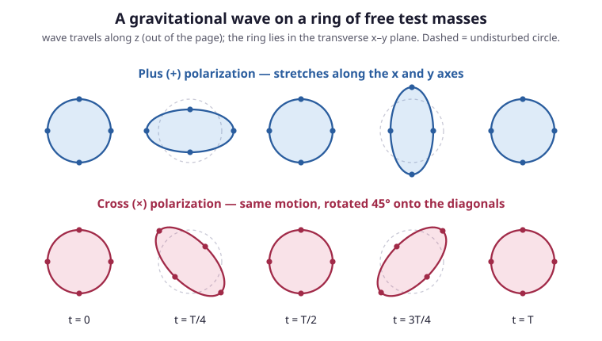

# Relativity (SR + GR) · Lesson 5.6: Linearized gravity and gravitational waves

> ⏱ ~15 min · Module 5: General relativity and the Einstein equations · Builds on: [5.5 The Newtonian limit and redshift](#/lesson/relativity/05-05-newtonian-limit-redshift.md), [5.3 The Einstein field equations](#/lesson/relativity/05-03-einstein-field-equations.md), [3.5 Electromagnetism as a field theory](#/lesson/relativity/03-05-em-field-theory.md) · Unlocks: Module 6 — the Schwarzschild solution and cosmology

## Why this matters

The Einstein equations are a nightmare to solve in general — ten coupled nonlinear PDEs for the metric. But most of the universe is *nearly* flat: far from any strong mass, spacetime deviates from Minkowski by only a whisper. In that regime you can **linearize** — keep only first order in the deviation — and the fearsome nonlinear machine collapses into something you already know cold: a wave equation, the same one Maxwell's fields obey ([3.5](#/lesson/relativity/03-05-em-field-theory.md)). Out of that comes the single most spectacular *dynamical* prediction of general relativity: **gravity has its own radiation**. Accelerating masses launch ripples in spacetime itself, travelling at $c$, that stretch and squeeze everything they pass through. A century after Einstein wrote them down, LIGO felt one — and this lesson is the theory that measurement confirmed ([astrophysics 4.5](#/lesson/astrophysics/04-05-gravitational-waves-mergers.md)).

## The idea

Write the metric as flat space plus a small correction, exactly as the weak-field limit of [5.5](#/lesson/relativity/05-05-newtonian-limit-redshift.md) did:

$$g_{\mu\nu} = \eta_{\mu\nu} + h_{\mu\nu}, \qquad |h_{\mu\nu}| \ll 1.$$

Here $\eta_{\mu\nu}=\mathrm{diag}(-1,+1,+1,+1)$ is the flat Minkowski metric (signature $(-,+,+,+)$ throughout), and $h_{\mu\nu}$ is a tiny perturbation — the "gravitational field" of the weak-field world. **Keep only first order in $h$**: every product $h\cdot h$ is discarded, indices are raised and lowered with $\eta$ (not $g$), and the nonlinear Einstein tensor becomes *linear* in $h$. That linearity is everything: linear equations superpose, Fourier-decompose, and have plane-wave solutions.

When you push this through, the curvature side of the Einstein equations turns into $\Box h$ — the wave operator acting on the metric perturbation. The right-hand side is the source (matter). So the equation reads, in schematic form, "$\Box(\text{metric ripple}) = \text{matter}$" — structurally identical to $\Box A^\mu = \text{current}$ for electromagnetism. Away from all matter the source is zero, and you're left with $\Box h = 0$: a **wave**, moving at the speed built into $\Box$, which is $c$. Gravity radiates.

The one wrinkle is **gauge**. Just as the electromagnetic potential $A_\mu$ is only defined up to $A_\mu \to A_\mu + \partial_\mu\lambda$ ([3.5](#/lesson/relativity/03-05-em-field-theory.md)), the perturbation $h_{\mu\nu}$ is only defined up to a small change of coordinates — the same physical spacetime, relabelled, looks like a different $h$. Choosing coordinates cleverly (the *harmonic* gauge) is what strips the field equation down to a pure wave equation, and a further choice (the *transverse-traceless* gauge) reveals that a gravitational wave has just **two** physical shapes.

## The formal version

**Trace-reversed perturbation.** Define the trace $h \equiv \eta^{\mu\nu}h_{\mu\nu} = h^\mu{}_\mu$ and the **trace-reversed perturbation**

$$\bar h_{\mu\nu} \equiv h_{\mu\nu} - \tfrac{1}{2}\eta_{\mu\nu}\,h.$$

In words: subtract off half the trace, packaged so the Einstein equation comes out clean. Its own trace is $\bar h = \eta^{\mu\nu}\bar h_{\mu\nu} = h - \tfrac12(4)h = -h$ (hence "trace-reversed"), and applying the operation twice returns $h_{\mu\nu}$.

**The linearized Einstein equations.** Feeding $g=\eta+h$ into the Einstein tensor $G_{\mu\nu}$ ([5.3](#/lesson/relativity/05-03-einstein-field-equations.md)) and keeping first order gives, after writing everything in terms of $\bar h$,

$$-\tfrac{1}{2}\Big(\Box\bar h_{\mu\nu} + \eta_{\mu\nu}\,\partial_\alpha\partial_\beta\bar h^{\alpha\beta} - \partial_\alpha\partial_\mu\bar h^\alpha{}_\nu - \partial_\alpha\partial_\nu\bar h^\alpha{}_\mu\Big) = \frac{8\pi G}{c^4}T_{\mu\nu},$$

where $\Box \equiv \eta^{\mu\nu}\partial_\mu\partial_\nu = -\tfrac{1}{c^2}\partial_t^2 + \nabla^2$ is the flat d'Alembertian. In words: the linearized curvature is a wave operator on $\bar h$ *plus three correction terms* — and those three terms all involve the divergence $\partial_\alpha\bar h^{\alpha}{}_{\nu}$, which gauge freedom lets us kill.

**Gauge freedom.** An infinitesimal coordinate change $x^\mu \to x^\mu + \xi^\mu(x)$ (with $\xi$ small) leaves the physics untouched but shifts the perturbation by

$$h_{\mu\nu} \to h_{\mu\nu} - \partial_\mu\xi_\nu - \partial_\nu\xi_\mu.$$

In words: relabelling coordinates changes the *components* of $h$ without changing the spacetime — the exact analogue of the electromagnetic gauge transformation $A_\mu \to A_\mu + \partial_\mu\lambda$. This is coordinate freedom, and we spend it to simplify the equations.

**Harmonic (Lorenz) gauge.** Choose $\xi^\mu$ so that

$$\partial^\mu \bar h_{\mu\nu} = 0.$$

In words: demand the divergence of $\bar h$ vanish — the gravitational twin of the Lorenz gauge $\partial_\mu A^\mu=0$. The three correction terms above are exactly this divergence, so they drop, and the field equations reduce to

$$\boxed{\ \Box\,\bar h_{\mu\nu} = -\frac{16\pi G}{c^4}\,T_{\mu\nu}\ }$$

In words: **each component of $\bar h$ obeys a sourced wave equation**, matter on the right. Compare $\Box A^\mu = -\mu_0 J^\mu$ from electromagnetism — the same structure, with the stress–energy tensor $T_{\mu\nu}$ sourcing gravity in place of the current $J^\mu$.

**Vacuum and gravitational waves.** Away from matter, $T_{\mu\nu}=0$:

$$\Box\,\bar h_{\mu\nu} = 0.$$

This is the wave equation. A plane wave $\bar h_{\mu\nu} = A_{\mu\nu}\,\exp(i k_\alpha x^\alpha)$ solves it iff $k_\alpha k^\alpha = 0$ — a **null** wave-vector — so its phase speed is $\omega/|\vec k| = c$. Gravitational disturbances propagate at exactly the speed of light.

**Transverse-traceless (TT) gauge.** The harmonic condition doesn't use up all the freedom: residual $\xi^\mu$ with $\Box\xi^\mu=0$ remain. Spend them to impose, for a wave travelling in the $z$-direction,

$$h_{0\mu} = 0 \ (\text{purely spatial}), \qquad h = 0 \ (\text{traceless, so } \bar h_{\mu\nu}=h_{\mu\nu}), \qquad \partial^i h_{ij}=0\ (\text{transverse}).$$

What survives is astonishingly little — only the two components in the plane *transverse* to the propagation:

$$h_{\mu\nu}^{\rm TT} = \begin{pmatrix} 0 & 0 & 0 & 0 \\ 0 & h_+ & h_\times & 0 \\ 0 & h_\times & -h_+ & 0 \\ 0 & 0 & 0 & 0 \end{pmatrix}\cos\!\big[\omega(t - z/c)\big].$$

In words: a plane gravitational wave has exactly **two physical polarizations**, called **plus** ($h_+$, the $xx=-yy$ pattern) and **cross** ($h_\times$, the $xy=yx$ pattern). Two numbers — that's the entire content of a gravitational wave at a point.

**Why quadrupole, and the strain scaling.** Solving the *sourced* equation $\Box\bar h = -\tfrac{16\pi G}{c^4}T$ far from a slowly-moving source gives the **quadrupole formula**,

$$\bar h_{ij} \sim \frac{2G}{c^4}\,\frac{1}{r}\,\ddot{Q}_{ij},$$

where $Q_{ij}$ is the source's mass **quadrupole moment** (the second moment of its mass distribution) and $r$ the distance. There is no monopole term (the total mass is conserved, $\dot M=0$) and no dipole term (the total momentum is conserved, so the mass dipole's second derivative $\ddot{\mathbf d}=\dot{\mathbf P}=0$) — the *same* conservation-law argument developed in [astrophysics 4.5](#/lesson/astrophysics/04-05-gravitational-waves-mergers.md). The leading radiator is therefore a *changing shape*: a spinning dumbbell, a compact binary. The prefactor $G/c^4 \approx 8\times10^{-45}$ (SI) is what makes the effect almost unmeasurably feeble.

## Picture

Watch one row across a full period $T$. The **plus** mode stretches the ring along $x$ while squeezing along $y$, then reverses — a circle breathing into a horizontal ellipse, back to a circle, into a vertical ellipse, back. The **cross** mode does the identical thing rotated by $45°$, stretching along the diagonals. The wave comes *out of the page* (along $z$); the distortion is entirely *transverse*. This oscillating ellipse is precisely what a laser interferometer like LIGO measures — the two arms lie along $x$ and $y$, and a passing plus-wave lengthens one while shortening the other.

## Worked examples

**Example 1 (mechanical — reading the polarizations off the matrix).** Take a pure plus-wave, $h_\times=0$, so the only nonzero spatial components are $h_{xx}=-h_{yy}=h_+\cos[\omega(t-z/c)]$. At fixed $z$, the line element in the transverse plane is

$$ds^2 = \big(1+h_+\cos\omega t\big)\,dx^2 + \big(1-h_+\cos\omega t\big)\,dy^2.$$

The metric coefficient on $dx^2$ and $dy^2$ oscillate *in antiphase*: when $x$-distances are stretched, $y$-distances are squeezed by the same fraction. That antiphase $\pm h_+$ is the plus pattern. Setting instead $h_+=0$, $h_\times\neq0$ gives cross-terms $h_{xy}=h_{yx}$; diagonalizing that $2\times2$ block gives eigen-directions at $45°$ — the same stretch/squeeze, rotated. Two independent matrices, two polarizations, no more.

**Example 2 (why you'd care — a binary as a rotating quadrupole).** Two stars of mass $m$ orbit at separation $a$ with angular frequency $\omega$. Their mass distribution, viewed from far away, is a dumbbell that *rotates* — so its quadrupole moment oscillates at $2\omega$ (a dumbbell looks the same after a half-turn), giving gravitational waves at frequency $2\omega$. Order of magnitude: $Q\sim m a^2$, so $\ddot Q \sim m a^2\omega^2 \sim m v^2$, twice the orbital kinetic energy. Using Kepler's law $\omega^2\sim Gm/a^3$,

$$\ddot Q \sim m a^2\cdot\frac{Gm}{a^3} = \frac{Gm^2}{a} \quad\Rightarrow\quad h \sim \frac{G}{c^4}\frac{\ddot Q}{r} \sim \frac{G^2 m^2}{c^4\,r\,a} = \Big(\underbrace{\tfrac{Gm}{c^2a}}_{\text{compactness}}\Big)\Big(\underbrace{\tfrac{Gm}{c^2r}}_{\text{size/distance}}\Big).$$

The strain is the product of two dimensionless small numbers: how *compact* the source is (how close $a$ is to the Schwarzschild scale $Gm/c^2$) and how far away it sits. Compact-object binaries maximize the first factor — which is why they, and essentially only they, are detectable (Problem 3).

## Watch out

- You might think gauge choices change the physics. They don't — $h_{\mu\nu}$ has ten components, gauge freedom ($\xi^\mu$, four functions) removes four, the harmonic constraint another four, leaving **two** physical degrees of freedom. The plus and cross amplitudes are gauge-invariant; the rest was coordinate bookkeeping.
- You might think a gravitational wave stretches everything, including your ruler, so the effect is unmeasurable. But a *rigid* ruler is held together by electromagnetic forces and barely moves; the wave changes the proper distance between *freely-falling* (unforced) test masses. LIGO's mirrors hang free — that's the whole design.
- You might read $\Box\bar h_{\mu\nu}=0$ as "gravity is linear." It is only *approximately* linear in the weak field. Full general relativity is nonlinear — gravitational waves themselves carry energy and hence gravitate. Linearization is the first term of an expansion, not the exact theory.
- You might expect dipole radiation, as in electromagnetism. Mass has one sign and momentum is conserved, so the mass dipole cannot oscillate — the leading channel is the quadrupole. This is *why* gravitational radiation is so much weaker than the electromagnetic radiation of a comparable charge ([astrophysics 4.5](#/lesson/astrophysics/04-05-gravitational-waves-mergers.md)).

## One-liner

> Linearize $g=\eta+h$, choose harmonic gauge, and Einstein's equations become $\Box\bar h_{\mu\nu}=-\tfrac{16\pi G}{c^4}T_{\mu\nu}$ — a wave equation whose vacuum solutions are quadrupole gravitational waves, travelling at $c$ with two transverse polarizations that squash a ring of masses into an oscillating ellipse.

## Problems

**P1 (🟢)** Starting from the harmonic-gauge field equation $\Box\bar h_{\mu\nu}=-\tfrac{16\pi G}{c^4}T_{\mu\nu}$, show that in vacuum it becomes a wave equation, write it out with $\Box$ expanded, and identify the propagation speed by plugging in a plane wave $\bar h_{\mu\nu}=A_{\mu\nu}\exp(ik_\alpha x^\alpha)$.

**P2 (🟡)** A plus-polarized wave $h_+ (t)=h_0\cos\omega t$ passes (along $z$) through a ring of free test masses of radius $L$ lying in the $x$–$y$ plane. Find the fractional length changes $\Delta L/L$ between the center and the masses on the $x$-axis and on the $y$-axis, to first order in $h_0$. Show they are equal and opposite and proportional to $h_0$, and describe the shape of the ring at $\omega t = 0,\ \tfrac{\pi}{2},\ \pi$.

**P3 (🔴, optional)** Use the quadrupole scaling $h\sim \tfrac{2G}{c^4}\tfrac{\ddot Q}{r}$ with $\ddot Q\sim Gm^2/a$ (Example 2) to estimate the peak strain from a GW150914-like binary black hole: two holes of $m\approx 30\,M_\odot$ just before merger, separation $a\approx 2\times10^5$ m, at distance $r\approx1.3\times10^{25}$ m ($\approx1.3$ billion light-years; cf. [astrophysics 4.5](#/lesson/astrophysics/04-05-gravitational-waves-mergers.md)). Confirm $h\sim10^{-21}$ and comment on why detection is so hard. (Use $G=6.67\times10^{-11}$, $c=3\times10^8$ SI, $M_\odot=2\times10^{30}$ kg.)

Solutions

**P1** In vacuum $T_{\mu\nu}=0$, so the equation is immediately

$$\Box\,\bar h_{\mu\nu}=0, \qquad \Box = \eta^{\alpha\beta}\partial_\alpha\partial_\beta = -\frac{1}{c^2}\frac{\partial^2}{\partial t^2}+\nabla^2.$$

Written out, $\left(-\dfrac{1}{c^2}\partial_t^2+\nabla^2\right)\bar h_{\mu\nu}=0$ — component-by-component the standard scalar wave equation, whose general form $\left(-\dfrac{1}{v^2}\partial_t^2+\nabla^2\right)\psi=0$ propagates disturbances at speed $v$. Matching, $v=c$.

To confirm, substitute the plane wave. Since $\partial_\alpha\exp(ik_\beta x^\beta)=ik_\alpha\exp(\cdots)$,

$$\Box\,\bar h_{\mu\nu}= \eta^{\alpha\beta}(ik_\alpha)(ik_\beta)A_{\mu\nu}e^{ik\cdot x} = -\,k_\alpha k^\alpha\,\bar h_{\mu\nu}=0 \ \Rightarrow\ k_\alpha k^\alpha=0.$$

The wave-vector is **null**. Writing $k^\alpha=(\omega/c,\ \vec k)$, the null condition $k_\alpha k^\alpha = -\omega^2/c^2 + |\vec k|^2 = 0$ gives $\omega = c|\vec k|$, so the phase speed is

$$\frac{\omega}{|\vec k|} = c.$$

Gravitational waves travel at exactly the speed of light — the same null cones as light itself. ∎

**P2** The proper distance between the center and a mass is measured with the perturbed metric. Along the $x$-axis, the TT line element is $ds^2=(1+h_+)\,dx^2$ (at fixed $t$, with $h_+=h_0\cos\omega t$), so the proper length out to coordinate distance $L$ is

$$\ell_x = \int_0^{L}\sqrt{1+h_+}\,dx = L\sqrt{1+h_+}\approx L\Big(1+\tfrac{1}{2}h_+\Big),$$

using $\sqrt{1+\epsilon}\approx1+\tfrac12\epsilon$ to first order. Hence

$$\frac{\Delta L}{L}\Big|_x = \frac{\ell_x-L}{L}= +\tfrac{1}{2}h_0\cos\omega t.$$

Along the $y$-axis, $g_{yy}=1-h_+$, so by the identical computation

$$\frac{\Delta L}{L}\Big|_y = -\tfrac{1}{2}h_0\cos\omega t.$$

They are **equal in magnitude, opposite in sign, and $\propto h_0$** — when $x$ lengthens, $y$ shortens by the same fraction. The shape over a cycle:

- $\omega t=0$: $\cos=+1$, so $x$ stretched / $y$ squeezed — a **horizontal ellipse**.
- $\omega t=\tfrac{\pi}{2}$: $\cos=0$ — back to a **circle** (the wave passes through zero).
- $\omega t=\pi$: $\cos=-1$, so $x$ squeezed / $y$ stretched — a **vertical ellipse**.

The ring breathes between the two ellipses of the top row of the figure. (The factor $\tfrac12$ is why the *strain* $h$ is conventionally $\Delta L/L$ with $L$ the full arm: $h_{\rm arm}=\tfrac12 h_0$ for a single arm, but the *differential* between two perpendicular arms is $h_0$ — which is what an interferometer reads.) ∎

**P3** First the quadrupole's second derivative. With $m=30M_\odot = 6\times10^{31}$ kg and $a=2\times10^5$ m,

$$\ddot Q \sim \frac{Gm^2}{a}=\frac{(6.67\times10^{-11})(6\times10^{31})^2}{2\times10^5} =\frac{(6.67\times10^{-11})(3.6\times10^{63})}{2\times10^5}\approx1.2\times10^{48}\ \text{J}.$$

Then the strain, with $r=1.3\times10^{25}$ m and $\dfrac{2G}{c^4}=\dfrac{2(6.67\times10^{-11})}{8.1\times10^{33}}\approx1.6\times10^{-44}$ (SI),

$$h\sim\frac{2G}{c^4}\frac{\ddot Q}{r} = \big(1.6\times10^{-44}\big)\frac{1.2\times10^{48}}{1.3\times10^{25}} =\big(1.6\times10^{-44}\big)\big(9.2\times10^{22}\big)\approx1.5\times10^{-21}.$$

So $h\sim10^{-21}$, exactly the order of the real GW150914 peak strain. **Why detection is so hard:** this fractional stretch, over LIGO's $L=4$ km arms, is a length change $\Delta L = hL\sim10^{-21}\times4\times10^3 = 4\times10^{-18}$ m — thousands of times *smaller than a proton*. The strain is fixed by the astrophysics (the $G/c^4$ prefactor is nature's, not ours); only heroic interferometry — kilometer arms, hundreds of laser bounces, seismic isolation — can resolve a displacement that small. That the source is the most violent event since the Big Bang, and it still only jiggles a mirror by a thousandth of a proton, is the whole story of why it took a century. ∎

## Flashback

**From Lesson 2.1 (Index notation and the Minkowski metric):** The trace-reversed perturbation is $\bar h_{\mu\nu}=h_{\mu\nu}-\tfrac12\eta_{\mu\nu}h$, with $h\equiv\eta^{\mu\nu}h_{\mu\nu}$. Using only index contraction with $\eta$ (recall $\eta^{\mu\nu}\eta_{\mu\nu}=\delta^\mu{}_\mu=4$ in four dimensions): (a) show its trace is $\bar h=-h$; (b) show that applying trace-reversal a *second* time recovers the original, i.e. $\bar{\bar h}_{\mu\nu}=h_{\mu\nu}$.

Solution

(a) Contract with $\eta^{\mu\nu}$, pulling it through each term:

$$\bar h = \eta^{\mu\nu}\bar h_{\mu\nu} = \eta^{\mu\nu}h_{\mu\nu} - \tfrac12\big(\eta^{\mu\nu}\eta_{\mu\nu}\big)h = h - \tfrac12(4)h = h-2h = -h.$$

The trace flips sign — the name is literal.

(b) Trace-reversal is the map $h_{\mu\nu}\mapsto \bar h_{\mu\nu}=h_{\mu\nu}-\tfrac12\eta_{\mu\nu}h$. Apply it again, feeding in $\bar h_{\mu\nu}$ and its trace $\bar h=-h$ from (a):

$$\bar{\bar h}_{\mu\nu} = \bar h_{\mu\nu} - \tfrac12\eta_{\mu\nu}\,\bar h = \Big(h_{\mu\nu}-\tfrac12\eta_{\mu\nu}h\Big) - \tfrac12\eta_{\mu\nu}(-h) = h_{\mu\nu}-\tfrac12\eta_{\mu\nu}h+\tfrac12\eta_{\mu\nu}h = h_{\mu\nu}.$$

The operation is its own inverse (an involution) — which is exactly why nothing is lost by working with $\bar h$ instead of $h$; you can always trace-reverse back. ∎

## Connections

- **Backward:** this is the weak-field metric $g=\eta+h$ of [5.5](#/lesson/relativity/05-05-newtonian-limit-redshift.md) taken *dynamical* — 5.5 kept the static $g_{00}$ piece and recovered Newton; here the time-dependent, spatial pieces radiate. The wave equation and gauge freedom are lifted wholesale from electromagnetism ([3.5](#/lesson/relativity/03-05-em-field-theory.md)): $\partial^\mu\bar h_{\mu\nu}=0$ is Lorenz gauge, $\Box\bar h=-\tfrac{16\pi G}{c^4}T$ is the sourced wave equation, and the physical stretching of the ring is the geodesic deviation / tidal-force story of Module 4.6 in action.
- **Forward:** this closes Module 5 and completes **Boss Problem 5** (linearize, gauge-fix, exhibit the two TT polarizations on a ring). Module 6 turns to the *strong*-field, exact solutions — Schwarzschild and FLRW — where linearization fails and the full nonlinear Einstein equations must be solved.
- **Sideways (astrophysics):** the theory here is the equation LIGO's data obey; the *sources* — inspiraling neutron-star and black-hole binaries, the chirp, the $10^{-21}$ strain, GW150914 and GW170817 — live in [astrophysics 4.5](#/lesson/astrophysics/04-05-gravitational-waves-mergers.md). Relativity supplies the wave; astrophysics supplies the antenna and the sky.
