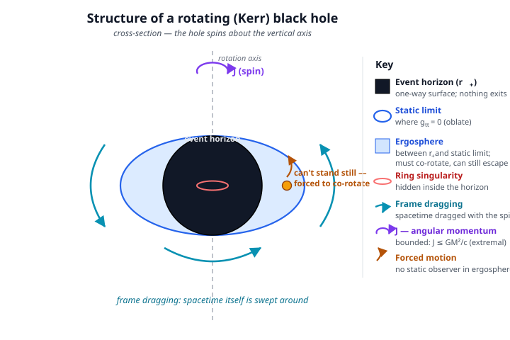

# Relativity (SR + GR) · Lesson 6.4: Black holes II — rotating and charged holes

> ⏱ ~15 min · Module 6: Solutions — black holes and cosmology · Builds on: [6.1 The Schwarzschild solution](#/lesson/relativity/06-01-schwarzschild-solution.md), [6.3 Black holes I: horizons](#/lesson/relativity/06-03-black-holes-horizons.md), [4.3 The metric & proper time](#/lesson/relativity/04-03-metric-proper-time.md) · Unlocks: black-hole thermodynamics (6.5)

## Why this matters

Schwarzschild's black hole is a fiction in one respect: it doesn't spin. But *every* real black hole spins, usually fast. A star collapses conserving its angular momentum, and shrinking a rotating object to a few kilometres spins it up ferociously — the same reason a pulsar rotates hundreds of times a second. So the astrophysically honest black hole is the **rotating** one, and rotation changes everything near the hole: it drags spacetime bodily around with it, opens a region outside the horizon where *nothing can hold still*, and stores an enormous reservoir of rotational energy that can be tapped. That reservoir is not a curiosity — it is very likely what powers quasars and the relativistic jets that outshine whole galaxies. Real black holes spin, drag spacetime, and run the brightest engines in the universe.

## The idea

Start with a shocking simplification. Take any lump of collapsing matter — a star with its magnetic fields, its chemical composition, its lumps and ripples — and let it form a black hole. Almost everything about it is **erased**. The messy details radiate away as gravitational and electromagnetic waves, and what settles down is characterized by just **three numbers**: mass $M$, angular momentum $J$ (spin), and electric charge $Q$. This is the **no-hair theorem**: a stationary black hole has "no hair," no extra features. Two black holes with the same $M, J, Q$ are *identical*, no matter what fell in to make them.

For real astrophysical holes $Q\approx 0$ (any net charge quickly neutralizes by pulling in opposite charge from the surrounding plasma), but $J$ is generically large. So the black hole that matters is the **Kerr** hole: mass and spin, nothing else.

Now picture what spin does. Drop a spinning bowling ball into honey: the honey near it gets dragged around, swirling. A spinning mass does the same thing to *spacetime itself* — this is **frame dragging**. Close enough to a fast-spinning hole, the dragging becomes so overwhelming that you *cannot stand still*, no matter how powerful your rocket. Space is being swept past you faster than you could ever swim against it. The region where this happens — outside the horizon, so you can still escape — is the **ergosphere**, and it is where the universe's most violent engines get their fuel.

## The formal version

*(Signature $(-,+,+,+)$ throughout; $c$ and $G$ kept explicit.)*

**No-hair theorem (informal).** A stationary, asymptotically flat black-hole solution of the Einstein(–Maxwell) equations is completely specified by three parameters: mass $M$, angular momentum $J$, and charge $Q$.

> In words: a black hole remembers only how heavy it is, how fast it spins, and its net charge — every other detail of what formed it is radiated away.

**The Kerr metric.** Found by Roy Kerr in 1963, it is the exact vacuum solution for a spinning mass. Written in Boyer–Lindquist coordinates $(t,r,\theta,\phi)$ it is a mouthful, but its physics lives in two functions and one cross-term. Define the **spin parameter** (a length)

$$a \equiv \frac{J}{Mc},\qquad r_s \equiv \frac{2GM}{c^2}\ (\text{Schwarzschild radius}),$$

and

$$\Delta(r) = r^2 - r_s\,r + a^2,\qquad \Sigma(r,\theta) = r^2 + a^2\cos^2\theta.$$

The metric's essential structure is

$$ds^2 = -\left(1-\frac{r_s r}{\Sigma}\right)c^2\,dt^2 \;-\; \frac{2 r_s r a \sin^2\theta}{\Sigma}\,c\,dt\,d\phi \;+\; \frac{\Sigma}{\Delta}\,dr^2 \;+\; \Sigma\,d\theta^2 \;+\; (\cdots)\sin^2\theta\,d\phi^2.$$

Three features are all you need:

- **The off-diagonal $g_{t\phi}$ term** (the $dt\,d\phi$ piece) is new — it vanishes only when $a=0$. It is the mathematical fingerprint of **frame dragging**: time and angle are cross-coupled, so "sitting still in $\phi$" is not a natural state of motion. A freely falling observer released from rest with no angular momentum nevertheless acquires angular velocity $d\phi/dt>0$ — dragged along with the hole. This is the **Lense–Thirring effect** (measured for Earth's tiny spin by Gravity Probe B).

  > In words: near a spinning mass, spacetime is swept around, so even a "non-orbiting" object is carried into rotation.

- **The horizon** sits where $\Delta=0$ (there the $g_{rr}=\Sigma/\Delta$ term blows up, as it did at $r_s$ for Schwarzschild):

$$r_+ = \frac{GM}{c^2} + \sqrt{\left(\frac{GM}{c^2}\right)^2 - a^2}.$$

  > In words: the one-way surface. Setting $a=0$ recovers $r_+ = 2GM/c^2 = r_s$.

- **The static limit** sits where $g_{tt}=0$, i.e. where $1-r_s r/\Sigma=0$:

$$r_{\text{stat}}(\theta) = \frac{GM}{c^2} + \sqrt{\left(\frac{GM}{c^2}\right)^2 - a^2\cos^2\theta}.$$

  > In words: the boundary outside which you *can* remain at rest and inside which you cannot. At the poles ($\cos^2\theta=1$) it coincides with $r_+$; at the equator ($\cos\theta=0$) it bulges out to $r_s$. So it is an **oblate** (flattened) surface hugging the round horizon at the poles and standing off from it at the equator.

**The ergosphere** is the region *between* the horizon and the static limit, $r_+ < r < r_{\text{stat}}$. Inside it $g_{tt}>0$. A would-be static observer traces a worldline with only $dt$ changing, so $ds^2 = g_{tt}\,c^2 dt^2 > 0$ — **spacelike**, which no massive particle (or light ray) can follow. Therefore inside the ergosphere you *must* have $d\phi\neq 0$: you are forced to co-rotate. But you are still outside the horizon, so you can also increase $r$ and escape. (Problem 3 works this out.)

**The extremal limit.** As $a$ grows, the square root in $r_+$ shrinks; it hits zero at

$$a = \frac{GM}{c^2}\quad\Longleftrightarrow\quad J = J_{\max} = \frac{GM^2}{c},$$

the **maximally spinning (extremal) Kerr hole**, with $r_+ = GM/c^2$ — exactly **half** the Schwarzschild radius. Spin any faster and $r_+$ becomes imaginary: the horizon disappears, exposing a naked singularity. Nature appears to forbid this (the **cosmic censorship** conjecture), and $J$ is bounded: **a black hole cannot spin arbitrarily fast.**

**The Penrose process.** Because static observers can't exist in the ergosphere, a particle there can have *negative* energy as measured from infinity. Roger Penrose's idea: send a particle in, let it split so that one fragment falls through the horizon on a negative-energy orbit; by conservation, the escaping fragment carries *more* energy than the original. The deficit is paid out of the hole's **rotational energy** — the hole spins down slightly. The extractable fraction is bounded by the **irreducible mass** $M_{\text{irr}}$ (the mass of the non-spinning hole with the same horizon area, which can never decrease). For a maximally spinning hole $M_{\text{irr}} = M/\sqrt2$, so the maximum extractable energy is

$$\Delta E_{\max} = (M - M_{\text{irr}})c^2 = \left(1-\tfrac{1}{\sqrt2}\right)Mc^2 \approx 0.29\,Mc^2.$$

> In words: up to about 29% of a maximal Kerr hole's entire mass-energy is stored as spin and can, in principle, be mined.

The astrophysical realization is not a splitting particle but magnetic fields threading the ergosphere — the **Blandford–Znajek mechanism** — which taps the same rotational reservoir electromagnetically and is the leading model for the relativistic jets of quasars and active galactic nuclei (the accretion-and-jet astrophysics lives in [astrophysics 4.3](#/lesson/astrophysics/04-03-black-holes-astrophysics.md) and its gravitational-wave siblings in [astrophysics 4.5](#/lesson/astrophysics/04-05-gravitational-waves-mergers.md)).

**Charged holes, in one line.** If $Q\neq 0$ and $J=0$ you get the **Reissner–Nordström** metric (replace $r_s r \to r_s r - r_Q^2$ with $r_Q^2 = GQ^2/(4\pi\epsilon_0 c^4)$); the general $M,J,Q$ hole is **Kerr–Newman**. But since real holes neutralize, **the astrophysically relevant black hole is essentially Kerr.**

## Picture

The horizon (black) is nearly round; the static limit (blue) bulges at the equator and touches the horizon at the poles. The crescent between them is the **ergosphere** — inside it, frame dragging (teal) forces everything to co-rotate, yet escape outward is still possible.

## Worked examples

**Example 1 (mechanical — extremal geometry).** Take an extremal Kerr hole, $a = GM/c^2$. Its horizon is at

$$r_+ = \frac{GM}{c^2} + \sqrt{\left(\frac{GM}{c^2}\right)^2 - \left(\frac{GM}{c^2}\right)^2} = \frac{GM}{c^2},$$

exactly half of $r_s = 2GM/c^2$. Its equatorial static limit is still at $r_{\text{stat}} = GM/c^2 + \sqrt{(GM/c^2)^2 - 0} = 2GM/c^2 = r_s$. So even for the fastest possible spin, the ergosphere on the equator stretches from $r_+ = GM/c^2$ out to $r_s = 2GM/c^2$ — a full Schwarzschild radius thick. There is always room to work.

**Example 2 (why you'd care — a black-hole battery).** How much energy could a maximal solar-mass Kerr hole deliver via spin extraction? Its total mass-energy is $Mc^2 = M_\odot c^2 = (1.989\times10^{30})(2.998\times10^8)^2 \approx 1.79\times10^{47}\ \mathrm J$. The extractable fraction is $\approx 0.29$, so

$$\Delta E_{\max} \approx 0.29\times 1.79\times10^{47} \approx 5.2\times10^{46}\ \mathrm J.$$

For scale, the Sun's *entire* fusion output over its 10-billion-year life is about $10^{44}\ \mathrm J$. A single maximal solar-mass hole holds ~500× that in spin alone — and real astrophysical holes are millions of solar masses. This is why spinning supermassive holes, tapped by Blandford–Znajek, can power a quasar for a hundred million years.

## Watch out

- **The ergosphere is not the horizon.** You might think "if you can't stand still, you're doomed." But the ergosphere lies *outside* the event horizon: worldlines there are still timelike toward larger $r$, so you can fire your rockets and leave. What you cannot do is stay at a fixed angle — you're forced to orbit. Only past $r_+$ is escape truly impossible.
- **Frame dragging is not a force.** Nothing is pushing you around. The geometry itself has been set spinning; "standing still" simply stops being an available timelike worldline. It's the same category of thing as gravity in GR — geometry, not force.
- **Spin has a ceiling.** You might expect you could always spin a hole up faster by dropping in orbiting matter. But approaching extremality, the horizon's ability to absorb angular momentum shuts down (infalling matter must co-rotate slower than the hole), so $J \le GM^2/c$ is respected. No naked singularities.
- **"No hair" is literal.** A hole made from antimatter and one made from matter, same $M,J,Q$, are indistinguishable. The information about what fell in isn't visible in the exterior geometry — a puzzle that returns with full force in [6.5](#/lesson/relativity/06-05-black-hole-thermodynamics.md) (the information paradox).

## One-liner

> A real black hole is a Kerr hole — three numbers ($M,J,Q$), a spin that drags spacetime into a can't-stand-still ergosphere, and up to 29% of its mass-energy stored as extractable spin.

## Problems

**P1 (🟢)** For a solar-mass extremal Kerr black hole ($M = M_\odot = 1.989\times10^{30}\ \mathrm{kg}$), compute (a) the maximal spin angular momentum $J_{\max} = GM^2/c$, and (b) the horizon radius $r_+ = GM/c^2$ in the extremal case. Confirm $r_+$ is half the Schwarzschild radius. Use $G = 6.674\times10^{-11}\ \mathrm{N\,m^2/kg^2}$, $c = 2.998\times10^8\ \mathrm{m/s}$.

**P2 (🟡)** Estimate the maximum energy extractable from that same maximal solar-mass Kerr hole via the Penrose process, as a fraction of $Mc^2$ and in joules. Then rank three energy-release efficiencies (energy out per unit rest-mass): hydrogen fusion ($\approx 0.7\%$), spin extraction from a maximal Kerr hole, and thermonuclear vs. accretion. Which wins, and by how much over fusion? (Accretion efficiencies are treated in [astrophysics 4.3](#/lesson/astrophysics/04-03-black-holes-astrophysics.md).)

**P3 (🔴, optional)** *Why the ergosphere forces co-rotation.* Consider an observer trying to remain **static** — fixed $r,\theta,\phi$, only $t$ advancing. (a) Write $ds^2$ for such a worldline in terms of $g_{tt}$, and state the condition on $g_{tt}$ for this worldline to be timelike (i.e. physically traversable by a massive body). (b) Using $g_{tt} = -\left(1-\frac{r_s r}{\Sigma}\right)c^2$, show that $g_{tt}$ changes sign at the static limit, and that just inside it a static worldline becomes spacelike — impossible. (c) Explain in one or two sentences why the observer can nonetheless escape, even though standing still is forbidden. (Emphasize: this happens *outside* the horizon.)

Solutions

**P1** (a) 

$$J_{\max} = \frac{GM^2}{c} = \frac{(6.674\times10^{-11})(1.989\times10^{30})^2}{2.998\times10^8}.$$

Numerator: $(1.989\times10^{30})^2 = 3.956\times10^{60}$; times $6.674\times10^{-11}$ gives $2.640\times10^{50}$. Divide by $2.998\times10^8$:

$$J_{\max} \approx 8.81\times10^{41}\ \mathrm{kg\,m^2/s}.$$

(b) First $GM/c^2 = \dfrac{(6.674\times10^{-11})(1.989\times10^{30})}{(2.998\times10^8)^2} = \dfrac{1.327\times10^{20}}{8.988\times10^{16}} \approx 1.477\times10^3\ \mathrm m \approx 1.48\ \mathrm{km}.$ So $r_+ = GM/c^2 \approx 1.48\ \mathrm{km}$. The Schwarzschild radius is $r_s = 2GM/c^2 \approx 2.95\ \mathrm{km}$, so indeed $r_+ = r_s/2$. ✓

**P2** Extractable fraction: $1 - 1/\sqrt2 = 1 - 0.7071 = 0.2929 \approx 29\%$. With $Mc^2 = (1.989\times10^{30})(2.998\times10^8)^2 = 1.788\times10^{47}\ \mathrm J$,

$$\Delta E_{\max} \approx 0.293\times 1.788\times10^{47} \approx 5.2\times10^{46}\ \mathrm J.$$

Ranking by efficiency $\eta = E_{\text{out}}/(m c^2)$:

| Process | $\eta$ |
|---|---|
| Hydrogen fusion (H → He) | $\approx 0.7\%$ |
| Accretion disk, non-spinning hole | $\approx 6\%$ |
| Penrose spin extraction (maximal Kerr) | $\approx 29\%$ |
| Accretion disk, near-maximal Kerr | up to $\approx 42\%$ |

Spin extraction beats hydrogen fusion by a factor of $\sim 0.29/0.007 \approx 40\times$. Gravity, not nuclear physics, is the most efficient way known to convert rest-mass into usable energy — the reason accreting/spinning black holes, not stars, power the brightest steady sources in the sky (astrophysics 4.3).

**P3** (a) A static worldline has $dr=d\theta=d\phi=0$, so only $g_{tt}$ contributes:

$$ds^2 = g_{tt}\,c^2\,dt^2 \quad(\text{writing the }dt^2\text{ coefficient as }g_{tt}c^2).$$

A massive observer needs a **timelike** worldline, $ds^2 < 0$ in the $(-,+,+,+)$ signature. Since $c^2 dt^2 > 0$, this requires $g_{tt} < 0$.

(b) With $g_{tt} = -\left(1 - \dfrac{r_s r}{\Sigma}\right)c^2$: outside the static limit the bracket $1-r_s r/\Sigma$ is positive, so $g_{tt}<0$ — timelike, standing still is fine. At the static limit $g_{tt}=0$ (the worldline goes null — you'd have to move at $c$ to hold position). Just **inside**, $r_s r/\Sigma > 1$, so the bracket is negative and $g_{tt} = -(\text{negative})c^2 > 0$. Then $ds^2 = g_{tt}c^2 dt^2 > 0$ — **spacelike**. No massive particle, and not even light, can hold a fixed $\phi$: the "sit still" worldline exits the light cone. To stay timelike you must let $\phi$ advance (co-rotate with the hole); the $g_{t\phi}$ cross term is exactly what makes a co-rotating timelike worldline available.

(c) The sign flip of $g_{tt}$ only forbids the *purely static* worldline; the radial direction is untouched — $g_{rr} = \Sigma/\Delta$ stays finite and positive all the way down to $r_+$, where $\Delta=0$. So an observer in the ergosphere can still increase $r$ and climb out; they simply cannot do it while remaining at a fixed angle. The true point of no return is the horizon $r_+$, which lies strictly *inside* the static limit.

## Flashback

**From Lesson 6.1 (The Schwarzschild solution):** A supermassive black hole of $M = 4\times10^6\,M_\odot$ (roughly Sagittarius A* at the Galactic center) is observed to be spinning near-extremally. Compute its Schwarzschild radius $r_s = 2GM/c^2$, and then state the extremal Kerr horizon radius for the same mass. (Use $GM_\odot/c^2 \approx 1.48\ \mathrm{km}$ from P1.)

Solution

For one solar mass, $GM_\odot/c^2 \approx 1.48\ \mathrm{km}$, so $r_s(M_\odot) = 2\times1.48 = 2.95\ \mathrm{km}$. Scaling linearly with mass:

$$r_s = 4\times10^6 \times 2.95\ \mathrm{km} \approx 1.18\times10^7\ \mathrm{km} \approx 1.2\times10^{10}\ \mathrm m.$$

(That's about $0.08$ AU — roughly a fifth of Mercury's orbital radius.) For a maximally spinning hole of the same mass, the horizon is *half* the Schwarzschild value: $r_+ = GM/c^2 = 4\times10^6\times1.48\ \mathrm{km} \approx 5.9\times10^6\ \mathrm{km} \approx 6\times10^9\ \mathrm m$. Spin literally shrinks the horizon.

## Connections

- **Backward:** this generalizes the [Schwarzschild solution](#/lesson/relativity/06-01-schwarzschild-solution.md) (the $a=0$, $Q=0$ special case) and reuses the horizon-vs-static distinction of [6.3](#/lesson/relativity/06-03-black-holes-horizons.md); the "worldline must stay timelike, $ds^2<0$" test is the causal structure of [1.4](#/lesson/relativity/01-04-spacetime-interval-causality.md) applied inside a metric.
- **Forward:** the irreducible mass never decreasing is the seed of the black-hole **area theorem** — the bridge to thermodynamics and entropy in [6.5](#/lesson/relativity/06-05-black-hole-thermodynamics.md).
- **Sideways (astrophysics):** frame dragging + ergosphere + Blandford–Znajek is the engine behind quasar and AGN jets — the observational and accretion-disk physics is developed in [astrophysics 4.3](#/lesson/astrophysics/04-03-black-holes-astrophysics.md), and spinning-hole mergers ring the spacetime measured by LIGO in [astrophysics 4.5](#/lesson/astrophysics/04-05-gravitational-waves-mergers.md).
