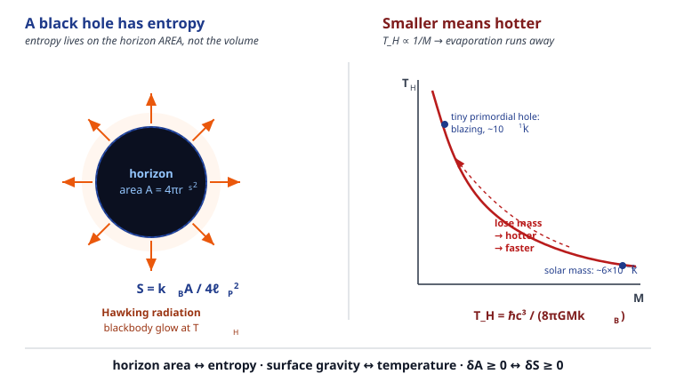

# Relativity (SR + GR) · Lesson 6.5: Black hole thermodynamics

> ⏱ ~15 min · Module 6: Solutions — black holes and cosmology · Builds on: [6.1 The Schwarzschild solution](#/lesson/relativity/06-01-schwarzschild-solution.md), [6.3 Black holes: horizons and the interior](#/lesson/relativity/06-03-black-holes-horizons.md), [5.5 The Newtonian limit and redshift](#/lesson/relativity/05-05-newtonian-limit-redshift.md) · Unlocks: cosmology — [6.6 The FLRW metric](#/lesson/relativity/06-06-flrw-metric.md)

*(Signature $(-,+,+,+)$ throughout; $c$, $G$, $\hbar$, $k_B$ are kept explicit — no natural units in this lesson.)*

## Why this matters

Here is where three cathedrals of physics — gravity, quantum theory, and thermodynamics — turn out to share a single foundation stone, and nobody expected it. A black hole is the simplest macroscopic object there is (just $M$, $J$, $Q$), a region so clean it should have no entropy at all. Yet throwing a hot cup of coffee past the horizon seems to *erase* the coffee's entropy from the universe, violating the second law of thermodynamics. The resolution — that the black hole itself carries an entropy proportional to its horizon **area** — forced physics to concede that spacetime is thermodynamic, that black holes glow, that they evaporate, and that information might be stored on surfaces rather than in volumes. This is the frontier where general relativity, the subject of this whole course, hands the baton to quantum gravity. It is the most important unsolved problem you will meet in this course, and it started as an accounting error about a cup of coffee.

## The idea

Start with the scandal. The second law says the total entropy of the universe never decreases (`stat-mech`, [6.2 Entropy, information, and the arrow of time](#/lesson/stat-mech/06-02-entropy-information-arrow.md): entropy is the missing information about the microstate). Drop an entropy-laden object into a black hole and it vanishes behind the horizon, where no signal can return. The outside universe's entropy just *dropped*. Either the second law is false, or the black hole absorbed that entropy and has entropy of its own.

Bekenstein bet on the second option, prompted by a clue Hawking had already proved geometrically: the horizon **area** of a black hole can never decrease. Merge two holes, drop matter in — the area only grows. That "never decreases" is *exactly* the signature of entropy. So Bekenstein proposed the outrageous identification: **a black hole's entropy is its horizon area** (in the right units). The bigger the horizon, the more microstates the hole could secretly be in, the more information it hides.

But entropy without temperature is incoherent — anything with entropy and energy has a temperature, and something with a temperature radiates. A truly black hole that only swallows would break the deal. Hawking set out to *disprove* Bekenstein by showing black holes can't radiate — and found the opposite. Quantum fields near the horizon force the hole to glow like a warm body, at a temperature set by its mass. The thermodynamic analogy was not an analogy. Black holes are literally thermodynamic objects: they have entropy, temperature, and they obey a first law. And because they radiate, they slowly **evaporate**.

## The formal version

**Four laws of black hole mechanics.** For a stationary black hole of mass $M$, angular momentum $J$, charge $Q$, and horizon area $A$, define the **surface gravity** $\kappa$ — loosely, the acceleration (measured far away) of a particle held just at the horizon. For Schwarzschild, $\kappa = c^4/(4GM)$. The laws mirror ordinary thermodynamics term for term:

- **Zeroth:** $\kappa$ is **constant over the entire horizon** of a stationary hole. *In words:* like temperature being uniform throughout a body in thermal equilibrium.
- **First:** $$c^2\,dM = \frac{\kappa c^2}{8\pi G}\,dA + \Omega_H\,dJ + \Phi\,dQ,$$ where $\Omega_H$ is the horizon's angular velocity and $\Phi$ its electric potential. *In words:* this is $dE = T\,dS + \text{work}$ — changing the hole's energy $Mc^2$ costs a piece $\propto \kappa\,dA$ (the "$T\,dS$" term) plus work done by spinning it up or charging it.
- **Second:** $$\delta A \ge 0$$ (Hawking's area theorem). *In words:* the horizon area never decreases, exactly like $\delta S \ge 0$.
- **Third:** you cannot reach $\kappa = 0$ (an extremal hole) in a finite number of steps. *In words:* like the unattainability of absolute zero.

The parallel is so tight that the pairing $\kappa \leftrightarrow T$ and $A \leftrightarrow S$ is forced. What fixes the *constants* is Hawking's quantum calculation.

**Bekenstein–Hawking entropy.** A black hole's entropy is

$$\boxed{\,S_{BH} = \frac{k_B c^3 A}{4 G\hbar} = \frac{k_B A}{4\ell_P^2}\,},\qquad \ell_P \equiv \sqrt{\frac{\hbar G}{c^3}} \approx 1.616\times10^{-35}\ \text{m},$$

with $A = 4\pi r_s^2$ the horizon area and $r_s = 2GM/c^2$ the Schwarzschild radius. *In words:* the entropy is one quarter of the horizon area **measured in Planck units** — count the horizon in tiny $\ell_P \times \ell_P$ tiles, and each four tiles carries about one $k_B$ (one bit) of entropy. Note what is *not* here: entropy scales with **area**, not volume — a shocking break from every ordinary system, where entropy is extensive in volume. That is the holographic hint (below).

**Hawking temperature.** Quantum field theory in the curved spacetime near the horizon shows the hole emits a thermal (blackbody) spectrum at

$$\boxed{\,T_H = \frac{\hbar \kappa}{2\pi k_B c} = \frac{\hbar c^3}{8\pi G M k_B}\,}.$$

*In words:* the temperature is set by the surface gravity, and for Schwarzschild it is **inversely proportional to the mass** — big holes are frigid, small holes are scorching. You can check the thermodynamics closes: $T_H\,dS_{BH} = \dfrac{\hbar \kappa}{2\pi k_B c}\cdot\dfrac{k_B c^3}{4G\hbar}\,dA = \dfrac{\kappa c^2}{8\pi G}\,dA$, which is exactly the first-law term above. The analogy is quantitatively real — the factor of $\tfrac14$ in the entropy and the $\tfrac{1}{2\pi}$ in the temperature lock together.

**Consequences.**

- **Evaporation.** A radiating hole loses energy, so $M$ falls; since $T_H \propto 1/M$, it gets *hotter* as it shrinks — a runaway ending in a final flash. The lifetime scales as $\tau \propto M^3$ (Problem 3). Stellar-mass holes have $\tau \sim 10^{67}$ yr, dwarfing the age of the universe; only tiny **primordial** holes ($\sim 10^{11}$–$10^{12}$ kg) could be expiring today.
- **Generalized second law (GSL).** The quantity that never decreases is $S_{\text{total}} = S_{\text{matter}} + S_{BH}$. *In words:* the coffee's entropy isn't destroyed — it's paid into the horizon's ledger, and the sum only grows. The second law survives, upgraded.
- **Information paradox.** Hawking radiation is *thermal* — it seems to depend only on $M$, $J$, $Q$, not on what fell in. If the hole evaporates completely, the infalling information appears to be gone, which quantum mechanics forbids (unitary evolution never destroys information; see `quantum-mechanics`). This clash between GR and quantum theory is unsolved and is a leading signpost toward quantum gravity.
- **Holography.** Entropy $\propto$ area, not volume, suggests the true degrees of freedom of a region live on its **boundary**, like a hologram encoding a 3D image on a 2D film. This "holographic principle" reshaped theoretical physics (AdS/CFT).

## Picture

Left: the horizon is a black disk whose **area** — not its interior volume — measures the entropy $S = k_B A/4\ell_P^2$, while Hawking radiation streams off it as a blackbody glow at $T_H$. Right: because $T_H \propto 1/M$, the temperature-vs-mass curve is a hyperbola — a solar-mass hole sits at the cold far end ($\sim 6\times10^{-8}$ K), a tiny primordial hole at the blazing near end. As a hole radiates it slides *up and left* along the curve: losing mass makes it hotter, which makes it radiate faster — the evaporation runaway.

## Worked examples

**Example 1 (mechanical — the entropy of a solar-mass hole).** Take $r_s \approx 3\times10^3$ m. The horizon area is

$$A = 4\pi r_s^2 = 4\pi(3\times10^3)^2 \approx 1.13\times10^{8}\ \text{m}^2.$$

With $\ell_P^2 = (1.616\times10^{-35})^2 = 2.61\times10^{-70}\ \text{m}^2$,

$$\frac{S_{BH}}{k_B} = \frac{A}{4\ell_P^2} = \frac{1.13\times10^{8}}{4(2.61\times10^{-70})} \approx 1.1\times10^{77}.$$

Compare the ordinary thermodynamic entropy of the *Sun* as a ball of hot gas: $S_\odot \sim 10^{58}\,k_B$. Collapsing that same mass into a black hole multiplies its entropy by a factor of $\sim 10^{19}$. **Black holes are the highest-entropy objects in the universe** — the supermassive holes at galactic centers dominate the entropy budget of the entire cosmos.

**Example 2 (why you'd care — how cold is that hole).** The Hawking temperature of the same solar-mass hole:

$$T_H = \frac{\hbar c^3}{8\pi G M_\odot k_B} = \frac{(1.055\times10^{-34})(2.70\times10^{25})}{8\pi(6.67\times10^{-11})(1.99\times10^{30})(1.38\times10^{-23})} \approx 6.2\times10^{-8}\ \text{K}.$$

That is 62 nanokelvin — far colder than the 2.7 K cosmic microwave background bathing it. So a real astrophysical black hole today *absorbs* CMB photons faster than it emits Hawking radiation: it is still **growing**, not evaporating. Evaporation only wins once the universe has expanded and cooled the CMB below $T_H$, in the very far future. The convenient scaling to remember:

$$T_H \approx 6.2\times10^{-8}\ \text{K}\times\frac{M_\odot}{M}.$$

## Watch out

- **You might think** the entropy scales with the black hole's volume, like every gas you've ever studied. **Actually** it scales with the horizon *area* — that is the whole surprise. A hole twice the radius has $4\times$ the entropy, not $8\times$. Extensivity-in-volume, which you took for granted in `stat-mech`, fails for gravity.
- **You might think** "smaller = colder," as for most everyday objects. **Actually** $T_H \propto 1/M$: black holes have *negative heat capacity* — lose energy and they heat up. This is why evaporation is a runaway and why black holes can't sit in stable thermal equilibrium with an infinite bath.
- **You might think** Hawking radiation means "pairs form at the horizon, one falls in, one escapes, and that's rigorously the mechanism." **Actually** that cartoon is a heuristic; the honest statement is that the quantum vacuum state defined by an infalling observer looks *thermally populated* to a distant observer (a Bogoliubov/Unruh-type effect). Useful picture, not a derivation — don't over-trust it.
- **You might think** the information paradox is settled. **Actually** it is open. Recent "island"/entanglement-entropy computations suggest information *does* come out, but a fully agreed mechanism within a complete theory of quantum gravity does not yet exist.

## One-liner

> A black hole is a thermodynamic object: its horizon *area* is entropy ($S = k_B A/4\ell_P^2$) and its surface gravity is temperature ($T_H = \hbar c^3/8\pi G M k_B$), so it glows, evaporates, and — because entropy lives on the boundary — whispers "holography."

## Problems

**P1 (🟢)** A black hole of $10\,M_\odot$ has $r_s \approx 30$ km $= 3\times10^4$ m. Compute its Bekenstein–Hawking entropy $S_{BH}/k_B$. By what factor does it exceed the solar-mass result of Example 1 ($1.1\times10^{77}$), and why is that factor what it is?

**P2 (🟡)** Compute the Hawking temperature of a **primordial** black hole of mass $M = 10^{12}$ kg (a mountain's mass squeezed to nuclear size). Compare it to the solar-mass value and to the 2.7 K CMB. Roughly, $k_B T_H$ in this case corresponds to what particle-physics energy scale (in MeV)? *(Hint: use the scaling $T_H \approx 6.2\times10^{-8}\,\text{K}\times M_\odot/M$ with $M_\odot = 1.99\times10^{30}$ kg; recall $k_B \times 1.16\times10^{10}\,\text{K} = 1$ MeV.)*

**P3 (🔴, optional)** *The $M^3$ evaporation law.* Model the hole as a blackbody of area $A \propto M^2$ radiating at $T_H \propto 1/M$, so its luminosity (Stefan–Boltzmann) is $L = \sigma A T_H^4$.
(a) Show $L \propto 1/M^2$, and hence that $c^2\,dM/dt = -L$ gives $M^2\,dM = -\text{const}\cdot dt$.
(b) Integrate from initial mass $M_0$ to $0$ to show the lifetime is $\tau = C M_0^3$ for a constant $C$, i.e. $\tau \propto M_0^3$.
(c) The full result is $\tau = \dfrac{5120\,\pi G^2 M_0^3}{\hbar c^4}$. Estimate the mass of a primordial hole whose lifetime equals the age of the universe, $\tau \approx 13.8\ \text{Gyr} = 4.35\times10^{17}\ \text{s}$ — i.e. one just finishing its evaporation *now*.

Solutions

**P1** Area: $A = 4\pi r_s^2 = 4\pi(3\times10^4)^2 = 4\pi(9\times10^8) = 1.13\times10^{10}\ \text{m}^2$. Then

$$\frac{S_{BH}}{k_B} = \frac{A}{4\ell_P^2} = \frac{1.13\times10^{10}}{4(2.61\times10^{-70})} \approx 1.1\times10^{79}.$$

That is exactly $100\times$ the solar-mass value. Reason: $S_{BH} \propto A \propto r_s^2 \propto M^2$, so multiplying the mass by 10 multiplies the entropy by $10^2 = 100$. (Entropy grows *faster* than mass — the quadratic scaling is why supermassive holes dominate the cosmic entropy budget.)

**P2** Using the scaling,

$$T_H = 6.2\times10^{-8}\ \text{K}\times\frac{1.99\times10^{30}}{10^{12}} = 6.2\times10^{-8}\times1.99\times10^{18}\ \text{K} \approx 1.2\times10^{11}\ \text{K}.$$

This is about $2\times10^{18}$ times hotter than the solar-mass hole and about $4\times10^{10}$ times hotter than the CMB — a genuinely blazing object. Converting to an energy scale:

$$k_B T_H \sim \frac{1.2\times10^{11}\ \text{K}}{1.16\times10^{10}\ \text{K/MeV}} \approx 10\ \text{MeV}.$$

That is above the electron rest energy (0.511 MeV) and comparable to nuclear binding scales, so such a hole radiates not just photons but electron–positron pairs (and, hotter still, other particles) — its evaporation is a particle-physics fireworks show, not a gentle glow. (This is exactly why primordial black holes are a probe of high-energy physics.)

**P3** (a) $L = \sigma A T_H^4$. With $A \propto M^2$ and $T_H \propto M^{-1}$: $L \propto M^2 \cdot (M^{-1})^4 = M^2 M^{-4} = M^{-2}$. Then energy balance $c^2\,dM/dt = -L = -k/M^2$ for some constant $k>0$ gives

$$M^2\,\frac{dM}{dt} = -\frac{k}{c^2} \equiv -b \quad\Longrightarrow\quad M^2\,dM = -b\,dt.$$

(b) Integrate from $M=M_0$ at $t=0$ to $M=0$ at $t=\tau$:

$$\int_{M_0}^{0} M^2\,dM = -b\int_0^\tau dt \;\Longrightarrow\; \left[\frac{M^3}{3}\right]_{M_0}^{0} = -b\tau \;\Longrightarrow\; -\frac{M_0^3}{3} = -b\tau \;\Longrightarrow\; \tau = \frac{M_0^3}{3b}.$$

So $\tau = C M_0^3$ with $C = 1/(3b)$ — the lifetime is cubic in the initial mass. (Physically: the mass and time it takes to radiate the *last* sliver dominate, but because a lighter hole is so much hotter, most of the life is spent while heavy and cold.)

(c) Solve the full formula for $M_0$:

$$M_0^3 = \frac{\tau\,\hbar c^4}{5120\,\pi G^2}.$$

Numerator: $\tau\hbar c^4 = (4.35\times10^{17})(1.055\times10^{-34})(2.998\times10^8)^4$. With $c^4 = 8.08\times10^{33}$: $\tau\hbar c^4 = (4.35\times10^{17})(1.055\times10^{-34})(8.08\times10^{33}) \approx 3.71\times10^{17}$.
Denominator: $5120\pi G^2 = (1.608\times10^4)(6.67\times10^{-11})^2 = (1.608\times10^4)(4.45\times10^{-21}) = 7.16\times10^{-17}$.
So

$$M_0^3 = \frac{3.71\times10^{17}}{7.16\times10^{-17}} = 5.2\times10^{33} \;\Longrightarrow\; M_0 = (5.2\times10^{33})^{1/3} \approx 1.7\times10^{11}\ \text{kg}.$$

About $10^{11}$–$10^{12}$ kg — the mass of a modest asteroid or mountain, with a Schwarzschild radius of only $\sim 10^{-16}$ m (proton scale). Any primordial black hole formed at the Big Bang with roughly this mass would be exploding in its final flash *right now*; lighter ones are long gone, heavier ones will outlast us by cosmic epochs. Their end-stage gamma-ray bursts are an active search target — a null result already constrains how much dark matter such holes could be. (Consistency check: scaling up, a solar-mass hole has $\tau = 13.8\,\text{Gyr}\times(1.99\times10^{30}/1.7\times10^{11})^3 \approx 2\times10^{67}\,\text{yr}$ — the standard figure. ✓)

## Flashback

**From Lesson 5.5 (The Newtonian limit and gravitational redshift):** A photon is emitted from the surface of the Sun ($M_\odot = 1.99\times10^{30}$ kg, $R_\odot = 6.96\times10^{8}$ m) and detected far away. In the weak-field limit the fractional frequency shift is $\dfrac{\Delta\nu}{\nu} \approx -\dfrac{GM}{Rc^2}$ (a redshift — climbing out of the potential well costs energy). Compute it. Is it a red- or blueshift, and by roughly what factor is it smaller than the gravitational redshift from the *surface of a white dwarf* of the same mass but radius $R \approx 7\times10^{6}$ m?

Solution

$$\frac{\Delta\nu}{\nu} \approx -\frac{GM_\odot}{R_\odot c^2} = -\frac{(6.67\times10^{-11})(1.99\times10^{30})}{(6.96\times10^{8})(9\times10^{16})} = -\frac{1.33\times10^{20}}{6.26\times10^{25}} \approx -2.1\times10^{-6}.$$

A **redshift** (negative $\Delta\nu$: the received frequency is lower), of about two parts per million — small, but measured. For a white dwarf of the same mass, the shift scales as $1/R$, so shrinking $R$ from $6.96\times10^{8}$ m to $7\times10^{6}$ m boosts the redshift by a factor $\sim 6.96\times10^{8}/7\times10^{6} \approx 100$, giving $\Delta\nu/\nu \sim -2\times10^{-4}$. This is the same physics that, pushed to the extreme $R \to r_s$, makes light from the horizon infinitely redshifted — the reason the Hawking flux, born as high-energy quanta near the horizon, arrives at infinity as a cool thermal glow. (Connects to `astrophysics`, [4.1 White dwarfs and the Chandrasekhar limit](#/lesson/astrophysics/04-01-white-dwarfs-chandrasekhar.md), where the redshift is an observational handle on a star's compactness.)

## Connections

- **Backward:** this rests on the Schwarzschild geometry of [6.1](#/lesson/relativity/06-01-schwarzschild-solution.md) (which gave $r_s = 2GM/c^2$ and hence $A$) and the horizon of [6.3](#/lesson/relativity/06-03-black-holes-horizons.md) (the one-way surface whose area can only grow). The gravitational redshift of [5.5](#/lesson/relativity/05-05-newtonian-limit-redshift.md) is why radiation from near the horizon reaches us cooled.
- **Forward:** the negative heat capacity and the far-future dominance of black-hole entropy set the stage for the thermodynamic fate of the universe in [6.8 Cosmic history and the dark universe](#/lesson/relativity/06-08-cosmic-history-dark-universe.md); the astrophysical life of real holes (formation, accretion, mergers) is developed in `astrophysics`, [4.3 Black holes in astrophysics](#/lesson/astrophysics/04-03-black-holes-astrophysics.md).
- **Sideways (statistical mechanics):** the entire argument is the second law of `stat-mech` ([6.2](#/lesson/stat-mech/06-02-entropy-information-arrow.md)) refusing to die — entropy as missing information ($S = k_B \ln \Omega$) applied to a horizon, forcing $S_{BH} = k_B A/4\ell_P^2$ and the generalized second law. The Hawking spectrum is a literal blackbody, the same Planck distribution as `stat-mech` [4.3 The photon gas and blackbody radiation](#/lesson/stat-mech/04-03-photon-gas-blackbody.md).
- **Sideways (quantum mechanics):** Hawking radiation is quantum field theory on a curved background — the vacuum is observer-dependent, and the information paradox pits GR's horizon against the unitarity of `quantum-mechanics` (information is never destroyed). That unresolved tension is the clearest experimental-scale doorway physics has toward a theory of quantum gravity.
