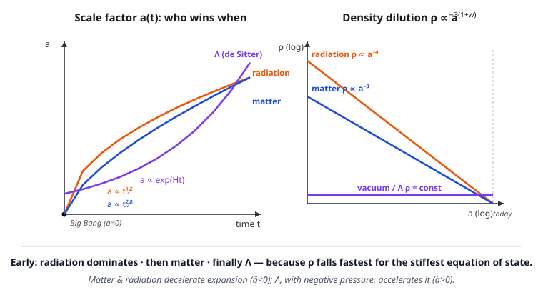

# Relativity (SR + GR) · Lesson 6.7: Cosmology II — the Friedmann equations and cosmic dynamics

> ⏱ ~15 min · Module 6: Solutions — black holes and cosmology · Builds on: [6.6 The FLRW metric](#/lesson/relativity/06-06-flrw-metric.md), [5.3 The Einstein field equations](#/lesson/relativity/05-03-einstein-field-equations.md), [5.2 Matter in curved spacetime](#/lesson/relativity/05-02-matter-curved-spacetime.md), [3.3 The stress–energy tensor](#/lesson/relativity/03-03-stress-energy-tensor.md) · Unlocks: 6.8 (cosmic history, redshift, and the dark universe)

## Why this matters

In 6.6 you built the metric of a homogeneous, isotropic universe and got a single unknown function to solve for: the scale factor $a(t)$, the size of a comoving ruler as the universe expands. But the metric alone doesn't tell you *how* $a(t)$ grows — for that you need the Einstein equations, fed by whatever the universe is made of. Plug the FLRW metric and a perfect fluid into $G_{\mu\nu}+\Lambda g_{\mu\nu}=\tfrac{8\pi G}{c^4}T_{\mu\nu}$ and the ten field equations collapse to just **two ordinary differential equations for $a(t)$** — the Friedmann equations. They are the equation of motion of the entire cosmos: they say whether it expands or contracts, accelerates or decelerates, is finite or infinite, and how old it is. Everything observational cosmology measures is a boundary condition on these two lines. (The measured numbers and their history live in the `astrophysics` course; here we do the GR derivation.)

## The idea

The whole subject is one bookkeeping problem. The universe is a box of "stuff" — matter, radiation, vacuum energy — and as the box (of comoving volume $\propto a^3$) grows, each ingredient dilutes at its own rate. The Einstein equations then act like Newton's second law for the box's radius: the total energy density pulls the expansion one way, pressure another.

Two facts drive the plot:

1. **Different stuff dilutes differently.** Ordinary matter (dust) just gets spread thinner: $\rho\propto a^{-3}$. Radiation dilutes *faster*, $\rho\propto a^{-4}$, because photons both spread out **and** get individually redshifted — each photon's energy drops as $1/a$. Vacuum energy doesn't dilute at all: $\rho=\text{const}$, an energy density baked into empty space itself.

2. **Pressure gravitates.** In GR the source of gravity is not mass but $\rho+3p/c^2$. Normal matter and radiation have $p\ge0$, so they *decelerate* the expansion — gravity pulling everything back. Vacuum energy has *negative* pressure $p=-\rho c^2$, and negative pressure gravitates repulsively: it *accelerates* the expansion. That repulsion is dark energy.

Put those together and you get the history: the fastest-diluting component dominates earliest and hands off to the next. Radiation ruled the young hot universe, matter took over, and today the never-diluting vacuum energy is winning — flipping the expansion from slowing down to speeding up.

## The formal version

**Signature and conventions.** Throughout I use $(-,+,+,+)$, keep $c$ and $G$ explicit, and write $\rho$ for **mass density** (so the energy density is $\rho c^2$) and $p$ for pressure. The Hubble rate is $H(t)\equiv\dot a/a$, an overdot is $d/dt$. From 6.6, the FLRW line element is

$$ds^2=-c^2\,dt^2+a(t)^2\left[\frac{dr^2}{1-kr^2}+r^2\big(d\theta^2+\sin^2\theta\,d\phi^2\big)\right],$$

with spatial curvature constant $k$ ($k<0,\,0,\,>0$ for open, flat, closed).

**The matter side: a perfect fluid.** The only stress–energy tensor compatible with homogeneity and isotropy is the perfect fluid from [3.3](#/lesson/relativity/03-03-stress-energy-tensor.md), placed on the curved background by minimal coupling as in [5.2](#/lesson/relativity/05-02-matter-curved-spacetime.md):

$$T^{\mu\nu}=\left(\rho+\frac{p}{c^2}\right)u^\mu u^\nu+p\,g^{\mu\nu},$$

where $u^\mu$ is the fluid four-velocity. *In words:* a cosmic fluid has no shear or heat flow — just an energy density and an isotropic pressure. For comoving observers the fluid is at rest ($u^\mu=(c,0,0,0)$ up to the metric), so $T^{\mu\nu}$ is diagonal: energy density $\rho c^2$ in the time slot, pressure $p$ in each space slot.

**The two Friedmann equations.** Compute $G_{\mu\nu}$ for the FLRW metric and set it equal to $\tfrac{8\pi G}{c^4}T_{\mu\nu}-\Lambda g_{\mu\nu}$. Only two independent equations survive. The **time–time** ($00$) component gives the **first Friedmann equation**:

$$\boxed{\;H^2=\left(\frac{\dot a}{a}\right)^2=\frac{8\pi G}{3}\,\rho-\frac{kc^2}{a^2}+\frac{\Lambda c^2}{3}\;}$$

*In words:* the square of the expansion rate is set by how much stuff there is (first term), the spatial curvature (second), and the cosmological constant (third). It is a first integral — an energy equation for the "radius" $a$. The **space–space** ($ij$) component gives the **second (acceleration) Friedmann equation**:

$$\boxed{\;\frac{\ddot a}{a}=-\frac{4\pi G}{3}\left(\rho+\frac{3p}{c^2}\right)+\frac{\Lambda c^2}{3}\;}$$

*In words:* the acceleration of the expansion is driven by $-(\rho+3p/c^2)$ — energy density *and* pressure both gravitate, both slowing things down — plus the repulsive $\Lambda$ term. This is where "pressure gravitates" is made precise.

**The fluid (continuity) equation.** Local energy–momentum conservation $\nabla_\mu T^{\mu\nu}=0$ (guaranteed by the Bianchi identity behind the field equations, [5.2](#/lesson/relativity/05-02-matter-curved-spacetime.md)) has one nontrivial component, the $\nu=0$ one:

$$\boxed{\;\dot\rho+3H\left(\rho+\frac{p}{c^2}\right)=0\;}$$

*In words:* the energy in a comoving volume changes only by the pressure doing work as the volume $\propto a^3$ expands — the first law of thermodynamics for the universe, $dE=-p\,dV$. This is not a third independent equation: differentiate the first Friedmann equation and use the second, and this pops out. Any two of the three imply the third.

**Equations of state and dilution.** Close the system with $p=w\rho c^2$ for constant $w$: matter (dust) $w=0$, radiation $w=\tfrac13$, vacuum $w=-1$. Then $p/c^2=w\rho$ and the fluid equation reads $\dot\rho/\rho=-3(1+w)\,\dot a/a$, which integrates to

$$\rho\propto a^{-3(1+w)}\;\Longrightarrow\; \underbrace{\rho\propto a^{-3}}_{\text{matter}},\quad \underbrace{\rho\propto a^{-4}}_{\text{radiation}},\quad \underbrace{\rho=\text{const}}_{\text{vacuum}}.$$

**Critical density and the density parameters.** Set $k=0$ and $\Lambda=0$ (fold $\Lambda$ into $\rho$ if you like, as a $w=-1$ fluid) in the first Friedmann equation: the density that makes the universe exactly flat is

$$\rho_c\equiv\frac{3H^2}{8\pi G},\qquad \Omega\equiv\frac{\rho}{\rho_c}.$$

*In words:* $\rho_c$ is the tightrope density. The first Friedmann equation, divided by $H^2$, becomes $1=\Omega_m+\Omega_r+\Omega_\Lambda+\Omega_k$ with $\Omega_k\equiv-kc^2/(a^2H^2)$ — so the total $\Omega$ measures curvature directly:

$$\Omega_{\text{total}}=1\iff k=0\ \text{(flat)},\qquad \Omega_{\text{total}}>1\iff k>0,\qquad \Omega_{\text{total}}<1\iff k<0.$$

**Single-component flat solutions.** For $k=0$ and one component of equation of state $w$, substitute $\rho\propto a^{-3(1+w)}$ into the first Friedmann equation, $\dot a\propto a^{-(1+3w)/2}$, and integrate:

$$a(t)\propto t^{\,2/[3(1+w)]}\;\Longrightarrow\; \underbrace{a\propto t^{2/3}}_{\text{matter}},\quad \underbrace{a\propto t^{1/2}}_{\text{radiation}}.$$

The vacuum case $w=-1$ is special: $\rho=$ const makes $H$ constant, so $\dot a=Ha$ gives **exponential (de Sitter) expansion** $a\propto e^{Ht}$ with $H=\sqrt{\Lambda c^2/3}$. Matter and radiation start from a singularity $a=0$ at finite past; de Sitter has no beginning and never stops.

## Picture

The left panel is the payoff of solving the Friedmann equation era by era: radiation and matter both climb out of the Big Bang as power laws (radiation flatter early, since it decelerates hardest), while a $\Lambda$-universe runs away exponentially. The right panel is *why* the eras hand off in that order — plotted log-log, each density is a straight line whose slope is $-3(1+w)$, so radiation ($-4$) plunges below matter ($-3$), which plunges below the flat vacuum line. Read right-to-left (back in time): the steepest curve always wins at early times.

## Worked examples

**Example 1 (mechanical — the deceleration parameter).** Is a matter-only flat universe speeding up or slowing down? Use the second Friedmann equation with $\Lambda=0$, $p=0$:

$$\frac{\ddot a}{a}=-\frac{4\pi G}{3}\rho<0.$$

Negative — it decelerates. Radiation is worse: $p=\rho c^2/3$ gives $\rho+3p/c^2=2\rho$, so $\ddot a/a=-\tfrac{8\pi G}{3}\rho$, twice the drag. Now add vacuum energy, $p=-\rho c^2$: $\rho+3p/c^2=\rho-3\rho=-2\rho<0$, flipping the sign to $\ddot a/a=+\tfrac{8\pi G}{3}\rho_\Lambda>0$. **Only a component with $w<-\tfrac13$ can accelerate the expansion** — the precise condition for cosmic acceleration, and exactly the negative-pressure physics of dark energy worked observationally in `astrophysics` [6.5 Dark energy and acceleration](#/lesson/astrophysics/06-05-dark-energy-acceleration.md).

**Example 2 (why you'd care — the critical density today).** Plug the measured Hubble constant $H_0\approx70\ \text{km s}^{-1}\text{Mpc}^{-1}=2.27\times10^{-18}\ \text{s}^{-1}$ into $\rho_c=3H_0^2/8\pi G$:

$$\rho_c=\frac{3(2.27\times10^{-18})^2}{8\pi(6.67\times10^{-11})}\approx9.2\times10^{-27}\ \text{kg m}^{-3}.$$

That's about **five hydrogen atoms per cubic metre** — the density that makes space flat. The universe is observed to sit within a percent of it ($\Omega_{\text{total}}\approx1$), which is why the CMB shows flat geometry. The astonishing part: only ~5% of that is ordinary matter; the rest is dark matter and dark energy (the accounting is in `astrophysics` [6.6 The concordance model](#/lesson/astrophysics/06-06-concordance-model-frontiers.md)).

## Watch out

- You might think mass is the source of gravity, so pressure is irrelevant to expansion. In GR the source is $\rho+3p/c^2$ — **pressure gravitates**, and a *large enough negative* pressure ($w<-\tfrac13$) reverses gravity's sign. This is the whole mechanism of accelerated expansion; drop the pressure term and you can't get dark energy.
- You might think radiation dilutes like matter with an extra "because relativity" fudge factor. The extra power of $a$ is concrete: photon *number* density falls as $a^{-3}$ (volume), and each photon's energy $h c/\lambda$ falls as $a^{-1}$ because its wavelength stretches with the expansion — $a^{-3}\cdot a^{-1}=a^{-4}$. Both effects are physical.
- You might treat $\Lambda$ and vacuum energy as different things. They're interchangeable: moving $\Lambda g_{\mu\nu}$ to the right-hand side of the Einstein equations makes it a perfect fluid with $\rho_\Lambda=\Lambda c^2/8\pi G$ and $w=-1$. Whether you call it geometry or energy is bookkeeping; the dynamics is identical.
- The three equations are not independent. Deriving all three and then "checking they're consistent" is fine, but don't count them as three constraints on one function $a(t)$ — that would overdetermine it. Two are dynamical; the third is their consequence (the Bianchi identity at work).

## One-liner

> Feed the FLRW metric and a perfect fluid to Einstein and the universe gets a Newton's-second-law for its radius: $H^2\propto\rho$ sets the speed, $\ddot a\propto-(\rho+3p/c^2)$ sets the acceleration — and because negative pressure gravitates repulsively, the vacuum wins in the end.

## Problems

**P1 (🟢)** Using the fluid equation $\dot\rho+3H(\rho+p/c^2)=0$ with the equation of state $p=w\rho c^2$, derive $\rho\propto a^{-3(1+w)}$, and specialize to matter ($w=0$) and radiation ($w=\tfrac13$). Then explain physically why radiation carries the *extra* power of $a$ compared to matter.

**P2 (🟡)** Solve the flat, matter-dominated first Friedmann equation ($k=0$, $\Lambda=0$, $\rho=\rho_0 a^{-3}$ with $a(t_0)=a_0$) to show $a\propto t^{2/3}$. Then show the age of such a universe is $t=\dfrac{2}{3H}$, and evaluate $t_0=2/(3H_0)$ in years for $H_0=70\ \text{km s}^{-1}\text{Mpc}^{-1}$.

**P3 (🔴, optional)** (a) Solve the flat $\Lambda$-dominated Friedmann equation ($\rho=0$, $k=0$, only $\Lambda$) to get de Sitter expansion $a\propto e^{Ht}$, and show $H=\sqrt{\Lambda c^2/3}$. (b) In a universe with only matter and $\Lambda$ (today $a_0=1$, density parameters $\Omega_m$ and $\Omega_\Lambda$), find the scale factor $a_{\text{eq}}$ and the redshift $z_{\text{eq}}$ at **matter–$\Lambda$ equality** ($\rho_m=\rho_\Lambda$), using $1+z=a_0/a$. Evaluate for $\Omega_m=0.31$, $\Omega_\Lambda=0.69$.

Solutions

**P1** Insert $p/c^2=w\rho$: the fluid equation becomes $\dot\rho=-3H(1+w)\rho=-3(1+w)\rho\,\dfrac{\dot a}{a}$. Separate variables:

$$\frac{d\rho}{\rho}=-3(1+w)\frac{da}{a}\;\Longrightarrow\;\ln\rho=-3(1+w)\ln a+\text{const}\;\Longrightarrow\;\rho\propto a^{-3(1+w)}.$$

Matter $w=0$: $\rho\propto a^{-3}$. Radiation $w=\tfrac13$: $3(1+\tfrac13)=4$, so $\rho\propto a^{-4}$.

*Physical reason for the extra power:* matter energy is locked in rest mass, so its density just tracks the number of particles per volume, $\propto a^{-3}$. Radiation energy density is (number of photons per volume) $\times$ (energy per photon). The number density falls as $a^{-3}$ like anything else, but each photon's energy $E=hc/\lambda$ *also* drops because its wavelength is stretched by the expansion, $\lambda\propto a$, giving $E\propto a^{-1}$. Multiply: $a^{-3}\cdot a^{-1}=a^{-4}$. The extra factor is cosmological redshift acting on every photon.

**P2** With $k=\Lambda=0$ and $\rho=\rho_0(a_0/a)^3$, the first Friedmann equation is

$$\left(\frac{\dot a}{a}\right)^2=\frac{8\pi G\rho_0 a_0^3}{3}\,a^{-3}\equiv \frac{A}{a^3},\qquad A\equiv\frac{8\pi G\rho_0 a_0^3}{3}.$$

So $\dot a=\sqrt{A}\,a^{-1/2}$, i.e. $a^{1/2}\,da=\sqrt{A}\,dt$. Integrate (taking $a=0$ at $t=0$):

$$\tfrac{2}{3}a^{3/2}=\sqrt{A}\,t\;\Longrightarrow\;a=\left(\tfrac{3}{2}\sqrt{A}\right)^{2/3}t^{2/3}\;\propto\;t^{2/3}.\ \checkmark$$

Age: with $a\propto t^{2/3}$, $H=\dot a/a=\dfrac{2}{3}\dfrac{1}{t}$, so $t=\dfrac{2}{3H}$. Today $t_0=\dfrac{2}{3H_0}$. Numerically $H_0=70\ \text{km s}^{-1}\text{Mpc}^{-1}=2.27\times10^{-18}\ \text{s}^{-1}$, so

$$t_0=\frac{2}{3(2.27\times10^{-18}\,\text{s}^{-1})}=2.94\times10^{17}\ \text{s}\approx 9.3\ \text{billion years}.$$

(Notably *younger* than the real ~13.8 Gyr — a pure matter universe ages too fast; adding $\Lambda$, which makes late expansion accelerate, stretches the timeline to match observation.)

**P3** (a) With only $\Lambda$: $H^2=(\dot a/a)^2=\Lambda c^2/3$ is constant, so $H=\sqrt{\Lambda c^2/3}$ (positive root, expanding). Then $\dot a=Ha$ integrates immediately:

$$\frac{da}{a}=H\,dt\;\Longrightarrow\;a(t)=a_0\,e^{H(t-t_0)}\;\propto\;e^{Ht}.$$

Exponential de Sitter growth, constant $H$, no singularity. (Equivalently $H=\sqrt{8\pi G\rho_\Lambda/3}$ with $\rho_\Lambda=\Lambda c^2/8\pi G$.)

(b) Matter dilutes, vacuum doesn't: with $a_0=1$,

$$\rho_m(a)=\rho_{m,0}\,a^{-3},\qquad \rho_\Lambda(a)=\rho_{\Lambda,0}=\text{const}.$$

Equality $\rho_m=\rho_\Lambda$ requires $\rho_{m,0}a_{\text{eq}}^{-3}=\rho_{\Lambda,0}$, so $a_{\text{eq}}^3=\rho_{m,0}/\rho_{\Lambda,0}$. Divide top and bottom by $\rho_c$ (the density parameters share the same $\rho_c$ today):

$$a_{\text{eq}}=\left(\frac{\Omega_m}{\Omega_\Lambda}\right)^{1/3},\qquad 1+z_{\text{eq}}=\frac{a_0}{a_{\text{eq}}}=\left(\frac{\Omega_\Lambda}{\Omega_m}\right)^{1/3}.$$

For $\Omega_m=0.31$, $\Omega_\Lambda=0.69$: $\;1+z_{\text{eq}}=(0.69/0.31)^{1/3}=(2.226)^{1/3}=1.306$, so

$$z_{\text{eq}}\approx0.31.$$

Matter and dark energy reached parity only recently — around redshift $0.3$, a few billion years ago. Before that gravity was decelerating the expansion; since then $\Lambda$ has been winning and the expansion accelerates. This is the crossover the Boss Problem is really about, and what the supernova surveys of the late 1990s detected. (The observational story: `astrophysics` [6.5](#/lesson/astrophysics/06-05-dark-energy-acceleration.md).)

## Flashback

**From Lesson 6.6 (The FLRW metric):** For the spatially flat FLRW metric $ds^2=-c^2\,dt^2+a(t)^2\big(dr^2+r^2\,d\Omega^2\big)$, a galaxy sits at fixed comoving radius $r=\chi$. (a) Find its proper (physical) distance $D(t)$ from us at cosmic time $t$. (b) Differentiate to derive Hubble's law $\dot D=H D$, identifying $H=\dot a/a$.

Solution

(a) Proper distance is measured along a radial path at a *fixed instant* $t$ ($dt=0$), so $ds=a(t)\,dr$. Integrate from us ($r=0$) to the galaxy ($r=\chi$):

$$D(t)=\int_0^\chi a(t)\,dr=a(t)\,\chi.$$

The comoving coordinate $\chi$ is frozen (the galaxy rides the Hubble flow); all the growth is in $a(t)$.

(b) Differentiate with $\chi$ constant:

$$\dot D=\dot a\,\chi=\frac{\dot a}{a}\,(a\chi)=H\,D,\qquad H\equiv\frac{\dot a}{a}.$$

Recession velocity is proportional to distance — Hubble's law falls straight out of the metric, with the Hubble "constant" being the instantaneous value of $H(t)$. It's the same $H$ that headlines the first Friedmann equation, which is why measuring $H_0$ pins down the critical density.

## Connections

- **Backward:** this is [5.3](#/lesson/relativity/05-03-einstein-field-equations.md)'s Einstein equations evaluated on [6.6](#/lesson/relativity/06-06-flrw-metric.md)'s metric with [3.3](#/lesson/relativity/03-03-stress-energy-tensor.md)'s perfect-fluid $T^{\mu\nu}$ — the same machinery that gave Schwarzschild in [6.1](#/lesson/relativity/06-01-schwarzschild-solution.md), now for a universe instead of a star. The fluid equation is $\nabla_\mu T^{\mu\nu}=0$ from [5.2](#/lesson/relativity/05-02-matter-curved-spacetime.md), which the Bianchi identity behind $G_{\mu\nu}$ enforces automatically.
- **Forward:** [6.8](#/lesson/relativity/06-08-cosmic-history-dark-universe.md) turns these solutions into a timeline — cosmological redshift, the radiation→matter→$\Lambda$ handoff, the Big Bang and the CMB, and the fate of the universe. The Boss Problem for Module 6 is exactly this: derive both Friedmann equations, solve the matter and $\Lambda$ eras, and relate redshift to expansion.
- **Sideways (astrophysics):** the *observational* cosmology — Hubble's law measured, supernova acceleration, dark matter rotation curves, the concordance parameters — lives in `astrophysics` [6.1 The expanding universe](#/lesson/astrophysics/06-01-expanding-universe-friedmann.md) and [6.5 Dark energy](#/lesson/astrophysics/06-05-dark-energy-acceleration.md). This lesson is the GR engine those measurements constrain.
- **Sideways (thermodynamics):** the fluid equation $\dot\rho+3H(\rho+p/c^2)=0$ is literally $dE=-p\,dV$, the first law from `stat-mech` [2.1 Laws of thermodynamics](#/lesson/stat-mech/02-01-laws-of-thermodynamics.md) applied to a comoving volume — cosmic expansion as adiabatic work.
