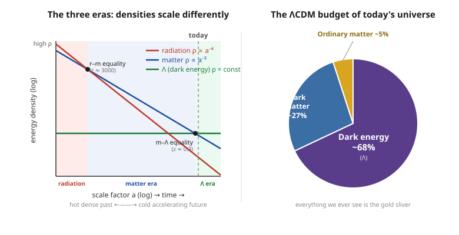

# Relativity (SR + GR) · Lesson 6.8: Cosmology III — cosmic history and the dark universe

> ⏱ ~15 min · Module 6: Solutions — black holes and cosmology · Builds on: [6.7 Friedmann equations](#/lesson/relativity/06-07-friedmann-equations.md), [6.6 FLRW metric](#/lesson/relativity/06-06-flrw-metric.md), [5.3 Einstein field equations](#/lesson/relativity/05-03-einstein-field-equations.md) · Unlocks: the astrophysics course (thermal history, BBN, CMB, structure) — and the frontier where general relativity meets quantum theory

## Why this matters

Lesson 6.7 handed you the universe's equation of motion — the Friedmann equations, one per matter species, with the scale factor $a(t)$ as the unknown. This lesson *reads the answer off them*: run the film backward and forward and you get the entire history of the cosmos, from a hot dense beginning through the era of galaxies to a cold accelerating future. Along the way three shocks emerge that GR alone can't explain — the universe is dominated by **dark matter** and **dark energy** we cannot see, its beginning is a **singularity** where the theory breaks down, and its vacuum energy is off by the worst factor in the history of physics. This is the capstone: the point where general relativity, having been triumphantly confirmed, hands the baton to the physics that comes after it. I use the $(-,+,+,+)$ signature and keep $c, G$ explicit.

## The idea

Here is the single fact that organizes all of cosmic history. In an expanding universe of scale factor $a$, different kinds of stuff **dilute at different rates** (this is the content of [6.7](#/lesson/relativity/06-07-friedmann-equations.md), where each species' continuity equation fixes how its density falls):

- **Matter** (galaxies, dark matter — anything slow and massive): $\rho_m \propto a^{-3}$. Just volume dilution — double every length, eight times the volume, one-eighth the density.
- **Radiation** (photons, anything moving at or near $c$): $\rho_r \propto a^{-4}$. Volume dilution *plus* one extra factor of $a$ because every wavelength stretches with the expansion, sapping each photon's energy.
- **Dark energy / the cosmological constant $\Lambda$**: $\rho_\Lambda = \text{const}$. It doesn't dilute at all — empty space keeps the same energy density no matter how much of it you make.

That's the whole plot. Because $a^{-4}$ falls fastest, radiation *dominated* when $a$ was tiny — the early universe was radiation's kingdom, hot and dense. As $a$ grew, radiation dropped below matter, and structure — stars, galaxies — could form under gravity. And because $\rho_\Lambda$ never falls, it was negligible early but *inevitably* takes over once $a$ is large enough. We are living right at the handoff from the matter era to the $\Lambda$ era: the expansion has recently begun to **accelerate**. Three densities with three different slopes, crossing in turn — radiation, then matter, then $\Lambda$ — is the skeleton of everything that follows.

## The formal version

**Density evolution and the era sequence.** Writing today's values with a subscript $0$ and using $a_0 = 1$,

$$\rho_r(a) = \rho_{r,0}\,a^{-4}, \qquad \rho_m(a) = \rho_{m,0}\,a^{-3}, \qquad \rho_\Lambda = \text{const}.$$

*In words:* rewind to small $a$ and the steepest curve wins. The universe passes through a **radiation-dominated era** (earliest, hottest), a **matter-dominated era** (when gravity assembles structure), and a **$\Lambda$-dominated era** (now beginning, accelerating). The crossovers happen where two densities are equal — matter–radiation equality and matter–$\Lambda$ equality — which the problems below pin down numerically.

**Cosmological redshift — the observational backbone.** As a photon travels across the expanding universe, its wavelength stretches in exact proportion to $a$. From [6.6](#/lesson/relativity/06-06-flrw-metric.md), a photon emitted at scale factor $a_e$ and observed today ($a_0=1$) is redshifted by

$$1 + z = \frac{a_0}{a_e} = \frac{1}{a_e}, \qquad z \equiv \frac{\lambda_{\text{obs}} - \lambda_{\text{emit}}}{\lambda_{\text{emit}}}.$$

*In words:* redshift is not a Doppler shift through space — it is the expansion of space itself, recorded in the light. A galaxy at redshift $z=1$ emitted its light when the universe was half its present size. **Redshift is our clock and our ruler**: it labels *when* in cosmic history the light left. For nearby galaxies this reduces to **Hubble's law**, the observation that started it all:

$$v = H_0\, d,$$

*In words:* recession speed grows linearly with distance, with slope the Hubble constant $H_0 \approx 70\ \mathrm{km\,s^{-1}\,Mpc^{-1}}$ — the local, small-$z$ face of the global expansion $a(t)$.

**The dark-universe budget (ΛCDM concordance model).** Add the three densities and compare to the critical density $\rho_c = 3H_0^2/(8\pi G)$ from [6.7](#/lesson/relativity/06-07-friedmann-equations.md), forming the density parameters $\Omega_i = \rho_{i,0}/\rho_c$. Every independent probe — the cosmic microwave background, galaxy clustering, supernovae, big-bang nucleosynthesis — converges on the same split:

$$\Omega_\Lambda \approx 0.68 \;(\text{dark energy}), \qquad \Omega_{\text{dark matter}} \approx 0.27, \qquad \Omega_{\text{ordinary}} \approx 0.05, \qquad \Omega_r \sim 10^{-4}.$$

*In words:* about 68% of the universe is dark energy, about 27% is invisible non-luminous matter that clumps and gravitates but doesn't shine, and only about 5% is the ordinary atoms that make up stars, planets, and us. Everything ever seen through any telescope is that 5% sliver. The astrophysics course carries the evidence in detail — dark matter's rotation-curve and lensing case, and the concordance fit — in [dark energy & acceleration](#/lesson/astrophysics/06-05-dark-energy-acceleration.md) and [the concordance model & frontiers](#/lesson/astrophysics/06-06-concordance-model-frontiers.md).

**Dark energy is $\Lambda$, and $\Lambda$ is a disaster.** The accelerating expansion is driven by the **cosmological constant** $\Lambda$ — the term Einstein inserted into the field equations in [5.3](#/lesson/relativity/05-03-einstein-field-equations.md), $G_{\mu\nu} + \Lambda g_{\mu\nu} = \tfrac{8\pi G}{c^4}T_{\mu\nu}$. Moved to the right-hand side it acts as a perfect fluid with constant density $\rho_\Lambda = \Lambda c^2/(8\pi G)$ and negative pressure $p_\Lambda = -\rho_\Lambda c^2$ (the Flashback derives this). In the Friedmann acceleration equation $\ddot a/a = -\tfrac{4\pi G}{3}(\rho + 3p/c^2)$, that negative pressure makes $\rho + 3p/c^2 < 0$ — **gravity pushes out**, and the expansion accelerates. The theoretical catastrophe: quantum field theory says the vacuum should carry zero-point energy, and a naive estimate summing modes up to the Planck scale gives a vacuum density about $10^{120}$ times larger than the tiny $\rho_\Lambda$ we observe. That mismatch — the **cosmological-constant problem** — is often called the worst quantitative prediction in the history of physics, and it lives exactly at the seam between the classical field theory of Module 3 and the quantum theory that should replace it (Problem 3).

**The fate of the universe.** Once $\Lambda$ dominates, the first Friedmann equation becomes $\left(\dot a/a\right)^2 \to \tfrac{8\pi G}{3}\rho_\Lambda = \text{const}$, whose solution is exponential — **de Sitter** expansion $a(t)\propto e^{H_\Lambda t}$ with $H_\Lambda = \sqrt{\Lambda c^2/3}$. *In words:* if $\Lambda$ is truly constant, expansion never stops and in fact speeds up forever. Distant galaxies redshift out of view, the universe empties and cools toward a **heat death** — a cold, dark, near-empty de Sitter space. That is the current best-guess ending, contingent on dark energy staying constant.

## Picture

The left panel is the entire history on one graph. Three straight lines on log–log axes (power laws are straight lines): radiation falls steepest ($a^{-4}$), matter next ($a^{-3}$), $\Lambda$ dead flat. Reading left (early, small $a$) to right (late, large $a$), the *top* line — the dominant species — hands off in sequence: **radiation → matter → $\Lambda$**, with the two black dots marking the equality crossovers. The dashed "today" line sits just past the matter–$\Lambda$ crossing, which is why acceleration only switched on in the recent cosmic past. The right panel is what all that scaling leaves us with today: a universe that is 95% dark, the visible cosmos a thin gold rind.

## Worked examples

**Example 1 (mechanical — how hot was matter–radiation equality?).** Radiation and matter were equal in density when $\rho_r(a) = \rho_m(a)$, i.e. $\rho_{r,0}a^{-4} = \rho_{m,0}a^{-3}$, so $a_{eq} = \rho_{r,0}/\rho_{m,0} = \Omega_r/\Omega_m$. With $\Omega_m \approx 0.3$ and $\Omega_r \approx 10^{-4}$,

$$1 + z_{eq} = \frac{1}{a_{eq}} = \frac{\Omega_m}{\Omega_r} = \frac{0.3}{10^{-4}} = 3000.$$

So $z_{eq}\approx 3000$: the universe was $\sim\!3000$ times smaller and correspondingly hotter (temperature scales as $1/a \propto 1+z$, so $\sim\!3000$ times its present $2.7\ \mathrm{K}$, about $8000\ \mathrm{K}$). Before this the universe was a radiation-pressure-dominated plasma in which matter couldn't clump; after it, matter's self-gravity was free to build structure. This transition governs the shape of the CMB power spectrum — the astrophysics course works the thermal history through recombination and the CMB in `06-02` and `06-03`.

**Example 2 (why you'd care — reading a galaxy's age off its redshift).** A quasar's light arrives at redshift $z = 6$. What was the universe like when that light left? From $1+z = 1/a_e$, $a_e = 1/7 \approx 0.14$: the universe was one-seventh its present size. Since $a_{eq} \approx 1/3000$, this is deep in the **matter-dominated era** — long after radiation gave way, long before $\Lambda$ took over. In a flat matter-dominated universe $a \propto t^{2/3}$ (the solution from [6.7](#/lesson/relativity/06-07-friedmann-equations.md)), so the age scales as $t \propto a^{3/2}$: the light left when the cosmos was roughly $(1/7)^{3/2} \approx 0.054$ of its matter-era age — under a billion years old. Every high-$z$ observation is a look further back in time; redshift *is* the time axis of cosmology.

## Watch out

- **You might think cosmological redshift is a Doppler shift — galaxies flying through space away from us.** It isn't: the galaxies are (nearly) at rest in comoving coordinates ([6.6](#/lesson/relativity/06-06-flrw-metric.md)); it is *space itself* that stretches, lengthening the wavelength in transit. This is why recession "velocities" $v = H_0 d$ can exceed $c$ for distant enough galaxies without violating relativity — nothing moves through space faster than light; space expands.
- **You might think dark matter and dark energy are the same "dark stuff."** They are opposites. Dark matter is *matter*: it dilutes as $a^{-3}$, clumps under gravity, and holds galaxies together. Dark energy is a constant vacuum energy with *negative pressure* that doesn't dilute and drives things *apart*. One assembles structure; the other will eventually tear structure's neighborhoods out of view.
- **You might think the accelerating universe means gravity has "turned off" or reversed.** Ordinary gravity still attracts; $\Lambda$ just adds a term that wins once matter has diluted enough. Acceleration is recent precisely because it waited for $\rho_m$ to fall below (twice) $\rho_\Lambda$ — a coincidence-of-timing that we happen to be alive to witness.

## One-liner

> Because radiation ($a^{-4}$), matter ($a^{-3}$), and $\Lambda$ (constant) dilute at different rates, the universe ran radiation → matter → $\Lambda$; today it is 5% atoms, 27% dark matter, 68% dark energy, and accelerating toward a cold de Sitter fate — with its beginning and its vacuum energy pointing past general relativity entirely.

## Problems

**P1 (🟢)** Using $\rho_r \propto a^{-4}$ and $\rho_m \propto a^{-3}$ with today's $\Omega_r \approx 10^{-4}$ and $\Omega_m \approx 0.3$, find the redshift $z$ of matter–radiation equality. State the general formula $1+z = \Omega_m/\Omega_r$ and interpret what changes physically at this moment.

**P2 (🟡)** Find the redshift of matter–$\Lambda$ equality, where $\rho_m(a) = \rho_\Lambda$, for $\Omega_m = 0.3$, $\Omega_\Lambda = 0.7$. Show $1+z = (\Omega_\Lambda/\Omega_m)^{1/3}$ and evaluate. Then, using the acceleration condition that $\ddot a > 0$ requires $\rho_m < 2\rho_\Lambda$, find the (slightly earlier) redshift at which cosmic acceleration actually *began*, and comment on why acceleration is such a recent phenomenon.

**P3 (🔴, optional)** The observed dark-energy density is about $\rho_\Lambda \sim 10^{-27}\ \mathrm{kg/m^3}$. Quantum field theory predicts a vacuum energy density from zero-point modes cut off at the Planck scale, of order the **Planck density** $\rho_{\text{Pl}} = c^5/(\hbar G^2)$. Estimate $\rho_{\text{Pl}}$ and compare it to $\rho_\Lambda$ to reproduce the $\sim\!10^{120}$ cosmological-constant problem. (Use $c = 3\times10^8\ \mathrm{m/s}$, $\hbar = 1.05\times10^{-34}\ \mathrm{J\,s}$, $G = 6.67\times10^{-11}\ \mathrm{N\,m^2/kg^2}$.)

Solutions

**P1** Set $\rho_r = \rho_m$: $\rho_{r,0}\,a^{-4} = \rho_{m,0}\,a^{-3}$, so $a_{eq} = \rho_{r,0}/\rho_{m,0} = \Omega_r/\Omega_m$ (the $\rho_c$ in each $\Omega$ cancels). Then

$$1 + z_{eq} = \frac{1}{a_{eq}} = \frac{\Omega_m}{\Omega_r} = \frac{0.3}{10^{-4}} = 3000 \quad\Longrightarrow\quad z_{eq} \approx 3000.$$

Physically: for $z > 3000$ radiation pressure dominated and prevented matter from collapsing; once matter took over ($z < 3000$), density perturbations could grow under self-gravity — the onset of structure formation. (The measured value is $\approx 3400$; the difference is including neutrinos and the precise $\Omega_r$.)

**P2** Set $\rho_m(a) = \rho_\Lambda$: $\rho_{m,0}\,a^{-3} = \rho_{\Lambda,0}$ (constant), so $a^3 = \rho_{m,0}/\rho_{\Lambda,0} = \Omega_m/\Omega_\Lambda$, giving $a = (\Omega_m/\Omega_\Lambda)^{1/3}$ and

$$1 + z = \frac{1}{a} = \left(\frac{\Omega_\Lambda}{\Omega_m}\right)^{1/3} = \left(\frac{0.7}{0.3}\right)^{1/3} = (2.33)^{1/3} \approx 1.33 \quad\Longrightarrow\quad z \approx 0.33.$$

The densities became equal only very recently ($z\approx 0.33$, when the universe was about 75% of its present size). Acceleration began even earlier: $\ddot a > 0$ needs $\rho_m < 2\rho_\Lambda$, i.e. $\rho_{m,0}a^{-3} = 2\rho_{\Lambda,0}$, so $1+z_{\text{acc}} = (2\Omega_\Lambda/\Omega_m)^{1/3} = (1.4/0.3)^{1/3} = (4.67)^{1/3} \approx 1.67$, giving $z_{\text{acc}}\approx 0.67$. So cosmic acceleration switched on around $z\approx 0.7$ — a few billion years ago. It is recent because it had to *wait* for matter to dilute ($\propto a^{-3}$) below the fixed $\rho_\Lambda$; that we exist at roughly the crossover epoch, when $\Omega_m$ and $\Omega_\Lambda$ are within a factor of a few, is the "coincidence problem."

**P3** Planck density:

$$\rho_{\text{Pl}} = \frac{c^5}{\hbar G^2} = \frac{(3\times10^8)^5}{(1.05\times10^{-34})(6.67\times10^{-11})^2}.$$

Numerator: $(3\times10^8)^5 = 3^5\times10^{40} = 243\times10^{40} = 2.43\times10^{42}$. Denominator: $(6.67\times10^{-11})^2 = 4.45\times10^{-21}$, times $1.05\times10^{-34}$ gives $4.67\times10^{-55}$. So

$$\rho_{\text{Pl}} \approx \frac{2.43\times10^{42}}{4.67\times10^{-55}} \approx 5\times10^{96}\ \mathrm{kg/m^3}.$$

Compare to the observed dark-energy density:

$$\frac{\rho_{\text{Pl}}}{\rho_\Lambda} \approx \frac{5\times10^{96}}{10^{-27}} \approx 5\times10^{123} \sim 10^{123}.$$

The naive quantum-field-theory vacuum energy overshoots the observed value by roughly $10^{120}$–$10^{123}$ (the exact figure depends on the cutoff and how modes are counted; "$\sim\!10^{120}$" is the standard quote). No known mechanism cancels the vacuum energy down to the observed tiny-but-nonzero level while leaving it nonzero — that unresolved gap between Module 3's classical field theory and its quantization is the cosmological-constant problem, the sharpest quantitative signal that GR-plus-QFT is incomplete.

## Flashback

**From Lesson 5.3 (The Einstein field equations):** Start from the field equations with a cosmological constant, $G_{\mu\nu} + \Lambda g_{\mu\nu} = \tfrac{8\pi G}{c^4}T_{\mu\nu}$. Move the $\Lambda$ term to the right-hand side and show it behaves as a perfect fluid; read off its energy density and pressure, and its equation-of-state parameter $w = p/(\rho c^2)$.

Solution

Move $\Lambda g_{\mu\nu}$ across:

$$G_{\mu\nu} = \frac{8\pi G}{c^4}T_{\mu\nu} - \Lambda g_{\mu\nu} = \frac{8\pi G}{c^4}\left(T_{\mu\nu} + T^{(\Lambda)}_{\mu\nu}\right), \qquad T^{(\Lambda)}_{\mu\nu} = -\frac{\Lambda c^4}{8\pi G}\,g_{\mu\nu}.$$

A perfect fluid has $T_{\mu\nu} = \left(\rho + p/c^2\right)u_\mu u_\nu + p\,g_{\mu\nu}$. Since $T^{(\Lambda)}_{\mu\nu}$ is purely proportional to $g_{\mu\nu}$ with *no* $u_\mu u_\nu$ piece, the coefficient of $u_\mu u_\nu$ must vanish: $\rho_\Lambda + p_\Lambda/c^2 = 0$. Matching the $g_{\mu\nu}$ coefficient gives the pressure $p_\Lambda = -\Lambda c^4/(8\pi G)$, and therefore

$$\rho_\Lambda = \frac{\Lambda c^2}{8\pi G}, \qquad p_\Lambda = -\rho_\Lambda c^2, \qquad w = \frac{p_\Lambda}{\rho_\Lambda c^2} = -1.$$

So a positive $\Lambda$ is a fluid of constant positive energy density and *negative* pressure with $w=-1$ — exactly the dark-energy equation of state. Its constant density ($\propto a^0$) is why it comes to dominate, and its negative pressure is why it accelerates the expansion.

## Connections

- **Backward:** this lesson is the payoff of the whole cosmology arc — the density scalings and $a(t)$ solutions come from the [Friedmann equations](#/lesson/relativity/06-07-friedmann-equations.md), the redshift $1+z=1/a$ and comoving picture from the [FLRW metric](#/lesson/relativity/06-06-flrw-metric.md), and dark energy is the [cosmological-constant term](#/lesson/relativity/05-03-einstein-field-equations.md) of the field equations wearing a fluid's clothes.
- **Forward (astrophysics):** the *observational* cosmos lives in the astrophysics course — the [expanding-universe / Friedmann picture](#/lesson/astrophysics/06-01-expanding-universe-friedmann.md), the thermal history and CMB (its `06-02`/`06-03`), and the [dark-energy](#/lesson/astrophysics/06-05-dark-energy-acceleration.md) and [concordance-model](#/lesson/astrophysics/06-06-concordance-model-frontiers.md) evidence. This lesson is the GR spine that those chapters hang data on.
- **Sideways (the quantum frontier):** the two places GR visibly fails both point at quantum theory. The **Big Bang singularity** — $a\to 0$, $\rho\to\infty$ — and the very early universe demand a theory of **quantum gravity**: GR's own equations blow up at the Planck scale ($\sim 10^{-35}$ m), where the quantum uncertainty of the [`quantum-mechanics`](#/course/quantum-mechanics) course meets curved spacetime and neither theory alone survives. The **black-hole information paradox** from [6.5](#/lesson/relativity/06-05-black-hole-thermodynamics.md) — Hawking radiation seemingly destroying quantum information — is the same clash in miniature. And the **cosmological-constant problem** is quantum vacuum energy screaming that our accounting is off by $10^{120}$. Unifying general relativity with quantum theory is the great unsolved problem of physics.

---

**Closing the course.** You began with two postulates — the relativity principle and the constancy of $c$ — and watched absolute time dissolve into the [invariant interval](#/lesson/relativity/01-04-spacetime-interval-causality.md). You rebuilt physics in the coordinate-free language of [tensors on Minkowski spacetime](#/lesson/relativity/02-03-tensors-algebra.md), then learned that fields carry energy and momentum through the [stress–energy tensor](#/lesson/relativity/05-03-einstein-field-equations.md) — the classical field theory that both describes electromagnetism and *sources gravity*. The [equivalence principle](#/lesson/relativity/05-01-equivalence-principle.md) forced gravity to be geometry, so you took the differential-geometry interlude — metric, [geodesics](#/lesson/relativity/04-05-geodesics.md), curvature — and arrived at the [Einstein field equations](#/lesson/relativity/05-03-einstein-field-equations.md), which say it all in one line: *matter tells spacetime how to curve, curvature tells matter how to move.* Solving them gave you the two great arenas — black holes and the expanding cosmos — that this final module explored. From here the physics track branches: the **astrophysics** course takes these solutions to real stars, mergers, and the observed universe, while the **quantum-mechanics** course builds the other half of modern physics — the half that GR, at the Big Bang and inside black holes, is still waiting to be joined with. That unfinished unification is where the frontier of physics sits today, and you now have the general-relativity half of it in hand.
