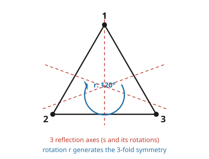

# Group & Representation Theory · Lesson 1.1: What is a representation?

> ⏱ ~15 min · Module 1: Representations of finite groups · Builds on: your [abstract algebra](../../abstract-algebra/syllabus.md) (groups, homomorphisms, group actions, $GL_n$) and [linear algebra](../../linalg-refresher/syllabus.md) (change of basis, eigenvalues) · Unlocks: [1.2 Examples and unitarity](01-02-examples-unitarity.md)

## Why this matters

You already know groups as abstract objects: a set with a multiplication table, elements you can compose and invert. But an abstract group is hard to *compute* with — "the symmetry group of a triangle" is a fact, not a calculation. A **representation** fixes this by making the group **act linearly**: every group element becomes an honest invertible matrix, and the group's multiplication table becomes matrix multiplication. Suddenly the full toolkit of linear algebra — eigenvalues, traces, direct sums, diagonalization — is available to study symmetry.

This is the whole subject in one sentence: **a representation turns symmetry into matrices, and the entire course studies how those matrices decompose.** That decomposition is not an academic game — in quantum mechanics it *is* the splitting of energy levels, the classification of angular momentum, the labeling of particles by their symmetry type. We start by pinning down exactly what a representation is.

## The idea

Take a group $G$ — say the symmetries of an equilateral triangle. Each symmetry physically moves the triangle, and if you draw the triangle in the plane $\mathbb{R}^2$, each symmetry is a linear map of that plane: a rotation or a reflection, i.e. a $2\times 2$ matrix. Composing two symmetries (do one, then the other) corresponds to *multiplying* their matrices. That correspondence — group element $\mapsto$ matrix, composition $\mapsto$ matrix product — is a representation.

The key demand is that the correspondence be **structure-preserving**: if $gh$ is the group product, its matrix must be the product of the two matrices, $\rho(gh) = \rho(g)\rho(h)$. Nothing less will do. A random assignment of matrices to elements is just a labeling; a representation is a labeling that *respects multiplication*. That single equation forces everything else: the identity must map to the identity matrix, inverses to inverse matrices. The group's abstract arithmetic is now literally being computed by matrices.

## The formal version

A **representation** of a group $G$ on a vector space $V$ over $\mathbb{C}$ is a group homomorphism

$$\rho : G \longrightarrow GL(V),$$

where $GL(V)$ is the group of invertible linear maps $V \to V$. The **degree** (or dimension) of the representation is $\dim V$. The defining condition, spelled out, is

$$\rho(gh) = \rho(g)\,\rho(h) \qquad \text{for all } g,h \in G.$$

**In words:** to every group element $g$ we attach an invertible matrix $\rho(g)$, in such a way that multiplying elements in the group matches multiplying their matrices. Two consequences come for free (proof: standard homomorphism facts):

$$\rho(e) = I, \qquad \rho(g^{-1}) = \rho(g)^{-1}.$$

**In words:** the identity element must act as the identity matrix, and inverse elements act as inverse matrices — you cannot choose otherwise.

**Two views of the same thing.** Abstractly, $\rho$ is a map into $GL(V)$, basis-free. Concretely, *choose a basis* of $V$ and every $\rho(g)$ becomes an explicit matrix in $GL_n(\mathbb{C})$ (with $n = \dim V$) — a table of numbers you can multiply. The abstract view is cleaner for proofs; the concrete view is what you actually compute with. Changing basis is where equivalence comes in.

**Equivalence.** Two representations $\rho, \rho'$ on the *same* space $V$ are **equivalent** (isomorphic) if there is a single invertible $T$ with

$$\rho'(g) = T\,\rho(g)\,T^{-1} \qquad \text{for all } g \in G.$$

**In words:** they are the same representation seen in a different basis — one fixed change-of-basis matrix $T$ conjugates the *entire family* of matrices simultaneously. Note the "for all $g$": it is not enough to conjugate one matrix; the same $T$ must work for every element at once. Equivalent representations carry identical information, so classification is always *up to equivalence*.

**Faithful.** A representation is **faithful** if $\rho$ is injective — distinct group elements get distinct matrices, so no information is lost and $G$ is literally a group of matrices. (The opposite extreme, $\rho(g) = I$ for all $g$, is the trivial representation: perfectly valid, and it sees nothing.)

**Connection to group actions.** From abstract algebra, an action of $G$ on a set $X$ is a homomorphism $G \to \mathrm{Sym}(X)$. A representation is exactly the *linear* version: an action of $G$ on a vector space **by linear maps**, i.e. a homomorphism into $GL(V) \subset \mathrm{Sym}(V)$. If $G$ acts on a finite set $X$, you get a representation for free — the **permutation representation** — by letting $g$ permute a basis $\{e_x : x \in X\}$ of $\mathbb{C}^{|X|}$. So representations are not a new idea grafted onto group theory; they are group actions with linear structure switched on.

## Concrete instance

Take $G = S_3$, the symmetry group of an equilateral triangle (six elements: identity, two rotations, three reflections). Draw the triangle in $\mathbb{R}^2$ centered at the origin; each symmetry is a genuine linear map of the plane, giving a **degree-2 representation**.

Let $r$ = rotation by $120^\circ$ and $s$ = reflection across the vertical axis (through vertex 1). Then

$$\rho(r) = \begin{pmatrix} -\tfrac12 & -\tfrac{\sqrt3}{2} \\[2pt] \tfrac{\sqrt3}{2} & -\tfrac12 \end{pmatrix}, \qquad \rho(s) = \begin{pmatrix} -1 & 0 \\ 0 & 1 \end{pmatrix}.$$

(Reflection across the *vertical* axis flips the horizontal coordinate, hence $\mathrm{diag}(-1,1)$.) The six group elements are $e, r, r^2, s, rs, r^2 s$, and their matrices are the corresponding products.

**Sub-case: $\mathbb{Z}/3$.** The rotation subgroup $\{e, r, r^2\}$ is a copy of $\mathbb{Z}/3$, and $\rho(k) = $ (rotation by $120^\circ k$) is already a degree-2 representation of $\mathbb{Z}/3$ on its own. Here $\rho(1) = \rho(r)$ above.

**Verifying the homomorphism law on a sample product.** The dihedral relation $srs = r^{-1}$ must survive as a matrix identity. Compute $\rho(s)\rho(r)\rho(s)$: first $\rho(s)\rho(r)$ negates the top row of $\rho(r)$,

$$\rho(s)\rho(r) = \begin{pmatrix} \tfrac12 & \tfrac{\sqrt3}{2} \\[2pt] \tfrac{\sqrt3}{2} & -\tfrac12 \end{pmatrix},$$

then multiplying on the right by $\rho(s)$ negates the left column,

$$\rho(s)\rho(r)\rho(s) = \begin{pmatrix} -\tfrac12 & \tfrac{\sqrt3}{2} \\[2pt] -\tfrac{\sqrt3}{2} & -\tfrac12 \end{pmatrix} = \rho(r)^{-1}.$$

That last matrix is rotation by $-120^\circ$, exactly $\rho(r^{-1})$. The abstract relation $srs = r^{-1}$ is realized as a numerical matrix equation — the multiplication table has become linear algebra.

## Worked examples

**Example 1 — the rotation representation of $\mathbb{Z}/n$, homomorphism checked.**

Let $G = \mathbb{Z}/n = \{0,1,\dots,n-1\}$ under addition mod $n$. Define a degree-2 representation by sending $k$ to rotation by angle $2\pi k/n$:

$$\rho(k) = R\!\left(\tfrac{2\pi k}{n}\right), \qquad R(\theta) = \begin{pmatrix} \cos\theta & -\sin\theta \\ \sin\theta & \cos\theta \end{pmatrix}.$$

The homomorphism law is the angle-addition identity for rotations, $R(\alpha)R(\beta) = R(\alpha+\beta)$:

$$\rho(j)\rho(k) = R\!\left(\tfrac{2\pi j}{n}\right)R\!\left(\tfrac{2\pi k}{n}\right) = R\!\left(\tfrac{2\pi (j+k)}{n}\right) = \rho(j+k).$$

We also need this to be *well-defined mod $n$*: since $R$ has period $2\pi$, $R\big(\tfrac{2\pi(j+k)}{n}\big)$ depends only on $j+k \bmod n$, so $\rho(j+k) = \rho\big((j+k)\bmod n\big)$. Consistent. And $\rho(0) = R(0) = I$. It is a representation. (It is *not* faithful only in degenerate cases; for $n\ge 3$ distinct residues give distinct rotation matrices, so it is faithful.)

**Example 2 — two equivalent representations: diagonalizing a rotation.**

The degree-2 rotation representation above *looks* like it needs $2\times 2$ real blocks, but over $\mathbb{C}$ it is equivalent to something diagonal. Take $n=3$, $\theta = 120^\circ$, so $A := \rho(1) = R(120^\circ)$. Its eigenvectors (true for any rotation) are

$$v_+ = \begin{pmatrix} 1 \\ -i \end{pmatrix}\ (\text{eigenvalue } e^{i\theta}), \qquad v_- = \begin{pmatrix} 1 \\ i \end{pmatrix}\ (\text{eigenvalue } e^{-i\theta}),$$

which you verify directly: $R(\theta)\begin{pmatrix}1\\-i\end{pmatrix} = \begin{pmatrix}\cos\theta + i\sin\theta \\ \sin\theta - i\cos\theta\end{pmatrix} = e^{i\theta}\begin{pmatrix}1\\-i\end{pmatrix}$. Form $T$ from the eigenvectors as columns:

$$T = \begin{pmatrix} 1 & 1 \\ -i & i \end{pmatrix}, \qquad T^{-1} = \begin{pmatrix} \tfrac12 & \tfrac{i}{2} \\[2pt] \tfrac12 & -\tfrac{i}{2} \end{pmatrix}.$$

Let $\omega = e^{2\pi i/3}$. Then conjugating *every* matrix in the representation by $T$ gives

$$\rho'(k) = T^{-1}\rho(k)\,T = \begin{pmatrix} \omega^k & 0 \\ 0 & \bar\omega^{\,k} \end{pmatrix}.$$

Same representation, different basis — the messy real rotation blocks in $\rho$ and the clean diagonal $\rho'$ are **equivalent** ($\rho'(k) = T^{-1}\rho(k)T$ for all $k$, one fixed $T$). And notice what the diagonal form reveals: the degree-2 representation has *split* into two independent 1-dimensional pieces, $k \mapsto \omega^k$ and $k \mapsto \bar\omega^{\,k}$. That splitting is the first glimpse of the course's central theme, and it is exactly what Problem 3 generalizes.

## Watch out

- **Equivalence needs one $T$ for the whole family.** Conjugating a single $\rho(g)$ to some nice form proves nothing — you must exhibit *one* invertible $T$ that simultaneously conjugates $\rho(g)$ for **every** $g$. A basis change is a change of the space, not of one element.
- **The homomorphism law is $\rho(gh)=\rho(g)\rho(h)$, not $\rho(g)+\rho(h)$ or anything additive** — even when the group operation is written additively, as in $\mathbb{Z}/n$. There, $\rho(j+k) = \rho(j)\rho(k)$: the group *adds*, but the matrices *multiply*. Mixing these up is the classic first-week error.
- **A representation need not be faithful, and that's fine.** The trivial representation $\rho(g)=I$ satisfies every axiom and is genuinely useful (it's a building block later). "Representation" does not mean "faithful copy of the group."
- **Working over $\mathbb{C}$ matters.** Example 2's diagonalization used complex eigenvalues $e^{\pm i\theta}$; over $\mathbb{R}$ a $120^\circ$ rotation has no eigenvectors and cannot be diagonalized. We choose $\mathbb{C}$ precisely so this always works — it is what makes the decomposition theory clean.

## One-liner

> A representation is a homomorphism $\rho: G \to GL(V)$ — it makes an abstract group *act linearly*, turning its multiplication table into matrix multiplication, and the whole subject is the study of how those matrices break apart.

## Problems

**P1 (🟢)** Let $\mathbb{Z}/4 = \langle g \mid g^4 = e\rangle$ and define $\rho(g^k) = M^k$ where $M = \begin{pmatrix} 0 & -1 \\ 1 & 0 \end{pmatrix}$. Show this is a well-defined degree-2 representation, i.e. check that $M$ is invertible and that the defining relation $g^4 = e$ is respected by the matrices.

**P2 (🟡)** Let $\rho: G \to GL(V)$ be *any* representation of a finite group $G$, with $\dim V = n$. Show that the map $g \mapsto \det\rho(g)$ is itself a $1$-dimensional representation of $G$ (a homomorphism $G \to GL_1(\mathbb{C}) = \mathbb{C}^\times$).

**P3 (🔴)** Show that **any** representation of $\mathbb{Z}/n$ (over $\mathbb{C}$, any degree) is equivalent to a direct sum of $1$-dimensional representations. (Hint: a representation of $\mathbb{Z}/n$ is determined by the single matrix $A = \rho(1)$; what equation must $A$ satisfy, and what does that force about its eigenstructure?)

Solutions

**P1.** First, $\det M = (0)(0) - (-1)(1) = 1 \neq 0$, so $M \in GL_2(\mathbb{C})$; every power $M^k$ is then invertible too. Now check the relation. Compute

$$M^2 = \begin{pmatrix} 0 & -1 \\ 1 & 0 \end{pmatrix}\begin{pmatrix} 0 & -1 \\ 1 & 0 \end{pmatrix} = \begin{pmatrix} -1 & 0 \\ 0 & -1 \end{pmatrix} = -I, \qquad M^4 = (M^2)^2 = (-I)^2 = I.$$

So $\rho(g)^4 = M^4 = I = \rho(e)$: the matrices satisfy exactly the relation the group elements do. Because $M^4 = I$, the power $M^k$ depends only on $k \bmod 4$, so $\rho(g^k) := M^k$ is well-defined on $\mathbb{Z}/4$. The homomorphism law then holds automatically: $\rho(g^j g^k) = \rho(g^{j+k}) = M^{j+k} = M^j M^k = \rho(g^j)\rho(g^k)$. Hence $\rho$ is a degree-2 representation. (Geometrically $M = R(90^\circ)$, the rotation representation of $\mathbb{Z}/4$ from Example 1.)

**P2.** Write $\phi(g) = \det\rho(g)$. Each $\rho(g)$ is invertible, so $\det\rho(g) \neq 0$, i.e. $\phi(g) \in \mathbb{C}^\times = GL_1(\mathbb{C})$. Using multiplicativity of the determinant and the fact that $\rho$ is a homomorphism,

$$\phi(gh) = \det\rho(gh) = \det\big(\rho(g)\rho(h)\big) = \det\rho(g)\,\det\rho(h) = \phi(g)\,\phi(h).$$

Also $\phi(e) = \det\rho(e) = \det I = 1$. So $\phi: G \to GL_1(\mathbb{C})$ is a homomorphism — a $1$-dimensional representation (the $1\times 1$ matrix $[\det\rho(g)]$ acting on $\mathbb{C}$). This "determinant representation" is our first systematic way to manufacture a new representation from an old one.

**P3.** A representation $\rho$ of $\mathbb{Z}/n = \langle g \mid g^n = e\rangle$ is completely determined by the single matrix $A = \rho(g)$, since $\rho(g^k) = A^k$. The one constraint is the relation $g^n = e$, which forces

$$A^n = \rho(g^n) = \rho(e) = I.$$

So $A$ is a root of the polynomial $x^n - 1$. This polynomial has $n$ **distinct** roots (the $n$-th roots of unity $\zeta_j = e^{2\pi i j/n}$) — no repeated factors. The minimal polynomial of $A$ divides $x^n - 1$, hence also has distinct roots, and a matrix whose minimal polynomial has no repeated roots is **diagonalizable**. Therefore there is an invertible $T$ with

$$T^{-1} A\, T = D = \operatorname{diag}(\lambda_1, \dots, \lambda_d), \qquad \text{each } \lambda_i^n = 1 \ (\text{an } n\text{-th root of unity}).$$

Conjugating the entire representation by this one $T$,

$$\rho'(g^k) = T^{-1}\rho(g^k)\,T = T^{-1}A^k T = D^k = \operatorname{diag}(\lambda_1^{\,k}, \dots, \lambda_d^{\,k}).$$

Each diagonal entry $k \mapsto \lambda_i^{\,k}$ is a $1$-dimensional representation of $\mathbb{Z}/n$: it lands in $\mathbb{C}^\times$, and it is well-defined mod $n$ because $\lambda_i^n = 1$. So

$$\rho \ \cong\ \rho' \ =\ \chi_1 \oplus \chi_2 \oplus \cdots \oplus \chi_d, \qquad \chi_i(g^k) = \lambda_i^{\,k},$$

a direct sum of $1$-dimensional representations, with one fixed $T$ doing the conjugation for all group elements at once. (Example 2 is the case $n=3$, $d=2$, $\{\lambda_1,\lambda_2\} = \{\omega,\bar\omega\}$.) The essential inputs — a single matrix of finite order, diagonalizable because $x^n-1$ is squarefree — are exactly why *abelian* groups have such simple representation theory: everything reduces to $1$-dimensional pieces.

## Connections

- **Backward (abstract algebra):** a representation is a group [action](../../abstract-algebra/syllabus.md) with linear structure — a homomorphism into $GL(V) \subset \mathrm{Sym}(V)$ rather than into a bare symmetric group. The permutation representation of any group action is the bridge, and $\rho(e)=I$, $\rho(g^{-1})=\rho(g)^{-1}$ are just the homomorphism facts you already proved for groups.
- **Backward (linear algebra):** equivalence of representations *is* [change of basis](../../linalg-refresher/syllabus.md) — conjugation $\rho \mapsto T\rho T^{-1}$ — applied to a whole family of matrices at once. Example 2's diagonalization is ordinary eigenvector-hunting, promoted to a statement about the representation.
- **Forward:** [1.2](01-02-examples-unitarity.md) builds a stock of concrete examples and shows we can always take the matrices **unitary**; [1.3](01-03-reducibility-invariant-subspaces.md) makes precise what "the matrices break apart" means (invariant subspaces); and all of character theory (Module 2) rests on the trace $\operatorname{tr}\rho(g)$, which — being conjugation-invariant — is the same for equivalent representations.
- **Sideways (physics):** in [quantum mechanics](../../quantum-mechanics/syllabus.md), a symmetry of a system acts *linearly* on the Hilbert space of states — that is a representation, and the way it decomposes labels the energy levels and their degeneracies. Module 4's $\mathfrak{su}(2)$ representations are literally angular momentum and spin; this lesson is where that story begins.
