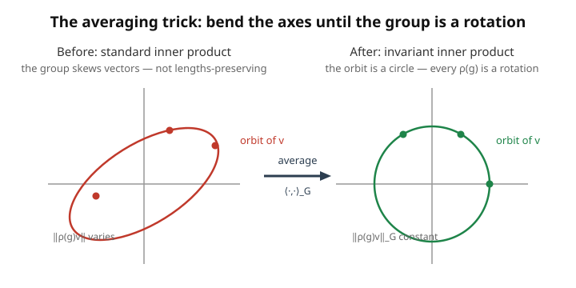

# Group & Representation Theory · Lesson 1.2: Examples and unitarity

> ⏱ ~15 min · Module 1: Representations of finite groups · Builds on: [1.1 What is a representation?](01-01-what-is-a-representation.md) · Unlocks: [1.3 Reducibility and invariant subspaces](01-03-reducibility-invariant-subspaces.md)

## Why this matters

Lesson 1.1 gave you the definition — a representation is a homomorphism $\rho: G \to GL(V)$ turning group elements into invertible matrices. Definitions are cheap; you need a *cast of characters* to think with. This lesson stocks the shelf: five representations (trivial, sign, permutation, natural, regular) that every later theorem is really a statement *about*. Then comes the first genuine theorem of the course — **every representation of a finite group can be made unitary** — and it arrives via a trick, *averaging over the group*, that is the single most important move you will learn all semester. Maschke's theorem (1.4), Schur orthogonality (2.2), and the whole edifice of character theory are this one trick wearing different hats. Learn it here and half of Module 2 is already yours.

## The idea

Two threads.

**First, the standard cast.** You don't invent representations from scratch each time; you reach for familiar ones. The dullest is the **trivial** rep — send every group element to the number $1$ (or the identity matrix). It does nothing, and that "nothing" turns out to be an essential building block. The **sign** rep of the symmetric group sends each permutation to $\pm 1$ depending on whether it's even or odd — the group's memory of parity. The richest and most useful family comes from **group actions**: whenever $G$ shuffles a set of objects, it shuffles the corresponding basis vectors, and shuffling-matrices (**permutation matrices**, exactly one $1$ per row and column) are a representation for free. The king of these is the **regular** representation, where $G$ acts on *itself* — a single representation of dimension $|G|$ that, we'll prove in 2.5, secretly contains *every* irreducible piece of the group. The whole group's linear-algebraic DNA in one matrix family.

**Second, unitarity.** A matrix is **unitary** if it preserves lengths and angles — it's a rigid rotation/reflection of complex space, $U^\dagger U = I$. Physically these are the "nice" transformations: reversible, norm-preserving, the operators quantum mechanics is built from. Here is the beautiful fact: for a *finite* group, you can *always* arrange for every $\rho(g)$ to be unitary, just by choosing the right notion of "length." The recipe is to take *any* inner product and **average it over the group**. The average is automatically something the group preserves — because sliding the whole group's worth of copies over by one more element just permutes the copies you were already summing. Finiteness is the entire miracle: you can only average a *finite* pile.

## The formal version

**Trivial representation.** $\rho(g) = 1$ for all $g \in G$ (degree 1), or $I$ on any $V$. It's a homomorphism trivially: $1 \cdot 1 = 1$.

**Sign representation of $S_n$.** $\rho(g) = \operatorname{sgn}(g) \in \{+1, -1\}$, the parity of the permutation (even $\to +1$, odd $\to -1$). Homomorphism because $\operatorname{sgn}(gh) = \operatorname{sgn}(g)\operatorname{sgn}(h)$. *In words: it remembers only whether you scrambled by an even or odd number of swaps.*

**Permutation representation.** Suppose $G$ **acts** on a finite set $X$ (each $g$ gives a bijection $x \mapsto g\cdot x$). Let $V = \mathbb{C}^X$ have basis $\{e_x : x \in X\}$, and define

$$\rho(g)\,e_x = e_{g\cdot x}.$$

Each $\rho(g)$ is a **permutation matrix** — it just relabels basis vectors, so every column has a single $1$. *In words: the group moves objects around, and the matrix moves the corresponding basis arrows to match.* For $S_n$ acting on $\{1,\dots,n\}$ this is the **natural (defining) $n$-dimensional representation**.

**Regular representation.** Take $X = G$ itself, acting on itself by left multiplication ($g \cdot h = gh$). Then $V = \mathbb{C}[G]$ (the **group algebra**) has basis $\{e_h : h \in G\}$, degree $|G|$, and

$$\rho(g)\,e_h = e_{gh}.$$

*In words: the group acts on a space with one basis vector per group element, by shifting labels.* This single representation contains a copy of every irreducible representation of $G$ (proved in [2.5](02-05-regular-representation.md)) — its central role in the whole theory.

**Unitarity theorem (Weyl's unitary trick, finite case).** Every representation $\rho: G \to GL(V)$ of a **finite** group is *equivalent* to a unitary one. Concretely: start from any Hermitian inner product $\langle\cdot,\cdot\rangle$ on $V$ and define the **averaged** form

$$\langle v, w\rangle_G \;=\; \frac{1}{|G|}\sum_{g\in G} \langle \rho(g)v,\ \rho(g)w\rangle.$$

Then $\langle\cdot,\cdot\rangle_G$ is a genuine inner product (Hermitian, positive-definite), and it is **$G$-invariant**:

$$\langle \rho(h)v,\ \rho(h)w\rangle_G = \langle v, w\rangle_G \quad\text{for all } h \in G.$$

*In words: measure length by averaging over all the group's viewpoints, and then every $\rho(h)$ preserves that length — so in an orthonormal basis for $\langle\cdot,\cdot\rangle_G$, every $\rho(h)$ is a unitary matrix.* Equivalently, there is a change of basis $P$ with $P^{-1}\rho(g)P$ unitary for all $g$.

The invariance is a one-line reindexing: replacing $g$ by $gh$ in the sum runs over exactly the same set $G$ (that's the rearrangement lemma — $g\mapsto gh$ is a bijection of $G$), so the extra $\rho(h)$ gets absorbed. **Finiteness is essential:** the sum has to be a finite average. For $(\mathbb{R},+)$ or $GL_n(\mathbb{C})$ there's no finite average to take, and indeed non-unitarizable reps exist there (compact infinite groups escape this via an integral — the seed of Haar measure in Module 4).

## Picture

The orbit $\{\rho(g)v : g\in G\}$ of a vector looks lopsided under the standard inner product (left) — some $\rho(g)$ stretch $v$, some shrink it. Averaging redefines "distance" so the orbit becomes a *circle* (right): now every $\rho(g)$ moves $v$ along that circle without changing its (new) length. Making the group unitary *is* finding the inner product its orbits are round in.

## Worked examples

**Example 1 (the permutation representation of $S_3$).** $S_3$ acts on $\{1,2,3\}$; build the natural 3-dimensional rep on $\mathbb{C}^3$ with basis $e_1, e_2, e_3$, via $\rho(g)e_i = e_{g(i)}$.

The transposition $(1\,2)$ swaps $e_1 \leftrightarrow e_2$ and fixes $e_3$:

$$\rho\big((1\,2)\big) = \begin{pmatrix} 0 & 1 & 0 \\ 1 & 0 & 0 \\ 0 & 0 & 1 \end{pmatrix}.$$

The 3-cycle $(1\,2\,3)$ sends $1\to2,\ 2\to3,\ 3\to1$, i.e. $\rho(g)e_1=e_2,\ \rho(g)e_2=e_3,\ \rho(g)e_3=e_1$:

$$\rho\big((1\,2\,3)\big) = \begin{pmatrix} 0 & 0 & 1 \\ 1 & 0 & 0 \\ 0 & 1 & 0 \end{pmatrix}.$$

Each is a permutation matrix (one $1$ per row and column), so each is *already* unitary — permutation matrices satisfy $P^\dagger P = I$ automatically, a foretaste of the theorem. The **character** $\chi(g) = \operatorname{tr}\rho(g)$ counts the diagonal $1$s, which are exactly the **fixed points** of the permutation: $\chi((1\,2)) = 1$ (only $3$ is fixed), $\chi((1\,2\,3)) = 0$ (no fixed points), and $\chi(e) = 3$. That "trace = number of fixed points" rule is the entire content of counting-with-characters (2.1), sitting here in plain sight.

**Example 2 (the averaging trick on a concrete non-unitary rep).** Take $G = \mathbb{Z}/2 = \{e, s\}$ with $s^2 = e$, and the **shear** representation on $\mathbb{C}^2$:

$$\rho(e) = \begin{pmatrix} 1 & 0 \\ 0 & 1\end{pmatrix}, \qquad \rho(s) = \begin{pmatrix} 1 & 1 \\ 0 & -1\end{pmatrix}.$$

Check it's a rep: $\rho(s)^2 = \begin{pmatrix}1&1\\0&-1\end{pmatrix}\begin{pmatrix}1&1\\0&-1\end{pmatrix} = \begin{pmatrix}1 & 1-1\\ 0 & 1\end{pmatrix} = I$. ✓ Good — $s\mapsto\rho(s)$, $s^2\mapsto I$. But $\rho(s)$ is *not* unitary: $\rho(s)^\dagger\rho(s) = \begin{pmatrix}1&0\\1&-1\end{pmatrix}\begin{pmatrix}1&1\\0&-1\end{pmatrix} = \begin{pmatrix}1&1\\1&2\end{pmatrix} \neq I$.

Average the standard inner product $\langle v,w\rangle = v^\dagger w$. The invariant form has matrix $H = \frac{1}{|G|}\sum_g \rho(g)^\dagger \rho(g)$ (so that $\langle v,w\rangle_G = v^\dagger H w$):

$$H = \tfrac12\Big(\rho(e)^\dagger\rho(e) + \rho(s)^\dagger\rho(s)\Big) = \tfrac12\left(\begin{pmatrix}1&0\\0&1\end{pmatrix} + \begin{pmatrix}1&1\\1&2\end{pmatrix}\right) = \begin{pmatrix} 1 & \tfrac12 \\[2pt] \tfrac12 & \tfrac32 \end{pmatrix}.$$

This $H$ is Hermitian and positive-definite (diagonal entries positive, $\det = \tfrac32 - \tfrac14 = \tfrac54 > 0$). **Verify invariance** — the theorem promises $\rho(s)^\dagger H \rho(s) = H$:

$$\rho(s)^\dagger H \rho(s) = \begin{pmatrix}1&0\\1&-1\end{pmatrix}\begin{pmatrix}1&\tfrac12\\\tfrac12&\tfrac32\end{pmatrix}\begin{pmatrix}1&1\\0&-1\end{pmatrix} = \begin{pmatrix}1&\tfrac12\\ \tfrac12 & -1\end{pmatrix}\begin{pmatrix}1&1\\0&-1\end{pmatrix} = \begin{pmatrix} 1 & \tfrac12 \\[2pt] \tfrac12 & \tfrac32\end{pmatrix} = H. ✓$$

To *exhibit the unitary equivalent explicitly*, factor $H = P^\dagger P$ (Cholesky) with $P = \begin{pmatrix} 1 & \tfrac12 \\[2pt] 0 & \tfrac{\sqrt5}{2}\end{pmatrix}$ — check $P^\dagger P = \begin{pmatrix}1&0\\ \tfrac12 & \tfrac{\sqrt5}{2}\end{pmatrix}\begin{pmatrix}1&\tfrac12\\0&\tfrac{\sqrt5}{2}\end{pmatrix} = \begin{pmatrix}1&\tfrac12\\ \tfrac12 & \tfrac32\end{pmatrix} = H$. ✓ Changing basis by $P$ (so that the averaged form becomes the *standard* one) turns $\rho(s)$ into $U := P\rho(s)P^{-1}$, which is then unitary in the ordinary sense. With $P^{-1} = \begin{pmatrix}1 & -\tfrac{1}{\sqrt5} \\[2pt] 0 & \tfrac{2}{\sqrt5}\end{pmatrix}$,

$$U = P\,\rho(s)\,P^{-1} = \begin{pmatrix} 1 & \tfrac12 \\[2pt] 0 & \tfrac{\sqrt5}{2}\end{pmatrix}\begin{pmatrix}1&1\\0&-1\end{pmatrix}\begin{pmatrix}1 & -\tfrac{1}{\sqrt5}\\[2pt] 0 & \tfrac{2}{\sqrt5}\end{pmatrix} = \begin{pmatrix} 1 & \tfrac12 \\[2pt] 0 & -\tfrac{\sqrt5}{2}\end{pmatrix}\begin{pmatrix}1 & -\tfrac{1}{\sqrt5}\\[2pt] 0 & \tfrac{2}{\sqrt5}\end{pmatrix} = \begin{pmatrix} 1 & 0 \\[2pt] 0 & -1\end{pmatrix}.$$

And $U = \operatorname{diag}(1,-1)$ is manifestly unitary ($U^\dagger U = I$). So the non-unitary shear $\rho(s)$ is, after averaging, *the same representation as* the honest reflection $\operatorname{diag}(1,-1)$ — the averaging trick found the basis that makes the group rigid. Every finite-group rep hides such a $P$; that's unitarizability, made fully concrete.

## Watch out

- **The trivial rep is not the zero map.** $\rho(g) = 1$ (multiply by one), not $\rho(g) = 0$ — the latter isn't even a homomorphism (it must send $e$ to $I$). "Trivial" means *acts trivially*, not *is nothing*.
- **Permutation matrices are already unitary,** so the averaging trick is invisible for permutation reps — its power shows only on reps like Example 2's shear, where the given matrices aren't norm-preserving. Don't conclude the theorem is vacuous because your first example was already nice.
- **Finiteness is load-bearing, not decoration.** The whole proof is "average over $G$." Delete finiteness and you can't average — and non-unitarizable reps genuinely exist (e.g. the shears $\begin{pmatrix}1&t\\0&1\end{pmatrix}$ of $(\mathbb{R},+)$ are a rep that no basis makes unitary). The compact Lie groups of Module 4 recover the trick by *integrating* instead of summing.
- **$\langle\cdot,\cdot\rangle_G$ is invariant, not the *matrices*.** Averaging doesn't change $\rho$; it changes the inner product (equivalently, the basis). Same representation, better-chosen ruler.

## One-liner

> Keep five reps on the shelf — trivial, sign, permutation, natural, regular — and remember the one trick behind everything: average any inner product over a finite group and it becomes one the group preserves, making every $\rho(g)$ unitary.

## Problems

**P1 (🟢)** Write the regular representation of $\mathbb{Z}/4 = \{e, g, g^2, g^3\}$ as $4\times 4$ matrices (basis $e_0,e_1,e_2,e_3$ indexed by the group elements, with $g$ acting by $\rho(g)e_i = e_{i+1 \bmod 4}$). Give $\rho(g)$ and $\rho(g^2)$ explicitly, and confirm $\rho(g)^2 = \rho(g^2)$ and $\rho(g)^4 = I$ — i.e. it's a homomorphism.

**P2 (🟡)** Let $G = \mathbb{Z}/2 = \{e, s\}$ act on $\mathbb{C}^2$ by $\rho(s) = \begin{pmatrix} 0 & 2 \\ \tfrac12 & 0\end{pmatrix}$. Verify this is a representation, check it is *not* unitary, then average the standard inner product to find the invariant Hermitian form $H = \frac{1}{2}\sum_g \rho(g)^\dagger\rho(g)$, and confirm $\rho(s)^\dagger H \rho(s) = H$.

**P3 (🔴)** Prove the averaging trick in general. For a finite group $G$ and any representation $\rho: G\to GL(V)$ with $V$ carrying *any* Hermitian inner product $\langle\cdot,\cdot\rangle$, define $\langle v,w\rangle_G = \frac{1}{|G|}\sum_{g\in G}\langle \rho(g)v,\rho(g)w\rangle$. Prove that (a) $\langle\cdot,\cdot\rangle_G$ is Hermitian and positive-definite (a genuine inner product), and (b) it is $G$-invariant: $\langle\rho(h)v,\rho(h)w\rangle_G = \langle v,w\rangle_G$ for all $h$. Conclude every finite-group representation is unitarizable.

Solutions

**P1.** With $g$ shifting the index up by one mod 4:

$$\rho(g) = \begin{pmatrix} 0&0&0&1\\ 1&0&0&0\\ 0&1&0&0\\ 0&0&1&0\end{pmatrix},\qquad \rho(g^2) = \begin{pmatrix} 0&0&1&0\\ 0&0&0&1\\ 1&0&0&0\\ 0&1&0&0\end{pmatrix}.$$

(Column $i$ of $\rho(g)$ has its $1$ in row $i+1 \bmod 4$: $e_0\to e_1, e_1\to e_2, e_2\to e_3, e_3\to e_0$.) Squaring $\rho(g)$ shifts twice, $e_i \to e_{i+2}$, which is exactly $\rho(g^2)$ above — check e.g. column 0: $\rho(g)^2 e_0 = \rho(g)e_1 = e_2$, matching $\rho(g^2)e_0 = e_2$. ✓ And shifting four times returns every basis vector to itself, so $\rho(g)^4 = I$. Since $\rho(g^k) = \rho(g)^k$ holds for the generator, $\rho$ is a homomorphism. ✓

**P2.** *Representation:* need $\rho(s)^2 = \rho(e) = I$.

$$\rho(s)^2 = \begin{pmatrix}0&2\\\tfrac12&0\end{pmatrix}\begin{pmatrix}0&2\\\tfrac12&0\end{pmatrix} = \begin{pmatrix} 2\cdot\tfrac12 & 0 \\ 0 & \tfrac12\cdot 2\end{pmatrix} = \begin{pmatrix}1&0\\0&1\end{pmatrix} = I. ✓$$

*Not unitary:*

$$\rho(s)^\dagger\rho(s) = \begin{pmatrix}0&\tfrac12\\2&0\end{pmatrix}\begin{pmatrix}0&2\\\tfrac12&0\end{pmatrix} = \begin{pmatrix} \tfrac14 & 0 \\ 0 & 4\end{pmatrix} \neq I.$$

*Average:*

$$H = \tfrac12\Big(\rho(e)^\dagger\rho(e) + \rho(s)^\dagger\rho(s)\Big) = \tfrac12\left(\begin{pmatrix}1&0\\0&1\end{pmatrix} + \begin{pmatrix}\tfrac14&0\\0&4\end{pmatrix}\right) = \begin{pmatrix}\tfrac58 & 0\\ 0 & \tfrac52\end{pmatrix}.$$

*Invariance check:* since $H$ and $\rho(s)$ are both real here,

$$\rho(s)^\dagger H\rho(s) = \begin{pmatrix}0&\tfrac12\\2&0\end{pmatrix}\begin{pmatrix}\tfrac58&0\\0&\tfrac52\end{pmatrix}\begin{pmatrix}0&2\\\tfrac12&0\end{pmatrix} = \begin{pmatrix}0 & \tfrac54\\ \tfrac54 & 0\end{pmatrix}\begin{pmatrix}0&2\\\tfrac12&0\end{pmatrix} = \begin{pmatrix}\tfrac58 & 0\\ 0 & \tfrac52\end{pmatrix} = H. ✓$$

So under the weighted length $\|v\|_G^2 = \tfrac58|v_1|^2 + \tfrac52|v_2|^2$, the map $\rho(s)$ (which swaps the axes with factors $2$ and $\tfrac12$) becomes an isometry — it's unitary in this inner product. (Sanity: $\rho(s)$ sends the first basis vector to $\tfrac12$ times the second and the second to $2$ times the first; the weights $\tfrac58,\tfrac52$ are chosen precisely so those rescalings cancel.)

**P3.** *(a) Hermitian.* For each $g$, $\langle\rho(g)v,\rho(g)w\rangle$ is a Hermitian inner product in $(v,w)$ (it's the original form precomposed with the linear map $\rho(g)$), so it's linear in $w$, conjugate-linear in $v$, and satisfies $\overline{\langle\rho(g)w,\rho(g)v\rangle} = \langle\rho(g)v,\rho(g)w\rangle$. A nonnegative-weighted sum ($1/|G|$ each) of Hermitian forms is Hermitian. *Positive-definite:* for $v\neq 0$,

$$\langle v,v\rangle_G = \frac{1}{|G|}\sum_{g\in G}\langle\rho(g)v,\rho(g)v\rangle = \frac{1}{|G|}\sum_{g}\|\rho(g)v\|^2 \ge 0,$$

and it is $>0$ because each $\rho(g)$ is invertible, so $\rho(g)v\neq 0$, so every term $\|\rho(g)v\|^2 > 0$ (in particular the $g=e$ term). Thus $\langle\cdot,\cdot\rangle_G$ is a genuine inner product.

*(b) $G$-invariance.* Fix $h\in G$. Then

$$\langle\rho(h)v,\ \rho(h)w\rangle_G = \frac{1}{|G|}\sum_{g\in G}\big\langle\rho(g)\rho(h)v,\ \rho(g)\rho(h)w\big\rangle = \frac{1}{|G|}\sum_{g\in G}\big\langle\rho(gh)v,\ \rho(gh)w\big\rangle,$$

using $\rho(g)\rho(h) = \rho(gh)$ (homomorphism). Now substitute $g' = gh$. As $g$ ranges over all of $G$, so does $g' = gh$ (right-multiplication by $h$ is a bijection of $G$ — the rearrangement lemma), so the sum is unchanged as a set of terms:

$$= \frac{1}{|G|}\sum_{g'\in G}\langle\rho(g')v,\ \rho(g')w\rangle = \langle v,w\rangle_G.$$

*Conclusion.* Pick an orthonormal basis of $V$ with respect to $\langle\cdot,\cdot\rangle_G$ (possible since it's a genuine inner product). In that basis, invariance says each $\rho(h)$ preserves the inner product, i.e. $\rho(h)^\dagger\rho(h) = I$ — every $\rho(h)$ is unitary. Equivalently, the change-of-basis matrix $P$ from the old basis gives $P\rho(g)P^{-1}$ unitary for all $g$. Hence every representation of a finite group is unitarizable. $\blacksquare$ (Finiteness entered exactly once — in forming the average $\frac{1}{|G|}\sum_g$.)

## Connections

- **Backward:** these are all instances of [1.1](01-01-what-is-a-representation.md)'s homomorphism $\rho: G\to GL(V)$ — the permutation and regular reps are the payoff of `abstract-algebra`'s group *actions* (a $G$-set becomes a $G$-vector-space just by taking basis vectors), and the regular rep is the group acting on itself, the most self-referential action there is.
- **Forward:** the averaging trick is the *whole engine* of the next few lessons. [1.4 Maschke](01-04-maschke-theorem.md) averages a *projection* (instead of an inner product) to split any rep into pieces; [2.2 orthogonality](02-02-orthogonality-relations.md) averages *matrix entries* to get the orthogonality relations. [2.5](02-05-regular-representation.md) cashes in the regular rep: it contains every irreducible, each with multiplicity equal to its dimension.
- **Sideways (physics):** unitarity is not a convenience here, it's the reason symmetry and quantum mechanics fit together — in [`quantum-mechanics`](../../quantum-mechanics/syllabus.md) symmetry operators *must* be unitary to preserve probabilities, and this theorem says a finite symmetry group automatically can be. Module 4's `\mathfrak{su}(2)` angular momentum is the continuous sequel.
- **Sideways (linear algebra):** the averaging produces a positive-definite Hermitian form $H$, and diagonalizing/Cholesky-factoring it is exactly the unitary-matrix and inner-product machinery of [`linalg-refresher`](../../linalg-refresher/syllabus.md) — unitarizability is "simultaneously make a whole group of matrices orthogonal in some inner product."
