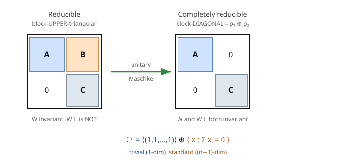

# Group & Representation Theory · Lesson 1.3: Reducibility and invariant subspaces

> ⏱ ~15 min · Module 1: Representations of finite groups · Builds on: [1.2 Examples and unitarity](01-02-examples-unitarity.md) · Unlocks: [1.4 Maschke's theorem](01-04-maschke-theorem.md)

## Why this matters

A representation is a pile of matrices, one per group element, all obeying the same multiplication table. That pile is almost never as complicated as it first looks: hidden inside is usually a *smaller* representation doing the real work, with the rest either riding alongside or built on top. The whole engine of representation theory — Maschke, Schur, character tables, the physics of degenerate energy levels — is the machinery for finding those hidden pieces and breaking every representation into indivisible **atoms**. This lesson defines the atom and its opposite, and shows why unitarity (from [1.2](01-02-examples-unitarity.md)) is the lever that pries a reducible representation cleanly apart.

## The idea

Take the permutation representation of $S_n$: each permutation acts on $\mathbb{C}^n$ by shuffling coordinates. Watch the all-ones vector $(1,1,\dots,1)$. Shuffle its entries however you like — it comes back unchanged. Every group element fixes the *line* through that vector. So the action never escapes that 1-dimensional line: the line is a self-contained little world on which $S_n$ acts (trivially), a genuine representation sitting inside the big one.

That is the whole concept. A subspace the group action can't escape is **invariant**, and the representation *restricted* to it is a smaller representation — a **subrepresentation**. If such a subspace exists (other than the two boring ones, $\{0\}$ and all of $V$), the representation is **reducible**: it's secretly built from smaller stuff. If no such subspace exists, it's **irreducible** — an atom, indivisible.

There are two grades of "built from smaller stuff," and the difference is the plot of the next lesson. Reducible just means *one* invariant subspace exists — in matrix terms, you can rotate your basis so every $\rho(g)$ becomes block **upper-triangular**, with a stubborn nonzero corner you can't kill. The stronger condition, **completely reducible**, means the whole space splits as a direct sum of invariant pieces — every $\rho(g)$ becomes block **diagonal** at once. The magic fact, powered by unitarity, is that for finite groups the weaker condition secretly implies the stronger: reducible reps always fully split. That's Maschke, coming in [1.4](01-04-maschke-theorem.md). Here we set the stage and prove the key lemma that makes it work.

## The formal version

Fix a representation $\rho: G \to GL(V)$ — a homomorphism assigning each group element $g$ an invertible linear map $\rho(g)$ on the vector space $V$.

**Invariant subspace.** A subspace $W \subseteq V$ is **invariant** (or **$G$-stable**) if
$$\rho(g)\,W \subseteq W \quad \text{for all } g \in G.$$
*In words:* apply any group element to any vector of $W$ and you land back in $W$ — the action never leaves the room. (Because each $\rho(g)$ is invertible and $G$ is closed under inverses, $\subseteq$ forces equality: $\rho(g)W = W$.)

**Subrepresentation.** If $W$ is invariant, restricting each $\rho(g)$ to $W$ gives a representation $\rho|_W: G \to GL(W)$, the **subrepresentation** carried by $W$. *In words:* the little world $W$ is a legitimate representation in its own right.

**Reducible / irreducible.** $\rho$ is **reducible** if it has an invariant subspace $W$ with $0 \neq W \neq V$ (a *nontrivial proper* invariant subspace). Otherwise — if the only invariant subspaces are $\{0\}$ and $V$ — it is **irreducible**. *In words:* irreducible = no smaller representation hiding inside = an atom. (The zero space and the whole space are always invariant; they don't count.)

**Direct sum.** Given two reps $\rho_1: G \to GL(V_1)$ and $\rho_2: G \to GL(V_2)$, their **direct sum** $\rho_1 \oplus \rho_2$ acts on $V_1 \oplus V_2$ by
$$(\rho_1 \oplus \rho_2)(g) = \begin{pmatrix} \rho_1(g) & 0 \\ 0 & \rho_2(g) \end{pmatrix}.$$
*In words:* stack the two reps into one that acts block-diagonally — each block ignores the other's coordinates. Here $V_1$ and $V_2$ are *both* invariant.

**The matrix dictionary.** Choose a basis whose first vectors span an invariant $W$. Then every $\rho(g)$ takes the form $\begin{pmatrix} A(g) & B(g) \\ 0 & C(g) \end{pmatrix}$ — the lower-left block is forced to zero precisely *because* $W$ is invariant (nothing in $W$ maps outside it). So:
$$\text{reducible} \iff \text{all } \rho(g) \text{ simultaneously block-upper-triangularizable},$$
$$\text{completely reducible} \iff \text{all } \rho(g) \text{ simultaneously block-diagonalizable}.$$
Complete reducibility kills the upper-right $B(g)$ too — that requires a *second* invariant subspace complementary to $W$.

**The splitting lemma (the key link to 1.2).** Suppose $\rho$ is **unitary** (each $\rho(g)$ preserves an inner product $\langle\cdot,\cdot\rangle$ on $V$, i.e. $\rho(g)^*\rho(g) = I$ — the situation [1.2](01-02-examples-unitarity.md) showed every finite-group rep can be arranged). If $W$ is invariant, then its **orthogonal complement**
$$W^\perp = \{\, v \in V : \langle v, w\rangle = 0 \ \text{for all } w \in W \,\}$$
is *also* invariant. *In words:* for a unitary rep, whenever the action can't escape $W$, it also can't escape the perpendicular room $W^\perp$ — so $V = W \oplus W^\perp$ splits into two invariant pieces. A unitary reducible rep is automatically *completely* reducible. (This is Maschke in embryo; the proof is Problem 3.)

## Picture

The nonzero corner $B$ on the left is exactly what reducibility alone permits; unitarity (Maschke) pushes you to the right, where the corner vanishes and the rep is a clean direct sum. The bottom line previews the running example: $\mathbb{C}^n$ splitting into the trivial line and the standard $(n-1)$-dimensional rep.

## Worked examples

**Example 1 (reducibility made explicit — the $S_3$ permutation rep splits).**
Let $S_3$ act on $\mathbb{C}^3$ by permuting coordinates: $\rho(\sigma)\,e_i = e_{\sigma(i)}$. Two invariant subspaces:

*The trivial line.* Let $u = (1,1,1)$. Any permutation just reorders identical entries, so $\rho(\sigma)u = u$ for all $\sigma$. The line $W = \langle u\rangle$ is invariant, and the subrepresentation on it is the **trivial rep** (every element $\mapsto 1$). One dimension of the three, accounted for.

*Its orthogonal complement.* With the standard inner product on $\mathbb{C}^3$, $W^\perp = \{x : \langle x, u\rangle = 0\} = \{x : x_1 + x_2 + x_3 = 0\}$ — the plane of coordinate-sum-zero vectors. Check invariance directly: if $x_1+x_2+x_3 = 0$, then permuting the entries of $x$ just reorders the same three numbers, whose sum is still $0$. So $\rho(\sigma)x \in W^\perp$. This 2-dimensional invariant subspace is the **standard representation** of $S_3$. Concretely, $\{v_1 = e_1 - e_2,\ v_2 = e_2 - e_3\}$ is a basis for it. Thus
$$\mathbb{C}^3 = \underbrace{\langle(1,1,1)\rangle}_{\text{trivial}} \ \oplus\ \underbrace{\{x : \textstyle\sum x_i = 0\}}_{\text{standard, 2-dim}},$$
a completely reducible rep, split by exactly the unitary-complement mechanism. (This is why the permutation rep is never irreducible for $n \geq 2$: the trivial line is always lurking.)

**Example 2 (an atom — the standard rep of $S_3$ is irreducible).**
Take the 2-dim standard rep on $W^\perp$ from Example 1 and show it has *no* nontrivial invariant subspace. A proper nonzero invariant subspace of a 2-dim space would be a *line*, and an invariant line is a common eigenvector shared by **every** $\rho(\sigma)$. Compute two group elements in the basis $\{v_1 = e_1 - e_2,\ v_2 = e_2 - e_3\}$:

*The 3-cycle* $\sigma = (1\,2\,3)$, which sends $e_1\to e_2, e_2\to e_3, e_3\to e_1$:
$$\rho(\sigma)v_1 = e_2 - e_3 = v_2, \qquad \rho(\sigma)v_2 = e_3 - e_1 = -(v_1+v_2),$$
so $\rho(\sigma) = \begin{pmatrix} 0 & -1 \\ 1 & -1 \end{pmatrix}$. Its eigenvalues satisfy $\lambda^2 + \lambda + 1 = 0$, i.e. $\lambda = e^{\pm 2\pi i/3}$ — the primitive cube roots of unity (this element has order 3, as it must). Its eigenvectors are a pair of specific complex lines.

*The transposition* $\tau = (1\,2)$, which swaps $e_1 \leftrightarrow e_2$ and fixes $e_3$:
$$\rho(\tau)v_1 = e_2 - e_1 = -v_1, \qquad \rho(\tau)v_2 = e_1 - e_3 = v_1 + v_2,$$
so $\rho(\tau) = \begin{pmatrix} -1 & 1 \\ 0 & 1 \end{pmatrix}$, with eigenvalues $-1$ and $+1$ and *different* eigenvectors.

A shared invariant line would be an eigenvector of both. But $\rho(\sigma)$'s only eigenvectors are its two complex ones, and one checks neither is fixed as a line by $\rho(\tau)$ (e.g. $\rho(\tau)$ has real eigenlines $v_1$ and $v_1 + 2v_2$; the rotation $\rho(\sigma)$ fixes neither). No common eigenvector exists, so no invariant line exists: **the standard rep is irreducible.** We've decomposed the 3-dim permutation rep into two atoms, trivial $\oplus$ standard — a preview of the decomposition program that character theory (Module 2) automates.

## Watch out

- **"$W$ invariant" is not "$W$ pointwise fixed."** Invariant means the action keeps you *inside* $W$, free to move around. Pointwise-fixed (every vector unmoved) is the far stronger condition defining the *trivial* subrep. The standard rep's plane is invariant but the group swirls vectors all around inside it.
- **Reducible does not, in general, mean it splits.** Over infinite groups or fields of the wrong characteristic, block-upper-triangular reps can have a permanently nonzero corner $B(g)$ — an invariant $W$ with *no* invariant complement. The splitting is a *gift of unitarity* (finite groups), not a logical freebie. Never assume "reducible $\Rightarrow$ direct sum" without a Maschke-type hypothesis.
- **The orthogonal complement is invariant only because the rep is unitary.** Drop unitarity and $W^\perp$ can fail to be invariant — the whole splitting lemma leans on $\rho(g)$ preserving the inner product. This is *the* reason [1.2](01-02-examples-unitarity.md) bothered to make every rep unitary.
- **Irreducible is basis-independent; block form is not.** A rep can *look* full while being reducible (you just haven't found the good basis) — and can look messy while being irreducible. "Irreducible" is a property of the action, not of any matrix you wrote down.

## One-liner

> An invariant subspace is a room the group action can't leave; irreducibles are the rooms with no smaller room inside — and for unitary reps, every invariant room comes with an invariant perpendicular room, so the whole space splits into atoms.

## Problems

**P1 (🟢)** Let $C_4 = \langle g \rangle$ (cyclic of order 4) act on $\mathbb{C}^2$ by the rotation $\rho(g) = \begin{pmatrix} 0 & -1 \\ 1 & 0 \end{pmatrix}$ (so $\rho(g)$ has order 4). Is the line $W = \langle (1,0) \rangle$ (the $x$-axis) an invariant subspace? Is $\langle (1, i) \rangle$? Justify each.

**P2 (🟡)** Show that for the permutation representation of $S_n$ on $\mathbb{C}^n$, the standard $(n-1)$-dimensional representation $U = \{x : \sum_i x_i = 0\}$ is exactly the orthogonal complement of the trivial subrep $\langle(1,1,\dots,1)\rangle$, and verify $U$ is invariant. (Use the standard Hermitian inner product $\langle x, y\rangle = \sum_i x_i \overline{y_i}$.)

**P3 (🔴)** Prove the splitting lemma: if $\rho: G \to GL(V)$ is unitary and $W \subseteq V$ is an invariant subspace, then $W^\perp$ is also invariant. (This is the beating heart of Maschke's theorem.)

Solutions

**P1.** Test each candidate line for $\rho(g)W \subseteq W$.

*$W = \langle(1,0)\rangle$:* $\rho(g)\begin{pmatrix}1\\0\end{pmatrix} = \begin{pmatrix}0\\1\end{pmatrix}$, which points along the $y$-axis — not a multiple of $(1,0)$. So $\rho(g)W \not\subseteq W$: the $x$-axis is **not invariant**. (Geometrically obvious: a $90^\circ$ rotation sends the $x$-axis to the $y$-axis.)

*$\langle(1,i)\rangle$:* $\rho(g)\begin{pmatrix}1\\i\end{pmatrix} = \begin{pmatrix}-i\\1\end{pmatrix} = -i\begin{pmatrix}1\\i\end{pmatrix}$ (since $-i \cdot i = 1$). It's a scalar multiple, so the line **is invariant** — it's an eigenline with eigenvalue $-i$. (This is why irreducibility is about the *complex* rep: over $\mathbb{C}$ the rotation diagonalizes with eigenvalues $\pm i$, giving two invariant lines and a reducible rep; over $\mathbb{R}$ there are none and it's irreducible. Field matters.)

**P2.** Let $u = (1,1,\dots,1)$, so the trivial subrep is $\langle u\rangle$. By definition $\langle u\rangle^\perp = \{x : \langle x, u\rangle = 0\}$. Compute the inner product:
$$\langle x, u\rangle = \sum_{i=1}^n x_i \overline{u_i} = \sum_{i=1}^n x_i \cdot 1 = \sum_i x_i.$$
So $\langle x, u\rangle = 0 \iff \sum_i x_i = 0$, giving $\langle u\rangle^\perp = \{x : \sum_i x_i = 0\} = U$ exactly. Its dimension is $n - 1$ (one linear constraint on $\mathbb{C}^n$), matching the standard rep.

*Invariance of $U$:* take $x \in U$ and any $\sigma \in S_n$. Then $\rho(\sigma)x$ has entries $(\rho(\sigma)x)_i = x_{\sigma^{-1}(i)}$ — the same $n$ numbers $x_1,\dots,x_n$ in a new order. A sum is unchanged by reordering:
$$\sum_i (\rho(\sigma)x)_i = \sum_i x_{\sigma^{-1}(i)} = \sum_j x_j = 0,$$
so $\rho(\sigma)x \in U$. Hence $U$ is invariant, and $\mathbb{C}^n = \langle u\rangle \oplus U$ is the trivial $\oplus$ standard decomposition. (This works for every $n \geq 1$, generalizing Example 1's $n = 3$.)

**P3.** Let $v \in W^\perp$; we must show $\rho(g)v \in W^\perp$ for every $g \in G$ — i.e. $\langle \rho(g)v, w\rangle = 0$ for all $w \in W$.

Fix $w \in W$. Because $\rho$ is unitary, $\rho(g)^* = \rho(g)^{-1} = \rho(g^{-1})$, so we can move $\rho(g)$ to the other slot of the inner product as $\rho(g^{-1})$:
$$\langle \rho(g)v, w\rangle = \langle v, \rho(g)^* w\rangle = \langle v, \rho(g^{-1})w\rangle.$$
Now the payoff of $W$ being **invariant**: $\rho(g^{-1})w \in W$ (invariance holds for the element $g^{-1}$ just as for $g$). And $v \in W^\perp$ is orthogonal to *everything* in $W$, in particular to $\rho(g^{-1})w$. Therefore
$$\langle \rho(g)v, w\rangle = \langle v, \rho(g^{-1})w\rangle = 0.$$
Since this holds for every $w \in W$, we get $\rho(g)v \in W^\perp$; since it holds for every $g$, $W^\perp$ is invariant. $\blacksquare$

The two hinges are visible and separable: **unitarity** lets $\rho(g)$ cross the inner product as $\rho(g^{-1})$, and **invariance of $W$** guarantees it lands back in $W$ where $v$'s orthogonality applies. Remove either and the argument collapses — which is exactly why reducible-but-non-unitary reps needn't split.

## Flashback

**From Lesson 1.2 (averaging / unitarizability):** You're given a representation $\rho: G \to GL(V)$ of a *finite* group with an arbitrary inner product $\langle\cdot,\cdot\rangle_0$ on $V$. Define a new pairing by averaging over the group:
$$\langle v, w\rangle \ :=\ \frac{1}{|G|}\sum_{h \in G} \langle \rho(h)v,\ \rho(h)w\rangle_0.$$
Show $\rho$ is **unitary** with respect to this new inner product — i.e. $\langle \rho(g)v, \rho(g)w\rangle = \langle v, w\rangle$ for all $g$. (This is the fact Example 1 and Problem 3 quietly relied on: *every* finite-group rep can be made unitary, so the splitting lemma always applies.)

Solution

Apply $g$ to both arguments and use the definition:
$$\langle \rho(g)v, \rho(g)w\rangle = \frac{1}{|G|}\sum_{h \in G} \langle \rho(h)\rho(g)v,\ \rho(h)\rho(g)w\rangle_0 = \frac{1}{|G|}\sum_{h \in G} \langle \rho(hg)v,\ \rho(hg)w\rangle_0,$$
using the homomorphism property $\rho(h)\rho(g) = \rho(hg)$ (verified back in [1.1](01-01-what-is-a-representation.md)). Now substitute $h' = hg$. As $h$ ranges over all of $G$, so does $h' = hg$ (right-multiplication by a fixed $g$ is a bijection of $G$ — the rearrangement trick). So the sum is just re-indexed:
$$= \frac{1}{|G|}\sum_{h' \in G} \langle \rho(h')v,\ \rho(h')w\rangle_0 = \langle v, w\rangle.$$
The averaged inner product is $G$-invariant, so every $\rho(g)$ preserves it: $\rho$ is unitary. $\blacksquare$ (Finiteness is essential — the average needs $|G| < \infty$ to make sense. That single fact is why the entire finite-group theory is so clean.)

## Connections

- **Backward:** the splitting lemma is powered entirely by [1.2](01-02-examples-unitarity.md)'s unitarity — $\rho(g)^* = \rho(g^{-1})$ is the only non-obvious step in Problem 3. And an invariant subspace is just a homomorphism-respecting subspace, so the whole idea rests on [1.1](01-01-what-is-a-representation.md)'s definition of a representation as a structure-preserving map.
- **Forward:** [1.4 Maschke's theorem](01-04-maschke-theorem.md) upgrades the splitting lemma into the headline result — *every* representation of a finite group is completely reducible, a direct sum of irreducibles. [1.5 Schur's lemma](01-05-schur-lemma.md) then pins down how rigid those irreducible atoms are, and all of character theory (Module 2) is the bookkeeping of *which* atoms appear in a given rep and how many times ([2.4 Decomposing a representation](02-04-decomposing-a-representation.md)).
- **Sideways (quantum mechanics):** invariant subspaces are the mathematical skeleton of *degenerate multiplets* — a symmetry group acting on a Hamiltonian's eigenspaces breaks the state space into irreducible blocks, and the block labels are the "good quantum numbers." Splitting a rep into atoms is literally reading off the allowed energy levels; see [`quantum-mechanics`](../../quantum-mechanics/syllabus.md).
- **Sideways (linear algebra):** block-triangular vs block-diagonal is the same simultaneous-triangularization/diagonalization story from [`linalg-refresher`](../../linalg-refresher/syllabus.md), now applied to a *whole family* of commuting-with-the-group matrices at once rather than a single operator.
