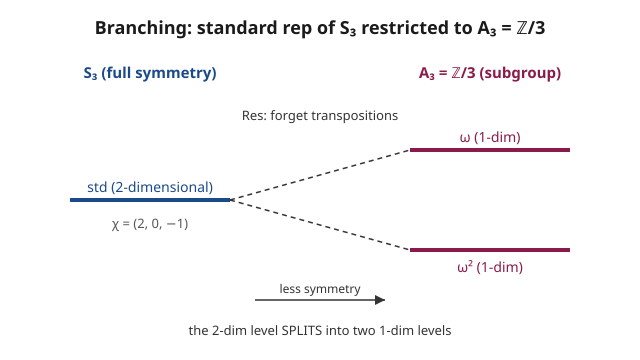

# Group & Representation Theory · Lesson 3.3: Restriction and induction (a taste)

> ⏱ ~15 min · Module 3: Symmetry in action · Builds on: [3.2 Clebsch–Gordan decomposition](03-02-clebsch-gordan-decomposition.md) · Unlocks: [3.4 Molecular vibrations and selection rules](03-04-molecular-vibrations-selection-rules.md)

## Why this matters

Every real system has *nested* symmetry. A molecule sits in full rotational symmetry until you cool it and a distortion sets in, leaving only a subgroup. An atom's energy levels are degenerate under the full symmetry of empty space, then split the instant you switch on a crystal field that respects only some of those symmetries. The mathematics of "what happens to a representation when the symmetry group shrinks (or grows)" is exactly restriction and induction — and the single accounting identity that ties them together, **Frobenius reciprocity**, is the engine behind level-splitting diagrams (3.5), branching rules from $SU(3)$ down to $SU(2)$ (4.6), and a shortcut for building character tables of big groups out of small ones. This lesson is a taste: the constructions and the reciprocity law, stated and *used*, not proved.

## The idea

Two groups, one nested inside the other: $H \leq G$. Reps flow both ways.

**Restriction — go down, throw elements away.** If you have a $G$-rep $V$, you already know how *every* element of $G$ acts. In particular you know how the elements of the subgroup $H$ act. Just stop looking at the rest. That gives an $H$-rep, written $\operatorname{Res}^G_H V$. Nothing is built — you *forget* the extra symmetry. The catch: a rep that was irreducible for the big group is usually **reducible** for the small one. Less symmetry means fewer constraints tying the space together, so it can fall apart into smaller $H$-invariant pieces. How it falls apart is called the **branching rule**: the $G$-irreducible "branches" into a sum of $H$-irreducibles.

**Induction — go up, spread over cosets.** The reverse is less obvious: given an $H$-rep $W$, manufacture a $G$-rep $\operatorname{Ind}^G_H W$. You can't just "add elements you don't have," so instead you make copies of $W$ — one for each coset of $H$ in $G$ — and let $G$ shuffle the copies around while $H$ acts inside each one. The result is bigger: its dimension is $[G:H] \cdot \dim W = |G/H| \cdot \dim W$. Induction *builds up* symmetry from a smaller piece.

The beautiful part: these two opposite-direction operations are **adjoint** — they're mirror images, and one identity counts both.

## The formal version

**Restriction.** For $H \leq G$ and a $G$-rep $(\rho, V)$, define $\operatorname{Res}^G_H V$ to be the same vector space $V$ with the action restricted to $H$: $\rho\big|_H$. Its character is just the character of $V$ evaluated on $H$:
$$\chi_{\operatorname{Res}^G_H V}(h) = \chi_V(h), \qquad h \in H.$$
*In words:* the restricted character is the old character table with all the columns for elements outside $H$ deleted.

**Induction.** For an $H$-rep $(\sigma, W)$, one clean model of $\operatorname{Ind}^G_H W$ is the space of functions
$$\operatorname{Ind}^G_H W = \{\, f: G \to W \ \mid\ f(hg) = \sigma(h)\,f(g)\ \ \forall h\in H,\, g\in G \,\},$$
with $G$ acting by shifting the argument, $(\rho(g_0) f)(g) = f(g g_0)$. *In words:* a vector is a $W$-valued function on the group that transforms correctly under $H$; specifying it on one representative per coset determines it everywhere, so there are $|G/H|$ independent slots, each holding a copy of $W$. Equivalently and more concretely, pick coset representatives $g_1,\dots,g_n$ (with $n = [G:H]$) and think of $\operatorname{Ind}^G_H W \cong \bigoplus_{i=1}^{n} g_i W$ — one copy per coset, permuted by $G$. Either way,
$$\dim \operatorname{Ind}^G_H W = [G:H]\cdot \dim W.$$

**Frobenius reciprocity (state and use — we will not prove it).** For any $G$-rep $V$ and $H$-rep $W$,
$$\big\langle \operatorname{Res}^G_H V,\ W \big\rangle_H \;=\; \big\langle V,\ \operatorname{Ind}^G_H W \big\rangle_G.$$
*In words:* the multiplicity of the $H$-irreducible $W$ inside the restricted rep $\operatorname{Res}^G_H V$ equals the multiplicity of the $G$-irreducible $V$ inside the induced rep $\operatorname{Ind}^G_H W$. How $V$ **breaks up** when you look at less symmetry is the same count as how $W$ **builds up** when you enlarge symmetry. The two inner products live in different groups — the left one averages over $H$, the right one over $G$ — yet they always agree.

Why this is a workhorse: to find *either* decomposition you compute *whichever* side is easier. Restriction is trivial (delete columns); so the right-hand "how does the induced rep decompose" question — which would otherwise mean building big matrices — is answered by the cheap left-hand side.

## Picture

The left column has full symmetry $S_3$, where the standard rep is a single irreducible 2-dimensional level. Restricting to the rotation subgroup $A_3 = \{e, (123), (132)\} \cong \mathbb{Z}/3$ — literally forgetting the three reflections/transpositions — the level has no reason to stay together and **splits** into two 1-dimensional levels. This is the same picture a physicist draws when a symmetry-lowering perturbation splits a degenerate multiplet (3.5).

## Worked examples

Setup for both: $S_3$ has three irreducibles — trivial $\mathbf{1}$, sign $\varepsilon$, and standard $\mathrm{std}$ — with characters on the classes $\{e\}$, $\{$transpositions$\}$, $\{$3-cycles$\}$:

| irrep | $e$ | transposition | 3-cycle |
|---|---|---|---|
| $\mathbf{1}$ | $1$ | $1$ | $1$ |
| $\varepsilon$ | $1$ | $-1$ | $1$ |
| $\mathrm{std}$ | $2$ | $0$ | $-1$ |

The subgroup $A_3 = \langle (123)\rangle \cong \mathbb{Z}/3$ has three 1-dimensional characters. Writing $\omega = e^{2\pi i/3}$ (so $1 + \omega + \omega^2 = 0$) and taking the generator $g = (123)$:

| $\mathbb{Z}/3$ char | $e$ | $g=(123)$ | $g^2=(132)$ |
|---|---|---|---|
| $\mathbf{1}$ | $1$ | $1$ | $1$ |
| $\omega$ | $1$ | $\omega$ | $\omega^2$ |
| $\omega^2$ | $1$ | $\omega^2$ | $\omega$ |

**Example 1 (restriction / branching — computed).** Restrict the standard rep to $A_3$. Delete every column of $\chi_{\mathrm{std}}$ that isn't an element of $A_3$: what survives is the value on $e$ and on the two 3-cycles,
$$\chi_{\operatorname{Res}^{S_3}_{A_3}\mathrm{std}} = (2,\,-1,\,-1) \quad \text{on } (e,\, g,\, g^2).$$
Decompose it against the $\mathbb{Z}/3$ characters using orthogonality, $\langle \chi, \psi\rangle_{A_3} = \frac{1}{3}\sum_{k=0}^{2}\chi(g^k)\overline{\psi(g^k)}$:
$$\langle \operatorname{Res}\mathrm{std},\, \mathbf{1}\rangle = \tfrac13(2 - 1 - 1) = 0,$$
$$\langle \operatorname{Res}\mathrm{std},\, \omega\rangle = \tfrac13\big(2\cdot 1 + (-1)\overline{\omega} + (-1)\overline{\omega^2}\big) = \tfrac13\big(2 - (\omega^2+\omega)\big) = \tfrac13(2+1) = 1,$$
and by the same computation $\langle \operatorname{Res}\mathrm{std},\, \omega^2\rangle = 1$. So the branching rule is
$$\operatorname{Res}^{S_3}_{A_3} \mathrm{std} \;=\; \omega \,\oplus\, \omega^2.$$
The 2-dimensional standard rep branches into the two *nontrivial* characters of $\mathbb{Z}/3$ — exactly the split in the picture. (Sanity check: $\dim = 1 + 1 = 2$. ✓)

**Example 2 (induction via reciprocity — no matrices built).** Now go the other way: how does $\operatorname{Ind}^{S_3}_{A_3}\omega$ decompose into $S_3$-irreducibles? Its dimension is $[S_3 : A_3]\cdot 1 = 2\cdot 1 = 2$, so it can't be big — but rather than construct the induced matrices, read off each multiplicity from the *restriction* side, which we can do by eye:
$$\langle \mathrm{Ind}\,\omega,\, V\rangle_{S_3} = \langle \omega,\, \operatorname{Res}^{S_3}_{A_3}V\rangle_{A_3}\quad\text{for each irrep } V.$$
- $V = \mathbf{1}$: $\operatorname{Res}\mathbf{1} = (1,1,1) = \mathbf{1}_{A_3}$, and $\langle \omega, \mathbf{1}\rangle_{A_3} = 0$.
- $V = \varepsilon$: every element of $A_3$ is even, so $\operatorname{Res}\varepsilon = (1,1,1) = \mathbf{1}_{A_3}$ too, giving $\langle \omega, \mathbf{1}\rangle_{A_3} = 0$.
- $V = \mathrm{std}$: $\operatorname{Res}\mathrm{std} = \omega \oplus \omega^2$ (Example 1), so $\langle \omega,\, \omega\oplus\omega^2\rangle_{A_3} = 1$.

Therefore $\operatorname{Ind}^{S_3}_{A_3}\omega = \mathrm{std}$. We recovered a full $G$-rep's decomposition without ever writing a $2\times 2$ matrix — three one-line inner products on the easy side did it. (Note the reciprocity in plain sight: $\omega$ appears in $\operatorname{Res}\,\mathrm{std}$ with multiplicity $1$, and $\mathrm{std}$ appears in $\operatorname{Ind}\,\omega$ with multiplicity $1$.)

## Watch out

- **Restriction almost never preserves irreducibility.** $\mathrm{std}$ is irreducible over $S_3$ but reducible over $A_3$. Shrinking the group can only *break* invariance, never create it — expect branching, and check dimensions add up.
- **Induction is not "just make it a $G$-rep."** You don't reinterpret $W$ as living on $G$; you tensor up to $|G/H|$ copies. Forgetting the dimension factor $[G:H]$ is the most common slip. $\operatorname{Ind}^G_H W$ is generally reducible even when $W$ is irreducible.
- **The two inner products in reciprocity use different averaging groups.** $\langle -,-\rangle_H$ divides by $|H|$ and sums over $H$; $\langle -,-\rangle_G$ divides by $|G|$ and sums over $G$. They still come out equal — that's the content of the theorem, not an accident of normalization. Don't "simplify" by using one group's average on both sides.
- **Conjugate characters need honest bars.** In $\langle \operatorname{Res}\mathrm{std}, \omega\rangle$ the second factor is conjugated, so $\overline{\omega} = \omega^2$. Dropping the conjugate flips $\omega \leftrightarrow \omega^2$ and can hand you a multiplicity of $0$ where the answer is $1$.

## One-liner

> Restriction breaks a big-group irreducible into small-group pieces (branching); induction spreads a small-group rep over the cosets; Frobenius reciprocity says the two multiplicity counts are literally the same number — so always compute on the restriction side.

## Problems

**P1 (🟢)** Restrict the standard rep of $S_3$ to the order-2 subgroup $H = \langle (12)\rangle \cong \mathbb{Z}/2$ and decompose it into irreducibles of $\mathbb{Z}/2$ (the branching rule). *Hint:* $\mathbb{Z}/2$ has the trivial character $(1,1)$ and the sign character $(1,-1)$ on $(e, (12))$.

**P2 (🟡)** Use Frobenius reciprocity — no induced matrices — to decompose $\operatorname{Ind}^{S_3}_{A_3}\mathbf{1}$ (induce the *trivial* character of $A_3$) into $S_3$-irreducibles. Check the dimension.

**P3 (🔴)** Verify Frobenius reciprocity in one concrete case. Take $V = \mathrm{std}$ (an $S_3$-irrep) and $W = \omega$ (an $A_3$-irrep). Compute **both**
$$\langle \operatorname{Res}^{S_3}_{A_3}\mathrm{std},\ \omega\rangle_{A_3} \qquad\text{and}\qquad \langle \mathrm{std},\ \operatorname{Ind}^{S_3}_{A_3}\omega\rangle_{S_3},$$
the second by first computing the character of the induced rep from the induced-character formula
$$\chi_{\operatorname{Ind}^G_H W}(g) = \frac{1}{|H|}\sum_{\substack{x\in G \\ x^{-1}gx\,\in\,H}} \chi_W(x^{-1}gx),$$
and show the two numbers agree.

Solutions

**P1.** Restrict $\chi_{\mathrm{std}}$ to $H = \{e, (12)\}$: keep the value on $e$ (which is $2$) and on the transposition $(12)$ (which is $0$), so $\chi_{\operatorname{Res}\mathrm{std}} = (2, 0)$ on $(e, (12))$. Decompose with $\langle\chi,\psi\rangle_H = \frac12\sum \chi\,\overline{\psi}$:
$$\langle (2,0), (1,1)\rangle = \tfrac12(2 + 0) = 1, \qquad \langle (2,0), (1,-1)\rangle = \tfrac12(2 - 0) = 1.$$
So $\operatorname{Res}^{S_3}_{\langle(12)\rangle}\mathrm{std} = \mathbf{1} \oplus \varepsilon$ (trivial $\oplus$ sign). Dimension $1 + 1 = 2$. ✓ Under this reflection subgroup the standard rep branches into an even part and an odd part — geometrically, the axis along the mirror and the axis perpendicular to it.

**P2.** For each $S_3$-irrep $V$, $\langle \mathrm{Ind}\,\mathbf{1}, V\rangle_{S_3} = \langle \mathbf{1}, \operatorname{Res}V\rangle_{A_3}$.
- $V=\mathbf{1}$: $\operatorname{Res}\mathbf{1} = (1,1,1) = \mathbf{1}_{A_3}$, so $\langle \mathbf{1},\mathbf{1}\rangle_{A_3} = 1$.
- $V=\varepsilon$: all of $A_3$ is even, so $\operatorname{Res}\varepsilon = (1,1,1) = \mathbf{1}_{A_3}$, giving $\langle \mathbf{1},\mathbf{1}\rangle_{A_3} = 1$.
- $V=\mathrm{std}$: $\operatorname{Res}\mathrm{std} = \omega\oplus\omega^2$, and $\langle \mathbf{1},\, \omega\oplus\omega^2\rangle_{A_3} = 0 + 0 = 0$.

So $\operatorname{Ind}^{S_3}_{A_3}\mathbf{1} = \mathbf{1} \oplus \varepsilon$. Dimension: $[S_3:A_3]\cdot 1 = 2 = 1 + 1$. ✓ (This is the general fact that inducing the trivial rep of $H$ gives the permutation representation of $G$ on the cosets $G/H$ — here the sign-labelled 2-element coset set.)

**P3.** *Left side.* From Example 1, $\operatorname{Res}\mathrm{std} = \omega \oplus \omega^2$, so
$$\langle \operatorname{Res}\mathrm{std},\ \omega\rangle_{A_3} = \langle \omega,\omega\rangle + \langle \omega^2,\omega\rangle = 1 + 0 = 1.$$

*Right side.* Build $\chi_{\operatorname{Ind}\,\omega}$ on the three $S_3$-classes with $H = A_3$, $|H| = 3$.
- $g = e$: every $x\in G$ has $x^{-1}ex = e \in H$, and $\chi_\omega(e)=1$, so $\chi_{\mathrm{Ind}}(e) = \frac16... $ no — $\frac{1}{|H|}\sum_{x\in G} 1 = \frac{6}{3} = 2$. (Equals $\dim$, as it must.)
- $g = (12)$: conjugates of a transposition are transpositions, which are odd and never lie in $A_3$; the sum is empty, so $\chi_{\mathrm{Ind}}((12)) = 0$.
- $g = (123)$: for *every* $x\in G$, $x^{-1}(123)x$ is a 3-cycle, hence in $A_3$, so all 6 elements contribute. The centralizer of $(123)$ in $S_3$ is $A_3$ (order 3), so 3 of the $x$ give $x^{-1}(123)x = (123)$ and the other 3 give $(132)$. Thus
$$\chi_{\mathrm{Ind}}((123)) = \tfrac13\big(3\,\chi_\omega((123)) + 3\,\chi_\omega((132))\big) = \tfrac13\big(3\omega + 3\omega^2\big) = \omega + \omega^2 = -1.$$

So $\chi_{\operatorname{Ind}\,\omega} = (2,\,0,\,-1)$ on $(e,\ \text{transposition},\ \text{3-cycle})$ — which is exactly $\chi_{\mathrm{std}}$, already telling us $\operatorname{Ind}\,\omega = \mathrm{std}$. Now the requested inner product, using $S_3$ class sizes $1, 3, 2$ and $|G| = 6$:
$$\langle \mathrm{std},\ \operatorname{Ind}\omega\rangle_{S_3} = \tfrac16\big[\,1\cdot 2\cdot 2 + 3\cdot 0\cdot 0 + 2\cdot(-1)(-1)\,\big] = \tfrac16(4 + 0 + 2) = 1.$$

Both sides equal $\mathbf{1}$. Frobenius reciprocity holds, computed honestly on each side and in two different groups. ✓

## Flashback

**From Lesson 3.2 (Clebsch–Gordan decomposition):** Decompose the tensor product $\mathrm{std}\otimes\mathrm{std}$ of the $S_3$ standard rep with itself into irreducibles. (Recall the character of a tensor product is the *product* of the characters, class by class.)

Solution

Multiply $\chi_{\mathrm{std}} = (2,0,-1)$ by itself entrywise: $\chi_{\mathrm{std}\otimes\mathrm{std}} = (4,\,0,\,1)$ on $(e,\ \text{transposition},\ \text{3-cycle})$. Take inner products against each irrep (class sizes $1,3,2$; $|G|=6$):
$$\langle (4,0,1),\mathbf{1}\rangle = \tfrac16(1\cdot4\cdot1 + 3\cdot0\cdot1 + 2\cdot1\cdot1) = \tfrac16(4+0+2) = 1,$$
$$\langle (4,0,1),\varepsilon\rangle = \tfrac16(1\cdot4\cdot1 + 3\cdot0\cdot(-1) + 2\cdot1\cdot1) = \tfrac16(4+0+2) = 1,$$
$$\langle (4,0,1),\mathrm{std}\rangle = \tfrac16(1\cdot4\cdot2 + 3\cdot0\cdot0 + 2\cdot1\cdot(-1)) = \tfrac16(8+0-2) = 1.$$
So $\mathrm{std}\otimes\mathrm{std} = \mathbf{1}\oplus\varepsilon\oplus\mathrm{std}$. Dimension check: $4 = 1 + 1 + 2$. ✓ (The trivial summand is the invariant inner product; its single copy is why $\mathrm{std}$ is self-dual.)

## Connections

- **Backward:** the whole lesson runs on [3.2](03-02-clebsch-gordan-decomposition.md)'s multiplicity machinery — character inner products decide every branching and every induced decomposition — and on [2.4](02-04-decomposing-a-representation.md)'s "project onto irreducibles" reflex. The subgroup/coset language is straight from [`abstract-algebra`](../../abstract-algebra/syllabus.md) (cosets, index, conjugacy classes).
- **Forward:** [3.5](03-05-degeneracy-symmetry-breaking.md) is this lesson made physical — **symmetry breaking is literally restriction to a subgroup**, and a degenerate level splits according to the branching rule (the picture above *is* a correlation diagram). In Module 4, [4.6](04-06-roots-weights-su3.md) uses branching to decompose $SU(3)$-irreducibles under the subgroup $SU(2)$, the workhorse of the quark model.
- **Sideways (quantum mechanics):** correlation diagrams in [`quantum-mechanics`](../../quantum-mechanics/syllabus.md) — how an atomic multiplet splits when a crystal or ligand field lowers the symmetry — are branching rules read top to bottom; the number of split sublevels is the number of $H$-irreducibles in the branch.
- **Sideways (algebra):** the coset picture and index counting behind $\dim\operatorname{Ind} = [G:H]\dim W$ are the group-theory fundamentals in [`abstract-algebra`](../../abstract-algebra/syllabus.md); inducing the trivial rep reproduces the permutation action on $G/H$.
