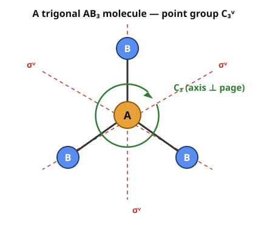

# Group & Representation Theory · Lesson 3.4: Molecular vibrations and selection rules

> ⏱ ~15 min · Module 3: Symmetry in action · Builds on: [3.3 Restriction and induction (a taste)](03-03-restriction-induction.md) · Unlocks: [3.5 Degeneracy and symmetry breaking](03-05-degeneracy-symmetry-breaking.md)

## Why this matters

A chemist points a laser at ammonia and reads off how many peaks appear, at how many frequencies, and which ones show up in infrared versus Raman spectra. You can predict every one of those numbers *before touching a spectrometer* — no forces, no masses, no differential equations — using nothing but the molecule's symmetry group and its character table. This is the moment character theory stops being bookkeeping and starts making experimental predictions. A molecule with $N$ atoms has $3N$ ways to move; symmetry sorts them into translations, rotations, and genuine vibrations, and tells you which vibrations a photon can see.

## The idea

Every atom can move in three directions, so an $N$-atom molecule lives in a $3N$-dimensional space of displacements. The symmetry operations of the molecule (rotations, reflections) shuffle those displacement vectors around — that is a **representation**, call it $\Gamma_{\text{total}}$, and it's big and reducible. Decompose it into irreducibles (2.4's machinery) and you've sorted all $3N$ motions by symmetry type.

But six of those motions aren't vibrations at all: three are the whole molecule sliding (translation), three are it tumbling (rotation). Both are easy to spot in the character table — they're the rows labelled $x,y,z$ and $R_x,R_y,R_z$. Subtract them off and what's left, $\Gamma_{\text{vib}}$, is the $3N-6$ real vibrational modes, pre-sorted by symmetry. Then one final rule reads the spectrum straight off the table: a mode absorbs infrared light if it wiggles a dipole (transforms like $x,y,z$), and scatters Raman light if it wiggles a polarizability (transforms like a quadratic $x^2, xy, \dots$).

## The formal version

**Molecular point group.** The set of rotations and reflections that map a molecule onto itself, a finite group. Ammonia's is $C_{3v}$: the identity $E$, two rotations by $\pm 120^\circ$ about the axis ($2C_3$), and three vertical mirror planes ($3\sigma_v$). Its irreducibles carry **Mulliken labels**: $A$ (1-dim, symmetric under the main rotation), $B$ (1-dim, antisymmetric), $E$ (2-dim), $T$ (3-dim); subscripts $1,2$ track mirror behaviour. *In words: the point group is the molecule's symmetry, and the Mulliken labels are just this group's irreps under their chemistry names.*

**The displacement representation.** Put a little $x,y,z$ arrow-frame on each atom; the $3N$ arrows are a basis for $\Gamma_{\text{total}}$. Its character has a slick shortcut:

$$\chi_{\text{total}}(g) = (\text{number of atoms left in place by } g)\times(\text{contribution per unmoved atom}).$$

*In words: an atom that moves contributes nothing to the trace (its arrows land on some other atom's arrows — off-diagonal), so only fixed atoms count.* The per-atom contribution is the trace of what $g$ does to one $x,y,z$ frame:

$$\text{proper rotation by }\theta:\ 1 + 2\cos\theta, \qquad \text{improper (reflection / }S_n\text{ / inversion)}:\ -1 + 2\cos\theta.$$

Where these come from: a rotation by $\theta$ fixes its axis (contributes $1$) and spins the perpendicular plane by the $2\times 2$ block $\begin{pmatrix}\cos\theta & -\sin\theta\\ \sin\theta & \cos\theta\end{pmatrix}$ (contributes $2\cos\theta$). An improper operation is that rotation followed by a reflection through the perpendicular plane, which flips the axis: $+1 \to -1$. Check: a plain mirror is $\theta=0$, giving $-1+2 = 1$; inversion is $\theta=180^\circ$, giving $-1-2 = -3$. ✓

**Decompose, then subtract.** Use the projection formula from [2.4](02-04-decomposing-a-representation.md), with group order $h$ and class sizes $g_c$:

$$m_i = \langle \chi_{\text{total}}, \chi_i\rangle = \frac{1}{h}\sum_{\text{classes } c} g_c\,\chi_{\text{total}}(c)\,\overline{\chi_i(c)}.$$

Then

$$\Gamma_{\text{vib}} = \Gamma_{\text{total}} \ominus \Gamma_{\text{trans}} \ominus \Gamma_{\text{rot}},$$

where $\Gamma_{\text{trans}}$ is whichever irreps carry $x,y,z$ and $\Gamma_{\text{rot}}$ whichever carry $R_x,R_y,R_z$ — both printed in the last columns of every character table. *In words: strip out the rigid slide and tumble, keep the internal wiggles.* Dimensions must total $3N-6$ (or $3N-5$ for a linear molecule, which has only two rotational modes).

**Selection rules.** A vibrational mode of symmetry $\Gamma$ is:

- **IR-active** if $\Gamma$ appears in the same row as a translation $x,y,z$ (the mode modulates the dipole moment, so it can absorb a photon);
- **Raman-active** if $\Gamma$ appears in the same row as a quadratic $x^2, y^2, z^2, xy, xz, yz$ (it modulates the polarizability).

The deep reason is [3.2](03-02-clebsch-gordan-decomposition.md)'s triple-product rule. A transition $i \to f$ driven by an operator $\mu$ (the dipole, which transforms like $x,y,z$) has amplitude $\langle f | \mu | i\rangle$, and this integral is forced to zero unless the trivial rep $A_1$ appears in the tensor product:

$$\langle f|\mu|i\rangle \neq 0 \iff A_1 \subseteq \Gamma_f \otimes \Gamma_\mu \otimes \Gamma_i.$$

*In words: a matrix element survives only if the three symmetry types can couple to something totally symmetric — otherwise the integral of a non-symmetric function over a symmetric domain cancels to nothing.* For a fundamental, $\Gamma_i = A_1$ (the ground state) and this collapses to "$\Gamma_f$ must match $\Gamma_\mu$," i.e. the mode transforms like $x,y,z$ — exactly the IR rule.

## Picture

The $C_3$ axis pokes out of the page through the central atom; each dashed red line is a $\sigma_v$ mirror plane, and each plane contains the axis plus exactly one $B$ atom. That "one $B$ atom per mirror" fact is what makes the unmoved-atom count easy below.

## Worked examples

**Example 1 (build $\Gamma_{\text{vib}}$ for a $C_{3v}$ molecule $AB_3$, $N=4$).** This is the core of Boss Problem 3. The $C_{3v}$ character table:

| $C_{3v}$ | $E$ | $2C_3$ | $3\sigma_v$ | linear / rot | quadratic |
|---|---|---|---|---|---|
| $A_1$ | $1$ | $1$ | $1$ | $z$ | $x^2+y^2,\ z^2$ |
| $A_2$ | $1$ | $1$ | $-1$ | $R_z$ | — |
| $E$ | $2$ | $-1$ | $0$ | $(x,y),(R_x,R_y)$ | $(x^2-y^2,xy),(xz,yz)$ |

Order $h=6$; class sizes $1, 2, 3$. Now the two ingredients per class — unmoved atoms, and per-atom contribution:

| operation | $\theta$ | per-atom | atoms unmoved | $\chi_{\text{total}}$ |
|---|---|---|---|---|
| $E$ | $0^\circ$, proper | $1+2\cos 0 = 3$ | all $4$ | $4\times 3 = 12$ |
| $C_3$ | $120^\circ$, proper | $1+2\cos 120^\circ = 0$ | only central $A$ | $1\times 0 = 0$ |
| $\sigma_v$ | reflection | $-1+2\cos 0 = 1$ | $A$ + the one $B$ in the plane | $2\times 1 = 2$ |

So $\chi_{\text{total}} = (12,\ 0,\ 2)$ across $(E,\ 2C_3,\ 3\sigma_v)$. Project:

$$m_{A_1} = \tfrac{1}{6}\big[1\cdot 12\cdot 1 + 2\cdot 0\cdot 1 + 3\cdot 2\cdot 1\big] = \tfrac{18}{6} = 3,$$
$$m_{A_2} = \tfrac{1}{6}\big[1\cdot 12\cdot 1 + 2\cdot 0\cdot 1 + 3\cdot 2\cdot(-1)\big] = \tfrac{6}{6} = 1,$$
$$m_{E} = \tfrac{1}{6}\big[1\cdot 12\cdot 2 + 2\cdot 0\cdot(-1) + 3\cdot 2\cdot 0\big] = \tfrac{24}{6} = 4.$$

So $\Gamma_{\text{total}} = 3A_1 \oplus A_2 \oplus 4E$ (dimension $3+1+4\cdot 2 = 12 = 3N$ ✓). Read the translations and rotations off the table: $x,y,z$ live in $A_1$ ($z$) and $E$ ($x,y$), so $\Gamma_{\text{trans}} = A_1 \oplus E$; the $R$'s live in $A_2$ ($R_z$) and $E$, so $\Gamma_{\text{rot}} = A_2 \oplus E$. Subtract:

$$\Gamma_{\text{vib}} = (3A_1 \oplus A_2 \oplus 4E)\ominus(A_1\oplus E)\ominus(A_2\oplus E) = 2A_1 \oplus 2E.$$

Count: $2\cdot 1 + 2\cdot 2 = 6 = 3N-6$ ✓. This *is* ammonia: two $A_1$ modes (the symmetric stretch and the umbrella bend, both preserving full symmetry) and two doubly-degenerate $E$ modes (asymmetric stretch and bend) — 6 vibrations but only **4 distinct frequencies**, because each $E$ is a degenerate pair.

**Example 2 (read the spectrum off the table).** Take those four fundamentals and apply the selection rules directly from the table's last two columns:

| mode | symmetry | carries $x,y,z$? | carries a quadratic? | IR | Raman |
|---|---|---|---|---|---|
| sym. stretch | $A_1$ | yes ($z$) | yes ($z^2$) | ✔ | ✔ |
| umbrella bend | $A_1$ | yes ($z$) | yes ($z^2$) | ✔ | ✔ |
| asym. stretch | $E$ | yes ($x,y$) | yes ($xz,yz$) | ✔ | ✔ |
| asym. bend | $E$ | yes ($x,y$) | yes ($xz,yz$) | ✔ | ✔ |

Every mode of $C_{3v}$ ammonia is both IR- and Raman-active — because $C_{3v}$ has no center of inversion, so no mode is forced to be one-or-the-other. (In centrosymmetric molecules the **mutual exclusion rule** kicks in: $g$ modes are Raman-only, $u$ modes IR-only, never both. That's a 3.5 story once inversion enters.)

## Watch out

- **Only fixed atoms count — but only when they're truly fixed.** An atom that swaps places with another under an operation contributes $0$ to $\chi_{\text{total}}$, no matter how it's oriented. Don't multiply the per-atom contribution by all $N$; multiply by the *unmoved* count, which changes class to class.
- **Reflection is not "$\cos\theta$ of nothing."** A mirror is an *improper* operation with $\theta = 0$, contribution $-1+2 = +1$, not $-1$. Sign errors here silently corrupt the whole decomposition — always sanity-check that dimensions sum to $3N$.
- **"IR-active" is not "has a dipole."** Ammonia's symmetric stretch keeps the molecule's permanent dipole; what matters is that the vibration *changes* the dipole, i.e. the mode transforms like $x,y,z$. A totally symmetric mode in a molecule with a permanent dipole (like $A_1$ here) still qualifies — but a totally symmetric mode in a molecule *without* a dipole axis need not.
- **You still can't get frequencies this way.** Symmetry hands you the *number* and *type* and *activity* of modes for free; the actual wavenumbers need the force constants and masses. Representation theory tells you the shape of the answer, not the numbers.

## One-liner

> The $3N$ atomic displacements form a reducible representation — decompose it, subtract the six rigid motions, and the character table alone tells you how many vibrations exist, their degeneracies, and which ones light can see.

## Problems

**P1 (🟢)** For a $C_{2v}$ molecule, the four irreps carry these functions: $A_1$: $z$; $x^2,y^2,z^2$. $A_2$: (nothing linear); $xy$. $B_1$: $x$; $xz$. $B_2$: $y$; $yz$. For each of $A_1, A_2, B_1, B_2$, state whether a vibration of that symmetry is IR-active, Raman-active, both, or neither. Which one is "silent" in the infrared but visible in Raman?

**P2 (🟡)** Water $H_2O$ is bent, point group $C_{2v}$ ($N=3$; classes $E,\ C_2,\ \sigma_v(xz),\ \sigma_v'(yz)$, all size $1$, $h=4$). Take the molecular plane to be $xz$, so it contains all three atoms; the perpendicular plane $yz$ contains only the O. Build $\chi_{\text{total}}$ over the four operations and decompose it into $\Gamma_{\text{total}}$. (The $C_{2v}$ table: $A_1 = (1,1,1,1)$, $A_2=(1,1,-1,-1)$, $B_1=(1,-1,1,-1)$, $B_2=(1,-1,-1,1)$, ordered $E, C_2, \sigma_v(xz), \sigma_v'(yz)$.)

**P3 (🔴 — Boss Problem 3, part 1)** Chloroform $CHCl_3$ is $C_{3v}$ with $N=5$: a carbon on the axis, one H on the axis above it, three Cl below. Build $\chi_{\text{total}}$, decompose into $A_1, A_2, E$, subtract translations and rotations, and report $\Gamma_{\text{vib}}$ — the symmetry types of its vibrational modes. How many distinct vibrational frequencies do you predict?

Solutions

**P1** Match each irrep against the two columns.
- $A_1$: carries $z$ → IR; carries $x^2,\dots$ → Raman. **Both.**
- $A_2$: no $x,y,z$ → IR-inactive; carries $xy$ → Raman. **Raman only — silent in IR.**
- $B_1$: carries $x$ → IR; carries $xz$ → Raman. **Both.**
- $B_2$: carries $y$ → IR; carries $yz$ → Raman. **Both.**

The silent-in-IR mode is **$A_2$**: it has no dipole component to grab a photon, but its polarizability change ($xy$) makes it Raman-active. Such IR-silent modes are exactly why chemists run *both* spectroscopies.

**P2** Per-atom contributions: $E$ (proper, $\theta=0$) $= 3$; $C_2$ (proper, $\theta=180^\circ$) $= 1+2\cos 180^\circ = -1$; each $\sigma$ (reflection) $= 1$. Unmoved atoms:
- $E$: all $3$ → $\chi = 3\times 3 = 9$.
- $C_2$: axis passes through O only (the two H swap) → $\chi = 1\times(-1) = -1$.
- $\sigma_v(xz)$, the molecular plane: all $3$ atoms lie in it → $\chi = 3\times 1 = 3$.
- $\sigma_v'(yz)$, perpendicular: only O lies in it → $\chi = 1\times 1 = 1$.

So $\chi_{\text{total}} = (9,\ -1,\ 3,\ 1)$. Project ($h=4$):
$$m_{A_1} = \tfrac{1}{4}(9\cdot 1 -1\cdot 1 + 3\cdot 1 + 1\cdot 1) = \tfrac{12}{4} = 3,$$
$$m_{A_2} = \tfrac{1}{4}(9 -1 - 3 - 1) = \tfrac{4}{4} = 1,$$
$$m_{B_1} = \tfrac{1}{4}(9 +1 + 3 - 1) = \tfrac{12}{4} = 3,$$
$$m_{B_2} = \tfrac{1}{4}(9 +1 - 3 + 1) = \tfrac{8}{4} = 2.$$

$$\Gamma_{\text{total}} = 3A_1 \oplus A_2 \oplus 3B_1 \oplus 2B_2 \quad (\text{dim } 3+1+3+2 = 9 = 3N\ ✓).$$

(Bonus check on the vibrations: $\Gamma_{\text{trans}} = A_1(z)\oplus B_1(x)\oplus B_2(y)$, $\Gamma_{\text{rot}} = A_2(R_z)\oplus B_1(R_y)\oplus B_2(R_x)$, so $\Gamma_{\text{vib}} = 2A_1 \oplus B_1$ — the symmetric stretch, the bend, and the asymmetric stretch, all IR- and Raman-active. Three modes $= 3N-6$ ✓.)

**P3** $C_{3v}$, $h=6$, classes $E,\ 2C_3,\ 3\sigma_v$. Per-atom contributions are the same as Example 1: $3,\ 0,\ 1$. Unmoved atoms:
- $E$: all $5$ → $\chi = 5\times 3 = 15$.
- $C_3$: only atoms on the axis, namely C and H → $2$ unmoved → $\chi = 2\times 0 = 0$.
- $\sigma_v$: each mirror contains the axis (C and H) plus the one Cl it passes through → $3$ unmoved → $\chi = 3\times 1 = 3$.

So $\chi_{\text{total}} = (15,\ 0,\ 3)$. Project:
$$m_{A_1} = \tfrac{1}{6}(1\cdot 15\cdot 1 + 2\cdot 0\cdot 1 + 3\cdot 3\cdot 1) = \tfrac{24}{6} = 4,$$
$$m_{A_2} = \tfrac{1}{6}(15 + 0 + 3\cdot 3\cdot(-1)) = \tfrac{6}{6} = 1,$$
$$m_{E} = \tfrac{1}{6}(1\cdot 15\cdot 2 + 0 + 3\cdot 3\cdot 0) = \tfrac{30}{6} = 5.$$

$$\Gamma_{\text{total}} = 4A_1 \oplus A_2 \oplus 5E \quad (\text{dim } 4 + 1 + 10 = 15 = 3N\ ✓).$$

Subtract $\Gamma_{\text{trans}} = A_1 \oplus E$ and $\Gamma_{\text{rot}} = A_2 \oplus E$:

$$\Gamma_{\text{vib}} = (4A_1 \oplus A_2 \oplus 5E)\ominus(A_1\oplus E)\ominus(A_2\oplus E) = 3A_1 \oplus 3E.$$

Count: $3\cdot 1 + 3\cdot 2 = 9 = 3N - 6$ ✓. So chloroform has **9 vibrational modes** but, since each $E$ is a degenerate pair, only $3 + 3 = 6$ **distinct frequencies** — the standard result. Every mode is both IR- and Raman-active ($A_1$ carries $z$ and $z^2$; $E$ carries $(x,y)$ and quadratics), because $C_{3v}$ lacks an inversion center.

## Flashback

**From Lesson 3.2 (Clebsch–Gordan decomposition):** In $C_{3v}$, decompose the tensor product $E \otimes E$ into irreducibles. (Recall $\chi_{V\otimes W} = \chi_V\,\chi_W$, and use the same $C_{3v}$ table as above.)

Solution

The product character is the pointwise product of $\chi_E = (2,\ -1,\ 0)$ with itself: $\chi_{E\otimes E} = (4,\ 1,\ 0)$ across $(E,\ 2C_3,\ 3\sigma_v)$. Project ($h=6$):
$$m_{A_1} = \tfrac{1}{6}(1\cdot 4\cdot 1 + 2\cdot 1\cdot 1 + 3\cdot 0\cdot 1) = \tfrac{6}{6} = 1,$$
$$m_{A_2} = \tfrac{1}{6}(4 + 2\cdot 1\cdot 1 + 3\cdot 0\cdot(-1)) = \tfrac{6}{6} = 1,$$
$$m_{E} = \tfrac{1}{6}(1\cdot 4\cdot 2 + 2\cdot 1\cdot(-1) + 0) = \tfrac{6}{6} = 1.$$

So $E \otimes E = A_1 \oplus A_2 \oplus E$ (dimension $1+1+2 = 4 = 2\times 2$ ✓). Note the trivial rep $A_1$ appears exactly once — which, by this lesson's triple-product rule, is precisely why an overtone or combination band built from two $E$ excitations can be symmetry-allowed.

## Connections

- **Backward:** the whole computation is [2.4](02-04-decomposing-a-representation.md)'s projection formula run on one specific reducible rep, $\Gamma_{\text{total}}$; the unmoved-atom trick is just the character being blind to off-diagonal (moved-atom) entries. The selection rule is [3.1](03-01-tensor-products.md)–[3.2](03-02-clebsch-gordan-decomposition.md)'s tensor-product coupling: a matrix element lives or dies by whether $A_1 \subseteq \Gamma_f\otimes\Gamma_\mu\otimes\Gamma_i$.
- **Forward:** [3.5](03-05-degeneracy-symmetry-breaking.md) lowers the symmetry — distort the molecule and $C_{3v}\to C_s$, so the degenerate $E$ modes *split* into pairs of non-degenerate ones (exactly the [3.3](03-03-restriction-induction.md) restriction/branching you just used, now read as physical level-splitting). Fewer symmetry operations, more distinct peaks.
- **Sideways (quantum mechanics):** the surviving-matrix-element rule $\langle f|\mu|i\rangle \neq 0$ is the *same* transition-dipole selection rule that governs atomic spectra in [quantum mechanics](../../quantum-mechanics/syllabus.md) — "$\Delta \ell = \pm 1$" for the hydrogen atom is this triple-product rule for the rotation group $SO(3)$ instead of $C_{3v}$. Same theorem, continuous group.
- **Sideways (chemistry/spectroscopy):** this is how vibrational spectroscopy actually works in the lab — count the IR peaks, count the Raman peaks, compare to $\Gamma_{\text{vib}}$, and you can often distinguish molecular geometries (e.g. planar vs. pyramidal $AB_3$) by symmetry alone, before any frequency is measured.
