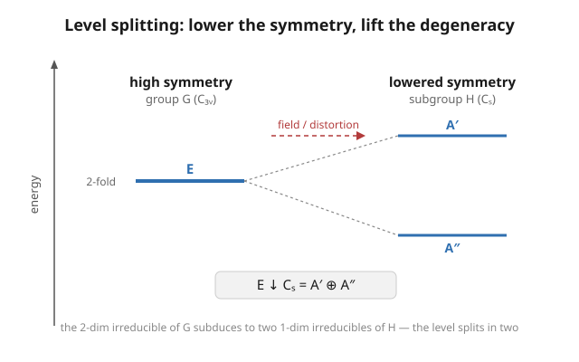

# Group & Representation Theory · Lesson 3.5: Degeneracy and symmetry breaking

> ⏱ ~15 min · Module 3: Symmetry in action · Builds on: [3.4 Molecular vibrations and selection rules](03-04-molecular-vibrations-selection-rules.md) · Unlocks: Module 4 — [4.1 From finite to continuous: Lie groups](04-01-lie-groups.md)

## Why this matters

Open any spectroscopy chart and you'll see energy levels that come in bundles — two states at the same energy, or three, or five — and then, when you switch on a magnetic field or squeeze the crystal, those bundles *fan out* into separate lines. Physicists have a one-word explanation for both facts: **symmetry**. A symmetric system forces certain levels to coincide (degeneracy); lowering the symmetry releases them (splitting). This isn't a coincidence you memorize case by case — it is Schur's lemma and restriction, the two tools you already built in Module 1 and Lesson 3.3, wearing lab coats. This lesson closes the loop: symmetry predicts *how many* states share an energy, and breaking symmetry predicts *exactly how* they split. It also completes Boss Problem 3.

## The idea

A quantum system has a Hamiltonian $H$ — the operator whose eigenvalues are the allowed energies. Say the system has a symmetry group $G$: every $g \in G$ acts on the state space by a matrix $\rho(g)$, and "symmetry" means $H$ is unchanged by that action, i.e. $H\rho(g) = \rho(g)H$ for all $g$. **In words: rotating (or reflecting) the system and then measuring energy gives the same answer as measuring first — the symmetry commutes with the physics.**

Here's the payoff. Take an energy level with energy $\lambda$, and look at its eigenspace $V_\lambda$ (all states with that energy). Because $H$ commutes with every $\rho(g)$, applying a symmetry to a state of energy $\lambda$ lands you back in $V_\lambda$ — so $V_\lambda$ is a $G$-invariant subspace. It therefore carries a representation of $G$. Generically that representation is **irreducible** (if it weren't, you'd typically need an extra "accidental" reason for two irreducibles to share an energy). And an irreducible of dimension $d$ needs $d$ basis states — so **the level is $d$-fold degenerate**. The degeneracy of an energy level equals the dimension of the irreducible it carries.

So the character table already tells you the menu of allowed degeneracies: a group whose irreducibles have dimensions $\{1,1,2\}$ (like $C_{3v}$) can host non-degenerate levels and doubly-degenerate levels — but never a triply-degenerate one, because it has no 3-dimensional irreducible. The abstract list of irreducible dimensions is a spectroscopic prediction.

Now **break the symmetry**. Apply a field, or distort the molecule, so that only a subgroup $H \subset G$ survives. Each level still carries a representation — but now of $H$, obtained by **restricting** (subducing, Lesson 3.3) the old $G$-irreducible to $H$. Two things can happen:

- The restricted representation is *still irreducible* over $H$ → the level is undisturbed (same degeneracy).
- The restricted representation *decomposes* into several $H$-irreducibles → the level **splits**, one sublevel per piece, and the splitting pattern is exactly the branching rule $\rho\big\downarrow_H = \bigoplus_i m_i \sigma_i$.

That's the whole mechanism behind crystal-field, Stark, and Zeeman splitting.

## The formal version

**Symmetry ⟹ degeneracy (Schur at work).** Let $G$ act on state space $V$ by a representation $\rho$, and suppose $H \in \operatorname{End}(V)$ (the Hamiltonian) satisfies

$$[H,\rho(g)] = H\rho(g) - \rho(g)H = 0 \quad \text{for all } g \in G.$$

Then each eigenspace $V_\lambda = \{v : Hv = \lambda v\}$ is $G$-invariant. **In words: symmetries move energy-$\lambda$ states only to other energy-$\lambda$ states.** Suppose $V_\lambda$ carries an irreducible representation $\sigma$ of $G$. Restricted to $V_\lambda$, $H$ is the scalar $\lambda\,\mathrm{Id}$, which is a $G$-intertwiner (it commutes with $\sigma$); by **Schur's lemma (1.5)**, the only intertwiners of an irreducible with itself *are* scalars — consistent, and conversely any $G$-invariant operator is forced to be constant on each irreducible block. Hence a single energy is shared by the entire irreducible:

$$\dim V_\lambda = \dim \sigma =: d \quad\Longrightarrow\quad \text{the level is } d\text{-fold degenerate.}$$

**The allowed-degeneracy list.** The multiset of degeneracies a symmetric Hamiltonian can produce is exactly the multiset of irreducible dimensions $\{d_i\}$ of $G$. (Recall $\sum_i d_i^2 = |G|$ from Module 2.) No level can be more degenerate than $G$'s largest irreducible — unless there is *accidental* degeneracy from a symmetry you didn't put in the group.

**Symmetry breaking = subduction.** Lower $G$ to a subgroup $H$. A level carrying $G$-irreducible $\sigma$ now carries the restricted representation $\sigma\big\downarrow_H^G$, whose decomposition into $H$-irreducibles $\{\tau_j\}$ you compute with the branching rule (3.3), most efficiently by the character inner product using $H$'s classes:

$$\sigma\big\downarrow_H = \bigoplus_j m_j\,\tau_j, \qquad m_j = \frac{1}{|H|}\sum_{h\in H}\overline{\chi_{\tau_j}(h)}\,\chi_\sigma(h).$$

**In words: to see how a level splits, take the character of the level's irreducible, read it off only on the group elements that survive, and re-expand in the surviving group's irreducibles — one sublevel per piece, degeneracy $\dim\tau_j$ each.** The total dimension is conserved: $\sum_j m_j \dim\tau_j = \dim\sigma$ (states are neither created nor destroyed, only re-sorted).

## Picture

A correlation (level-splitting) diagram: the doubly-degenerate $E$ level of $C_{3v}$, hit by a symmetry-lowering perturbation, subduces to $C_s$ and splits into two singlets $A'$ and $A''$. The dashed lines are the branching $E \downarrow C_s = A' \oplus A''$ — the identical shape you'll draw for a $d$-orbital in an octahedral field.

## Worked examples

**Example 1 — a 2-dimensional irreducible forces a 2-fold degeneracy, and $C_{3v}\to C_s$ splits it (Boss Problem 3 completion).**

$C_{3v}$ (the symmetry of ammonia, or any trigonal-pyramidal molecule) has three irreducibles: $A_1, A_2$ (both 1-dimensional) and $E$ (2-dimensional). Check: $1^2+1^2+2^2 = 6 = |C_{3v}|$. ✓ Its character table, on classes $\{E,\ 2C_3,\ 3\sigma_v\}$:

| $C_{3v}$ | $E$ | $2C_3$ | $3\sigma_v$ |
|---|---|---|---|
| $A_1$ | $1$ | $1$ | $1$ |
| $A_2$ | $1$ | $1$ | $-1$ |
| $E$ | $2$ | $-1$ | $0$ |

Any Hamiltonian with full $C_{3v}$ symmetry can host $E$-levels, and every such level is **exactly 2-fold degenerate** — no more (there's no 3-dim irreducible), no less (the $E$ representation can't be split by anything commuting with all of $C_{3v}$, by Schur). The two states are genuinely locked together by symmetry.

Now lower to $C_s = \{e,\sigma\}$ — keep one mirror plane, drop the 3-fold axis and the other two mirrors. $C_s$ has just two 1-dimensional irreducibles: $A'$ (symmetric under the mirror, $\chi=+1$) and $A''$ (antisymmetric, $\chi=-1$). To subduce $E$, read $E$'s character only on the elements of $C_s$ — the identity $e$ and the surviving reflection $\sigma$ (a $\sigma_v$):

$$\chi_E(e) = 2, \qquad \chi_E(\sigma) = 0.$$

Decompose over $C_s$ (order $|H|=2$):

$$m_{A'} = \tfrac{1}{2}\big[\underbrace{(1)(2)}_{e} + \underbrace{(1)(0)}_{\sigma}\big] = 1, \qquad m_{A''} = \tfrac{1}{2}\big[\underbrace{(1)(2)}_{e} + \underbrace{(-1)(0)}_{\sigma}\big] = 1.$$

So

$$\boxed{\,E\big\downarrow_{C_s} = A' \oplus A''\,}$$

The doubly-degenerate $E$ mode splits into two non-degenerate modes, one even and one odd under the surviving mirror. **This is Boss Problem 3 complete:** the $C_{3v}$ vibrational modes of Lesson 3.4 include $E$-symmetry (doubly-degenerate) modes; distort the molecule to $C_s$ (bend it so only one mirror plane remains) and each such $E$ mode splits into an $A' + A''$ pair — the degeneracy is lifted, and IR/Raman spectra that showed one line now show two. The non-degenerate $A_1, A_2$ modes, by contrast, each subduce to a single $C_s$ irreducible ($A_1\downarrow = A'$, $A_2\downarrow = A''$) and *don't* split.

**Example 2 — crystal-field splitting of a $d$-level: the rep theory of ligand-field theory.**

An electron in a $d$-orbital has angular momentum $l=2$. Under the full rotation group $SO(3)$ its five states $\{d_{xy}, d_{yz}, d_{zx}, d_{x^2-y^2}, d_{z^2}\}$ form one irreducible of dimension $2l+1 = 5$ — so a free atom's $d$-level is **5-fold degenerate** (a preview of Module 4, where $(2l+1)$-fold degeneracy is $SO(3)$'s version of "dimension of the irreducible").

Drop the atom into an **octahedral** environment (six ligands on the axes, symmetry group $O_h$). Only the octahedral symmetries survive, so the 5-dimensional $SO(3)$-irreducible subduces to $O_h$. The branching rule (computed the same way — restrict the $l=2$ character to the octahedral classes and decompose) is the workhorse result of inorganic chemistry:

$$D^{(l=2)}\big\downarrow_{O_h} = e_g \oplus t_{2g},$$

where $e_g$ is a 2-dimensional irreducible and $t_{2g}$ is a 3-dimensional one. Check the dimension count: $2 + 3 = 5$. ✓ **In words: the single 5-fold-degenerate $d$-level splits into a doublet ($e_g$: the $d_{z^2},d_{x^2-y^2}$ orbitals, pointing *at* the ligands) and a triplet ($t_{2g}$: $d_{xy},d_{yz},d_{zx}$, pointing *between* them).** The energy gap between them is the crystal-field splitting $\Delta_o$ — the number that determines transition-metal colors, high-spin vs. low-spin magnetism, and much of coordination chemistry. It is pure representation theory: a branching rule with an energy attached.

Notice $O_h$ *does* have a 3-dimensional irreducible ($t_{2g}$), so it can support 3-fold degeneracy — unlike $C_{3v}$. The allowed-degeneracy menu genuinely depends on the group.

## Watch out

- **"Degeneracy always equals irreducible dimension."** Only for degeneracy *forced by the group you wrote down*. Extra degeneracy beyond the biggest irreducible signals **accidental degeneracy** — usually a hidden larger symmetry (the hydrogen atom's $n^2$ degeneracy comes from an $SO(4)$ bigger than the obvious $SO(3)$). "Accidental" is code for "you forgot a symmetry."
- **A subgroup doesn't always split a level.** Restriction only splits when the $G$-irreducible *reduces* over $H$. A 1-dimensional irreducible can never split (it subduces to a single 1-dim irreducible); and some 2-dim irreducibles stay irreducible under a large enough subgroup. Always actually run the branching decomposition — don't assume lowering symmetry lifts *every* degeneracy.
- **Restrict the character to the surviving elements, not the surviving classes-of-$G$.** When you subduce, elements of $G$ get re-sorted into $H$'s conjugacy classes (a $C_{3v}$ class may fracture — its three $\sigma_v$ elements are not all in $C_s$). Evaluate $\chi_\sigma$ element-by-element on $H$, then group by $H$'s classes. (3.3's classic trap.)
- **Dimension is always conserved.** $\sum_j m_j\dim\tau_j = \dim\sigma$. If your split levels' degeneracies don't add back to the original, you made an arithmetic error — states can't vanish.

## One-liner

> Symmetry glues a level's degeneracy to an irreducible's dimension (Schur); breaking symmetry subduces that irreducible to a subgroup, and every time it decomposes, the level splits — one sublevel per branch.

## Problems

**P1 (🟢)** The group $C_{4v}$ (symmetry of a square pyramid) has irreducibles of dimensions $\{1,1,1,1,2\}$. The group $T_d$ (tetrahedral, symmetry of methane) has dimensions $\{1,1,2,3,3\}$. For each group: (a) verify the dimension count against the group order ($|C_{4v}|=8$, $|T_d|=24$); (b) list the degeneracies a symmetric Hamiltonian can produce; (c) which group can host a **triply**-degenerate level, and which can host at most a **doubly**-degenerate one?

**P2 (🟡)** In $C_{3v}$, subduce the $A_2$ irreducible to the subgroup $C_3 = \{e, C_3, C_3^2\}$ (keep the 3-fold axis, drop all mirrors). $C_3$ is abelian with three 1-dimensional irreducibles $A, \ ^{1}\!E, \ ^{2}\!E$ whose characters on $(e, C_3, C_3^2)$ are $A:(1,1,1)$, $^{1}\!E:(1,\omega,\omega^2)$, $^{2}\!E:(1,\omega^2,\omega)$ with $\omega=e^{2\pi i/3}$. Does the (1-dimensional) $A_2$ level split? Which $C_3$-irreducible does it become? (You'll need $\chi_{A_2}$ on $e, C_3, C_3^2$ — read it off the $C_{3v}$ table, remembering $C_3$ and $C_3^2$ live in the class $2C_3$.)

**P3 (🔴) — Boss Problem 3, final step.** A trigonal-pyramidal molecule ($C_{3v}$) has a set of vibrational modes whose symmetries decompose (from 3.4) as $\Gamma_{\text{vib}} = 2A_1 \oplus 2E$. The molecule is now clamped in a way that destroys the 3-fold axis and two of the mirror planes, leaving only symmetry $C_s = \{e,\sigma\}$ (one mirror). 
(a) Subduce each irreducible in $\Gamma_{\text{vib}}$ to $C_s$ and write the full $C_s$-decomposition of the vibrational modes. 
(b) The molecule had how many *distinct vibrational frequencies* before the distortion, and how many after? Explain the change purely in terms of splitting. 
(c) State the general principle you've just demonstrated in one sentence.

Solutions

**P1.**
(a) $C_{4v}$: $1^2+1^2+1^2+1^2+2^2 = 4+4 = 8 = |C_{4v}|$. ✓ $\ \ T_d$: $1^2+1^2+2^2+3^2+3^2 = 1+1+4+9+9 = 24 = |T_d|$. ✓
(b) Allowed degeneracies = the set of distinct irreducible dimensions. $C_{4v}$: **1 and 2** (non-degenerate and doubly-degenerate levels). $T_d$: **1, 2, and 3**.
(c) **$T_d$** can host a triply-degenerate level (it has 3-dimensional irreducibles — indeed two of them, $T_1$ and $T_2$). **$C_{4v}$** tops out at doubly-degenerate (its largest irreducible is the 2-dimensional $E$). The abstract dimension list is a hard ceiling on symmetry-forced degeneracy.

**P2.** From the $C_{3v}$ table, $A_2$ has $\chi_{A_2}(e)=1$ and $\chi_{A_2}=1$ on the class $2C_3$ — so $\chi_{A_2}(e)=\chi_{A_2}(C_3)=\chi_{A_2}(C_3^2)=1$. That is exactly the character $(1,1,1)$ of the trivial irreducible $A$ of $C_3$. So

$$A_2\big\downarrow_{C_3} = A \quad (\text{a single 1-dim irreducible}).$$

**No split** — a 1-dimensional irreducible can never split, and here it simply subduces to the trivial representation of $C_3$ (the mirror-antisymmetry that distinguished $A_2$ from $A_1$ is invisible to $C_3$, which contains no mirrors). Degeneracy stays 1. (Sanity: dimension conserved, $1 = 1$.)

**P3.**
(a) Subduce each piece to $C_s=\{e,\sigma\}$, whose irreducibles are $A'\,(\chi:1,1)$ and $A''\,(\chi:1,-1)$.
- $A_1$: character on $(e,\sigma_v)$ is $(1,1)$ → matches $A'$. So $A_1\downarrow_{C_s}=A'$ (no split).
- $A_2$: character on $(e,\sigma_v)$ is $(1,-1)$ → matches $A''$. So $A_2\downarrow_{C_s}=A''$ (no split).
- $E$: character on $(e,\sigma_v)$ is $(2,0)$ → $m_{A'}=\tfrac12(1\cdot2+1\cdot0)=1$, $m_{A''}=\tfrac12(1\cdot2+(-1)\cdot0)=1$, so $E\downarrow_{C_s}=A'\oplus A''$ (**splits**).

Therefore
$$\Gamma_{\text{vib}}=2A_1\oplus 2E \ \big\downarrow_{C_s}\ =\ 2A' \ \oplus\ 2(A'\oplus A'')\ =\ 4A'\ \oplus\ 2A''.$$
Dimension check: before, $2(1)+2(2)=6$ modes; after, $4(1)+2(1)=6$ modes. ✓ States conserved.

(b) **Before:** the modes carry symmetries $A_1$ (twice) and $E$ (twice) → up to **4 distinct frequencies** (each $A_1$ mode a singlet, each $E$ mode a doubly-degenerate pair — two energies plus two degenerate pairs = 4 distinct energies for 6 states). **After:** every mode is now non-degenerate ($4A' + 2A''$), so generically **6 distinct frequencies**. Each of the two $E$ modes split its single frequency into two ($A' , A''$), turning 4 lines into 6.

(c) **Lowering a system's symmetry lifts exactly the degeneracies whose irreducibles decompose under the surviving subgroup — the degenerate ($E$) levels split, the non-degenerate ($A$) levels merely relabel.**

## Flashback

**From Lesson 3.4 (Molecular vibrations and selection rules).** For a $C_{3v}$ molecule, a vibrational mode is **IR-active** if it transforms as one of the Cartesian coordinates — i.e. if its irreducible appears in $\Gamma_{xyz}$, the representation carried by $(x,y,z)$. In $C_{3v}$, $z$ transforms as $A_1$ and the pair $(x,y)$ transforms as $E$. Using the character table above, decide which of $A_1, A_2, E$ are IR-active, and state which single mode symmetry is IR-*silent*.

Solution

$\Gamma_{xyz}$ carries $z \sim A_1$ and $(x,y) \sim E$, so $\Gamma_{xyz} = A_1 \oplus E$. A mode is IR-active iff its irreducible appears in this sum. Hence:
- $A_1$ modes: **IR-active** (couple to $z$).
- $E$ modes: **IR-active** (couple to $(x,y)$).
- $A_2$ modes: **IR-silent** — $A_2$ does not appear in $\Gamma_{xyz}$, so no Cartesian dipole component transforms as $A_2$, and the transition dipole integral vanishes by the selection rule of 3.4.

So $A_2$ is the odd one out: it's the only $C_{3v}$ irreducible with no infrared handle. (It happens to be Raman-inactive too — $A_2$ appears in neither the linear nor the quadratic basis functions of $C_{3v}$ — making genuine $A_2$ modes spectroscopically invisible, a classic exam trap.)

## Connections

- **Backward — [1.5 Schur's lemma](01-05-schur-lemma.md):** the reason an irreducible eigenspace has *one* energy is Schur — a $G$-invariant operator is scalar on each irreducible block. This lesson is Schur's most famous physical corollary. And **[3.3 Restriction & induction](03-03-restriction-induction.md)** supplies the branching machinery; **[3.4 Molecular vibrations](03-04-molecular-vibrations-selection-rules.md)** supplied the modes we just split.
- **Forward — Module 4:** $SO(3)$'s irreducibles have dimension $2l+1$, so the $(2l+1)$-fold degeneracy of an angular-momentum level is *this exact theorem* for a continuous group ([4.4 SU(2) representations & angular momentum](04-04-su2-representations-angular-momentum.md)). Turning on a magnetic field breaks $SO(3)$ to the rotation subgroup about the field axis, splitting a level into its $m = -l,\dots,l$ components — the **Zeeman effect**, i.e. subduction to a subgroup, exactly as here ([4.1 Lie groups](04-01-lie-groups.md) opens this door).
- **Sideways — [quantum mechanics](../../quantum-mechanics/syllabus.md):** degeneracy-from-symmetry, "good quantum numbers" (labels for which irreducible a state sits in), and the Zeeman / Stark / crystal-field splitting hierarchy are the representation-theoretic backbone of atomic and molecular QM. What a chemist calls a term symbol, you now read as "which irreducible."
- **Sideways — [abstract algebra](../../abstract-algebra/syllabus.md):** everything here rests on the subgroup lattice $H \subset G$ and how conjugacy classes of $G$ fracture on restriction — the group-theory facts, now doing spectroscopy. A finer chain of subgroups $G \supset H_1 \supset H_2 \supset \cdots$ gives a *cascade* of successive splittings, one correlation diagram per link.
