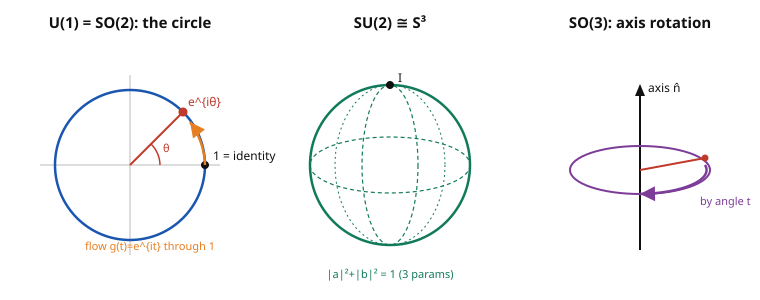

# Group & Representation Theory · Lesson 4.1: From finite to continuous — Lie groups

> ⏱ ~15 min · Module 4: Lie groups and Lie algebras · Builds on: [3.5 Degeneracy and symmetry breaking](03-05-degeneracy-symmetry-breaking.md) · Unlocks: [4.2 Lie algebras and the exponential map](04-02-lie-algebras-exponential-map.md)

## Why this matters

Everything in Modules 1–3 lived on a **finite** group: you summed over $|G|$ elements, averaged to build invariant inner products (Maschke), and read decompositions off a finite character table. But the symmetries that run physics aren't finite. Rotating a molecule by *any* angle, changing the phase of a wavefunction by *any* amount, boosting to *any* velocity — these form a **continuum** of symmetry operations. You can't list them; you can only differentiate through them.

That single word, *differentiate*, is the whole shift. A continuous symmetry group is a **manifold** as well as a group, so calculus enters the subject. The payoff is enormous: the group $SU(2)$ you'll meet here becomes the angular momentum and spin of `quantum-mechanics`, and $U(1), SU(2), SU(3)$ are literally the gauge groups of the Standard Model in `qft`. This lesson is the bridge from finite to continuous.

## The idea

Think about the group of rotations of the plane. Each element is a rotation by some angle $\theta$, and $\theta$ ranges over a *circle* — turn all the way around and you're back where you started. So the group *is* a circle: a smooth, one-dimensional curved space where the "points" happen to be group elements. Nudge $\theta$ a little and you get a nearby rotation; the group multiplication (add the angles) is a smooth operation.

That's the essence of a **Lie group**: a group that is simultaneously a smooth space, glued together so that multiplying and inverting are smooth. Because it's smooth, you can sit at the identity element and ask "which directions can I move?" — and those tangent directions turn out to encode almost everything about the group. That's Module 4's arc: the curved group linearizes at the identity into a flat vector space (the **Lie algebra**, 4.2), which is far easier to work with.

Two things carry over from the finite world and two things change:

- **Change:** sums over $G$ become **integrals**. The averaging trick $\frac{1}{|G|}\sum_g$ that powered Maschke and orthogonality becomes $\int_G \, d\mu(g)$ against an invariant measure (the **Haar measure**).
- **Survive:** for **compact** groups (closed and bounded — the circle, spheres of matrices), that integral is finite, so *the averaging still works*. Maschke, Schur, and character orthogonality survive verbatim: reps of $U(n), SU(n), SO(n)$ are still completely reducible and can be made unitary. Non-compact groups (like the Lorentz group) lose this — but that's a later story.

## The formal version

**Lie group.** A **Lie group** $G$ is a set that is both a group and a smooth manifold, such that multiplication $G\times G \to G$, $(g,h)\mapsto gh$, and inversion $g \mapsto g^{-1}$ are smooth maps.

*In words:* a group whose elements form a smooth continuum you can do calculus on, with the group operations respecting that smoothness.

**Matrix Lie groups.** In practice every group we need is a closed subgroup of the invertible matrices, carved out by a smooth condition. Let $M^\dagger$ denote the conjugate transpose (adjoint) and $M^T$ the transpose.

| Group | Elements | Defining condition | Meaning |
|---|---|---|---|
| $GL_n(\mathbb{C})$ | $n\times n$ complex | $\det M \neq 0$ | all invertible maps |
| $U(n)$ | $n\times n$ complex | $M^\dagger M = I$ | preserve complex inner product |
| $SU(n)$ | $n\times n$ complex | $M^\dagger M = I,\ \det M = 1$ | unitary, unit determinant |
| $O(n)$ | $n\times n$ real | $M^T M = I$ | preserve real lengths/angles |
| $SO(n)$ | $n\times n$ real | $M^T M = I,\ \det M = 1$ | rotations (no reflections) |

*In words:* $U$ preserves a complex inner product (so it preserves probabilities in QM), $O$ preserves real geometry, and the $S$ ("special") slices off $\det = 1$ to keep only orientation-preserving elements — the pure rotations.

**One-parameter subgroups.** A **one-parameter subgroup** is a smooth map $g:\mathbb{R}\to G$ with
$$g(s+t) = g(s)\,g(t), \qquad g(0) = I.$$
*In words:* a continuous homomorphism from the real line into the group — a "flow" that starts at the identity and composes by adding its parameter. Rotating about a fixed axis by a growing angle $t$ is the picture to hold. These curves are the threads that weave the whole group out of the identity, and their velocities at $t=0$ are exactly the Lie algebra of 4.2.

**Compactness and complete reducibility (stated).** If $G$ is a compact Lie group, there is a finite, translation-invariant **Haar measure** $\mu$ with $\int_G d\mu = 1$. Replacing $\frac{1}{|G|}\sum_{g\in G}$ by $\int_G d\mu(g)$, the Module 1–2 proofs go through unchanged:

> **Every finite-dimensional representation of a compact group is unitarizable and completely reducible into irreducibles.** (Maschke + Schur, integrated.)

The baby case is $U(1)$: its irreducibles are the Fourier modes $e^{in\theta}$, and decomposing a rep is exactly writing a periodic function as a Fourier series — orthogonality of characters *is* orthogonality of $\{e^{in\theta}\}$.

## Picture

Three of the groups above, drawn as the spaces they are. $U(1)$ is a circle and a one-parameter subgroup is a point sliding around it starting from $1$. $SU(2)$ is (literally, as Example 1 shows) the 3-sphere $S^3$. $SO(3)$ acts by spinning space about an axis $\hat n$ through an angle $t$ — itself a one-parameter subgroup.

## Worked examples

**Example 1 — $SU(2)$ is the 3-sphere $S^3$.**
Take a general $2\times 2$ complex matrix $M=\begin{pmatrix} a & b \\ c & d\end{pmatrix}$ and impose $M \in SU(2)$: $M^\dagger M = I$ and $\det M = 1$.

Unitarity means $M^\dagger = M^{-1}$. For a $2\times2$ matrix with $\det M = 1$, the inverse has the clean form
$$M^{-1} = \begin{pmatrix} d & -b \\ -c & a\end{pmatrix}.$$
Meanwhile
$$M^\dagger = \begin{pmatrix} \bar a & \bar c \\ \bar b & \bar d\end{pmatrix}.$$
Setting $M^\dagger = M^{-1}$ entry by entry gives $\bar a = d$ and $\bar c = -b$, i.e. $d = \bar a$ and $c = -\bar b$. So every $SU(2)$ element is
$$M = \begin{pmatrix} a & b \\ -\bar b & \bar a\end{pmatrix}, \qquad \det M = |a|^2 + |b|^2 = 1.$$
Write $a = x_0 + i x_1$ and $b = x_2 + i x_3$ with $x_i\in\mathbb{R}$. Then $|a|^2 + |b|^2 = x_0^2 + x_1^2 + x_2^2 + x_3^2 = 1$ — the equation of the **unit 3-sphere** $S^3 \subset \mathbb{R}^4$. Hence $SU(2)$ *is* $S^3$: a compact, connected, **3-real-parameter** group.

**Example 2 — one-parameter subgroups of $SO(2)\cong U(1)$, and the generator.**
The rotations of the plane are
$$g(t) = \begin{pmatrix} \cos t & -\sin t \\ \sin t & \phantom{-}\cos t\end{pmatrix}, \qquad \text{equivalently } U(1):\ g(t) = e^{it}.$$
Check the homomorphism property using the angle-addition formulas (or, in the $U(1)$ form, the law of exponents):
$$g(s)\,g(t) = \begin{pmatrix} \cos s & -\sin s \\ \sin s & \cos s\end{pmatrix}\begin{pmatrix} \cos t & -\sin t \\ \sin t & \cos t\end{pmatrix} = \begin{pmatrix} \cos(s+t) & -\sin(s+t) \\ \sin(s+t) & \cos(s+t)\end{pmatrix} = g(s+t).\ \checkmark$$
And $g(0) = I$. Now differentiate at the identity — this extracts the **generator**:
$$\left.\frac{d}{dt}\right|_{t=0} g(t) = \begin{pmatrix} -\sin t & -\cos t \\ \phantom{-}\cos t & -\sin t\end{pmatrix}\Bigg|_{t=0} = \begin{pmatrix} 0 & -1 \\ 1 & \phantom{-}0\end{pmatrix} =: J.$$
This antisymmetric $J$ is the tangent vector to the group at the identity, and $g(t) = e^{tJ}$. That last equation — group element = exponential of a generator — is the entire content of Lesson 4.2. In the $U(1)$ form the generator is just $i$: $\frac{d}{dt}e^{it}\big|_0 = i$, and $e^{it} = \exp(t\cdot i)$.

## Watch out

- **"Continuous means non-abelian."** No — $U(1)$ and $SO(2)$ are continuous *and* abelian (adding angles commutes). What breaks commutativity is **dimension $\geq 2$ of rotation axes**: $SO(3)$ is non-abelian because rotations about different axes don't commute (rotate a book about two perpendicular axes in each order — you get different results). $SU(2)$ inherits that non-commutativity.
- **Counting dimensions.** The manifold dimension is the number of *independent real parameters*, found by counting the constraints. $SU(2)$: $3$. $SO(3)$: $3$ (Euler angles, or axis-plus-angle). $SU(3)$: $8$ (its generators are the eight Gell-Mann matrices — the eight gluons of QCD). General rule: $\dim SU(n) = n^2 - 1$, $\dim SO(n) = \binom{n}{2}$, $\dim U(n) = n^2$.
- **Compact vs non-compact matters for reps.** Complete reducibility is a *compactness* theorem, not a Lie-group theorem. $U(n), SU(n), SO(n)$ are compact (closed unit-length conditions bound them), so their reps behave like finite-group reps. The Lorentz group is non-compact and has *no* finite-dimensional unitary reps — a fact with deep physical consequences you'll hit in `qft`.
- **$U(1)$ vs $\mathbb{R}$.** The map $t\mapsto e^{it}$ wraps the line onto the circle; because $e^{i(\theta+2\pi)} = e^{i\theta}$, the circle is *compact* while the line is not. That compactness is exactly why $U(1)$'s irreducibles are labelled by **integers** $n$ (Problem 🔴), not by a continuous parameter.

## One-liner

> A Lie group is symmetry you can differentiate — a group that is also a smooth manifold; for the compact ones ($U(n), SU(n), SO(n)$) sums become integrals but Maschke and Schur survive, so the whole finite theory carries over.

## Problems

**P1 (🟢) — membership and dimension.** For each matrix, decide which of $U(n)$, $SU(n)$, $SO(n)$ it belongs to; then state the dimension (number of free real parameters) of the named group.
(a) $A = \begin{pmatrix} 0 & -1 \\ 1 & 0\end{pmatrix}$ — is it in $SO(2)$? Dimension of $SO(2)$?
(b) $B = \begin{pmatrix} e^{i\phi} & 0 \\ 0 & e^{-i\phi}\end{pmatrix}$ — is it in $SU(2)$? Dimension of $SU(2)$?
(c) $C = \begin{pmatrix} 1 & 0 \\ 0 & i\end{pmatrix}$ — is it in $U(2)$? In $SU(2)$? Dimension of $U(2)$?

**P2 (🟡) — $SU(2)\cong S^3$.** Using the parametrization $M = \begin{pmatrix} a & b \\ -\bar b & \bar a\end{pmatrix}$ with $|a|^2+|b|^2 = 1$, show explicitly that (i) any such $M$ really is unitary with $\det = 1$, and (ii) the map $M \mapsto (a,b)$ is a bijection onto the unit sphere $\{(a,b)\in\mathbb{C}^2 : |a|^2 + |b|^2 = 1\} = S^3$. Conclude $\dim_{\mathbb{R}} SU(2) = 3$.

**P3 (🔴) — the irreducibles of $U(1)$ are the Fourier modes.** Show that every continuous (one-dimensional, hence irreducible — see below) representation $\rho: U(1)\to \mathbb{C}^\times$ has the form
$$\rho\big(e^{i\theta}\big) = e^{in\theta}, \qquad n\in\mathbb{Z},$$
and explain why $n$ must be an *integer*. This is the continuous analogue of the fact that $\mathbb{Z}/m$'s irreducible characters are $k\mapsto e^{2\pi i j k/m}$: the compact abelian group's irreducibles are its "frequencies."

Solutions

**P1.**
(a) $A^T A = \begin{pmatrix} 0 & 1 \\ -1 & 0\end{pmatrix}\begin{pmatrix} 0 & -1 \\ 1 & 0\end{pmatrix} = \begin{pmatrix} 1 & 0 \\ 0 & 1\end{pmatrix} = I$, and $\det A = 0\cdot 0 - (-1)(1) = 1$. So $A\in SO(2)$ (it's rotation by $90^\circ$). $\dim SO(2) = \binom{2}{2} = 1$ (one angle).

(b) $B^\dagger B = \begin{pmatrix} e^{-i\phi} & 0 \\ 0 & e^{i\phi}\end{pmatrix}\begin{pmatrix} e^{i\phi} & 0 \\ 0 & e^{-i\phi}\end{pmatrix} = I$, so $B$ is unitary; $\det B = e^{i\phi}e^{-i\phi} = 1$. Hence $B\in SU(2)$. $\dim SU(2) = 2^2 - 1 = 3$.

(c) $C^\dagger C = \begin{pmatrix} 1 & 0 \\ 0 & -i\end{pmatrix}\begin{pmatrix} 1 & 0 \\ 0 & i\end{pmatrix} = \begin{pmatrix}1 & 0 \\ 0 & 1\end{pmatrix} = I$, so $C\in U(2)$. But $\det C = 1\cdot i = i \neq 1$, so $C\notin SU(2)$. $\dim U(2) = 2^2 = 4$ (equivalently $\dim SU(2) + \dim U(1) = 3 + 1$).

**P2.**
(i) With $M = \begin{pmatrix} a & b \\ -\bar b & \bar a\end{pmatrix}$,
$$M^\dagger M = \begin{pmatrix} \bar a & -b \\ \bar b & a\end{pmatrix}\begin{pmatrix} a & b \\ -\bar b & \bar a\end{pmatrix} = \begin{pmatrix} |a|^2 + |b|^2 & \bar a b - b\bar a \\ \bar b a - a\bar b & |b|^2 + |a|^2\end{pmatrix} = \begin{pmatrix} 1 & 0 \\ 0 & 1\end{pmatrix},$$
using $|a|^2+|b|^2 = 1$ and that the off-diagonal terms cancel ($\bar a b - b \bar a = 0$). And $\det M = a\bar a - b(-\bar b) = |a|^2 + |b|^2 = 1$. So $M\in SU(2)$. ✓

(ii) The map $M\mapsto (a,b)$ is manifestly injective (the four entries are determined by $a,b$) and its image is exactly the pairs with $|a|^2+|b|^2=1$. Conversely every such $(a,b)$ produces a valid $M\in SU(2)$ by part (i) and Example 1 (which showed *every* $SU(2)$ element has this form), so the map is onto $S^3$. Writing $a = x_0 + ix_1$, $b = x_2 + ix_3$, the constraint is $x_0^2+x_1^2+x_2^2+x_3^2 = 1$: the unit sphere in $\mathbb{R}^4$, a 3-dimensional surface. Hence $\dim_\mathbb{R} SU(2) = 3$. ✓

**P3.** A one-dimensional representation is a continuous homomorphism $\rho: U(1)\to \mathbb{C}^\times$ (into the nonzero complex numbers, since $GL_1(\mathbb{C}) = \mathbb{C}^\times$; one-dimensional reps are automatically irreducible, as there's no proper subspace). Compose with the covering $\theta \mapsto e^{i\theta}$ and define $f(\theta) = \rho(e^{i\theta})$. Then $f:\mathbb{R}\to\mathbb{C}^\times$ is continuous with
$$f(\theta + \varphi) = \rho(e^{i(\theta+\varphi)}) = \rho(e^{i\theta})\rho(e^{i\varphi}) = f(\theta)f(\varphi), \qquad f(0) = 1.$$
A continuous solution of $f(\theta+\varphi) = f(\theta)f(\varphi)$ is an exponential: $f(\theta) = e^{\lambda\theta}$ for some constant $\lambda\in\mathbb{C}$ (differentiate the functional equation in $\varphi$ at $0$ to get $f'(\theta) = f(\theta)f'(0)$, so $\lambda = f'(0)$; alternatively invoke the classification of continuous additive-to-multiplicative homomorphisms). 

Now the key constraint: $\rho$ must be **well-defined on the circle**, and $e^{i\theta}$ is periodic with $e^{i(\theta + 2\pi)} = e^{i\theta}$. So we need $f(\theta + 2\pi) = f(\theta)$, i.e.
$$e^{\lambda(\theta + 2\pi)} = e^{\lambda\theta} \implies e^{2\pi\lambda} = 1 \implies 2\pi\lambda = 2\pi i n \implies \lambda = in, \quad n\in\mathbb{Z}.$$
Therefore $\rho(e^{i\theta}) = e^{in\theta}$ with $n\in\mathbb{Z}$. The integrality is forced entirely by **compactness** (the $2\pi$-periodicity of the circle) — on the non-compact line $\mathbb{R}$ any real (or complex) $\lambda$ would be allowed. These $\{e^{in\theta}\}_{n\in\mathbb{Z}}$ are precisely the Fourier modes, and their orthogonality $\frac{1}{2\pi}\int_0^{2\pi} e^{-im\theta}e^{in\theta}\,d\theta = \delta_{mn}$ is character orthogonality with the sum replaced by the Haar integral — the compact-group theory in its simplest incarnation. ✓

## Flashback

**From Lesson 3.2 (Clebsch–Gordan decomposition), fresh variant.** In the symmetric group $S_3$ (equivalently the symmetry group of the triangle, $D_3$), the standard 2-dimensional irrep $\rho$ has character $\chi_\rho = (2,\,0,\,-1)$ on the classes $\{e\}$, transpositions, 3-cycles (class sizes $1, 3, 2$). Decompose the tensor product $\rho\otimes\rho$ into irreducibles. ($S_3$ has irreps: trivial $\chi_1 = (1,1,1)$, sign $\chi_{\mathrm{sgn}} = (1,-1,1)$, standard $\chi_\rho = (2,0,-1)$.)

Solution

The character of a tensor product is the pointwise product of characters:
$$\chi_{\rho\otimes\rho} = \chi_\rho \cdot \chi_\rho = (2^2,\ 0^2,\ (-1)^2) = (4,\ 0,\ 1).$$
Now project onto each irreducible using the inner product $\langle \chi, \psi\rangle = \frac{1}{|G|}\sum_{\text{classes}} (\text{size})\,\chi\,\overline{\psi}$ with $|G| = 6$ and class sizes $(1,3,2)$:

- $\langle \chi_{\rho\otimes\rho}, \chi_1\rangle = \frac{1}{6}\big(1\cdot 4\cdot 1 + 3\cdot 0 \cdot 1 + 2\cdot 1\cdot 1\big) = \frac{1}{6}(4 + 0 + 2) = 1.$
- $\langle \chi_{\rho\otimes\rho}, \chi_{\mathrm{sgn}}\rangle = \frac{1}{6}\big(1\cdot 4\cdot 1 + 3\cdot 0\cdot(-1) + 2\cdot 1\cdot 1\big) = \frac{1}{6}(4 + 0 + 2) = 1.$
- $\langle \chi_{\rho\otimes\rho}, \chi_\rho\rangle = \frac{1}{6}\big(1\cdot 4\cdot 2 + 3\cdot 0\cdot 0 + 2\cdot 1\cdot(-1)\big) = \frac{1}{6}(8 + 0 - 2) = 1.$

So $\rho\otimes\rho \cong \mathbf{1}\oplus \mathrm{sgn}\oplus \rho$. Dimension check: $2\times 2 = 4 = 1 + 1 + 2$. ✓ (This is the finite-group precursor of exactly the "add two spins" tensor decomposition you'll run continuously for $SU(2)$ in Lesson 4.5.)

## Connections

- **Backward (Modules 1–2):** the invariant inner product built by averaging $\frac{1}{|G|}\sum_g$ ([1.4 Maschke](01-04-maschke-theorem.md), [2.2 orthogonality](02-02-orthogonality-relations.md)) becomes $\int_G d\mu(g)$ for compact groups — same proof, same conclusions (unitarizability, complete reducibility, Schur). $U(1)$'s integer irreps (Problem 🔴) are the continuous limit of $\mathbb{Z}/m$'s characters from [2.3](02-03-building-character-table.md).
- **Sideways (algebra):** these are the matrix groups $GL_n, U(n), SU(n), SO(n)$ that abstract-algebra treats as abstract objects — [abstract-algebra syllabus](../../abstract-algebra/syllabus.md) — now equipped with a smooth structure that lets calculus in.
- **Forward:** differentiating a one-parameter subgroup at the identity (Example 2's generator $J$) is the whole of [4.2 Lie algebras and the exponential map](04-02-lie-algebras-exponential-map.md); the near-identity structure of $SU(2)$ vs $SO(3)$ drives the double cover in [4.3](04-03-su2-so3-double-cover.md); $SU(2)$'s irreps become angular momentum in [4.4](04-04-su2-representations-angular-momentum.md) and spin thereafter.
- **Sideways (physics):** $U(1)$ is the phase/gauge symmetry of `quantum-mechanics` (global phase invariance of the wavefunction) and electromagnetism's gauge group; $SO(3)$ is the rotational symmetry behind conservation of angular momentum — see the [quantum-mechanics syllabus](../../quantum-mechanics/syllabus.md). In `qft`, $U(1)\times SU(2)\times SU(3)$ is the full Standard-Model gauge group ($SU(3)$'s $\dim = 8$ gluons, $SU(2)$'s weak isospin) — [qft syllabus](../../qft/syllabus.md).
