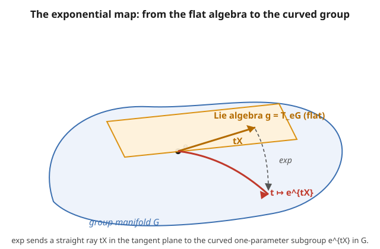

# Group & Representation Theory · Lesson 4.2: Lie algebras and the exponential map

> ⏱ ~15 min · Module 4: Lie groups and Lie algebras · Builds on: [4.1 From finite to continuous: Lie groups](04-01-lie-groups.md) · Unlocks: [4.3 $SU(2)$, $SO(3)$, and the double cover](04-03-su2-so3-double-cover.md)

## Why this matters

A Lie group like $SU(2)$ or $SO(3)$ is a *curved* object — a smooth manifold of matrices — and curved objects are hard. But every one of them has a flat shadow: the tangent space at the identity. That shadow, the **Lie algebra**, is an ordinary vector space closed under one bilinear operation (the commutator), so it's pure linear algebra. The miracle of Module 4 is that this shadow remembers almost everything: the exponential map reinflates the algebra back into the group near the identity, and — the payoff for the rest of the module — **representations of the group correspond to representations of the algebra**. Classifying reps of the continuous, infinite $SU(2)$ becomes classifying reps of a 3-dimensional vector space with a bracket. That algebra is the angular-momentum algebra of quantum mechanics. This lesson builds the dictionary.

## The idea

Stand at the identity $e$ of the group and ask: which directions can I move? A one-parameter subgroup $\gamma(t)$ is a smooth curve through $e$ that respects multiplication, $\gamma(s)\gamma(t)=\gamma(s+t)$ — the continuous analogue of "powers of one element." Its **velocity at $e$**, $X = \gamma'(0)$, is a tangent vector. Collect all such velocities and you get a vector space: the Lie algebra $\mathfrak{g} = T_eG$.

Two things make this powerful. First, the group's *defining equation* (unitary, orthogonal, unit determinant) turns, when you differentiate it at $e$, into a *linear* condition on $X$ — so the algebra is easy to write down explicitly. Second, you can go back: **exponentiate** a velocity to recover the curve, $\gamma(t) = e^{tX}$. The straight ray $t\mapsto tX$ in the flat algebra maps to the curved one-parameter subgroup in the group.

But the group is generally non-abelian, and a flat vector space can't see that on its own. The missing information is stored in one extra operation — the **commutator** $[X,Y]=XY-YX$. It measures exactly how much $e^X$ and $e^Y$ fail to commute. A vector space plus this bracket *is* the Lie algebra, and it's enough to reconstruct the group locally.

## The formal version

**The Lie algebra of a matrix group.** For a matrix group $G \subseteq GL(n)$,
$$\mathfrak{g} = \{\, X \in M_n(\mathbb{C}) : e^{tX} \in G \ \text{for all } t\in\mathbb{R} \,\},$$
where $e^{tX} = \sum_{k=0}^\infty \frac{(tX)^k}{k!}$. **In words:** $\mathfrak{g}$ is the set of matrices whose one-parameter subgroups stay inside $G$ — the legal velocities at the identity. It is a real vector space, and its dimension equals the dimension of $G$ as a manifold.

**How to find it: differentiate the defining condition.** If $G$ is cut out by an equation, plug in $g(t)=e^{tX}$, differentiate at $t=0$, and use $\frac{d}{dt}e^{tX}\big|_{0}=X$. Three that recur all module:

| Group | Condition | Differentiate → | Lie algebra |
|---|---|---|---|
| $U(n)$ | $g^\dagger g = I$ | $X^\dagger + X = 0$ | $\mathfrak{u}(n)$: anti-Hermitian |
| $SU(n)$ | also $\det g = 1$ | also $\operatorname{tr} X = 0$ | $\mathfrak{su}(n)$: anti-Hermitian, traceless |
| $SO(n)$ | $g^T g = I,\ \det g=1$ | $X^T + X = 0$ | $\mathfrak{so}(n)$: antisymmetric |

The determinant condition uses the identity $\det(e^{tX}) = e^{t\operatorname{tr}X}$, so $\det=1$ for all $t$ forces $\operatorname{tr}X = 0$. Counting free parameters gives the dimensions: $\dim\mathfrak{su}(2)=3$, $\dim\mathfrak{so}(3)=3$ (they'll turn out isomorphic in 4.3), $\dim\mathfrak{so}(n)=\tfrac{n(n-1)}{2}$.

**The exponential map** $\exp:\mathfrak{g}\to G,\ X\mapsto e^X$. It packages a velocity into an actual group element; the whole one-parameter subgroup is $t\mapsto e^{tX}$. **In words:** exp is the "flow for one unit of time along $X$." Near the identity it is a local diffeomorphism (a smooth, smoothly invertible relabeling), so a neighborhood of $e$ in $G$ is just a neighborhood of $0$ in $\mathfrak{g}$ in disguise. (Globally it can miss elements or wrap around — that wrapping is the double-cover story of 4.3.)

**The Lie bracket** $[X,Y] = XY - YX$. Two facts:

- **It closes on $\mathfrak{g}$:** if $X,Y\in\mathfrak{g}$ then $[X,Y]\in\mathfrak{g}$. (Check for $\mathfrak{su}(n)$: $[X,Y]^\dagger = [Y^\dagger,X^\dagger]=[-Y,-X]=[X,Y]\cdot(-1)$... explicitly $[X,Y]^\dagger = Y^\dagger X^\dagger - X^\dagger Y^\dagger = YX-XY=-[X,Y]$, anti-Hermitian; and $\operatorname{tr}[X,Y]=0$ always.) So the bracket is an *internal* operation — a Lie algebra is a vector space closed under it.
- **It measures non-commutativity.** The Baker–Campbell–Hausdorff formula says
$$e^{X}e^{Y} = \exp\!\Big(X + Y + \tfrac12[X,Y] + \tfrac{1}{12}\big([X,[X,Y]]+[Y,[Y,X]]\big)+\cdots\Big).$$
**In words:** to leading order the group product is just addition in the algebra, *corrected* by the bracket. If $[X,Y]=0$ then $e^Xe^Y=e^{X+Y}=e^Ye^X$ exactly — commuting velocities give a commuting (abelian) piece of the group.

**Structure constants.** Pick a basis $T_1,\dots,T_d$ of $\mathfrak{g}$. Closure means each bracket is a combination of basis elements:
$$[T_a, T_b] = \sum_c f_{abc}\, T_c.$$
The numbers $f_{abc}$ are the **structure constants** — they encode the entire local group multiplication in a finite table.

**Physics dictionary (memorize this row).** Physicists prefer *Hermitian* generators $J = iX$ (so $X=-iJ$ is the anti-Hermitian algebra element), because Hermitian operators are observables. Then $\exp$ becomes unitary evolution/rotation $U = e^{-i\theta J}$, and the bracket becomes a *commutator of observables*:
$$[J_a, J_b] = i\sum_c f'_{abc} J_c .$$
Generators $\leftrightarrow$ observables (angular momentum, momentum), $\exp$ $\leftrightarrow$ symmetry transformation, brackets $\leftrightarrow$ the canonical commutation relations $[x,p]=i\hbar$ and $[J_a,J_b]=i\hbar\,\varepsilon_{abc}J_c$. This *is* the connection to `quantum-mechanics`.

## Picture

## Worked examples

**Example 1 — derive $\mathfrak{su}(2)$ by differentiating the definition.**

$SU(2)=\{U : U^\dagger U = I,\ \det U = 1\}$. Put $U(t)=e^{tX}$ with $U(0)=I$, $U'(0)=X$.

*Unitarity.* Differentiate $U(t)^\dagger U(t) = I$ at $t=0$. Product rule with $\frac{d}{dt}U^\dagger = U'^\dagger$:
$$U'(0)^\dagger U(0) + U(0)^\dagger U'(0) = X^\dagger + X = 0 \implies X^\dagger = -X \quad (\text{anti-Hermitian}).$$

*Unit determinant.* $\det(e^{tX}) = e^{t\operatorname{tr}X}=1$ for all $t \implies \operatorname{tr}X = 0$.

So $\mathfrak{su}(2) = \{$traceless anti-Hermitian $2\times2$ matrices$\}$. Count real dimensions: anti-Hermitian $2\times2$ means the diagonal is pure imaginary ($X_{11}=ia,\ X_{22}=id$, two reals) and $X_{21}=-\overline{X_{12}}$ (one free complex $X_{12}$, two reals) — that's $\mathfrak{u}(2)$, dimension $4$. Traceless adds $a+d=0$, removing one. **$\dim\mathfrak{su}(2)=3$.** A clean basis, tied to the Pauli matrices $\sigma_1=\begin{pmatrix}0&1\\1&0\end{pmatrix},\ \sigma_2=\begin{pmatrix}0&-i\\i&0\end{pmatrix},\ \sigma_3=\begin{pmatrix}1&0\\0&-1\end{pmatrix}$ (Hermitian, traceless), is
$$T_a = -\tfrac{i}{2}\sigma_a \qquad (a=1,2,3),$$
each anti-Hermitian and traceless as required. Their brackets, from $[\sigma_a,\sigma_b]=2i\,\varepsilon_{abc}\sigma_c$:
$$[T_a,T_b] = \Big(-\tfrac{i}{2}\Big)^2[\sigma_a,\sigma_b] = -\tfrac14\,(2i\,\varepsilon_{abc}\sigma_c) = \varepsilon_{abc}\Big(-\tfrac{i}{2}\sigma_c\Big) = \varepsilon_{abc}\,T_c.$$
Structure constants $f_{abc}=\varepsilon_{abc}$ (the Levi-Civita symbol). In physics-Hermitian form $J_a = iT_a = \tfrac12\sigma_a$, this reads $[J_a,J_b]=i\varepsilon_{abc}J_c$ — the spin-$\tfrac12$ angular-momentum algebra, waiting for 4.4.

**Example 2 — exponentiate a generator, and check the bracket lands back in $\mathfrak{su}(2)$.**

Take $X = \theta\,T_3 = -\tfrac{i\theta}{2}\sigma_3 = \begin{pmatrix} -i\theta/2 & 0 \\ 0 & i\theta/2\end{pmatrix}$ (diagonal, so exp is entrywise on the diagonal):
$$e^{X} = \begin{pmatrix} e^{-i\theta/2} & 0 \\ 0 & e^{i\theta/2}\end{pmatrix}.$$
As $\theta$ runs from $0$, this traces a one-parameter subgroup of $SU(2)$ (unitary, determinant $e^{-i\theta/2}e^{i\theta/2}=1$). Note it returns to $I$ only at $\theta = 4\pi$, not $2\pi$ — the first whisper of the double cover.

For a non-diagonal direction use $\sigma_1^2 = I$, which gives an Euler-type series: with $X=\theta T_1 = -\tfrac{i\theta}{2}\sigma_1$,
$$e^{X} = \cos\tfrac{\theta}{2}\,I - i\sin\tfrac{\theta}{2}\,\sigma_1 = \begin{pmatrix}\cos\tfrac{\theta}{2} & -i\sin\tfrac{\theta}{2}\\ -i\sin\tfrac{\theta}{2} & \cos\tfrac{\theta}{2}\end{pmatrix}.$$

*Closure check.* Is $[T_1,T_2]$ back in $\mathfrak{su}(2)$? From Example 1, $[T_1,T_2]=\varepsilon_{12c}T_c = T_3 = -\tfrac{i}{2}\sigma_3$, which is traceless and anti-Hermitian — yes, an element of $\mathfrak{su}(2)$. The bracket never leaves the algebra.

## Watch out

- **$e^X e^Y \neq e^{X+Y}$ in general.** That shortcut holds *only* when $[X,Y]=0$. The whole reason a Lie algebra needs a bracket (and isn't just a vector space) is that the group is non-abelian; BCH is the bookkeeping.
- **Physics vs. math sign/factor conventions.** Mathematicians use anti-Hermitian $X$ and $e^{X}$; physicists use Hermitian $J=iX$ and $e^{-i\theta J}$. Same algebra, factors of $i$ shuffled. When brackets look like $[J_a,J_b]=i\varepsilon_{abc}J_c$ (with an $i$) you're in the Hermitian convention; without the $i$, as $[T_a,T_b]=\varepsilon_{abc}T_c$, you're in the anti-Hermitian one. Track which you're in.
- **$\exp$ is only *locally* onto.** It hits a neighborhood of $e$ perfectly, but can fail to reach elements far away or in another connected component (nothing in $\mathfrak{so}(3)$ exponentiates to a reflection — those have $\det=-1$). The algebra sees the identity component, not the discrete topology.
- **The bracket, not the product, is the invariant.** Two different groups can share a Lie algebra ($SU(2)$ and $SO(3)$ do). The algebra determines the group only near $e$.

## One-liner

> Differentiate the group's defining equation at the identity to get a flat vector space $\mathfrak{g}$; the commutator $[X,Y]$ stores the group's non-commutativity, and $\exp$ inflates $\mathfrak{g}$ back into $G$ — turning continuous symmetry into linear algebra.

## Problems

**P1 (🟢)** The special orthogonal group $SO(n)$ consists of real matrices with $R^T R = I$ and $\det R = 1$. By setting $R(t)=e^{tX}$ and differentiating both conditions at $t=0$, find $\mathfrak{so}(n)$ and its dimension. Evaluate the dimension for $n=4$.

**P2 (🟡)** Let $X = \begin{pmatrix} 0 & -1 \\ 1 & 0\end{pmatrix}$. Compute $e^{tX}$ as an explicit $2\times2$ matrix (hint: find $X^2$), and identify the one-parameter subgroup it generates and the group it lies in.

**P3 (🔴)** The generators of $\mathfrak{so}(3)$ (rotations in $\mathbb{R}^3$) are the real antisymmetric matrices
$$L_1=\begin{pmatrix}0&0&0\\0&0&-1\\0&1&0\end{pmatrix},\quad L_2=\begin{pmatrix}0&0&1\\0&0&0\\-1&0&0\end{pmatrix},\quad L_3=\begin{pmatrix}0&-1&0\\1&0&0\\0&0&0\end{pmatrix}.$$
Compute the bracket $[L_1,L_2]$ explicitly, confirm it lands back in $\mathfrak{so}(3)$ (i.e. the bracket closes), and read off the structure constants by verifying $[L_a,L_b]=\sum_c\varepsilon_{abc}L_c$. What does the fact that $\mathfrak{so}(3)$ and $\mathfrak{su}(2)$ have the *same* structure constants suggest?

Solutions

**P1.** With $R(t)=e^{tX}$, $R(0)=I$, $R'(0)=X$:

*Orthogonality.* Differentiate $R(t)^T R(t)=I$ at $t=0$: $X^T + X = 0$, so $X^T = -X$ — **antisymmetric**.

*Determinant.* $\det(e^{tX})=e^{t\operatorname{tr}X}=1 \Rightarrow \operatorname{tr}X=0$; but an antisymmetric matrix already has zero diagonal, so $\operatorname{tr}X=0$ automatically. The $\det=1$ condition adds nothing new to the algebra (it only selects the identity-connected component of the group).

So $\mathfrak{so}(n)=\{$real antisymmetric $n\times n\}$. Dimension = number of independent entries above the diagonal = $\dfrac{n(n-1)}{2}$. For $n=4$: $\dfrac{4\cdot 3}{2} = \mathbf{6}$.

**P2.** $X^2 = \begin{pmatrix}0&-1\\1&0\end{pmatrix}\begin{pmatrix}0&-1\\1&0\end{pmatrix} = \begin{pmatrix}-1&0\\0&-1\end{pmatrix} = -I$. So $X$ behaves like the imaginary unit: $X^2=-I,\ X^3=-X,\ X^4=I,\dots$ Split the exponential series into even and odd powers:
$$e^{tX} = \sum_{k}\frac{t^k X^k}{k!} = \Big(1-\tfrac{t^2}{2!}+\cdots\Big)I + \Big(t - \tfrac{t^3}{3!}+\cdots\Big)X = \cos t\,I + \sin t\,X = \begin{pmatrix}\cos t & -\sin t \\ \sin t & \cos t\end{pmatrix}.$$
This is the **one-parameter subgroup of planar rotations** by angle $t$ — it lies in $SO(2)$. ($X$ is antisymmetric, so $X\in\mathfrak{so}(2)$, exactly as P1 predicts; here $\dim\mathfrak{so}(2)=1$, and this single generator sweeps out the whole rotation circle.)

**P3.** Compute $L_1 L_2$ and $L_2 L_1$.

$$L_1 L_2 = \begin{pmatrix}0&0&0\\0&0&-1\\0&1&0\end{pmatrix}\begin{pmatrix}0&0&1\\0&0&0\\-1&0&0\end{pmatrix} = \begin{pmatrix}0&0&0\\1&0&0\\0&0&0\end{pmatrix},\qquad L_2 L_1 = \begin{pmatrix}0&0&1\\0&0&0\\-1&0&0\end{pmatrix}\begin{pmatrix}0&0&0\\0&0&-1\\0&1&0\end{pmatrix} = \begin{pmatrix}0&1&0\\0&0&0\\0&0&0\end{pmatrix}.$$

Subtract:
$$[L_1,L_2] = L_1L_2 - L_2L_1 = \begin{pmatrix}0&-1&0\\1&0&0\\0&0&0\end{pmatrix} = L_3.$$

The result $L_3$ is real and antisymmetric, so it lies in $\mathfrak{so}(3)$ — **the bracket closes.** Comparing with $[L_a,L_b]=\sum_c\varepsilon_{abc}L_c$: for $(a,b)=(1,2)$ the only nonzero $\varepsilon_{12c}$ is $\varepsilon_{123}=1$, giving $[L_1,L_2]=L_3$. ✓ By the cyclic symmetry of these matrices the same computation gives $[L_2,L_3]=L_1$ and $[L_3,L_1]=L_2$, i.e. $f_{abc}=\varepsilon_{abc}$.

These are *identical* to the $\mathfrak{su}(2)$ structure constants from Example 1 ($[T_a,T_b]=\varepsilon_{abc}T_c$). Since a Lie algebra is determined by its structure constants, $\mathfrak{so}(3)\cong\mathfrak{su}(2)$ as Lie algebras — the two groups look the same near the identity even though they differ globally. That local isomorphism, and the global two-to-one mismatch behind it, is exactly the subject of Lesson 4.3.

## Flashback

**From Lesson 4.1 (one-parameter subgroups):** Consider the family $A(t)=\begin{pmatrix}1 & t\\ 0 & 1\end{pmatrix}$ of $2\times2$ real matrices. Verify it is a one-parameter subgroup, then find the generator $X\in\mathfrak{gl}(2,\mathbb{R})$ for which $A(t)=e^{tX}$.

Solution

*Subgroup property:* $A(s)A(t)=\begin{pmatrix}1&s\\0&1\end{pmatrix}\begin{pmatrix}1&t\\0&1\end{pmatrix}=\begin{pmatrix}1&s+t\\0&1\end{pmatrix}=A(s+t)$, and $A(0)=I$ — so $t\mapsto A(t)$ is a homomorphism from $(\mathbb{R},+)$ into the group, i.e. a one-parameter subgroup.

*Generator:* $X = A'(0) = \dfrac{d}{dt}\begin{pmatrix}1&t\\0&1\end{pmatrix}\Big|_{t=0} = \begin{pmatrix}0&1\\0&0\end{pmatrix}$.

*Check by exponentiating:* $X^2 = \begin{pmatrix}0&1\\0&0\end{pmatrix}^2 = 0$ (nilpotent), so the series truncates: $e^{tX} = I + tX = \begin{pmatrix}1&t\\0&1\end{pmatrix} = A(t)$. ✓ This is a "shear" subgroup; its generator is a single nilpotent Jordan block.

## Connections

- **Backward:** [4.1](04-01-lie-groups.md)'s one-parameter subgroups are precisely the images $t\mapsto e^{tX}$ of algebra elements under $\exp$; this lesson names their velocities and organizes them into a vector space with a bracket.
- **Forward:** [4.3](04-03-su2-so3-double-cover.md) upgrades P3's $\mathfrak{so}(3)\cong\mathfrak{su}(2)$ to the group level and finds the two-to-one $\exp$ wrapping (the "$4\pi$, not $2\pi$" of Example 2). [4.4](04-04-su2-representations-angular-momentum.md) classifies reps of $\mathfrak{su}(2)$ purely from the brackets — the ladder operators $J_\pm$ built from these generators are the angular-momentum spectrum. [4.6](04-06-roots-weights-su3.md) generalizes "diagonalize the bracket" into Cartan subalgebras and root systems.
- **Sideways — `quantum-mechanics`** (see [its syllabus](../../quantum-mechanics/syllabus.md)): the physics dictionary here is that course's foundation. Hermitian generators are observables, $\exp$ is unitary time/rotation evolution, and the brackets are the canonical commutators $[x,p]=i\hbar$ and $[J_a,J_b]=i\hbar\,\varepsilon_{abc}J_c$. Spin is a representation of the $\mathfrak{su}(2)$ built in Example 1.
- **Sideways — `analytical-mechanics`** (see [its syllabus](../../analytical-mechanics/syllabus.md)): the Poisson bracket of classical mechanics is a Lie bracket, and Noether's symmetry generators (momentum, angular momentum) close under it into the same $\mathfrak{so}(3)$ you computed in P3 — the classical shadow of the quantum commutation relations.
