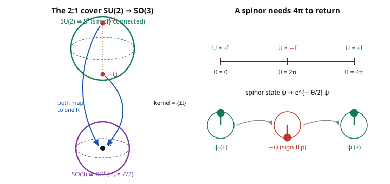

# Group & Representation Theory · Lesson 4.3: $SU(2)$, $SO(3)$, and the double cover

> ⏱ ~15 min · Module 4: Lie groups and Lie algebras · Builds on: [4.2 Lie algebras and the exponential map](04-02-lie-algebras-exponential-map.md) · Unlocks: [4.4 Representations of $\mathfrak{su}(2)$ — angular momentum](04-04-su2-representations-angular-momentum.md)

## Why this matters

Turn a coffee cup around once — a full $360^\circ$ — and it's back where it started. Every classical object obeys that. But an electron does not: rotate its quantum state by $2\pi$ and it comes back **negated**, $\psi \to -\psi$. Only after $4\pi$ — two full turns — is it truly home. This isn't mysticism or a lab artifact; it's a theorem about two groups. $SO(3)$, the rotations of space, and $SU(2)$, the group of Lesson 4.1, are *locally identical* but *globally different*: $SU(2)$ wraps around $SO(3)$ **twice**. That single fact is the whole origin of spin-$\tfrac12$, of the Pauli exclusion principle's fermions, and of why the Standard Model's building blocks are spinors. This lesson is where symmetry stops being bookkeeping and starts predicting the universe.

## The idea

Two spaces can look the same up close yet be knit together differently in the large — a circle and a line are indistinguishable through a microscope, but one closes up and one doesn't. That gap between *local* and *global* is exactly the $SU(2)$–$SO(3)$ story.

**Locally the same.** Near the identity, a Lie group is its Lie algebra (Lesson 4.2). We'll see $\mathfrak{su}(2)$ and $\mathfrak{so}(3)$ are *the same 3-dimensional bracket* — the angular-momentum algebra. So infinitesimal rotations in $SU(2)$ and in $SO(3)$ are indistinguishable.

**Globally different.** But there's a 2-to-1 map $SU(2) \to SO(3)$: every rotation $R$ has **exactly two** $SU(2)$ elements sitting above it, $U$ and $-U$. Walk a full $2\pi$ loop of rotations downstairs in $SO(3)$ and you *don't* return to your starting matrix upstairs — you slide from $I$ to $-I$. Only a $4\pi$ loop brings you back to $I$. A spinor is something that lives upstairs and feels that difference: it carries the sign. That is the spinor's $-1$, and it is not optional — it's forced by the shape of the two groups.

## The formal version

**The Pauli matrices.** The three Hermitian, traceless $2\times2$ matrices

$$\sigma_x = \begin{pmatrix}0&1\\1&0\end{pmatrix},\quad \sigma_y = \begin{pmatrix}0&-i\\i&0\end{pmatrix},\quad \sigma_z = \begin{pmatrix}1&0\\0&-1\end{pmatrix}.$$

*In words:* three "measurement axes" for a two-level system. Key algebra (verify by hand): each squares to the identity, $\sigma_a^2 = I$; they anticommute; and

$$\sigma_a \sigma_b = \delta_{ab} I + i\,\varepsilon_{abc}\,\sigma_c \quad\Longrightarrow\quad [\sigma_a,\sigma_b] = 2i\,\varepsilon_{abc}\,\sigma_c,$$

where $\varepsilon_{abc}$ is the totally antisymmetric symbol ($\varepsilon_{xyz}=+1$) and repeated indices sum.

**The $\mathfrak{su}(2)$ generators.** Set $J_a = \tfrac12\sigma_a$. Then

$$[J_a, J_b] = i\,\varepsilon_{abc}\, J_c.$$

*In words:* this is **the angular-momentum algebra** — the same commutators $[J_x,J_y]=iJ_z$ you meet in quantum mechanics. (The $J_a$ are Hermitian, the physicists' choice. The mathematician's $\mathfrak{su}(2)$ — genuinely anti-Hermitian, traceless — uses $T_a = -\tfrac{i}{2}\sigma_a$; these are the tangent vectors at $I$ from Lesson 4.2, and $J_a = iT_a$.)

**$\mathfrak{su}(2) \cong \mathfrak{so}(3)$.** The rotation generators $L_a$ (real antisymmetric $3\times3$ matrices, $(L_a)_{jk} = -\varepsilon_{ajk}$) satisfy

$$[L_a, L_b] = \varepsilon_{abc}\,L_c,$$

the *same* structure constants as the $T_a$: $[T_a,T_b] = \varepsilon_{abc}T_c$. The linear map $T_a \mapsto L_a$ is therefore a Lie-algebra isomorphism. *In words:* the two algebras are literally the same object in two costumes — both are "3D space with the cross product as bracket."

**The double cover $SU(2) \to SO(3)$.** Package a real 3-vector $\mathbf v = (x,y,z)$ as a matrix $\mathbf v\cdot\boldsymbol\sigma = x\sigma_x + y\sigma_y + z\sigma_z$. For $U \in SU(2)$, define $R(U)$ by

$$\mathbf v\cdot\boldsymbol\sigma \;\longmapsto\; U(\mathbf v\cdot\boldsymbol\sigma)U^\dagger = \mathbf v'\cdot\boldsymbol\sigma.$$

The output is again Hermitian and traceless, so it *is* some real vector $\mathbf v'$; the map $\mathbf v \mapsto \mathbf v'$ is a rotation $R(U) \in SO(3)$ (Problem 2). Then:

- $U \mapsto R(U)$ is a group homomorphism ($R(U_1U_2)=R(U_1)R(U_2)$, since conjugation composes), and it is **surjective**.
- Its **kernel is $\{+I, -I\}$**: $U$ commutes with every $\sigma_a$ iff $U = \pm I$ (Worked Example 2).

*In words:* the map is 2-to-1 — $U$ and $-U$ give the very same rotation. $SU(2)$ is the **double cover** of $SO(3)$, written $SO(3) \cong SU(2)/\{\pm I\}$.

**The spinor sign.** Follow a rotation by angle $\theta$ about a fixed axis: $U(\theta) = e^{-i\theta(\hat{\mathbf n}\cdot\boldsymbol\sigma)/2}$. At $\theta = 2\pi$ the rotation $R$ is the identity, but $U(2\pi) = -I$, **not** $+I$. A vector in the 2-dimensional space $U$ acts on — a **spinor** — is thus sent to $-\psi$ by a $2\pi$ rotation, and only $\theta = 4\pi$ restores $U = +I$.

**Topology footnote.** $SU(2)\cong S^3$ (Lesson 4.1) is simply connected; $SO(3)\cong \mathbb{RP}^3$ has $\pi_1 = \mathbb Z/2$ — there's a rotation loop you can't shrink, and the double cover $S^3 \to \mathbb{RP}^3$ *is* the map $U\mapsto R(U)$. The belt/plate trick is $\pi_1(SO(3))=\mathbb Z/2$ made visible: a $2\pi$ twist can't be undone without moving the ends, a $4\pi$ twist can.

## Picture

## Worked examples

**Example 1 (rotation about $z$, and the spinor sign).** Take $U(\theta) = e^{-i\theta\sigma_z/2}$. Since $\sigma_z = \mathrm{diag}(1,-1)$ is diagonal, exponentiate entrywise:

$$U(\theta) = \begin{pmatrix} e^{-i\theta/2} & 0 \\ 0 & e^{i\theta/2}\end{pmatrix}.$$

Conjugate $\mathbf v\cdot\boldsymbol\sigma = \begin{pmatrix} z & x-iy \\ x+iy & -z\end{pmatrix}$ by $U$ (with $U^\dagger = \mathrm{diag}(e^{i\theta/2}, e^{-i\theta/2})$). The diagonal $z$ entries are untouched; the off-diagonal picks up phases:

$$(x-iy) \mapsto e^{-i\theta}(x-iy) = \big(x\cos\theta - y\sin\theta\big) - i\big(x\sin\theta + y\cos\theta\big).$$

Reading off $\mathbf v'$: $\;x' = x\cos\theta - y\sin\theta,\; y' = x\sin\theta + y\cos\theta,\; z' = z$ — a **rotation by $\theta$ about the $z$-axis**. Exactly as promised.

Now the sign. At $\theta = 2\pi$: $U = \mathrm{diag}(e^{-i\pi}, e^{i\pi}) = \mathrm{diag}(-1,-1) = -I$, while $R(2\pi) = I$. At $\theta = 4\pi$: $U = \mathrm{diag}(e^{-2\pi i}, e^{2\pi i}) = I$. So the rotation returns after $2\pi$ but the $SU(2)$ element — and any spinor it acts on — needs $4\pi$.

**Example 2 (the kernel is $\{\pm I\}$, and matching brackets).** $U$ lies in the kernel iff $U(\mathbf v\cdot\boldsymbol\sigma)U^\dagger = \mathbf v\cdot\boldsymbol\sigma$ for all $\mathbf v$, i.e. $U$ commutes with all three $\sigma_a$. A matrix commuting with every Pauli matrix commutes with the whole algebra they generate ($M_2(\mathbb C)$), so by Schur's lemma (Lesson [1.5](01-05-schur-lemma.md)) it's a scalar $U = \lambda I$. Membership in $SU(2)$ forces $\det U = \lambda^2 = 1$, so $\lambda = \pm 1$: the kernel is exactly $\{+I, -I\}$. Two preimages per rotation — the double cover, confirmed.

For the algebra isomorphism, match structure constants on a basis. With $T_a = -\tfrac{i}{2}\sigma_a$:

$$[T_a,T_b] = \left(-\tfrac{i}{2}\right)^2[\sigma_a,\sigma_b] = -\tfrac14\big(2i\varepsilon_{abc}\sigma_c\big) = -\tfrac{i}{2}\varepsilon_{abc}\sigma_c = \varepsilon_{abc}\,T_c.$$

The $\mathfrak{so}(3)$ generators obey $[L_a,L_b]=\varepsilon_{abc}L_c$ with the *same* constants, so $T_a \mapsto L_a$ preserves every bracket: $\mathfrak{su}(2)\cong\mathfrak{so}(3)$.

## Watch out

- **Local sameness is not global sameness.** $\mathfrak{su}(2) = \mathfrak{so}(3)$ as Lie algebras, yet $SU(2) \neq SO(3)$ as groups — the algebra sees only the neighborhood of the identity and is blind to the 2-to-1 wrapping. Two different groups can share one algebra; this pair is the standard example.
- **The $\theta/2$ is the whole point.** The half-angle in $e^{-i\theta\sigma_a/2}$ is *why* a $2\pi$ spatial rotation is a $\pi$ phase-turn on the spinor, landing at $-1$. Drop the $\tfrac12$ and you lose spin.
- **The 2-dim rep is not a rep of $SO(3)$.** It's a genuine representation of $SU(2)$, but "double-valued" over $SO(3)$: a rotation $R$ has two matrices $\pm U$ above it, so there's no consistent single-valued rule $R \mapsto U$. Half-integer spin is an $SU(2)$ phenomenon, full stop. Integer-spin reps happen to be even in $U$ (invariant under $U\to -U$), so those *do* descend to honest $SO(3)$ reps.

## One-liner

> $SU(2)$ wraps twice around $SO(3)$ with kernel $\{\pm I\}$, so a spinor picks up a minus sign at $2\pi$ and needs $4\pi$ to come home — half-integer spin is the shadow of that double cover.

## Problems

**P1 (🟢)** Let $U(\theta) = e^{-i\theta\sigma_x/2}$. (a) Write $U(\theta)$ as an explicit $2\times2$ matrix. (b) Which rotation does it induce, and about which axis? (c) Evaluate $U(2\pi)$ and $U(4\pi)$ and state what each says about the spinor sign.

**P2 (🟡)** Show that $\mathbf v\cdot\boldsymbol\sigma \mapsto U(\mathbf v\cdot\boldsymbol\sigma)U^\dagger$ genuinely defines a rotation $R(U)\in SO(3)$. (Hint: check the output is again $\mathbf v'\cdot\boldsymbol\sigma$ for a *real* $\mathbf v'$; then compute $\det(\mathbf v\cdot\boldsymbol\sigma)$ and use that conjugation by $U\in SU(2)$ preserves it, to show lengths are preserved. Then argue orthogonal $+$ determinant $+1$.)

**P3 (🔴)** (a) Exhibit the isomorphism $\mathfrak{su}(2)\cong\mathfrak{so}(3)$ explicitly: give both bases and verify the structure constants match. (b) Explain precisely why the 2-dimensional (fundamental) representation of $SU(2)$ is an honest representation of $SU(2)$ but only a *projective* (double-valued) representation of $SO(3)$ — and why integer-spin reps avoid this.

Solutions

**P1.** (a) Because $\sigma_x^2 = I$, the exponential collapses via $e^{-i\alpha\sigma_x} = \cos\alpha\,I - i\sin\alpha\,\sigma_x$ (with $\alpha=\theta/2$):

$$U(\theta) = \cos\tfrac{\theta}{2}\,I - i\sin\tfrac{\theta}{2}\,\sigma_x = \begin{pmatrix} \cos\tfrac\theta2 & -i\sin\tfrac\theta2 \\ -i\sin\tfrac\theta2 & \cos\tfrac\theta2\end{pmatrix}.$$

(b) It rotates by $\theta$ about the **$x$-axis**. The $x$-axis is fixed because $U$ commutes with $\sigma_x$, so $U\sigma_x U^\dagger = \sigma_x$. To see the other two axes turn, conjugate $\sigma_z$ (write $c=\cos\tfrac\theta2,\, s=\sin\tfrac\theta2$):

$$U\sigma_z U^\dagger = \begin{pmatrix} c^2-s^2 & 2ics \\ -2ics & -(c^2-s^2)\end{pmatrix} = \begin{pmatrix}\cos\theta & i\sin\theta \\ -i\sin\theta & -\cos\theta\end{pmatrix} = \cos\theta\,\sigma_z - \sin\theta\,\sigma_y.$$

So $\hat{\mathbf z} \mapsto \cos\theta\,\hat{\mathbf z} - \sin\theta\,\hat{\mathbf y}$, which is precisely $R_x(\theta)$ acting on $\hat{\mathbf z}$. Rotation by $\theta$ about $x$. ✓

(c) $U(2\pi) = \cos\pi\,I - i\sin\pi\,\sigma_x = -I$, while the induced rotation is the identity — the spinor is negated by a full $2\pi$ turn. $U(4\pi) = \cos 2\pi\,I - i\sin 2\pi\,\sigma_x = +I$: two full turns restore the spinor. The famous $4\pi$ periodicity.

**P2.** *Output is a real vector.* Conjugation preserves Hermiticity — $(UMU^\dagger)^\dagger = U M^\dagger U^\dagger = UMU^\dagger$ when $M^\dagger = M$ — and preserves tracelessness ($\operatorname{tr}(UMU^\dagger)=\operatorname{tr}M$). Every Hermitian traceless $2\times2$ matrix is $\mathbf v'\cdot\boldsymbol\sigma$ for a unique real $\mathbf v'$ (the Pauli matrices plus $I$ are a basis of Hermitian matrices, and tracelessness kills the $I$ component). And $\mathbf v\mapsto\mathbf v'$ is linear because conjugation is linear in $M$. So $R(U)$ is a real linear map on $\mathbb R^3$.

*Lengths preserved.* Compute the determinant:

$$\det(\mathbf v\cdot\boldsymbol\sigma) = \det\begin{pmatrix} z & x-iy \\ x+iy & -z\end{pmatrix} = -z^2 - (x-iy)(x+iy) = -(x^2+y^2+z^2) = -|\mathbf v|^2.$$

Since $\det U = 1$ and $\det U^\dagger = \overline{\det U} = 1$, conjugation preserves determinants: $\det(U(\mathbf v\cdot\boldsymbol\sigma)U^\dagger) = \det(\mathbf v\cdot\boldsymbol\sigma)$, hence $-|\mathbf v'|^2 = -|\mathbf v|^2$, i.e. $|\mathbf v'| = |\mathbf v|$. A linear, length-preserving map on $\mathbb R^3$ is **orthogonal**: $R(U)\in O(3)$.

*Determinant $+1$.* $SU(2)$ is connected (it's $S^3$), and $U\mapsto R(U)$ is continuous with $R(I) = I$ (whose determinant is $+1$). A continuous map into $O(3)=\{\det=\pm1\}$ from a connected space can't jump between the two sheets, so $\det R(U) \equiv +1$. Therefore $R(U)\in SO(3)$. ∎

**P3.** (a) *Bases.* For $\mathfrak{su}(2)$: $T_a = -\tfrac{i}{2}\sigma_a$, the anti-Hermitian traceless generators. Explicitly,

$$T_1 = -\tfrac{i}{2}\begin{pmatrix}0&1\\1&0\end{pmatrix},\quad T_2 = -\tfrac{i}{2}\begin{pmatrix}0&-i\\i&0\end{pmatrix},\quad T_3 = -\tfrac{i}{2}\begin{pmatrix}1&0\\0&-1\end{pmatrix}.$$

For $\mathfrak{so}(3)$: the real antisymmetric generators $(L_a)_{jk} = -\varepsilon_{ajk}$, i.e.

$$L_1 = \begin{pmatrix}0&0&0\\0&0&-1\\0&1&0\end{pmatrix},\ L_2 = \begin{pmatrix}0&0&1\\0&0&0\\-1&0&0\end{pmatrix},\ L_3 = \begin{pmatrix}0&-1&0\\1&0&0\\0&0&0\end{pmatrix}.$$

*Structure constants.* From the Pauli relation $[\sigma_a,\sigma_b]=2i\varepsilon_{abc}\sigma_c$,

$$[T_a,T_b] = -\tfrac14[\sigma_a,\sigma_b] = -\tfrac14(2i\varepsilon_{abc}\sigma_c) = \varepsilon_{abc}\left(-\tfrac{i}{2}\sigma_c\right) = \varepsilon_{abc}\,T_c.$$

Direct multiplication gives the $\mathfrak{so}(3)$ side the same constants, e.g. $[L_1,L_2] = L_3$ (check: $L_1L_2 - L_2L_1 = L_3$), and cyclically $[L_a,L_b]=\varepsilon_{abc}L_c$. The linear bijection $\varphi(T_a) = L_a$ therefore satisfies $\varphi([T_a,T_b]) = [\varphi(T_a),\varphi(T_b)]$ on a basis, hence everywhere — a Lie-algebra isomorphism $\mathfrak{su}(2)\cong\mathfrak{so}(3)$. ∎

(b) The fundamental rep is $\rho: SU(2)\to GL(2,\mathbb C)$, $\rho(U)=U$ — a bona fide representation of $SU(2)$ (it's the identity homomorphism). To get a representation of $SO(3)$ we'd need a well-defined rule $R \mapsto \rho(\text{a preimage of }R)$. But each $R$ has **two** preimages, $+U$ and $-U$, and $\rho(+U) = +U \neq -U = \rho(-U)$. There is no continuous, single-valued way to pick one — because $SU(2)\to SO(3)$ is a nontrivial 2-to-1 cover (globally there's no section; equivalently $\pi_1(SO(3))=\mathbb Z/2$ obstructs it). So the assignment $R\mapsto \pm U$ is defined only **up to sign**: a *projective* (double-valued) representation of $SO(3)$.

Integer-spin reps escape because they are **even** functions of $U$. The spin-$j$ rep of $-I$ equals $(-1)^{2j}$ times the identity; for integer $j$ that's $+1$, so $+U$ and $-U$ act identically and the rep descends to a single-valued $SO(3)$ rep. For half-integer $j$ (like the fundamental, $j=\tfrac12$), $(-1)^{2j} = -1$: the two preimages act *oppositely*, the double-valuedness is real, and you're stuck with an $SU(2)$-only representation. That is the group-theoretic reason spin-$\tfrac12$ exists at all.

## Flashback

**From Lesson [4.2](04-02-lie-algebras-exponential-map.md) (exponential map):** Let $\hat{\mathbf n}$ be a unit vector and $X = -i\tfrac{\theta}{2}(\hat{\mathbf n}\cdot\boldsymbol\sigma)$, an element of $\mathfrak{su}(2)$. Show that $e^{X} = \cos\tfrac\theta2\,I - i\sin\tfrac\theta2\,(\hat{\mathbf n}\cdot\boldsymbol\sigma)$, and confirm $e^X \in SU(2)$ directly (unitary and $\det = 1$) — the exponential really lands in the group.

Solution

First, $(\hat{\mathbf n}\cdot\boldsymbol\sigma)^2 = n_a n_b\,\sigma_a\sigma_b = n_a n_b(\delta_{ab}I + i\varepsilon_{abc}\sigma_c) = |\hat{\mathbf n}|^2\,I = I$ (the $\varepsilon$ term dies against the symmetric $n_a n_b$). So $\hat{\mathbf n}\cdot\boldsymbol\sigma$ behaves like an "imaginary unit that squares to $I$," and the power series splits into cosine/sine exactly as $e^{-i\alpha}$ does:

$$e^{-i\alpha(\hat{\mathbf n}\cdot\boldsymbol\sigma)} = \sum_{k}\frac{(-i\alpha)^k}{k!}(\hat{\mathbf n}\cdot\boldsymbol\sigma)^k = \cos\alpha\,I - i\sin\alpha\,(\hat{\mathbf n}\cdot\boldsymbol\sigma),\qquad \alpha = \tfrac\theta2.$$

*Unitary:* $(e^X)^\dagger = e^{X^\dagger} = e^{-X} = (e^X)^{-1}$ since $X^\dagger = -X$ (anti-Hermitian, because $\hat{\mathbf n}\cdot\boldsymbol\sigma$ is Hermitian and multiplied by $-i\theta/2$). *Unit determinant:* using $\det(e^X) = e^{\operatorname{tr}X}$ from Lesson 4.2, and $\operatorname{tr}(\hat{\mathbf n}\cdot\boldsymbol\sigma) = 0$ (each $\sigma_a$ is traceless), $\det(e^X) = e^{0} = 1$. So $e^X\in SU(2)$. ✓ (This is exactly the $U(\theta)$ of the lesson, now derived from scratch.)

## Connections

- **Backward:** the generators $J_a = \tfrac12\sigma_a$ and the exponential $e^{-i\theta(\hat{\mathbf n}\cdot\boldsymbol\sigma)/2}$ are the algebra-to-group machine of [4.2](04-02-lie-algebras-exponential-map.md) made concrete; the identifications $SU(2)\cong S^3$ and $SO(3)$ as rotations are from [4.1](04-01-lie-groups.md). The kernel argument reuses Schur's lemma from [1.5](01-05-schur-lemma.md).
- **Forward:** [4.4](04-04-su2-representations-angular-momentum.md) builds *every* irreducible rep of $SU(2)$ — the spin-$j$ ladder — straight from the algebra $[J_a,J_b]=i\varepsilon_{abc}J_c$ derived here; [4.5](04-05-adding-angular-momenta.md) tensors them (Clebsch–Gordan, echoing [3.2](03-02-clebsch-gordan-decomposition.md)).
- **Sideways (quantum mechanics):** the Pauli matrices, spinors, the $4\pi$/belt-trick, and "why fermions are double-valued" are this lesson wearing a physics hat — see [quantum mechanics](../../quantum-mechanics/syllabus.md). Spin is not extra structure bolted onto QM; it's the representation theory of the rotation group's double cover.
- **Sideways (field theory):** the spinor fields and $SU(2)$ weak isospin of [quantum field theory](../../qft/syllabus.md) are this same $SU(2)$ promoted to a local gauge symmetry — the double cover is why the electron field is a spinor, not a vector.
