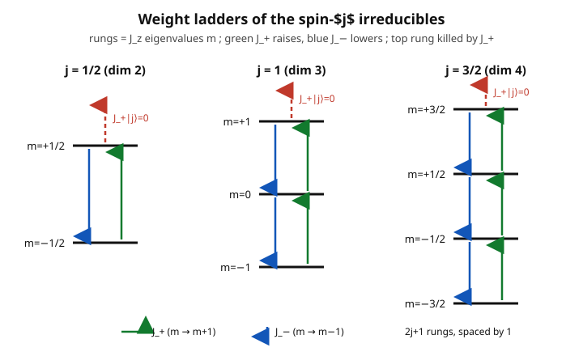

# Group & Representation Theory · Lesson 4.4: Representations of $\mathfrak{su}(2)$ — angular momentum

> ⏱ ~15 min · Module 4: Lie groups and Lie algebras · Builds on: [4.3 $SU(2)$, $SO(3)$, and the double cover](04-03-su2-so3-double-cover.md), [4.2 Lie algebras and the exponential map](04-02-lie-algebras-exponential-map.md), [1.5 Schur's lemma](01-05-schur-lemma.md) · Unlocks: [4.5 Adding angular momenta](04-05-adding-angular-momenta.md)

## Why this matters

This is the crown jewel of the course, and one of the great "the math *is* the physics" moments in all of science. We are going to write down three commutation relations — nothing else, no coordinates, no wavefunctions — and out of them, by pure algebra, will fall **every possible quantum angular momentum**: the allowed values $j = 0, \tfrac12, 1, \tfrac32, \dots$, the spectrum of spin, the $(2j+1)$-fold multiplets you see in the periodic table and in every spectroscopy experiment, and the exact matrix elements physicists look up in tables. When a quantum mechanics course "derives the angular momentum spectrum," this lesson is what it is secretly doing: **classifying the irreducible representations of $\mathfrak{su}(2)$.** Symmetry, run through Schur's lemma, dictates what nature is allowed to do.

## The idea

We met $\mathfrak{su}(2)$ in [4.2](04-02-lie-algebras-exponential-map.md) as a 3-dimensional Lie algebra — the tangent space to $SU(2)$ at the identity, spanned by three generators (the Pauli matrices over $2i$) closing under the bracket. A **representation** of the algebra is a way of realizing those three generators as operators $J_x, J_y, J_z$ on some vector space, respecting the brackets. Physically: $J_x, J_y, J_z$ are the components of angular momentum, the operators that generate rotations about the three axes.

The trouble is that $J_x, J_y, J_z$ don't commute, so you can't diagonalize all three at once — you can't sharply know all three components of a spin. The escape is a classic linear-algebra trick: **change to a better basis of operators.** Diagonalize just $J_z$ (pick one axis), and package the other two into raising and lowering operators
$$J_\pm = J_x \pm i J_y$$
that don't measure the spin but *step it up and down*, one unit at a time. The whole representation then organizes into a **ladder** of $J_z$-eigenstates, and the ladder must be finite — it has a top rung and a bottom rung. Chasing where the ladder is forced to stop is the entire derivation, and it is short.

## The formal version

**The algebra.** In the $J_z$/$J_\pm$ basis the $\mathfrak{su}(2)$ brackets become
$$[J_z, J_\pm] = \pm\,J_\pm, \qquad [J_+, J_-] = 2 J_z.$$
In words: $J_+$ and $J_-$ are eigen-operators of "commute-with-$J_z$" with eigenvalues $\pm 1$ — that is exactly what makes them raise and lower (below); and the raise/lower pair itself recloses on $J_z$. (These come straight from $[J_x,J_y]=iJ_z$ and cyclic permutations; expanding $J_\pm=J_x\pm iJ_y$ gives them in one line.)

**The Casimir.** Define
$$J^2 = J_x^2 + J_y^2 + J_z^2.$$
A direct check gives $[J^2, J_a] = 0$ for every generator $a\in\{x,y,z\}$ — $J^2$ is central. In words: **the total-length-squared operator commutes with all rotations.** By [Schur's lemma (1.5)](01-05-schur-lemma.md), an operator that commutes with every element of an *irreducible* representation must be a **scalar multiple of the identity.** So on each irreducible, $J^2 = \lambda\,I$ for a single number $\lambda$ — and that number *labels the irreducible.* This is Schur doing physics: it is *why* angular momentum comes in fixed-magnitude multiplets at all.

Two rewrites of the Casimir will do all the work (expand $J_\pm = J_x\pm iJ_y$ and use $[J_x,J_y]=iJ_z$):
$$J^2 = J_- J_+ + J_z^2 + J_z = J_+ J_- + J_z^2 - J_z.$$

**Ladder construction.** Work inside one irreducible. Diagonalize $J_z$; call its eigenvalues **weights** $m$, with $J_z\,|m\rangle = m\,|m\rangle$. Apply $J_+$ and use the first bracket:
$$J_z\big(J_+|m\rangle\big) = \big(J_+ J_z + [J_z,J_+]\big)|m\rangle = (m+1)\,J_+|m\rangle.$$
In words: $J_+|m\rangle$ is again a $J_z$-eigenstate, but with weight $m+1$ — **$J_+$ climbs the ladder by one, $J_-$ descends by one.** Since the space is finite-dimensional, the climb can't go forever: there is a **highest weight** $j$ with a top state $|j\rangle$ killed by the raising operator,
$$J_+\,|j\rangle = 0, \qquad J_z\,|j\rangle = j\,|j\rangle.$$

**Fixing the label.** Evaluate $J^2$ on the top state using the first rewrite (its $J_-J_+$ annihilates $|j\rangle$):
$$J^2|j\rangle = (J_- J_+ + J_z^2 + J_z)\,|j\rangle = \big(0 + j^2 + j\big)|j\rangle = j(j+1)\,|j\rangle \;\Rightarrow\; \boxed{\,J^2 = j(j+1)\,I\,}.$$

**Quantization.** Descend from $|j\rangle$ with $J_-$, generating weights $j, j-1, j-2, \dots$. This too must terminate: some bottom state $|m_{\min}\rangle$ has $J_-|m_{\min}\rangle = 0$. Evaluate $J^2$ there with the *second* rewrite ($J_+J_-$ kills it): $J^2 = m_{\min}^2 - m_{\min} = m_{\min}(m_{\min}-1)$. Setting this equal to $j(j+1)$ gives $m_{\min} = -j$. So the ladder runs from $+j$ to $-j$ in **integer steps**, which forces
$$j - (-j) = 2j \in \{0, 1, 2, \dots\} \;\Rightarrow\; j \in \left\{0,\ \tfrac12,\ 1,\ \tfrac32,\ 2,\ \dots\right\},$$
and the states $m = j, j-1, \dots, -j$ number exactly
$$\boxed{\,\dim(\text{spin-}j) = 2j+1\,}.$$

**Matrix elements.** With the standard (Condon–Shortley) phase convention — coefficients real and non-negative — the norm of $J_\pm|j,m\rangle$ is computed from the Casimir:
$$\|J_\pm|j,m\rangle\|^2 = \langle j,m|J_\mp J_\pm|j,m\rangle = \langle j,m|(J^2 - J_z^2 \mp J_z)|j,m\rangle = j(j+1) - m(m\pm 1),$$
giving the complete spin-$j$ irreducible:
$$\boxed{\;J_z|j,m\rangle = m\,|j,m\rangle, \qquad J_\pm|j,m\rangle = \sqrt{\,j(j+1) - m(m\pm 1)\,}\;|j,m\pm 1\rangle.\;}$$
In words: **the abstract algebra alone hands you the entire operator, entry by entry.** That is the whole quantum theory of angular momentum, and we built it without ever writing down a wavefunction.

## Picture

Each irreducible is one ladder: $2j+1$ rungs at heights $m = j, j-1, \dots, -j$, with $J_+$ climbing (green), $J_-$ descending (blue), and the top rung annihilated by $J_+$. The half-integer ladders ($j=\tfrac12, \tfrac32$) have rungs at half-integer heights — these are the spinors, invisible to $SO(3)$.

## Worked examples

**Example 1 — BOSS PROBLEM 4: the whole irreducible from three brackets.** *(Also Problem 🔴 below; the full argument is the four boxed steps above.)* Starting only from $[J_z,J_\pm]=\pm J_\pm$ and $[J_+,J_-]=2J_z$: the Casimir $J^2 = J_-J_+ + J_z^2 + J_z$ is central (Schur ⟹ scalar $j(j+1)$); a highest weight $j$ exists with $J_+|j\rangle=0$; the $J_-$-ladder closes at $-j$, forcing $2j\in\mathbb{Z}_{\ge0}$ and dimension $2j+1$; and the Casimir norm fixes $J_\pm|j,m\rangle = \sqrt{j(j+1)-m(m\pm1)}\,|j,m\pm1\rangle$. Reading off the physics dictionary: $J^2\to j(j+1)$ is the squared magnitude, $m$ is the measured $z$-component, and $2j+1$ is the multiplet size — precisely the quantum angular-momentum spectrum. **Half-integer $j$ (spin) has no classical analogue** and appears here as a purely algebraic possibility that nature actually uses.

**Example 2 — the two smallest reps explicitly.**

*Spin-$\tfrac12$ (the spinor, recovering [4.3](04-03-su2-so3-double-cover.md)).* Basis $\{|{\tfrac12,\tfrac12}\rangle, |{\tfrac12,-\tfrac12}\rangle\}$. Here $j(j+1)=\tfrac34$. From the formulas, $J_+|{\tfrac12,-\tfrac12}\rangle = \sqrt{\tfrac34 - (-\tfrac12)(\tfrac12)}\,|{\tfrac12,\tfrac12}\rangle = \sqrt{1}\,|{\tfrac12,\tfrac12}\rangle$, and $J_+|{\tfrac12,\tfrac12}\rangle=0$:
$$J_z = \tfrac12\begin{pmatrix}1&0\\0&-1\end{pmatrix},\quad J_+=\begin{pmatrix}0&1\\0&0\end{pmatrix},\quad J_-=\begin{pmatrix}0&0\\1&0\end{pmatrix}.$$
Then $J_x=\tfrac12(J_++J_-)=\tfrac12\begin{pmatrix}0&1\\1&0\end{pmatrix}$ and $J_y=\tfrac1{2i}(J_+-J_-)=\tfrac12\begin{pmatrix}0&-i\\i&0\end{pmatrix}$ — exactly $\tfrac12\sigma_x, \tfrac12\sigma_y, \tfrac12\sigma_z$, the Pauli matrices of [4.3](04-03-su2-so3-double-cover.md).

*Spin-$1$ (the vector rep).* Basis $\{|1,1\rangle,|1,0\rangle,|1,-1\rangle\}$, $j(j+1)=2$. Now $J_+|1,0\rangle=\sqrt{2-0}\,|1,1\rangle=\sqrt2\,|1,1\rangle$ and $J_+|1,-1\rangle=\sqrt{2-0}\,|1,0\rangle=\sqrt2\,|1,0\rangle$:
$$J_z=\begin{pmatrix}1&0&0\\0&0&0\\0&0&-1\end{pmatrix},\quad
J_+=\begin{pmatrix}0&\sqrt2&0\\0&0&\sqrt2\\0&0&0\end{pmatrix},\quad
J_-=\begin{pmatrix}0&0&0\\\sqrt2&0&0\\0&\sqrt2&0\end{pmatrix}.$$
Bracket check: $J_+J_- = \operatorname{diag}(2,2,0)$ and $J_-J_+=\operatorname{diag}(0,2,2)$, so $[J_+,J_-]=\operatorname{diag}(2,0,-2)=2J_z$. ✓ This 3-dimensional rep is the ordinary rotation of a vector in space (Problem 🟡 builds $J_x,J_y$ and checks $[J_x,J_y]=iJ_z$).

## Watch out

- **The magnitude is $\sqrt{j(j+1)}$, not $j$.** $J^2 = j(j+1)$, strictly bigger than $j^2$ (the biggest $J_z$ can be). The spin vector can never point fully along $z$ — if it did, $J_x$ and $J_y$ would both be zero and sharply known, violating $[J_x,J_y]=iJ_z$. This gap is the uncertainty principle for angular momentum, and it is why $j(j+1)$ (not $j^2$) is the fingerprint you match in spectra.
- **Half-integer $j$ is real but subtle.** The algebra permits $j=\tfrac12,\tfrac32,\dots$, and electrons use $j=\tfrac12$. But only **integer** $j$ descend to genuine representations of $SO(3)$; half-integer $j$ live only on the double cover $SU(2)$ ([4.3](04-03-su2-so3-double-cover.md)), picking up a $-1$ under a $2\pi$ rotation. "Orbital" angular momentum is integer; intrinsic "spin" can be half-integer.
- **$J_\pm$ are not observables.** They are not Hermitian ($J_\pm^\dagger = J_\mp$) and you never measure them — they are bookkeeping operators that move you along the ladder. The measurable rotation generators are the Hermitian combinations $J_x,J_y,J_z$.
- **Don't drop the phase convention.** $J_\pm|j,m\rangle = \sqrt{\dots}\,|j,m\pm1\rangle$ fixes only the *magnitude*; the standard choice makes these coefficients real and positive (Condon–Shortley). A different phase convention rescales basis vectors and is equally valid — just be consistent, or Clebsch–Gordan signs in [4.5](04-05-adding-angular-momenta.md) will fight you.

## One-liner

> Three commutation relations, run through Schur's lemma and a ladder that must terminate, force angular momentum to come in $(2j+1)$-dimensional multiplets with $j=0,\tfrac12,1,\dots$ and $J^2=j(j+1)$ — the quantum spectrum of spin, derived from symmetry alone.

## Problems

**P1 (🟢)** Consider the spin-$j$ irreducible with $j=2$. (a) List the $J_z$ eigenvalues and give the dimension. (b) Compute the matrix element $\langle 2,2|\,J_+\,|2,1\rangle$ using $\sqrt{j(j+1)-m(m+1)}$.

**P2 (🟡)** From the spin-$1$ matrices in Example 2, form $J_x=\tfrac12(J_++J_-)$ and $J_y=\tfrac1{2i}(J_+-J_-)$ explicitly as $3\times3$ matrices, and verify $[J_x,J_y]=iJ_z$.

**P3 (🔴, BOSS PROBLEM 4)** Starting from *only* $[J_z,J_\pm]=\pm J_\pm$ and $[J_+,J_-]=2J_z$, construct the general spin-$j$ irreducible: (a) show $J^2=J_-J_+ + J_z^2 + J_z$ is central and hence (Schur) a scalar; (b) using a highest-weight state, show $J^2=j(j+1)$; (c) show the ladder terminates at $m=-j$, forcing $2j\in\mathbb{Z}_{\ge0}$ and dimension $2j+1$; (d) derive $J_\pm|j,m\rangle=\sqrt{j(j+1)-m(m\pm1)}\,|j,m\pm1\rangle$. Then state the dictionary to the quantum angular-momentum spectrum.

Solutions

**P1** (a) $J_z$ eigenvalues are $m = 2, 1, 0, -1, -2$ — the integers from $+j$ to $-j$. Dimension $= 2j+1 = 5$. (b) With $j=2$ (so $j(j+1)=6$) and $m=1$: $\langle 2,2|J_+|2,1\rangle = \sqrt{6 - (1)(2)} = \sqrt{4} = 2$. (The matrix element sits on the super-diagonal connecting $m=1$ to $m=2$.)

**P2** Add and subtract the Example-2 matrices:
$$J_x = \tfrac12(J_++J_-) = \frac{1}{\sqrt2}\begin{pmatrix}0&1&0\\1&0&1\\0&1&0\end{pmatrix}, \qquad
J_y = \tfrac1{2i}(J_+-J_-) = \frac{1}{\sqrt2}\begin{pmatrix}0&-i&0\\i&0&-i\\0&i&0\end{pmatrix}.$$
(Each nonzero entry is $\tfrac12\cdot\sqrt2 = \tfrac1{\sqrt2}$.) Write $J_x=\tfrac1{\sqrt2}A$, $J_y=\tfrac1{\sqrt2}B$; then $[J_x,J_y]=\tfrac12(AB-BA)$. Computing the products,
$$AB=\begin{pmatrix}i&0&-i\\0&0&0\\i&0&-i\end{pmatrix},\qquad
BA=\begin{pmatrix}-i&0&-i\\0&0&0\\i&0&i\end{pmatrix},\qquad
AB-BA=\begin{pmatrix}2i&0&0\\0&0&0\\0&0&-2i\end{pmatrix}.$$
Hence $[J_x,J_y]=\tfrac12(AB-BA)=\operatorname{diag}(i,0,-i)=i\operatorname{diag}(1,0,-1)=iJ_z.$ ✓

**P3** *(a)* Expanding $J_\pm=J_x\pm iJ_y$ and using $[J_x,J_y]=iJ_z$,
$$J_-J_+ = (J_x-iJ_y)(J_x+iJ_y) = J_x^2+J_y^2 + i[J_x,J_y] = J_x^2+J_y^2 - J_z,$$
so $J_-J_+ + J_z^2 + J_z = J_x^2+J_y^2+J_z^2 = J^2$. To see $J^2$ is central, use the Jacobi/bracket rules: e.g. $[J^2,J_z]=[J_x^2,J_z]+[J_y^2,J_z]$. Now $[J_x^2,J_z]=J_x[J_x,J_z]+[J_x,J_z]J_x = J_x(-iJ_y)+(-iJ_y)J_x = -i(J_xJ_y+J_yJ_x)$, and $[J_y^2,J_z]=J_y(iJ_x)+(iJ_x)J_y = +i(J_xJ_y+J_yJ_x)$; they cancel, so $[J^2,J_z]=0$. By the cyclic symmetry of the algebra the same holds for $J_x,J_y$, so $J^2$ commutes with every generator. On an irreducible, Schur's lemma ([1.5](01-05-schur-lemma.md)) then forces $J^2=\lambda I$ for a scalar $\lambda$.

*(b)* Finite dimension means $J_z$'s eigenvalues are bounded above; let $|j\rangle$ be a top eigenvector, $J_z|j\rangle=j|j\rangle$. Then $J_+|j\rangle$ would have weight $j+1$, impossible, so $J_+|j\rangle=0$. Apply $J^2=J_-J_+ + J_z^2 + J_z$:
$$\lambda|j\rangle = J^2|j\rangle = (0 + j^2 + j)|j\rangle \;\Rightarrow\; \lambda = j(j+1).$$

*(c)* Apply $J_-$ repeatedly: $[J_z,J_-]=-J_-$ gives states of weight $j,j-1,j-2,\dots$, each a $J_z$-eigenvector. Finiteness forces a bottom state $|m_{\min}\rangle$ with $J_-|m_{\min}\rangle=0$. Using the other rewrite $J^2=J_+J_-+J_z^2-J_z$ there: $\lambda = m_{\min}^2 - m_{\min}$. Set equal to $j(j+1)$: $m_{\min}^2-m_{\min}-j(j+1)=0$, whose roots are $m_{\min}=-j$ or $m_{\min}=j+1$; the second exceeds $j$ and is rejected, so $m_{\min}=-j$. The ladder runs $j, j-1,\dots,-j$ in unit steps, so $2j$ is a non-negative integer and there are $2j+1$ states.

*(d)* $J_\pm|j,m\rangle = c_\pm(m)|j,m\pm1\rangle$; the coefficient's modulus is
$$|c_\pm(m)|^2 = \langle j,m|J_\mp J_\pm|j,m\rangle = \langle j,m|(J^2-J_z^2\mp J_z)|j,m\rangle = j(j+1)-m^2\mp m = j(j+1)-m(m\pm1),$$
using $J_\mp = J_\pm^\dagger$ (the $J_a$ are Hermitian). Choosing $c_\pm(m)$ real and non-negative (Condon–Shortley),
$$J_\pm|j,m\rangle = \sqrt{j(j+1)-m(m\pm1)}\;|j,m\pm1\rangle.$$
(Consistency: at the top $m=j$, $j(j+1)-j(j+1)=0$ so $J_+|j,j\rangle=0$; at the bottom $m=-j$, $j(j+1)-(-j)(-j-1)=0$ so $J_-|j,-j\rangle=0$ — the ladder self-terminates. ✓)

*Dictionary.* $J^2\to j(j+1)$ is the squared total angular momentum, $J_z\to m$ is its measured $z$-component, the $2j+1$ ladder states are the magnetic sublevels of a multiplet, $J_\pm$ are the raising/lowering operators of spectroscopy, and half-integer $j$ is intrinsic spin. This is the standard quantum-mechanical angular-momentum spectrum, obtained here from the algebra alone.

## Flashback

**From [Lesson 4.3](04-03-su2-so3-double-cover.md) ($SU(2)$, $SO(3)$, and the double cover):** Using $\sigma_z^2 = I$, show that a rotation by angle $\theta$ about the $z$-axis, realized on a spin-$\tfrac12$ state, is $U(\theta) = \exp(-i\theta\sigma_z/2) = \cos\tfrac\theta2\,I - i\sin\tfrac\theta2\,\sigma_z$. Then evaluate $U(2\pi)$ and say what it reveals about the double cover.

Solution

Because $\sigma_z^2=I$, even powers of $\sigma_z$ are $I$ and odd powers are $\sigma_z$, so the exponential series splits exactly as $\cos/\sin$ (the same computation as $e^{i\theta}=\cos\theta+i\sin\theta$, with $\sigma_z$ playing the role of the imaginary unit's carrier):
$$\exp\!\left(-\tfrac{i\theta}{2}\sigma_z\right)=\sum_{k}\frac{1}{k!}\left(-\tfrac{i\theta}{2}\right)^k\sigma_z^k = \cos\tfrac\theta2\,I - i\sin\tfrac\theta2\,\sigma_z = \begin{pmatrix}e^{-i\theta/2}&0\\0&e^{+i\theta/2}\end{pmatrix}.$$
At $\theta=2\pi$: $U(2\pi)=\operatorname{diag}(e^{-i\pi},e^{i\pi})=\operatorname{diag}(-1,-1)=-I$. A full $2\pi$ rotation — the *identity* in $SO(3)$ — acts as $-I$ on the spinor, not $I$. You need $\theta=4\pi$ to return to $I$. That sign is the signature of the double cover: $SU(2)$ wraps $SO(3)$ twice, and half-integer-$j$ reps (like this $j=\tfrac12$) feel the difference, which is exactly why they exist only on $SU(2)$.

## Connections

- **Backward:** the three brackets are the $\mathfrak{su}(2)$ algebra of [4.2](04-02-lie-algebras-exponential-map.md), just rewritten in the $J_z/J_\pm$ basis; the spin-$\tfrac12$ rep *is* the Pauli/spinor construction of [4.3](04-03-su2-so3-double-cover.md); and the single step that makes the whole classification work — "$J^2$ commutes with everything, therefore it's a scalar" — is [Schur's lemma (1.5)](01-05-schur-lemma.md) applied to a Lie algebra. Every irreducible is labeled by that scalar $j(j+1)$.
- **Forward:** [4.5](04-05-adding-angular-momenta.md) tensors two of these ladders (spin-$j_1\otimes$ spin-$j_2$) and decomposes the result — the Clebsch–Gordan series, the $SU(2)$ face of the tensor machinery from [3.1](03-01-tensor-products.md). [4.6](04-06-roots-weights-su3.md) generalizes "weights on a ladder" to weight *diagrams* in two dimensions for $\mathfrak{su}(3)$, where the same highest-weight method classifies the reps behind the quark model.
- **Sideways (quantum mechanics):** this lesson *is* the angular-momentum chapter of the [`quantum-mechanics`](../../quantum-mechanics/syllabus.md) course — $J^2\to j(j+1)$, $J_z\to m$, the ladder operators $J_\pm$, the $(2j+1)$ magnetic sublevels, and spin as half-integer $j$ are all right here, derived from symmetry rather than from the Schrödinger equation. The Zeeman splitting of a level into $2j+1$ lines is literally the ladder made visible.
- **Sideways (particle physics):** $SU(2)$ is a gauge group of the Standard Model (weak isospin), and its representation theory — this exact ladder — governs how fields organize into multiplets in the [`qft`](../../qft/syllabus.md) course. The generalization to $SU(3)$ next lesson is the color/flavor symmetry of the strong interaction.
